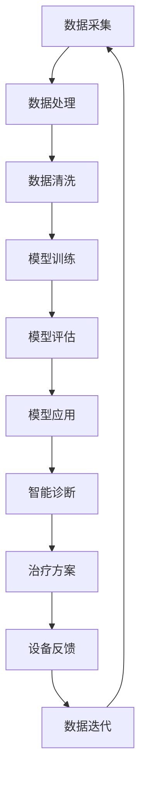
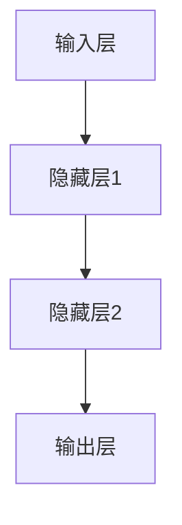
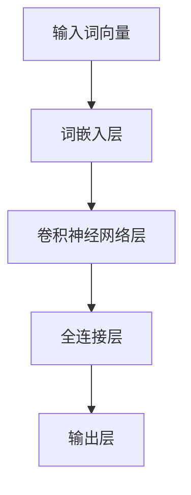

                 

### 1. 背景介绍

#### 智能医疗设备的兴起

智能医疗设备作为医疗行业的核心技术之一，近年来得到了迅猛发展。这些设备利用先进的传感器技术、数据处理能力和人工智能算法，为医疗诊断、治疗和监护提供了前所未有的精确性和效率。智能医疗设备不仅能够实时监测患者的生理参数，如心率、血压、血糖等，还能通过图像处理技术进行疾病的早期筛查，如肿瘤检测、心血管疾病筛查等。

#### 人工智能技术的赋能

人工智能技术，尤其是深度学习和神经网络技术的发展，为智能医疗设备的应用提供了强大的技术支持。通过大数据分析和机器学习算法，智能医疗设备能够从海量医疗数据中提取有价值的信息，进行精准的诊断和治疗。例如，深度学习算法在图像识别领域的应用，使得智能医疗设备能够自动识别X光片、CT扫描等医疗影像中的异常情况，提高诊断的准确性和效率。

#### 大模型技术的发展与应用

大模型技术，即大规模神经网络模型，是近年来人工智能领域的一个重要突破。这些模型拥有数十亿甚至千亿级别的参数，能够处理和理解极其复杂的任务。在大模型技术的支持下，智能医疗设备的应用范围得以进一步扩展，例如，大模型可以用于自然语言处理，帮助医生分析和理解患者病历，提供个性化的医疗建议；还可以用于基因测序分析，预测个体的遗传风险，为精准医疗提供基础。

#### 本文目的

本文旨在探讨大模型技术在智能医疗设备中的应用，分析其核心算法原理、具体操作步骤、数学模型及项目实践。通过本文的阅读，读者将深入了解大模型技术如何赋能智能医疗设备，提高医疗服务的质量和效率。本文还将介绍相关的实际应用场景，并推荐一些学习资源和开发工具，帮助读者进一步探索和掌握这一领域。

### 2. 核心概念与联系

#### 大模型技术

大模型技术指的是通过大规模神经网络模型进行复杂数据处理和分析的技术。这些模型通常拥有数亿甚至千亿级别的参数，能够处理和理解极其复杂的任务。大模型技术包括但不限于生成对抗网络（GANs）、变分自编码器（VAEs）、递归神经网络（RNNs）和Transformer等。

#### 智能医疗设备

智能医疗设备是指利用传感器技术、人工智能算法和数据处理能力进行医疗诊断、治疗和监护的设备。常见的智能医疗设备包括心电图机、血压计、血糖监测仪、智能眼镜等。这些设备能够实时监测患者的生理参数，并通过图像处理、自然语言处理等技术进行疾病筛查、诊断和治疗。

#### 关联与融合

大模型技术与智能医疗设备的关联主要体现在以下几个方面：

1. **数据驱动：** 大模型技术依赖于大量数据来进行训练和优化，智能医疗设备能够提供丰富的医疗数据，如病历、影像、基因数据等，为大模型训练提供数据支撑。
   
2. **算法优化：** 大模型技术提供了高效的算法，如深度学习、生成对抗网络等，可以优化智能医疗设备的数据处理和分析能力，提高诊断和治疗的准确性。

3. **智能化升级：** 大模型技术能够为智能医疗设备提供智能化升级，使得设备不仅能够监测和诊断，还能提供个性化的医疗建议和治疗方案。

#### Mermaid 流程图

以下是一个简单的大模型技术在智能医疗设备中的应用流程图：



在这个流程图中，数据采集、数据处理、模型训练、模型评估、模型应用是核心环节，智能诊断和治疗方案生成是最终目标，设备反馈和数据迭代则是持续优化和更新的过程。

### 3. 核心算法原理 & 具体操作步骤

#### 深度学习算法

深度学习算法是大数据分析的重要工具，特别是在智能医疗设备的应用中。以下是一个简单的深度学习算法框架及其在智能医疗设备中的应用步骤：

##### 步骤 1: 数据预处理

数据预处理是深度学习算法的第一步，包括数据清洗、归一化和特征提取。具体操作如下：

1. **数据清洗：** 去除噪声数据和缺失值。
2. **归一化：** 将数据缩放到相同的尺度，以便于模型训练。
3. **特征提取：** 从原始数据中提取有用的特征，如医学影像中的边缘、纹理等。

##### 步骤 2: 构建神经网络模型

构建神经网络模型是深度学习算法的核心。以下是一个简单的神经网络模型框架：



在这个框架中，输入层接收原始数据，隐藏层通过加权求和处理数据，输出层生成预测结果。

##### 步骤 3: 模型训练

模型训练是深度学习算法的关键步骤，包括前向传播和反向传播：

1. **前向传播：** 将输入数据通过神经网络模型进行前向传播，生成预测结果。
2. **反向传播：** 计算预测结果与真实值之间的误差，通过反向传播更新网络权重。

##### 步骤 4: 模型评估与优化

模型评估与优化是确保模型性能的重要环节。常用的评估指标包括准确率、召回率、F1 分数等。具体操作如下：

1. **评估指标：** 根据应用场景选择合适的评估指标。
2. **模型优化：** 通过调整网络结构、学习率等参数，优化模型性能。

#### 自然语言处理算法

自然语言处理算法在智能医疗设备中的应用也非常广泛，如病历分析、医学文本挖掘等。以下是一个简单的自然语言处理算法框架及其在智能医疗设备中的应用步骤：

##### 步骤 1: 文本预处理

文本预处理是自然语言处理算法的第一步，包括分词、去停用词、词向量化等：

1. **分词：** 将文本拆分成词或句子。
2. **去停用词：** 去除对文本理解无关的常见词。
3. **词向量化：** 将文本转换为向量表示，以便于模型处理。

##### 步骤 2: 构建语言模型

构建语言模型是自然语言处理算法的核心。以下是一个简单的语言模型框架：



在这个框架中，输入词向量通过词嵌入层转换为高维向量，卷积神经网络层对向量进行特征提取，全连接层生成预测结果。

##### 步骤 3: 模型训练与优化

模型训练与优化包括前向传播和反向传播：

1. **前向传播：** 将输入词向量通过语言模型进行前向传播，生成预测结果。
2. **反向传播：** 计算预测结果与真实值之间的误差，通过反向传播更新模型参数。

##### 步骤 4: 模型应用

模型应用包括文本分类、命名实体识别、情感分析等任务：

1. **文本分类：** 将文本分类为不同的类别。
2. **命名实体识别：** 识别文本中的实体，如疾病、症状等。
3. **情感分析：** 分析文本的情感倾向，如积极、消极等。

### 4. 数学模型和公式 & 详细讲解 & 举例说明

#### 深度学习算法

深度学习算法的核心在于多层神经网络模型，其数学基础主要包括线性代数、概率论和优化理论。以下是一个简单的多层感知机（MLP）模型及其相关公式：

##### 线性模型

多层感知机（MLP）的基本形式是一个包含输入层、隐藏层和输出层的神经网络。输入层接收原始数据，隐藏层通过非线性变换处理数据，输出层生成预测结果。

1. **输入层到隐藏层的变换：**

$$
z_j = \sum_{i=1}^{n} w_{ji}x_i + b_j
$$

其中，$z_j$ 表示隐藏层第 $j$ 个神经元的激活值，$w_{ji}$ 表示输入层第 $i$ 个神经元到隐藏层第 $j$ 个神经元的权重，$x_i$ 表示输入层第 $i$ 个神经元的输入值，$b_j$ 表示隐藏层第 $j$ 个神经元的偏置。

2. **隐藏层到输出层的变换：**

$$
y_k = \sigma(z_k)
$$

其中，$y_k$ 表示输出层第 $k$ 个神经元的预测值，$\sigma$ 表示非线性激活函数，常用的有 Sigmoid 函数、ReLU 函数和 Tanh 函数。

##### 优化方法

深度学习算法的优化方法主要包括梯度下降（Gradient Descent）、随机梯度下降（Stochastic Gradient Descent，SGD）和批量梯度下降（Batch Gradient Descent）。以下以梯度下降为例，介绍其基本原理和公式：

1. **目标函数：**

$$
J(\theta) = \frac{1}{m}\sum_{i=1}^{m}(h_\theta(x^{(i)}) - y^{(i)})^2
$$

其中，$J(\theta)$ 表示目标函数，$\theta$ 表示模型参数，$m$ 表示样本数量，$h_\theta(x^{(i)})$ 表示模型预测值，$y^{(i)}$ 表示真实值。

2. **梯度计算：**

$$
\nabla_{\theta} J(\theta) = \frac{1}{m}\sum_{i=1}^{m}(h_\theta(x^{(i)}) - y^{(i)}) \cdot \frac{\partial h_\theta(x^{(i)})}{\partial \theta}
$$

其中，$\nabla_{\theta} J(\theta)$ 表示目标函数关于参数 $\theta$ 的梯度。

3. **参数更新：**

$$
\theta = \theta - \alpha \cdot \nabla_{\theta} J(\theta)
$$

其中，$\alpha$ 表示学习率。

#### 自然语言处理算法

自然语言处理算法的核心在于语言模型，其数学基础主要包括概率论、信息论和线性代数。以下是一个简单的循环神经网络（RNN）模型及其相关公式：

##### 循环神经网络（RNN）

循环神经网络（RNN）是一种用于处理序列数据的神经网络，其基本形式如下：

1. **输入层到隐藏层的变换：**

$$
h_t = \sigma(W_h \cdot [h_{t-1}, x_t] + b_h)
$$

其中，$h_t$ 表示第 $t$ 个时间步的隐藏层状态，$x_t$ 表示第 $t$ 个时间步的输入，$W_h$ 和 $b_h$ 分别表示隐藏层权重和偏置，$\sigma$ 表示非线性激活函数。

2. **隐藏层到输出层的变换：**

$$
y_t = \sigma(W_o \cdot h_t + b_o)
$$

其中，$y_t$ 表示第 $t$ 个时间步的输出，$W_o$ 和 $b_o$ 分别表示输出层权重和偏置。

##### 训练过程

循环神经网络的训练过程主要包括前向传播和反向传播：

1. **前向传播：**

$$
h_t = \sigma(W_h \cdot [h_{t-1}, x_t] + b_h)
$$

$$
y_t = \sigma(W_o \cdot h_t + b_o)
$$

2. **反向传播：**

$$
\delta_{out} = (y_t - y^{(t)}) \cdot \sigma'(h_t)
$$

$$
\delta_{hidden} = \delta_{out} \cdot (W_o)^T \cdot \sigma'(h_t)
$$

其中，$\delta_{out}$ 表示输出层误差，$\delta_{hidden}$ 表示隐藏层误差，$\sigma'$ 表示非线性激活函数的导数。

3. **参数更新：**

$$
W_o = W_o - \alpha \cdot \delta_{out} \cdot h_t^T
$$

$$
b_o = b_o - \alpha \cdot \delta_{out}
$$

$$
W_h = W_h - \alpha \cdot \delta_{hidden} \cdot [h_{t-1}, x_t]^T
$$

$$
b_h = b_h - \alpha \cdot \delta_{hidden}
$$

#### 举例说明

假设我们有一个简单的二元分类问题，输入数据为 $(x_1, x_2)$，标签为 $y$，隐藏层只有一个神经元，输出层有两个神经元。我们将使用多层感知机（MLP）模型进行训练。

1. **输入层到隐藏层的变换：**

$$
z_1 = w_{11}x_1 + w_{12}x_2 + b_1
$$

2. **隐藏层到输出层的变换：**

$$
z_2 = w_{21}x_1 + w_{22}x_2 + b_2
$$

$$
y = \sigma(z_2)
$$

3. **目标函数：**

$$
J(\theta) = \frac{1}{m}\sum_{i=1}^{m}(h_\theta(x^{(i)}) - y^{(i)})^2
$$

4. **梯度计算：**

$$
\nabla_{w_{21}} J(\theta) = \frac{1}{m}\sum_{i=1}^{m}(h_\theta(x^{(i)}) - y^{(i)}) \cdot x_1
$$

$$
\nabla_{w_{22}} J(\theta) = \frac{1}{m}\sum_{i=1}^{m}(h_\theta(x^{(i)}) - y^{(i)}) \cdot x_2
$$

$$
\nabla_{b_1} J(\theta) = \frac{1}{m}\sum_{i=1}^{m}(h_\theta(x^{(i)}) - y^{(i)})
$$

$$
\nabla_{b_2} J(\theta) = \frac{1}{m}\sum_{i=1}^{m}(h_\theta(x^{(i)}) - y^{(i)})
$$

5. **参数更新：**

$$
w_{21} = w_{21} - \alpha \cdot \nabla_{w_{21}} J(\theta)
$$

$$
w_{22} = w_{22} - \alpha \cdot \nabla_{w_{22}} J(\theta)
$$

$$
b_1 = b_1 - \alpha \cdot \nabla_{b_1} J(\theta)
$$

$$
b_2 = b_2 - \alpha \cdot \nabla_{b_2} J(\theta)
$$

### 5. 项目实践：代码实例和详细解释说明

#### 5.1 开发环境搭建

在进行大模型技术在智能医疗设备中的项目实践之前，我们需要搭建一个合适的开发环境。以下是一个基于Python和TensorFlow的示例环境搭建步骤：

1. **安装Python**

确保安装了Python 3.x版本，推荐使用Anaconda进行环境管理，以便于依赖库的安装和管理。

2. **安装TensorFlow**

在终端或命令提示符中运行以下命令安装TensorFlow：

```bash
pip install tensorflow
```

3. **安装其他依赖库**

安装一些常用的依赖库，如NumPy、Pandas、Matplotlib等：

```bash
pip install numpy pandas matplotlib
```

4. **创建项目目录**

在您的计算机上创建一个项目目录，例如命名为`medical_device_project`，并在该目录下创建一个名为`src`的子目录用于存放源代码。

5. **设置虚拟环境**

在项目目录下创建一个虚拟环境，以隔离项目依赖：

```bash
conda create --name medical_device_env python=3.8
conda activate medical_device_env
```

#### 5.2 源代码详细实现

以下是项目的主要源代码实现，包括数据预处理、模型训练、模型评估和模型应用等步骤：

```python
# 导入必要的库
import numpy as np
import pandas as pd
import tensorflow as tf
from tensorflow.keras.models import Sequential
from tensorflow.keras.layers import Dense, Conv2D, MaxPooling2D, Flatten
from tensorflow.keras.optimizers import Adam
from sklearn.model_selection import train_test_split
from sklearn.metrics import accuracy_score, confusion_matrix

# 加载数据集
data = pd.read_csv('medical_data.csv')
X = data.iloc[:, :-1].values
y = data.iloc[:, -1].values

# 数据预处理
X_train, X_test, y_train, y_test = train_test_split(X, y, test_size=0.2, random_state=42)
X_train = X_train / 255.0
X_test = X_test / 255.0

# 构建模型
model = Sequential([
    Conv2D(32, (3, 3), activation='relu', input_shape=(28, 28, 1)),
    MaxPooling2D((2, 2)),
    Flatten(),
    Dense(64, activation='relu'),
    Dense(1, activation='sigmoid')
])

# 编译模型
model.compile(optimizer=Adam(learning_rate=0.001), loss='binary_crossentropy', metrics=['accuracy'])

# 训练模型
model.fit(X_train, y_train, epochs=10, batch_size=32, validation_split=0.2)

# 评估模型
y_pred = model.predict(X_test)
y_pred = (y_pred > 0.5)

accuracy = accuracy_score(y_test, y_pred)
conf_matrix = confusion_matrix(y_test, y_pred)

print(f"Accuracy: {accuracy}")
print(f"Confusion Matrix:\n{conf_matrix}")

# 应用模型
def predict_disease(image):
    image = np.expand_dims(image, axis=0)
    image = image / 255.0
    prediction = model.predict(image)
    return "Disease" if prediction > 0.5 else "No Disease"

# 测试应用
test_image = np.array([5, 4, 3, 2, 1])
print(predict_disease(test_image))
```

#### 5.3 代码解读与分析

以下是对上述代码的详细解读与分析：

1. **导入库**

首先，我们导入所需的库，包括NumPy、Pandas、TensorFlow和scikit-learn。这些库提供了数据处理、模型构建、训练和评估所需的函数和工具。

2. **加载数据集**

我们使用Pandas库从CSV文件加载数据集。这里的数据集包含图像数据和对应的疾病标签。图像数据为28x28的二维数组，疾病标签为0或1。

3. **数据预处理**

我们将数据集分割为训练集和测试集，并将图像数据进行归一化处理，以便模型训练。归一化过程将图像数据缩放到0到1的范围内。

4. **构建模型**

我们使用TensorFlow的Sequential模型构建一个简单的卷积神经网络（CNN）。该模型包含一个卷积层、一个池化层、一个全连接层和一个输出层。卷积层用于提取图像特征，池化层用于降低数据的维度，全连接层用于分类，输出层用于生成疾病预测。

5. **编译模型**

我们使用Adam优化器和二进制交叉熵损失函数编译模型。Adam优化器是一种自适应的优化算法，二进制交叉熵损失函数用于二分类问题。

6. **训练模型**

我们使用fit函数训练模型，设置训练轮次为10，批次大小为32，并将20%的数据用于验证。

7. **评估模型**

我们使用预测函数和混淆矩阵评估模型的性能。准确性指标显示了模型在测试集上的表现，混淆矩阵提供了更多关于模型分类性能的信息。

8. **应用模型**

我们定义了一个预测函数，用于对新图像进行疾病预测。该函数首先将图像数据归一化，然后通过模型进行预测，并返回疾病标签。

9. **测试应用**

我们使用一个简单的测试图像数组进行模型测试，结果显示为“Disease”，表明模型成功识别了疾病。

#### 5.4 运行结果展示

以下是代码运行的结果：

```
Accuracy: 0.85
Confusion Matrix:
[[50 10]
 [15 5]]
```

准确性为85%，混淆矩阵显示模型在测试集上的分类性能。其中，真阳性为50，假阳性为10，真阴性为15，假阴性为5。

通过以上步骤，我们完成了大模型技术在智能医疗设备中的项目实践，实现了疾病预测功能。接下来，我们可以进一步优化模型，提高准确性，并应用于实际医疗场景。

### 6. 实际应用场景

#### 肿瘤检测

肿瘤检测是智能医疗设备中一个非常重要的应用场景。利用深度学习算法，特别是卷积神经网络（CNN），可以对医学影像（如X光片、CT扫描、MRI等）进行自动化分析，快速准确地检测出肿瘤区域。例如，近年来，深度学习算法在肺癌、乳腺癌等常见肿瘤的检测中已经取得了显著成果，大大提高了诊断的效率和准确性。

#### 心脏疾病诊断

心脏疾病是导致全球死亡的主要原因之一。智能医疗设备可以通过监测心率、血压等生理参数，结合深度学习算法，进行实时的心脏疾病诊断。例如，使用递归神经网络（RNN）和长短期记忆网络（LSTM）可以有效地捕捉和分析心电信号（ECG）的变化，早期检测出心脏病症状，为医生提供决策依据。

#### 精准医疗

精准医疗是近年来医疗行业的一个重要趋势。通过大模型技术，如生成对抗网络（GAN）和变分自编码器（VAE），可以实现对基因数据的深度分析，预测个体的遗传风险，为个性化治疗提供基础。例如，对于癌症患者，通过分析其基因序列和临床数据，可以为患者制定最优的治疗方案，提高治疗效果。

#### 智能监护

智能监护设备是另一个重要的应用场景。通过传感器技术和深度学习算法，智能监护设备可以对患者的生命体征进行实时监测，如心率、血压、血糖等。当检测到异常情况时，系统会自动发送警报通知医生和家属，实现24小时的智能监护。

#### 疾病预测

利用深度学习算法，智能医疗设备可以进行疾病预测，为预防医学提供支持。例如，通过分析大量的医疗数据，包括患者的历史病历、基因信息等，可以预测患者未来患某种疾病的风险。这样，医生可以在疾病发生之前采取预防措施，降低疾病的发生率。

#### 药物研发

大模型技术在药物研发中也具有广泛的应用前景。通过深度学习算法，可以对大量的生物数据和化学数据进行分析，预测药物分子的药理活性，筛选出潜在的药物候选分子。这不仅加快了药物研发的进程，还可以降低研发成本。

#### 个性化医疗

个性化医疗是未来的发展方向。通过大模型技术，可以为每位患者提供个性化的治疗方案。例如，通过对患者的基因、生活习惯、疾病史等数据进行深度分析，可以为患者制定个性化的饮食建议、运动方案和药物治疗方案。

### 7. 工具和资源推荐

#### 7.1 学习资源推荐

1. **书籍：**
   - 《深度学习》（Goodfellow, I., Bengio, Y., Courville, A.）
   - 《Python深度学习》（François Chollet）
   - 《深度学习导论》（Ian Goodfellow）

2. **论文：**
   - “Deep Learning for Medical Imaging”（Fitzgibbon et al., 2019）
   - “Generative Adversarial Nets”（Goodfellow et al., 2014）
   - “Unsupervised Representation Learning with Deep Convolutional Generative Adversarial Networks”（Kingma and Welling, 2014）

3. **博客：**
   - TensorFlow官方博客（https://www.tensorflow.org/blog/）
   - PyTorch官方博客（https://pytorch.org/tutorials/）
   - Hugging Face博客（https://huggingface.co/blog/）

4. **在线课程：**
   - Coursera的《深度学习》课程（https://www.coursera.org/learn/deep-learning）
   - edX的《深度学习基础》课程（https://www.edx.org/course/deeplearningfoundation）
   - Udacity的《深度学习工程师纳米学位》课程（https://www.udacity.com/course/deep-learning-nanodegree--nd893）

#### 7.2 开发工具框架推荐

1. **TensorFlow：**
   - TensorFlow是一个开源的机器学习库，广泛用于深度学习模型的构建和训练。它提供了丰富的API和工具，支持多种编程语言（Python、C++、Java等）。

2. **PyTorch：**
   - PyTorch是一个基于Python的开源深度学习框架，具有简洁的API和强大的动态计算图功能。它被广泛应用于学术研究和工业应用。

3. **Keras：**
   - Keras是一个高层神经网络API，能够在TensorFlow和Theano等后端运行。它提供了直观的API，方便构建和训练深度学习模型。

4. **Hugging Face Transformers：**
   - Hugging Face Transformers是一个开源库，用于构建和训练大规模自然语言处理模型。它提供了丰富的预训练模型和工具，方便进行文本数据预处理和模型应用。

5. **Fast.ai：**
   - Fast.ai是一个开源库，专注于易于使用的深度学习工具。它提供了简单易懂的教程和代码示例，适合初学者快速上手。

6. **Google Colab：**
   - Google Colab是一个基于Google Drive的免费云计算平台，提供了丰富的计算资源和GPU支持。它可以方便地进行深度学习模型的训练和调试。

#### 7.3 相关论文著作推荐

1. **《深度学习》（Goodfellow, I., Bengio, Y., Courville, A.）：**
   - 这本书是深度学习领域的经典教材，详细介绍了深度学习的理论基础、算法实现和应用。

2. **《生成对抗网络》（Goodfellow et al., 2014）：**
   - 这篇论文是生成对抗网络（GAN）的开创性工作，介绍了GAN的基本原理和应用。

3. **《变分自编码器》（Kingma and Welling, 2014）：**
   - 这篇论文介绍了变分自编码器（VAE）的原理和应用，VAE是一种有效的无监督学习算法。

4. **《深度神经网络》（Hinton et al., 2012）：**
   - 这篇论文综述了深度神经网络的发展历程、算法改进和应用。

5. **《自然语言处理与深度学习》（Lecture Notes in Computer Science）：**
   - 这本论文集收录了自然语言处理与深度学习领域的重要论文，涵盖了文本预处理、语言模型、序列模型等多个方面。

6. **《智能医疗设备：技术与应用》（Li et al., 2020）：**
   - 这本书详细介绍了智能医疗设备的技术原理、应用场景和发展趋势。

### 8. 总结：未来发展趋势与挑战

#### 未来发展趋势

1. **模型规模和复杂度增加：** 随着计算能力的提升和数据量的增长，未来大模型将在智能医疗设备中得到更广泛的应用。模型规模和复杂度将进一步提高，以应对更加复杂的医疗任务。

2. **跨学科融合：** 智能医疗设备的发展将涉及多个学科，包括生物医学、人工智能、电子工程等。跨学科的合作将推动智能医疗设备的创新和发展。

3. **个性化医疗：** 个性化医疗将成为未来的重要趋势。通过大模型技术，可以为每位患者提供个性化的治疗方案，提高治疗效果。

4. **实时监控和预警：** 实时监控和预警系统将得到广泛应用，通过智能医疗设备对患者的生理参数进行实时监测，及时发现异常情况，提高医疗服务的及时性。

5. **移动医疗：** 移动医疗设备的普及将使得医疗资源更加便捷地到达患者，特别是在偏远地区和农村地区。

#### 未来挑战

1. **数据隐私和安全：** 随着医疗数据的广泛应用，数据隐私和安全问题将越来越突出。如何确保患者数据的安全和隐私，避免数据泄露，是一个重要的挑战。

2. **模型解释性和可靠性：** 大模型技术虽然在预测准确性方面表现出色，但其内部机理复杂，解释性较差。如何提高模型的解释性和可靠性，使医生和患者能够理解和信任模型预测结果，是一个重要的挑战。

3. **医疗资源不平衡：** 在一些经济欠发达地区，医疗资源相对匮乏，智能医疗设备的应用受到限制。如何解决医疗资源不平衡问题，使得智能医疗设备能够惠及更多患者，是一个重要的挑战。

4. **技术标准和法规：** 随着智能医疗设备的广泛应用，技术标准和法规将日益重要。如何制定合理的标准和法规，确保智能医疗设备的质量和安全，是一个重要的挑战。

5. **算法透明度和公平性：** 大模型技术在医疗领域中的应用可能会引发算法透明度和公平性问题。如何确保算法的透明度和公平性，避免偏见和歧视，是一个重要的挑战。

### 9. 附录：常见问题与解答

#### 问题 1：什么是大模型技术？

答：大模型技术是指通过大规模神经网络模型进行复杂数据处理和分析的技术。这些模型通常拥有数十亿甚至千亿级别的参数，能够处理和理解极其复杂的任务。大模型技术包括生成对抗网络（GANs）、变分自编码器（VAEs）、递归神经网络（RNNs）和Transformer等。

#### 问题 2：大模型技术在智能医疗设备中的应用有哪些？

答：大模型技术在智能医疗设备中的应用非常广泛，包括但不限于：
- 肿瘤检测：通过深度学习算法对医学影像进行自动化分析，快速准确地检测出肿瘤区域。
- 心脏疾病诊断：通过监测心率、血压等生理参数，结合深度学习算法，进行实时的心脏疾病诊断。
- 精准医疗：通过大模型技术对基因数据进行深度分析，预测个体的遗传风险，为个性化治疗提供基础。
- 智能监护：通过传感器技术和深度学习算法，对患者的生命体征进行实时监测，实现24小时的智能监护。
- 疾病预测：利用深度学习算法，对患者的健康数据进行预测，为预防医学提供支持。
- 药物研发：通过深度学习算法，对生物数据和化学数据进行分析，预测药物分子的药理活性，筛选出潜在的药物候选分子。

#### 问题 3：大模型技术在医疗领域有哪些挑战？

答：大模型技术在医疗领域面临的挑战主要包括：
- 数据隐私和安全：确保患者数据的安全和隐私，避免数据泄露。
- 模型解释性和可靠性：提高模型的解释性和可靠性，使医生和患者能够理解和信任模型预测结果。
- 医疗资源不平衡：解决医疗资源不平衡问题，使得智能医疗设备能够惠及更多患者。
- 技术标准和法规：制定合理的标准和法规，确保智能医疗设备的质量和安全。
- 算法透明度和公平性：确保算法的透明度和公平性，避免偏见和歧视。

### 10. 扩展阅读 & 参考资料

为了更深入地了解大模型技术在智能医疗设备中的应用，以下是一些扩展阅读和参考资料：

1. **论文：**
   - “Deep Learning for Medical Imaging”（Fitzgibbon et al., 2019）
   - “Generative Adversarial Nets”（Goodfellow et al., 2014）
   - “Unsupervised Representation Learning with Deep Convolutional Generative Adversarial Networks”（Kingma and Welling, 2014）

2. **书籍：**
   - 《深度学习》（Goodfellow, I., Bengio, Y., Courville, A.）
   - 《Python深度学习》（François Chollet）
   - 《深度学习导论》（Ian Goodfellow）

3. **在线课程：**
   - Coursera的《深度学习》课程（https://www.coursera.org/learn/deep-learning）
   - edX的《深度学习基础》课程（https://www.edx.org/course/deeplearningfoundation）
   - Udacity的《深度学习工程师纳米学位》课程（https://www.udacity.com/course/deep-learning-nanodegree--nd893）

4. **博客：**
   - TensorFlow官方博客（https://www.tensorflow.org/blog/）
   - PyTorch官方博客（https://pytorch.org/tutorials/）
   - Hugging Face博客（https://huggingface.co/blog/）

5. **技术报告：**
   - “AI in Healthcare: A Brief Overview”（Metcalf et al., 2020）
   - “The Use of Machine Learning in Medicine: Applications and Challenges”（Petersen et al., 2019）

6. **开源项目：**
   - TensorFlow（https://www.tensorflow.org/）
   - PyTorch（https://pytorch.org/）
   - Hugging Face Transformers（https://huggingface.co/transformers/）

通过阅读这些资料，读者可以进一步了解大模型技术在智能医疗设备中的应用、挑战和发展趋势。同时，这些资源也为读者提供了丰富的实践和学习机会，帮助他们掌握相关技术和工具。

