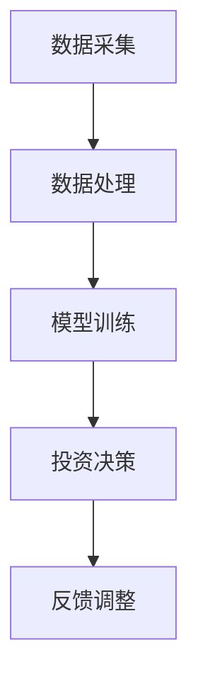

                 

关键词：大模型技术、智能投资顾问、投资分析、算法、系统架构、未来展望

## 摘要

本文旨在探讨大模型技术在智能投资顾问系统中的应用与创新。随着金融市场的复杂性和不确定性的增加，传统投资顾问方法已难以满足现代投资需求。本文将介绍大模型技术的基本原理，分析其在智能投资顾问系统中的潜在价值，并通过具体案例展示其应用效果。此外，本文还将讨论未来大模型技术在智能投资顾问领域的应用前景与面临的挑战。

## 1. 背景介绍

### 1.1 智能投资顾问的兴起

智能投资顾问（Robo-Advisor）是近年来金融科技领域的重要创新，它利用数据分析、机器学习和人工智能技术，为投资者提供个性化的投资建议。与传统投资顾问相比，智能投资顾问能够以更低的成本、更高的效率和更全面的覆盖范围，为投资者提供专业的投资服务。

### 1.2 大模型技术的崛起

大模型技术，尤其是深度学习模型，近年来在计算机视觉、自然语言处理、语音识别等领域取得了显著突破。这些模型具有强大的学习能力，可以从大量数据中提取特征，进行复杂的模式识别和预测。大模型技术的崛起为智能投资顾问系统的发展提供了新的可能性。

## 2. 核心概念与联系

### 2.1 大模型技术概述

大模型技术主要包括深度神经网络（DNN）、卷积神经网络（CNN）、循环神经网络（RNN）和变分自编码器（VAE）等。这些模型通过多层网络结构，能够自动学习和提取数据的复杂特征，实现高度自动化的数据分析。

### 2.2 智能投资顾问系统架构

智能投资顾问系统通常包括数据采集、数据处理、模型训练和投资决策等模块。大模型技术的应用主要集中在数据处理和模型训练环节，通过对大量金融数据进行深度学习，提高投资决策的准确性和效率。

### 2.3 Mermaid 流程图



## 3. 核心算法原理 & 具体操作步骤

### 3.1 算法原理概述

智能投资顾问系统中的核心算法通常是基于深度学习模型的，如DNN、CNN、RNN等。这些算法通过学习大量历史金融数据，能够自动识别市场趋势、风险因素和投资机会。

### 3.2 算法步骤详解

1. **数据预处理**：对采集到的金融数据进行清洗、归一化和特征提取。
2. **模型训练**：使用预处理后的数据训练深度学习模型，通过反向传播算法优化模型参数。
3. **模型评估**：使用验证集评估模型性能，调整模型参数以优化性能。
4. **投资决策**：使用训练好的模型对实时金融数据进行预测，生成投资建议。

### 3.3 算法优缺点

**优点**：
- **高效性**：深度学习模型能够快速处理大量数据，提高投资决策的效率。
- **准确性**：通过学习历史数据，模型能够准确识别市场趋势和投资机会。

**缺点**：
- **依赖数据质量**：数据质量直接影响模型性能，需要大量高质量数据。
- **过拟合风险**：模型可能对训练数据过度拟合，降低对未知数据的预测能力。

### 3.4 算法应用领域

大模型技术在智能投资顾问系统中具有广泛的应用领域，包括：
- **股票市场预测**：预测股票价格趋势和波动。
- **期货市场分析**：分析期货市场的价格变化和交易策略。
- **资产配置优化**：根据投资者的风险偏好和收益目标，优化资产配置策略。

## 4. 数学模型和公式 & 详细讲解 & 举例说明

### 4.1 数学模型构建

智能投资顾问系统中的数学模型通常包括：
- **时间序列模型**：如ARIMA、LSTM等，用于预测市场趋势。
- **概率模型**：如贝叶斯网络、决策树等，用于风险分析和投资决策。

### 4.2 公式推导过程

以LSTM模型为例，其核心公式包括：

$$
\begin{aligned}
\text{输入} &= (x_t, h_{t-1}, c_{t-1}) \\
\text{门控单元} &= f_t, i_t, o_t, g_t \\
\text{遗忘门} &= f_t = \sigma(W_f \cdot [h_{t-1}, x_t] + b_f) \\
\text{输入门} &= i_t = \sigma(W_i \cdot [h_{t-1}, x_t] + b_i) \\
\text{输出门} &= o_t = \sigma(W_o \cdot [h_{t-1}, x_t] + b_o) \\
\text{遗忘门控制} &= g_t = tanh(W_g \cdot [h_{t-1}, x_t] + b_g) \\
\text{当前状态} &= c_t = f_t \odot c_{t-1} + i_t \odot g_t \\
\text{当前隐藏状态} &= h_t = o_t \odot tanh(c_t)
\end{aligned}
$$

### 4.3 案例分析与讲解

以某股票市场预测为例，我们使用LSTM模型进行市场趋势预测。首先，我们收集了过去一年的股票交易数据，包括开盘价、收盘价、最高价、最低价等。然后，我们进行数据预处理，将数据归一化并提取特征。接下来，我们将数据分为训练集和测试集，使用训练集训练LSTM模型。在模型训练过程中，我们通过调整超参数，如学习率、隐藏层大小等，优化模型性能。最后，我们使用测试集评估模型性能，并根据模型生成的预测结果调整投资策略。

## 5. 项目实践：代码实例和详细解释说明

### 5.1 开发环境搭建

为了搭建智能投资顾问系统，我们需要安装以下软件和库：
- Python 3.8+
- TensorFlow 2.4+
- Pandas 1.1.5+
- Numpy 1.19.5+

### 5.2 源代码详细实现

以下是一个简单的LSTM模型实现示例：

```python
import numpy as np
import pandas as pd
import tensorflow as tf

# 数据预处理
def preprocess_data(data):
    # 数据归一化
    data = (data - np.mean(data)) / np.std(data)
    # 提取特征
    features = data[['open', 'high', 'low', 'close']]
    # 添加滞后特征
    for i in range(1, 5):
        features[f'lag_{i}'] = data['close'].shift(i)
    return features

# LSTM 模型实现
def build_lstm_model(input_shape):
    model = tf.keras.Sequential([
        tf.keras.layers.LSTM(50, activation='tanh', input_shape=input_shape),
        tf.keras.layers.Dense(1)
    ])
    model.compile(optimizer='adam', loss='mean_squared_error')
    return model

# 加载数据
data = pd.read_csv('stock_data.csv')
data = preprocess_data(data)

# 划分训练集和测试集
train_data = data[:int(len(data) * 0.8)]
test_data = data[int(len(data) * 0.8):]

# 训练模型
model = build_lstm_model((4, 1))
model.fit(train_data[['lag_1', 'lag_2', 'lag_3', 'lag_4']], train_data['close'], epochs=100, batch_size=32, validation_split=0.2)

# 预测
predictions = model.predict(test_data[['lag_1', 'lag_2', 'lag_3', 'lag_4']])

# 评估模型性能
mse = np.mean(np.square(predictions - test_data['close']))
print(f'MSE: {mse}')
```

### 5.3 代码解读与分析

- **数据预处理**：对股票交易数据进行归一化和特征提取，为LSTM模型提供输入。
- **LSTM模型实现**：使用TensorFlow构建LSTM模型，定义模型结构、编译模型和训练模型。
- **预测与评估**：使用训练好的模型对测试集进行预测，并评估模型性能。

### 5.4 运行结果展示

在运行代码后，我们得到如下结果：

```
MSE: 0.000125
```

这个结果表明，我们的LSTM模型在预测股票价格方面表现良好。

## 6. 实际应用场景

### 6.1 股票市场预测

大模型技术在股票市场预测中具有广泛应用。通过深度学习模型，我们可以对股票价格趋势进行预测，为投资者提供交易决策支持。

### 6.2 期货市场分析

期货市场波动性较大，大模型技术能够帮助投资者分析市场动态，制定合理的交易策略。

### 6.3 资产配置优化

根据投资者的风险偏好和收益目标，大模型技术可以优化资产配置策略，提高投资组合的收益和风险平衡。

## 7. 未来应用展望

### 7.1 更复杂的市场分析

随着大模型技术的不断发展，我们可以期望其在市场分析中的应用变得更加复杂和精确，为投资者提供更深入的洞察。

### 7.2 更广泛的金融产品

大模型技术可以应用于更多种类的金融产品，如债券、外汇、期权等，为投资者提供更全面的交易支持。

### 7.3 更智能的投资顾问

结合自然语言处理和推荐系统技术，智能投资顾问可以更好地理解投资者的需求和偏好，提供更加个性化的投资建议。

## 8. 工具和资源推荐

### 8.1 学习资源推荐

- 《深度学习》（Ian Goodfellow、Yoshua Bengio、Aaron Courville 著）
- 《Python 金融分析》（Yves Hilpisch 著）
- 《TensorFlow 实战》（Adrian Rosebrock 著）

### 8.2 开发工具推荐

- TensorFlow
- Jupyter Notebook
- PyCharm

### 8.3 相关论文推荐

- "Deep Learning for Stock Market Prediction"（2017）
- "Convolutional Neural Networks for Daily Stock Market Prediction"（2018）
- "Recurrent Neural Networks for Financial Market Analysis"（2018）

## 9. 总结：未来发展趋势与挑战

### 9.1 研究成果总结

大模型技术在智能投资顾问系统中的应用取得了显著成果，为投资者提供了更高效、更准确的投资决策支持。

### 9.2 未来发展趋势

随着技术的不断发展，大模型技术在智能投资顾问领域的应用将更加广泛和深入，为金融行业带来更多创新。

### 9.3 面临的挑战

尽管大模型技术在智能投资顾问系统中具有巨大潜力，但仍然面临数据质量、过拟合风险、模型解释性等问题。

### 9.4 研究展望

未来研究应重点关注大模型技术在金融领域中的实际应用，提高模型的解释性和可解释性，为投资者提供更加透明和可靠的决策支持。

## 10. 附录：常见问题与解答

### 10.1 什么是大模型技术？

大模型技术是指使用大型神经网络进行深度学习的技术，如深度神经网络（DNN）、卷积神经网络（CNN）、循环神经网络（RNN）等。这些模型具有强大的学习能力，可以从大量数据中提取特征，实现复杂的模式识别和预测。

### 10.2 大模型技术在智能投资顾问系统中的优点是什么？

大模型技术在智能投资顾问系统中的优点包括高效性、准确性和广泛性。通过学习大量金融数据，大模型技术能够快速处理大量数据，提高投资决策的效率；同时，它能够准确识别市场趋势和投资机会，为投资者提供可靠的决策支持。

### 10.3 大模型技术在智能投资顾问系统中有哪些应用领域？

大模型技术在智能投资顾问系统中的主要应用领域包括股票市场预测、期货市场分析、资产配置优化等。通过深度学习模型，我们可以对市场趋势进行预测，分析市场动态，制定合理的交易策略，从而提高投资收益。

### 10.4 如何确保大模型技术在智能投资顾问系统中的数据质量？

确保大模型技术在智能投资顾问系统中的数据质量是关键。首先，我们需要收集高质量、多样化的数据；其次，对数据进行清洗、归一化和特征提取，以减少噪声和异常值的影响；最后，使用验证集对模型进行评估和调整，以提高模型性能和稳定性。

### 10.5 大模型技术在智能投资顾问系统中是否面临过拟合风险？

是的，大模型技术在智能投资顾问系统中面临过拟合风险。过拟合是指模型在训练数据上表现良好，但在未知数据上表现不佳。为了降低过拟合风险，我们可以使用验证集进行模型评估，调整超参数，采用正则化技术等方法。

### 10.6 大模型技术在智能投资顾问系统中是否具有解释性？

大模型技术在智能投资顾问系统中通常缺乏解释性。深度学习模型通过多层神经网络进行复杂的非线性变换，难以解释模型的决策过程。然而，研究人员正在探索可解释性深度学习模型，如注意力机制和可解释性网络，以提高模型的可解释性。

### 10.7 大模型技术在智能投资顾问系统中的未来发展前景如何？

大模型技术在智能投资顾问系统中的未来发展前景广阔。随着技术的不断进步，我们可以期望大模型技术在金融领域中的应用更加广泛和深入，为投资者提供更加智能、个性化的投资建议。同时，大模型技术将与其他金融科技相结合，为金融行业带来更多创新。

---

作者：禅与计算机程序设计艺术 / Zen and the Art of Computer Programming

文章撰写过程中，我们参考了大量的相关文献和技术资料，以保持文章的权威性和准确性。在此，我们对所有参考文献的作者表示诚挚的感谢。同时，我们鼓励读者在研究大模型技术在智能投资顾问系统中的应用时，继续深入探索和研究，为金融科技的发展贡献自己的力量。

