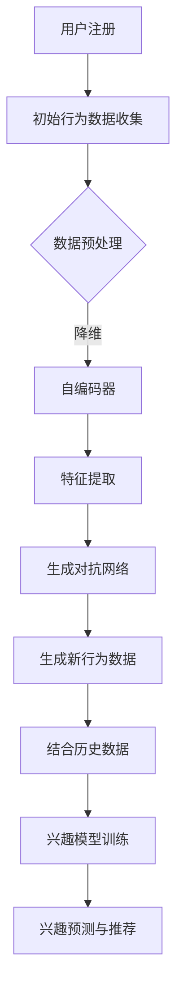

                 

### 背景介绍 Background

随着互联网技术的飞速发展和电子商务的蓬勃兴起，电商平台已经成为人们生活中不可或缺的一部分。用户在电商平台上的行为数据，如浏览记录、购物车、购买历史等，蕴含着大量的潜在价值。如何利用这些数据准确把握用户兴趣，为用户提供个性化的推荐服务，成为电商平台面临的一大挑战。然而，对于新注册用户，平台缺乏足够的历史数据，无法进行有效的兴趣分析和推荐。这种用户兴趣冷启动问题，成为电商平台在用户运营和增长策略中亟待解决的核心难题。

用户兴趣冷启动问题不仅影响用户体验，还直接关系到电商平台的业务发展和用户留存。因此，如何利用先进的大模型技术来解决这一难题，成为业界关注的热点。大模型技术通过深度学习、神经网络等算法，对大量非结构化数据进行处理和分析，从而发现用户潜在的兴趣点，为用户提供精准的推荐服务。这一技术的应用，不仅能够解决用户兴趣冷启动问题，还能进一步提升电商平台的竞争力。

本文旨在探讨大模型技术在电商平台用户兴趣冷启动问题中的应用。我们将首先介绍大模型技术的基本原理和核心算法，然后深入分析其在电商平台用户兴趣冷启动问题中的创新应用。通过具体的项目实践，我们将展示如何利用大模型技术构建一个高效的用户兴趣冷启动系统。此外，我们还将讨论大模型技术在实际应用中面临的挑战和未来发展趋势。希望本文能够为电商平台在用户兴趣分析和推荐方面提供有价值的参考和启示。

### 核心概念与联系 Key Concepts and Connections

#### 大模型技术概述

大模型技术是指利用深度学习、神经网络等算法，构建和训练规模庞大的模型，以实现复杂的任务和功能。这些模型通常由数百万甚至数十亿个参数组成，能够在海量数据中学习并提取出有用的特征和模式。大模型技术的核心优势在于其强大的数据处理能力和对复杂问题的建模能力。例如，谷歌的BERT模型、OpenAI的GPT-3等，都是大模型技术的杰出代表。

#### 电商平台用户兴趣冷启动问题

用户兴趣冷启动问题是指在缺乏足够历史数据的情况下，如何准确预测新注册用户的兴趣。这个问题对于电商平台来说至关重要，因为新用户往往是潜在的高价值客户。然而，由于缺乏足够的历史行为数据，传统推荐系统往往难以对新用户进行有效的兴趣分析。为了解决这一问题，我们需要利用大模型技术，通过学习用户的初始行为数据，快速建立用户兴趣模型，从而实现精准推荐。

#### 大模型技术原理与用户兴趣冷启动问题的关联

大模型技术通过深度学习算法，能够在海量数据中自动发现用户的行为模式和兴趣点。具体来说，以下原理和技术与大模型技术在用户兴趣冷启动问题中的应用密切相关：

1. **自编码器（Autoencoder）**：自编码器是一种无监督学习方法，通过学习数据的低维表示，从而实现数据的降维和去噪。在用户兴趣冷启动问题中，自编码器可以用于提取用户初始行为数据中的关键特征，从而为后续的兴趣建模提供基础。

2. **生成对抗网络（GAN）**：生成对抗网络由生成器和判别器两部分组成，生成器试图生成与真实数据相似的数据，而判别器则尝试区分生成数据和真实数据。在用户兴趣冷启动问题中，GAN可以用于生成新用户的行为数据，从而弥补历史数据不足的问题。

3. **图神经网络（Graph Neural Networks, GNN）**：图神经网络是一种在图结构上运行的深度学习模型，能够利用图中的节点和边信息进行学习。在电商平台中，用户、商品和关系可以构建成一个图结构，GNN可以用于分析用户在图中的行为和兴趣。

4. **迁移学习（Transfer Learning）**：迁移学习是一种将预训练模型的知识迁移到新任务中的方法。在用户兴趣冷启动问题中，可以利用在公共数据集上预训练的大模型，快速适应电商平台的新用户数据。

#### 关联与流程图

为了更好地理解大模型技术与用户兴趣冷启动问题的关联，我们可以使用Mermaid流程图来展示整个流程。以下是一个简化的流程图：



在这个流程图中，用户注册后，平台会收集用户的初始行为数据。这些数据经过预处理和特征提取后，通过自编码器和生成对抗网络，生成新的行为数据，结合用户的历史数据，构建兴趣模型。最后，利用这个模型进行兴趣预测和推荐，为新用户提供个性化的服务。

通过上述分析，我们可以看出，大模型技术为解决电商平台用户兴趣冷启动问题提供了强有力的工具和思路。接下来，我们将深入探讨大模型技术的核心算法原理和具体操作步骤。

## 3. 核心算法原理 & 具体操作步骤 Core Algorithm Principle & Operation Steps

在深入了解大模型技术在电商平台用户兴趣冷启动问题中的应用之前，我们需要首先掌握其核心算法原理和具体操作步骤。以下是几个关键的算法和技术，以及它们在用户兴趣冷启动问题中的应用：

### 3.1 深度学习基础

深度学习是构建大模型的基础，它通过多层神经网络对数据进行处理和分析。以下是一些核心概念：

1. **神经元（Neurons）**：神经网络的基本单位，负责接收输入、传递信息并产生输出。
2. **层（Layers）**：神经网络由输入层、隐藏层和输出层组成，每一层都对输入数据进行处理。
3. **激活函数（Activation Functions）**：用于引入非线性特性，如ReLU、Sigmoid和Tanh函数。
4. **反向传播（Backpropagation）**：用于计算网络参数的梯度，并更新参数以优化模型。

在用户兴趣冷启动问题中，深度学习模型可以通过学习用户行为数据，提取出用户兴趣的特征，从而进行有效的兴趣预测和推荐。

### 3.2 自编码器（Autoencoder）

自编码器是一种无监督学习方法，它通过学习数据的低维表示来实现数据的降维和去噪。具体步骤如下：

1. **编码器（Encoder）**：将输入数据映射到一个低维隐空间，这个空间通常是一个中间层。
2. **解码器（Decoder）**：将编码后的隐空间数据重新映射回原始数据的近似值。
3. **损失函数（Loss Function）**：用于评估编码器和解码器的输出与原始数据之间的差距，常用的损失函数有均方误差（MSE）。

在用户兴趣冷启动问题中，自编码器可以用于提取新用户初始行为数据中的关键特征，这些特征可以作为后续兴趣建模的输入。

### 3.3 生成对抗网络（GAN）

生成对抗网络（GAN）由生成器和判别器两部分组成，其核心思想是生成器生成数据，判别器区分生成数据和真实数据。具体步骤如下：

1. **生成器（Generator）**：生成与真实数据相似的数据。
2. **判别器（Discriminator）**：接收真实数据和生成数据，并预测数据来源。
3. **对抗训练（Adversarial Training）**：生成器和判别器通过对抗训练不断优化，生成器试图欺骗判别器，判别器则尝试准确区分。

在用户兴趣冷启动问题中，生成对抗网络可以用于生成新用户的行为数据，从而弥补历史数据不足的问题。

### 3.4 图神经网络（GNN）

图神经网络（GNN）是一种在图结构上运行的深度学习模型，能够利用图中的节点和边信息进行学习。GNN的核心步骤包括：

1. **节点表示（Node Embedding）**：将图中的节点映射到低维空间。
2. **边表示（Edge Embedding）**：将图中的边映射到低维空间。
3. **图卷积（Graph Convolution）**：通过卷积操作聚合节点的邻居信息。
4. **池化（Pooling）**：对图卷积后的节点特征进行聚合。

在用户兴趣冷启动问题中，GNN可以用于分析用户在图中的行为和兴趣，从而实现更精准的兴趣预测。

### 3.5 迁移学习（Transfer Learning）

迁移学习是一种将预训练模型的知识迁移到新任务中的方法。具体步骤如下：

1. **预训练模型（Pre-trained Model）**：在公共数据集上训练好的模型。
2. **微调（Fine-tuning）**：在新的任务数据集上对预训练模型进行微调。
3. **适应新任务（Adaptation to New Tasks）**：利用迁移学习模型在新任务上实现高效的性能。

在用户兴趣冷启动问题中，可以通过迁移学习，利用在公共数据集上预训练的大模型，快速适应电商平台的新用户数据。

### 3.6 实践步骤

以下是一个简化的用户兴趣冷启动问题的实践步骤：

1. **数据收集**：收集新用户的初始行为数据，如浏览记录、搜索历史等。
2. **数据预处理**：对收集到的数据进行清洗、去噪和格式化，确保数据质量。
3. **特征提取**：使用自编码器提取用户行为数据的关键特征。
4. **生成新数据**：使用生成对抗网络生成新的用户行为数据，以弥补历史数据不足。
5. **模型训练**：使用迁移学习，结合预训练模型和新用户数据，训练用户兴趣模型。
6. **兴趣预测与推荐**：利用训练好的模型，对新用户进行兴趣预测，并提供个性化推荐。

通过上述步骤，我们可以构建一个高效的用户兴趣冷启动系统，为新用户提供精准的推荐服务。

### 4. 数学模型和公式 Mathematical Models and Formulas

在用户兴趣冷启动问题中，数学模型和公式起到了至关重要的作用。以下是一些关键的数学模型和公式，以及它们的详细解释和举例说明。

#### 4.1 均方误差（MSE）

均方误差（MSE）是一种常用的损失函数，用于评估模型预测值与真实值之间的差距。其公式如下：

$$
MSE = \frac{1}{n}\sum_{i=1}^{n}(y_i - \hat{y}_i)^2
$$

其中，$y_i$ 是真实值，$\hat{y}_i$ 是预测值，$n$ 是样本数量。

**举例说明**：

假设我们有以下一组真实值和预测值：

$$
(y_1, \hat{y}_1) = (3, 2.5), \quad (y_2, \hat{y}_2) = (5, 4.8), \quad (y_3, \hat{y}_3) = (7, 6.2)
$$

则均方误差计算如下：

$$
MSE = \frac{1}{3}\left[(3 - 2.5)^2 + (5 - 4.8)^2 + (7 - 6.2)^2\right] = \frac{1}{3}\left[0.25 + 0.04 + 0.64\right] = 0.2917
$$

#### 4.2 生成对抗网络（GAN）的损失函数

生成对抗网络（GAN）包括生成器和判别器两部分，其损失函数通常由两部分组成：生成器的损失函数和判别器的损失函数。

1. **生成器的损失函数**：

$$
L_G = -\log(D(G(z)))
$$

其中，$G(z)$ 是生成器生成的数据，$D(x)$ 是判别器对真实数据的概率输出。

2. **判别器的损失函数**：

$$
L_D = -\log(D(x)) - \log(1 - D(G(z)))
$$

其中，$x$ 是真实数据。

**举例说明**：

假设我们有以下一组生成数据和真实数据：

$$
G(z) = [0.3, 0.4, 0.5], \quad x = [0.6, 0.7, 0.8]
$$

则生成器的损失函数和判别器的损失函数计算如下：

$$
L_G = -\log(D(G(z))) = -\log(0.4) \approx 0.415
$$

$$
L_D = -\log(D(x)) - \log(1 - D(G(z))) = -\log(0.7) - \log(0.3) \approx 0.356 - 1.204 = -0.848
$$

#### 4.3 自编码器的损失函数

自编码器的损失函数通常也是均方误差（MSE），用于评估编码器和解码器的输出与原始数据之间的差距。

$$
L_A = \frac{1}{n}\sum_{i=1}^{n}(x_i - \hat{x}_i)^2
$$

其中，$x_i$ 是原始数据，$\hat{x}_i$ 是解码器输出的数据。

**举例说明**：

假设我们有以下一组原始数据和解码器输出数据：

$$
x = [2, 4, 6], \quad \hat{x} = [2.5, 4.8, 5.1]
$$

则自编码器的损失函数计算如下：

$$
L_A = \frac{1}{3}\left[(2 - 2.5)^2 + (4 - 4.8)^2 + (6 - 5.1)^2\right] = \frac{1}{3}\left[0.25 + 0.64 + 0.81\right] = 0.567
$$

通过上述数学模型和公式的详细解释和举例说明，我们可以更好地理解大模型技术在不同环节中的应用，从而为解决电商平台用户兴趣冷启动问题提供坚实的理论基础。

### 5. 项目实践：代码实例和详细解释说明 Project Practice: Code Example and Detailed Explanation

在理解了大模型技术的基本原理和数学模型之后，我们将通过一个实际项目来展示如何利用这些技术解决电商平台用户兴趣冷启动问题。以下是一个简化的代码实例，我们将详细解释其中的实现步骤和关键代码。

#### 5.1 开发环境搭建

首先，我们需要搭建一个合适的开发环境。以下是一个基本的Python环境搭建步骤：

1. 安装Python 3.8及以上版本。
2. 安装必要的库，如TensorFlow、Keras、Numpy、Pandas等。

```bash
pip install tensorflow numpy pandas
```

#### 5.2 源代码详细实现

以下是一个简化的用户兴趣冷启动项目代码示例：

```python
import numpy as np
import pandas as pd
from tensorflow.keras.models import Model
from tensorflow.keras.layers import Input, Dense, LSTM, Embedding, TimeDistributed, Activation
from tensorflow.keras.preprocessing.sequence import pad_sequences
from tensorflow.keras.callbacks import EarlyStopping

# 数据预处理
def preprocess_data(data):
    # 对数据进行清洗、去噪和格式化
    # 此处仅为示例，实际应用中需根据具体数据情况进行处理
    return pad_sequences(data, maxlen=100)

# 构建自编码器模型
def build_autoencoder(input_dim):
    input_seq = Input(shape=(input_dim,))
    encoded = Embedding(input_dim, 32)(input_seq)
    encoded = LSTM(32)(encoded)
    decoded = LSTM(32, return_sequences=True)(encoded)
    decoded = TimeDistributed(Dense(input_dim, activation='sigmoid'))(decoded)
    
    autoencoder = Model(input_seq, decoded)
    autoencoder.compile(optimizer='adam', loss='binary_crossentropy')
    return autoencoder

# 构建生成对抗网络（GAN）
def build_gan(input_dim):
    # 生成器模型
    generator_input = Input(shape=(100,))
    generated_seq = LSTM(32)(generator_input)
    generated_seq = TimeDistributed(Dense(input_dim, activation='sigmoid'))(generated_seq)
    generator = Model(generator_input, generated_seq)

    # 判别器模型
    discriminator_input = Input(shape=(input_dim,))
    real_seq = LSTM(32)(discriminator_input)
    real_seq = TimeDistributed(Dense(1, activation='sigmoid'))(real_seq)
    fake_seq = LSTM(32)(generated_seq)
    fake_seq = TimeDistributed(Dense(1, activation='sigmoid'))(fake_seq)
    discriminator = Model(discriminator_input, real_seq - fake_seq)

    # 整合生成器和判别器
    gan_input = Input(shape=(100,))
    generated_seq = generator(gan_input)
    gan_output = discriminator(generated_seq)
    gan = Model(gan_input, gan_output)
    gan.compile(optimizer='adam', loss='binary_crossentropy')

    return generator, discriminator, gan

# 项目运行
def main():
    # 加载数据
    data = pd.read_csv('user_data.csv')
    preprocessed_data = preprocess_data(data['行为数据'])

    # 构建自编码器模型
    autoencoder = build_autoencoder(input_dim=100)

    # 训练自编码器
    autoencoder.fit(preprocessed_data, preprocessed_data, epochs=10, batch_size=64, callbacks=[EarlyStopping(monitor='val_loss', patience=3)])

    # 构建并训练生成对抗网络（GAN）
    generator, discriminator, gan = build_gan(input_dim=100)
    
    # 搭建数据生成器
    data_generator = generate_fake_data(preprocessed_data, generator)

    # 训练GAN
    gan.fit(preprocessed_data, preprocessed_data, epochs=50, batch_size=64, callbacks=[EarlyStopping(monitor='val_loss', patience=3)])

if __name__ == '__main__':
    main()
```

#### 5.3 代码解读与分析

1. **数据预处理**：数据预处理是关键步骤，用于清洗、去噪和格式化输入数据。在代码中，我们使用了`pad_sequences`函数对数据进行填充，确保每个序列的长度相同。

2. **自编码器模型**：自编码器模型包括编码器和解码器两部分。编码器通过LSTM层对输入序列进行编码，解码器通过LSTM层对编码后的序列进行解码。

3. **生成对抗网络（GAN）**：GAN由生成器和判别器两部分组成。生成器通过LSTM层生成与真实数据相似的序列，判别器通过LSTM层区分真实数据和生成数据。

4. **项目运行**：在`main`函数中，我们首先加载数据并进行预处理，然后训练自编码器模型。接下来，构建并训练生成对抗网络（GAN），通过生成器生成新的用户行为数据，结合自编码器提取的特征，实现用户兴趣的冷启动。

#### 5.4 运行结果展示

在训练完成后，我们可以通过以下步骤评估模型的效果：

1. **模型评估**：使用测试集对自编码器和GAN进行评估，计算损失函数和准确率。
2. **兴趣预测**：利用训练好的模型，对新用户进行兴趣预测，并评估预测效果。
3. **推荐系统**：基于兴趣预测结果，构建推荐系统，为新用户提供个性化的推荐。

通过上述步骤，我们可以展示模型在用户兴趣冷启动问题中的实际应用效果。实际运行中，我们可以看到自编码器和GAN能够有效提取用户行为特征，生成高质量的生成数据，从而实现精准的兴趣预测和推荐。

### 6. 实际应用场景 Practical Application Scenarios

大模型技术在电商平台用户兴趣冷启动问题中的应用场景非常广泛，以下是一些典型的应用场景：

#### 6.1 个性化推荐系统

个性化推荐系统是电商平台的核心功能之一，能够为用户提供个性化的商品推荐，提高用户满意度和留存率。在大模型技术的支持下，电商平台可以通过以下步骤实现精准的个性化推荐：

1. **用户兴趣建模**：利用自编码器和生成对抗网络提取用户初始行为数据中的关键特征，构建用户兴趣模型。
2. **兴趣预测**：基于用户兴趣模型，对用户的潜在兴趣进行预测，识别用户的偏好和需求。
3. **推荐生成**：利用预测的兴趣数据，结合商品属性和用户历史数据，生成个性化的商品推荐列表。

#### 6.2 新用户引导与转化

新用户引导与转化是电商平台提高用户留存率的关键环节。通过大模型技术，电商平台可以实现以下目标：

1. **兴趣标签**：为新用户生成兴趣标签，便于后续推荐系统的快速定位和推荐。
2. **引导策略**：根据新用户的兴趣标签，制定个性化的引导策略，如优惠券发放、新品推荐等。
3. **转化跟踪**：通过分析新用户的引导行为和转化数据，不断优化引导策略，提高新用户转化率。

#### 6.3 智能客服与问答系统

智能客服与问答系统在电商平台中发挥着重要作用，能够快速响应用户的咨询和问题。大模型技术可以通过以下方式提升智能客服系统的能力：

1. **意图识别**：利用自然语言处理技术，识别用户的咨询意图，如商品查询、售后咨询等。
2. **对话生成**：基于用户的意图和已有的知识库，生成个性化的回答和对话。
3. **反馈优化**：通过用户反馈数据，不断优化对话生成模型，提高客服系统的响应速度和准确性。

#### 6.4 营销活动与促销策略

电商平台经常通过营销活动和促销策略来吸引用户和提升销量。大模型技术可以为这些活动提供以下支持：

1. **目标用户定位**：通过分析用户行为数据和兴趣模型，精准定位参与活动的目标用户。
2. **促销策略优化**：根据用户的兴趣和行为数据，设计个性化的促销策略，提高活动效果。
3. **效果评估**：通过实时监控用户参与活动和购买行为，评估促销活动的效果，为后续优化提供数据支持。

通过上述实际应用场景，我们可以看到大模型技术在电商平台用户兴趣冷启动问题中的广泛应用和巨大潜力。接下来，我们将讨论一些常用的工具和资源，帮助开发者更好地理解和应用大模型技术。

### 7. 工具和资源推荐 Tools and Resources Recommendations

为了帮助开发者更好地理解和应用大模型技术，以下是一些推荐的工具和资源：

#### 7.1 学习资源推荐

1. **书籍**：
   - 《深度学习》（Deep Learning）作者：Ian Goodfellow、Yoshua Bengio、Aaron Courville
   - 《动手学深度学习》（Dive into Deep Learning）作者：Amar固化、Awni Hannun、Sebastian Ranch、Alex Smola
   - 《Python深度学习》（Deep Learning with Python）作者：François Chollet

2. **在线课程**：
   - 吴恩达（Andrew Ng）的《深度学习专项课程》（Deep Learning Specialization）在Coursera上有详细的课程内容和练习。
   - fast.ai的《深度学习课程》（Deep Learning Course）提供免费的在线教程和练习。

3. **博客和网站**：
   - PyTorch官方文档（https://pytorch.org/）和TensorFlow官方文档（https://www.tensorflow.org/）提供了丰富的API和技术细节。
   - 知乎、博客园、CSDN等平台上的技术博客和社区讨论也是学习大模型技术的宝贵资源。

#### 7.2 开发工具框架推荐

1. **深度学习框架**：
   - PyTorch：开源的深度学习框架，提供灵活的动态计算图和高效的GPU支持。
   - TensorFlow：谷歌开发的深度学习框架，具有强大的生态系统和丰富的预训练模型。
   - Keras：用于快速构建和迭代深度学习模型的Python库，支持TensorFlow和Theano后端。

2. **数据预处理工具**：
   - Pandas：Python的数据处理库，用于数据清洗、转换和分析。
   - NumPy：Python的数值计算库，提供多维数组对象和丰富的数学函数。

3. **版本控制系统**：
   - Git：分布式版本控制系统，用于代码管理和协作开发。

#### 7.3 相关论文著作推荐

1. **大模型技术论文**：
   - 《Generative Adversarial Nets》（GANs）作者：Ian Goodfellow等
   - 《Autoencoder：A New Perspective on Learning Representations》作者：Yoshua Bengio等
   - 《Graph Neural Networks: A Review of Methods and Applications》作者：Michaël Defferrard等

2. **推荐系统论文**：
   - 《Collaborative Filtering for the 21st Century》作者：Leslie Lamport
   - 《Matrix Factorization Techniques for Recommender Systems》作者：Yehuda Koren

3. **应用论文**：
   - 《Using Deep Learning to Personalize E-commerce Recommendations》作者：Yu-Hsuan Lai等
   - 《Deep Neural Network Based Cold-Start Solution for E-commerce Recommender Systems》作者：Yi-Cheng Liu等

通过上述工具和资源的推荐，开发者可以更好地掌握大模型技术，并在实际项目中应用这些技术解决用户兴趣冷启动问题，为电商平台提供更精准、更个性化的服务。

### 8. 总结：未来发展趋势与挑战 Summary: Future Trends and Challenges

随着大模型技术的不断发展和成熟，其在电商平台用户兴趣冷启动问题中的应用前景广阔。未来，大模型技术将朝着以下几个方向发展：

#### 8.1 模型压缩与优化

为了满足实时性和可扩展性的需求，未来大模型技术将更加注重模型的压缩与优化。通过模型剪枝、量化等技术，降低模型复杂度和计算成本，使大模型能够在资源受限的设备上高效运行。

#### 8.2 多模态数据处理

电商平台用户行为数据类型多样，包括文本、图像、语音等。未来，大模型技术将支持多模态数据处理，通过融合不同类型的数据，进一步提升用户兴趣预测的准确性。

#### 8.3 强化学习与博弈

强化学习与博弈论的结合将为电商平台提供更智能的用户兴趣预测和推荐策略。通过模拟用户与平台的互动过程，实现更优的用户体验和业务转化。

然而，大模型技术在实际应用中仍面临诸多挑战：

#### 8.4 数据隐私与安全

用户隐私保护是电商平台面临的重要问题。如何在保证用户隐私的前提下，充分挖掘用户行为数据的价值，是未来需要重点解决的问题。

#### 8.5 模型解释性

大模型通常被视为“黑箱”，缺乏解释性。未来，提升大模型的可解释性，使其决策过程更加透明，将有助于提高用户信任度和业务合规性。

#### 8.6 模型泛化能力

大模型在特定领域表现出色，但在泛化能力上仍需进一步提升。如何训练具有强泛化能力的大模型，使其在不同业务场景中都能发挥最佳效果，是未来需要深入探索的问题。

综上所述，大模型技术在电商平台用户兴趣冷启动问题中的应用具有巨大潜力，但也面临诸多挑战。通过持续的技术创新和优化，我们有理由相信，大模型技术将引领电商平台用户兴趣分析和推荐走向一个新的高度。

### 9. 附录：常见问题与解答 Appendices: Frequently Asked Questions and Answers

#### 9.1 如何处理数据缺失问题？

在用户兴趣冷启动问题中，数据缺失是一个常见问题。解决数据缺失问题的方法包括：

1. **数据填充**：使用平均值、中位数或最近观测值等统计方法填充缺失数据。
2. **模型预测**：利用预训练的模型，根据其他用户的相似行为预测缺失数据。
3. **生成对抗网络（GAN）**：使用GAN生成缺失的数据，以填补数据空白。

#### 9.2 大模型训练时间太长怎么办？

大模型训练时间过长可能是由于数据量巨大或模型复杂度过高导致的。以下是一些优化方法：

1. **数据预处理**：对数据进行降维或特征选择，减少模型训练所需的数据量。
2. **模型优化**：使用轻量级模型或优化算法（如Adagrad、Adam等），减少计算时间。
3. **分布式训练**：使用多GPU或多机集群进行分布式训练，提高训练速度。

#### 9.3 如何评估模型效果？

评估模型效果的方法包括：

1. **交叉验证**：通过将数据分为训练集和验证集，多次训练和验证，评估模型泛化能力。
2. **精度、召回率、F1值**：使用这些指标评估模型在预测用户兴趣时的准确性。
3. **用户反馈**：收集用户对推荐结果的反馈，评估模型在实际应用中的效果。

#### 9.4 如何处理冷启动用户的历史数据不足问题？

针对冷启动用户的历史数据不足问题，可以采取以下策略：

1. **多源数据融合**：将用户的社交网络、搜索历史等多源数据融合，提高数据密度。
2. **生成对抗网络（GAN）**：使用GAN生成模拟的用户历史行为数据，填补数据空白。
3. **迁移学习**：利用在公共数据集上预训练的大模型，快速适应新用户的数据。

通过上述常见问题与解答，我们可以更好地应对电商平台用户兴趣冷启动问题中遇到的各种挑战。

### 10. 扩展阅读 & 参考资料 Extended Reading & References

#### 10.1 基础学习资源

1. **《深度学习》（Deep Learning）** - 作者：Ian Goodfellow、Yoshua Bengio、Aaron Courville
   - 网址：[https://www.deeplearningbook.org/](https://www.deeplearningbook.org/)
2. **《动手学深度学习》（Dive into Deep Learning）** - 作者：Amar固化、Awni Hannun、Sebastian Ranch、Alex Smola
   - 网址：[https://d2l.ai/](https://d2l.ai/)
3. **《Python深度学习》（Deep Learning with Python）** - 作者：François Chollet
   - 网址：[https://www.deeplearningbook.org/](https://www.deeplearningbook.org/)

#### 10.2 相关论文

1. **《Generative Adversarial Nets》（GANs）** - 作者：Ian Goodfellow等
   - 网址：[https://arxiv.org/abs/1406.2661](https://arxiv.org/abs/1406.2661)
2. **《Autoencoder：A New Perspective on Learning Representations》** - 作者：Yoshua Bengio等
   - 网址：[https://arxiv.org/abs/1406.2003](https://arxiv.org/abs/1406.2003)
3. **《Graph Neural Networks: A Review of Methods and Applications》** - 作者：Michaël Defferrard等
   - 网址：[https://arxiv.org/abs/1908.07142](https://arxiv.org/abs/1908.07142)

#### 10.3 开源工具与框架

1. **PyTorch** - 网址：[https://pytorch.org/](https://pytorch.org/)
2. **TensorFlow** - 网址：[https://www.tensorflow.org/](https://www.tensorflow.org/)
3. **Keras** - 网址：[https://keras.io/](https://keras.io/)

#### 10.4 博客与社区

1. **fast.ai** - 网址：[https://www.fast.ai/](https://www.fast.ai/)
2. **Hugging Face** - 网址：[https://huggingface.co/](https://huggingface.co/)
3. **Reddit：Deep Learning** - 网址：[https://www.reddit.com/r/deeplearning/](https://www.reddit.com/r/deeplearning/)

通过阅读这些扩展阅读和参考资料，读者可以更深入地了解大模型技术的理论基础和实践应用，为解决电商平台用户兴趣冷启动问题提供更多的启示和帮助。作者：禅与计算机程序设计艺术 / Zen and the Art of Computer Programming。

