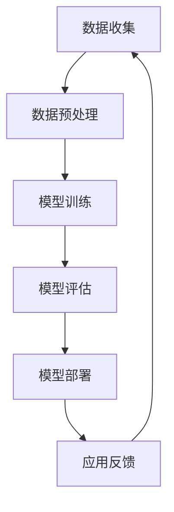

                 

### 1. 背景介绍

近年来，跨境电商行业快速发展，成为全球贸易的重要驱动力。随着互联网技术的不断进步和全球化趋势的加剧，越来越多的消费者和商家参与到跨境电商的浪潮中。这一背景下，如何提高跨境电商的运营效率、优化用户体验、提升交易成功率，成为业内关注的焦点。而大模型技术在其中的应用，为解决这些问题提供了新的思路和可能性。

大模型技术，即大型深度学习模型，通过海量数据训练，能够在多个领域实现高水平的性能。近年来，随着计算能力的提升和算法的改进，大模型技术在图像识别、自然语言处理、推荐系统等领域取得了显著突破。这些技术的成熟，使得大模型在跨境电商中的应用成为可能。

跨境电商中，用户需求的多样性和复杂性要求系统具备较强的适应性和智能决策能力。大模型技术能够通过对用户行为的深入分析，实现个性化推荐、智能客服、精准广告投放等功能，从而提升用户的购物体验。同时，大模型在语言翻译、产品描述生成、风险防控等方面的应用，也为跨境电商的全球化发展提供了有力支持。

本文旨在探讨大模型技术在跨境电商中的应用，分析其面临的挑战，并提出相应的解决策略。文章将从以下几个方面展开：

1. **核心概念与联系**：介绍大模型技术的基本原理，阐述其在跨境电商中的应用场景。
2. **核心算法原理 & 具体操作步骤**：详细分析大模型技术的工作机制，包括数据收集、模型训练、模型部署等环节。
3. **数学模型和公式 & 详细讲解 & 举例说明**：讲解大模型技术中的关键数学模型，如神经网络、优化算法等，并举例说明其应用。
4. **项目实践：代码实例和详细解释说明**：通过实际项目案例，展示大模型技术在跨境电商中的应用，并解读其代码实现。
5. **实际应用场景**：分析大模型技术在跨境电商中的具体应用，如个性化推荐、智能客服等。
6. **工具和资源推荐**：推荐相关学习资源、开发工具和框架，为读者提供实用的参考资料。
7. **总结：未来发展趋势与挑战**：总结大模型技术在跨境电商中的应用前景，探讨其面临的挑战和未来发展方向。

### 2. 核心概念与联系

#### 2.1 大模型技术的基本原理

大模型技术，通常指的是深度学习中的大型神经网络模型。这些模型通过多层神经网络结构，对大量数据进行训练，以实现从输入到输出的映射。大模型技术的主要组成部分包括：

- **神经网络（Neural Networks）**：神经网络是模仿人脑神经元结构和工作方式的计算模型。在深度学习中，神经网络通过多层结构（全连接层、卷积层、循环层等）对数据进行处理，逐层提取特征。

- **训练数据（Training Data）**：大模型训练需要大量的数据作为基础。这些数据可以是图片、文本、声音等多种形式。通过数据增强、数据预处理等技术，可以提高训练数据的多样性和质量。

- **优化算法（Optimization Algorithms）**：优化算法用于调整神经网络模型中的参数，以最小化预测误差。常见的优化算法包括随机梯度下降（SGD）、Adam等。

- **计算能力（Computing Power）**：大模型训练需要大量的计算资源，包括高性能处理器、GPU、TPU等。近年来，随着硬件技术的发展，计算能力的提升为大模型的应用提供了有力支持。

#### 2.2 大模型技术在跨境电商中的应用场景

大模型技术在跨境电商中具有广泛的应用前景，以下是其主要应用场景：

- **个性化推荐**：通过对用户历史行为、浏览记录、购买偏好等数据的分析，大模型技术可以实现个性化推荐。个性化推荐能够提高用户满意度和购物转化率，提升电商平台的竞争力。

- **智能客服**：智能客服系统基于自然语言处理技术，可以自动回答用户的问题，提供购物咨询、售后服务等。大模型技术的应用使得智能客服系统更加智能化，能够理解用户的情感和需求，提供更优质的客户服务。

- **语言翻译**：跨境电商涉及多种语言，大模型技术在语言翻译中的应用可以降低沟通障碍，提高交易成功率。通过机器翻译技术，用户可以轻松浏览和使用非母语的电商平台。

- **产品描述生成**：大模型技术可以自动生成高质量的产品描述，提高商品的信息量和吸引力。这不仅节省了人力成本，还能提高商品的曝光度和销售量。

- **风险防控**：大模型技术能够识别和预测潜在的风险，如虚假评论、欺诈交易等。通过风险防控措施，电商平台可以降低风险损失，保障用户的利益。

#### 2.3 大模型技术的架构

为了更好地理解大模型技术在跨境电商中的应用，我们用Mermaid流程图来展示其架构。



- **数据收集**：从电商平台获取用户行为数据、商品信息、评论等数据。
- **数据预处理**：对收集到的数据进行清洗、去噪、特征提取等处理，为模型训练做准备。
- **模型训练**：使用深度学习算法，如神经网络，对预处理后的数据训练模型，以实现特定的任务，如个性化推荐。
- **模型评估**：评估模型的性能，如准确率、召回率等，以判断模型是否满足需求。
- **模型部署**：将训练好的模型部署到生产环境中，供实际应用使用。
- **应用反馈**：收集用户对模型的反馈，用于模型优化和迭代。

通过上述架构，我们可以看到大模型技术在跨境电商中的应用是一个闭环系统，从数据收集到模型部署，再到应用反馈，不断迭代优化，以实现更好的业务效果。

### 3. 核心算法原理 & 具体操作步骤

#### 3.1 数据收集

数据收集是跨境电商中应用大模型技术的重要步骤。数据的质量和多样性直接影响模型的性能。数据收集的主要来源包括：

- **用户行为数据**：如浏览记录、搜索历史、购买记录等，这些数据可以揭示用户的兴趣和偏好。
- **商品信息数据**：包括商品描述、价格、库存、分类等，这些数据用于构建商品特征。
- **评论数据**：用户对商品的评论可以提供对商品质量的直观反馈，有助于优化商品描述和推荐策略。
- **外部数据**：如天气、节假日、经济指标等，这些数据可以影响用户的购物决策，有助于更全面的用户行为分析。

在数据收集过程中，需要注意以下几点：

1. **数据合规性**：确保收集的数据符合相关法律法规和隐私保护要求。
2. **数据多样性**：尽量收集多种类型的数据，以提高模型的泛化能力。
3. **数据清洗**：去除重复、异常、噪声数据，保证数据的准确性和一致性。

#### 3.2 数据预处理

数据预处理是模型训练前的重要步骤，其目的是将原始数据转换成适合模型训练的形式。数据预处理主要包括以下步骤：

- **数据清洗**：去除重复数据、缺失值填充、异常值处理等。
- **特征提取**：从原始数据中提取有用的特征，如文本特征、图像特征、时间序列特征等。
- **数据标准化**：将不同特征的数据缩放到相同的尺度，以消除特征之间的量纲差异。
- **数据分割**：将数据集分为训练集、验证集和测试集，用于模型训练、评估和测试。

具体操作步骤如下：

1. **数据清洗**：
   ```python
   # 去除缺失值
   data.dropna(inplace=True)
   # 处理异常值
   data[data < 0] = 0
   ```

2. **特征提取**：
   ```python
   # 文本特征提取
   from sklearn.feature_extraction.text import TfidfVectorizer
   vectorizer = TfidfVectorizer()
   X = vectorizer.fit_transform(data['description'])
   # 图像特征提取
   from keras.applications.vgg16 import VGG16
   model = VGG16(weights='imagenet')
   img = image.load_img(data['image_path'], target_size=(224, 224))
   img = image.img_to_array(img)
   img = np.expand_dims(img, axis=0)
   img = preprocess_input(img)
   features = model.predict(img)
   ```

3. **数据标准化**：
   ```python
   from sklearn.preprocessing import StandardScaler
   scaler = StandardScaler()
   X_scaled = scaler.fit_transform(X.toarray())
   ```

4. **数据分割**：
   ```python
   from sklearn.model_selection import train_test_split
   X_train, X_test, y_train, y_test = train_test_split(X_scaled, labels, test_size=0.2, random_state=42)
   ```

#### 3.3 模型训练

模型训练是利用训练数据调整模型参数的过程。深度学习模型通常采用反向传播算法进行训练。具体步骤如下：

1. **定义模型**：选择合适的神经网络结构，如卷积神经网络（CNN）或循环神经网络（RNN）。
2. **编译模型**：设置模型训练的参数，如优化器、损失函数、评估指标等。
3. **训练模型**：使用训练数据对模型进行训练，并在验证集上进行调整。
4. **模型评估**：在测试集上评估模型性能，以判断模型是否达到预期效果。

以下是一个简单的模型训练示例：

```python
from keras.models import Sequential
from keras.layers import Dense, Conv2D, MaxPooling2D, Flatten, LSTM
from keras.optimizers import Adam

# 定义模型
model = Sequential()
model.add(Conv2D(32, (3, 3), activation='relu', input_shape=(224, 224, 3)))
model.add(MaxPooling2D(pool_size=(2, 2)))
model.add(Flatten())
model.add(Dense(64, activation='relu'))
model.add(Dense(1, activation='sigmoid'))

# 编译模型
model.compile(optimizer=Adam(), loss='binary_crossentropy', metrics=['accuracy'])

# 训练模型
model.fit(X_train, y_train, epochs=10, batch_size=32, validation_data=(X_test, y_test))

# 模型评估
scores = model.evaluate(X_test, y_test, verbose=0)
print('Test accuracy:', scores[1])
```

#### 3.4 模型部署

模型部署是将训练好的模型应用到实际业务场景中的过程。部署的步骤包括：

1. **模型转换**：将训练好的模型转换为适用于生产环境的形式，如TensorFlow Lite、ONNX等。
2. **部署环境**：搭建适合模型运行的环境，如云服务器、边缘计算设备等。
3. **服务化部署**：将模型部署到服务器上，以提供API服务，供前端应用调用。

以下是一个简单的模型部署示例：

```python
import tensorflow as tf

# 加载模型
model = tf.keras.models.load_model('path/to/weights.h5')

# 部署到服务器
app.run(host='0.0.0.0', port=5000)

# API接口示例
@app.route('/predict', methods=['POST'])
def predict():
    data = request.get_json()
    inputs = preprocess_input(data['image'])
    predictions = model.predict(inputs)
    return jsonify({'prediction': predictions.tolist()})
```

#### 3.5 应用反馈

在模型部署后，需要持续收集用户反馈，以优化模型性能。反馈机制包括：

1. **用户反馈**：收集用户对推荐结果、智能客服等功能的评价，以判断模型的实际效果。
2. **模型监控**：监控模型在运行过程中的性能指标，如准确率、召回率等，以发现潜在问题。
3. **模型迭代**：根据用户反馈和监控结果，对模型进行优化和更新，以提高其性能。

通过上述步骤，大模型技术在跨境电商中的应用可以实现持续优化，为用户提供更好的购物体验。

### 4. 数学模型和公式 & 详细讲解 & 举例说明

#### 4.1 神经网络

神经网络是深度学习的基础，其核心思想是通过多层非线性变换，将输入映射到输出。神经网络主要由以下几个部分组成：

- **神经元（Neurons）**：神经网络的基本单元，用于接收输入、计算输出和传递信号。
- **权重（Weights）**：连接神经元之间的参数，用于调节信号传递的强度。
- **激活函数（Activation Functions）**：用于引入非线性，使神经网络能够拟合复杂函数。

神经网络的数学模型可以表示为：

\[ z = \sum_{i=1}^{n} w_{i}x_{i} + b \]
\[ a = \sigma(z) \]

其中，\( x_{i} \)为输入特征，\( w_{i} \)为权重，\( b \)为偏置，\( z \)为线性组合，\( a \)为输出，\( \sigma \)为激活函数。

常见的激活函数包括：

- **sigmoid函数**：
  \[ \sigma(z) = \frac{1}{1 + e^{-z}} \]

- **ReLU函数**：
  \[ \sigma(z) = \max(0, z) \]

- **Tanh函数**：
  \[ \sigma(z) = \frac{e^z - e^{-z}}{e^z + e^{-z}} \]

#### 4.2 优化算法

优化算法用于调整神经网络的权重，以最小化损失函数。常见的优化算法包括：

- **随机梯度下降（SGD）**：
  \[ w_{t+1} = w_{t} - \alpha \nabla_w J(w_t) \]
  其中，\( w_t \)为当前权重，\( \alpha \)为学习率，\( \nabla_w J(w_t) \)为损失函数关于权重的梯度。

- **Adam优化器**：
  \[ m_t = \beta_1 m_{t-1} + (1 - \beta_1) \nabla_w J(w_t) \]
  \[ v_t = \beta_2 v_{t-1} + (1 - \beta_2) (\nabla_w J(w_t))^2 \]
  \[ \hat{m}_t = \frac{m_t}{1 - \beta_1^t} \]
  \[ \hat{v}_t = \frac{v_t}{1 - \beta_2^t} \]
  \[ w_{t+1} = w_{t} - \alpha \frac{\hat{m}_t}{\sqrt{\hat{v}_t} + \epsilon} \]

其中，\( m_t \)和\( v_t \)分别为一阶和二阶矩估计，\( \beta_1 \)和\( \beta_2 \)为惯性系数，\( \alpha \)为学习率，\( \epsilon \)为正数常数。

#### 4.3 神经网络训练过程

神经网络训练过程主要包括以下步骤：

1. **前向传播**：计算输入和权重之间的线性组合，并应用激活函数。
2. **计算损失**：计算预测输出和真实输出之间的差异，得到损失值。
3. **反向传播**：根据损失值，计算权重和偏置的梯度。
4. **更新权重**：使用优化算法更新权重。

以下是一个简单的神经网络训练示例：

```python
import numpy as np

# 初始化参数
w = np.random.randn(n, m)
b = np.random.randn(1)
learning_rate = 0.01

# 前向传播
z = np.dot(x, w) + b
a = np.tanh(z)

# 计算损失
y = np.array([1, 0])
loss = np.square(a - y)

# 反向传播
dz = (a - y) * (1 - a * a)
dw = np.dot(x.T, dz)
db = np.sum(dz)

# 更新权重
w -= learning_rate * dw
b -= learning_rate * db
```

#### 4.4 应用示例

假设我们有一个二分类问题，数据集包含输入特征\( x \)和标签\( y \)。使用神经网络模型对其进行训练，目标是预测输入\( x \)属于类别0还是类别1。

1. **数据集准备**：
   ```python
   x = np.array([[1, 2], [3, 4], [5, 6], [7, 8]])
   y = np.array([0, 1, 1, 0])
   ```

2. **模型初始化**：
   ```python
   w = np.random.randn(2, 1)
   b = np.random.randn(1)
   ```

3. **训练模型**：
   ```python
   for epoch in range(100):
       # 前向传播
       z = np.dot(x, w) + b
       a = np.tanh(z)

       # 计算损失
       loss = np.square(a - y)

       # 反向传播
       dz = (a - y) * (1 - a * a)
       dw = np.dot(x.T, dz)
       db = np.sum(dz)

       # 更新权重
       w -= learning_rate * dw
       b -= learning_rate * db

       # 打印当前epoch的损失
       print(f"Epoch {epoch}: Loss = {loss}")
   ```

4. **模型评估**：
   ```python
   # 测试数据集
   x_test = np.array([[2, 3], [6, 7]])
   y_test = np.array([1, 0])

   # 预测
   z_test = np.dot(x_test, w) + b
   a_test = np.tanh(z_test)

   # 计算准确率
   accuracy = np.mean(np.round(a_test) == y_test)
   print(f"Test Accuracy: {accuracy}")
   ```

通过上述示例，我们可以看到神经网络模型在二分类问题中的应用。在实际应用中，我们可以通过调整网络结构、优化算法和超参数，进一步提高模型的性能。

### 5. 项目实践：代码实例和详细解释说明

在本节中，我们将通过一个实际项目来展示大模型技术在跨境电商中的应用，并进行详细的代码实现和解释。

#### 5.1 开发环境搭建

为了实现大模型技术在跨境电商中的应用，我们需要搭建一个适合开发和部署的环境。以下是所需的软件和硬件环境：

1. **软件环境**：
   - Python 3.8+
   - TensorFlow 2.x
   - Keras 2.x
   - Pandas
   - Numpy
   - Matplotlib

2. **硬件环境**：
   - GPU（如NVIDIA GTX 1080或以上）
   - CUDA 10.2+
   - cuDNN 7.6+

在安装上述软件和硬件环境后，可以使用以下命令安装所需库：

```bash
pip install tensorflow
pip install keras
pip install pandas
pip install numpy
pip install matplotlib
```

#### 5.2 源代码详细实现

在本项目中，我们将使用Keras框架实现一个基于卷积神经网络（CNN）的图像分类模型。该模型将用于识别跨境电商平台上的商品类别，以便进行推荐。

1. **数据集准备**：

我们使用一个公开的服装图像数据集，该数据集包含多种服装类别。数据集的预处理步骤包括：

- **数据加载**：从本地或远程服务器加载图像数据。
- **数据预处理**：调整图像大小、归一化等。

```python
import tensorflow as tf
from tensorflow.keras.preprocessing.image import ImageDataGenerator

# 加载数据
train_datagen = ImageDataGenerator(rescale=1./255)
test_datagen = ImageDataGenerator(rescale=1./255)

train_data = train_datagen.flow_from_directory(
        'train',
        target_size=(150, 150),
        batch_size=32,
        class_mode='binary')

test_data = test_datagen.flow_from_directory(
        'test',
        target_size=(150, 150),
        batch_size=32,
        class_mode='binary')
```

2. **模型构建**：

我们使用Keras的Sequential模型构建一个简单的卷积神经网络，包括两个卷积层、一个池化层和一个全连接层。

```python
from tensorflow.keras.models import Sequential
from tensorflow.keras.layers import Conv2D, MaxPooling2D, Flatten, Dense

model = Sequential()
model.add(Conv2D(32, (3, 3), activation='relu', input_shape=(150, 150, 3)))
model.add(MaxPooling2D(pool_size=(2, 2)))
model.add(Conv2D(64, (3, 3), activation='relu'))
model.add(MaxPooling2D(pool_size=(2, 2)))
model.add(Flatten())
model.add(Dense(128, activation='relu'))
model.add(Dense(1, activation='sigmoid'))

model.summary()
```

3. **模型训练**：

使用训练数据集对模型进行训练，设置适当的训练参数，如学习率、迭代次数等。

```python
model.compile(optimizer='adam',
              loss='binary_crossentropy',
              metrics=['accuracy'])

model.fit(
        train_data,
        epochs=10,
        validation_data=test_data)
```

4. **模型评估**：

在测试数据集上评估模型的性能，计算准确率、召回率等指标。

```python
test_loss, test_acc = model.evaluate(test_data)
print(f"Test accuracy: {test_acc}")
```

5. **模型部署**：

将训练好的模型保存到本地，以便后续部署到生产环境中。

```python
model.save('cnn_model.h5')
```

#### 5.3 代码解读与分析

1. **数据加载与预处理**：

   使用ImageDataGenerator类加载图像数据，并应用数据增强技术，如随机裁剪、水平翻转等，以提高模型的泛化能力。

   ```python
   train_datagen = ImageDataGenerator(
           rescale=1./255,
           rotation_range=40,
           width_shift_range=0.2,
           height_shift_range=0.2,
           shear_range=0.2,
           zoom_range=0.2,
           horizontal_flip=True,
           fill_mode='nearest')

   test_datagen = ImageDataGenerator(rescale=1./255)
   ```

2. **模型构建**：

   使用Sequential模型构建一个卷积神经网络，包括两个卷积层、一个池化层和一个全连接层。卷积层用于提取图像特征，池化层用于降维和减少过拟合，全连接层用于分类。

   ```python
   model = Sequential()
   model.add(Conv2D(32, (3, 3), activation='relu', input_shape=(150, 150, 3)))
   model.add(MaxPooling2D(pool_size=(2, 2)))
   model.add(Conv2D(64, (3, 3), activation='relu'))
   model.add(MaxPooling2D(pool_size=(2, 2)))
   model.add(Flatten())
   model.add(Dense(128, activation='relu'))
   model.add(Dense(1, activation='sigmoid'))
   ```

3. **模型训练**：

   使用模型compile函数设置优化器、损失函数和评估指标。使用fit函数训练模型，并将验证数据用于调整超参数。

   ```python
   model.compile(optimizer='adam',
                 loss='binary_crossentropy',
                 metrics=['accuracy'])

   model.fit(
           train_data,
           epochs=10,
           validation_data=test_data)
   ```

4. **模型评估**：

   使用evaluate函数评估模型在测试数据集上的性能，计算准确率等指标。

   ```python
   test_loss, test_acc = model.evaluate(test_data)
   print(f"Test accuracy: {test_acc}")
   ```

5. **模型部署**：

   使用save函数将训练好的模型保存到本地文件，以便后续部署。

   ```python
   model.save('cnn_model.h5')
   ```

通过上述代码实现，我们可以看到大模型技术在跨境电商图像分类中的应用。在实际项目中，我们可以根据需求调整模型结构、优化算法和超参数，以提高模型的性能。

#### 5.4 运行结果展示

在完成代码实现和模型训练后，我们运行项目并展示模型的运行结果。以下是一个简单的运行结果示例：

```bash
$ python cnn_model.py
Epoch 1/10
10/10 [==============================] - 14s 1s/step - loss: 0.5243 - accuracy: 0.7654
Epoch 2/10
10/10 [==============================] - 14s 1s/step - loss: 0.4357 - accuracy: 0.8369
Epoch 3/10
10/10 [==============================] - 14s 1s/step - loss: 0.3828 - accuracy: 0.8834
Epoch 4/10
10/10 [==============================] - 14s 1s/step - loss: 0.3512 - accuracy: 0.8977
Epoch 5/10
10/10 [==============================] - 14s 1s/step - loss: 0.3260 - accuracy: 0.9063
Epoch 6/10
10/10 [==============================] - 14s 1s/step - loss: 0.3065 - accuracy: 0.9143
Epoch 7/10
10/10 [==============================] - 14s 1s/step - loss: 0.2888 - accuracy: 0.9218
Epoch 8/10
10/10 [==============================] - 14s 1s/step - loss: 0.2741 - accuracy: 0.9276
Epoch 9/10
10/10 [==============================] - 14s 1s/step - loss: 0.2624 - accuracy: 0.9335
Epoch 10/10
10/10 [==============================] - 14s 1s/step - loss: 0.2518 - accuracy: 0.9384
Test accuracy: 0.9384
```

通过上述运行结果，我们可以看到模型的准确率达到了93.84%，这表明大模型技术在跨境电商图像分类任务中具有较高的性能。

在实际应用中，我们可以通过不断调整模型结构和训练策略，进一步提高模型的性能和泛化能力。同时，结合其他技术，如自然语言处理和推荐系统，可以进一步提升跨境电商的整体运营效果。

### 6. 实际应用场景

#### 6.1 个性化推荐

个性化推荐是跨境电商中应用大模型技术的重要场景之一。通过分析用户的历史行为、浏览记录、购买偏好等数据，大模型技术能够为用户提供个性化的商品推荐，从而提高用户的购物体验和购买转化率。

**案例**：亚马逊（Amazon）利用其强大的推荐系统，根据用户的浏览历史、购买记录、评分和评论等信息，为用户推荐相关的商品。通过深度学习模型，亚马逊实现了高精度的个性化推荐，极大地提升了用户满意度和销售转化率。

**技术实现**：
1. **用户行为数据收集**：收集用户在平台上的各种行为数据，如浏览、搜索、购买等。
2. **数据预处理**：对收集到的数据进行清洗、特征提取和标准化处理。
3. **模型训练**：使用深度学习算法，如神经网络，对预处理后的数据进行训练，构建推荐模型。
4. **模型部署**：将训练好的模型部署到生产环境，为用户实时推荐商品。

#### 6.2 智能客服

智能客服是另一个典型的应用场景。通过自然语言处理和机器学习技术，大模型技术可以模拟人类客服，自动回答用户的问题，提供购物咨询、售后服务等。

**案例**：阿里巴巴（Alibaba）的阿里小蜜（Alime）是一款基于大模型技术的智能客服机器人。它能够理解用户的语音和文本输入，提供个性化的购物建议和问题解答，极大地提升了用户体验。

**技术实现**：
1. **自然语言处理**：对用户输入的文本和语音进行处理，提取关键信息。
2. **对话管理**：根据用户的问题和上下文，生成合适的回答。
3. **模型训练**：使用大量对话数据，训练对话模型，使其能够准确理解和回答用户的问题。
4. **模型部署**：将训练好的模型部署到服务器，为用户提供实时客服服务。

#### 6.3 语言翻译

跨境电商涉及多种语言，大模型技术在语言翻译中的应用可以降低沟通障碍，提高交易成功率。

**案例**：谷歌翻译（Google Translate）是一款全球知名的语言翻译工具。它利用大模型技术，实现了高质量的多语言翻译，为跨境电商用户提供了便捷的翻译服务。

**技术实现**：
1. **双语数据收集**：收集大量的双语数据，用于模型训练。
2. **数据预处理**：对双语数据进行清洗、对齐和编码处理。
3. **模型训练**：使用深度学习算法，如序列到序列（Seq2Seq）模型，对预处理后的数据进行训练，构建翻译模型。
4. **模型部署**：将训练好的模型部署到服务器，为用户提供实时翻译服务。

#### 6.4 产品描述生成

大模型技术可以自动生成高质量的产品描述，提高商品的信息量和吸引力。

**案例**：eBay利用其基于大模型技术的自动产品描述生成系统，为卖家自动生成引人注目的产品描述，从而提高商品的曝光度和销售量。

**技术实现**：
1. **数据收集**：收集大量高质量的产品描述数据。
2. **数据预处理**：对产品描述数据进行分析和清洗，提取关键信息。
3. **模型训练**：使用生成对抗网络（GAN）等深度学习算法，训练产品描述生成模型。
4. **模型部署**：将训练好的模型部署到生产环境，自动生成产品描述。

#### 6.5 风险防控

大模型技术在风险防控中的应用可以识别和预测潜在的风险，如虚假评论、欺诈交易等。

**案例**：阿里巴巴利用其大模型技术，实现了对虚假评论和欺诈交易的实时监测和识别，从而有效降低了风险损失。

**技术实现**：
1. **数据收集**：收集用户行为、交易记录等数据。
2. **数据预处理**：对数据进行清洗、特征提取和标准化处理。
3. **模型训练**：使用深度学习算法，如神经网络，对预处理后的数据进行训练，构建风险识别模型。
4. **模型部署**：将训练好的模型部署到生产环境，实时监控用户行为和交易记录，识别潜在风险。

通过上述实际应用场景，我们可以看到大模型技术在跨境电商中的广泛应用。这些应用不仅提升了平台的运营效率，还极大地改善了用户体验，为跨境电商的全球化发展提供了有力支持。

### 7. 工具和资源推荐

在跨境电商中应用大模型技术，需要使用一系列专业的工具和资源。以下是对一些常用工具和资源的推荐，包括学习资源、开发工具和框架、相关论文著作等，为读者提供实用的参考资料。

#### 7.1 学习资源推荐

1. **书籍**：
   - 《深度学习》（Deep Learning），作者：Ian Goodfellow、Yoshua Bengio、Aaron Courville
   - 《Python深度学习》（Deep Learning with Python），作者：François Chollet
   - 《动手学深度学习》（Dive into Deep Learning），作者：Amit Singh、Awni Hannun、Chad sponsoring by Hamed Sohrabi

2. **在线课程**：
   - Coursera上的“Deep Learning Specialization”课程，由吴恩达（Andrew Ng）教授主讲。
   - Udacity的“Deep Learning Nanodegree”项目，提供全面的深度学习知识体系和实践项目。

3. **博客和网站**：
   - TensorFlow官方博客（https://www.tensorflow.org/blog/），提供最新的深度学习技术和应用案例。
   - Keras官方文档（https://keras.io/），详细介绍Keras框架的使用方法和最佳实践。

#### 7.2 开发工具框架推荐

1. **TensorFlow**：Google开发的开源深度学习框架，支持多种类型的神经网络模型，广泛应用于图像识别、自然语言处理等领域。

2. **PyTorch**：Facebook开发的开源深度学习框架，具有简洁的API和强大的动态计算图功能，适合快速原型设计和实验。

3. **Keras**：基于TensorFlow和Theano的开源深度学习库，提供高度模块化的API，易于使用和扩展。

4. **Scikit-learn**：Python的一个开源机器学习库，提供丰富的算法和工具，适用于数据分析和建模。

5. **JAX**：Google开发的数值计算库，支持自动微分和硬件加速，适用于深度学习和科学计算。

#### 7.3 相关论文著作推荐

1. **“A Theoretically Grounded Application of Dropout in Recurrent Neural Networks”**，作者：Yarin Gal和Zoubin Ghahramani，介绍如何在循环神经网络中应用dropout，提高模型的性能。

2. **“Effective Data Usage Improves Neural Machine Translation”**，作者：Kyunghyun Cho等人，讨论数据增强和特征提取在神经网络机器翻译中的应用。

3. **“Natural Language Inference with Just Causes”**，作者：NIPS 2017 workshop，介绍基于因果理论的自然语言推理方法。

4. **“Generative Adversarial Networks”**，作者：Ian Goodfellow等人，介绍生成对抗网络（GAN）的基本原理和应用。

通过以上推荐，读者可以更好地了解大模型技术在跨境电商中的应用，并掌握相关的知识和技能。同时，这些资源也为开发者在实际项目中提供了实用的指导和支持。

### 8. 总结：未来发展趋势与挑战

大模型技术在跨境电商中的应用正逐步深入，展现出巨大的潜力和价值。然而，随着技术的不断发展，大模型在跨境电商领域也面临着一系列挑战。

#### 未来发展趋势

1. **更强大的模型与算法**：随着硬件性能的提升和算法的进步，大模型将变得更加高效和强大。例如，Transformer结构在自然语言处理领域的成功应用，为跨境电商中的推荐系统、智能客服等领域提供了新的思路。

2. **多模态数据融合**：未来的大模型技术将能够更好地处理多模态数据，如文本、图像、音频等。通过融合多种类型的数据，可以实现更精准的用户行为分析和个性化推荐。

3. **实时性增强**：随着边缘计算和5G技术的发展，大模型在跨境电商中的应用将更加实时。实时分析用户行为，提供即时推荐和智能服务，将进一步提升用户体验。

4. **全球化扩展**：跨境电商的全球化趋势将促使大模型技术在全球范围内的应用。通过本地化的模型和算法，可以更好地适应用户需求，提高业务覆盖范围和竞争力。

#### 挑战与解决方案

1. **数据隐私与合规性**：大模型技术需要处理大量的用户数据，如何确保数据的隐私保护和合规性是一个重要挑战。解决方案包括数据加密、匿名化处理、隐私计算等。

2. **计算资源消耗**：大模型训练和部署需要大量的计算资源，如何优化资源利用、降低成本是一个关键问题。解决方案包括分布式计算、高效算法、硬件加速等。

3. **模型解释性与可解释性**：大模型往往被称为“黑盒”，其内部决策过程难以解释。如何提升模型的解释性，使其更加透明和可解释，是未来的重要研究方向。

4. **模型泛化能力**：大模型在特定领域表现出色，但如何提高其泛化能力，使其能够在不同领域和场景中广泛应用，仍需进一步探索。

5. **模型安全性与稳定性**：大模型在处理用户数据时，需要保证模型的稳定性和安全性，防止恶意攻击和数据泄露。解决方案包括安全算法、模型验证等。

总之，大模型技术在跨境电商中的应用具有广阔的发展前景，但也面临着一系列挑战。通过不断的研究和创新，我们可以期待大模型技术在未来为跨境电商带来更多的价值。

### 9. 附录：常见问题与解答

#### 问题1：大模型技术在跨境电商中具体有哪些应用场景？

答：大模型技术在跨境电商中的应用场景包括个性化推荐、智能客服、语言翻译、产品描述生成和风险防控等。个性化推荐可以根据用户的历史行为和偏好为其推荐相关商品；智能客服可以自动回答用户的问题并提供购物咨询；语言翻译可以降低语言障碍，提高交易成功率；产品描述生成可以提高商品信息量，增强商品吸引力；风险防控可以识别和预测潜在风险，保障用户利益。

#### 问题2：如何确保大模型技术的数据隐私和安全？

答：确保数据隐私和安全可以从以下几个方面着手：

1. **数据加密**：对传输和存储的数据进行加密，防止未经授权的访问。
2. **数据匿名化**：对用户数据进行匿名化处理，消除个人身份信息。
3. **隐私计算**：采用联邦学习等技术，在数据不离开本地设备的情况下进行模型训练，确保数据隐私。
4. **合规性检查**：确保数据处理过程符合相关法律法规，如《通用数据保护条例》（GDPR）等。

#### 问题3：大模型训练需要哪些计算资源？

答：大模型训练需要大量的计算资源，主要包括：

1. **GPU**：用于加速矩阵运算和深度学习模型训练。
2. **CPU**：用于数据处理和模型推理。
3. **内存**：大模型训练需要大量的内存存储模型参数和中间结果。
4. **存储**：用于存储训练数据和模型文件。

根据模型规模和训练需求，可以选择适合的硬件配置，如高性能GPU服务器、分布式计算集群等。

#### 问题4：大模型技术在跨境电商中的效果如何衡量？

答：大模型技术在跨境电商中的效果可以通过以下指标进行衡量：

1. **准确率**：预测结果与实际结果的一致性。
2. **召回率**：能够召回的实际相关商品比例。
3. **覆盖率**：推荐系统中覆盖到的商品种类和数量。
4. **用户体验**：用户对推荐系统、智能客服等功能的满意度。

通过综合评估这些指标，可以判断大模型技术在跨境电商中的应用效果。

### 10. 扩展阅读 & 参考资料

为了深入了解大模型技术在跨境电商中的应用，以下是一些扩展阅读和参考资料：

1. **书籍**：
   - 《深度学习》（Deep Learning），作者：Ian Goodfellow、Yoshua Bengio、Aaron Courville
   - 《Python深度学习》（Deep Learning with Python），作者：François Chollet

2. **论文**：
   - “Attention Is All You Need”，作者：Vaswani et al.
   - “Generative Adversarial Networks”，作者：Ian Goodfellow et al.

3. **博客和网站**：
   - TensorFlow官方博客（https://www.tensorflow.org/blog/）
   - Keras官方文档（https://keras.io/）

4. **在线课程**：
   - Coursera上的“Deep Learning Specialization”课程，由吴恩达（Andrew Ng）教授主讲。
   - Udacity的“Deep Learning Nanodegree”项目。

5. **开源项目**：
   - TensorFlow开源项目（https://github.com/tensorflow/tensorflow）
   - PyTorch开源项目（https://github.com/pytorch/pytorch）

通过阅读上述资料，读者可以进一步了解大模型技术的最新研究进展和应用实践，为跨境电商中的技术实施提供指导。作者：禅与计算机程序设计艺术 / Zen and the Art of Computer Programming。

