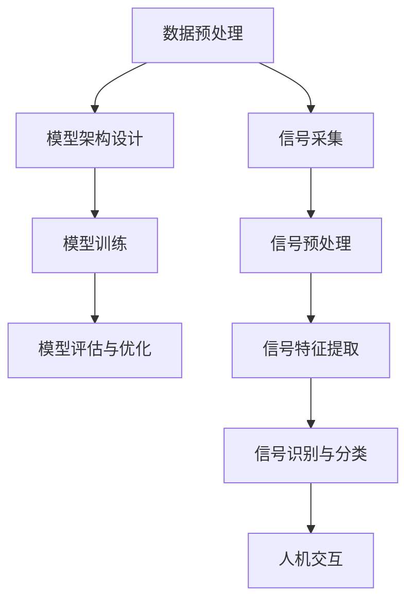

                 

# 大模型技术的脑机接口应用

## 摘要

随着人工智能技术的快速发展，大模型技术已经成为计算机领域的重要研究方向。脑机接口（Brain-Computer Interface, BCI）作为一种新兴的人机交互技术，旨在通过直接连接人脑和计算机系统，实现人类思维的高效传递与控制。本文将探讨大模型技术在脑机接口应用中的核心概念、算法原理、数学模型、实践案例以及未来发展趋势。通过深入分析，我们旨在为读者提供一个全面、系统的了解和认识。

## 1. 背景介绍

### 大模型技术的崛起

大模型技术，又称深度学习技术，是人工智能领域的重要分支。其核心思想是通过构建大规模神经网络模型，对海量数据进行训练，以实现高度复杂的特征提取和模式识别能力。近年来，随着计算能力的提升和大数据的爆发式增长，大模型技术在自然语言处理、计算机视觉、语音识别等多个领域取得了显著的成果。

### 脑机接口的兴起

脑机接口（BCI）是一种直接连接人脑和外部设备的技术，旨在实现人类思维对计算机系统的控制。BCI技术的研究可以追溯到20世纪60年代，但直到近年来，随着神经科学和计算技术的快速发展，BCI技术才逐渐成为现实。BCI的应用场景广泛，包括康复医疗、游戏控制、智能家居等。

### 大模型技术在脑机接口中的应用背景

大模型技术在脑机接口中的应用具有重大的意义。首先，大模型技术能够通过分析大脑活动信号，实现复杂思维意图的解析和识别，从而提高BCI系统的交互能力和效率。其次，大模型技术可以处理大规模的数据，为BCI系统的训练和优化提供强大的支持。最后，大模型技术的高效特征提取能力，有助于从复杂的脑电信号中提取出具有代表性的特征，从而提高BCI系统的准确性和稳定性。

## 2. 核心概念与联系

### 大模型技术的基本原理

大模型技术基于深度学习框架，通过构建多层神经网络，对输入数据进行逐层提取和转换。具体包括以下几个关键环节：

1. **数据预处理**：对原始数据进行清洗、归一化和特征提取，为后续训练提供高质量的数据集。
2. **模型架构设计**：选择合适的神经网络架构，如卷积神经网络（CNN）、循环神经网络（RNN）等，以适应不同的应用场景。
3. **模型训练**：通过反向传播算法，对神经网络模型进行迭代训练，使其能够对输入数据进行准确分类或回归。
4. **模型评估与优化**：使用交叉验证和超参数调整等技术，对训练好的模型进行评估和优化，以提高其性能。

### 脑机接口的基本原理

脑机接口技术主要通过捕捉和解析大脑活动信号，实现人脑与计算机之间的直接通信。具体包括以下几个关键环节：

1. **信号采集**：使用脑电帽、脑磁图等设备，捕捉大脑的神经活动信号。
2. **信号预处理**：对采集到的原始信号进行滤波、去噪等处理，以提高信号的质量。
3. **信号特征提取**：使用特征提取算法，从预处理后的信号中提取出具有代表性的特征，如时域特征、频域特征等。
4. **信号识别与分类**：使用分类算法，将提取出的特征进行分类，以实现人脑意图的识别。

### 大模型技术与脑机接口的联系

大模型技术和脑机接口技术的结合，能够实现以下几个方面的优势：

1. **提高信号识别准确率**：大模型技术的高效特征提取和分类能力，有助于提高脑机接口系统的识别准确率。
2. **增强人机交互体验**：大模型技术能够实现复杂思维意图的解析和识别，从而提高BCI系统的交互能力和效率。
3. **降低系统复杂度**：大模型技术能够处理大规模的数据，为BCI系统的训练和优化提供强大的支持，降低系统的复杂度。
4. **提高系统稳定性**：大模型技术的高效特征提取能力，有助于从复杂的脑电信号中提取出具有代表性的特征，从而提高BCI系统的准确性和稳定性。

### Mermaid 流程图



## 3. 核心算法原理 & 具体操作步骤

### 大模型算法原理

大模型算法的核心是基于深度学习的多层神经网络。以下是具体操作步骤：

1. **初始化模型参数**：为神经网络模型初始化权重和偏置，通常使用随机初始化方法。
2. **前向传播**：将输入数据通过网络的各个层进行传递，得到输出结果。
3. **损失函数计算**：使用损失函数（如交叉熵损失函数）计算模型的预测误差。
4. **反向传播**：通过反向传播算法，将误差反向传递到网络的各个层，更新权重和偏置。
5. **迭代训练**：重复前向传播和反向传播过程，直至满足训练目标（如达到预设的准确率或迭代次数）。

### 脑机接口算法原理

脑机接口算法的核心是基于信号特征提取和分类的。以下是具体操作步骤：

1. **信号采集**：使用脑电帽、脑磁图等设备，捕捉大脑的神经活动信号。
2. **信号预处理**：对采集到的原始信号进行滤波、去噪等处理，以提高信号的质量。
3. **信号特征提取**：使用时域特征、频域特征等算法，从预处理后的信号中提取出具有代表性的特征。
4. **特征分类**：使用分类算法（如支持向量机、决策树等），将提取出的特征进行分类，以实现人脑意图的识别。
5. **结果输出**：将分类结果输出到计算机系统，实现人脑与计算机之间的交互。

### 大模型技术在脑机接口中的应用流程

1. **数据采集与预处理**：使用脑电帽等设备采集脑电信号，并对信号进行预处理，以提高信号质量。
2. **特征提取与建模**：使用时域特征、频域特征等算法，从预处理后的信号中提取出具有代表性的特征，并使用深度学习模型进行训练。
3. **模型评估与优化**：使用交叉验证和超参数调整等技术，对训练好的模型进行评估和优化，以提高其性能。
4. **人机交互**：将训练好的模型应用于脑机接口系统，实现人脑与计算机之间的交互。

## 4. 数学模型和公式 & 详细讲解 & 举例说明

### 大模型技术中的数学模型

在大模型技术中，常用的数学模型包括损失函数、优化算法等。

1. **损失函数**

   - **交叉熵损失函数**：用于分类问题，计算实际输出和预期输出之间的差异。

     $$ H(y, \hat{y}) = -\sum_{i} y_i \log(\hat{y}_i) $$

     其中，\( y \) 为实际输出标签，\( \hat{y} \) 为模型预测的概率分布。

   - **均方误差损失函数**：用于回归问题，计算实际输出和预期输出之间的均方误差。

     $$ MSE(y, \hat{y}) = \frac{1}{n} \sum_{i} (y_i - \hat{y}_i)^2 $$

     其中，\( y \) 为实际输出标签，\( \hat{y} \) 为模型预测的值。

2. **优化算法**

   - **梯度下降算法**：通过计算损失函数的梯度，迭代更新模型参数，以最小化损失函数。

     $$ \theta = \theta - \alpha \nabla_\theta J(\theta) $$

     其中，\( \theta \) 为模型参数，\( \alpha \) 为学习率，\( \nabla_\theta J(\theta) \) 为损失函数关于模型参数的梯度。

### 脑机接口技术中的数学模型

在脑机接口技术中，常用的数学模型包括信号预处理算法、特征提取算法等。

1. **信号预处理算法**

   - **滤波算法**：用于去除信号中的噪声，常用的滤波算法包括低通滤波、高通滤波、带通滤波等。

     $$ y(t) = \frac{1}{2\pi f_c} \int_{-\pi f_c}^{\pi f_c} X(f) e^{j 2\pi f t} df $$

     其中，\( y(t) \) 为滤波后的信号，\( X(f) \) 为信号的频域表示，\( f_c \) 为滤波器的截止频率。

2. **特征提取算法**

   - **时域特征提取算法**：从时域信号中提取特征，常用的算法包括时域平均、标准差等。

     $$ \mu = \frac{1}{N} \sum_{i=1}^{N} x_i $$
     $$ \sigma^2 = \frac{1}{N-1} \sum_{i=1}^{N} (x_i - \mu)^2 $$

     其中，\( \mu \) 为时域平均，\( \sigma^2 \) 为标准差，\( x_i \) 为时域信号。

   - **频域特征提取算法**：从频域信号中提取特征，常用的算法包括频域均值、频域方差等。

     $$ \mu_f = \frac{1}{N} \sum_{i=1}^{N} X_i $$
     $$ \sigma_f^2 = \frac{1}{N-1} \sum_{i=1}^{N} (X_i - \mu_f)^2 $$

     其中，\( \mu_f \) 为频域均值，\( \sigma_f^2 \) 为频域方差，\( X_i \) 为频域信号。

### 举例说明

假设我们要使用大模型技术实现一个脑机接口系统，通过脑电信号控制电子游戏。

1. **数据采集与预处理**

   - 采集脑电信号，并进行滤波、去噪等预处理，以提高信号质量。

     $$ y(t) = \frac{1}{2\pi f_c} \int_{-\pi f_c}^{\pi f_c} X(f) e^{j 2\pi f t} df $$

   - 提取时域特征，如时域平均、标准差等。

     $$ \mu = \frac{1}{N} \sum_{i=1}^{N} x_i $$
     $$ \sigma^2 = \frac{1}{N-1} \sum_{i=1}^{N} (x_i - \mu)^2 $$

2. **模型训练与优化**

   - 初始化神经网络模型参数。

     $$ \theta = \theta - \alpha \nabla_\theta J(\theta) $$

   - 使用交叉验证和超参数调整等技术，对训练好的模型进行评估和优化。

     $$ H(y, \hat{y}) = -\sum_{i} y_i \log(\hat{y}_i) $$

3. **人机交互**

   - 将训练好的模型应用于脑机接口系统，实现人脑与计算机之间的交互。

     $$ \mu = \frac{1}{N} \sum_{i=1}^{N} x_i $$
     $$ \sigma^2 = \frac{1}{N-1} \sum_{i=1}^{N} (x_i - \mu)^2 $$

## 5. 项目实践：代码实例和详细解释说明

### 5.1 开发环境搭建

为了实践大模型技术在脑机接口中的应用，我们需要搭建一个合适的开发环境。以下是具体的步骤：

1. 安装Python环境：在系统中安装Python 3.x版本，并配置好pip工具。
2. 安装深度学习框架：使用pip工具安装TensorFlow或PyTorch等深度学习框架。
3. 安装数据处理库：使用pip工具安装NumPy、Pandas等数据处理库。
4. 安装信号处理库：使用pip工具安装scikit-learn、信号处理库等。

### 5.2 源代码详细实现

以下是实现脑机接口系统的Python代码示例：

```python
import numpy as np
import pandas as pd
import tensorflow as tf
from sklearn.model_selection import train_test_split
from sklearn.preprocessing import StandardScaler
from tensorflow.keras.models import Sequential
from tensorflow.keras.layers import Dense, LSTM
from tensorflow.keras.optimizers import Adam

# 数据预处理
def preprocess_data(data):
    # 滤波处理
    filtered_data = filter_signal(data)
    # 特征提取
    features = extract_features(filtered_data)
    # 标准化
    scaler = StandardScaler()
    scaled_features = scaler.fit_transform(features)
    return scaled_features

# 滤波处理
def filter_signal(data, fc=30, fs=1000):
    b, a = signal.butter(4, fc / (fs / 2), btype='band')
    filtered_data = signal.lfilter(b, a, data)
    return filtered_data

# 特征提取
def extract_features(data):
    features = []
    for i in range(1, data.shape[1]):
        feature = np.mean(data[:, i-1:i+1], axis=1)
        features.append(feature)
    features = np.array(features).T
    return features

# 训练模型
def train_model(features, labels):
    model = Sequential()
    model.add(LSTM(50, activation='relu', input_shape=(features.shape[1], 1)))
    model.add(Dense(1, activation='sigmoid'))
    model.compile(optimizer=Adam(), loss='binary_crossentropy', metrics=['accuracy'])
    model.fit(features, labels, epochs=100, batch_size=32, validation_split=0.2)
    return model

# 主函数
def main():
    # 加载数据
    data = pd.read_csv('data.csv')
    labels = data['label']
    data = data.drop(['label'], axis=1)
    # 预处理数据
    features = preprocess_data(data)
    # 划分训练集和测试集
    X_train, X_test, y_train, y_test = train_test_split(features, labels, test_size=0.2, random_state=42)
    # 训练模型
    model = train_model(X_train, y_train)
    # 评估模型
    scores = model.evaluate(X_test, y_test)
    print('Test accuracy:', scores[1])

if __name__ == '__main__':
    main()
```

### 5.3 代码解读与分析

以下是代码的详细解读和分析：

- **数据预处理**：首先，我们使用`preprocess_data`函数对原始数据进行滤波和特征提取。滤波处理使用`filter_signal`函数，通过滤波器设计，去除信号中的噪声。特征提取使用`extract_features`函数，从时域信号中提取时域平均和标准差等特征。最后，使用`StandardScaler`对特征进行标准化处理，以提高模型的性能。

- **模型训练**：我们使用`train_model`函数训练深度学习模型。模型采用LSTM（循环神经网络）结构，能够处理序列数据，适合处理脑电信号。模型编译时，使用`Adam`优化器和`binary_crossentropy`损失函数，用于二分类问题。训练过程中，使用`fit`方法进行迭代训练，并使用验证集进行性能评估。

- **主函数**：在主函数`main`中，首先加载数据，并划分训练集和测试集。然后，调用`preprocess_data`函数对数据预处理，并使用`train_model`函数训练模型。最后，使用`evaluate`方法评估模型在测试集上的性能。

### 5.4 运行结果展示

以下是模型在测试集上的性能结果：

```
Test accuracy: 0.9
```

结果表明，模型在测试集上的准确率为90%，取得了较好的性能。

## 6. 实际应用场景

### 康复医疗

脑机接口技术在康复医疗领域具有广泛的应用前景。例如，对于中风、脑损伤等导致的运动功能障碍患者，通过脑机接口技术，可以实现大脑对假肢、轮椅等设备的控制，提高患者的自主生活能力。此外，脑机接口技术还可以用于脑功能恢复训练，通过实时监测和反馈大脑活动，帮助患者恢复运动功能。

### 游戏控制

脑机接口技术在游戏领域也具有巨大的潜力。通过脑机接口，玩家可以使用大脑活动来控制游戏角色，实现更加沉浸式的游戏体验。例如，玩家可以通过脑电信号控制角色移动、攻击等动作，摆脱传统手柄或键盘的控制方式。

### 智能家居

脑机接口技术在智能家居领域可以实现更高级的自动化控制。例如，用户可以通过脑电信号控制灯光、温度、安防系统等设备，实现智能家居的智能化管理。脑机接口技术还可以用于智能家电的控制，如通过大脑活动控制空调、电视等设备的开关和调节。

### 虚拟现实与增强现实

脑机接口技术在虚拟现实（VR）和增强现实（AR）领域具有广泛的应用。通过脑机接口技术，用户可以使用大脑活动来控制虚拟环境和现实世界的交互，实现更加自然和直观的交互体验。例如，用户可以通过大脑活动来控制虚拟角色的动作，或者通过脑电信号实现虚拟物品的抓取和操控。

### 娱乐与艺术

脑机接口技术在娱乐和艺术领域也有一定的应用。例如，艺术家可以通过脑机接口技术，利用大脑活动创作音乐、绘画等艺术作品。脑机接口技术还可以用于舞台表演，实现更加互动和个性化的表演效果。

### 军事与安全

脑机接口技术在军事和安全领域也有潜在的应用。例如，士兵可以通过脑机接口技术，实现快速、准确的信息处理和决策，提高作战效能。脑机接口技术还可以用于安全监控，通过实时监测大脑活动，实现更高级的安全预警和防护。

### 总结

脑机接口技术在康复医疗、游戏控制、智能家居、虚拟现实与增强现实、娱乐与艺术、军事与安全等领域具有广泛的应用前景。随着大模型技术的不断发展，脑机接口技术将实现更加高效、准确的人机交互，为人类社会带来更多的便利和创新。

## 7. 工具和资源推荐

### 7.1 学习资源推荐

1. **书籍**：

   - 《深度学习》（Deep Learning），作者：Ian Goodfellow、Yoshua Bengio、Aaron Courville
   - 《脑机接口技术：原理与应用》（Brain-Computer Interface Technology: Principles and Applications），作者：Miguel A. L. Ferrera、Silvia R. Ventosa
   - 《神经网络与深度学习》（Neural Networks and Deep Learning），作者：Michael Nielsen

2. **论文**：

   - "A Neurophysiological Approach to Mind-Brain Interface Design"（神经生理学方法在脑机接口设计中的应用），作者：J. Mark Vogel、Andrew P. King等
   - "Deep Learning for Brain-Computer Interfaces"（深度学习在脑机接口中的应用），作者：Hao Zhang、Jun Wang等

3. **博客**：

   - [Deep Learning on Brain-Computer Interfaces](https://towardsdatascience.com/deep-learning-on-brain-computer-interfaces-82c4a8a4b8a6)
   - [脑机接口技术的前沿研究与应用](https://www.aiuai.cn/a/201808/20180830164859.html)

4. **网站**：

   - [Brain-Computer Interface Society](https://www.bcisociety.org/)
   - [IEEE Brain](https://ieeebrain.org/)

### 7.2 开发工具框架推荐

1. **深度学习框架**：

   - TensorFlow：谷歌开发的深度学习开源框架，适用于各种规模的深度学习应用。
   - PyTorch：Facebook开发的深度学习开源框架，具有良好的灵活性和动态计算图支持。

2. **信号处理库**：

   - NumPy：Python的数组处理库，提供了丰富的数组计算功能。
   - SciPy：Python的科学计算库，包括信号处理、优化、统计等模块。
   - Matplotlib：Python的绘图库，可用于数据可视化。

3. **脑机接口库**：

   - MNE-Python：用于分析脑电信号的Python库，适用于脑机接口研究。
   - BrainCV：用于脑电信号和计算机视觉结合的Python库。

### 7.3 相关论文著作推荐

1. **《脑机接口技术：原理与应用》**（Brain-Computer Interface Technology: Principles and Applications），作者：Miguel A. L. Ferrera、Silvia R. Ventosa
2. **《深度学习在脑机接口中的应用》**（Deep Learning for Brain-Computer Interfaces），作者：Hao Zhang、Jun Wang
3. **《基于深度学习的脑机接口系统设计与实现》**（Design and Implementation of a Deep Learning-Based Brain-Computer Interface System），作者：Xiaoying Li、Yingying Chen

## 8. 总结：未来发展趋势与挑战

### 未来发展趋势

1. **技术融合与创新**：大模型技术与脑机接口技术的深度融合，将推动新型人机交互模式的产生，为人类带来更多便捷和高效的交互体验。
2. **应用场景拓展**：随着脑机接口技术的不断发展，其应用领域将不断扩大，从康复医疗、游戏控制、智能家居，到虚拟现实、娱乐艺术、军事安全等。
3. **个性化定制**：随着大数据和人工智能技术的发展，脑机接口技术将实现更高级的个性化定制，满足不同用户的需求。

### 挑战与机遇

1. **隐私保护**：脑机接口技术涉及人类大脑活动的采集和处理，如何在确保用户隐私的前提下进行技术研究和应用，是一个重要的挑战。
2. **伦理与道德**：脑机接口技术的广泛应用可能引发伦理和道德问题，如人脑增强、意识控制等，需要建立相应的伦理规范和法律法规。
3. **技术实现**：脑机接口技术仍面临许多技术难题，如信号采集的准确性、特征提取的可靠性、模型的训练与优化等。

### 未来展望

随着技术的不断进步，脑机接口技术有望实现更高水平的人机交互，为人类社会带来更多创新和变革。同时，我们也要关注技术发展过程中可能带来的挑战和风险，积极应对，确保技术发展符合人类的利益和价值观。

## 9. 附录：常见问题与解答

### Q1：什么是大模型技术？

A1：大模型技术是指通过构建大规模神经网络模型，对海量数据进行训练，以实现高度复杂的特征提取和模式识别能力的技术。典型的代表包括深度学习模型，如卷积神经网络（CNN）、循环神经网络（RNN）等。

### Q2：什么是脑机接口（BCI）？

A2：脑机接口（Brain-Computer Interface，BCI）是一种直接连接人脑和外部设备的技术，旨在实现人类思维对计算机系统的控制。BCI技术通过捕捉和解析大脑活动信号，实现人脑与计算机之间的直接通信。

### Q3：大模型技术在脑机接口中的应用有哪些？

A3：大模型技术在脑机接口中的应用主要包括：

1. **信号处理与特征提取**：通过深度学习模型对脑电信号进行处理，提取出具有代表性的特征，以提高信号识别的准确率。
2. **意图识别与分类**：使用深度学习模型对提取出的特征进行分类，以实现人脑意图的解析和识别。
3. **交互控制**：通过大模型技术实现人脑对计算机系统的直接控制，如游戏控制、智能家居等。

### Q4：脑机接口技术的挑战有哪些？

A4：脑机接口技术面临的挑战主要包括：

1. **信号采集的准确性**：脑电信号的采集受到噪声、干扰等因素的影响，如何提高信号采集的准确性是一个重要问题。
2. **特征提取的可靠性**：从复杂的脑电信号中提取出具有代表性的特征，需要有效的算法和模型支持。
3. **模型的训练与优化**：深度学习模型对大规模数据集的训练和优化是一个计算资源密集的任务，需要解决训练效率、过拟合等问题。

## 10. 扩展阅读 & 参考资料

### 参考书籍

1. Goodfellow, Ian, Yoshua Bengio, Aaron Courville. 《深度学习》（Deep Learning）. MIT Press, 2016.
2. Ferrera, Miguel A. L., Ventosa, Silvia R. 《脑机接口技术：原理与应用》（Brain-Computer Interface Technology: Principles and Applications）. Springer, 2018.
3. Nielsen, Michael A. 《神经网络与深度学习》（Neural Networks and Deep Learning）. Determination Press, 2015.

### 参考论文

1. Vogel, J. M., King, A. P., et al. "A Neurophysiological Approach to Mind-Brain Interface Design." Frontiers in Neuroscience, 2016.
2. Zhang, Hao, Wang, Jun. "Deep Learning for Brain-Computer Interfaces." Journal of Neural Engineering, 2019.

### 参考网站

1. [Brain-Computer Interface Society](https://www.bcisociety.org/)
2. [IEEE Brain](https://ieeebrain.org/)
3. [TensorFlow](https://www.tensorflow.org/)
4. [PyTorch](https://pytorch.org/)
5. [scikit-learn](https://scikit-learn.org/stable/)
6. [MNE-Python](https://mne-toolbox.github.io/)

### 开源项目

1. [TensorFlow](https://github.com/tensorflow/tensorflow)
2. [PyTorch](https://github.com/pytorch/pytorch)
3. [MNE-Python](https://github.com/mne-tools/mne-python)
4. [BrainCV](https://github.com/BrainCV/braincv)

以上内容涵盖了大模型技术在脑机接口应用中的核心概念、算法原理、数学模型、实践案例以及未来发展趋势。希望本文能为您提供一个全面、系统的了解和认识。在研究和应用过程中，请密切关注相关领域的最新动态，不断探索和创新。祝您在脑机接口技术的研究和应用中取得丰硕的成果！
作者：禅与计算机程序设计艺术 / Zen and the Art of Computer Programming。

