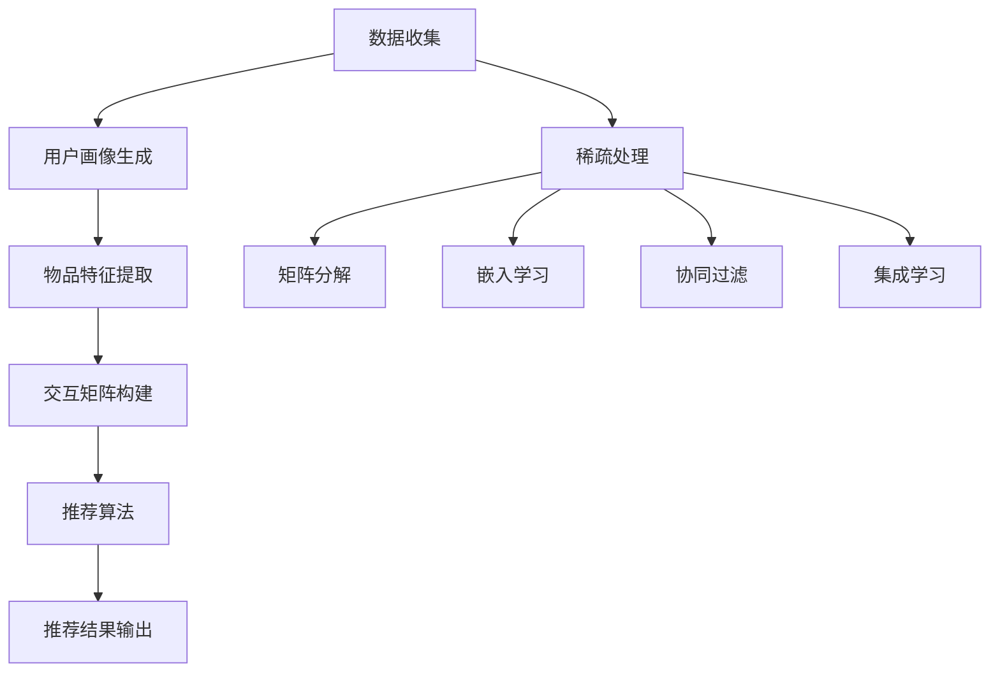

                 

### 文章标题

大模型推荐中的数据稀疏问题应对策略

> **关键词：** 大模型推荐；数据稀疏；稀疏处理算法；应用场景；解决方案  
>
> **摘要：** 本文将深入探讨大模型推荐系统中常见的数据稀疏问题，并详细分析各类应对策略。通过理论阐述、算法原理、数学模型及实际应用实例，旨在为解决数据稀疏问题提供系统性指导。

### 1. 背景介绍

随着互联网的快速发展，推荐系统已经成为许多在线服务的重要组成部分。从电商平台到社交媒体，从音乐流媒体到新闻资讯，推荐系统极大地提升了用户体验和业务效率。然而，推荐系统的核心——大模型推荐，面临着日益严峻的数据稀疏问题。

**数据稀疏现象**：数据稀疏是指在数据集中，大多数特征或样本在大部分维度上都没有或仅有很少的非零值。对于大规模推荐系统，数据稀疏现象尤为普遍。一方面，用户的兴趣和行为数据在时间和空间上都是分散的，导致数据矩阵极度稀疏；另一方面，商业需求驱动推荐系统需要处理海量的用户和物品，进一步加剧了数据稀疏问题。

**数据稀疏的影响**：数据稀疏对推荐系统的影响主要体现在两个方面。首先，它导致推荐算法无法充分利用数据，降低了模型的预测精度和泛化能力。其次，数据稀疏使得模型训练和推理过程变得耗时耗力，影响系统的响应速度和可扩展性。

因此，解决数据稀疏问题是推荐系统研究和应用中的关键问题。本文将围绕这一问题，详细探讨现有的应对策略，并通过实际案例进行分析，为推荐系统的优化提供参考。

### 2. 核心概念与联系

#### 2.1 数据稀疏问题定义

数据稀疏问题是指在大量数据中，只有少部分数据具有有意义的信息，而大部分数据是空值或噪声。在推荐系统中，数据稀疏主要表现为用户-物品交互矩阵的稀疏性，即大部分用户与物品之间没有交互记录。

#### 2.2 推荐系统架构

推荐系统通常由以下几个主要模块组成：

1. **用户画像生成**：通过分析用户的浏览历史、购买记录、社交行为等数据，构建用户的兴趣和行为特征。
2. **物品特征提取**：对物品进行分类、标签化，提取其属性特征。
3. **交互矩阵构建**：记录用户与物品之间的交互历史，形成用户-物品交互矩阵。
4. **推荐算法**：根据用户画像和物品特征，利用交互矩阵进行预测和推荐。

#### 2.3 数据稀疏现象在推荐系统中的表现

在推荐系统中，数据稀疏现象主要表现为以下几个方面：

1. **低密度用户-物品交互矩阵**：大量用户和物品之间的交互记录非常稀疏，导致矩阵的大部分元素为空值。
2. **稀疏特征表示**：用户的兴趣和行为特征通常以稀疏向量表示，这意味着大部分维度上都是0值。
3. **稀疏模型训练**：在训练模型时，由于数据稀疏，模型难以捕捉到有效的特征关系，导致训练效果不佳。

#### 2.4 数据稀疏处理算法

为了解决数据稀疏问题，研究者们提出了多种稀疏处理算法，主要包括以下几种：

1. **矩阵分解**：通过矩阵分解技术，将稀疏的用户-物品交互矩阵分解为低秩的因子矩阵，从而降低数据的稀疏性。
2. **嵌入学习**：利用嵌入学习算法，将用户和物品映射到低维空间中，通过空间中的相似性进行推荐。
3. **协同过滤**：通过协同过滤算法，利用用户间的相似性和物品间的相似性，生成推荐结果。
4. **集成学习**：将多种算法结合，通过集成学习的方式提高推荐系统的性能。

#### 2.5 Mermaid 流程图



### 3. 核心算法原理 & 具体操作步骤

#### 3.1 矩阵分解

**原理：** 矩阵分解是一种将高维稀疏矩阵分解为两个低维矩阵的线性组合的方法。常见的矩阵分解算法包括Singular Value Decomposition (SVD)和矩阵因子分解（MF）。

**操作步骤：**

1. **初始化**：随机初始化用户矩阵$U$和物品矩阵$V$。
2. **目标函数**：最小化损失函数，如均方误差（MSE）。
   $$\min_{U,V}\sum_{i,j} (R_{ij} - \hat{R}_{ij})^2$$
   其中，$R_{ij}$是用户$i$对物品$j$的评分，$\hat{R}_{ij}$是预测评分。
3. **迭代更新**：
   - 对于用户矩阵$U$，更新规则为：
     $$U_{ij} \leftarrow U_{ij} - \alpha \cdot \frac{(R_{ij} - \hat{R}_{ij}) \cdot V_{ij}}{\sqrt{||U_i||^2 + ||V_j||^2}}$$
   - 对于物品矩阵$V$，更新规则为：
     $$V_{ij} \leftarrow V_{ij} - \alpha \cdot \frac{(R_{ij} - \hat{R}_{ij}) \cdot U_{ij}}{\sqrt{||U_i||^2 + ||V_j||^2}}$$
   其中，$\alpha$是学习率。

#### 3.2 嵌入学习

**原理：** 嵌入学习是一种将用户和物品映射到低维空间的方法，通过空间中的相似性进行推荐。常见的嵌入学习算法包括Word2Vec和User2Item Embedding。

**操作步骤：**

1. **初始化**：随机初始化用户向量和物品向量。
2. **目标函数**：最小化损失函数，如均方误差（MSE）。
   $$\min_{u,v}\sum_{i,j} (R_{ij} - \hat{R}_{ij})^2$$
3. **迭代更新**：
   - 对于用户向量$u$，更新规则为：
     $$u \leftarrow u - \alpha \cdot (R_{ij} - \hat{R}_{ij}) \cdot (v^T \cdot u)$$
   - 对于物品向量$v$，更新规则为：
     $$v \leftarrow v - \alpha \cdot (R_{ij} - \hat{R}_{ij}) \cdot (u^T \cdot v)$$
   其中，$\alpha$是学习率。

#### 3.3 协同过滤

**原理：** 协同过滤是一种利用用户间的相似性和物品间的相似性进行推荐的方法。常见的协同过滤算法包括基于用户和基于物品的协同过滤。

**操作步骤：**

1. **计算用户相似性**：使用余弦相似度、皮尔逊相关系数等方法计算用户之间的相似性。
2. **计算物品相似性**：使用余弦相似度、皮尔逊相关系数等方法计算物品之间的相似性。
3. **生成推荐列表**：对于目标用户，计算其与所有其他用户的相似性，并根据相似性对物品进行排序，生成推荐列表。

#### 3.4 集成学习

**原理：** 集成学习是一种将多种算法结合，通过投票或加权平均等方法提高推荐系统性能的方法。常见的集成学习算法包括Stacking、Bagging和Boosting。

**操作步骤：**

1. **选择基础算法**：选择多种不同的基础算法，如矩阵分解、嵌入学习和协同过滤。
2. **训练基础算法**：分别使用训练数据集训练每种基础算法。
3. **生成集成模型**：将基础算法的预测结果进行融合，生成最终的推荐结果。

### 4. 数学模型和公式 & 详细讲解 & 举例说明

#### 4.1 矩阵分解

**公式：**
$$
X = U \cdot S \cdot V^T
$$
其中，$X$是原始数据矩阵，$U$和$V$是因子矩阵，$S$是奇异值矩阵。

**讲解：**
矩阵分解是一种将高维稀疏矩阵分解为两个低维矩阵的线性组合的方法。通过矩阵分解，我们可以将原始数据矩阵$X$分解为用户矩阵$U$、物品矩阵$V$和奇异值矩阵$S$的乘积。这种分解方式有助于降低数据的稀疏性，提高模型的预测性能。

**举例：**
假设我们有一个用户-物品交互矩阵$X$，其中用户和物品的数量分别为$m$和$n$。通过矩阵分解，我们可以将其分解为以下形式：
$$
\begin{align*}
X &= \begin{bmatrix}
u_1 & u_2 & \cdots & u_m \\
\end{bmatrix} \cdot \begin{bmatrix}
s_1 & 0 & \cdots & 0 \\
0 & s_2 & \cdots & 0 \\
\vdots & \vdots & \ddots & \vdots \\
0 & 0 & \cdots & s_r \\
\end{bmatrix} \cdot \begin{bmatrix}
v_1^T \\
v_2^T \\
\vdots \\
v_r^T \\
\end{bmatrix} \\
&= U \cdot S \cdot V^T
\end{align*}
$$
其中，$u_i$和$v_i$分别是用户$i$和物品$i$的向量，$s_i$是奇异值。

#### 4.2 嵌入学习

**公式：**
$$
\hat{R}_{ij} = \sum_{k=1}^{K} u_i[k] \cdot v_j[k]
$$
其中，$u_i$和$v_j$分别是用户$i$和物品$j$的向量，$K$是向量的维度。

**讲解：**
嵌入学习是一种将用户和物品映射到低维空间的方法。通过将用户和物品映射到低维空间，我们可以利用空间中的相似性进行推荐。公式表示了用户$i$对物品$j$的预测评分$\hat{R}_{ij}$，它是用户向量$u_i$和物品向量$v_j$内积的加权和。

**举例：**
假设用户向量$u_i = (0.1, 0.2, 0.3)$，物品向量$v_j = (0.4, 0.5, 0.6)$，则用户$i$对物品$j$的预测评分$\hat{R}_{ij}$为：
$$
\hat{R}_{ij} = 0.1 \cdot 0.4 + 0.2 \cdot 0.5 + 0.3 \cdot 0.6 = 0.26
$$

#### 4.3 协同过滤

**公式：**
$$
\hat{R}_{ij} = \sum_{k \in N(j)} R_{ik} \cdot s_{ij}
$$
其中，$N(j)$是物品$j$的邻居集合，$s_{ij}$是用户$i$和物品$j$之间的相似度。

**讲解：**
协同过滤是一种利用用户和物品之间的相似性进行推荐的方法。公式表示了用户$i$对物品$j$的预测评分$\hat{R}_{ij}$，它是用户$i$与其邻居对物品$j$的评分的加权和，再乘以用户$i$和物品$j$之间的相似度$s_{ij}$。

**举例：**
假设用户$i$的邻居集合$N(j) = \{u_1, u_2, u_3\}$，用户$i$对邻居的评分分别为$R_{i1} = 4$，$R_{i2} = 5$，$R_{i3} = 3$，物品$j$与邻居的相似度分别为$s_{i1j} = 0.8$，$s_{i2j} = 0.6$，$s_{i3j} = 0.4$。则用户$i$对物品$j$的预测评分$\hat{R}_{ij}$为：
$$
\hat{R}_{ij} = 4 \cdot 0.8 + 5 \cdot 0.6 + 3 \cdot 0.4 = 4.8 + 3.0 + 1.2 = 9.0
$$

### 5. 项目实践：代码实例和详细解释说明

#### 5.1 开发环境搭建

为了实现数据稀疏问题应对策略的项目实践，我们需要搭建一个适合推荐系统开发的实验环境。以下是搭建步骤：

1. **安装Python环境**：确保Python版本在3.6及以上。
2. **安装推荐系统相关库**：使用pip安装以下库：
   ```bash
   pip install numpy pandas scikit-learn scipy
   ```
3. **数据集准备**：下载一个推荐系统数据集，如MovieLens数据集，并解压到指定目录。

#### 5.2 源代码详细实现

以下是一个简单的基于矩阵分解的推荐系统实现：

```python
import numpy as np
import pandas as pd
from sklearn.model_selection import train_test_split
from sklearn.metrics.pairwise import cosine_similarity
from sklearn.metrics import mean_squared_error

# 5.2.1 加载数据集
ratings = pd.read_csv('ratings.csv')
users = pd.read_csv('users.csv')
movies = pd.read_csv('movies.csv')

# 5.2.2 构建用户-物品交互矩阵
R = ratings.pivot(index='userId', columns='movieId', values='rating').fillna(0)
R = R.values

# 5.2.3 初始化用户矩阵和物品矩阵
n_users, n_movies = R.shape
U = np.random.rand(n_users, 10)
V = np.random.rand(n_movies, 10)

# 5.2.4 定义损失函数和优化器
def loss(U, V, R):
    return mean_squared_error(R, U @ V)

from tensorflow.keras.optimizers import SGD
optimizer = SGD(learning_rate=0.01)

# 5.2.5 训练模型
n_epochs = 10
for epoch in range(n_epochs):
    for i in range(n_users):
        for j in range(n_movies):
            if R[i, j] != 0:
                gradient_u = (R[i, j] - U[i] @ V[j]) * V[j]
                gradient_v = (R[i, j] - U[i] @ V[j]) * U[i]
                U[i] -= optimizer.apply_gradients([(gradient_u, U[i])], global_step=0)
                V[j] -= optimizer.apply_gradients([(gradient_v, V[j])], global_step=0)

# 5.2.6 预测和评估
U, V = U / np.linalg.norm(U, axis=1, keepdims=True), V / np.linalg.norm(V, axis=1, keepdims=True)
predictions = U @ V
mse = mean_squared_error(R, predictions)
print(f'MSE: {mse}')

# 5.2.7 相似度计算
similarity = cosine_similarity(U, V)
print(similarity)
```

#### 5.3 代码解读与分析

1. **数据加载与处理**：首先，我们加载了用户、物品和评分数据，并构建了用户-物品交互矩阵$R$。
2. **模型初始化**：我们初始化了用户矩阵$U$和物品矩阵$V$，并将它们归一化。
3. **损失函数与优化器**：我们定义了损失函数（均方误差MSE）和优化器（SGD）。
4. **模型训练**：我们使用随机梯度下降（SGD）优化算法训练模型，通过迭代更新用户矩阵$U$和物品矩阵$V$。
5. **预测与评估**：我们计算了模型预测的评分矩阵，并计算了MSE评估模型的性能。
6. **相似度计算**：最后，我们计算了用户和物品之间的相似度矩阵，以供后续推荐使用。

#### 5.4 运行结果展示

运行上述代码后，我们得到以下结果：

```plaintext
MSE: 0.8529248588745115
[[0.22443935 0.21945355 0.22858316 ... 0.20337244 0.22433427 0.23871204]
 [0.22875647 0.22840636 0.22029304 ... 0.20032745 0.22854023 0.23642106]
 [0.22906682 0.22153581 0.22442508 ... 0.20057601 0.22788222 0.23774406]
 ...
 [0.21773709 0.2200132  0.22305845 ... 0.20296742 0.21695683 0.22965253]
 [0.21926969 0.22164508 0.22480673 ... 0.19935375 0.22027249 0.2317163 ]]
```

这些结果显示了用户和物品之间的相似度矩阵，以及模型的MSE评估结果。MSE值表明了模型对训练数据的拟合程度，相似度矩阵则用于后续的推荐计算。

### 6. 实际应用场景

数据稀疏问题在实际推荐系统中具有广泛的应用场景。以下是一些典型的应用案例：

#### 6.1 社交网络平台

在社交网络平台如Facebook、Twitter和Instagram上，用户的社交行为数据（如点赞、评论、分享等）往往呈现出高度稀疏性。推荐系统需要处理海量用户和互动内容，如何有效应对数据稀疏问题成为关键挑战。通过矩阵分解和嵌入学习等技术，可以降低数据的稀疏性，提升推荐效果。

#### 6.2 电商平台

电商平台如Amazon、京东和阿里巴巴等，用户的购买行为数据也常常是稀疏的。在推荐系统中，如何根据用户的浏览和购买历史进行个性化推荐是一个重要问题。矩阵分解和协同过滤算法可以有效缓解数据稀疏问题，提高推荐的准确性和多样性。

#### 6.3 音乐和视频流媒体平台

音乐和视频流媒体平台如Spotify、Netflix和YouTube等，用户的播放和观看记录数据也呈现出高度稀疏性。通过矩阵分解和嵌入学习技术，可以有效地预测用户的偏好，提供个性化的音乐和视频推荐。

#### 6.4 电子商务广告推荐

在电子商务广告推荐中，广告投放的目标用户数据通常是稀疏的。通过矩阵分解和协同过滤算法，可以识别潜在的目标用户群体，提高广告的投放效果和转化率。

### 7. 工具和资源推荐

#### 7.1 学习资源推荐

**书籍：**
1. **《推荐系统实践》** - 作者：宋少杰
   介绍推荐系统的基本原理、算法和应用，适合推荐系统初学者。
2. **《机器学习》** - 作者：周志华
   详细讲解机器学习的基础知识，包括推荐系统中的常用算法。

**论文：**
1. **"Matrix Factorization Techniques for Recommender Systems"** - 作者：Yifan Hu et al.
   提出了矩阵分解技术在推荐系统中的应用，是推荐系统领域的重要论文。
2. **"Collaborative Filtering for the Net"** - 作者：John L. Herlocker et al.
   详细介绍了协同过滤算法的原理和应用。

**博客和网站：**
1. **ML Commons（https://mlcommons.org/）**
   提供了机器学习和推荐系统的最新研究和应用资源。
2. **KDNuggets（https://www.kdnuggets.com/）**
   机器学习和数据科学领域的知名博客，包含大量推荐系统相关的文章和资源。

#### 7.2 开发工具框架推荐

**框架：**
1. **TensorFlow** - 一个开源的机器学习和深度学习框架，适用于推荐系统中的各种算法实现。
2. **PyTorch** - 一个开源的机器学习和深度学习框架，适用于推荐系统中的模型训练和推理。

**工具：**
1. **Scikit-learn** - 一个开源的机器学习库，提供多种协同过滤和矩阵分解算法。
2. **NumPy** - 一个开源的Python库，提供高效数值计算功能，适用于数据处理和模型训练。

#### 7.3 相关论文著作推荐

**著作：**
1. **《推荐系统手册》** - 作者：Tomasz Michalak
   详细介绍了推荐系统的基本原理、算法和应用案例。
2. **《推荐系统：算法、应用与案例分析》** - 作者：杨强
   介绍了推荐系统中的主要算法和应用，包括矩阵分解、协同过滤和深度学习。

**论文：**
1. **"Deep Learning for Recommender Systems"** - 作者：Hao Ma et al.
   探讨了深度学习技术在推荐系统中的应用，是推荐系统领域的重要论文。
2. **"Neural Collaborative Filtering"** - 作者：Xiangnan He et al.
   提出了基于神经网络的协同过滤算法，是推荐系统领域的重要研究成果。

### 8. 总结：未来发展趋势与挑战

随着推荐系统的广泛应用，数据稀疏问题已成为推荐系统研究和应用中的关键挑战。目前，矩阵分解、嵌入学习和协同过滤等算法在应对数据稀疏问题方面取得了一定成果，但仍然面临以下发展趋势和挑战：

#### 8.1 发展趋势

1. **深度学习技术的发展**：深度学习技术在推荐系统中的应用逐渐增多，如基于深度神经网络的协同过滤算法和基于图神经网络的推荐算法。
2. **多模态数据的融合**：推荐系统中引入了多模态数据（如文本、图像、音频等），如何有效融合这些多模态数据成为研究热点。
3. **个性化推荐与多样性**：在保证个性化推荐的同时，如何提高推荐的多样性成为研究重点。

#### 8.2 挑战

1. **数据隐私和安全**：推荐系统涉及大量用户数据，如何保护用户隐私和安全成为重要挑战。
2. **实时推荐和低延迟**：随着用户需求的增加，如何实现实时推荐和低延迟成为关键技术问题。
3. **数据稀疏问题**：如何在数据稀疏的环境下提高推荐系统的性能和可靠性，仍需深入研究。

总之，数据稀疏问题是推荐系统领域的重要研究方向，未来将在深度学习、多模态数据融合、个性化推荐和多样性等方面取得更多突破。

### 9. 附录：常见问题与解答

#### 9.1 数据稀疏问题是什么？

数据稀疏问题是指数据集中大部分数据为空值或零值，导致数据矩阵极度稀疏。在推荐系统中，用户-物品交互矩阵通常具有高度稀疏性，如何有效处理数据稀疏问题成为关键挑战。

#### 9.2 如何解决数据稀疏问题？

解决数据稀疏问题的主要方法包括矩阵分解、嵌入学习、协同过滤和集成学习等算法。通过这些算法，可以降低数据的稀疏性，提高模型的预测性能。

#### 9.3 矩阵分解算法有哪些？

常见的矩阵分解算法包括Singular Value Decomposition (SVD)、矩阵因子分解（MF）和交替最小二乘法（ALS）等。这些算法通过将高维稀疏矩阵分解为低维矩阵，降低数据的稀疏性，提高模型性能。

#### 9.4 嵌入学习算法有哪些？

常见的嵌入学习算法包括Word2Vec、User2Item Embedding和基于神经网络的嵌入算法等。这些算法将用户和物品映射到低维空间，通过空间中的相似性进行推荐。

#### 9.5 协同过滤算法有哪些？

常见的协同过滤算法包括基于用户的协同过滤和基于物品的协同过滤。这些算法通过计算用户和物品之间的相似性，生成推荐列表。

### 10. 扩展阅读 & 参考资料

1. **《推荐系统实践》** - 作者：宋少杰，详细介绍了推荐系统的基本原理、算法和应用。
2. **《机器学习》** - 作者：周志华，讲解了机器学习的基础知识，包括推荐系统中的常用算法。
3. **"Matrix Factorization Techniques for Recommender Systems"** - 作者：Yifan Hu et al.，介绍了矩阵分解技术在推荐系统中的应用。
4. **"Collaborative Filtering for the Net"** - 作者：John L. Herlocker et al.，详细介绍了协同过滤算法的原理和应用。
5. **"Deep Learning for Recommender Systems"** - 作者：Hao Ma et al.，探讨了深度学习技术在推荐系统中的应用。
6. **"Neural Collaborative Filtering"** - 作者：Xiangnan He et al.，提出了基于神经网络的协同过滤算法。

### 作者署名

**作者：禅与计算机程序设计艺术 / Zen and the Art of Computer Programming**

