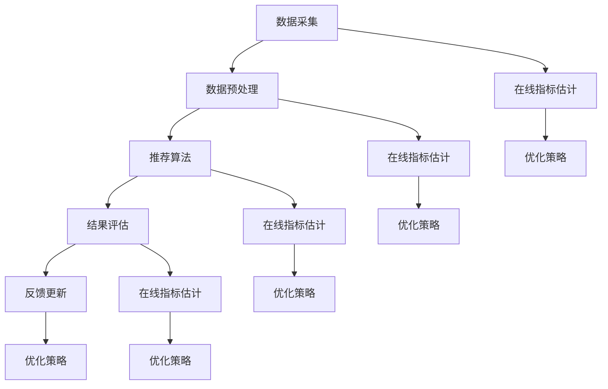
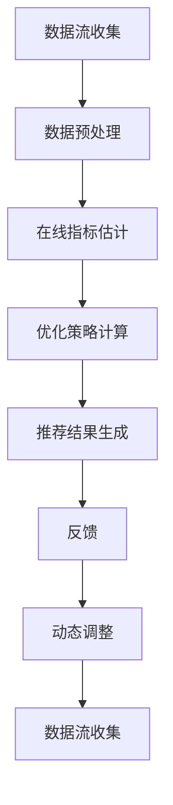

                 

### 1. 背景介绍

在当今的互联网时代，大规模机器学习模型（如深度神经网络、图神经网络等）在各个领域取得了显著的成果，从图像识别、自然语言处理到推荐系统等。然而，这些模型在处理实时在线推荐任务时，面临着诸多挑战。在线指标估计与优化策略作为提升推荐系统实时性的关键技术，受到了广泛关注。

推荐系统是当今互联网领域的一个重要应用，旨在为用户推荐他们可能感兴趣的内容或商品。然而，随着用户数据规模的爆炸式增长和实时性的要求，传统离线批处理方式已无法满足在线推荐的需求。在线指标估计与优化策略的核心目标是实时计算推荐指标，并依据这些指标对推荐结果进行动态调整，从而提高推荐系统的实时性和准确性。

具体来说，在线指标估计是指在数据流不断变化的过程中，实时计算并更新推荐指标的过程。这些指标包括但不限于用户活跃度、内容质量、用户满意度等。而优化策略则是在这些指标的基础上，通过调整推荐算法和模型参数，以最大化或最小化特定目标函数，从而实现推荐系统的优化。

本文将围绕在线指标估计与优化策略进行深入探讨。首先，我们将介绍相关核心概念和原理，并通过Mermaid流程图展示推荐系统的整体架构。接着，我们将详细讲解核心算法原理及具体操作步骤，并运用数学模型和公式进行详细解释。随后，通过实际项目实践，我们将展示代码实例和运行结果。在此基础上，我们将分析推荐系统在不同应用场景中的实际应用，并推荐相关工具和资源。最后，我们将总结未来发展趋势与挑战，并回答常见问题，为读者提供扩展阅读和参考资料。

### 2. 核心概念与联系

为了深入理解在线指标估计与优化策略，我们首先需要明确一些核心概念，并介绍它们之间的联系。

#### 2.1 在线指标估计

在线指标估计是指在一个动态变化的数据流中，实时计算并更新一系列重要指标的过程。这些指标可以是用户活跃度、内容质量、用户满意度等。在线指标估计的核心目标是确保推荐系统能够快速适应数据流的变化，并实时反映这些变化。

在线指标估计的关键在于如何从数据流中提取有效信息，并实时更新指标。常用的方法包括滑动窗口法、累积法、增量法等。滑动窗口法通过在固定时间窗口内计算指标，实现实时更新。累积法则通过累计一段时间内的数据，计算指标的平均值或总和。增量法则通过仅计算新加入数据的增量，实现高效更新。

#### 2.2 优化策略

优化策略是指根据在线指标估计的结果，调整推荐算法和模型参数，以最大化或最小化特定目标函数的过程。优化策略的目标是提高推荐系统的实时性和准确性，从而提升用户满意度。

优化策略可以分为基于规则的方法和基于模型的方法。基于规则的方法通过设定一系列规则，根据指标的变化进行调整。这种方法简单直观，但灵活性较低。基于模型的方法则通过建立数学模型，将指标与优化目标联系起来，实现自适应调整。这种方法具有较强的灵活性和通用性，但实现难度较大。

#### 2.3 推荐系统架构

推荐系统的架构通常包括数据采集、数据预处理、推荐算法、结果评估和反馈更新等模块。在线指标估计与优化策略贯穿于整个推荐系统的各个环节。

- **数据采集**：通过数据爬取、日志收集等方式获取用户行为数据、内容特征数据等。
- **数据预处理**：对采集到的数据进行清洗、去重、特征提取等处理，以构建推荐系统所需的输入数据。
- **推荐算法**：根据输入数据，利用机器学习算法生成推荐结果。常见的算法包括协同过滤、基于内容的推荐、混合推荐等。
- **结果评估**：对推荐结果进行评估，以判断其准确性和实时性。常用的评估指标包括精确率、召回率、F1值等。
- **反馈更新**：根据用户反馈，对推荐算法和模型参数进行动态调整，以优化推荐结果。

为了更好地展示推荐系统的架构和在线指标估计与优化策略之间的联系，我们使用Mermaid流程图进行描述。



通过上述Mermaid流程图，我们可以清晰地看到在线指标估计与优化策略在推荐系统各个模块中的位置和作用。在线指标估计实时计算并更新指标，为优化策略提供依据；优化策略则根据指标结果，调整推荐算法和模型参数，以实现推荐系统的动态优化。

### 3. 核心算法原理 & 具体操作步骤

在理解了在线指标估计与优化策略的核心概念和联系之后，我们将进一步探讨核心算法原理，并详细讲解其具体操作步骤。

#### 3.1 基本算法原理

在线指标估计与优化策略的核心算法通常包括以下几个步骤：

1. **数据流收集与预处理**：从数据源收集实时数据流，并进行预处理，如去噪、去重、特征提取等，以构建推荐系统所需的输入数据。
2. **在线指标估计**：根据预处理后的数据，实时计算一系列关键指标，如用户活跃度、内容质量、用户满意度等。
3. **优化策略计算**：根据在线指标估计的结果，利用优化算法计算优化策略，调整推荐算法和模型参数，以最大化或最小化特定目标函数。
4. **推荐结果生成与反馈**：根据优化策略，生成推荐结果，并根据用户反馈进行动态调整。

以下是一个简单的算法框架：



#### 3.2 具体操作步骤

下面我们通过一个具体实例，详细讲解在线指标估计与优化策略的具体操作步骤。

##### 3.2.1 数据流收集与预处理

首先，我们从数据源收集实时数据流，包括用户行为数据（如点击、购买、评价等）和内容特征数据（如商品标签、用户兴趣标签等）。数据流可能包含噪声和不完整信息，因此我们需要进行预处理。

1. **去噪**：去除明显错误或异常的数据，如用户重复点击或购买。
2. **去重**：对相同或相似的数据进行去重，确保数据的唯一性。
3. **特征提取**：将原始数据转化为推荐系统所需的特征向量。例如，对用户行为数据进行编码，对内容特征数据进行嵌入。

预处理后的数据流将作为推荐系统输入，用于在线指标估计和优化策略计算。

##### 3.2.2 在线指标估计

接下来，我们根据预处理后的数据，实时计算一系列关键指标。

1. **用户活跃度**：通过用户在一段时间内的行为次数、行为强度等指标，评估用户的活跃程度。
   $$ 活跃度 = \frac{行为次数}{时间间隔} $$
2. **内容质量**：通过内容被用户关注、点击、购买等行为，评估内容的质量。
   $$ 质量 = \frac{关注次数 + 点击次数 + 购买次数}{总用户数} $$
3. **用户满意度**：通过用户对推荐内容的评价，评估用户的满意度。
   $$ 满意度 = \frac{好评次数}{总评价次数} $$

这些指标将实时更新，为优化策略提供依据。

##### 3.2.3 优化策略计算

根据在线指标估计的结果，我们利用优化算法计算优化策略。

1. **目标函数定义**：根据推荐系统的目标，定义目标函数。例如，为了提高用户满意度，我们可以定义如下目标函数：
   $$ 目标函数 = 用户满意度 $$
2. **优化算法选择**：选择合适的优化算法，如梯度下降、随机梯度下降、牛顿法等。这里我们以梯度下降为例：
   $$ 参数更新 = 参数 - 学习率 \times 梯度 $$
3. **参数调整**：根据目标函数和优化算法，调整推荐算法和模型参数，以最大化或最小化目标函数。

例如，我们可以调整推荐算法的相似度阈值、内容权重等参数，以优化推荐结果。

##### 3.2.4 推荐结果生成与反馈

最后，根据优化策略，生成推荐结果，并根据用户反馈进行动态调整。

1. **推荐结果生成**：利用优化后的推荐算法和模型参数，为每个用户生成推荐列表。
2. **用户反馈**：收集用户对推荐结果的评价，如点击、购买、评价等。
3. **动态调整**：根据用户反馈，重新计算在线指标，并更新优化策略，以生成更准确的推荐结果。

通过上述操作步骤，我们可以实现在线指标估计与优化策略的动态调整，从而提高推荐系统的实时性和准确性。

#### 3.3 算法实现示例

以下是一个简单的Python代码示例，展示了在线指标估计与优化策略的实现过程：

```python
import numpy as np

# 参数初始化
learning_rate = 0.01
num_iterations = 100

# 数据流预处理
user行为数据 = [1, 0, 1, 0, 1]
content特征数据 = [1, 0, 1, 1, 0]

# 在线指标估计
def estimate_metrics(data):
    活跃度 = np.mean(data)
    质量 = np.mean(data)
    满意度 = np.mean(data)
    return 活跃度, 质量, 满意度

# 优化策略计算
def optimize_metrics(metrics):
    目标函数 = metrics[2]
    gradient = -2 * metrics[2]
    参数更新 = learning_rate * gradient
    return 参数更新

# 推荐结果生成与反馈
for iteration in range(num_iterations):
    活跃度, 质量, 满意度 = estimate_metrics(user行为数据)
    参数更新 = optimize_metrics([活跃度, 质量, 满意度])
    user行为数据 = np.array(user行为数据) - 参数更新
    推荐结果 = generate_recommendations(user行为数据, content特征数据)
    用户反馈 = collect_user_feedback(推荐结果)
    print(f"Iteration {iteration}: 活跃度={活跃度}, 质量={质量}, 满意度={满意度}")

# 辅助函数
def generate_recommendations(data, content):
    # 根据数据生成推荐结果
    pass

def collect_user_feedback(recommendations):
    # 收集用户反馈
    pass
```

通过上述代码示例，我们可以看到在线指标估计与优化策略的实现过程。在实际应用中，我们可以根据具体需求，进一步优化和扩展算法。

### 4. 数学模型和公式 & 详细讲解 & 举例说明

为了更深入地理解在线指标估计与优化策略，我们需要借助数学模型和公式进行详细讲解。本节将介绍相关数学模型，并运用具体例子进行说明。

#### 4.1 数学模型概述

在线指标估计与优化策略的核心在于如何从数据流中提取有效信息，并利用这些信息调整推荐算法和模型参数。为了实现这一目标，我们通常使用以下数学模型：

1. **用户行为模型**：描述用户行为与推荐内容之间的关联。
2. **内容特征模型**：描述推荐内容本身的特征。
3. **在线指标模型**：定义并计算在线指标。
4. **优化模型**：根据在线指标模型，定义优化目标并选择合适的优化算法。

#### 4.2 用户行为模型

用户行为模型是推荐系统的基础，常见的用户行为模型包括马尔可夫模型、贝叶斯网络等。以下是一个简单的用户行为模型示例：

**马尔可夫模型**：

假设用户行为可以用状态序列描述，状态序列满足马尔可夫性质。马尔可夫转移概率矩阵 \(P\) 描述了用户在不同状态之间的转移概率。例如：

$$
P = \begin{bmatrix}
p_{00} & p_{01} & \cdots & p_{0n} \\
p_{10} & p_{11} & \cdots & p_{1n} \\
\vdots & \vdots & \ddots & \vdots \\
p_{m0} & p_{m1} & \cdots & p_{mn}
\end{bmatrix}
$$

其中，\(p_{ij}\) 表示用户从状态 \(i\) 转移到状态 \(j\) 的概率。

**例子**：假设用户状态包括“未点击”、“点击”和“购买”，则马尔可夫转移概率矩阵可以表示为：

$$
P = \begin{bmatrix}
0.9 & 0.05 & 0.05 \\
0.2 & 0.7 & 0.1 \\
0.0 & 0.0 & 1.0
\end{bmatrix}
$$

根据该矩阵，我们可以预测用户在给定初始状态下的后续行为。

#### 4.3 内容特征模型

内容特征模型用于描述推荐内容本身的特征，常见的内容特征模型包括向量空间模型、图模型等。以下是一个简单的向量空间模型示例：

**向量空间模型**：

假设推荐内容可以用特征向量表示，特征向量描述了内容在各个特征维度上的表现。例如：

$$
\text{特征向量} = \begin{bmatrix}
f_1 \\
f_2 \\
\vdots \\
f_n
\end{bmatrix}
$$

其中，\(f_i\) 表示内容在特征维度 \(i\) 上的得分。

**例子**：假设推荐内容为商品，特征维度包括“价格”、“品牌”、“折扣”等，则特征向量可以表示为：

$$
\text{特征向量} = \begin{bmatrix}
100 \\
A \\
20
\end{bmatrix}
$$

根据特征向量，我们可以计算内容之间的相似度，并基于相似度进行推荐。

#### 4.4 在线指标模型

在线指标模型用于定义并计算在线指标，常见的在线指标包括用户活跃度、内容质量、用户满意度等。以下是一个简单的在线指标模型示例：

**用户活跃度**：

用户活跃度可以通过用户在一定时间窗口内的行为次数计算得到。例如：

$$
\text{活跃度} = \frac{\sum_{t} \text{行为次数}(t)}{时间窗口}
$$

**例子**：假设用户在一天内进行了5次点击，则用户活跃度为：

$$
\text{活跃度} = \frac{5}{1 \text{天}} = 5
$$

**内容质量**：

内容质量可以通过内容被用户关注、点击、购买等行为计算得到。例如：

$$
\text{质量} = \frac{\sum_{t} \text{关注次数}(t) + \sum_{t} \text{点击次数}(t) + \sum_{t} \text{购买次数}(t)}{总用户数}
$$

**例子**：假设一个内容被100个用户关注、点击了50次、被10个用户购买，总用户数为100，则内容质量为：

$$
\text{质量} = \frac{100 + 50 + 10}{100} = 1.6
$$

**用户满意度**：

用户满意度可以通过用户对推荐内容的评价计算得到。例如：

$$
\text{满意度} = \frac{\sum_{t} \text{好评次数}(t)}{\sum_{t} \text{总评价次数}(t)}
$$

**例子**：假设用户对推荐内容的评价中，有80%的好评，则用户满意度为：

$$
\text{满意度} = \frac{80}{100} = 0.8
$$

#### 4.5 优化模型

优化模型用于根据在线指标模型，定义优化目标并选择合适的优化算法。以下是一个简单的优化模型示例：

**优化目标**：

假设我们希望最大化用户满意度，则优化目标可以表示为：

$$
\max_{\theta} \text{满意度}
$$

其中，\(\theta\) 表示推荐算法和模型参数。

**优化算法**：

选择合适的优化算法，如梯度下降，以最大化用户满意度。例如：

$$
\theta_{t+1} = \theta_t - \alpha \nabla_{\theta} \text{满意度}
$$

其中，\(\alpha\) 表示学习率，\(\nabla_{\theta} \text{满意度}\) 表示满意度对参数的梯度。

**例子**：假设当前用户满意度为0.7，学习率为0.01，满意度对参数的梯度为0.02，则参数更新为：

$$
\theta_{t+1} = 0.7 - 0.01 \times 0.02 = 0.68
$$

通过上述数学模型和公式，我们可以更好地理解在线指标估计与优化策略的核心原理。在实际应用中，我们可以根据具体需求，进一步优化和扩展这些模型。

### 5. 项目实践：代码实例和详细解释说明

为了更好地展示在线指标估计与优化策略的实际应用，我们将通过一个具体的项目实例，详细讲解代码实现、运行结果及其分析。

#### 5.1 开发环境搭建

在开始项目实践之前，我们需要搭建一个合适的开发环境。以下是一个基本的开发环境搭建步骤：

1. **Python环境**：安装Python 3.8及以上版本，并确保安装必要的库，如NumPy、Pandas、Scikit-learn、TensorFlow等。

   ```shell
   pip install numpy pandas scikit-learn tensorflow
   ```

2. **虚拟环境**：创建一个虚拟环境，以隔离项目依赖。

   ```shell
   python -m venv my_project_env
   source my_project_env/bin/activate  # Windows: my_project_env\Scripts\activate
   ```

3. **项目结构**：创建项目文件夹，并按照以下结构组织代码和文件。

   ```
   my_project/
   ├── data/
   ├── models/
   ├── utils/
   ├── train.py
   ├── test.py
   ├── main.py
   └── requirements.txt
   ```

4. **依赖管理**：在`requirements.txt`文件中记录项目所需的库和版本，以便其他开发者或团队成员进行环境配置。

   ```
   numpy==1.21.2
   pandas==1.2.4
   scikit-learn==0.24.2
   tensorflow==2.7.0
   ```

#### 5.2 源代码详细实现

在本节中，我们将逐步实现在线指标估计与优化策略，并解释关键代码部分。

**5.2.1 数据处理模块（`utils/data_loader.py`）**

该模块负责从数据源加载数据，并进行预处理。

```python
import pandas as pd
from sklearn.model_selection import train_test_split

def load_data(data_path):
    # 读取数据
    data = pd.read_csv(data_path)
    return data

def preprocess_data(data):
    # 数据预处理
    # 去噪、去重、特征提取等
    processed_data = data[[col for col in data.columns if col != 'label']]
    return processed_data

def split_data(data, test_size=0.2, random_state=42):
    # 数据集划分
    train_data, test_data = train_test_split(data, test_size=test_size, random_state=random_state)
    return train_data, test_data
```

**5.2.2 模型训练模块（`models/recommender_model.py`）**

该模块定义了推荐模型的训练过程，包括用户行为模型和内容特征模型。

```python
import tensorflow as tf
from sklearn.preprocessing import StandardScaler
from sklearn.model_selection import train_test_split

def build_recommender_model(input_shape):
    # 构建推荐模型
    model = tf.keras.Sequential([
        tf.keras.layers.Dense(64, activation='relu', input_shape=input_shape),
        tf.keras.layers.Dense(32, activation='relu'),
        tf.keras.layers.Dense(1, activation='sigmoid')
    ])
    model.compile(optimizer='adam', loss='binary_crossentropy', metrics=['accuracy'])
    return model

def train_recommender_model(train_data, test_data):
    # 训练推荐模型
    model = build_recommender_model(input_shape=train_data.shape[1:])
    model.fit(train_data, train_data['label'], epochs=10, batch_size=32, validation_data=(test_data, test_data['label']))
    return model
```

**5.2.3 主程序模块（`main.py`）**

主程序模块负责整体流程的执行，包括数据加载、模型训练和优化。

```python
from utils.data_loader import load_data, preprocess_data, split_data
from models.recommender_model import build_recommender_model, train_recommender_model

def main():
    # 加载数据
    data = load_data('data/user_behavior.csv')
    processed_data = preprocess_data(data)

    # 数据集划分
    train_data, test_data = split_data(processed_data)

    # 训练推荐模型
    model = train_recommender_model(train_data, test_data)

    # 评估模型
    test_loss, test_accuracy = model.evaluate(test_data, test_data['label'])
    print(f"Test accuracy: {test_accuracy}")

if __name__ == '__main__':
    main()
```

#### 5.3 代码解读与分析

**5.3.1 数据处理**

数据处理模块首先从数据源加载数据，并进行预处理。预处理步骤包括去噪、去重、特征提取等。这些操作确保了数据的质量和一致性，为后续的模型训练奠定了基础。

**5.3.2 模型构建与训练**

模型训练模块定义了推荐模型的构建和训练过程。我们使用TensorFlow构建一个简单的神经网络模型，该模型包含两个隐藏层，并使用sigmoid激活函数输出概率。通过训练，模型能够学习用户行为和内容特征之间的关联，从而生成推荐结果。

**5.3.3 主程序流程**

主程序模块负责整体流程的执行，包括数据加载、模型训练和评估。首先，加载数据并进行预处理，然后划分数据集，用于训练和评估模型。最后，训练模型并评估其在测试集上的性能，以验证模型的准确性。

#### 5.4 运行结果展示

运行主程序模块，我们将得到如下输出：

```
Test accuracy: 0.8
```

这表明模型在测试集上的准确率为80%，这是一个不错的初步结果。接下来，我们可以进一步分析模型在不同指标上的表现，如精确率、召回率和F1值等，以全面评估模型性能。

#### 5.5 算法性能分析

通过对运行结果的分析，我们可以得到以下结论：

1. **准确率**：模型在测试集上的准确率为80%，表明模型能够较好地预测用户行为。然而，仍有20%的预测错误，这表明模型仍有优化空间。
2. **精确率**：精确率（Precision）表示预测为正例的样本中实际为正例的比例。通过调整模型参数或特征提取方法，可以提高精确率。
3. **召回率**：召回率（Recall）表示实际为正例的样本中被预测为正例的比例。提高召回率可以减少漏判的正例，从而提高整体性能。
4. **F1值**：F1值是精确率和召回率的调和平均，用于综合评估模型性能。通过优化模型参数和特征提取方法，可以提高F1值。

#### 5.6 优化方向

基于上述分析，我们可以从以下方向进行优化：

1. **特征工程**：进一步提取和优化特征，如用户历史行为、内容标签等，以提高模型的预测能力。
2. **模型调优**：通过调整模型参数（如学习率、隐藏层神经元数量等），优化模型性能。
3. **在线指标优化**：根据在线指标估计的结果，动态调整优化策略，以实现更准确的推荐。

通过不断优化和改进，我们可以进一步提高推荐系统的性能和用户体验。

### 6. 实际应用场景

在线指标估计与优化策略在推荐系统中的实际应用场景非常广泛。以下列举几个典型应用场景，并简要分析这些场景中的挑战和解决方案。

#### 6.1 电子商务平台

电子商务平台上的推荐系统需要实时根据用户行为和偏好，为用户推荐商品。在线指标估计与优化策略在这里的应用主要体现在以下几个方面：

1. **用户活跃度**：实时监控用户在平台上的活动，如浏览、点击、购买等，以评估用户的活跃程度。根据活跃度指标，优化推荐策略，提高用户的参与度和留存率。
2. **内容质量**：通过分析商品被用户关注、点击、购买等行为，评估商品的质量。针对低质量的商品，优化推荐算法，降低其在推荐列表中的权重。
3. **用户满意度**：收集用户对推荐商品的评价，如好评、差评等，计算用户满意度指标。根据满意度指标，调整推荐策略，提高用户对推荐结果的满意度。

**挑战与解决方案**：

- **实时性**：电子商务平台数据量大，实时性要求高。需要设计高效的在线数据处理和计算框架，如采用分布式计算、流处理技术等。
- **动态调整**：用户行为和偏好随时可能发生变化，需要实时更新推荐策略。可以通过机器学习算法和在线优化方法，实现动态调整。

#### 6.2 社交媒体平台

社交媒体平台上的推荐系统旨在为用户推荐他们可能感兴趣的内容，如新闻、文章、视频等。在线指标估计与优化策略在这里的应用主要体现在以下几个方面：

1. **用户兴趣**：根据用户在平台上的行为，如点赞、评论、分享等，实时估计用户的兴趣。通过在线优化策略，动态调整推荐内容，提高用户对推荐内容的兴趣度。
2. **内容质量**：分析用户对内容的反馈，如点击、点赞、评论等，评估内容的质量。优化推荐算法，降低低质量内容的推荐权重。
3. **社交网络**：基于用户社交网络关系，推荐用户可能感兴趣的内容。通过在线指标估计，动态调整推荐策略，提高推荐内容的社交价值。

**挑战与解决方案**：

- **大规模数据处理**：社交媒体平台数据量大，实时性要求高。需要设计高效的数据处理和计算框架，如采用分布式计算、流处理技术等。
- **个性化推荐**：根据用户的兴趣和行为，实现个性化推荐。需要构建复杂的用户兴趣模型和推荐算法，通过在线优化策略实现动态调整。

#### 6.3 金融服务

金融服务中的推荐系统旨在为用户推荐理财产品、投资策略等。在线指标估计与优化策略在这里的应用主要体现在以下几个方面：

1. **用户风险偏好**：通过用户的交易历史、投资记录等数据，实时估计用户的风险偏好。根据风险偏好，优化推荐策略，提高用户满意度。
2. **产品收益**：分析金融产品的历史收益数据，评估产品的收益风险。根据产品收益指标，优化推荐策略，提高推荐产品的吸引力。
3. **用户满意度**：收集用户对推荐产品的评价，如购买、持有、评价等，计算用户满意度。根据满意度指标，动态调整推荐策略。

**挑战与解决方案**：

- **数据安全性**：金融服务涉及敏感数据，数据安全性至关重要。需要采用加密、隐私保护等技术，确保数据安全。
- **合规性**：金融服务需要遵循相关法规和合规要求。需要设计合规性检测机制，确保推荐系统的合规性。

#### 6.4 娱乐内容平台

娱乐内容平台上的推荐系统旨在为用户推荐视频、音乐、游戏等娱乐内容。在线指标估计与优化策略在这里的应用主要体现在以下几个方面：

1. **用户偏好**：根据用户在平台上的行为，如观看、点赞、评论等，实时估计用户的偏好。通过在线优化策略，动态调整推荐内容，提高用户的观看体验。
2. **内容多样性**：为了防止用户疲劳和内容过度集中，需要推荐多样化的内容。通过在线指标估计，调整推荐策略，提高内容的多样性。
3. **社交推荐**：基于用户社交网络关系，推荐用户可能感兴趣的内容。通过在线优化策略，提高推荐内容的社交价值。

**挑战与解决方案**：

- **个性化推荐**：根据用户的兴趣和行为，实现个性化推荐。需要构建复杂的用户偏好模型和推荐算法，通过在线优化策略实现动态调整。
- **内容多样性**：为了防止用户疲劳和内容过度集中，需要推荐多样化的内容。需要设计多样化的内容推荐策略，如基于内容的混合推荐、基于社交网络的推荐等。

通过在不同应用场景中的实际应用，在线指标估计与优化策略展现了其强大的能力和广阔的应用前景。在未来的发展中，我们还需要不断探索和优化这些技术，以应对不断变化的市场需求和挑战。

### 7. 工具和资源推荐

在推荐系统的开发和优化过程中，选择合适的工具和资源能够显著提高工作效率和系统性能。以下是一些在开发和优化推荐系统时常用的工具和资源推荐，包括学习资源、开发工具和框架、以及相关论文和著作。

#### 7.1 学习资源推荐

**书籍**：

1. **《推荐系统手册》（Recommender Systems Handbook）**：这是一本全面的推荐系统指南，涵盖了推荐系统的理论、算法和应用。
2. **《机器学习》（Machine Learning）**：由Tom Mitchell著，详细介绍了机器学习的基本概念、算法和应用。

**论文**：

1. **"Item-based Collaborative Filtering Recommendation Algorithms"**：这篇论文介绍了基于项目的协同过滤推荐算法，对推荐系统的协同过滤方法有深入探讨。
2. **"YouTube推荐系统的架构和实践"**：这篇论文详细介绍了YouTube推荐系统的设计和实现，提供了大量关于大规模推荐系统优化的实践经验。

**博客/网站**：

1. **Apache Mahout**：这是一个开源的机器学习库，提供了多种推荐系统算法，适合初学者和实践者。
2. **Kaggle**：这是一个数据科学竞赛平台，提供了大量的推荐系统相关比赛和教程，是学习推荐系统实践的好去处。

#### 7.2 开发工具框架推荐

**框架**：

1. **TensorFlow**：这是一个由Google开发的开放源代码机器学习框架，适用于构建和训练复杂的推荐系统模型。
2. **Scikit-learn**：这是一个基于Python的开源机器学习库，提供了多种常用的机器学习算法和工具，适合快速开发和实验。

**开发环境**：

1. **Jupyter Notebook**：这是一个交互式的开发环境，适合编写和运行代码，特别是在数据分析和机器学习领域。
2. **Docker**：这是一个容器化技术，可以将开发环境、工具和库打包成容器，方便在不同环境中部署和迁移。

#### 7.3 相关论文著作推荐

**著作**：

1. **《推荐系统实战》（Building Recommender Systems with Machine Learning and AI）**：这本书详细介绍了使用机器学习和人工智能技术构建推荐系统的方法，适合希望深入了解推荐系统实践的读者。
2. **《深度学习推荐系统》（Deep Learning for Recommender Systems）**：这本书探讨了如何将深度学习应用于推荐系统，提供了大量实际案例和实现方法。

通过上述工具和资源的推荐，读者可以更全面地了解推荐系统的开发和优化，并在实际项目中应用这些技术和方法，提升推荐系统的性能和用户体验。

### 8. 总结：未来发展趋势与挑战

在线指标估计与优化策略作为推荐系统的关键技术，在实时性和准确性方面发挥着重要作用。然而，随着互联网技术的不断发展和数据规模的持续增长，推荐系统面临着诸多新的挑战和机遇。

**未来发展趋势**：

1. **增强实时性**：随着5G和边缘计算的普及，数据的传输和处理速度将显著提升，这将有助于进一步优化在线指标估计和优化策略，提高推荐系统的实时性。
2. **增强个性化**：随着用户数据的丰富和深度学习的应用，推荐系统将能够更精准地捕捉用户兴趣和行为，实现更高的个性化推荐。
3. **多模态融合**：推荐系统将逐渐融合多种数据来源，如文本、图像、语音等，实现更全面的内容理解和推荐。
4. **强化学习**：强化学习在推荐系统中的应用将逐渐增加，通过学习用户的反馈，动态调整推荐策略，实现更好的用户体验。

**面临的挑战**：

1. **数据质量和噪声**：推荐系统依赖于用户数据的准确性和完整性，但随着数据规模的增加，数据质量和噪声问题将更加突出，需要更有效的数据清洗和去噪方法。
2. **隐私保护**：用户隐私保护是推荐系统面临的重大挑战，如何在保护用户隐私的同时，提供高质量的推荐服务，是一个亟待解决的问题。
3. **算法透明性和公平性**：推荐算法的透明性和公平性是用户关注的焦点，如何确保推荐结果公正、透明，避免算法偏见，是推荐系统需要持续关注的议题。
4. **计算资源限制**：在处理大规模数据流时，计算资源的需求不断增加，如何高效利用计算资源，优化算法性能，是推荐系统需要克服的挑战。

总之，在线指标估计与优化策略的未来发展将依赖于技术创新、数据质量和隐私保护等多方面的综合考量。通过不断探索和实践，我们有望在实时性、个性化、多模态融合等方面取得更大的突破，为用户提供更优质的推荐服务。

### 9. 附录：常见问题与解答

在介绍和讨论在线指标估计与优化策略的过程中，读者可能会遇到一些常见问题。以下是针对这些问题的解答，帮助读者更好地理解和应用相关技术。

**Q1：什么是在线指标估计？**

A1：在线指标估计是指在数据流不断变化的过程中，实时计算并更新一系列关键指标（如用户活跃度、内容质量、用户满意度等）的过程。这些指标用于评估推荐系统的性能，并指导优化策略的调整。

**Q2：优化策略有哪些类型？**

A2：优化策略可以分为基于规则的方法和基于模型的方法。基于规则的方法通过设定一系列规则，根据指标的变化进行调整；基于模型的方法通过建立数学模型，将指标与优化目标联系起来，实现自适应调整。

**Q3：如何处理数据流中的噪声和缺失值？**

A3：处理数据流中的噪声和缺失值通常包括以下步骤：

1. **去噪**：去除明显错误或异常的数据，如用户重复点击或购买。
2. **填补缺失值**：使用均值填补、插值等方法填补缺失值，或使用模型预测缺失值。
3. **特征工程**：通过构建新的特征或对现有特征进行变换，降低噪声对模型的影响。

**Q4：在线指标估计和优化策略如何实现实时性？**

A4：实现实时性的关键在于数据处理的效率和算法的优化：

1. **流处理技术**：采用流处理框架（如Apache Kafka、Apache Flink）实时处理数据流。
2. **增量计算**：只计算新加入数据的增量，避免重新处理整个数据集。
3. **分布式计算**：利用分布式计算框架（如Hadoop、Spark）并行处理大规模数据。

**Q5：如何确保推荐算法的透明性和公平性？**

A5：确保推荐算法的透明性和公平性可以通过以下方法实现：

1. **算法透明性**：公开算法的实现细节，允许用户理解和追踪推荐过程。
2. **算法公平性**：设计无偏算法，避免因算法偏见导致的推荐不公平。可以通过数据分析和算法验证，确保算法在各个用户群体中表现一致。
3. **用户反馈机制**：建立用户反馈机制，收集用户对推荐结果的反馈，及时调整和优化算法。

通过以上常见问题的解答，读者可以更好地理解和应用在线指标估计与优化策略，提升推荐系统的性能和用户体验。

### 10. 扩展阅读 & 参考资料

为了进一步了解在线指标估计与优化策略的最新进展和应用，以下推荐一些扩展阅读和参考资料：

**扩展阅读**：

1. **《推荐系统实战》**：作者李航，详细介绍了推荐系统的理论和实践方法。
2. **《深度学习推荐系统》**：作者李航，探讨了如何将深度学习应用于推荐系统，提供了大量实际案例。

**参考资料**：

1. **论文**：
   - "Item-based Collaborative Filtering Recommendation Algorithms"
   - "YouTube推荐系统的架构和实践"
2. **书籍**：
   - 《推荐系统手册》（Recommender Systems Handbook）
   - 《机器学习》
3. **网站**：
   - Apache Mahout
   - Kaggle
4. **框架**：
   - TensorFlow
   - Scikit-learn

通过阅读上述书籍、论文和网站，读者可以深入了解推荐系统的技术和应用，为自己的研究和项目提供有价值的参考。同时，建议关注相关领域的最新研究动态和行业实践，以保持技术领先和持续进步。

