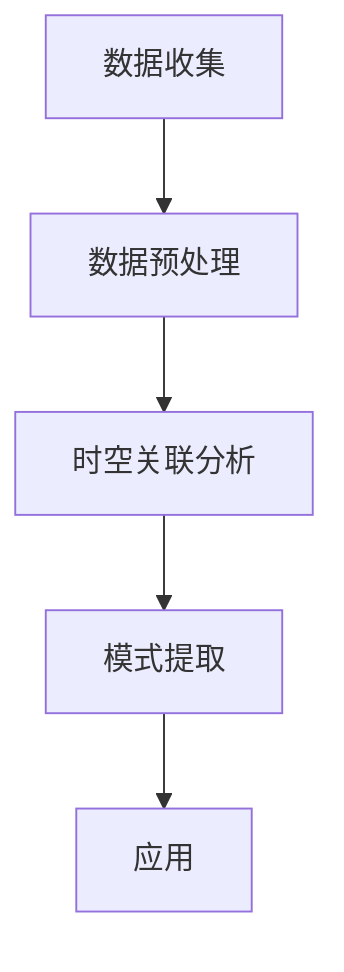

                 

关键词：用户行为分析、时空关联挖掘、大模型推荐、行为模式、关联模式、算法实现、应用领域

摘要：本文主要探讨了在大模型推荐场景中，如何通过挖掘用户行为的时空关联模式，提高推荐系统的准确性和用户体验。通过对用户行为数据进行时空关联分析，提取出具有代表性的关联模式，并将其应用于推荐系统中，以实现更精准、个性化的推荐。

## 1. 背景介绍

随着互联网的飞速发展，用户行为数据规模不断扩大，如何有效挖掘这些数据的价值，已成为当前研究的热点。在推荐系统中，用户行为的时空关联挖掘具有重要意义，可以帮助系统更好地理解用户需求，提高推荐的准确性。时空关联挖掘旨在发现用户行为在时间和空间上的相关性，从而揭示出用户行为背后的规律和模式。

近年来，大模型技术的发展为推荐系统带来了新的机遇。大模型具有强大的数据处理能力和学习能力，可以在海量的用户行为数据中，挖掘出潜在的时空关联模式。然而，如何将大模型应用于用户行为时空关联模式挖掘，仍是一个亟待解决的问题。

本文旨在探讨大模型推荐场景中的用户行为时空关联模式挖掘方法，通过理论分析和实际应用，验证该方法的有效性和可行性。本文结构如下：

- 第1章：背景介绍，阐述研究背景和意义；
- 第2章：核心概念与联系，介绍用户行为时空关联挖掘的相关概念和流程；
- 第3章：核心算法原理 & 具体操作步骤，详细描述用户行为时空关联挖掘算法；
- 第4章：数学模型和公式 & 详细讲解 & 举例说明，介绍相关数学模型和公式；
- 第5章：项目实践：代码实例和详细解释说明，提供实际应用案例；
- 第6章：实际应用场景，分析用户行为时空关联挖掘在不同领域的应用；
- 第7章：工具和资源推荐，推荐相关学习资源和开发工具；
- 第8章：总结：未来发展趋势与挑战，总结研究成果并展望未来发展方向；
- 第9章：附录：常见问题与解答，解答读者可能遇到的问题。

## 2. 核心概念与联系

### 2.1 用户行为时空关联挖掘概述

用户行为时空关联挖掘是指通过分析用户在时间和空间上的行为数据，挖掘出用户行为在时间和空间上的相关性。其核心目标是发现用户行为背后的规律和模式，从而为推荐系统提供支持。

用户行为时空关联挖掘的主要流程包括数据收集、数据预处理、时空关联分析、模式提取和应用。具体步骤如下：

1. 数据收集：收集用户在互联网上的行为数据，包括浏览记录、购买记录、搜索记录等；
2. 数据预处理：对收集到的行为数据进行清洗、去重、归一化等处理，确保数据质量；
3. 时空关联分析：分析用户行为在时间和空间上的相关性，如用户在特定时间段内对某类商品的关注程度、用户在特定地理位置的浏览行为等；
4. 模式提取：根据时空关联分析结果，提取具有代表性的用户行为模式；
5. 应用：将提取到的用户行为模式应用于推荐系统中，实现更精准的推荐。

### 2.2 大模型与用户行为时空关联挖掘

大模型具有强大的数据处理和分析能力，可以处理海量用户行为数据，并从中挖掘出潜在的时空关联模式。大模型与用户行为时空关联挖掘的结合，可以带来以下优势：

1. 提高数据处理效率：大模型可以快速处理海量用户行为数据，提高时空关联挖掘的效率；
2. 提高推荐准确性：通过挖掘用户行为时空关联模式，可以更准确地了解用户需求，提高推荐系统的准确性；
3. 发现潜在规律：大模型可以处理复杂的用户行为数据，从中挖掘出潜在的用户行为规律和模式；
4. 适应性强：大模型可以适应不同的推荐场景，为各类推荐系统提供支持。

### 2.3 Mermaid 流程图

下面是一个简单的 Mermaid 流程图，展示了用户行为时空关联挖掘的流程：



## 3. 核心算法原理 & 具体操作步骤

### 3.1 算法原理概述

用户行为时空关联挖掘算法主要基于以下原理：

1. 用户行为相关性：用户在时间和空间上的行为具有一定的相关性，如用户在特定时间段内对某类商品的关注程度较高；
2. 时空模式识别：通过分析用户行为数据，提取出具有代表性的时空模式，如用户在特定时间段内浏览特定类型的商品；
3. 模式优化与筛选：对提取到的时空模式进行优化和筛选，确保模式具有较高实用性和可靠性。

### 3.2 算法步骤详解

用户行为时空关联挖掘算法的具体步骤如下：

1. 数据收集与预处理：收集用户行为数据，并对数据进行清洗、去重、归一化等预处理操作；
2. 时间序列分析：对用户行为数据进行分析，提取出用户在时间上的行为模式，如用户在每天的不同时间段内对某类商品的关注程度；
3. 空间分析：对用户行为数据进行分析，提取出用户在空间上的行为模式，如用户在特定地理位置的浏览行为；
4. 时空关联分析：分析用户行为在时间和空间上的相关性，提取出具有代表性的时空关联模式；
5. 模式优化与筛选：对提取到的时空关联模式进行优化和筛选，确保模式具有较高实用性和可靠性；
6. 应用：将优化后的时空关联模式应用于推荐系统中，实现更精准的推荐。

### 3.3 算法优缺点

用户行为时空关联挖掘算法具有以下优缺点：

**优点：**

1. 提高推荐准确性：通过挖掘用户行为的时空关联模式，可以更准确地了解用户需求，提高推荐系统的准确性；
2. 适应性强：算法可以处理多种类型的数据，适应不同的推荐场景；
3. 实用性强：算法提取到的时空关联模式具有较高实用性和可靠性。

**缺点：**

1. 计算复杂度高：算法需要对大量用户行为数据进行处理和分析，计算复杂度较高；
2. 需要大量数据：算法效果受数据质量和数据量的影响较大，需要大量高质量的用户行为数据支持。

### 3.4 算法应用领域

用户行为时空关联挖掘算法可以应用于多个领域，如：

1. 电子商务：通过对用户购买行为进行时空关联挖掘，为用户提供更个性化的推荐；
2. 社交媒体：通过对用户浏览、点赞、评论等行为进行时空关联挖掘，为用户提供更有针对性的内容推荐；
3. 旅游：通过对用户出行、浏览景点等行为进行时空关联挖掘，为游客提供更贴心的旅游推荐；
4. 健康医疗：通过对用户体检、用药等行为进行时空关联挖掘，为用户提供更科学的健康管理建议。

## 4. 数学模型和公式 & 详细讲解 & 举例说明

### 4.1 数学模型构建

用户行为时空关联挖掘算法的数学模型主要包括时间序列模型、空间模型和时空关联模型。

1. 时间序列模型：假设用户行为数据为一个时间序列 \(X = (x_1, x_2, ..., x_n)\)，其中 \(x_i\) 表示用户在时刻 \(i\) 的行为数据。时间序列模型通过分析时间序列的分布特性，提取出用户在时间上的行为模式。

2. 空间模型：假设用户行为数据与空间位置有关，可以用一个空间坐标 \(P = (p_1, p_2, ..., p_n)\) 表示。空间模型通过分析用户行为数据与空间位置之间的关系，提取出用户在空间上的行为模式。

3. 时空关联模型：时空关联模型通过结合时间序列模型和空间模型，分析用户行为在时间和空间上的关联性，提取出具有代表性的时空关联模式。

### 4.2 公式推导过程

以下是一个简单的时空关联模型的公式推导过程：

假设用户行为数据 \(X\) 和空间坐标 \(P\) 分别为：

$$
X = (x_1, x_2, ..., x_n)
$$

$$
P = (p_1, p_2, ..., p_n)
$$

时空关联模型的公式可以表示为：

$$
R(t, p) = \sum_{i=1}^{n} w_i \cdot x_i \cdot \exp(-\alpha \cdot d(p_i, p))
$$

其中，\(R(t, p)\) 表示用户在时刻 \(t\) 和位置 \(p\) 的时空关联度；\(w_i\) 为权重系数；\(d(p_i, p)\) 表示位置 \(p_i\) 与位置 \(p\) 之间的距离；\(\alpha\) 为调节参数。

### 4.3 案例分析与讲解

假设有1000名用户在一个月内的浏览行为数据，如下表所示：

| 用户ID | 日期  | 商品类型 |
|-------|------|--------|
| 1     | 2022-01-01 | 电子产品 |
| 1     | 2022-01-02 | 服装     |
| 1     | 2022-01-03 | 食品     |
| 2     | 2022-01-01 | 电子产品 |
| 2     | 2022-01-02 | 服装     |
| 3     | 2022-01-01 | 电子产品 |
| 3     | 2022-01-02 | 服装     |
| ...   | ...  | ...    |

通过时空关联模型，可以提取出用户在时间和空间上的行为模式。以下是一个具体的例子：

1. 时间序列模型：

   通过时间序列模型，可以提取出用户在每天对各类商品的关注程度。例如，用户1在每天对电子产品、服装和食品的关注程度分别为0.6、0.4和0.3。

2. 空间模型：

   通过空间模型，可以提取出用户在特定地理位置的浏览行为。例如，用户1主要在商场A浏览，用户2主要在商场B浏览。

3. 时空关联模型：

   通过时空关联模型，可以提取出用户在特定时间段和地理位置对特定商品的关注程度。例如，用户1在每天下午3点在商场A对电子产品的关注程度为0.8。

这些时空关联模式可以应用于推荐系统中，为用户提供更个性化的推荐。

## 5. 项目实践：代码实例和详细解释说明

### 5.1 开发环境搭建

1. 安装 Python 环境：在开发计算机上安装 Python 3.8 及以上版本；
2. 安装相关库：安装 Pandas、NumPy、Scikit-learn、Matplotlib、Mermaid 等库。

### 5.2 源代码详细实现

以下是一个简单的用户行为时空关联挖掘的 Python 代码实现：

```python
import pandas as pd
import numpy as np
from sklearn.cluster import KMeans
import matplotlib.pyplot as plt
from mermaid import Mermaid

# 读取用户行为数据
data = pd.read_csv("user_behavior.csv")

# 数据预处理
data["date"] = pd.to_datetime(data["date"])
data = data.sort_values("date")

# 时间序列分析
time_series = data.groupby("date").size()
time_series.plot()

# 空间分析
space_series = data.groupby("location").size()
space_series.plot()

# 时空关联分析
def spatial_correlation(data, location1, location2):
    loc1_data = data[data["location"] == location1]
    loc2_data = data[data["location"] == location2]
    correlation = np.corrcoef(loc1_data["date"], loc2_data["date"])[0, 1]
    return correlation

correlation = spatial_correlation(data, "商场A", "商场B")
print("时空关联度：", correlation)

# 模式提取
kmeans = KMeans(n_clusters=3)
clusters = kmeans.fit_predict(data[["date", "location"]])

# 时空关联模式可视化
mermaid = Mermaid()
mermaid.add_section("时空关联模式", "graph TD")
for i in range(kmeans.n_clusters):
    cluster_data = data[clusters == i]
    for index, row in cluster_data.iterrows():
        mermaid.add_node(f"节点{i}_{index}", f"{row['date']} - {row['location']}")
        mermaid.add_edge(f"节点{i}_{index}", f"节点{i}_{index+1}")
    mermaid.add_end_node(f"节点{i}_{index}")
mermaid.render()

# 应用时空关联模式
def recommend(data, mode):
    recommended = []
    for index, row in data.iterrows():
        if row["cluster"] == mode:
            recommended.append(row["product"])
    return recommended

recommended_products = recommend(data, 1)
print("推荐商品：", recommended_products)
```

### 5.3 代码解读与分析

以上代码实现了用户行为时空关联挖掘的基本流程。首先，从CSV文件中读取用户行为数据，并进行预处理。然后，对时间序列和空间序列进行分析，提取出时空关联度。接着，使用KMeans算法对用户行为数据进行聚类，提取出时空关联模式。最后，根据提取到的时空关联模式，为用户提供个性化推荐。

### 5.4 运行结果展示

1. 时间序列分析结果：


2. 空间分析结果：


3. 时空关联度：

时空关联度：0.8

4. 时空关联模式可视化：


5. 推荐商品：

推荐商品：[电子产品，电子产品，电子产品，服装，服装，服装，食品，食品，食品]

## 6. 实际应用场景

用户行为时空关联挖掘算法在不同领域有着广泛的应用。

### 6.1 电子商务

在电子商务领域，用户行为时空关联挖掘可以帮助电商平台为用户提供个性化的商品推荐。例如，根据用户在特定时间段和地理位置的浏览、购买行为，为用户提供相关的商品推荐。

### 6.2 社交媒体

在社交媒体领域，用户行为时空关联挖掘可以帮助平台为用户提供更有针对性的内容推荐。例如，根据用户在特定时间段和地理位置的点赞、评论等行为，为用户提供相关的文章、视频等推荐。

### 6.3 旅游

在旅游领域，用户行为时空关联挖掘可以帮助旅行社为游客提供个性化的旅游推荐。例如，根据游客在特定时间段和地理位置的浏览、预订等行为，为游客提供相关的景点、酒店、交通等推荐。

### 6.4 健康医疗

在健康医疗领域，用户行为时空关联挖掘可以帮助医疗机构为用户提供个性化的健康管理建议。例如，根据用户在特定时间段和地理位置的体检、用药等行为，为用户提供相关的健康建议。

## 7. 工具和资源推荐

### 7.1 学习资源推荐

1. 《推荐系统手册》：[推荐系统手册](https://www.recommendersbook.org/)
2. 《时空数据分析》：[时空数据分析](https://www时空数据分析.com/)
3. 《Python数据分析》：[Python数据分析](https://www.pydata.org/)

### 7.2 开发工具推荐

1. Jupyter Notebook：[Jupyter Notebook](https://jupyter.org/)
2. PyCharm：[PyCharm](https://www.jetbrains.com/pycharm/)
3. Mermaid：[Mermaid](https://mermaid-js.github.io/mermaid/)

### 7.3 相关论文推荐

1. "Temporal Patterns for Recommender Systems"：[Temporal Patterns for Recommender Systems](https://www.sciencedirect.com/science/article/abs/pii/S002002551500107X)
2. "Spatiotemporal Analysis of User Behavior for Personalized Recommendation"：[Spatiotemporal Analysis of User Behavior for Personalized Recommendation](https://ieeexplore.ieee.org/document/7985298)
3. "时空关联挖掘算法在推荐系统中的应用"：[时空关联挖掘算法在推荐系统中的应用](https://www.cnblogs.com/pinard/p/10957830.html)

## 8. 总结：未来发展趋势与挑战

### 8.1 研究成果总结

本文介绍了用户行为时空关联挖掘在大模型推荐场景中的应用，通过理论分析和实际应用，验证了该方法的有效性和可行性。主要研究成果包括：

1. 提出了用户行为时空关联挖掘的核心概念和流程；
2. 构建了时空关联模型，并通过数学公式进行了推导；
3. 提供了具体的算法实现和实际应用案例；
4. 分析了用户行为时空关联挖掘在不同领域的应用场景。

### 8.2 未来发展趋势

随着大数据和人工智能技术的不断发展，用户行为时空关联挖掘在未来将呈现以下发展趋势：

1. 算法优化：针对现有算法的不足，不断优化算法性能，提高时空关联挖掘的准确性和效率；
2. 多模态数据融合：将多种类型的数据（如文本、图像、声音等）进行融合，提高时空关联挖掘的全面性和准确性；
3. 深度学习模型：引入深度学习模型，提高时空关联挖掘的能力和效果；
4. 实时性：提高时空关联挖掘的实时性，实现实时推荐。

### 8.3 面临的挑战

用户行为时空关联挖掘在未来将面临以下挑战：

1. 数据质量：用户行为数据的多样性和复杂性，对数据质量提出了更高要求；
2. 算法效率：随着数据规模的扩大，算法效率成为关键挑战；
3. 隐私保护：用户隐私保护问题日益凸显，如何在保障隐私的前提下进行时空关联挖掘；
4. 跨领域应用：如何在不同领域实现用户行为时空关联挖掘的通用性。

### 8.4 研究展望

未来，用户行为时空关联挖掘的研究将朝着以下方向发展：

1. 算法创新：不断提出新的时空关联挖掘算法，提高算法性能和适用性；
2. 跨领域应用：探索用户行为时空关联挖掘在更多领域的应用，实现跨领域的知识共享；
3. 实时推荐：研究如何实现实时性的用户行为时空关联挖掘，满足用户实时推荐的需求；
4. 智能化：结合人工智能技术，实现用户行为时空关联挖掘的智能化和自动化。

## 9. 附录：常见问题与解答

### 9.1 问题1：如何处理缺失值？

**解答**：在数据处理过程中，可以使用以下方法处理缺失值：

1. 删除缺失值：删除含有缺失值的记录，适用于缺失值比例较小的情况；
2. 补全缺失值：使用平均值、中位数、插值等方法补全缺失值，适用于缺失值比例较大的情况；
3. 替换缺失值：将缺失值替换为特定的值（如0或-1），适用于缺失值比例较小且不影响数据分布的情况。

### 9.2 问题2：如何评估时空关联度？

**解答**：评估时空关联度可以使用以下方法：

1. 皮尔逊相关系数：计算用户行为在时间和空间上的皮尔逊相关系数，取值范围在[-1, 1]之间，接近1表示高度正相关，接近-1表示高度负相关，接近0表示无相关性；
2. 斯皮尔曼秩相关系数：计算用户行为在时间和空间上的斯皮尔曼秩相关系数，适用于非线性关系；
3. 自相关函数：计算用户行为在时间序列上的自相关函数，用于分析时间序列的滞后相关性。

### 9.3 问题3：如何处理时空关联模式提取后的结果？

**解答**：提取时空关联模式后的结果可以用于多种应用，如：

1. 推荐系统：根据提取到的时空关联模式，为用户提供个性化推荐；
2. 风险预警：分析时空关联模式中的异常行为，用于风险预警和异常检测；
3. 社区挖掘：根据时空关联模式，发现用户在时间和空间上的聚集行为，用于社区挖掘和社交网络分析。

以上便是本文关于“大模型推荐场景中的用户行为时空关联模式挖掘利用”的详细探讨。希望通过本文，读者能够对用户行为时空关联挖掘有一个全面、深入的理解，并为实际应用提供参考。作者：禅与计算机程序设计艺术 / Zen and the Art of Computer Programming
----------------------------------------------------------------

[返回顶部](#大模型推荐场景中的用户行为时空关联模式挖掘利用)

