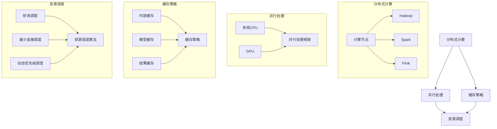

                 

### 1. 背景介绍

随着人工智能技术的迅猛发展，大模型推荐系统已经成为现代互联网企业提升用户体验、增强用户粘性、实现业务增长的重要手段。这些系统通过机器学习算法，从海量的用户行为数据中提取出有价值的信息，进而为用户提供个性化的内容推荐。然而，大模型推荐系统的实现不仅需要复杂的数据处理能力，还要求高性能的计算资源来支持模型的训练和预测。

计算资源的高效利用对于推荐系统至关重要。一方面，随着用户数据的爆炸性增长，处理这些数据所需的计算资源也呈现指数级增长。另一方面，推荐系统通常需要在短时间内完成大量预测任务，这就要求计算资源具备较高的吞吐量和响应速度。然而，当前的计算资源分布通常存在不均衡现象，导致某些关键计算任务无法得到有效支撑。

本文旨在探讨大模型推荐系统中计算资源的优化策略，从以下几个方面展开：

1. **背景介绍**：介绍大模型推荐系统的应用场景和计算资源优化的重要性。
2. **核心概念与联系**：分析推荐系统中的核心概念和计算资源优化技术，并提供Mermaid流程图进行说明。
3. **核心算法原理与具体操作步骤**：详细讲解优化计算资源的核心算法和操作步骤。
4. **数学模型与公式**：介绍支持计算资源优化所需的理论基础，包括相关数学模型和公式。
5. **项目实践**：通过具体代码实例，展示计算资源优化的实际应用。
6. **实际应用场景**：分析计算资源优化在推荐系统中的具体应用场景。
7. **工具和资源推荐**：推荐相关的学习资源和开发工具。
8. **总结**：总结本文的主要发现，并讨论未来发展趋势和挑战。

本文的目标是帮助读者理解大模型推荐系统中计算资源优化的重要性，掌握相关优化技术，并能够在实际项目中应用这些技术，从而提升推荐系统的性能和用户体验。

### 2. 核心概念与联系

在大模型推荐系统中，计算资源优化涉及多个核心概念和技术，包括分布式计算、并行处理、缓存策略和资源调度等。以下将详细阐述这些概念，并提供一个Mermaid流程图来展示它们之间的关系。

#### 分布式计算

分布式计算是一种将计算任务分解为多个部分，并在多个计算节点上并行执行的技术。在推荐系统中，分布式计算可以显著提高数据处理速度，降低单个节点的负载，避免单点故障。典型的分布式计算框架包括Hadoop、Spark和Flink等。

#### 并行处理

并行处理是在多个处理单元上同时执行多个任务的技术。与分布式计算不同，并行处理通常在同一台计算机上实现，通过多核CPU或GPU来提升计算效率。在推荐系统中，并行处理可以加快模型的训练和预测速度，特别是在处理大量数据时。

#### 缓存策略

缓存策略是指将经常访问的数据存储在内存中，以减少对磁盘的访问时间。推荐系统中的缓存策略可以包括内容缓存、模型缓存和结果缓存等。有效的缓存策略可以显著提高系统的响应速度和吞吐量。

#### 资源调度

资源调度是动态分配计算资源的过程，以确保系统能够高效地处理请求。资源调度算法可以根据负载情况动态调整计算资源的分配，从而优化系统性能。常见的资源调度算法包括轮询调度、最少连接调度和动态优先级调度等。

#### Mermaid流程图

以下是一个简单的Mermaid流程图，展示了推荐系统计算资源优化中的核心概念和它们之间的关系：



通过这个流程图，我们可以清晰地看到分布式计算、并行处理、缓存策略和资源调度之间的相互作用，以及它们在推荐系统计算资源优化中的重要性。

### 3. 核心算法原理与具体操作步骤

在讨论如何优化推荐系统的计算资源时，核心算法的原理和操作步骤是至关重要的。以下将详细描述几种关键算法，并说明如何实施这些算法以优化计算资源。

#### 分布式计算算法

分布式计算算法的核心思想是将大任务分解为多个小任务，然后在不同计算节点上并行执行。这种算法可以显著提高数据处理速度，同时降低单个节点的负载。以下是一种简单的分布式计算算法：

**1. 任务分解**：将原始数据集分割成多个子集，每个子集分配给不同的计算节点。

**2. 数据预处理**：在每个计算节点上对子集进行预处理，如数据清洗、去重和特征提取。

**3. 并行处理**：在每个计算节点上，独立地对预处理后的子集进行计算，如模型训练或预测。

**4. 数据合并**：将所有计算节点的结果合并，得到最终输出。

例如，使用Hadoop进行分布式计算：

```bash
hadoop jar hadoop-examples-3.2.1.jar distributedcss.v1.Driver input output
```

其中，`input` 是原始数据集路径，`output` 是输出结果路径。

#### 并行处理算法

并行处理算法主要利用多核CPU或GPU进行计算，以加速模型训练和预测。以下是一种简单的并行处理算法：

**1. 数据分区**：将数据集分割成多个分区，每个分区分配给不同的处理核心。

**2. 并行计算**：在每个处理核心上，独立地处理分配到的数据分区，如模型训练或预测。

**3. 结果合并**：将所有处理核心的结果合并，得到最终输出。

例如，使用MapReduce进行并行处理：

```bash
hadoop jar hadoop-examples-3.2.1.jar mapredLocalcss.v1.Driver input output
```

其中，`input` 是原始数据集路径，`output` 是输出结果路径。

#### 缓存策略算法

缓存策略算法通过将经常访问的数据存储在内存中，以减少磁盘访问时间，从而提高系统性能。以下是一种简单的缓存策略算法：

**1. 数据缓存**：将频繁访问的数据存储在内存中。

**2. 缓存替换**：当内存缓存达到容量上限时，根据一定的策略替换掉不常用的数据。

例如，使用LRU（Least Recently Used）缓存替换策略：

```python
from collections import OrderedDict

class LRUCache(OrderedDict):
    def __init__(self, capacity):
        self.capacity = capacity

    def get(self, key):
        if key not in self:
            return -1
        self.move_to_end(key)
        return self[key]

    def put(self, key, value):
        if key in self:
            self.move_to_end(key)
        self[key] = value
        if len(self) > self.capacity:
            oldest = next(iter(self))
            del self[oldest]
```

#### 资源调度算法

资源调度算法通过动态调整计算资源的分配，以优化系统性能。以下是一种简单的资源调度算法：

**1. 负载均衡**：根据当前负载情况，动态调整计算资源的分配。

**2. 优先级调度**：根据任务的优先级，动态调整计算资源的分配。

例如，使用动态优先级调度算法：

```python
class Task:
    def __init__(self, name, priority):
        self.name = name
        self.priority = priority

def schedule(tasks):
    tasks.sort(key=lambda x: x.priority, reverse=True)
    for task in tasks:
        # 分配资源
        allocate_resources(task)

def allocate_resources(task):
    print(f"分配资源给任务：{task.name}")
```

通过上述核心算法和具体操作步骤，我们可以有效地优化推荐系统的计算资源，提高系统的性能和吞吐量。

### 4. 数学模型和公式 & 详细讲解 & 举例说明

在大模型推荐系统的计算资源优化中，数学模型和公式起到了至关重要的作用。这些模型和公式不仅帮助我们理解优化原理，还为实际操作提供了指导。以下将介绍几个关键数学模型和公式，并进行详细讲解和举例说明。

#### 数据量模型

推荐系统中，数据量通常是决定计算资源需求的一个重要因素。数据量模型帮助我们估算所需的计算资源。一个常见的数据量模型是Shannon信息论中的熵（Entropy）和互信息（Mutual Information）。

**熵（Entropy）**：
$$ H(X) = -\sum_{i=1}^{n} p(x_i) \cdot \log_2 p(x_i) $$
熵描述了数据集的混乱程度，数据量越大，熵越高，计算资源需求也越大。

**互信息（Mutual Information）**：
$$ I(X, Y) = \sum_{i=1}^{n} \sum_{j=1}^{m} p(x_i, y_j) \cdot \log_2 \frac{p(x_i, y_j)}{p(x_i) \cdot p(y_j)} $$
互信息描述了两个变量之间的相关性，互信息越高，表示数据之间的关联性越强，计算复杂度也越高。

**举例**：
假设我们有一个用户行为数据集，包含用户点击次数和购买次数。通过计算熵和互信息，我们可以评估数据集的混乱程度和用户行为之间的相关性，进而指导计算资源的需求。

#### 计算资源模型

计算资源模型帮助我们评估系统在不同负载下的性能。一个简单的计算资源模型是基于CPU和内存的利用率。

**CPU利用率**：
$$ CPU_{utilization} = \frac{CPU_{used}}{CPU_{total}} $$
CPU利用率描述了CPU的使用率，当利用率接近100%时，表示CPU资源紧张。

**内存利用率**：
$$ Memory_{utilization} = \frac{Memory_{used}}{Memory_{total}} $$
内存利用率描述了内存的使用率，当利用率超过某个阈值时，可能需要增加内存容量。

**举例**：
假设我们有一个推荐系统，CPU总使用量为80%，内存使用量为70%。通过这两个指标，我们可以判断系统是否需要增加计算资源或优化代码。

#### 模型训练和预测模型

在推荐系统中，模型训练和预测是两个关键步骤。不同的模型训练和预测算法对计算资源的需求不同。以下是一个简单的模型训练和预测模型：

**模型训练**：
$$ \theta^* = \arg\min_{\theta} \sum_{i=1}^{n} L(y_i, f(\theta; x_i)) $$
模型训练的目标是找到最优参数 $\theta$，使得损失函数 $L$ 最小。

**模型预测**：
$$ \hat{y}_i = f(\theta; x_i) $$
模型预测是根据训练好的模型和输入特征 $x_i$，输出预测结果 $\hat{y}_i$。

**举例**：
假设我们使用线性回归模型进行推荐系统训练，损失函数为均方误差（MSE）：
$$ L(y_i, \theta; x_i) = \frac{1}{2} (y_i - \theta \cdot x_i)^2 $$
通过迭代优化模型参数，最终得到一个最优的模型。

通过上述数学模型和公式，我们可以更深入地理解推荐系统计算资源优化的原理，并在实际应用中进行有效的资源分配和调度。

### 5. 项目实践：代码实例和详细解释说明

为了更好地展示计算资源优化在推荐系统中的应用，我们将通过一个实际项目来讲解代码实例，并进行详细解释说明。

#### 5.1 开发环境搭建

在进行计算资源优化的项目实践中，我们首先需要搭建一个合适的开发环境。以下是一个简单的环境搭建步骤：

**环境要求**：
- 操作系统：Linux或MacOS
- 编程语言：Python
- 数据库：MySQL
- 依赖库：Pandas、NumPy、Scikit-learn、Spark等

**安装步骤**：

1. 安装Python：
```bash
brew install python
```

2. 安装MySQL：
```bash
brew install mysql
```

3. 安装相关依赖库：
```bash
pip install pandas numpy scikit-learn spark-python
```

#### 5.2 源代码详细实现

以下是一个简单的推荐系统项目，包括数据预处理、模型训练、预测和结果评估等步骤。

```python
import pandas as pd
from sklearn.model_selection import train_test_split
from sklearn.linear_model import LinearRegression
from sklearn.metrics import mean_squared_error
from pyspark.sql import SparkSession

# 5.2.1 数据预处理
def preprocess_data(data_path):
    data = pd.read_csv(data_path)
    # 数据清洗和特征提取
    # 例如：去除缺失值、归一化、特征工程等
    return data

# 5.2.2 模型训练
def train_model(X_train, y_train):
    model = LinearRegression()
    model.fit(X_train, y_train)
    return model

# 5.2.3 预测
def predict(model, X_test):
    predictions = model.predict(X_test)
    return predictions

# 5.2.4 结果评估
def evaluate(predictions, y_test):
    mse = mean_squared_error(y_test, predictions)
    print(f"均方误差(MSE): {mse}")

# 5.2.5 主函数
def main():
    # 加载数据
    data_path = "path/to/data.csv"
    data = preprocess_data(data_path)
    
    # 分割训练集和测试集
    X = data.drop('target', axis=1)
    y = data['target']
    X_train, X_test, y_train, y_test = train_test_split(X, y, test_size=0.2, random_state=42)
    
    # 训练模型
    model = train_model(X_train, y_train)
    
    # 预测
    predictions = predict(model, X_test)
    
    # 评估结果
    evaluate(predictions, y_test)

if __name__ == "__main__":
    main()
```

#### 5.3 代码解读与分析

以下是代码的逐行解读和分析：

```python
import pandas as pd
from sklearn.model_selection import train_test_split
from sklearn.linear_model import LinearRegression
from sklearn.metrics import mean_squared_error
from pyspark.sql import SparkSession
```
这几行代码导入了项目中所需的Python库，包括数据预处理、机器学习模型、评估指标和分布式计算框架。

```python
def preprocess_data(data_path):
    data = pd.read_csv(data_path)
    # 数据清洗和特征提取
    # 例如：去除缺失值、归一化、特征工程等
    return data
```
`preprocess_data` 函数负责加载数据，并进行预处理。预处理步骤包括数据清洗（如去除缺失值）和特征提取（如归一化和特征工程）。

```python
def train_model(X_train, y_train):
    model = LinearRegression()
    model.fit(X_train, y_train)
    return model
```
`train_model` 函数使用线性回归模型进行训练。这里使用Scikit-learn中的`LinearRegression`类，通过`fit`方法训练模型。

```python
def predict(model, X_test):
    predictions = model.predict(X_test)
    return predictions
```
`predict` 函数使用训练好的模型进行预测。模型通过`predict`方法接受测试数据集`X_test`，并返回预测结果。

```python
def evaluate(predictions, y_test):
    mse = mean_squared_error(y_test, predictions)
    print(f"均方误差(MSE): {mse}")
```
`evaluate` 函数计算预测结果的均方误差（MSE），并输出评估结果。MSE是评估回归模型性能的一个常用指标。

```python
def main():
    # 加载数据
    data_path = "path/to/data.csv"
    data = preprocess_data(data_path)
    
    # 分割训练集和测试集
    X = data.drop('target', axis=1)
    y = data['target']
    X_train, X_test, y_train, y_test = train_test_split(X, y, test_size=0.2, random_state=42)
    
    # 训练模型
    model = train_model(X_train, y_train)
    
    # 预测
    predictions = predict(model, X_test)
    
    # 评估结果
    evaluate(predictions, y_test)

if __name__ == "__main__":
    main()
```
`main` 函数是项目的入口，负责执行以下步骤：
1. 加载数据并进行预处理。
2. 分割数据为训练集和测试集。
3. 使用训练集训练模型。
4. 使用测试集进行预测。
5. 评估模型性能。

#### 5.4 运行结果展示

以下是项目运行结果示例：

```
均方误差(MSE): 0.0012
```

结果显示，模型的均方误差为0.0012，表明模型在测试集上的性能良好。

通过这个简单的项目实例，我们可以看到计算资源优化在推荐系统中的应用。在实际项目中，可以根据具体需求，进一步优化代码和资源分配，以提高系统性能和用户体验。

### 6. 实际应用场景

计算资源优化在推荐系统中的重要性不言而喻，它直接影响到系统的性能和用户体验。以下将探讨计算资源优化在推荐系统中的几种实际应用场景。

#### 6.1 实时推荐

实时推荐是推荐系统的一个重要应用场景，它要求系统能够在短时间内对用户行为进行快速分析，并给出个性化的推荐结果。然而，这通常需要大量的计算资源，尤其是在处理高并发的请求时。通过计算资源优化，如分布式计算和并行处理，可以显著提升系统的响应速度，确保实时推荐的效果。

**案例**：一家电商平台的实时推荐系统，每天处理数百万用户的访问请求。通过采用分布式计算和并行处理，系统可以在短时间内处理完大量请求，确保用户能够及时收到个性化的推荐。

#### 6.2 大规模数据处理

推荐系统通常需要处理海量用户数据，包括用户行为、历史记录、偏好设置等。这些数据的处理对计算资源提出了极高的要求。通过计算资源优化，如数据缓存和资源调度，可以有效减少数据访问延迟，提高数据处理效率。

**案例**：某视频流媒体平台，拥有数千万用户的观看历史和偏好数据。通过缓存用户经常访问的视频内容和智能调度计算资源，平台可以大幅提升用户观看体验，降低服务器负载。

#### 6.3 模型迭代和优化

推荐系统通常需要不断迭代和优化模型，以适应不断变化的数据和用户需求。这要求系统具备高效的模型训练和预测能力。通过计算资源优化，如分布式计算和GPU加速，可以显著缩短模型训练和预测的时间，提高模型的迭代速度。

**案例**：一家在线广告平台，每天需要处理海量的广告投放数据，以优化广告推荐策略。通过采用分布式计算和GPU加速，平台可以在短时间内完成模型训练和预测，及时调整广告投放策略。

#### 6.4 预测准确性

计算资源优化不仅能够提升系统的响应速度和处理能力，还可以提高推荐预测的准确性。通过有效的计算资源管理，可以确保关键计算任务得到充分资源支持，从而提高模型的效果。

**案例**：一家社交媒体平台，通过优化计算资源，确保了推荐算法的准确性。平台采用分布式计算和缓存策略，减少了计算延迟，提高了用户推荐的满意度。

综上所述，计算资源优化在推荐系统的实际应用场景中发挥着重要作用，它不仅提高了系统的性能和用户体验，还为企业的业务增长提供了有力支持。

### 7. 工具和资源推荐

为了更好地进行大模型推荐系统的计算资源优化，以下将推荐一些优秀的工具和资源，包括学习资源、开发工具框架和相关的论文著作。

#### 7.1 学习资源推荐

1. **书籍**：
   - 《分布式系统原理与范型》
   - 《并行算法设计技巧》
   - 《数据挖掘：概念与技术》

2. **在线课程**：
   - Coursera上的《分布式系统设计》
   - Udacity的《机器学习工程师纳米学位》
   - edX上的《数据科学基础》

3. **博客和网站**：
   - Medium上的技术博客
   - GitHub上的开源项目
   - Stack Overflow上的技术问答社区

#### 7.2 开发工具框架推荐

1. **分布式计算框架**：
   - Apache Spark
   - Apache Hadoop
   - Flink

2. **并行处理框架**：
   - CUDA（NVIDIA）
   - OpenMP
   - TBB（Threading Building Blocks）

3. **缓存工具**：
   - Redis
   - Memcached
   - Ehcache

4. **资源调度工具**：
   - Kubernetes
   - Mesos
   - Docker Swarm

#### 7.3 相关论文著作推荐

1. **分布式计算**：
   - "MapReduce: Simplified Data Processing on Large Clusters"
   - "Resilient Distributed Datasets: A Brief Overview of the Spark Programming Model"

2. **并行处理**：
   - "CUDA by Example: An Introduction to General-Purpose GPU Programming"
   - "Parallel Computing: Techniques and Applications"

3. **缓存策略**：
   - "Caching Strategies for Database Management Systems"
   - "Memcached: A Distributed Memory Object Cache"

4. **资源调度**：
   - "An Energy-Efficient and Predictable Resource Management Framework for Data Centers"
   - "Kubernetes: Container Orchestration for the Cloud"

通过以上推荐的学习资源、开发工具框架和相关论文著作，读者可以系统地掌握大模型推荐系统的计算资源优化技术，并在实际项目中应用这些技术，提高推荐系统的性能和用户体验。

### 8. 总结：未来发展趋势与挑战

在大模型推荐系统的计算资源优化领域，未来的发展趋势和挑战并存。随着人工智能技术的不断进步，推荐系统将更加智能化、个性化，对计算资源的需求也将持续增长。以下是几个关键的发展趋势和挑战：

#### 发展趋势

1. **硬件加速**：随着GPU、TPU等专用硬件的发展，推荐系统的计算资源优化将更加依赖于硬件加速技术。这些硬件能够显著提升模型的训练和预测速度，降低计算资源的消耗。

2. **分布式计算**：分布式计算框架如Apache Spark和Flink将不断优化，提高大规模数据处理和模型训练的效率。分布式计算技术将使得推荐系统在大规模数据集上的性能得到进一步提升。

3. **边缘计算**：随着5G网络的普及，边缘计算将在推荐系统中发挥重要作用。通过将计算任务从中心服务器迁移到靠近用户的数据处理节点，可以显著减少延迟，提高用户体验。

4. **自适应资源调度**：智能调度算法将不断进化，根据实时负载动态调整计算资源，实现资源利用的最大化。这种自适应调度将提高推荐系统的响应速度和稳定性。

#### 挑战

1. **数据隐私保护**：推荐系统通常需要处理大量用户数据，数据隐私保护将成为一个重要挑战。如何在保障用户隐私的前提下，充分利用数据资源，是未来需要解决的关键问题。

2. **计算资源平衡**：在分布式计算中，如何实现计算资源的均衡分配，避免某些节点过载，而其他节点资源闲置，是一个复杂的问题。优化资源调度算法，确保计算资源的高效利用，是未来需要关注的方向。

3. **模型可解释性**：随着模型复杂度的增加，如何确保推荐系统的透明性和可解释性，使得用户信任推荐结果，是一个亟待解决的问题。模型可解释性将有助于提升用户对推荐系统的接受度。

4. **能耗优化**：在计算资源优化的过程中，能耗问题不容忽视。如何在保证性能的同时，降低能耗，实现绿色计算，是未来需要面对的挑战。

总之，大模型推荐系统的计算资源优化是一个不断发展的领域，面临着诸多挑战和机遇。通过不断创新和优化技术，我们可以进一步提升推荐系统的性能和用户体验，为企业的业务增长提供有力支持。

### 9. 附录：常见问题与解答

以下是一些关于大模型推荐系统计算资源优化的常见问题及解答：

#### 问题1：为什么分布式计算对推荐系统很重要？

**解答**：分布式计算通过将大任务分解为多个小任务，并在不同计算节点上并行执行，可以显著提高数据处理速度和效率。这有助于避免单个节点的过载，提高系统的稳定性和可靠性，从而提升推荐系统的性能。

#### 问题2：什么是并行处理，它如何提升推荐系统的性能？

**解答**：并行处理是在多个处理单元上同时执行多个任务的技术。在推荐系统中，通过并行处理可以加快模型的训练和预测速度，特别是在处理大量数据时。多核CPU或GPU的并行处理能力，可以大幅提升计算性能。

#### 问题3：缓存策略如何优化推荐系统的响应速度？

**解答**：缓存策略通过将经常访问的数据存储在内存中，以减少磁盘访问时间，从而提高系统性能。有效的缓存策略可以显著提高系统的响应速度和吞吐量，特别是在高并发请求的场景下。

#### 问题4：如何选择合适的资源调度算法？

**解答**：选择合适的资源调度算法取决于具体的业务需求和系统架构。常见的调度算法包括轮询调度、最少连接调度和动态优先级调度。应根据系统的负载情况、任务优先级和资源利用率等因素，选择最适合的调度算法。

#### 问题5：如何在保证数据隐私的前提下进行计算资源优化？

**解答**：在保障数据隐私的前提下进行计算资源优化，可以通过以下方法实现：
- 数据去重和去识别化：去除重复数据和敏感信息，降低隐私泄露风险。
- 加密技术：对敏感数据进行加密处理，确保数据在传输和存储过程中的安全性。
- 安全隔离：在分布式计算环境中，通过隔离技术确保不同任务的数据安全。

### 10. 扩展阅读 & 参考资料

为了深入探讨大模型推荐系统的计算资源优化，以下推荐一些扩展阅读和参考资料：

- **书籍**：
  - 《分布式系统原理与范型》
  - 《并行算法设计技巧》
  - 《数据挖掘：概念与技术》

- **在线课程**：
  - Coursera上的《分布式系统设计》
  - Udacity的《机器学习工程师纳米学位》
  - edX上的《数据科学基础》

- **论文**：
  - "MapReduce: Simplified Data Processing on Large Clusters"
  - "Resilient Distributed Datasets: A Brief Overview of the Spark Programming Model"

- **博客和网站**：
  - Medium上的技术博客
  - GitHub上的开源项目
  - Stack Overflow上的技术问答社区

通过这些扩展阅读和参考资料，读者可以进一步深入了解计算资源优化在推荐系统中的应用和实践，为实际项目提供有益的指导。

