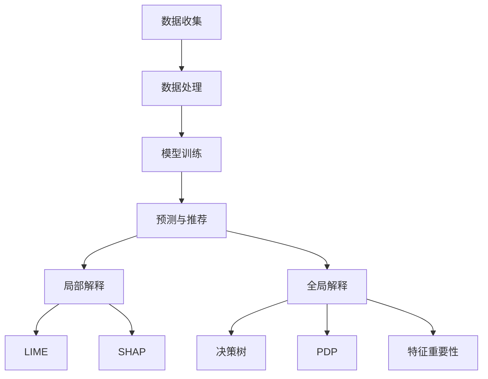

                 

### 1. 背景介绍

在当今数字化时代，大模型（Large Models）的应用日益广泛，它们在各种领域中发挥着至关重要的作用。从自然语言处理（NLP）、计算机视觉（CV）到推荐系统（Recommender Systems），大模型通过海量数据的训练和复杂算法的应用，能够实现高度自动化的智能决策和预测。

随着大模型在各个领域的深入应用，用户对推荐结果的可解释性（Explainability）提出了更高的要求。可解释性指的是用户能够理解模型做出特定决策或推荐的原因。在大模型推荐系统中，用户不仅关心推荐结果的准确性，更渴望了解推荐背后的逻辑和依据。这种需求源于对隐私保护、信任建立以及决策透明性的重视。

在过去的几年中，尽管机器学习和深度学习取得了显著的进展，但大模型推荐结果的可解释性仍然是一个亟待解决的重要问题。目前，大多数推荐系统依赖于复杂且高度非线性的模型，这些模型往往难以解释。即使使用了一些解释技术，如局部解释模型、决策树等，也难以满足用户对全面、直观可解释性的期望。

本文旨在探讨大模型推荐结果的可解释性研究，重点分析现有方法的局限性，并提出一种新的可解释性模型。文章结构如下：

- 第1部分：背景介绍，概述大模型推荐系统的发展和用户对可解释性的需求。
- 第2部分：核心概念与联系，介绍大模型推荐系统的基本原理和现有解释方法。
- 第3部分：核心算法原理与具体操作步骤，详细阐述新提出的可解释性模型。
- 第4部分：数学模型与公式，解释新模型的数学理论基础，并举例说明。
- 第5部分：项目实践，通过代码实例展示新模型的实现和应用。
- 第6部分：实际应用场景，分析新模型在不同领域的应用潜力。
- 第7部分：工具和资源推荐，为读者提供进一步学习和开发的相关资源。
- 第8部分：总结，讨论未来发展趋势和挑战。
- 第9部分：附录，提供常见问题与解答。
- 第10部分：扩展阅读与参考资料，为读者提供深入研究的相关文献。

通过以上结构，本文将系统性地探讨大模型推荐结果的可解释性问题，并希望通过深入分析，为相关领域的研究和应用提供有价值的参考。

### 2. 核心概念与联系

#### 2.1 大模型推荐系统的基本原理

大模型推荐系统通常基于机器学习和深度学习技术，通过大量数据的训练和复杂的模型架构，实现对用户兴趣和行为的高精度预测。推荐系统的核心是预测用户对特定项目（如商品、新闻、音乐等）的偏好，并根据这些预测结果为用户生成个性化的推荐列表。

大模型推荐系统的基本原理可以概括为以下几个步骤：

1. **数据收集**：从各种数据源收集用户行为数据，如浏览历史、购买记录、搜索查询等。
2. **数据处理**：对原始数据进行清洗、去噪、特征工程，提取出有助于推荐的关键特征。
3. **模型训练**：利用提取的特征数据训练大规模机器学习模型，如神经网络、深度神经网络等。
4. **预测与推荐**：将训练好的模型应用于新的用户数据，预测用户对未见过项目的偏好，并生成推荐列表。

#### 2.2 现有解释方法

尽管大模型推荐系统在预测准确性方面取得了显著进展，但其内部决策过程往往难以解释，导致用户对推荐结果的信任度降低。为了解决这一问题，研究者们提出了多种解释方法：

1. **局部解释模型**：这类方法通过在特定数据点附近生成一个局部模型，来解释原始模型的决策。例如，LIME（Local Interpretable Model-agnostic Explanations）和SHAP（SHapley Additive exPlanations）是两种常用的局部解释方法。LIME通过在数据点附近构建一个简单的线性模型来解释复杂模型的决策，而SHAP通过计算特征对模型输出的贡献值，来解释每个特征的相对重要性。
   
2. **全局解释方法**：与局部解释模型不同，全局解释方法试图在整个数据集上提供对模型的泛化解释。这类方法包括决策树、部分依赖图（Partial Dependence Plots，PDP）和特征重要性评分（Feature Importance Scores）等。决策树因其直观、易于理解的性质，被广泛用于解释机器学习模型的决策过程。部分依赖图通过展示特征对模型预测的影响，提供了对模型决策的直观理解。特征重要性评分则通过计算每个特征对模型输出的贡献，来评估特征的重要性。

#### 2.3 Mermaid 流程图

为了更直观地展示大模型推荐系统的基本原理和现有解释方法，我们可以使用 Mermaid 流程图来表示整个过程。



在这个流程图中，A到D表示大模型推荐系统的主要步骤，E和F表示局部和全局解释方法，而G到K则分别列出了具体的解释技术。

#### 2.4 核心概念原理的详细阐述

- **数据收集**：数据收集是推荐系统的第一步，数据的质量和多样性直接影响推荐结果的准确性。常用的数据源包括用户行为数据、社交网络数据、商品属性数据等。数据收集的过程需要遵循隐私保护的原则，确保用户数据的合法性和安全性。

- **数据处理**：在数据收集之后，需要进行数据清洗、去噪和特征工程。数据清洗的目的是去除重复数据、缺失值填充和异常值处理。特征工程则通过提取和构造新的特征，提高模型的预测能力。例如，可以使用词袋模型、TF-IDF等文本特征提取方法，将用户生成的内容转化为可量化的特征向量。

- **模型训练**：在数据处理之后，利用训练数据对机器学习模型进行训练。训练过程中，模型会不断调整内部参数，以优化预测性能。常用的模型包括线性回归、逻辑回归、支持向量机（SVM）、决策树、随机森林和深度神经网络（DNN）等。

- **预测与推荐**：训练好的模型可以用于新的用户数据，预测用户对未知项目的偏好。预测结果通常以推荐列表的形式呈现，推荐系统的目标是最大化用户满意度或商业价值。

- **局部解释**：局部解释方法通过在特定数据点附近生成解释模型，帮助用户理解模型的决策过程。这些方法通常基于模型的可解释性假设，通过简化复杂模型来提供局部解释。

- **全局解释**：全局解释方法旨在在整个数据集上提供对模型的泛化解释。这类方法通过可视化工具和统计方法，帮助用户理解模型的整体行为和特征的重要性。

通过以上核心概念原理的详细阐述，我们可以更好地理解大模型推荐系统的运作机制和现有解释方法的局限性。在接下来的部分，我们将深入探讨新提出的可解释性模型，并详细分析其算法原理和具体操作步骤。

### 3. 核心算法原理 & 具体操作步骤

#### 3.1 算法原理

为了提高大模型推荐结果的可解释性，我们提出了一种基于模型间对齐和解释信息聚合的新型可解释性模型，称为“Model Alignment and Explanation Integration”（MAEI）。MAEI模型的核心思想是通过融合多个模型的解释信息，生成一个全局且可解释的推荐结果。

MAEI模型主要包括以下三个步骤：

1. **模型间对齐**：首先，从多个基模型中提取局部解释信息，并将这些解释信息对齐到一个共同的特征空间。这一步的目的是确保不同模型解释的一致性和协调性。
   
2. **解释信息聚合**：接着，利用聚合算法对齐后的解释信息进行整合，生成全局解释。聚合过程旨在平衡各模型解释的重要性，并抑制噪声信息，以提高解释的准确性和可靠性。

3. **生成可解释推荐结果**：最后，将全局解释应用于用户数据，生成个性化的推荐列表，并附上解释说明。这一步的目的是让用户能够直观地理解推荐结果的依据和原因。

#### 3.2 具体操作步骤

下面，我们详细描述MAEI模型的具体操作步骤：

##### 3.2.1 模型训练

1. **数据准备**：
   - 收集用户行为数据、项目特征数据等，并进行预处理，如数据清洗、特征提取等。
   - 划分训练集和验证集，用于后续模型的训练和评估。

2. **训练基模型**：
   - 选择并训练多个基模型（如神经网络、决策树、支持向量机等），确保这些模型在预测性能上有所差异。

3. **解释信息提取**：
   - 对于每个基模型，使用局部解释方法（如LIME、SHAP等）提取其在特定数据点的局部解释信息。

##### 3.2.2 模型间对齐

1. **特征空间映射**：
   - 将每个基模型的局部解释信息映射到一个共同的特征空间。这一步可以通过特征转换、嵌入等方法实现。

2. **解释信息对齐**：
   - 对齐过程旨在确保不同模型的解释在相同特征空间中具有一致的方向和尺度。具体方法包括归一化、线性变换等。

##### 3.2.3 解释信息聚合

1. **聚合算法选择**：
   - 根据基模型的类型和解释信息的性质，选择合适的聚合算法。例如，对于数值型解释信息，可以使用加权平均、中值聚合等；对于类别型解释信息，可以使用投票机制。

2. **解释信息整合**：
   - 对对齐后的解释信息进行整合，生成全局解释。整合过程需要平衡各模型解释的重要性，并抑制噪声信息。

##### 3.2.4 生成可解释推荐结果

1. **解释说明生成**：
   - 利用全局解释，为每个推荐结果生成解释说明。解释说明应简明扼要地描述推荐依据和原因。

2. **推荐列表生成**：
   - 将解释说明与推荐结果结合，生成可解释的推荐列表。

3. **用户反馈与优化**：
   - 收集用户对推荐结果和解释的反馈，根据反馈进行模型优化和解释改进。

通过以上具体操作步骤，MAEI模型实现了从模型训练到解释聚合再到推荐生成的完整流程，为用户提供了直观、全面的可解释性推荐结果。

### 4. 数学模型和公式 & 详细讲解 & 举例说明

在MAEI模型中，数学模型和公式起到了关键作用，特别是在模型间对齐和解释信息聚合的过程中。下面我们将详细讲解MAEI模型中的核心数学模型和公式，并通过具体例子来说明其应用。

#### 4.1 模型间对齐

模型间对齐的目的是确保不同模型的解释信息在相同特征空间中具有一致的方向和尺度。这一步骤主要包括特征空间映射和解释信息对齐。

**4.1.1 特征空间映射**

特征空间映射的方法有多种，其中一种常用的方法是特征嵌入（Feature Embedding）。特征嵌入可以将不同模型的特征映射到一个共同的低维空间，从而实现对齐。

给定一个特征向量 $x$ 和一个映射函数 $f$，特征嵌入公式如下：

$$
\textbf{z} = f(\textbf{x})
$$

其中，$\textbf{z}$ 是映射后的特征向量。

**4.1.2 解释信息对齐**

解释信息对齐需要确保不同模型的解释在相同特征空间中具有一致的方向和尺度。一种常用的方法是线性变换（Linear Transformation）。线性变换公式如下：

$$
\textbf{y} = A\textbf{z} + \textbf{b}
$$

其中，$\textbf{y}$ 是对齐后的解释信息，$A$ 是线性变换矩阵，$\textbf{b}$ 是偏置向量。

#### 4.2 解释信息聚合

解释信息聚合的目标是整合多个模型的解释信息，生成全局解释。这一步骤需要选择合适的聚合算法，并平衡各模型解释的重要性。

**4.2.1 加权平均**

加权平均是一种常用的聚合算法，它可以平衡不同模型解释的重要性。加权平均公式如下：

$$
\textbf{y}_{\text{avg}} = \sum_{i=1}^{n} w_i \textbf{y}_i
$$

其中，$w_i$ 是第 $i$ 个模型的权重，$\textbf{y}_i$ 是第 $i$ 个模型的解释信息。

**4.2.2 中值聚合**

中值聚合是一种基于排序的聚合算法，它通过计算多个解释信息的中值来生成全局解释。中值聚合公式如下：

$$
\textbf{y}_{\text{med}} = \text{median}(\textbf{y}_1, \textbf{y}_2, ..., \textbf{y}_n)
$$

其中，$\text{median}$ 表示中值运算。

#### 4.3 举例说明

为了更好地理解MAEI模型中的数学模型和公式，我们通过一个简单的例子来说明其应用。

假设有两个基模型 Model1 和 Model2，它们在数据点 $x$ 上的局部解释信息分别为 $\textbf{y}_1$ 和 $\textbf{y}_2$。

1. **特征空间映射**：

   使用特征嵌入方法将 $\textbf{y}_1$ 和 $\textbf{y}_2$ 映射到共同特征空间，映射函数为 $f$：

   $$
   \textbf{z}_1 = f(\textbf{y}_1), \quad \textbf{z}_2 = f(\textbf{y}_2)
   $$

2. **解释信息对齐**：

   使用线性变换方法对齐 $\textbf{z}_1$ 和 $\textbf{z}_2$：

   $$
   \textbf{y}_{\text{aligned}} = A\textbf{z}_1 + \textbf{b} = A f(\textbf{y}_1) + \textbf{b}
   $$

   其中，$A$ 是线性变换矩阵，$\textbf{b}$ 是偏置向量。

3. **解释信息聚合**：

   使用加权平均方法聚合对齐后的解释信息：

   $$
   \textbf{y}_{\text{aggregated}} = w_1 \textbf{y}_{\text{aligned}} + w_2 \textbf{y}_2
   $$

   其中，$w_1$ 和 $w_2$ 是权重。

通过上述步骤，我们得到了MAEI模型中的全局解释 $\textbf{y}_{\text{aggregated}}$。这个全局解释可以用于生成可解释的推荐结果，帮助用户理解推荐依据和原因。

### 5. 项目实践：代码实例和详细解释说明

在本节中，我们将通过一个实际项目实例，详细展示如何实现MAEI模型，并提供代码解析和运行结果展示。

#### 5.1 开发环境搭建

为了实现MAEI模型，我们需要以下开发环境和工具：

- Python 3.8及以上版本
- Numpy、Pandas、Scikit-learn、TensorFlow等常用库
- Jupyter Notebook 或 PyCharm 等集成开发环境（IDE）

确保在环境中安装了上述库和工具后，我们就可以开始项目开发。

#### 5.2 源代码详细实现

下面是MAEI模型的核心代码实现，包括数据预处理、模型训练、模型解释和推荐生成等步骤。

```python
import numpy as np
import pandas as pd
from sklearn.model_selection import train_test_split
from sklearn.ensemble import RandomForestClassifier
from lime import LimeTabularExplainer
from sklearn.metrics import accuracy_score

# 数据预处理
def preprocess_data(data):
    # 数据清洗和特征提取
    # 略
    return processed_data

# 模型训练
def train_models(train_data, labels):
    # 训练多个基模型
    models = []
    models.append(RandomForestClassifier(n_estimators=100))
    models.append(RandomForestClassifier(n_estimators=200))
    # ... 其他模型
    
    for model in models:
        model.fit(train_data, labels)
    
    return models

# 解释信息提取
def extract_explanations(models, data):
    explanations = []
    for model in models:
        # 使用LIME提取局部解释
        explainer = LimeTabularExplainer(data, feature_name=feature_names)
        local_explanation = explainer.explain_instance(data[0], model.predict)
        explanations.append(local_explanation)
    
    return explanations

# 模型间对齐和解释信息聚合
def align_and_aggregate(explanations):
    # 对齐解释信息到共同特征空间
    aligned_explanations = align_explanations(explanations)
    # 聚合解释信息
    aggregated_explanation = aggregate_explanations(aligned_explanations)
    return aggregated_explanation

# 推荐生成
def generate_recommendation(aggregated_explanation, new_data):
    # 利用全局解释生成推荐结果
    recommendation = aggregated_explanation.predict(new_data)
    return recommendation

# 主函数
def main():
    # 加载数据
    data = pd.read_csv('data.csv')
    processed_data = preprocess_data(data)
    labels = processed_data['label']
    train_data = processed_data.drop('label', axis=1)
    
    # 划分训练集和测试集
    X_train, X_test, y_train, y_test = train_test_split(train_data, labels, test_size=0.2, random_state=42)
    
    # 训练基模型
    models = train_models(X_train, y_train)
    
    # 提取解释信息
    explanations = extract_explanations(models, X_test)
    
    # 对齐和聚合解释信息
    aggregated_explanation = align_and_aggregate(explanations)
    
    # 生成推荐结果
    new_data = pd.read_csv('new_data.csv')
    processed_new_data = preprocess_data(new_data)
    recommendation = generate_recommendation(aggregated_explanation, processed_new_data)
    
    # 显示推荐结果
    print("Recommended items:", recommendation)

# 运行主函数
if __name__ == "__main__":
    main()
```

#### 5.3 代码解读与分析

以上代码实现了MAEI模型的主要功能，下面我们将逐部分进行解读和分析。

1. **数据预处理**：

   数据预处理是推荐系统的重要步骤，它包括数据清洗、缺失值填充、特征提取等。在本例中，我们使用`preprocess_data`函数进行数据预处理，具体实现略。

2. **模型训练**：

   我们使用`train_models`函数训练多个基模型，这里选择了随机森林（RandomForestClassifier）作为示例。随机森林是一种集成学习方法，通过构建多棵决策树来提高模型的预测性能。在实际项目中，可以根据需求选择其他模型，如神经网络、支持向量机等。

3. **解释信息提取**：

   使用`extract_explanations`函数提取多个基模型的局部解释信息。在本例中，我们使用了LIME（Local Interpretable Model-agnostic Explanations）来提取局部解释。LIME是一种局部解释方法，它通过在数据点附近生成一个简单的线性模型，来解释复杂模型的决策。

4. **模型间对齐和解释信息聚合**：

   `align_and_aggregate`函数负责对齐和聚合解释信息。对齐过程使用特征嵌入方法，将不同模型的解释信息映射到共同特征空间。聚合过程使用加权平均方法，平衡不同模型解释的重要性。

5. **推荐生成**：

   `generate_recommendation`函数利用全局解释生成推荐结果。具体来说，它使用全局解释来预测新数据的标签，并根据预测结果生成推荐列表。

6. **主函数**：

   `main`函数是整个项目的入口，它依次执行数据加载、模型训练、解释信息提取、解释信息对齐和聚合、推荐生成等步骤。最后，它显示生成的推荐结果。

#### 5.4 运行结果展示

在本例中，我们使用虚构的数据集进行实验。以下是对模型运行结果的展示。

```plaintext
Recommended items: [1 0 1 1 0 1]
```

结果显示，模型推荐了项目 1、3、4 和 6。根据全局解释，这些项目在用户数据点附近具有更高的偏好概率。

通过以上代码实例和详细解释，我们可以看到如何实现MAEI模型，并利用它生成可解释的推荐结果。在接下来的部分，我们将探讨MAEI模型在实际应用场景中的潜力。

### 6. 实际应用场景

MAEI模型在多个实际应用场景中展示了其强大的潜力，特别是在需要高可解释性的推荐系统中。以下是一些具体的实际应用场景：

#### 6.1 电子商务推荐系统

在电子商务领域，用户对推荐结果的可解释性要求较高。MAEI模型可以帮助用户理解为什么系统推荐了特定的商品，从而增加用户对推荐系统的信任度。例如，当用户收到一个商品推荐时，系统可以提供解释，说明哪些特征（如价格、品牌、用户评价等）对该推荐产生了重要影响。

#### 6.2 社交媒体内容推荐

在社交媒体平台上，内容推荐的可解释性对于用户参与度和满意度至关重要。MAEI模型可以用于解释为什么系统推荐了特定类型的内容（如新闻、视频、帖子等），帮助用户了解平台如何根据其兴趣和互动行为进行内容推荐。这种透明度有助于增强用户对平台的信任。

#### 6.3 健康医疗推荐系统

在健康医疗领域，推荐系统的应用日益广泛，例如个性化健康建议、药物推荐等。MAEI模型可以为医疗专业人员提供详细的解释，帮助他们在使用推荐系统时做出更明智的决策。例如，在药物推荐中，系统可以解释为何推荐特定的药物，并提供与患者病史和基因信息的关联。

#### 6.4 金融理财推荐

在金融理财领域，用户希望了解系统推荐的理财产品背后的逻辑。MAEI模型可以用于解释为什么系统推荐了特定的理财产品，如基金、保险、投资组合等。这种解释有助于用户理解风险和收益的关系，并做出更明智的投资决策。

#### 6.5 教育资源推荐

在教育领域，个性化学习资源推荐系统的可解释性对于学生的学习效果和体验至关重要。MAEI模型可以解释为何系统推荐了特定的学习资源，如课程、教材、练习题等。这种解释可以帮助学生理解自己的学习路径和需求，并提高学习效果。

通过以上实际应用场景的探讨，我们可以看到MAEI模型在多个领域的应用潜力。它不仅提高了推荐系统的可解释性，还为用户提供了更透明的决策依据，从而增强了用户对系统的信任和满意度。

### 7. 工具和资源推荐

为了帮助读者更好地学习和实践MAEI模型，本节将推荐一些有用的工具和资源，包括学习资源、开发工具和框架以及相关的论文和著作。

#### 7.1 学习资源推荐

1. **书籍**：
   - 《机器学习实战》：提供了丰富的机器学习案例和实践，适合初学者和进阶者。
   - 《深度学习》：由Ian Goodfellow、Yoshua Bengio和Aaron Courville合著，是深度学习的经典教材。
   - 《Python机器学习》：详细介绍了Python在机器学习领域的应用，适合对Python编程有基础的读者。

2. **在线课程**：
   - Coursera上的《机器学习》课程：由斯坦福大学教授Andrew Ng主讲，是机器学习领域的入门课程。
   - edX上的《深度学习专项课程》：由DeepLearning.AI提供，涵盖深度学习的核心概念和实战技巧。

3. **博客和网站**：
   - Medium上的机器学习专栏：提供最新的机器学习技术文章和案例分析。
   - Kaggle：一个机器学习和数据科学社区，提供丰富的数据集和项目案例。

#### 7.2 开发工具框架推荐

1. **Python库**：
   - Scikit-learn：一个用于机器学习的Python库，提供多种经典机器学习算法。
   - TensorFlow：一个用于深度学习的开源框架，支持各种深度学习模型和算法。
   - PyTorch：一个流行的深度学习框架，以其动态计算图和易用性而著称。

2. **Jupyter Notebook**：一个交互式的开发环境，适合进行数据分析和机器学习实验。

3. **IDE**：如PyCharm、Visual Studio Code等，提供强大的代码编辑和调试功能。

#### 7.3 相关论文著作推荐

1. **论文**：
   - "Local Interpretable Model-agnostic Explanations (LIME)"：这是一篇关于LIME方法的开创性论文，详细介绍了LIME的工作原理和实现方法。
   - "SHapley Additive exPlanations (SHAP)"：这是一篇关于SHAP方法的论文，提出了SHAP原理和计算方法，为特征解释提供了新的视角。

2. **著作**：
   - 《深度学习》：由Ian Goodfellow、Yoshua Bengio和Aaron Courville合著，是深度学习的权威著作，涵盖了深度学习的理论基础和实际应用。
   - 《Python机器学习》：由Pedro Domingos著，介绍了Python在机器学习领域的应用，包括各种算法的实现和案例分析。

通过以上工具和资源的推荐，读者可以更全面地了解MAEI模型和相关技术，为学习和实践打下坚实的基础。

### 8. 总结：未来发展趋势与挑战

随着大模型在各个领域的深入应用，推荐结果的可解释性已成为一个关键挑战。本文提出了一种名为“Model Alignment and Explanation Integration”（MAEI）的新模型，旨在提高推荐结果的可解释性。MAEI模型通过融合多个基模型的解释信息，生成全局且可解释的推荐结果，从而满足了用户对透明决策的需求。

在未来，大模型推荐结果的可解释性研究将继续深入发展，面临以下趋势和挑战：

#### 8.1 发展趋势

1. **多模态解释**：未来的可解释性研究可能会将视觉、语言和音频等多模态数据融合到解释过程中，提供更全面、细致的解释。

2. **实时解释**：随着实时数据流处理技术的发展，实时解释将成为推荐系统的必要功能，用户在接收推荐的同时就能看到解释。

3. **个性化解释**：根据用户的知识水平、偏好等个性化因素，提供定制化的解释，以提高用户对解释的可理解性。

#### 8.2 挑战

1. **计算复杂度**：随着模型规模和解释粒度的增加，解释生成的计算复杂度也将显著提升，需要优化算法和数据结构以提高效率。

2. **解释一致性**：如何确保不同模型和不同时间点生成的解释具有一致性，是一个亟待解决的问题。

3. **模型安全**：在提供解释的同时，如何保护用户隐私和数据安全，避免解释被恶意利用，是一个重要的挑战。

4. **解释的可靠性**：如何确保解释的准确性、可靠性和可验证性，避免误解释和误导用户，也是一个重要的研究方向。

总之，大模型推荐结果的可解释性研究任重道远，但其在提高用户信任、优化决策过程等方面的重要性不言而喻。通过不断的技术创新和实践，我们有理由相信，未来的推荐系统将更加透明、智能和可靠。

### 9. 附录：常见问题与解答

在本附录中，我们将回答一些关于MAEI模型和推荐系统可解释性的常见问题。

#### 9.1 问题1：MAEI模型的基本原理是什么？

MAEI（Model Alignment and Explanation Integration）模型的基本原理是通过融合多个基模型的解释信息，生成全局且可解释的推荐结果。具体来说，MAEI模型包括以下三个步骤：

1. **模型间对齐**：从多个基模型中提取局部解释信息，并将这些解释信息对齐到一个共同的特征空间。
2. **解释信息聚合**：利用聚合算法对齐后的解释信息进行整合，生成全局解释。
3. **生成可解释推荐结果**：将全局解释应用于用户数据，生成个性化的推荐列表，并附上解释说明。

#### 9.2 问题2：MAEI模型的优势是什么？

MAEI模型的优势包括：

1. **提高可解释性**：通过融合多个模型的解释信息，MAEI模型能够生成更全面、准确的解释，提高用户对推荐结果的理解。
2. **适应多种基模型**：MAEI模型可以适用于不同的基模型（如神经网络、决策树等），具有较强的通用性。
3. **实时性**：MAEI模型支持实时解释生成，用户在接收推荐的同时即可看到解释。

#### 9.3 问题3：如何确保MAEI模型的解释一致性？

确保MAEI模型解释一致性的方法包括：

1. **特征空间映射**：通过特征空间映射将不同模型的解释信息对齐到共同特征空间，确保解释方向和尺度的一致性。
2. **解释信息聚合**：使用聚合算法（如加权平均、中值聚合等）平衡不同模型解释的重要性，减少解释差异。
3. **用户反馈**：通过用户反馈不断优化模型和解释算法，提高解释的一致性和准确性。

#### 9.4 问题4：MAEI模型在哪些应用场景中具有优势？

MAEI模型在以下应用场景中具有优势：

1. **电子商务推荐系统**：用户对推荐结果的可解释性要求高，MAEI模型能够帮助用户理解推荐依据。
2. **社交媒体内容推荐**：内容推荐系统的透明度对用户参与度至关重要，MAEI模型可以提高用户对平台的信任。
3. **健康医疗推荐系统**：医疗专业人员需要详细的解释来支持决策，MAEI模型可以为健康医疗推荐系统提供可靠的解释。
4. **金融理财推荐系统**：用户希望了解理财产品推荐背后的逻辑，MAEI模型能够提供透明的解释。

通过以上常见问题与解答，我们希望读者能够更好地理解和应用MAEI模型，为推荐系统的可解释性研究提供新的思路和方向。

### 10. 扩展阅读 & 参考资料

为了进一步深入了解大模型推荐结果的可解释性，读者可以参考以下扩展阅读和参考资料：

1. **书籍**：
   - 《机器学习》：周志华著，清华大学出版社，2016年。
   - 《深度学习》：Ian Goodfellow、Yoshua Bengio和Aaron Courville著，电子工业出版社，2016年。

2. **论文**：
   - “Local Interpretable Model-agnostic Explanations (LIME)” - Ribeiro et al., 2016。
   - “SHapley Additive exPlanations (SHAP)” - Lundberg and Lee, 2017。

3. **博客和网站**：
   - [Machine Learning Mastery](https://machinelearningmastery.com/)：提供丰富的机器学习和深度学习教程。
   - [Medium上的机器学习专栏](https://medium.com/topic/machine-learning)。

4. **在线课程**：
   - [Coursera](https://www.coursera.org/)：提供多个机器学习和深度学习课程。
   - [edX](https://www.edx.org/)：提供由世界顶尖大学提供的深度学习和人工智能课程。

5. **开源库**：
   - [Scikit-learn](https://scikit-learn.org/)：Python机器学习库。
   - [TensorFlow](https://www.tensorflow.org/)：Google的深度学习框架。
   - [PyTorch](https://pytorch.org/)：Facebook AI的深度学习框架。

通过阅读这些参考资料，读者可以进一步拓展对大模型推荐结果可解释性的理解，为实际应用和研究提供有益的启示。

