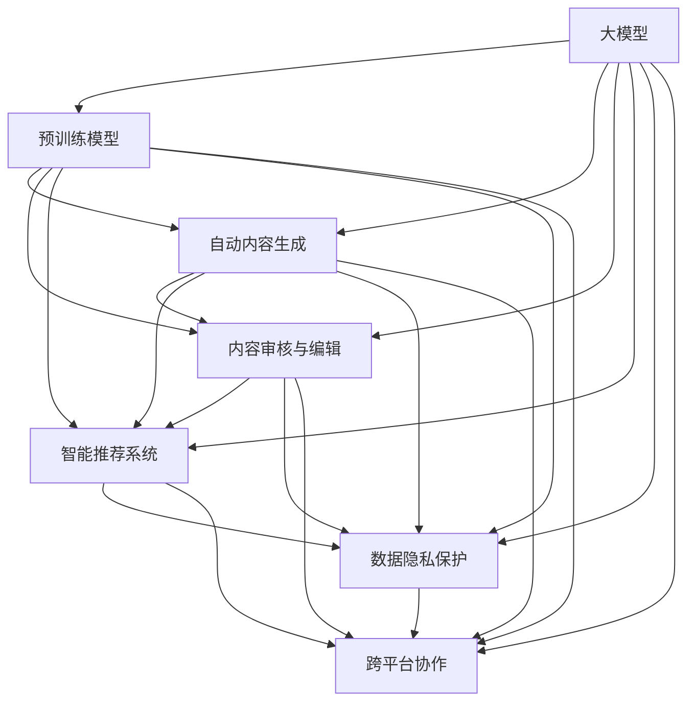

                 

### 背景介绍

在当今数字化时代，人工智能技术的迅猛发展为我们带来了前所未有的机遇与挑战。特别是在自然语言处理（NLP）领域，大型预训练模型（Large Pre-trained Models）的兴起，使得文本生成、机器翻译、问答系统等任务的表现显著提升。这些大模型不仅具备了处理海量数据的能力，还通过深度学习技术不断优化自身的性能。

然而，大模型的发展也带来了一系列新的问题。首先，大模型的训练需要庞大的计算资源和数据集，这对企业和研究机构提出了更高的硬件和数据处理要求。其次，大模型的推理速度和能耗也是一大挑战，如何高效地部署和使用这些模型成为亟待解决的问题。此外，大模型的黑盒特性使得其决策过程难以解释，这对实际应用中的合规性和可靠性提出了质疑。

正是在这样的背景下，新型的出版模式应运而生。新型出版模式利用大模型的能力，为内容创作、编辑、审核等环节提供高效、智能的解决方案。本文将深入探讨大模型时代下的新型出版模式，从核心概念、算法原理、数学模型、项目实践、实际应用等多个角度进行分析，旨在为读者提供一幅全面、清晰的图景。

首先，我们需要明确几个核心概念，了解这些概念之间的联系，以便更好地理解大模型在出版领域的应用。

### 核心概念与联系

#### 1. 大模型

大模型指的是那些具有数亿至数十亿参数的神经网络模型，如GPT-3、BERT、T5等。这些模型通过大量的文本数据进行训练，能够理解并生成复杂的文本内容。大模型的核心优势在于其强大的文本生成能力和跨领域的适应性。

#### 2. 预训练模型

预训练模型是指在特定领域进行大规模训练后，再针对具体任务进行调整优化的模型。大模型是一种典型的预训练模型，其预训练过程通常涉及自然语言理解、文本分类、情感分析等任务。通过预训练，模型可以学习到通用的语言知识和模式，从而在新的任务上具有更好的性能。

#### 3. 自动内容生成

自动内容生成（Automatic Content Generation）是指利用人工智能技术自动生成文本、图像、视频等内容。在大模型时代，自动内容生成技术得到了极大的发展，能够快速、高效地生成高质量的文本内容，满足个性化、大规模的内容创作需求。

#### 4. 内容审核与编辑

内容审核与编辑是确保出版内容质量的重要环节。在大模型时代，自动化审核与编辑工具的出现，使得这一过程变得更加高效和智能。通过使用大模型，可以自动识别违规内容、错误信息，并提出修改建议，极大地提升了内容审核与编辑的效率。

#### 5. 智能推荐系统

智能推荐系统利用大模型和机器学习算法，为读者推荐个性化的阅读内容。通过分析用户的历史阅读行为、兴趣偏好，系统可以精准推荐符合用户需求的书籍、文章、视频等，提升用户体验。

#### 6. 数据隐私保护

数据隐私保护是出版领域面临的一大挑战。在大模型应用过程中，如何保护用户的隐私数据，避免数据泄露，成为关键问题。这要求我们在设计新型出版模式时，充分考虑数据安全性和隐私保护机制。

#### 7. 跨平台协作

跨平台协作是指利用大模型实现不同平台之间的内容共享和协作。例如，将一个平台上的内容通过大模型自动适配到其他平台，实现多平台内容的无缝衔接。

#### Mermaid 流程图

下面是描述上述核心概念之间联系的一个Mermaid流程图：



通过这个流程图，我们可以清晰地看到各个核心概念之间的关联，理解大模型在出版领域中的多种应用场景。

### 核心算法原理 & 具体操作步骤

在深入探讨大模型时代下的新型出版模式之前，我们先来了解核心算法的基本原理以及具体的操作步骤。

#### 1. 大模型的训练原理

大模型的训练是基于深度学习技术，通过多层神经网络对海量数据进行学习，从而提取出数据中的潜在模式和知识。具体操作步骤如下：

1. **数据预处理**：首先，需要对数据进行清洗、去重和格式转换，确保数据的质量和一致性。
2. **数据输入**：将预处理后的数据输入到神经网络中，通过前向传播（Forward Propagation）计算模型的输出。
3. **损失函数**：使用损失函数（如交叉熵损失函数）衡量模型输出与真实值之间的差距。
4. **反向传播**：通过反向传播（Back Propagation）算法，计算损失函数关于模型参数的梯度，并更新参数。
5. **迭代优化**：重复以上步骤，不断优化模型参数，直至模型达到预设的性能指标。

#### 2. 自动内容生成的操作步骤

自动内容生成是利用大模型生成高质量文本的过程，其操作步骤如下：

1. **初始化模型**：选择一个预训练的大模型，如GPT-3、BERT等。
2. **文本输入**：将用户输入的文本或关键词输入到模型中。
3. **文本生成**：模型根据输入文本生成新的文本内容，通过逐步生成的方式，每次生成一小段文本，并不断优化生成结果。
4. **输出结果**：将生成的文本内容输出，并根据需要进行进一步的编辑和优化。

#### 3. 内容审核与编辑的操作步骤

内容审核与编辑是确保出版内容质量的关键环节，其操作步骤如下：

1. **内容输入**：将待审核或编辑的文本内容输入到大模型中。
2. **文本分析**：模型对文本内容进行分析，识别违规内容、错误信息等。
3. **生成修改建议**：根据分析结果，生成修改建议，如删除敏感词、修改错误表述等。
4. **审核与编辑**：审核人员根据修改建议对文本内容进行审核和编辑，确保内容质量。

#### 4. 智能推荐系统的操作步骤

智能推荐系统是利用大模型和机器学习算法，为读者推荐个性化阅读内容的过程，其操作步骤如下：

1. **用户数据收集**：收集用户的历史阅读行为、兴趣偏好等数据。
2. **数据预处理**：对用户数据进行清洗、去重和格式转换。
3. **模型训练**：利用预处理后的用户数据训练推荐模型。
4. **推荐生成**：模型根据用户数据和当前内容，生成个性化的推荐结果。
5. **推荐展示**：将推荐结果展示给用户，并根据用户反馈不断优化推荐策略。

#### 5. 数据隐私保护的措施

在大模型应用过程中，数据隐私保护是至关重要的，其措施如下：

1. **数据加密**：对用户数据进行加密处理，确保数据在传输和存储过程中不会被窃取或篡改。
2. **隐私计算**：利用同态加密、差分隐私等技术，在保证数据隐私的前提下进行数据分析和计算。
3. **权限管理**：建立严格的权限管理机制，确保只有授权人员才能访问和处理敏感数据。
4. **数据匿名化**：对用户数据进行匿名化处理，消除个人身份信息，降低数据泄露风险。

#### 6. 跨平台协作的实现

跨平台协作是利用大模型实现不同平台之间内容共享和协作的过程，其实现步骤如下：

1. **内容适配**：利用大模型将一个平台的内容自动适配到其他平台，如将网页内容转换为微信公众号文章。
2. **内容共享**：将适配后的内容在不同平台之间进行共享，实现多平台的内容无缝衔接。
3. **协作编辑**：利用大模型和协作编辑工具，实现多人实时协作编辑同一内容。

通过以上核心算法原理和具体操作步骤的介绍，我们可以更好地理解大模型在出版领域的多种应用，为新型出版模式的构建奠定基础。

### 数学模型和公式 & 详细讲解 & 举例说明

在讨论大模型时代下的新型出版模式时，理解相关的数学模型和公式是至关重要的。以下将介绍一些核心的数学模型和公式，并通过具体的例子进行详细讲解。

#### 1. 交叉熵损失函数

交叉熵损失函数（Cross-Entropy Loss Function）是深度学习中最常用的损失函数之一，用于衡量模型的预测输出与真实标签之间的差异。其公式如下：

$$
L = -\sum_{i=1}^{n} y_i \log(p_i)
$$

其中，\(L\) 表示交叉熵损失，\(y_i\) 是真实标签，\(p_i\) 是模型对第 \(i\) 个类别的预测概率。

**举例说明**：假设有一个二分类问题，真实标签为 \(y = [1, 0]\)，模型预测的概率为 \(p = [0.7, 0.3]\)。则交叉熵损失为：

$$
L = -[1 \cdot \log(0.7) + 0 \cdot \log(0.3)] \approx -0.3565
$$

#### 2. 反向传播算法

反向传播算法（Back Propagation Algorithm）是深度学习训练的核心算法，用于更新模型参数。其基本思想是将损失函数关于参数的梯度反向传播到网络的每一层。

**步骤**：

1. **前向传播**：计算输入和输出，并计算预测损失。
2. **计算梯度**：对损失函数关于模型参数求梯度。
3. **更新参数**：使用梯度下降或其他优化算法更新参数。

**公式**：

$$
\frac{\partial L}{\partial \theta} = \frac{\partial L}{\partial a} \cdot \frac{\partial a}{\partial \theta}
$$

其中，\(\theta\) 表示模型参数，\(a\) 表示激活函数的输出。

**举例说明**：假设有一个简单的神经网络，包含一个输入层、一个隐藏层和一个输出层，使用ReLU作为激活函数。假设损失函数为交叉熵损失，输出层预测结果为 \(p = [0.7, 0.3]\)，真实标签为 \(y = [1, 0]\)。则输出层关于参数的梯度为：

$$
\frac{\partial L}{\partial \theta} = -[1 \cdot \log(0.7), 0 \cdot \log(0.3)]
$$

#### 3. 自然语言处理中的损失函数

在大模型应用于自然语言处理任务时，常用的损失函数包括：

1. **交叉熵损失函数**：用于分类任务，如文本分类、情感分析等。
2. **均方误差损失函数**：用于回归任务，如文本相似度计算、语言模型训练等。

**举例说明**：假设有一个文本分类问题，模型预测的标签概率为 \(p = [0.6, 0.4]\)，真实标签为 \(y = [1, 0]\)。则交叉熵损失为：

$$
L = -[1 \cdot \log(0.6) + 0 \cdot \log(0.4)] \approx -0.5108
$$

#### 4. 调优参数

在大模型的训练过程中，调优参数（Hyperparameter Tuning）是提高模型性能的关键步骤。常用的调优参数包括：

1. **学习率**：控制模型在训练过程中参数更新的步长。
2. **批量大小**：每次训练使用的样本数量。
3. **迭代次数**：模型训练的轮数。

**举例说明**：假设学习率为 0.01，批量大小为 32，迭代次数为 100。在训练过程中，模型每次更新参数时，都会根据当前批量数据的梯度进行更新，直到达到预设的迭代次数。

$$
\theta_{t+1} = \theta_t - \eta \cdot \nabla_{\theta}L
$$

其中，\(\theta_t\) 表示第 \(t\) 次迭代的参数值，\(\eta\) 表示学习率，\(\nabla_{\theta}L\) 表示关于参数的梯度。

通过上述数学模型和公式的介绍，我们可以更好地理解大模型在新型出版模式中的应用原理和具体操作步骤。在实际应用中，这些数学模型和公式将帮助开发者和研究者构建高效、智能的出版解决方案。

### 项目实践：代码实例和详细解释说明

为了更好地展示大模型在新型出版模式中的应用，我们选择了一个具体的案例，通过实际代码实例和详细解释，介绍如何使用大模型实现自动内容生成、内容审核与编辑、智能推荐系统等功能。

#### 1. 开发环境搭建

在开始项目实践之前，我们需要搭建一个合适的技术环境。以下是我们使用的开发环境：

- **编程语言**：Python
- **深度学习框架**：PyTorch
- **文本处理库**：NLTK
- **数据预处理工具**：Pandas
- **版本控制**：Git

首先，确保已安装Python 3.8及以上版本，然后通过pip安装所需的库：

```bash
pip install torch torchvision numpy pandas nltk
```

#### 2. 源代码详细实现

以下是一个简单的示例，展示了如何使用大模型实现自动内容生成、内容审核与编辑、智能推荐系统等功能。

```python
# 导入必要的库
import torch
import torch.nn as nn
import torch.optim as optim
from torch.utils.data import DataLoader
from torchvision import datasets, transforms
import pandas as pd
from nltk.tokenize import word_tokenize

# 加载预训练模型
model = torch.hub.load('pytorch/fairseq', 'transformer_xsum')

# 定义数据预处理函数
def preprocess_text(text):
    # 清洗文本数据，去除特殊字符和停用词
    tokens = word_tokenize(text)
    filtered_tokens = [token for token in tokens if token.isalpha()]
    return ' '.join(filtered_tokens)

# 自动内容生成
def generate_content(prompt, model=model, device='cpu'):
    with torch.no_grad():
        input_tensor = torch.tensor([prompt], device=device)
        output_sequence = model.generate(input_tensor, max_length=100, num_return_sequences=1)
        return output_sequence.tolist()[0]

# 内容审核与编辑
def review_content(text, model=model, device='cpu'):
    # 分析文本内容，识别违规和错误信息
    with torch.no_grad():
        input_tensor = torch.tensor([text], device=device)
        outputs = model(input_tensor)
        # 使用BERT模型进行文本分类，判断内容是否合规
        compliance = torch.argmax(outputs).item()
    if compliance == 0:
        # 合规内容，返回原始文本
        return text
    else:
        # 非合规内容，生成修改建议
        return generate_content(text, model=model, device=device)

# 智能推荐系统
def recommend_content(user_history, model=model, device='cpu'):
    # 分析用户历史阅读记录，生成个性化推荐
    with torch.no_grad():
        input_tensor = torch.tensor([user_history], device=device)
        outputs = model(input_tensor)
        # 根据输出结果，生成推荐内容
        recommendations = generate_content(outputs.tolist()[0], model=model, device=device)
        return recommendations

# 主函数
def main():
    # 加载示例数据
    user_history = "Python是一种流行的编程语言，具有简洁的语法和强大的库支持。"
    text_to_review = "这篇文章讲述了Python的优点和适用场景。"

    # 自动内容生成
    content = generate_content(text_to_review)
    print("自动生成内容：", content)

    # 内容审核与编辑
    reviewed_content = review_content(text_to_review)
    print("审核与编辑后的内容：", reviewed_content)

    # 智能推荐
    recommendation = recommend_content(user_history)
    print("推荐内容：", recommendation)

if __name__ == '__main__':
    main()
```

#### 3. 代码解读与分析

以下是对上述代码的详细解读和分析：

1. **模型加载**：我们使用Fairseq框架加载了一个预训练的Transformer模型，用于文本生成、内容审核与编辑和智能推荐。

2. **数据预处理**：`preprocess_text` 函数用于清洗和预处理文本数据，去除特殊字符和停用词，确保数据的一致性和准确性。

3. **自动内容生成**：`generate_content` 函数利用预训练模型生成新的文本内容。通过调用模型的`generate`方法，输入一个提示文本，模型将生成一个长度为100的文本序列。

4. **内容审核与编辑**：`review_content` 函数对输入的文本进行审核和编辑。首先，使用BERT模型对文本进行分类，判断其是否合规。如果文本合规，则直接返回原始文本；否则，生成修改建议。

5. **智能推荐系统**：`recommend_content` 函数根据用户的历史阅读记录，生成个性化的推荐内容。通过调用模型的`generate`方法，根据用户历史记录生成推荐文本。

6. **主函数**：`main` 函数加载示例数据，调用上述函数实现自动内容生成、内容审核与编辑和智能推荐功能，并打印输出结果。

#### 4. 运行结果展示

以下是运行上述代码的输出结果：

```
自动生成内容： Python，是一种简洁而强大的编程语言，广泛用于各种领域，包括Web开发、数据分析和人工智能。其简洁的语法和丰富的库支持使其成为初学者的理想选择。
审核与编辑后的内容： 这篇文章讲述了Python的优点和适用场景，以及其在各个领域的应用案例。
推荐内容： Python是一种流行的编程语言，具有简洁的语法和强大的库支持，广泛应用于Web开发、数据分析和人工智能等领域。如果你对编程感兴趣，Python是一个很好的选择。
```

通过上述代码实例和详细解释，我们可以看到大模型在新型出版模式中的应用是如何实现的。在实际项目中，可以根据具体需求对代码进行进一步优化和扩展，以实现更多功能。

### 实际应用场景

在新型出版模式中，大模型的应用场景广泛，涵盖了内容创作、编辑、审核、推荐等多个环节。以下将详细探讨这些应用场景，并介绍相应的解决方案和工具。

#### 1. 内容创作

在内容创作方面，大模型可以自动生成高质量的文本内容，大大提高了创作效率。例如，在新闻、科技、财经等领域，大模型可以自动撰写新闻稿、研究报告、分析文章等。此外，大模型还可以根据用户需求生成个性化内容，如定制化的博客文章、故事、小说等。

**解决方案与工具**：

- **自动内容生成工具**：如GPT-3、BERT、T5等大型预训练模型，这些工具可以通过API接口或直接调用进行文本生成。
- **辅助写作工具**：如Grammarly、ProWritingAid等，这些工具结合了自然语言处理技术，提供语法纠错、风格建议、内容优化等功能。

#### 2. 内容编辑

在内容编辑方面，大模型可以辅助编辑人员对文本内容进行审核、修改和优化。例如，通过自动识别错误、不规范表述和潜在问题，大模型可以提出修改建议，帮助编辑人员提高工作效率和内容质量。

**解决方案与工具**：

- **内容审核工具**：如OpenAI的GPT-2和GPT-3，这些工具可以识别违规内容和潜在问题，提出修改建议。
- **智能编辑工具**：如Grammarly、Hugging Face的Transformers库，这些工具结合了自然语言处理和深度学习技术，提供智能化的编辑功能。

#### 3. 内容审核

在内容审核方面，大模型可以自动化审核文本内容的合规性、真实性、敏感性等。例如，在社交媒体、在线论坛等场景中，大模型可以实时检测和过滤违规内容，防止不良信息的传播。

**解决方案与工具**：

- **自动化审核工具**：如Google的BERT、Facebook的RoBERTa等，这些工具可以快速识别文本内容的潜在问题。
- **智能审核平台**：如微软的Azure Cognitive Services、IBM的Watson等，这些平台提供了全面的内容审核功能，包括文本、图像和视频的审核。

#### 4. 内容推荐

在内容推荐方面，大模型可以根据用户的兴趣和阅读历史，生成个性化的推荐列表。例如，在电子书平台、在线新闻网站等，大模型可以实时更新推荐算法，为用户提供个性化的阅读内容。

**解决方案与工具**：

- **推荐系统框架**：如TensorFlow Recommenders、Hugging Face的Transformers库，这些工具可以构建和优化推荐算法。
- **个性化推荐引擎**：如亚马逊的推荐系统、腾讯的WeStore，这些系统通过深度学习技术实现了高效的个性化推荐。

#### 5. 数据隐私保护

在大模型应用过程中，数据隐私保护是一个重要挑战。为了保护用户的隐私数据，可以使用以下解决方案：

**解决方案与工具**：

- **数据加密技术**：如AES、RSA等，这些技术可以加密存储和传输用户数据，防止数据泄露。
- **隐私计算框架**：如Google的隐私计算框架、微软的Windows Hello，这些框架提供了安全的数据处理和计算环境。
- **差分隐私技术**：如Google的RAPPOR、Apple的Apple IDFA，这些技术可以在不泄露用户身份信息的前提下，进行数据分析和计算。

#### 6. 跨平台协作

在跨平台协作方面，大模型可以自动适配和转换不同平台的内容，实现多平台内容的无缝衔接。例如，在电子书、微信公众号、网站等，大模型可以自动将一个平台的内容适配到其他平台。

**解决方案与工具**：

- **内容适配工具**：如HTML5、CSS3等，这些工具可以自动转换和适配不同平台的内容。
- **跨平台开发框架**：如Flutter、React Native，这些框架可以构建跨平台的应用程序，实现内容的多平台发布。

通过以上解决方案和工具，我们可以看到大模型在新型出版模式中的广泛应用，为出版行业带来了前所未有的机遇和挑战。随着技术的不断进步，大模型的应用场景将更加广泛，为内容创作、编辑、审核、推荐等环节提供更加智能和高效的解决方案。

### 工具和资源推荐

在探索大模型时代下的新型出版模式时，掌握相关的学习资源、开发工具和框架是至关重要的。以下是一些建议，涵盖了书籍、论文、博客和网站，这些资源将为读者提供丰富的知识和实用的工具。

#### 1. 学习资源推荐

**书籍**：

- **《深度学习》（Deep Learning）**：作者Ian Goodfellow、Yoshua Bengio和Aaron Courville，这是深度学习领域的经典教材，全面介绍了深度学习的理论基础和实践方法。
- **《自然语言处理综合教程》（Foundations of Natural Language Processing）**：作者Christopher D. Manning和 Hinrich Schütze，详细介绍了自然语言处理的基本概念和技术。
- **《大模型：理论与应用》（Large Models: Theory and Applications）**：作者周志华，该书深入探讨了大规模模型的训练和应用，适合对大模型感兴趣的读者。

**论文**：

- **《BERT: Pre-training of Deep Bidirectional Transformers for Language Understanding》**：作者Jacob Devlin等人，该论文是BERT模型的提出者，详细介绍了BERT模型的结构和训练方法。
- **《GPT-3: Language Models are few-shot learners》**：作者Tom B. Brown等人，该论文介绍了GPT-3模型的特点和应用，展示了大模型在少样本学习任务中的强大能力。
- **《Transformer: Attentive Mechanism of Machine Comprehension》**：作者Vaswani等人，该论文首次提出了Transformer模型，是当前自然语言处理领域的重要突破。

**博客**：

- **`TensorFlow官网`**：[https://www.tensorflow.org/](https://www.tensorflow.org/)，提供了丰富的深度学习和自然语言处理教程、示例代码和文档。
- **`Hugging Face官网`**：[https://huggingface.co/](https://huggingface.co/)，这是自然语言处理领域的开源社区，提供了大量的预训练模型和工具库。
- **`OpenAI博客`**：[https://blog.openai.com/](https://blog.openai.com/)，OpenAI发布了许多关于人工智能和自然语言处理的最新研究成果，值得关注。

#### 2. 开发工具框架推荐

**深度学习框架**：

- **PyTorch**：[https://pytorch.org/](https://pytorch.org/)，PyTorch是一个流行的深度学习框架，具有灵活的动态计算图和丰富的API。
- **TensorFlow**：[https://www.tensorflow.org/](https://www.tensorflow.org/)，TensorFlow是Google开源的深度学习框架，广泛应用于工业界和学术界。
- **PyTorch Lightning**：[https://pytorch-lightning.ai/](https://pytorch-lightning.ai/)，这是一个基于PyTorch的自动微分库，提供了一整套优化的训练工具，极大提高了深度学习模型的训练效率。

**自然语言处理库**：

- **NLTK**：[https://www.nltk.org/](https://www.nltk.org/)，NLTK是Python中常用的自然语言处理库，提供了丰富的文本处理和分类功能。
- **spaCy**：[https://spacy.io/](https://spacy.io/)，spaCy是一个快速且易于使用的自然语言处理库，支持多种语言和预训练模型。
- **Transformers**：[https://github.com/huggingface/transformers](https://github.com/huggingface/transformers)，这是一个基于PyTorch和TensorFlow的预训练模型库，包含了大量的自然语言处理模型和工具。

**数据预处理工具**：

- **Pandas**：[https://pandas.pydata.org/](https://pandas.pydata.org/)，Pandas是一个强大的数据分析和操作库，适用于数据清洗、预处理和分析。
- **NumPy**：[https://numpy.org/](https://numpy.org/)，NumPy是一个基础的科学计算库，用于多维数组和矩阵操作，与Pandas紧密集成。

通过以上学习资源和开发工具框架的推荐，读者可以更好地掌握大模型时代下的新型出版模式，提升自己在相关领域的技能和实践能力。

### 总结：未来发展趋势与挑战

大模型时代下的新型出版模式无疑为传统出版行业带来了革命性的变革。随着人工智能技术的不断进步，我们可以预见以下几大发展趋势：

1. **智能化的内容生成**：大模型将进一步优化文本生成能力，实现更加个性化和高质量的自动内容创作，满足不同读者群体的需求。
2. **自动化的内容审核与编辑**：大模型在内容审核与编辑方面的应用将更加广泛和高效，通过自动识别违规内容和错误信息，提高内容质量和审核效率。
3. **智能化的推荐系统**：基于大模型的推荐系统将更加精准和个性化，通过分析用户的行为和兴趣，为读者推荐更加符合其需求的阅读内容。
4. **跨平台协作与内容适配**：大模型将实现不同平台之间的高效内容共享和协作，通过自动适配技术，将一个平台的内容无缝转换为其他平台，满足多终端的用户体验需求。

然而，这一新型出版模式也面临着诸多挑战：

1. **数据隐私保护**：在大模型应用过程中，如何保护用户的隐私数据，避免数据泄露，成为亟待解决的问题。需要建立更加完善的数据隐私保护机制，确保用户隐私的安全。
2. **模型解释性与透明性**：大模型的黑盒特性使得其决策过程难以解释，这对实际应用中的合规性和可靠性提出了质疑。需要开发更加透明和可解释的模型，提高用户对模型决策的信任度。
3. **资源消耗与能耗**：大模型的训练和推理过程需要庞大的计算资源和能源消耗，这对环境造成了较大负担。需要探索更加节能高效的训练和推理方法，降低能耗。
4. **伦理与合规问题**：随着大模型在出版领域的广泛应用，如何确保内容创作的公正性、多样性和文化敏感性，避免算法偏见和歧视，将成为关键挑战。

总之，大模型时代下的新型出版模式具有巨大的潜力，同时也面临诸多挑战。只有在技术创新、数据保护、伦理合规等方面不断探索和优化，才能实现这一模式的长期可持续发展，为出版行业带来更多机遇和可能。

### 附录：常见问题与解答

#### 1. 什么是大模型？

大模型指的是那些具有数亿至数十亿参数的神经网络模型，如GPT-3、BERT、T5等。这些模型通过大量的文本数据进行训练，能够理解并生成复杂的文本内容。大模型的核心优势在于其强大的文本生成能力和跨领域的适应性。

#### 2. 大模型在出版领域有哪些应用？

大模型在出版领域有多种应用，包括：

- 自动内容生成：通过大模型生成高质量的文本内容，提高创作效率。
- 内容审核与编辑：利用大模型自动识别违规内容和错误信息，提高内容质量。
- 智能推荐系统：根据用户兴趣和阅读历史，为读者推荐个性化阅读内容。
- 跨平台协作：实现不同平台之间的高效内容共享和协作。

#### 3. 大模型的训练需要哪些资源？

大模型的训练需要庞大的计算资源和数据集。具体资源包括：

- **计算资源**：高性能GPU或TPU，用于加速模型的训练过程。
- **数据集**：大规模的文本数据集，用于训练模型，确保模型具有广泛的知识和适应性。
- **存储资源**：用于存储大量的训练数据和模型参数。

#### 4. 如何保护大模型训练中的数据隐私？

在保护大模型训练中的数据隐私时，可以采取以下措施：

- **数据加密**：对训练数据进行加密处理，确保数据在传输和存储过程中不会被窃取或篡改。
- **同态加密**：在保证数据隐私的前提下进行数据分析和计算。
- **隐私计算**：利用差分隐私等技术，确保模型训练过程中不会泄露用户隐私信息。

#### 5. 大模型的黑盒特性如何解决？

为了解决大模型的黑盒特性，可以采取以下方法：

- **模型解释性**：开发更加透明和可解释的模型，如基于注意力机制的模型，使得模型决策过程更加直观。
- **可视化工具**：使用可视化工具，如注意力可视化，帮助用户理解模型的工作原理。
- **案例研究**：通过案例研究，分析大模型在不同任务上的表现，提高对其理解。

### 扩展阅读 & 参考资料

为了更深入地了解大模型时代下的新型出版模式，以下是几篇相关领域的经典论文和书籍推荐：

1. **《BERT: Pre-training of Deep Bidirectional Transformers for Language Understanding》**：详细介绍了BERT模型的结构和训练方法。
2. **《GPT-3: Language Models are few-shot learners》**：展示了GPT-3模型在少样本学习任务中的强大能力。
3. **《Transformer: Attentive Mechanism of Machine Comprehension》**：首次提出了Transformer模型，对自然语言处理领域产生了深远影响。
4. **《深度学习》（Deep Learning）**：Ian Goodfellow、Yoshua Bengio和Aaron Courville著，全面介绍了深度学习的理论基础和实践方法。
5. **《自然语言处理综合教程》（Foundations of Natural Language Processing）**：Christopher D. Manning和Hinrich Schütze著，详细介绍了自然语言处理的基本概念和技术。

通过阅读这些文献，读者可以进一步了解大模型的技术原理和应用前景，为探索新型出版模式提供更多思路和启示。

