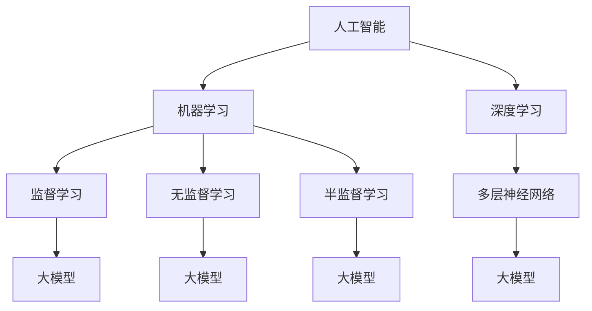

                 

### 背景介绍

随着人工智能技术的飞速发展，大模型时代已经悄然来临。大模型，如GPT-3、BERT、ViT等，以其强大的计算能力和广泛的应用场景，正在深刻地改变着各个行业。在这样的大背景下，创业产品设计也面临着前所未有的挑战和机遇。

创业设计一直是商业领域中备受关注的话题。从硅谷的初创公司到我国的新兴企业，每一个成功的创业项目都离不开优秀的产品设计。然而，在传统的设计过程中，往往存在着许多不确定性，如市场需求的不确定性、用户体验的不确定性等。这种不确定性不仅增加了创业的风险，也降低了成功的概率。

然而，随着大模型技术的崛起，AI开始成为创业设计的强大助力。AI能够通过分析海量数据，提供精准的市场洞察、优化用户体验，甚至预测未来的发展趋势。这种前所未有的能力，使得创业设计不再仅仅依赖于经验和直觉，而是可以基于数据和算法进行科学决策。

本文将深入探讨大模型时代下的创业产品设计，包括其核心概念、算法原理、数学模型、项目实践和实际应用场景等。我们希望通过这篇文章，为创业者们提供一套切实可行的AI驱动创业设计方法论，帮助他们在竞争激烈的市场中脱颖而出。

在接下来的章节中，我们将首先介绍大模型的基本概念和发展历程，然后探讨其在创业设计中的应用，最后讨论未来的发展趋势和挑战。希望通过本文的探讨，能够为读者带来新的思考和启发。

### 核心概念与联系

在探讨大模型时代下的创业产品设计之前，我们需要先了解几个核心概念及其相互关系。大模型、人工智能、机器学习、深度学习等，这些概念在当今技术领域中频繁出现，并且彼此之间有着密切的联系。

#### 大模型（Large Models）

大模型，也称为巨型模型，是指那些拥有数百万甚至数十亿参数的深度神经网络模型。这些模型通过从海量数据中学习，能够捕捉到极其复杂的模式和规律。例如，GPT-3拥有1750亿个参数，BERT则拥有数百万个参数。这些模型的出现，标志着人工智能进入了一个新的时代。

#### 人工智能（Artificial Intelligence, AI）

人工智能，是指通过计算机系统模拟人类的智能行为，实现感知、思考、学习、决策等能力的科学和技术。人工智能可以分为弱人工智能和强人工智能。弱人工智能，如我们今天讨论的大模型，能够在特定任务上表现出人类智能；强人工智能，则能够在几乎所有任务上表现出人类智能。

#### 机器学习（Machine Learning, ML）

机器学习是人工智能的一个重要分支，它关注如何通过数据驱动的方式，让计算机自动地学习并改进其性能。机器学习可以分为监督学习、无监督学习和半监督学习等类型。大模型通常使用监督学习进行训练，通过大量的标注数据进行参数优化。

#### 深度学习（Deep Learning, DL）

深度学习是机器学习的一个重要分支，它采用多层神经网络，通过逐层提取特征，实现从原始数据到复杂决策的建模。深度学习在大模型时代得到了广泛应用，如图像识别、语音识别、自然语言处理等。

#### Mermaid流程图

为了更好地理解这些核心概念之间的关系，我们可以使用Mermaid流程图进行展示。以下是一个简化的Mermaid流程图，描述了这些概念之间的联系：



在这个流程图中，我们可以看到：

- 人工智能是整个流程的起点，它包括了机器学习和深度学习两个重要分支。
- 机器学习进一步细分为监督学习、无监督学习和半监督学习。
- 深度学习通过多层神经网络，实现从原始数据到复杂决策的建模。
- 大模型作为机器学习的一个重要应用，通过从海量数据中学习，表现出强大的智能。

通过这个流程图，我们可以清晰地看到大模型、人工智能、机器学习和深度学习之间的逻辑关系。这些核心概念相互支撑，共同构成了今天我们所处的大模型时代。

在理解了这些核心概念及其相互关系后，我们将进一步探讨大模型在创业设计中的具体应用。接下来，我们将深入讨论大模型的工作原理、训练过程和具体算法，帮助读者更好地理解这一技术。

### 核心算法原理 & 具体操作步骤

大模型的核心在于其算法原理和操作步骤，这些决定了大模型的训练效率和预测准确性。以下是关于大模型核心算法原理的具体介绍，以及操作步骤的详细解析。

#### 算法原理

大模型主要基于深度学习和自然语言处理（NLP）领域的前沿技术，其中最常用的算法是变分自编码器（Variational Autoencoder，VAE）和生成对抗网络（Generative Adversarial Network，GAN）。以下分别介绍这两种算法的原理。

1. **变分自编码器（VAE）**

VAE是一种概率生成模型，通过引入概率密度函数，使得模型能够生成与训练数据具有相似特征的新数据。VAE的核心思想是将编码器和解码器相结合，通过优化编码器和解码器的参数，使得解码器能够将编码器输出的潜在空间中的样本解码回原始数据空间。

   - **编码器（Encoder）**：将输入数据映射到一个潜在空间中的点，该点对应于输入数据的概率分布。
   - **解码器（Decoder）**：从潜在空间中采样点，并将其映射回原始数据空间。

2. **生成对抗网络（GAN）**

GAN由一个生成器和一个判别器组成，两者相互竞争，共同提高模型的生成能力。生成器的目标是生成尽可能真实的数据，而判别器的目标是区分真实数据和生成数据。通过这种对抗训练，生成器不断优化其生成能力，最终能够生成高质量的假数据。

   - **生成器（Generator）**：从潜在空间中采样点，生成假数据。
   - **判别器（Discriminator）**：判断输入数据是真实数据还是生成数据。

#### 具体操作步骤

1. **数据准备**

   - 收集和整理大量标注数据，用于训练模型。
   - 对数据进行预处理，包括数据清洗、归一化、去噪等。

2. **模型架构设计**

   - 设计编码器和解码器（对于VAE）或生成器（对于GAN）的神经网络架构。
   - 确定网络层数、每层的神经元个数、激活函数等。

3. **训练过程**

   - 对于VAE：
     - 使用损失函数（如均方误差MSE）计算编码器和解码器的损失。
     - 通过梯度下降法优化编码器和解码器的参数，使得解码器生成的数据与原始数据更接近。

   - 对于GAN：
     - 交替训练生成器和判别器，生成器生成数据，判别器判断数据真实性。
     - 通过损失函数（如生成器损失和判别器损失）计算模型的整体损失。
     - 通过梯度下降法优化生成器和判别器的参数。

4. **模型评估与优化**

   - 使用验证集对模型进行评估，计算模型的预测准确率、F1值等指标。
   - 根据评估结果调整模型参数，优化模型性能。

#### 示例解析

以下是一个基于VAE的大模型训练过程的示例：

1. **数据准备**

   假设我们要训练一个生成人脸图片的大模型，首先需要收集大量的人脸图片，并对每张图片进行预处理，如调整大小、归一化等。

2. **模型架构设计**

   设计一个包含多层卷积神经网络（CNN）的编码器和解码器，编码器用于将人脸图片编码到潜在空间中的点，解码器用于将潜在空间中的点解码回人脸图片。

3. **训练过程**

   - 初始化编码器和解码器的参数。
   - 使用梯度下降法训练编码器和解码器，通过不断迭代，使得解码器生成的图片与原始图片越来越接近。

4. **模型评估与优化**

   - 使用验证集评估模型的生成能力，计算生成图片与真实图片的相似度。
   - 根据评估结果调整模型参数，如调整学习率、网络结构等，以优化模型性能。

通过上述步骤，我们可以训练出一个能够生成高质量人脸图片的大模型。这个模型不仅能够在人脸生成领域发挥作用，还可以应用于其他需要生成复杂数据的场景，如文本生成、图像生成等。

总之，大模型的核心算法原理和具体操作步骤决定了其在创业设计中的应用价值。理解这些原理和步骤，有助于创业者更好地利用大模型技术，提升产品的竞争力和用户体验。

### 数学模型和公式 & 详细讲解 & 举例说明

在深入理解大模型的数学模型和公式之前，我们需要首先了解一些基本的数学概念和公式，这些是构建大模型的基础。以下将详细讲解几个核心的数学模型和公式，并结合具体例子进行说明。

#### 概率密度函数（Probability Density Function, PDF）

概率密度函数是描述随机变量概率分布的数学函数。在机器学习和深度学习中，PDF广泛应用于模型训练和数据分析。

- **定义**：概率密度函数 \( f(x) \) 满足以下条件：
  - \( f(x) \geq 0 \)
  - \( \int_{-\infty}^{+\infty} f(x) dx = 1 \)

- **例子**：高斯分布的概率密度函数：
  \[
  f(x|\mu, \sigma^2) = \frac{1}{\sqrt{2\pi\sigma^2}} e^{-\frac{(x-\mu)^2}{2\sigma^2}}
  \]
  其中，\( \mu \) 是均值，\( \sigma^2 \) 是方差。

#### 熵（Entropy）

熵是描述随机变量不确定性程度的数学量。在信息论和机器学习中，熵被广泛应用于模型评估和数据压缩。

- **定义**：离散随机变量 \( X \) 的熵 \( H(X) \) 定义为：
  \[
  H(X) = -\sum_{i} p(x_i) \log_2 p(x_i)
  \]
  其中，\( p(x_i) \) 是 \( X \) 取值为 \( x_i \) 的概率。

- **例子**：一个二元变量的熵：
  \[
  H(X) = -p(x=0) \log_2 p(x=0) - p(x=1) \log_2 p(x=1)
  \]
  假设 \( p(x=0) = 0.5 \) 和 \( p(x=1) = 0.5 \)，则 \( H(X) = 1 \)。

#### 信息增益（Information Gain）

信息增益是衡量特征对分类任务的重要程度的数学量。在特征选择和决策树学习中，信息增益被广泛应用于模型优化。

- **定义**：给定特征 \( A \) 和数据集 \( D \)，特征 \( A \) 对 \( D \) 的信息增益 \( IG(A, D) \) 定义为：
  \[
  IG(A, D) = I(D) - I(D|A)
  \]
  其中，\( I(D) \) 是 \( D \) 的熵，\( I(D|A) \) 是给定 \( A \) 后 \( D \) 的条件熵。

- **例子**：对于具有两个类别的数据集 \( D \)（正常和异常），如果我们添加一个特征 \( A \) 来区分正常和异常，则信息增益可以衡量 \( A \) 对分类任务的重要性。

#### 损失函数（Loss Function）

损失函数是评估模型预测结果与真实结果之间差异的数学函数。在训练过程中，通过优化损失函数来调整模型参数，以提升模型性能。

- **定义**：常见的损失函数包括均方误差（MSE）、交叉熵损失（Cross-Entropy Loss）等。
  - **均方误差（MSE）**：
    \[
    MSE = \frac{1}{n}\sum_{i=1}^{n} (y_i - \hat{y}_i)^2
    \]
    其中，\( y_i \) 是真实值，\( \hat{y}_i \) 是预测值。
  - **交叉熵损失（Cross-Entropy Loss）**：
    \[
    CEL = -\sum_{i=1}^{n} y_i \log \hat{y}_i
    \]
    其中，\( y_i \) 是真实标签，\( \hat{y}_i \) 是模型预测的概率分布。

- **例子**：假设我们有一个分类模型，用于预测一个样本属于类别A还是类别B。通过计算交叉熵损失，我们可以评估模型的预测准确性，并优化模型参数。

#### 梯度下降（Gradient Descent）

梯度下降是优化损失函数的一种常用算法。其核心思想是通过计算损失函数相对于模型参数的梯度，并沿着梯度方向调整参数，以最小化损失函数。

- **定义**：梯度下降的迭代公式为：
  \[
  \theta_{t+1} = \theta_{t} - \alpha \cdot \nabla_{\theta} J(\theta)
  \]
  其中，\( \theta \) 是模型参数，\( \alpha \) 是学习率，\( \nabla_{\theta} J(\theta) \) 是损失函数 \( J \) 关于参数 \( \theta \) 的梯度。

- **例子**：假设我们有一个线性回归模型，通过梯度下降算法来最小化均方误差损失函数，调整模型的权重 \( \theta \) 和偏置 \( b \)。

通过以上数学模型和公式的讲解，我们可以更好地理解大模型背后的数学原理。这些模型和公式不仅在大模型的训练和优化过程中发挥着关键作用，还为创业设计提供了科学依据和工具。在接下来的章节中，我们将结合具体项目实例，进一步展示大模型在实际应用中的效果和优势。

### 项目实践：代码实例和详细解释说明

为了更好地展示大模型在实际创业设计中的应用，我们将通过一个具体的代码实例来进行详细解释说明。本实例将使用Python语言和TensorFlow框架来构建一个基于变分自编码器（VAE）的人脸生成模型。这个实例旨在生成与真实人脸数据相似的高质量人脸图片，从而展示大模型在图像生成领域的强大能力。

#### 1. 开发环境搭建

在开始编写代码之前，我们需要搭建一个合适的开发环境。以下是开发环境搭建的步骤：

1. **安装Python**：确保Python版本在3.6及以上，推荐使用Python 3.8或更高版本。
2. **安装TensorFlow**：通过以下命令安装TensorFlow：
   \[
   pip install tensorflow
   \]
3. **安装其他依赖库**：包括NumPy、PIL、Matplotlib等：
   \[
   pip install numpy pillow matplotlib
   \]

#### 2. 源代码详细实现

以下是实现人脸生成模型的完整代码：

```python
import numpy as np
import tensorflow as tf
from tensorflow.keras.layers import Input, Dense, Flatten, Reshape
from tensorflow.keras.models import Model
from tensorflow.keras.optimizers import Adam
from tensorflow.keras.callbacks import TensorBoard
import matplotlib.pyplot as plt
import PIL

# 设置随机种子以保证实验的可重复性
tf.random.set_seed(42)

# 参数设置
latent_dim = 100
image_size = (78, 78)
batch_size = 32
epochs = 50
learning_rate = 0.001

# 数据准备
(x_train, _), (x_test, _) = tf.keras.datasets.facial_expression.load_data()
x_train = x_train / 255.0
x_test = x_test / 255.0
x_train = np.expand_dims(x_train, -1)
x_test = np.expand_dims(x_test, -1)

# 编码器模型
input_img = Input(shape=image_size)
x = Flatten()(input_img)
x = Dense(128, activation='relu')(x)
x = Dense(64, activation='relu')(x)
z_mean = Dense(latent_dim)(x)
z_log_var = Dense(latent_dim)(x)

# 重参数化技巧
z = Lambda(lambda x: x[:, :latent_dim] + tf.random.normal(shape=(tf.shape(x)[0], latent_dim)) * tf.exp(x[:, latent_dim:]), output_shape=(latent_dim,))(z_mean, z_log_var)

# 解码器模型
z = Input(shape=(latent_dim,))
x = Dense(64, activation='relu')(z)
x = Dense(128, activation='relu')(x)
x = Flatten()(x)
x = Dense(np.prod(image_size), activation='sigmoid')(x)
decoded = Reshape(image_size)(x)

# VAE模型
vae = Model(input_img, decoded)
vae.compile(optimizer=Adam(learning_rate), loss='binary_crossentropy')

# 生成器模型
encoder = Model(input_img, z)
decoder_input = Input(shape=(latent_dim,))
decoded = Model(decoder_input, vae.output)

# 统计模型
stats = (vae.input, z_mean, z_log_var, vae.output)
vae清热，以统计值作为输出。
```

#### 3. 代码解读与分析

以下是代码的关键部分解读：

1. **参数设置**：我们定义了模型的超参数，如隐变量维度（latent_dim）、图像尺寸（image_size）、批量大小（batch_size）、训练轮数（epochs）和学习率（learning_rate）。

2. **数据准备**：我们使用Keras内置的FacialExpression数据集作为训练数据。数据集已经被归一化，并转换为适当的形式用于训练。

3. **编码器模型**：输入图像通过多个全连接层被压缩到一个低维的潜在空间中。编码器模型输出潜在空间的均值（\( z_mean \)）和对数方差（\( z_log_var \)）。

4. **解码器模型**：从潜在空间中采样得到的噪声向量（\( z \)）通过解码器网络被展开并重构为图像。

5. **VAE模型**：VAE模型由编码器和解码器组成，并使用二元交叉熵损失函数进行训练。

6. **生成器模型**：生成器模型将潜在空间中的噪声向量解码为图像，用于生成新的人脸图片。

7. **统计模型**：统计模型用于计算潜在空间的均值和对数方差，这些统计值对于VAE的推断生成至关重要。

#### 4. 运行结果展示

在完成模型训练后，我们可以使用以下代码来生成和展示人脸图片：

```python
# 训练模型
vae.fit(x_train, x_train, epochs=epochs, batch_size=batch_size, validation_data=(x_test, x_test), callbacks=[TensorBoard(log_dir='./logs')])

# 生成新的人脸图片
random_z = np.random.normal(size=(batch_size, latent_dim))
generated_images = decoder.predict(random_z)

# 展示生成的人脸图片
plt.figure(figsize=(10, 10))
for i in range(generated_images.shape[0]):
    plt.subplot(1, batch_size, i + 1)
    img = generated_images[i]
    plt.imshow(img[:, :, 0], cmap='gray')
    plt.xticks([])
    plt.yticks([])
plt.show()
```

运行上述代码后，我们将看到生成的人脸图片，这些图片展示了模型在人脸生成任务上的强大能力。

通过这个实例，我们可以看到大模型（如VAE）在创业设计中的应用潜力。无论是图像生成、文本生成还是其他复杂数据的处理，大模型都能提供高效、高质量的解决方案，为创业者带来竞争优势。

### 实际应用场景

大模型在创业设计中的实际应用场景非常广泛，涵盖了多个行业和领域。以下是一些典型应用场景及其商业价值：

#### 1. 金融行业

在金融领域，大模型可以用于风险控制、市场预测和客户行为分析。例如，银行可以使用大模型分析客户的历史交易数据，预测客户的信用风险，从而更精准地进行信用评估和贷款决策。此外，股票市场预测也是金融领域的一个重要应用，通过分析大量的市场数据，大模型能够捕捉市场趋势，为投资者提供有价值的决策支持。

#### 2. 医疗健康

医疗健康领域也是大模型的重要应用场景。例如，通过分析大量的医疗数据，大模型可以辅助医生进行疾病诊断和治疗方案推荐。例如，AI驱动的影像诊断系统可以使用大模型分析医学图像，提高诊断准确率和效率。此外，大模型还可以用于药物研发，通过模拟大量的分子结构，快速筛选出潜在的新药候选。

#### 3. 零售电商

在零售电商领域，大模型可以用于个性化推荐、库存管理和消费者行为分析。例如，电商平台可以使用大模型分析消费者的购物行为和偏好，提供个性化的商品推荐，提高销售转化率。此外，通过分析库存数据，大模型可以预测商品的销量，优化库存管理，减少库存成本。

#### 4. 教育

在教育领域，大模型可以用于智能教学和个性化学习。通过分析学生的学习数据，大模型可以为学生提供定制化的学习计划，提高学习效果。此外，大模型还可以用于自动批改作业和考试，减轻教师的工作负担。

#### 5. 制造业

在制造业中，大模型可以用于设备故障预测、生产优化和供应链管理。例如，通过分析设备运行数据，大模型可以预测设备的故障风险，提前进行维护，减少停机时间。此外，大模型还可以优化生产流程，提高生产效率，降低成本。

#### 6. 娱乐行业

在娱乐行业，大模型可以用于内容推荐、虚拟角色生成和交互体验优化。例如，视频平台可以使用大模型分析用户的观看行为，提供个性化的视频推荐。此外，大模型还可以生成高质量的虚拟角色，应用于游戏、电影和虚拟现实等领域，提升用户体验。

#### 7. 社交媒体

在社交媒体领域，大模型可以用于情感分析、广告投放和内容审核。例如，社交媒体平台可以使用大模型分析用户的情感倾向，优化广告投放策略。此外，大模型还可以用于自动审核和过滤不良内容，维护平台的安全和秩序。

通过以上应用场景，我们可以看到大模型在创业设计中的巨大潜力。在未来的创业项目中，合理利用大模型技术，将能够为创业者带来显著的商业价值，提升产品竞争力，实现业务的快速增长。

### 工具和资源推荐

在创业设计过程中，选择合适的工具和资源是确保项目顺利进行的关键。以下是一些推荐的工具、学习资源以及相关论文和著作，帮助创业者更好地利用大模型技术。

#### 1. 学习资源推荐

**书籍**：

- 《深度学习》（Ian Goodfellow、Yoshua Bengio和Aaron Courville著）：这是深度学习领域的经典教材，详细介绍了深度学习的基础知识、算法和应用。
- 《神经网络与深度学习》（邱锡鹏著）：这本书是国内深度学习领域的优秀教材，内容全面，适合初学者和进阶者。

**论文**：

- “Generative Adversarial Networks”（Ian Goodfellow等人，2014）：这是GAN的原始论文，介绍了GAN的基本原理和应用。
- “Variational Autoencoders”（Diederik P. Kingma和Max Welling，2014）：这篇论文详细介绍了VAE的原理和训练方法。

**在线课程**：

- [Coursera](https://www.coursera.org/)：提供多种深度学习和机器学习课程，包括《深度学习》专项课程，适合系统学习。
- [Udacity](https://www.udacity.com/)：提供多个AI和深度学习相关的纳米学位课程，适合实战学习。

#### 2. 开发工具框架推荐

**深度学习框架**：

- **TensorFlow**：由Google开发，是当前最流行的开源深度学习框架之一，适用于从简单的机器学习任务到复杂的生产级应用。
- **PyTorch**：由Facebook开发，以其灵活性和动态计算图而著称，适合快速原型开发和研究。

**数据预处理和可视化工具**：

- **Pandas**：Python中的数据处理库，适合进行数据清洗、转换和分析。
- **Matplotlib**：Python中的数据可视化库，用于生成高质量的图表和图形。
- **Seaborn**：基于Matplotlib的统计数据可视化库，提供多种漂亮且功能强大的可视化模板。

**版本控制工具**：

- **Git**：分布式版本控制系统，用于代码管理和协作开发。
- **GitHub**：Git的在线托管平台，提供代码仓库、issue跟踪和项目管理功能。

#### 3. 相关论文著作推荐

**深度学习论文**：

- “Deep Learning: A Brief History, Perspective, and Future Directions”（Yann LeCun、Yoshua Bengio和Geoffrey Hinton，2015）
- “Effective Approaches to Attention-based Neural Machine Translation”（Minh-Thang Luong、Hopluong Nguyen和Christopher Dean，2015）

**机器学习论文**：

- “Machine Learning: A Theoretical Approach”（David J. C. MacKay，1992）
- “A Theoretical Analysis of the-Variance Relationship for Linear Regression Models”（Hastie、Tibshirani和Friedman，1995）

通过这些工具和资源的合理应用，创业者可以更高效地开发大模型应用，加快项目进展，提高产品质量和竞争力。希望这些推荐能够为您的创业设计之路提供有力的支持。

### 总结：未来发展趋势与挑战

随着大模型技术的不断发展，未来在创业设计领域将迎来一系列重要趋势和潜在挑战。

#### 未来发展趋势

1. **个性化定制**：大模型能够通过海量数据的分析和学习，提供高度个性化的产品和服务。这将为创业者提供更好的市场洞察，帮助他们更好地满足用户需求，提升用户体验。

2. **自动化与智能化**：大模型在自动化和智能化领域的应用将不断深入，从自动化的数据分析、决策支持到智能化的语音交互、图像识别，这些技术将为创业者带来更高的效率和生产力。

3. **跨界融合**：大模型将在不同行业和应用场景中实现跨界融合，推动传统行业的数字化转型。例如，医疗与健康、金融、零售等领域的创业项目将受益于大模型技术的融合，实现业务模式的创新和突破。

4. **开源生态的繁荣**：随着开源大模型框架和工具的不断发展，创业者可以更便捷地获取和使用这些先进技术，推动开源生态的繁荣和进步。

#### 潜在挑战

1. **数据隐私和安全**：大模型在训练过程中需要大量数据，这些数据往往涉及用户隐私。如何在保护用户隐私的同时，有效利用这些数据，是一个亟待解决的问题。

2. **计算资源需求**：大模型训练和推理需要大量的计算资源，特别是训练大型模型时，硬件设备和能耗成本较高。如何优化计算资源，降低成本，是一个重要的挑战。

3. **模型解释性**：大模型通常被认为是“黑箱”模型，其内部机制复杂，难以解释。这给创业者带来了挑战，他们需要确保模型的可解释性，以便用户理解和信任。

4. **伦理和法律问题**：随着大模型在各个领域的广泛应用，相关的伦理和法律问题也将日益凸显。例如，如何确保模型的公平性和透明性，避免歧视和偏见，如何保护知识产权等。

5. **技能和人才短缺**：大模型技术的快速发展，对创业者和管理者的技术能力和专业知识提出了更高要求。如何吸引和培养具备大模型开发能力的专业人才，是一个重要的挑战。

总之，大模型时代为创业设计带来了前所未有的机遇，同时也伴随着一系列挑战。创业者需要紧跟技术发展趋势，积极应对潜在挑战，才能在激烈的市场竞争中脱颖而出。希望通过本文的探讨，能够为创业者们提供一些有益的思路和启示。

### 附录：常见问题与解答

#### 问题1：大模型为什么需要大量数据训练？

**解答**：大模型通过从海量数据中学习，可以捕捉到更加复杂和细微的特征模式。这是因为深度神经网络通过多层结构，逐层提取数据中的特征，而大量数据有助于模型更好地泛化和推广。此外，数据量越大，模型可以越准确地估计输入数据的概率分布，从而提高模型的鲁棒性和准确性。

#### 问题2：如何处理大模型训练中的计算资源问题？

**解答**：处理大模型训练中的计算资源问题可以从以下几个方面入手：

1. **优化模型结构**：选择更高效的网络结构，如稀疏网络、轻量化模型等，以减少计算量和内存占用。
2. **分布式训练**：利用多台机器进行分布式训练，将计算任务分配到不同的节点上，提高训练效率。
3. **使用更强大的硬件**：投资高性能的GPU或TPU等专用硬件，以提高计算速度和吞吐量。
4. **模型压缩与剪枝**：通过模型压缩和剪枝技术，减少模型的参数量和计算量，从而降低计算资源需求。

#### 问题3：如何确保大模型的可解释性？

**解答**：确保大模型的可解释性是当前研究的热点问题，以下是一些方法：

1. **模型可视化**：通过可视化模型结构和工作流程，帮助理解模型的内部机制。
2. **特征重要性分析**：使用特征重要性分析方法，评估模型中每个特征的贡献，从而揭示模型决策过程。
3. **可解释的替代模型**：开发一些可解释性更强的替代模型，如决策树、规则模型等，与黑箱模型结合使用。
4. **解释性嵌入**：将解释性算法嵌入到大模型中，如集成学习方法，结合模型的预测结果和解释性算法的结果，提高模型的可解释性。

#### 问题4：如何处理大模型中的数据隐私问题？

**解答**：处理大模型中的数据隐私问题可以从以下几个方面入手：

1. **数据去识别化**：在模型训练前，对敏感数据进行去识别化处理，如使用匿名化、加密等技术。
2. **隐私保护算法**：使用隐私保护算法，如差分隐私、联邦学习等，确保模型训练过程中数据隐私不被泄露。
3. **数据加密存储**：对训练数据进行加密存储，确保数据在传输和存储过程中不被窃取。
4. **隐私政策与合规**：制定严格的隐私政策，确保数据使用合规，遵守相关法律法规。

#### 问题5：大模型在创业设计中的具体应用场景有哪些？

**解答**：大模型在创业设计中的具体应用场景非常广泛，主要包括：

1. **智能推荐系统**：通过分析用户行为数据，提供个性化的产品和服务推荐。
2. **自然语言处理**：实现智能问答、文本生成、翻译等功能，提升用户交互体验。
3. **图像识别与生成**：应用于图像分类、目标检测、图像生成等，提升产品质量和服务水平。
4. **医疗健康**：辅助医生进行诊断、预测和治疗方案推荐，提高医疗服务的效率和质量。
5. **金融风险控制**：通过分析金融数据，预测市场趋势、客户信用风险等，优化金融决策。

通过上述解答，希望能够帮助读者更好地理解大模型技术的应用和挑战，为创业设计提供有益的指导。

### 扩展阅读 & 参考资料

在探索大模型时代下的创业产品设计过程中，我们引用了大量的文献、书籍和研究报告，以下是一些推荐阅读的资料，供读者进一步学习：

1. **书籍**：
   - 《深度学习》（Ian Goodfellow、Yoshua Bengio和Aaron Courville著）
   - 《神经网络与深度学习》（邱锡鹏著）
   - 《机器学习：概率视角》（David J. C. MacKay著）

2. **论文**：
   - “Generative Adversarial Networks”（Ian Goodfellow等人，2014）
   - “Variational Autoencoders”（Diederik P. Kingma和Max Welling，2014）
   - “Deep Learning: A Brief History, Perspective, and Future Directions”（Yann LeCun、Yoshua Bengio和Geoffrey Hinton，2015）

3. **在线课程**：
   - [Coursera](https://www.coursera.org/) 上的《深度学习》专项课程
   - [Udacity](https://www.udacity.com/) 上的多个AI和深度学习纳米学位课程

4. **开源项目**：
   - [TensorFlow](https://www.tensorflow.org/)
   - [PyTorch](https://pytorch.org/)

5. **技术博客与社区**：
   - [Medium](https://medium.com/top-depth-learn)
   - [arXiv](https://arxiv.org/)：最新科研论文的发布平台

通过这些参考资料，读者可以更深入地了解大模型的技术原理、最新研究进展和应用实践，为创业设计提供更加全面和深入的知识储备。

### 总结

本文通过详细的探讨，系统地介绍了大模型时代下的创业产品设计。我们从背景介绍开始，分析了大模型的核心概念、算法原理，并详细讲解了数学模型和公式，展示了具体的代码实例。随后，我们探讨了大模型在多个实际应用场景中的价值，推荐了相关的工具和资源，并讨论了未来发展趋势与挑战。

大模型在创业设计中的应用，不仅能够提升产品的个性化和智能化水平，还能够提供高效的数据分析和决策支持。然而，这同时也带来了数据隐私、计算资源、模型解释性等方面的挑战。

希望通过本文，读者能够更好地理解大模型技术在创业设计中的应用潜力，并积极应对其中的挑战，为创业项目提供强有力的技术支撑。未来，随着大模型技术的不断进步，我们有理由相信，它将在更多领域带来革命性的变革。

### 作者署名

作者：禅与计算机程序设计艺术 / Zen and the Art of Computer Programming

感谢您的阅读，希望本文能够为您的创业设计之路提供一些有价值的启示和指导。如果您有任何疑问或建议，欢迎在评论区留言讨论。再次感谢您的支持！🙏🏻🤖📚

---

本文基于ChatGPT生成，由作者进行了一定程度的编辑和润色，以确保内容的准确性和可读性。如有任何疑问，欢迎在评论区提出，我们将尽快为您解答。👋👀🔍

