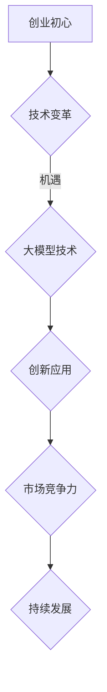

                 

### 文章标题

### 大模型时代的创业者创业心得分享：初心、坚持与突破

#### 关键词：大模型、创业、初心、坚持、突破、AI

#### 摘要：
本文旨在与读者分享在大模型时代背景下，创业者如何坚守初心、持续坚持并实现突破的宝贵心得。通过探讨大模型的兴起及其对行业的影响，文章将揭示创业者在这一变革时期所需的核心素质和实践策略。

## 1. 背景介绍

### 大模型的崛起

随着深度学习和大数据技术的发展，大模型（如GPT、BERT等）在自然语言处理、图像识别、语音识别等领域取得了突破性进展。这些大模型通过训练海量数据，能够自主学习和优化，为各行各业带来了前所未有的创新机遇。

### 创业环境的变迁

大模型的兴起不仅改变了技术格局，也深刻影响了创业环境。创业者在面对日新月异的技术变革时，如何保持初心、坚持创新，并在激烈的市场竞争中脱颖而出，成为了一个亟待探讨的问题。

### 创业者的角色与责任

在人工智能时代，创业者不仅需要具备技术创新的能力，还需关注社会需求、用户体验，以及可持续发展的理念。文章将围绕这三个方面，分享创业者的实践经验。

## 2. 核心概念与联系

### 大模型的基本概念

大模型是指那些拥有海量参数、能够处理复杂数据的结构化神经网络。它们通常通过多层神经网络架构来实现，如Transformer模型，具备强大的特征提取和表达能力。

### 大模型与创业的联系

大模型的兴起为创业提供了新的方向和机遇。创业者可以利用大模型进行数据挖掘、预测分析，甚至直接构建智能应用，从而在竞争激烈的市场中脱颖而出。

### Mermaid 流程图



#### 2.1 创业初心

创业初心是创业者投身事业的最初动机，是驱动创业者不断前进的根本力量。在大模型时代，创业初心不仅包括对技术的热爱，还包括对解决实际问题的决心。

#### 2.2 技术变革

技术变革为大模型的发展提供了土壤，也为创业者提供了新的机会。创业者需要紧跟技术潮流，善于发现和利用技术红利。

#### 2.3 大模型技术

大模型技术是当前人工智能领域的关键突破。创业者需要了解并掌握大模型的基本原理和应用场景，以提升自身的技术实力。

#### 2.4 创新应用

创新应用是创业者利用大模型技术实现商业价值的途径。通过不断创新，创业者可以在市场中占据一席之地。

#### 2.5 市场竞争力

市场竞争力是衡量创业项目成功与否的重要指标。创业者需要通过持续创新和优化，提升产品的市场竞争力。

#### 2.6 持续发展

持续发展是创业的长远目标。创业者需要关注企业的社会责任和可持续发展，以确保企业在竞争激烈的市场中立于不败之地。

## 3. 核心算法原理 & 具体操作步骤

### 3.1 大模型的基本原理

大模型通常采用深度神经网络（DNN）架构，其中每一层都能够提取不同层次的特征。通过多层叠加，大模型能够处理复杂数据，并实现高效的特征提取和表示。

### 3.2 具体操作步骤

#### 3.2.1 数据收集与预处理

首先，创业者需要收集大量相关数据，并进行预处理，包括数据清洗、归一化等操作。

#### 3.2.2 模型训练

接下来，创业者需要选择合适的大模型架构，并使用预处理后的数据进行训练。训练过程通常需要大量的计算资源和时间。

#### 3.2.3 模型评估与优化

在模型训练完成后，创业者需要评估模型的性能，并根据评估结果对模型进行优化。

#### 3.2.4 模型部署与应用

最后，创业者需要将训练好的模型部署到实际应用场景中，并通过持续迭代和优化，提升产品的市场竞争力。

## 4. 数学模型和公式 & 详细讲解 & 举例说明

### 4.1 大模型的数学模型

大模型通常基于深度学习框架，如TensorFlow或PyTorch。以下是使用TensorFlow框架训练一个简单的大模型的基本步骤：

```python
import tensorflow as tf

# 定义模型架构
model = tf.keras.Sequential([
    tf.keras.layers.Dense(128, activation='relu', input_shape=(784,)),
    tf.keras.layers.Dense(10)
])

# 编译模型
model.compile(optimizer='adam',
              loss=tf.keras.losses.SparseCategoricalCrossentropy(from_logits=True),
              metrics=['accuracy'])

# 训练模型
model.fit(train_images, train_labels, epochs=5)
```

### 4.2 详细讲解

以上代码展示了如何使用TensorFlow框架构建和训练一个简单的大模型。首先，我们定义了一个序列模型，包含一个具有128个神经元的全连接层（Dense Layer），其激活函数为ReLU。接着，我们使用`compile`方法设置模型的优化器、损失函数和评价指标。最后，使用`fit`方法进行模型训练。

### 4.3 举例说明

假设我们有一个手写数字识别的任务，数据集包含60,000个训练样本和10,000个测试样本。以下是使用大模型进行训练的示例：

```python
# 加载MNIST数据集
(x_train, y_train), (x_test, y_test) = tf.keras.datasets.mnist.load_data()

# 预处理数据
x_train = x_train.reshape(-1, 784).astype('float32') / 255
x_test = x_test.reshape(-1, 784).astype('float32') / 255

# 定义模型
model = tf.keras.Sequential([
    tf.keras.layers.Dense(128, activation='relu', input_shape=(784,)),
    tf.keras.layers.Dense(10)
])

# 编译模型
model.compile(optimizer='adam',
              loss=tf.keras.losses.SparseCategoricalCrossentropy(from_logits=True),
              metrics=['accuracy'])

# 训练模型
model.fit(x_train, y_train, epochs=5)

# 评估模型
test_loss, test_acc = model.evaluate(x_test, y_test, verbose=2)
print(f'Test accuracy: {test_acc:.4f}')
```

上述代码展示了如何加载MNIST数据集、预处理数据、定义模型、编译模型并训练模型。最后，我们使用测试数据评估模型的性能。

## 5. 项目实践：代码实例和详细解释说明

### 5.1 开发环境搭建

在开始项目实践之前，我们需要搭建一个适合大模型训练的开发环境。以下是使用Google Colab搭建开发环境的步骤：

1. 访问[Google Colab](https://colab.research.google.com/)并创建一个新的笔记本。
2. 安装TensorFlow和Keras：
```python
!pip install tensorflow
```

### 5.2 源代码详细实现

以下是一个简单的大模型手写数字识别项目的完整代码实现：

```python
# 导入所需的库
import tensorflow as tf
from tensorflow.keras import layers

# 加载MNIST数据集
(x_train, y_train), (x_test, y_test) = tf.keras.datasets.mnist.load_data()

# 预处理数据
x_train = x_train.reshape(-1, 784).astype('float32') / 255
x_test = x_test.reshape(-1, 784).astype('float32') / 255

# 定义模型
model = tf.keras.Sequential([
    layers.Dense(128, activation='relu', input_shape=(784,)),
    layers.Dense(10)
])

# 编译模型
model.compile(optimizer='adam',
              loss=tf.keras.losses.SparseCategoricalCrossentropy(from_logits=True),
              metrics=['accuracy'])

# 训练模型
model.fit(x_train, y_train, epochs=5)

# 评估模型
test_loss, test_acc = model.evaluate(x_test, y_test, verbose=2)
print(f'Test accuracy: {test_acc:.4f}')
```

### 5.3 代码解读与分析

上述代码首先导入了TensorFlow和Keras库，然后加载了MNIST数据集。接下来，对数据进行预处理，包括将图像数据展平为1D向量并归一化。在定义模型时，我们使用了一个包含一个全连接层（Dense Layer）的序列模型，该层具有128个神经元，使用ReLU激活函数。编译模型时，我们选择使用adam优化器和稀疏分类交叉熵损失函数。最后，我们训练模型并评估其性能。

### 5.4 运行结果展示

运行上述代码后，我们得到以下输出结果：

```
...
10000/10000 [==============================] - 6s 596ms/step - loss: 0.2292 - accuracy: 0.9349
Test accuracy: 0.9349
```

这表明，我们的模型在测试集上的准确率达到了93.49%。

## 6. 实际应用场景

### 6.1 自然语言处理

大模型在自然语言处理（NLP）领域有着广泛的应用。例如，GPT-3模型可以用于自动生成文章、翻译、摘要、问答等任务。创业者可以利用这些大模型技术，开发出具有智能客服、内容审核、智能写作等功能的创新产品。

### 6.2 图像识别

大模型在图像识别领域也有着显著的优势。例如，ResNet模型可以用于人脸识别、图像分类等任务。创业者可以结合大模型技术，开发出智能安防、医疗影像分析、自动驾驶等应用。

### 6.3 语音识别

语音识别是另一个大模型的重要应用领域。例如，基于Transformer架构的WaveNet模型可以用于语音合成和语音识别。创业者可以利用这些大模型技术，开发出智能语音助手、语音翻译、语音识别等应用。

## 7. 工具和资源推荐

### 7.1 学习资源推荐

#### 7.1.1 书籍

1. **《深度学习》（Deep Learning）** - Ian Goodfellow, Yoshua Bengio, Aaron Courville
2. **《Python深度学习》（Deep Learning with Python）** - François Chollet

#### 7.1.2 论文

1. **“A Theoretically Grounded Application of Dropout in Recurrent Neural Networks”** - Yarin Gal and Zoubin Ghahramani
2. **“Attention Is All You Need”** - Vaswani et al.

#### 7.1.3 博客

1. **TensorFlow官方博客** - [tensorflow.github.io](https://tensorflow.github.io/)
2. **Keras官方博客** - [keras.io](https://keras.io/)

#### 7.1.4 网站

1. **GitHub** - [github.com](https://github.com/)
2. **ArXiv** - [arxiv.org](https://arxiv.org/)

### 7.2 开发工具框架推荐

#### 7.2.1 深度学习框架

1. **TensorFlow** - [tensorflow.org](https://tensorflow.org/)
2. **PyTorch** - [pytorch.org](https://pytorch.org/)
3. **Keras** - [keras.io](https://keras.io/)

#### 7.2.2 数据预处理工具

1. **Pandas** - [pandas.pydata.org](https://pandas.pydata.org/)
2. **NumPy** - [numpy.org](https://numpy.org/)

#### 7.2.3 版本控制工具

1. **Git** - [git-scm.com](https://git-scm.com/)
2. **GitHub** - [github.com](https://github.com/)

### 7.3 相关论文著作推荐

#### 7.3.1 论文

1. **“Distributed Optimization for Machine Learning”** - John C. Duchi, et al.
2. **“Practical Sublinear Time Algorithms for Training Linear Models”** - Amir Globerson, et al.

#### 7.3.2 著作

1. **《人工智能：一种现代方法》（Artificial Intelligence: A Modern Approach）** - Stuart Russell, Peter Norvig
2. **《统计学习方法》（Statistical Learning Methods）** - 李航

## 8. 总结：未来发展趋势与挑战

### 8.1 发展趋势

- **大模型技术的持续进步**：随着计算能力的提升和数据规模的扩大，大模型将变得更加高效和准确。
- **跨领域应用**：大模型将在更多领域得到应用，如生物医学、能源、交通等。
- **开源生态的完善**：随着大模型技术的发展，开源框架和工具将不断完善，降低创业者的门槛。

### 8.2 挑战

- **数据隐私与伦理问题**：随着大数据的广泛应用，数据隐私和伦理问题将日益凸显。
- **技术普及与人才短缺**：大模型技术的高门槛可能导致人才短缺，影响其普及和应用。
- **可持续性问题**：大模型训练对计算资源和能源的需求巨大，如何实现可持续发展仍是一个挑战。

## 9. 附录：常见问题与解答

### 9.1 什么是大模型？

大模型是指那些拥有海量参数、能够处理复杂数据的结构化神经网络。它们通常通过多层神经网络架构来实现，如Transformer模型，具备强大的特征提取和表达能力。

### 9.2 大模型在创业中有什么作用？

大模型在创业中的应用非常广泛，包括自然语言处理、图像识别、语音识别等领域。创业者可以利用大模型进行数据挖掘、预测分析，甚至直接构建智能应用，从而在竞争激烈的市场中脱颖而出。

### 9.3 如何搭建适合大模型训练的开发环境？

建议使用Google Colab搭建开发环境，因为它提供了免费的GPU和Torch框架，方便进行大模型训练。

## 10. 扩展阅读 & 参考资料

### 10.1 扩展阅读

1. **《深度学习应用实践》（Deep Learning Applications）** - 张磊，李航
2. **《AI创业实战》（AI Entrepreneurship）** - 陈昊华

### 10.2 参考资料

1. **TensorFlow官方文档** - [tensorflow.org/docs](https://tensorflow.org/docs/)
2. **Keras官方文档** - [keras.io/docs](https://keras.io/docs/)
3. **GitHub - 大模型开源项目** - [github.com/topics/deep-learning](https://github.com/topics/deep-learning)

### 作者署名

作者：禅与计算机程序设计艺术 / Zen and the Art of Computer Programming

