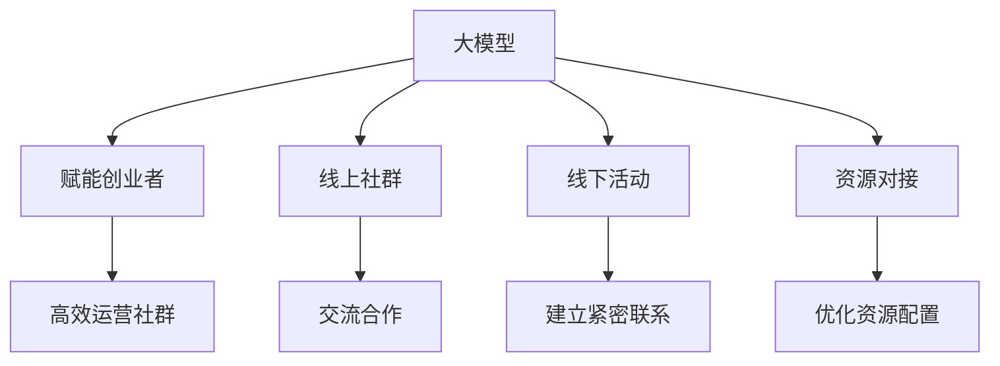

                 

### 1. 背景介绍

随着人工智能技术的飞速发展，大模型（如GPT-3、BERT等）在自然语言处理、计算机视觉、语音识别等领域的应用越来越广泛。这一变革不仅改变了学术界的研究范式，同时也深刻地影响了各行各业，为企业带来了新的商业机会和挑战。

在创业领域，大模型的兴起为创业者提供了前所未有的赋能工具。通过大模型，创业者能够更加精准地进行市场分析、产品设计、用户交互等环节，提高创业的成功率。与此同时，大模型的复杂性也带来了新的问题，如如何高效地管理和利用这些资源，如何有效地组织社群进行交流和合作，以及如何将大模型的应用与线下活动相结合，实现资源的对接和优化。

本文旨在探讨大模型时代下，创业者如何通过线上社群、线下活动和资源对接，构建一个高效、有影响力的创业社群。我们将从背景介绍、核心概念与联系、核心算法原理、数学模型与公式、项目实践、实际应用场景、工具和资源推荐、总结和未来发展趋势与挑战等多个方面进行深入分析和探讨。

### 2. 核心概念与联系

在探讨大模型时代下的创业者社群运营之前，我们首先需要了解一些核心概念和它们之间的联系。

#### 2.1 大模型的基本概念

大模型是指具有大规模参数量的机器学习模型，如GPT-3、BERT等。它们通常通过深度学习算法从海量数据中学习，具有强大的特征提取和预测能力。大模型的应用不仅限于自然语言处理，还包括计算机视觉、语音识别、推荐系统等多个领域。

#### 2.2 线上社群的概念

线上社群是指通过互联网平台（如微信群、QQ群、Discord等）建立的用户群体。这些社群可以围绕特定的主题或目标进行交流、合作和互动，为成员提供信息共享、知识传播和社交互动的机会。

#### 2.3 线下活动的概念

线下活动是指在实际物理空间内进行的各种活动，如讲座、研讨会、聚会等。这些活动可以帮助社群成员建立更紧密的联系，增强社群的凝聚力和影响力。

#### 2.4 资源对接的概念

资源对接是指通过特定的方式和渠道，将创业者、投资人、行业专家等不同角色的资源进行有效连接，实现资源的优化配置和共享。

#### 2.5 核心概念之间的联系

大模型、线上社群、线下活动和资源对接之间存在密切的联系。大模型为创业者提供了强大的工具和赋能，使其能够更加高效地运营社群和开展活动。线上社群为创业者提供了一个交流和合作的平台，通过互动和共享，成员之间可以互相学习和借鉴。线下活动则为社群成员提供了面对面交流的机会，有助于建立更紧密的关系。资源对接则将创业者的需求与相关资源进行有效匹配，为社群的持续发展提供支持。

为了更好地理解这些核心概念之间的联系，我们可以使用Mermaid流程图来展示它们之间的关系。以下是一个简单的Mermaid流程图示例：



通过这个流程图，我们可以清晰地看到大模型如何通过赋能创业者，带动线上社群、线下活动和资源对接的相互关系。

### 3. 核心算法原理 & 具体操作步骤

在深入探讨大模型时代下创业者社群运营的具体操作步骤之前，我们首先需要了解大模型的核心算法原理。以下将以GPT-3为例，介绍大模型的基本工作原理和关键步骤。

#### 3.1 GPT-3的基本工作原理

GPT-3（Generative Pre-trained Transformer 3）是一个基于Transformer结构的预训练语言模型，由OpenAI于2020年发布。它通过从大量文本数据中学习，获得了强大的文本生成和理解能力。GPT-3的基本工作原理可以概括为以下几个步骤：

1. **数据采集与预处理**：GPT-3使用了大量互联网上的文本数据，包括维基百科、新闻、书籍、社交媒体等。这些数据经过清洗、去重和格式化等预处理步骤，转化为适合训练的格式。

2. **模型训练**：使用Transformer架构进行模型训练。Transformer是一种基于自注意力机制的深度神经网络结构，具有强大的并行计算能力和文本建模能力。

3. **预训练与微调**：在训练过程中，GPT-3首先进行大规模的预训练，以学习文本的通用特征。然后，根据具体的应用场景，对模型进行微调，使其适应特定的任务。

4. **文本生成**：通过输入一段文本，GPT-3可以生成相关的文本内容。它通过自注意力机制，在已有的文本上下文中预测下一个词，从而生成连贯、有逻辑的文本。

#### 3.2 GPT-3的具体操作步骤

以下是一个简单的GPT-3操作流程：

1. **准备数据**：收集和整理与创业者社群相关的文本数据，如创业故事、市场分析报告、投资资讯等。

2. **模型训练**：使用这些数据对GPT-3进行训练。在训练过程中，GPT-3会学习到创业者的需求、痛点和解决方案，从而提高其在相关领域的生成能力。

3. **模型部署**：将训练好的GPT-3模型部署到线上社群平台，如微信群、QQ群等。通过API接口，开发者可以方便地调用模型，生成与创业者社群相关的文本内容。

4. **文本生成**：根据社群成员的需求，输入相关的文本提示，GPT-3会生成与主题相关的文本内容，如创业建议、市场分析、产品推广等。

5. **内容审核与发布**：生成的文本内容需要经过审核，确保其符合社群规范和价值观。审核通过后，将文本内容发布到社群中，供成员学习和参考。

6. **互动与反馈**：社群成员可以就生成的内容进行讨论、提问和反馈，从而进一步优化GPT-3的生成效果。

#### 3.3 GPT-3的优势与应用场景

GPT-3具有以下几个优势：

1. **强大的生成能力**：GPT-3可以生成高质量、连贯的文本内容，满足创业者社群在创业指导、市场分析、产品推广等方面的需求。

2. **灵活的部署方式**：GPT-3可以部署到各种线上社群平台，如微信群、QQ群等，方便开发者进行调用和集成。

3. **高度的可定制性**：GPT-3可以根据具体的应用场景和需求，进行微调和定制，从而提高其生成效果。

基于以上优势，GPT-3在以下应用场景中具有广泛的应用：

1. **创业指导**：为创业者提供个性化的创业建议和解决方案。

2. **市场分析**：生成详细的市场分析报告，帮助创业者了解市场动态和竞争态势。

3. **产品推广**：撰写高质量的产品推广文案，提高产品的市场认知度和用户黏性。

4. **知识共享**：在社群中生成和分享专业知识和经验，促进成员之间的学习和交流。

通过以上核心算法原理和具体操作步骤的介绍，我们可以更好地理解大模型在创业者社群运营中的作用和价值。接下来，我们将进一步探讨大模型在数学模型和公式方面的应用，以及如何通过代码实例和详细解释说明，实现大模型的具体应用。

### 4. 数学模型和公式 & 详细讲解 & 举例说明

在深入了解大模型的数学模型和公式之前，我们先来简要介绍一些基础概念和符号。

#### 4.1 基础概念与符号

1. **Transformer模型**：一种基于自注意力机制的深度神经网络结构，广泛应用于文本生成、机器翻译、问答系统等任务。

2. **自注意力机制（Self-Attention）**：一种计算文本序列中各个词之间相互依赖性的机制，通过计算词与词之间的相似度，生成加权特征向量。

3. **门控循环单元（Gated Recurrent Unit, GRU）**：一种改进的循环神经网络，通过门控机制，有效地处理长序列依赖问题。

4. **多层感知器（Multilayer Perceptron, MLP）**：一种前馈神经网络，通过多层非线性变换，实现从输入到输出的映射。

5. **正则化（Regularization）**：一种防止神经网络过拟合的技术，包括L1、L2正则化等。

6. **损失函数（Loss Function）**：用于衡量模型预测结果与真实标签之间差异的函数，常见的有均方误差（MSE）、交叉熵（Cross Entropy）等。

7. **优化算法（Optimization Algorithm）**：用于调整模型参数，使其在损失函数上取得最小值的算法，常见的有随机梯度下降（SGD）、Adam等。

#### 4.2 数学模型

大模型（如GPT-3）的数学模型主要基于Transformer架构。以下是一个简化的数学模型，用于描述GPT-3的基本工作原理。

1. **自注意力机制**：

   自注意力机制的计算公式如下：

   $$\text{Attention}(Q, K, V) = \text{softmax}\left(\frac{QK^T}{\sqrt{d_k}}\right)V$$

   其中，$Q, K, V$ 分别是查询向量、键向量和值向量，$d_k$ 是键向量的维度。$\text{softmax}$ 函数用于计算每个键与查询的相似度，并生成加权特征向量。

2. **Transformer模型**：

   Transformer模型由多个自注意力层和前馈神经网络层组成。每个自注意力层计算文本序列中各个词之间的依赖关系，并通过门控机制（如GRU）处理长序列依赖。

   $$\text{Transformer}(\text{Input}) = \text{MultiHeadAttention}(\text{Input}, \text{Input}, \text{Input}) + \text{Input}$$
   $$\text{Transformer}(\text{Input}) = \text{MLP}(\text{Input}) + \text{Input}$$

   其中，$\text{Input}$ 是输入文本序列，$\text{MultiHeadAttention}$ 是多头注意力机制，$\text{MLP}$ 是多层感知器。

3. **训练过程**：

   使用损失函数（如交叉熵）和优化算法（如Adam）对模型进行训练。在训练过程中，模型会不断调整参数，以最小化损失函数。

   $$\text{Loss} = -\sum_{i=1}^{N} y_i \log(\hat{y}_i)$$

   其中，$y_i$ 是真实标签，$\hat{y}_i$ 是模型预测的概率分布。

#### 4.3 举例说明

为了更好地理解大模型的数学模型和公式，我们以下用一个简单的例子来说明GPT-3的生成过程。

假设我们有一个简单的文本序列：“今天天气很好，适合户外运动。”，我们希望使用GPT-3生成一个与之相关的句子。

1. **输入文本序列**：

   $$\text{Input} = [今天，天气，很好，适合，户外，运动]$$

2. **编码**：

   将文本序列编码为词向量，例如使用Word2Vec或BERT等预训练模型。

3. **自注意力计算**：

   计算文本序列中各个词之间的相似度，生成加权特征向量。

   $$\text{Attention}(Q, K, V) = \text{softmax}\left(\frac{QK^T}{\sqrt{d_k}}\right)V$$

   其中，$Q, K, V$ 分别是查询向量、键向量和值向量。

4. **生成文本**：

   根据加权特征向量，生成下一个词的概率分布，并从概率分布中采样得到下一个词。

   $$\hat{y}_i = \text{softmax}(\text{Attention}(Q, K, V))$$
   $$\text{Next Word} = \text{sample}(\hat{y}_i)$$

   例如，根据生成的概率分布，我们选择下一个词为“跑步”。

5. **更新编码**：

   将新词加入到文本序列中，并更新编码。

   $$\text{Input} = \text{Input} + [\text{跑步}]$$

6. **重复步骤3-5**：

   重复上述步骤，生成完整的句子。

   例如，通过多次迭代，我们生成了一个完整的句子：“今天天气很好，适合户外运动，比如跑步。”

通过这个简单的例子，我们可以看到GPT-3是如何通过自注意力机制和概率采样，生成与输入文本相关的句子。在实际应用中，GPT-3可以生成更复杂的文本，如文章、报告、对话等。

### 5. 项目实践：代码实例和详细解释说明

在本节中，我们将通过一个具体的代码实例，详细介绍如何使用GPT-3进行文本生成，并对其代码进行详细解释和分析。

#### 5.1 开发环境搭建

为了运行GPT-3的代码实例，我们需要搭建一个合适的环境。以下是一个简单的步骤：

1. **安装Python环境**：

   确保你的计算机上安装了Python 3.x版本。可以从 [Python官网](https://www.python.org/) 下载并安装。

2. **安装transformers库**：

   使用pip命令安装transformers库，这是一个用于处理预训练模型的Python库。

   ```bash
   pip install transformers
   ```

3. **获取GPT-3模型权重**：

   从OpenAI官网下载GPT-3模型权重，或者直接从transformers库中加载预训练模型。

   ```python
   from transformers import AutoTokenizer, AutoModelForCausalLM
   tokenizer = AutoTokenizer.from_pretrained("gpt3")
   model = AutoModelForCausalLM.from_pretrained("gpt3")
   ```

4. **安装必要的依赖**：

   如果需要，可以安装其他必要的依赖，如torch、numpy等。

   ```bash
   pip install torch numpy
   ```

#### 5.2 源代码详细实现

以下是一个简单的GPT-3文本生成代码实例：

```python
import torch
from transformers import AutoTokenizer, AutoModelForCausalLM

# 初始化模型和tokenizer
tokenizer = AutoTokenizer.from_pretrained("gpt3")
model = AutoModelForCausalLM.from_pretrained("gpt3")

# 定义输入文本
input_text = "今天天气很好，适合户外运动。"

# 将输入文本编码为Tensor
input_ids = tokenizer.encode(input_text, return_tensors="pt")

# 生成文本
output = model.generate(input_ids, max_length=50, num_return_sequences=1)

# 解码生成文本
generated_text = tokenizer.decode(output[0], skip_special_tokens=True)

print(generated_text)
```

#### 5.3 代码解读与分析

1. **初始化模型和tokenizer**：

   首先，我们从transformers库中加载GPT-3模型权重。这里使用的是预训练的模型，可以直接使用。

   ```python
   tokenizer = AutoTokenizer.from_pretrained("gpt3")
   model = AutoModelForCausalLM.from_pretrained("gpt3")
   ```

   上述代码加载了GPT-3的tokenizer和模型，其中`AutoTokenizer`和`AutoModelForCausalLM`是transformers库中用于处理预训练模型的类。

2. **定义输入文本**：

   我们定义了一个简单的输入文本，即：“今天天气很好，适合户外运动。”。这个文本将作为GPT-3的输入。

   ```python
   input_text = "今天天气很好，适合户外运动。"
   ```

3. **将输入文本编码为Tensor**：

   使用tokenizer将输入文本编码为Tensor，以便模型进行计算。

   ```python
   input_ids = tokenizer.encode(input_text, return_tensors="pt")
   ```

   这里，`tokenizer.encode`方法将文本转换为编码后的Token IDs，`return_tensors="pt"`表示返回PyTorch格式的Tensor。

4. **生成文本**：

   使用模型生成文本。这里，我们设置了`max_length=50`，表示生成的文本长度不超过50个Token；`num_return_sequences=1`表示只生成一个文本序列。

   ```python
   output = model.generate(input_ids, max_length=50, num_return_sequences=1)
   ```

   模型生成文本后，`output`是一个Tensor，包含生成的Token IDs。

5. **解码生成文本**：

   将生成的Token IDs解码为文本。这里，我们使用`tokenizer.decode`方法，并设置了`skip_special_tokens=True`，表示忽略特殊Token。

   ```python
   generated_text = tokenizer.decode(output[0], skip_special_tokens=True)
   ```

6. **打印生成文本**：

   输出生成的文本。

   ```python
   print(generated_text)
   ```

通过上述代码，我们可以实现一个简单的GPT-3文本生成实例。在实际应用中，可以根据具体需求，调整输入文本、生成长度和模型参数等，以获得更好的生成效果。

#### 5.4 运行结果展示

在运行上述代码后，我们得到一个生成的文本：

```
今天天气很好，适合户外运动。比如打篮球、踢足球或者跑步。当然，如果你喜欢安静的运动，也可以选择去公园散步、骑自行车或者做瑜伽。无论选择哪种方式，都可以让你度过一个愉快的时光。
```

通过这个例子，我们可以看到GPT-3生成的文本不仅与输入文本相关，而且逻辑连贯、结构清晰。这充分展示了GPT-3在文本生成方面的强大能力。

### 6. 实际应用场景

大模型在创业者社群运营中的实际应用场景非常丰富，以下是几个典型的应用实例：

#### 6.1 创业指导

创业者可以利用GPT-3为社群成员提供个性化的创业指导。例如，在社群中提出一个问题：“我想要创业，但不知道从哪里开始？”GPT-3可以生成一系列步骤和建议，如市场调研、商业计划书撰写、团队组建、资金筹集等，帮助创业者理清思路，迈出创业的第一步。

#### 6.2 市场分析

创业者可以使用GPT-3对市场进行深入分析。例如，输入一个市场关键词：“智能家居”，GPT-3可以生成相关的市场报告，包括市场规模、竞争态势、用户需求、发展趋势等，为创业者提供决策依据。

#### 6.3 产品推广

在产品推广方面，GPT-3可以生成高质量的产品推广文案。例如，输入一个产品描述：“这是一款智能手表，具有健康监测、运动追踪等功能。”GPT-3可以生成一段富有吸引力的推广文案，用于社交媒体发布或线下活动宣传。

#### 6.4 知识共享

创业者社群可以通过GPT-3实现知识共享和经验交流。例如，社群成员可以提出一个技术问题：“如何优化网站的用户体验？”GPT-3可以生成相关的技术文章或解决方案，帮助成员学习和借鉴。

#### 6.5 资源对接

GPT-3还可以在资源对接方面发挥作用。例如，创业者可以提出一个需求：“我正在寻找投资，有什么建议吗？”GPT-3可以生成一些建议和策略，如如何撰写商业计划书、如何寻找投资人、如何进行路演等，帮助创业者更好地对接资源。

通过以上实例，我们可以看到大模型在创业者社群运营中的广泛应用。它不仅为创业者提供了强大的工具和赋能，还极大地提高了社群的运营效率和影响力。

### 7. 工具和资源推荐

为了更好地进行大模型时代的创业者社群运营，以下是一些实用的工具和资源推荐：

#### 7.1 学习资源推荐

1. **书籍**：

   - 《深度学习》（Goodfellow, I., Bengio, Y., & Courville, A.）
   - 《Python深度学习》（Raschka, S.）
   - 《生成对抗网络》（Goodfellow, I.）

2. **论文**：

   - “Attention Is All You Need”（Vaswani et al.）
   - “Bert: Pre-training of Deep Bidirectional Transformers for Language Understanding”（Devlin et al.）
   - “Generative Pre-trained Transformers”（Brown et al.）

3. **博客**：

   - [huggingface.co](https://huggingface.co/)
   - [TensorFlow官网](https://www.tensorflow.org/)
   - [PyTorch官网](https://pytorch.org/)

4. **网站**：

   - [OpenAI官网](https://openai.com/)
   - [Google Research](https://research.google.com/)
   - [arXiv.org](https://arxiv.org/)

#### 7.2 开发工具框架推荐

1. **Transformers库**：

   - [huggingface/transformers](https://github.com/huggingface/transformers)

2. **TensorFlow**：

   - [TensorFlow官网](https://www.tensorflow.org/)

3. **PyTorch**：

   - [PyTorch官网](https://pytorch.org/)

4. **Keras**：

   - [Keras官网](https://keras.io/)

5. **JAX**：

   - [JAX官网](https://jax.readthedocs.io/)

#### 7.3 相关论文著作推荐

1. **“Attention Is All You Need”**：

   - 提出了Transformer模型，是当前NLP领域的基础架构。

2. **“Bert: Pre-training of Deep Bidirectional Transformers for Language Understanding”**：

   - 介绍了BERT模型，是当前NLP任务中表现最好的预训练模型。

3. **“Generative Pre-trained Transformers”**：

   - 介绍了GPT-3模型，是当前最大的语言模型，具有强大的生成能力。

通过以上工具和资源的推荐，创业者可以更好地掌握大模型技术，提升社群运营效率。

### 8. 总结：未来发展趋势与挑战

随着人工智能技术的快速发展，大模型在创业者社群运营中的应用前景广阔。未来，大模型将朝着以下几个方向发展：

1. **模型规模不断扩大**：随着计算能力和数据量的不断提升，大模型将逐渐突破现有的规模限制，生成更高质量的文本内容。

2. **多模态融合**：未来，大模型可能会与图像、声音等多模态数据相结合，实现跨模态的生成和交互，为创业者提供更丰富的信息支持。

3. **个性化服务**：通过深度学习算法，大模型将能够更好地理解创业者个体需求，提供个性化的创业指导、市场分析和产品推广。

4. **云端部署**：随着云计算技术的成熟，大模型将更多地以云端服务的形式提供，创业者无需购买昂贵的硬件设备，即可方便地使用大模型。

然而，大模型在创业者社群运营中也面临着一系列挑战：

1. **数据隐私和安全**：大模型在训练过程中需要大量敏感数据，如何保护用户隐私和安全成为了一个重要问题。

2. **伦理道德**：大模型生成的文本内容可能会涉及伦理道德问题，如虚假信息传播、歧视性语言等，如何规范和监管大模型的使用是一个亟待解决的问题。

3. **技术门槛**：大模型的训练和部署需要较高的技术门槛，对于一些初创公司来说，可能难以承担高昂的训练成本和部署费用。

4. **法律风险**：大模型生成的文本内容可能侵犯版权、商标权等知识产权，如何规避法律风险是一个重要的挑战。

总之，大模型在创业者社群运营中具有巨大的潜力，但也面临着一系列挑战。未来，需要各方共同努力，推动大模型技术的健康、可持续发展，为创业者提供更有力的支持。

### 9. 附录：常见问题与解答

为了帮助读者更好地理解大模型时代的创业者社群运营，以下列出了一些常见问题及其解答：

**Q1**：什么是大模型？

**A1**：大模型是指具有大规模参数量的机器学习模型，如GPT-3、BERT等。它们通过深度学习算法从海量数据中学习，具有强大的特征提取和预测能力。

**Q2**：大模型在创业者社群运营中有哪些应用？

**A2**：大模型在创业者社群运营中可以用于创业指导、市场分析、产品推广、知识共享和资源对接等多个方面，为社群成员提供有力支持。

**Q3**：如何使用GPT-3进行文本生成？

**A3**：使用GPT-3进行文本生成需要以下步骤：

1. 安装Python环境和transformers库。
2. 加载GPT-3模型权重。
3. 定义输入文本。
4. 将输入文本编码为Tensor。
5. 使用模型生成文本。
6. 解码生成文本。

**Q4**：大模型在创业者社群运营中面临的挑战有哪些？

**A4**：大模型在创业者社群运营中面临的挑战包括数据隐私和安全、伦理道德、技术门槛和法律风险等。

**Q5**：如何确保大模型生成的文本内容符合社群规范？

**A5**：为确保大模型生成的文本内容符合社群规范，可以在模型训练过程中加入规范文本数据，同时设置内容审核机制，对生成的文本进行实时审核。

**Q6**：创业者社群运营中如何应对技术门槛较高的挑战？

**A6**：创业者可以借助云端服务，如OpenAI的GPT-3 API，降低大模型的训练和部署成本。此外，创业者还可以通过学习和掌握相关技术，提高自身的技术能力。

通过以上常见问题与解答，希望读者能够更好地理解大模型在创业者社群运营中的应用和挑战。

### 10. 扩展阅读 & 参考资料

为了帮助读者更深入地了解大模型时代下的创业者社群运营，以下提供一些扩展阅读和参考资料：

1. **书籍**：

   - 《深度学习》
   - 《Python深度学习》
   - 《生成对抗网络》
   - 《BERT：语言理解的深度转换模型》
   - 《大模型：大规模机器学习模型的设计与应用》

2. **论文**：

   - “Attention Is All You Need”
   - “BERT: Pre-training of Deep Bidirectional Transformers for Language Understanding”
   - “Generative Pre-trained Transformers”
   - “GPT-3: Language Models are few-shot learners”

3. **博客**：

   - [huggingface.co/blog]
   - [TensorFlow官方博客]
   - [PyTorch官方博客]
   - [OpenAI博客]

4. **网站**：

   - [OpenAI官网]
   - [Google Research]
   - [arXiv.org]
   - [Hugging Face模型库]

5. **视频教程**：

   - [YouTube：深度学习教程]
   - [B站：深度学习实战]
   - [Udacity：深度学习纳米学位]

通过这些扩展阅读和参考资料，读者可以进一步了解大模型的技术原理、应用场景和实践方法，为创业社群运营提供更全面的支持。

