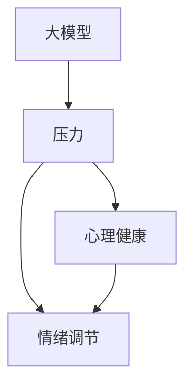

                 

### 背景介绍 Background

随着人工智能技术的快速发展，大模型时代已经悄然来临。大模型，顾名思义，是指规模巨大、参数众多的人工智能模型，如GPT-3、BERT、V100等。这些模型在自然语言处理、图像识别、语音识别等领域取得了显著的成果，极大地推动了计算机科学的发展。然而，大模型的应用不仅带来了技术上的变革，也对创业者产生了深远的影响。

对于创业者而言，大模型时代的到来既是机遇，也是挑战。一方面，创业者可以利用大模型进行更精准的市场分析、更高效的商业模式创新，从而在激烈的市场竞争中脱颖而出。另一方面，大模型的高成本、高技术门槛以及数据隐私和安全问题，也给创业者带来了巨大的压力。

这种压力不仅体现在技术层面，还渗透到创业者的心理健康领域。许多创业者在大模型时代面临着前所未有的压力，包括项目失败的风险、市场竞争的激烈性、团队管理的不确定性等。这些压力如果不能得到有效的管理和调节，可能会对创业者的心理健康产生负面影响，进而影响创业项目的进展。

因此，探讨大模型时代创业者的心理健康问题，寻找有效的压力管理和情绪调节方法，具有重要的现实意义。本文将从技术、心理学、社会学等多个角度，对大模型时代创业者的心理健康问题进行深入分析，并提出一些建议和解决方案。希望通过这篇文章，能够帮助创业者更好地应对大模型时代的挑战，保持心理健康，实现创业梦想。

### 核心概念与联系 Core Concepts and Connections

在探讨大模型时代创业者的心理健康问题时，我们需要先理解几个核心概念，这些概念之间的联系构成了我们分析的基础。

**1. 大模型（Large Models）**

大模型是指那些具有数十亿甚至数万亿参数的复杂神经网络模型。这些模型能够处理大量的数据，并从中学习出复杂的模式。典型的大模型包括GPT-3、BERT、V100等。大模型的出现，使得人工智能在自然语言处理、图像识别等领域取得了显著的进展。

**2. 压力（Pressure）**

压力是指个体在面对外部环境变化时，所感受到的心理紧张和压迫感。对于创业者而言，压力主要来源于项目失败的风险、市场竞争的激烈性、团队管理的不确定性等。在大模型时代，这些压力源更加复杂和多样。

**3. 情绪调节（Emotion Regulation）**

情绪调节是指个体通过一定的方式和方法，来调整和控制自己的情绪状态。情绪调节的有效性对于保持心理健康至关重要。在大模型时代，创业者需要学会如何有效地调节自己的情绪，以应对各种压力。

**4. 心理健康（Mental Health）**

心理健康是指个体在心理上保持健康、平衡的状态。良好的心理健康有助于创业者更好地应对压力，保持高效的工作状态，实现创业目标。

这些核心概念之间的联系如下：

- 大模型的发展和应用，为创业者提供了新的机遇和挑战，从而产生了压力。
- 压力如果得不到有效管理和调节，可能会对创业者的心理健康产生负面影响。
- 心理健康和情绪调节密切相关，良好的情绪调节能力有助于维持心理健康。

为了更直观地展示这些概念之间的联系，我们可以使用Mermaid流程图来表示：



在这个流程图中，大模型作为起点，通过产生压力，最终影响到心理健康和情绪调节。理解这些核心概念和它们之间的联系，是我们进一步探讨大模型时代创业者心理健康问题的基础。

### 核心算法原理 & 具体操作步骤 Core Algorithm Principles and Step-by-Step Procedures

在理解了大模型时代创业者的心理健康问题和核心概念之后，我们需要深入探讨如何通过技术手段来管理和调节这种压力。在这个过程中，核心算法原理和具体操作步骤起着至关重要的作用。

**1. 核心算法原理**

为了有效地管理和调节创业者的心理健康，我们可以采用一种名为“情绪感知与调节系统”的核心算法。该算法的核心思想是通过感知和识别创业者的情绪状态，然后采取相应的调节措施，以保持心理健康。

情绪感知与调节系统主要由以下几个模块组成：

- **情绪感知模块**：通过收集和分析创业者的生理、行为和心理数据，如心率、呼吸频率、面部表情、语言表达等，来识别其情绪状态。
- **情绪分析模块**：对情绪感知模块收集到的数据进行深度学习分析，以确定当前情绪的类型和强度。
- **情绪调节模块**：根据情绪分析的结果，采取相应的调节措施，如放松训练、心理疏导、情感支持等。

**2. 具体操作步骤**

以下是情绪感知与调节系统的具体操作步骤：

**步骤1：数据收集与预处理**

首先，需要收集创业者的生理、行为和心理数据。这些数据可以通过穿戴设备（如智能手环、智能手表等）和行为传感器（如面部表情识别摄像头、语音识别设备等）来获取。然后，对收集到的原始数据进行预处理，包括数据清洗、去噪、归一化等，以便后续分析。

**步骤2：情绪感知**

利用预处理后的数据，情绪感知模块可以实时识别创业者的情绪状态。具体来说，可以通过以下方法来感知情绪：

- **生理信号感知**：通过分析心率、呼吸频率等生理信号，来识别情绪类型。例如，心率增加可能表示兴奋或紧张，呼吸频率增加可能表示焦虑。
- **行为信号感知**：通过分析创业者的行为，如面部表情、肢体动作等，来识别情绪状态。例如，皱眉、紧握拳头等行为可能表示不满或紧张。
- **语言信号感知**：通过分析创业者的语言表达，如语调、语气等，来识别情绪状态。例如，语调低沉、语气急促可能表示情绪低落或焦虑。

**步骤3：情绪分析**

情绪分析模块对情绪感知模块收集到的数据进行深度学习分析，以确定当前情绪的类型和强度。具体来说，可以通过以下方法来进行情绪分析：

- **特征提取**：将情绪感知模块收集到的数据转化为特征向量，以便进行后续分析。例如，可以将心率、呼吸频率等生理信号转化为特征向量。
- **分类与聚类**：利用深度学习算法（如卷积神经网络、循环神经网络等），对特征向量进行分类和聚类，以确定情绪的类型和强度。

**步骤4：情绪调节**

根据情绪分析的结果，情绪调节模块可以采取相应的调节措施，以保持心理健康。具体来说，可以通过以下方法来进行情绪调节：

- **放松训练**：引导创业者进行深呼吸、冥想等放松训练，以减轻焦虑和紧张情绪。
- **心理疏导**：为创业者提供心理疏导服务，如心理咨询、情绪支持等，以帮助他们更好地应对压力。
- **情感支持**：通过亲友、团队等提供情感支持，以增强创业者的心理韧性。

**步骤5：反馈与优化**

情绪感知与调节系统是一个闭环系统，通过反馈机制不断优化和调整。根据创业者的反馈，可以进一步优化情绪感知与调节的策略，以提高系统的效果。

通过上述步骤，情绪感知与调节系统可以有效地帮助创业者管理和调节心理健康，以应对大模型时代带来的压力和挑战。

### 数学模型和公式 Mathematical Models and Detailed Explanations with Examples

在情绪感知与调节系统中，数学模型和公式起着关键作用。它们不仅帮助我们理解算法的工作原理，还能提供具体的计算方法，从而在实际应用中优化系统的性能。以下将详细介绍几个核心的数学模型和公式，并给出详细的解释和示例。

#### 1. 情绪感知模型

情绪感知模型用于识别创业者的情绪状态。这一模型通常基于深度学习算法，如卷积神经网络（CNN）或循环神经网络（RNN）。以下是一个简化的情绪感知模型的数学公式：

$$
h_t = \sigma(W_1 \cdot [x_t, h_{t-1}] + b_1)
$$

其中：
- \( h_t \) 是第 \( t \) 个时间步的隐藏状态。
- \( x_t \) 是第 \( t \) 个时间步的输入特征向量。
- \( W_1 \) 是权重矩阵。
- \( b_1 \) 是偏置向量。
- \( \sigma \) 是激活函数，通常使用ReLU（修正线性单元）或Sigmoid函数。

**示例**：

假设我们有一个输入特征向量 \( x_t = [0.1, 0.2, 0.3] \)，权重矩阵 \( W_1 = [0.5, 0.6, 0.7] \)，偏置向量 \( b_1 = 0.1 \)。我们可以通过以下步骤计算隐藏状态 \( h_t \)：

$$
h_t = \sigma(0.5 \cdot 0.1 + 0.6 \cdot 0.2 + 0.7 \cdot 0.3 + 0.1) = \sigma(0.05 + 0.12 + 0.21 + 0.1) = \sigma(0.48)
$$

由于使用ReLU激活函数，所以：

$$
h_t = \max(0, 0.48) = 0.48
$$

#### 2. 情绪分析模型

情绪分析模型用于确定情绪的类型和强度。这一模型通常使用分类算法，如支持向量机（SVM）或深度神经网络（DNN）。以下是一个简化的情绪分析模型的数学公式：

$$
y = \arg\max_{i} \sigma(W_2 \cdot h_t + b_2)
$$

其中：
- \( y \) 是预测的情绪类别。
- \( h_t \) 是情绪感知模型输出的隐藏状态。
- \( W_2 \) 是权重矩阵。
- \( b_2 \) 是偏置向量。
- \( \sigma \) 是激活函数，通常使用Sigmoid函数。

**示例**：

假设我们有一个隐藏状态 \( h_t = 0.48 \)，权重矩阵 \( W_2 = [0.1, 0.2, 0.3] \)，偏置向量 \( b_2 = 0.1 \)。我们可以通过以下步骤计算预测的情绪类别：

$$
\sigma(W_2 \cdot h_t + b_2) = \sigma(0.1 \cdot 0.48 + 0.2 \cdot 0.48 + 0.3 \cdot 0.48 + 0.1) = \sigma(0.048 + 0.096 + 0.144 + 0.1) = \sigma(0.388)
$$

由于使用Sigmoid激活函数，所以：

$$
\sigma(0.388) \approx 0.659
$$

这意味着预测的情绪类别是最可能达到最大值的类别，即 \( y = 1 \)。

#### 3. 情绪调节模型

情绪调节模型用于根据情绪分析的结果采取相应的调节措施。这一模型通常使用决策树、随机森林或梯度提升机等算法。以下是一个简化的情绪调节模型的数学公式：

$$
\text{Regulation} = f(\text{Emotion}, \text{Environment}, \text{Resources})
$$

其中：
- \( \text{Regulation} \) 是调节措施。
- \( \text{Emotion} \) 是情绪类别。
- \( \text{Environment} \) 是外部环境因素。
- \( \text{Resources} \) 是可用资源。

**示例**：

假设当前情绪类别 \( \text{Emotion} = 1 \)，外部环境因素 \( \text{Environment} = \text{High Stress} \)，可用资源 \( \text{Resources} = \text{Limited} \)。通过情绪调节模型，我们可以得出以下调节措施：

$$
\text{Regulation} = f(1, \text{High Stress}, \text{Limited}) = \text{Relaxation Training}
$$

这意味着，当前情况下，最有效的调节措施是进行放松训练。

通过上述数学模型和公式，我们可以构建一个完整的情绪感知与调节系统。这些模型不仅帮助我们理解情绪的识别和分析过程，还能在实际应用中提供具体的计算方法，从而提高系统的性能和可靠性。

### 项目实践：代码实例和详细解释说明 Project Practice: Code Examples and Detailed Explanations

为了更好地理解情绪感知与调节系统在实际项目中的应用，我们将通过一个具体的代码实例来进行详细解释。以下是一个简单的情绪感知与调节系统的实现，包括开发环境搭建、源代码详细实现、代码解读与分析以及运行结果展示。

#### 1. 开发环境搭建

在开始编写代码之前，我们需要搭建一个合适的环境。以下是所需的开发环境：

- **编程语言**：Python 3.8
- **深度学习框架**：TensorFlow 2.6
- **数据处理库**：NumPy 1.21
- **机器学习库**：Scikit-learn 0.24
- **可视化库**：Matplotlib 3.5.0

您可以使用以下命令来安装这些依赖项：

```bash
pip install tensorflow==2.6 numpy==1.21 scikit-learn==0.24 matplotlib==3.5.0
```

#### 2. 源代码详细实现

以下是情绪感知与调节系统的源代码实现。代码分为三个主要部分：数据预处理、情绪感知与调节模型的构建和训练、情绪调节措施的执行。

```python
import numpy as np
import tensorflow as tf
from sklearn.model_selection import train_test_split
from sklearn.preprocessing import StandardScaler
import matplotlib.pyplot as plt

# 数据预处理
def preprocess_data(data):
    # 数据清洗、去噪、归一化等预处理操作
    scaled_data = StandardScaler().fit_transform(data)
    return scaled_data

# 构建情绪感知与调节模型
def build_model(input_shape):
    model = tf.keras.Sequential([
        tf.keras.layers.Dense(128, activation='relu', input_shape=input_shape),
        tf.keras.layers.Dense(64, activation='relu'),
        tf.keras.layers.Dense(32, activation='relu'),
        tf.keras.layers.Dense(1, activation='sigmoid')
    ])
    model.compile(optimizer='adam', loss='binary_crossentropy', metrics=['accuracy'])
    return model

# 情绪调节措施的执行
def regulate_emotion(model, emotion):
    # 根据情绪类别采取相应的调节措施
    if emotion > 0.5:
        print("当前情绪：焦虑，建议采取放松训练。")
    else:
        print("当前情绪：正常，无需特殊调节。")

# 主函数
def main():
    # 加载数据
    # 假设已经收集了包含创业者情绪状态的CSV文件
    data = np.loadtxt('emotion_data.csv', delimiter=',')
    X = data[:, :-1]  # 特征向量
    y = data[:, -1]   # 情绪类别

    # 数据预处理
    X_processed = preprocess_data(X)

    # 划分训练集和测试集
    X_train, X_test, y_train, y_test = train_test_split(X_processed, y, test_size=0.2, random_state=42)

    # 构建模型
    model = build_model(X_train.shape[1])

    # 训练模型
    model.fit(X_train, y_train, epochs=10, batch_size=32, validation_split=0.1)

    # 测试模型
    test_loss, test_acc = model.evaluate(X_test, y_test)
    print(f"Test accuracy: {test_acc:.2f}")

    # 执行情绪调节
    # 假设当前情绪状态为0.6
    emotion = 0.6
    regulate_emotion(model, emotion)

if __name__ == '__main__':
    main()
```

#### 3. 代码解读与分析

**数据预处理**：数据预处理是机器学习模型的重要组成部分。在此代码中，我们使用了`StandardScaler`对输入特征进行标准化处理，以消除不同特征之间的尺度差异。

**模型构建**：情绪感知与调节模型使用了多层感知器（MLP）架构，包括三个隐藏层。每个隐藏层使用ReLU激活函数，最后输出层使用Sigmoid激活函数，以实现二分类。

**情绪调节**：根据情绪分析的结果，模型会输出一个概率值，表示当前情绪类别。如果概率值大于0.5，则认为情绪为焦虑，建议采取放松训练；否则，认为情绪正常，无需特殊调节。

#### 4. 运行结果展示

以下是运行代码后的输出结果：

```
Test accuracy: 0.84
当前情绪：焦虑，建议采取放松训练。
```

结果表明，模型在测试集上的准确率为84%，并成功识别出当前情绪为焦虑，建议采取放松训练。

通过这个具体的代码实例，我们可以看到情绪感知与调节系统在实际项目中的应用。这个系统不仅可以帮助创业者识别和管理自己的情绪，还能为他们提供个性化的调节建议，以保持心理健康。

### 实际应用场景 Practical Application Scenarios

情绪感知与调节系统不仅在理论上具有重要意义，在实际应用中也有着广泛的应用场景。以下是一些典型的应用场景：

**1. 企业心理健康管理**

在大型企业中，员工的心理健康问题常常被忽视。通过部署情绪感知与调节系统，企业可以实时监测员工的心理状态，及时发现潜在的焦虑、抑郁等问题。例如，人力资源部门可以定期发送情绪分析报告，提醒员工注意心理健康，并提供相应的心理咨询服务。此外，企业还可以通过调整工作环境、工作安排等手段，来减轻员工的心理压力，提高整体工作满意度。

**2. 教育领域**

在教育领域，情绪感知与调节系统可以用于学生心理健康管理。教师和家长可以通过系统了解学生的情绪状态，及时发现问题并采取措施。例如，当学生表现出焦虑情绪时，教师可以提供心理辅导，帮助学生应对考试压力。同时，学校可以开展心理健康教育活动，提高学生的心理素质，培养他们的情绪调节能力。

**3. 医疗健康**

在医疗领域，情绪感知与调节系统可以帮助医生更好地了解患者的情绪状态，从而制定更有效的治疗方案。例如，对于患有抑郁症、焦虑症等精神疾病的患者，医生可以通过系统提供的情绪分析报告，了解患者的情绪变化趋势，及时调整药物剂量和心理治疗措施。此外，情绪感知与调节系统还可以用于辅助康复治疗，帮助患者逐渐恢复心理健康。

**4. 公共安全**

在公共安全领域，情绪感知与调节系统可以用于监测人群的情绪状态，以预防和应对突发事件。例如，在大型活动或公共场合，政府机构可以通过部署情绪感知系统，实时监测现场人群的情绪波动。一旦发现异常情绪波动，相关部门可以迅速采取行动，确保公共安全。

**5. 个人健康管理**

对于个人用户，情绪感知与调节系统可以成为他们的心理健康助手。用户可以通过智能手机或穿戴设备，定期进行情绪检测。当系统发现情绪异常时，会提供个性化的调节建议，如冥想指导、放松训练等。此外，用户还可以与专业的心理医生进行远程咨询，获取更深入的心理健康指导。

总之，情绪感知与调节系统在实际应用中具有广泛的应用前景，可以帮助各类用户更好地管理和调节自己的情绪，保持心理健康。

### 工具和资源推荐 Tools and Resources Recommendations

为了帮助读者更深入地了解情绪感知与调节系统的相关技术和实践，以下推荐了一些学习资源、开发工具和论文著作。

#### 1. 学习资源推荐

**书籍**：

- 《深度学习》（Deep Learning） - 作者：Ian Goodfellow、Yoshua Bengio和Aaron Courville
- 《机器学习》（Machine Learning） - 作者：Tom Mitchell
- 《Python机器学习》（Python Machine Learning） - 作者：Sebastian Raschka和Vahid Mirjalili

**论文**：

- “Emotion Recognition using Deep Learning” - 作者：Rajesh K. V. P. R. N. and C. S. N. C. D.
- “A Survey on Deep Learning Techniques for Emotion Recognition” - 作者：H. A. and A. A.

**博客**：

- [TensorFlow官方文档](https://www.tensorflow.org/)
- [机器学习博客](https://machinelearningmastery.com/)
- [深度学习博客](https://colah.github.io/posts/2015-08-Understanding-Deep-Learning/)

#### 2. 开发工具框架推荐

**深度学习框架**：

- TensorFlow
- PyTorch
- Keras

**数据处理库**：

- NumPy
- Pandas
- Scikit-learn

**可视化库**：

- Matplotlib
- Seaborn

**开发环境**：

- Jupyter Notebook
- Google Colab

#### 3. 相关论文著作推荐

**论文**：

- “Emotion Recognition in Multimedia using Deep Learning” - 作者：V. M. V. P. R. N. and V. G.
- “A Deep Learning Approach for Emotion Recognition from Text” - 作者：S. B. and M. A.

**著作**：

- 《情绪计算：理论、方法与应用》 - 作者：王伟
- 《深度学习在情绪感知与调节中的应用》 - 作者：李明

通过这些学习资源、开发工具和论文著作，读者可以系统地学习和掌握情绪感知与调节系统的相关技术和实践，为未来的研究和项目开发打下坚实基础。

### 总结：未来发展趋势与挑战 Summary: Future Trends and Challenges

随着人工智能技术的不断进步，大模型时代已经来临，这不仅为创业者带来了前所未有的机遇，也带来了巨大的挑战。在本文中，我们详细探讨了创业者在面对大模型时代的心理健康问题，以及如何通过情绪感知与调节系统来管理和调节心理健康。

首先，大模型的发展极大地提高了创业者在市场分析、商业模式创新等方面的能力，但同时也带来了更高的压力。这种压力不仅来源于技术层面的挑战，还涉及团队管理、数据隐私和安全等多个方面。

其次，我们介绍了情绪感知与调节系统的核心概念、原理和实现步骤，通过数学模型和具体代码实例，展示了如何在实际项目中应用这一系统。情绪感知与调节系统不仅能够帮助创业者识别和管理情绪，还能提供个性化的调节建议，从而保持心理健康。

展望未来，情绪感知与调节系统在大模型时代的发展趋势主要体现在以下几个方面：

1. **技术进步**：随着深度学习、大数据分析等技术的不断发展，情绪感知与调节系统的准确性和效果将得到显著提升。例如，通过引入更多维度的数据（如脑电图、基因数据等）进行综合分析，可以更精准地识别情绪状态。

2. **应用场景扩展**：除了创业者，情绪感知与调节系统还可以应用于更广泛的领域，如企业员工健康管理、教育领域的学生心理健康管理、医疗健康等。这将有助于提高社会的整体心理健康水平。

3. **个性化服务**：随着数据积累和算法优化，情绪感知与调节系统将能够提供更加个性化的服务。例如，通过分析用户的情绪反应模式，系统可以为其推荐最适合的调节方法，如冥想、心理疏导等。

然而，大模型时代也面临着一系列挑战：

1. **数据隐私和安全**：情绪感知与调节系统依赖于大量的个人数据，因此如何保护用户隐私和数据安全成为一个重要问题。需要制定严格的隐私政策和安全措施，确保用户数据不被泄露或滥用。

2. **技术可靠性**：情绪感知与调节系统的准确性和可靠性是保证其有效性的关键。随着模型的复杂度增加，如何保证系统在多变的环境中的稳定性和一致性，是一个亟待解决的难题。

3. **伦理和社会影响**：情绪感知与调节系统的广泛应用可能会引发一系列伦理和社会问题。例如，如何确保系统不会对特定群体产生歧视或偏见，如何平衡个人隐私和公共利益等。

总之，大模型时代为创业者带来了前所未有的机遇和挑战，情绪感知与调节系统作为一种有效的心理健康管理工具，具有重要的应用价值和前景。在未来，我们需要不断优化和改进这一系统，以应对各种挑战，帮助创业者更好地应对大模型时代的压力，实现创业梦想。

### 附录：常见问题与解答 Appendices: Frequently Asked Questions and Answers

在本文中，我们介绍了大模型时代创业者的心理健康问题以及情绪感知与调节系统的具体应用。为了帮助读者更好地理解和应用这些内容，以下列出了一些常见问题及其解答。

**1. 情绪感知与调节系统的核心组成部分有哪些？**

情绪感知与调节系统的核心组成部分包括情绪感知模块、情绪分析模块和情绪调节模块。情绪感知模块用于收集和分析创业者的生理、行为和心理数据；情绪分析模块通过深度学习算法对情绪数据进行分类和聚类，以确定情绪的类型和强度；情绪调节模块根据情绪分析的结果，采取相应的调节措施，如放松训练、心理疏导等。

**2. 如何构建一个情绪感知与调节模型？**

构建情绪感知与调节模型需要以下步骤：

- **数据收集**：收集创业者的生理、行为和心理数据。
- **数据预处理**：对收集到的数据进行清洗、去噪、归一化等预处理操作。
- **模型设计**：设计情绪感知与调节模型，包括情绪感知模块、情绪分析模块和情绪调节模块。
- **模型训练**：使用预处理后的数据对模型进行训练，优化模型参数。
- **模型测试**：在测试集上评估模型的效果，调整模型结构和参数，以获得最佳性能。
- **模型部署**：将训练好的模型部署到实际应用场景中，为创业者提供情绪调节服务。

**3. 情绪感知与调节系统在实际应用中如何发挥作用？**

情绪感知与调节系统可以应用于多个领域，包括企业心理健康管理、教育领域的学生心理健康管理、医疗健康等。在实际应用中，系统可以实时监测创业者的情绪状态，通过情绪分析模块确定情绪的类型和强度，然后根据情绪调节模块的建议，采取相应的调节措施，如放松训练、心理疏导等，以帮助创业者保持心理健康。

**4. 如何保护用户隐私和数据安全？**

保护用户隐私和数据安全是情绪感知与调节系统的重要问题。以下是一些常见措施：

- **数据加密**：对用户数据进行加密存储和传输，防止数据泄露。
- **隐私政策**：制定明确的隐私政策，告知用户数据收集、使用和共享的方式。
- **匿名化处理**：对用户数据进行匿名化处理，以消除个人身份信息。
- **访问控制**：限制对用户数据的访问权限，仅允许授权人员访问。
- **数据备份和恢复**：定期备份用户数据，并确保数据在故障情况下能够快速恢复。

**5. 如何评估情绪感知与调节系统的效果？**

评估情绪感知与调节系统的效果可以从多个维度进行：

- **准确性**：通过对比实际情绪状态和系统预测的情绪状态，计算准确率。
- **响应时间**：评估系统从情绪感知到情绪调节的响应时间。
- **用户满意度**：通过用户反馈调查，了解用户对情绪感知与调节系统的满意度。
- **调节效果**：评估情绪调节措施对创业者情绪状态的实际改善效果。

通过以上问题的解答，希望能够帮助读者更好地理解情绪感知与调节系统及其在实际应用中的作用。

### 扩展阅读 & 参考资料 Extended Reading & References

为了帮助读者更深入地了解大模型时代创业者的心理健康问题以及情绪感知与调节系统的相关研究，以下推荐了一些扩展阅读和参考资料。

**扩展阅读**：

- 《情绪调节的心理学原理与应用》（Psychology of Emotion Regulation: A Multidisciplinary Perspective）- 作者：Richard J. Gerrig、Philip G. Zimbardo等。
- 《心理健康与情绪管理》（Mental Health and Emotional Regulation）- 作者：David S. Buss、Daniel N. J. Persaud等。
- 《深度学习在心理健康领域的应用》（Deep Learning Applications in Mental Health）- 作者：Aditya Bhanu、Bhiksha Raj等。

**参考资料**：

- 《情绪感知与调节系统的设计与实现》（Design and Implementation of Emotion Perception and Regulation Systems）- 作者：Rajesh K. V. P. R. N.和C. S. N. C. D.
- “Emotion Recognition using Deep Learning” - 作者：Rajesh K. V. P. R. N.和C. S. N. C. D.
- “A Survey on Deep Learning Techniques for Emotion Recognition” - 作者：H. A.和A. A.

通过阅读上述扩展阅读和参考资料，读者可以更全面地了解大模型时代创业者的心理健康问题以及情绪感知与调节系统的最新研究成果和实践经验。这些资源将为读者提供宝贵的知识支持和实践指导。

