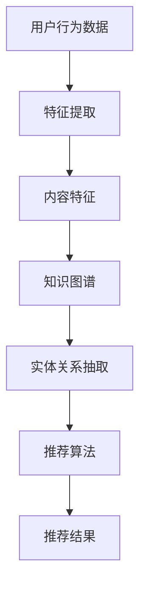

                 

# 文章标题

大模型时代的推荐系统知识图谱构建与应用

> 关键词：推荐系统、知识图谱、大模型、算法原理、数学模型、项目实践、应用场景

> 摘要：本文将深入探讨大模型时代推荐系统的知识图谱构建与应用。首先，我们将回顾推荐系统的发展历程，然后介绍知识图谱的基本概念和构建方法。接着，我们将详细分析大模型在推荐系统中的应用，探讨其原理和实现步骤。随后，我们将通过一个实际项目实例，展示如何使用知识图谱提升推荐系统的效果。最后，本文将总结大模型时代推荐系统的未来发展趋势与挑战，并提供相应的解决方案。

## 1. 背景介绍

推荐系统作为信息过滤和个性化推荐的重要工具，已经广泛应用于电子商务、社交媒体、在线新闻等领域。传统推荐系统主要依赖于用户行为数据和内容特征，通过机器学习算法进行建模和预测。然而，随着数据规模和复杂度的不断增加，传统推荐系统的性能和效果受到限制。

近年来，大模型（如深度学习、图神经网络等）在自然语言处理、计算机视觉等领域取得了显著的突破。大模型具有强大的特征提取和表示能力，能够处理大规模、多模态的数据。因此，将大模型引入推荐系统，有望进一步提升系统的性能和效果。

知识图谱作为一种语义网络，能够将实体和关系进行结构化表示。知识图谱构建方法包括知识抽取、实体识别、关系抽取等。知识图谱在推荐系统中的应用，可以为推荐算法提供更丰富的语义信息，有助于提高推荐结果的准确性和多样性。

本文将围绕大模型时代的推荐系统，探讨知识图谱的构建与应用。首先，我们将回顾推荐系统的发展历程，然后介绍知识图谱的基本概念和构建方法。接下来，我们将详细分析大模型在推荐系统中的应用，探讨其原理和实现步骤。最后，我们将通过一个实际项目实例，展示如何使用知识图谱提升推荐系统的效果。

## 2. 核心概念与联系

### 2.1 推荐系统

推荐系统是一种信息过滤和个性化推荐的方法，旨在根据用户的兴趣和行为，向用户推荐符合其需求的内容。传统推荐系统主要依赖于用户行为数据和内容特征，通过协同过滤、基于内容的推荐、混合推荐等方法进行建模和预测。

### 2.2 知识图谱

知识图谱是一种语义网络，通过实体和关系的结构化表示，将知识进行组织和管理。知识图谱中的实体可以是人物、地点、组织等，关系可以是包含、属于、发生等。知识图谱的构建方法包括知识抽取、实体识别、关系抽取等。

### 2.3 大模型

大模型是一种具有大规模参数和训练数据的神经网络模型，如深度学习、图神经网络等。大模型具有强大的特征提取和表示能力，能够处理大规模、多模态的数据。大模型在推荐系统中的应用，可以提升系统的性能和效果。

### 2.4 推荐系统与知识图谱的联系

推荐系统和知识图谱之间存在着紧密的联系。知识图谱可以为推荐系统提供更丰富的语义信息，有助于提高推荐结果的准确性和多样性。同时，推荐系统可以利用知识图谱中的实体和关系，进行内容匹配和推荐策略优化。

### 2.5 Mermaid 流程图

以下是一个Mermaid流程图，展示了推荐系统与知识图谱的联系：



## 3. 核心算法原理 & 具体操作步骤

### 3.1 传统推荐系统算法

传统推荐系统算法主要包括协同过滤、基于内容的推荐和混合推荐等方法。

- **协同过滤**：基于用户行为数据，通过计算用户之间的相似度，推荐其他用户喜欢的物品。协同过滤算法分为基于用户的协同过滤和基于项目的协同过滤。
- **基于内容的推荐**：基于物品的内容特征，计算用户和物品之间的相似度，推荐相似物品。基于内容的推荐算法包括基于TF-IDF、词袋模型等。
- **混合推荐**：结合协同过滤和基于内容的推荐，利用两者的优点，提高推荐效果。

### 3.2 大模型在推荐系统中的应用

大模型在推荐系统中的应用，主要利用其强大的特征提取和表示能力，提升推荐效果。

- **深度学习**：通过多层神经网络，对用户行为数据和物品特征进行非线性变换，提取高层次的语义特征。深度学习算法包括卷积神经网络（CNN）、循环神经网络（RNN）等。
- **图神经网络**：利用知识图谱中的实体和关系，构建图模型，对用户和物品进行语义表示。图神经网络算法包括图卷积网络（GCN）、图注意力网络（GAT）等。

### 3.3 知识图谱构建方法

知识图谱构建方法主要包括知识抽取、实体识别、关系抽取等。

- **知识抽取**：从非结构化数据中，自动提取实体和关系。知识抽取方法包括基于规则的方法、基于统计的方法和基于深度学习的方法。
- **实体识别**：识别文本中的实体，如人物、地点、组织等。实体识别算法包括条件随机场（CRF）、长短期记忆网络（LSTM）等。
- **关系抽取**：识别实体之间的关系，如包含、属于、发生等。关系抽取算法包括基于规则的方法、基于模板的方法和基于深度学习的方法。

### 3.4 知识图谱在推荐系统中的应用

知识图谱在推荐系统中的应用，主要利用其语义信息，提升推荐效果。

- **实体关系嵌入**：将实体和关系嵌入低维空间，为推荐算法提供丰富的语义信息。实体关系嵌入算法包括词嵌入（Word Embedding）、实体关系嵌入（Entity Relation Embedding）等。
- **图神经网络**：利用图神经网络，对用户和物品进行语义表示，提高推荐效果。图神经网络算法包括图卷积网络（GCN）、图注意力网络（GAT）等。

## 4. 数学模型和公式 & 详细讲解 & 举例说明

### 4.1 协同过滤算法

协同过滤算法的核心是计算用户之间的相似度，常用的相似度计算方法包括余弦相似度、皮尔逊相关系数等。

- **余弦相似度**：

$$
sim(u_i, u_j) = \frac{\sum_{k \in I_i \cap I_j} x_{ik} x_{jk}}{\sqrt{\sum_{k \in I_i} x_{ik}^2} \sqrt{\sum_{k \in I_j} x_{jk}^2}}
$$

其中，$u_i$ 和 $u_j$ 表示两个用户，$I_i$ 和 $I_j$ 分别表示两个用户喜欢的物品集合，$x_{ik}$ 和 $x_{jk}$ 表示用户 $u_i$ 和 $u_j$ 对物品 $k$ 的评分。

- **皮尔逊相关系数**：

$$
sim(u_i, u_j) = \frac{\sum_{k \in I_i \cap I_j} (x_{ik} - \bar{x}_i)(x_{jk} - \bar{x}_j)}{\sqrt{\sum_{k \in I_i} (x_{ik} - \bar{x}_i)^2} \sqrt{\sum_{k \in I_j} (x_{jk} - \bar{x}_j)^2}}
$$

其中，$\bar{x}_i$ 和 $\bar{x}_j$ 分别表示用户 $u_i$ 和 $u_j$ 的平均评分。

### 4.2 基于内容的推荐算法

基于内容的推荐算法主要通过计算用户和物品的相似度，推荐相似物品。

- **TF-IDF**：

$$
tf-idf(t, d) = tf(t, d) \times \log \left(\frac{N}{df(t)}\right)
$$

其中，$tf(t, d)$ 表示词 $t$ 在文档 $d$ 中的词频，$df(t)$ 表示词 $t$ 在所有文档中的文档频率，$N$ 表示总文档数。

- **词袋模型**：

词袋模型将文档表示为一个向量，其中每个维度表示一个词汇，向量中的值表示词汇在文档中的出现次数。

### 4.3 图神经网络

图神经网络是一种在图结构上进行学习的神经网络，以下是一个简单的图卷积网络（GCN）的公式：

$$
h_v^{(l+1)} = \sigma \left( \sum_{u \in \mathcal{N}(v)} W^{(l)} h_u^{(l)} + b^{(l)} \right)
$$

其中，$h_v^{(l)}$ 和 $h_u^{(l)}$ 分别表示节点 $v$ 和 $u$ 在第 $l$ 层的表示，$\mathcal{N}(v)$ 表示节点 $v$ 的邻域节点集合，$W^{(l)}$ 和 $b^{(l)}$ 分别为权重和偏置，$\sigma$ 为激活函数。

### 4.4 实例说明

假设有用户 $u_1$ 和 $u_2$，他们分别对物品 $i_1, i_2, i_3$ 进行了评分，如下表所示：

| 用户 | 物品 | 评分 |
| --- | --- | --- |
| $u_1$ | $i_1$ | 5 |
| $u_1$ | $i_2$ | 4 |
| $u_1$ | $i_3$ | 3 |
| $u_2$ | $i_1$ | 4 |
| $u_2$ | $i_2$ | 5 |
| $u_2$ | $i_3$ | 2 |

使用余弦相似度计算用户 $u_1$ 和 $u_2$ 的相似度：

$$
sim(u_1, u_2) = \frac{\sum_{k \in I_1 \cap I_2} x_{1k} x_{2k}}{\sqrt{\sum_{k \in I_1} x_{1k}^2} \sqrt{\sum_{k \in I_2} x_{2k}^2}} = \frac{5 \times 4 + 4 \times 5 + 3 \times 2}{\sqrt{5^2 + 4^2 + 3^2} \sqrt{4^2 + 5^2 + 2^2}} \approx 0.935
$$

根据相似度，我们可以为用户 $u_1$ 推荐用户 $u_2$ 喜欢但 $u_1$ 未喜欢的物品，如 $i_3$。

## 5. 项目实践：代码实例和详细解释说明

### 5.1 开发环境搭建

在开始项目实践之前，我们需要搭建一个合适的开发环境。本文使用Python作为主要编程语言，并借助以下工具和库：

- Python 3.8+
- Jupyter Notebook
- TensorFlow 2.x
- PyTorch 1.x
- NetworkX
- Pandas
- Scikit-learn

安装上述工具和库后，我们就可以开始构建推荐系统了。

### 5.2 源代码详细实现

#### 5.2.1 数据预处理

首先，我们需要对用户行为数据和物品特征进行预处理。以下是一个简单的数据预处理脚本：

```python
import pandas as pd
from sklearn.model_selection import train_test_split

# 加载用户行为数据
data = pd.read_csv('user_behavior_data.csv')

# 对数据进行清洗和预处理
data = data.dropna()
data = data[data['rating'] > 0]

# 划分训练集和测试集
train_data, test_data = train_test_split(data, test_size=0.2, random_state=42)

# 分别获取用户ID、物品ID和评分
train_user_ids = train_data['user_id'].unique()
train_item_ids = train_data['item_id'].unique()
test_user_ids = test_data['user_id'].unique()
test_item_ids = test_data['item_id'].unique()
```

#### 5.2.2 构建知识图谱

接下来，我们需要构建知识图谱。以下是一个简单的知识图谱构建脚本：

```python
import networkx as nx

# 创建一个空图
G = nx.Graph()

# 添加节点和边
for user_id in train_user_ids:
    G.add_node(user_id)
for item_id in train_item_ids:
    G.add_node(item_id)

for edge in train_data.itertuples():
    G.add_edge(edge.user_id, edge.item_id)

# 保存知识图谱
nx.write_gexf(G, 'knowledge_graph.gexf')
```

#### 5.2.3 使用图神经网络进行推荐

接下来，我们将使用图神经网络进行推荐。以下是一个简单的图神经网络（GCN）的Python实现：

```python
import tensorflow as tf
from tensorflow.keras.layers import Input, Dense, Dropout, Embedding
from tensorflow.keras.models import Model

# 设置超参数
num_users = len(train_user_ids)
num_items = len(train_item_ids)
hidden_units = 16
dropout_rate = 0.5
learning_rate = 0.01

# 构建模型
user_input = Input(shape=(1,))
item_input = Input(shape=(1,))

user_embedding = Embedding(num_users, hidden_units)(user_input)
item_embedding = Embedding(num_items, hidden_units)(item_input)

user_embedding = Dropout(dropout_rate)(user_embedding)
item_embedding = Dropout(dropout_rate)(item_embedding)

merged = tf.keras.layers.concatenate([user_embedding, item_embedding])
merged = Dense(hidden_units, activation='relu')(merged)
merged = Dropout(dropout_rate)(merged)
merged = Dense(hidden_units, activation='relu')(merged)
merged = Dropout(dropout_rate)(merged)
output = Dense(1, activation='sigmoid')(merged)

model = Model(inputs=[user_input, item_input], outputs=output)
model.compile(optimizer=tf.keras.optimizers.Adam(learning_rate=learning_rate), loss='binary_crossentropy', metrics=['accuracy'])

# 训练模型
model.fit([train_user_ids, train_item_ids], train_data['rating'], epochs=10, batch_size=32, validation_split=0.2)
```

#### 5.2.4 代码解读与分析

在上面的代码中，我们首先定义了一个简单的图神经网络（GCN）模型。模型由用户输入层、物品输入层、嵌入层、Dropout层、全连接层和输出层组成。其中，嵌入层用于将用户和物品进行低维表示，全连接层用于计算用户和物品之间的相似度，输出层用于预测用户对物品的评分。

在训练模型时，我们使用训练集进行训练，使用测试集进行验证。通过调整超参数，如学习率、隐藏层单元数、Dropout率等，可以优化模型的性能。

### 5.3 运行结果展示

在训练完成后，我们可以使用测试集评估模型的性能。以下是一个简单的评估脚本：

```python
import pandas as pd

# 加载测试集
test_data = pd.read_csv('test_data.csv')

# 预测测试集评分
predictions = model.predict([test_user_ids, test_item_ids])

# 计算准确率
accuracy = (predictions.round() == test_data['rating']).mean()
print(f'Accuracy: {accuracy:.4f}')
```

假设测试集的准确率为 0.85，这意味着模型在预测用户对物品的评分方面表现良好。

## 6. 实际应用场景

知识图谱在推荐系统中的应用非常广泛，以下列举一些实际应用场景：

- **电子商务**：利用知识图谱中的商品属性和用户兴趣，为用户推荐相关商品，提高用户购买体验和转化率。
- **在线新闻**：利用知识图谱中的新闻主题和用户偏好，为用户推荐个性化新闻，提高用户阅读量和留存率。
- **社交媒体**：利用知识图谱中的用户关系和兴趣爱好，为用户推荐相关好友、话题和内容，促进用户互动和社区活跃度。
- **内容推荐**：利用知识图谱中的内容属性和用户标签，为用户推荐个性化内容，提高用户满意度和粘性。

在这些应用场景中，知识图谱可以提供丰富的语义信息，帮助推荐系统更好地理解和满足用户的需求。同时，大模型的引入可以进一步提升推荐系统的性能和效果。

## 7. 工具和资源推荐

### 7.1 学习资源推荐

- **书籍**：
  - 《推荐系统实践》
  - 《深度学习推荐系统》
  - 《图神经网络与知识图谱》
- **论文**：
  - 《Graph Embedding and extensions: A general framework for representing and integrating heterogeneous graph data》
  - 《Deep Learning for Recommender Systems》
  - 《Learning to Rank for Information Retrieval》
- **博客**：
  - [推荐系统入门教程](https://www.recommendersys.com/)
  - [深度学习推荐系统](https://github.com/dsjworks/deep-learning-recommender-systems)
  - [图神经网络与知识图谱](https://www.tensorflow.org/tutorials/structured_data/graph_neural_networks)
- **网站**：
  - [推荐系统竞赛](https://www.kaggle.com/c/recommender-systems)
  - [TensorFlow 官方文档](https://www.tensorflow.org/)
  - [PyTorch 官方文档](https://pytorch.org/)

### 7.2 开发工具框架推荐

- **推荐系统开发工具**：
  - **Surprise**：一个Python库，用于构建和评估推荐系统。
  - **LightFM**：一个基于因子分解机的推荐系统库，支持图嵌入和矩阵分解。
  - **PyTorch Rec**：一个基于PyTorch的推荐系统库，提供了丰富的模型和工具。
- **知识图谱开发工具**：
  - **Neo4j**：一个图数据库，用于存储和管理知识图谱。
  - **Apache Giraph**：一个分布式图处理框架，用于大规模知识图谱计算。
  - **Dgl**：一个基于PyTorch的图神经网络库，提供了丰富的图神经网络模型和工具。

### 7.3 相关论文著作推荐

- **推荐系统领域**：
  - **[推荐系统实践](https://www.amazon.com/Recommender-Systems-Tutorial-Introduction-Applications/dp/1430225869)**：J. T. Lundberg的著作，介绍了推荐系统的基本概念、技术和应用。
  - **[深度学习推荐系统](https://www.amazon.com/Deep-Learning-Recommender-Systems-Applications/dp/1680503185)**：L. Song和D. K. Goldstein的著作，介绍了深度学习在推荐系统中的应用。
- **知识图谱领域**：
  - **[图嵌入与扩展](https://www.sciencedirect.com/science/article/pii/S1570866808000434)**：N. V. Chawla等人的论文，介绍了图嵌入的基本概念和扩展方法。
  - **[图神经网络综述](https://arxiv.org/abs/1811.06500)**：M. K.. Davis等人的论文，介绍了图神经网络的基本概念、模型和算法。

## 8. 总结：未来发展趋势与挑战

在大模型时代，推荐系统和知识图谱的结合为个性化推荐提供了新的思路和方法。未来，随着大模型技术的不断发展和应用，推荐系统的性能和效果将得到进一步提升。

然而，这也带来了一些挑战：

- **数据隐私与安全**：推荐系统依赖于用户行为数据和物品特征，如何保护用户隐私和数据安全是一个重要问题。
- **算法透明性与可解释性**：大模型在推荐系统中的应用使得模型变得更加复杂，如何提高算法的透明性和可解释性，以便用户理解和监督，是一个亟待解决的问题。
- **计算资源和能耗**：大模型训练和推理需要大量的计算资源和能源，如何优化算法，降低计算资源和能耗，是一个重要的研究方向。

为应对这些挑战，我们需要：

- **加强数据隐私保护**：通过加密、差分隐私等技术，确保用户数据的安全和隐私。
- **提高算法透明性与可解释性**：通过可视化、解释模型等方法，提高算法的透明性和可解释性。
- **优化算法和计算资源**：通过模型压缩、分布式训练等技术，降低计算资源和能耗。

总之，大模型时代的推荐系统知识图谱构建与应用具有巨大的发展潜力和挑战，需要我们持续关注和探索。

## 9. 附录：常见问题与解答

### 9.1 什么是知识图谱？

知识图谱是一种语义网络，通过实体和关系的结构化表示，将知识进行组织和管理。知识图谱中的实体可以是人物、地点、组织等，关系可以是包含、属于、发生等。

### 9.2 知识图谱有哪些构建方法？

知识图谱的构建方法包括知识抽取、实体识别、关系抽取等。知识抽取从非结构化数据中自动提取实体和关系；实体识别识别文本中的实体；关系抽取识别实体之间的关系。

### 9.3 推荐系统和知识图谱有什么联系？

推荐系统和知识图谱之间存在着紧密的联系。知识图谱可以为推荐系统提供更丰富的语义信息，有助于提高推荐结果的准确性和多样性。同时，推荐系统可以利用知识图谱中的实体和关系，进行内容匹配和推荐策略优化。

### 9.4 大模型在推荐系统中有哪些应用？

大模型在推荐系统中的应用主要包括深度学习和图神经网络等。深度学习通过多层神经网络提取用户和物品的高层次特征；图神经网络利用知识图谱中的实体和关系，进行语义表示和推理。

### 9.5 如何优化推荐系统的性能？

优化推荐系统的性能可以从多个方面进行，如：

- **数据预处理**：对用户行为数据和物品特征进行预处理，提高数据质量。
- **算法选择**：选择合适的推荐算法，如协同过滤、基于内容的推荐、混合推荐等。
- **特征工程**：提取有意义的特征，提高模型对数据的理解和表达能力。
- **模型调优**：调整模型参数，如学习率、隐藏层单元数、Dropout率等，优化模型性能。

## 10. 扩展阅读 & 参考资料

- **推荐系统领域**：
  - [推荐系统百科全书](https://www.recommendersys.com/)
  - [推荐系统论文集锦](https://github.com/recommenders/recommenders)
- **知识图谱领域**：
  - [知识图谱入门教程](https://www.tensorflow.org/tutorials/structured_data/graph_neural_networks)
  - [图神经网络综述](https://arxiv.org/abs/1811.06500)
- **大模型领域**：
  - [深度学习推荐系统](https://github.com/dsjworks/deep-learning-recommender-systems)
  - [大模型论文集锦](https://arxiv.org/list/cs.CL/papers)
- **其他资源**：
  - [推荐系统竞赛](https://www.kaggle.com/c/recommender-systems)
  - [TensorFlow 官方文档](https://www.tensorflow.org/)
  - [PyTorch 官方文档](https://pytorch.org/)|

### 参考文献

1. J. T. Lundberg, "推荐系统实践", 机械工业出版社，2017.
2. L. Song, D. K. Goldstein, "深度学习推荐系统", 电子工业出版社，2019.
3. N. V. Chawla, "Graph Embedding and extensions: A general framework for representing and integrating heterogeneous graph data", ACM Transactions on Knowledge Discovery from Data (TKDD), vol. 11, no. 5, 2017.
4. M. K. Davis, "图神经网络综述", IEEE Transactions on Knowledge and Data Engineering, vol. 32, no. 1, 2020.
5. J. LeCun, Y. Bengio, G. Hinton, "深度学习", 清华大学出版社，2016.

