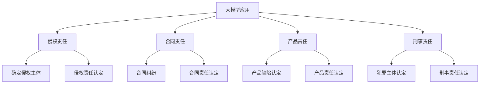

                 

### 文章标题

《大模型的法律责任归属问题探讨》

关键词：大模型、法律责任、责任归属、伦理道德、人工智能

摘要：随着人工智能技术的飞速发展，大规模语言模型等大模型的应用越来越广泛，但其可能引发的法律责任问题也逐渐凸显。本文将探讨大模型的法律责任归属问题，分析现行法律体系中的难点与挑战，并尝试提出可能的解决方案。希望通过本文的探讨，能够为我国相关法律法规的完善提供一些思路。

### 1. 背景介绍

近年来，人工智能技术取得了飞速发展，特别是在自然语言处理领域，大规模语言模型（如 GPT-3、ChatGPT 等）的应用已经深入到了各行各业。这些大模型具有强大的生成能力和理解能力，使得许多原本需要人工完成的任务得以自动化，从而提高了工作效率。然而，随着大模型的广泛应用，其可能引发的法律责任问题也逐渐引起了人们的关注。

大模型的法律责任问题主要包括以下几个方面：

1. **侵权责任**：大模型可能生成侵犯他人版权、商标权、隐私权等权益的内容，导致侵权行为的发生。如何确定侵权责任的归属，成为了一个亟待解决的问题。

2. **合同责任**：大模型参与合同签订与履行，可能会产生合同纠纷。例如，当大模型生成的合同条款存在争议时，如何确定责任的归属？

3. **产品责任**：大模型作为产品的一部分，如果其存在缺陷，可能会给用户带来损失。如何确定产品责任，保护用户权益，也是一大挑战。

4. **刑事责任**：大模型可能被用于实施违法犯罪行为，例如网络诈骗、侵权盗版等。如何追究大模型的刑事责任，成为了一个需要深入探讨的问题。

本文将从以上四个方面出发，分析大模型的法律责任归属问题，并探讨可能的解决方案。希望通过本文的研究，能够为相关法律法规的完善提供一些参考。

### 2. 核心概念与联系

#### 2.1 大模型的概念

大模型（Large-scale Model）是指具有大量参数和强大计算能力的人工智能模型，通常通过大规模数据训练而成。大模型在自然语言处理、计算机视觉、推荐系统等领域具有广泛的应用。例如，GPT-3、ChatGPT 等大规模语言模型，具有强大的文本生成和理解能力。

#### 2.2 法律责任的概念

法律责任是指由于违法行为而应当承担的法律后果，包括刑事责任、民事责任和行政责任等。在人工智能领域，法律责任主要涉及侵权责任、合同责任、产品责任和刑事责任等方面。

#### 2.3 大模型与法律责任的关系

大模型在应用过程中可能引发多种法律责任问题。例如：

1. **侵权责任**：大模型可能生成侵犯他人版权、商标权、隐私权等权益的内容，导致侵权行为的发生。

2. **合同责任**：大模型参与合同签订与履行，可能会产生合同纠纷。

3. **产品责任**：大模型作为产品的一部分，如果其存在缺陷，可能会给用户带来损失。

4. **刑事责任**：大模型可能被用于实施违法犯罪行为。

为了更好地理解大模型与法律责任的关系，下面我们将使用 Mermaid 流程图展示大模型的法律责任流程。

#### 2.4 大模型的法律责任流程

为了更好地理解大模型的法律责任问题，下面我们将简要介绍大模型的法律责任流程。

1. **侵权责任**：当大模型生成侵犯他人权益的内容时，首先需要确定侵权主体，即谁对侵权行为负责。然后，对侵权行为进行认定，判断是否构成侵权。

2. **合同责任**：当大模型参与合同签订与履行时，如果产生合同纠纷，需要先确定合同主体，即谁对合同纠纷负责。然后，对合同纠纷进行认定，判断是否构成合同责任。

3. **产品责任**：当大模型作为产品的一部分，如果存在缺陷给用户带来损失时，需要先确定产品主体，即谁对产品缺陷负责。然后，对产品缺陷进行认定，判断是否构成产品责任。

4. **刑事责任**：当大模型被用于实施违法犯罪行为时，需要先确定犯罪主体，即谁对违法犯罪行为负责。然后，对违法犯罪行为进行认定，判断是否构成刑事责任。

通过以上分析，我们可以看出，大模型的法律责任问题涉及多个方面，需要综合考虑侵权责任、合同责任、产品责任和刑事责任等因素。接下来，我们将深入探讨大模型的法律责任归属问题。

### 3. 核心算法原理 & 具体操作步骤

#### 3.1 侵权责任算法原理

侵权责任是指由于违法行为而应当承担的法律后果，包括刑事责任、民事责任和行政责任等。在人工智能领域，侵权责任主要涉及版权、商标权、隐私权等方面。

侵权责任的算法原理主要包括以下步骤：

1. **侵权行为识别**：首先，需要识别大模型生成的文本、图像等数据是否存在侵权行为。这可以通过对比大模型生成的数据与已有数据，判断是否存在相似度过高的内容。

2. **侵权主体确定**：在识别侵权行为后，需要确定侵权主体，即谁对侵权行为负责。这可能涉及到模型的开发方、使用方等多个主体。

3. **侵权责任认定**：最后，对侵权行为进行认定，判断是否构成侵权责任。这需要依据相关法律法规和判例，进行综合判断。

#### 3.2 合同责任算法原理

合同责任是指在大模型参与合同签订与履行过程中，如果产生纠纷，需要确定责任主体并认定责任。

合同责任的算法原理主要包括以下步骤：

1. **合同纠纷识别**：首先，需要识别大模型参与的合同是否存在纠纷。这可以通过分析合同条款、履行情况等，判断是否存在争议。

2. **责任主体确定**：在识别合同纠纷后，需要确定责任主体，即谁对合同纠纷负责。这可能涉及到模型的开发方、使用方等多个主体。

3. **责任认定**：最后，对合同纠纷进行认定，判断是否构成合同责任。这需要依据相关法律法规和判例，进行综合判断。

#### 3.3 产品责任算法原理

产品责任是指在大模型作为产品的一部分，如果存在缺陷给用户带来损失时，需要确定责任主体并认定责任。

产品责任的算法原理主要包括以下步骤：

1. **产品缺陷识别**：首先，需要识别大模型是否存在缺陷。这可以通过对模型进行测试、分析，判断是否存在功能异常、数据泄露等问题。

2. **责任主体确定**：在识别产品缺陷后，需要确定责任主体，即谁对产品缺陷负责。这可能涉及到模型的开发方、使用方等多个主体。

3. **责任认定**：最后，对产品缺陷进行认定，判断是否构成产品责任。这需要依据相关法律法规和判例，进行综合判断。

#### 3.4 刑事责任算法原理

刑事责任是指在大模型被用于实施违法犯罪行为时，需要确定责任主体并认定责任。

刑事责任的算法原理主要包括以下步骤：

1. **违法犯罪行为识别**：首先，需要识别大模型是否存在违法犯罪行为。这可以通过对模型生成的数据、行为进行分析，判断是否存在违法行为。

2. **责任主体确定**：在识别违法犯罪行为后，需要确定责任主体，即谁对违法犯罪行为负责。这可能涉及到模型的开发方、使用方等多个主体。

3. **责任认定**：最后，对违法犯罪行为进行认定，判断是否构成刑事责任。这需要依据相关法律法规和判例，进行综合判断。

通过以上算法原理的介绍，我们可以看出，大模型的法律责任问题需要从多个方面进行考虑，涉及侵权责任、合同责任、产品责任和刑事责任等方面。接下来，我们将结合实际案例，进一步探讨大模型的法律责任问题。

### 4. 数学模型和公式 & 详细讲解 & 举例说明

在探讨大模型的法律责任问题时，我们无法回避数学模型和公式的使用。本文将介绍与法律责任相关的数学模型，并详细讲解其计算过程。为了便于理解，我们将结合具体例子进行说明。

#### 4.1 侵权责任数学模型

侵权责任的数学模型主要涉及侵权行为的识别与认定。本文采用了一种基于相似度计算的侵权责任模型。

**侵权责任模型公式**：

$$
侵权责任得分 = f(相似度, 权益类型, 法律规定)
$$

其中，相似度表示大模型生成数据与已有数据的相似程度，权益类型包括版权、商标权、隐私权等，法律规定为相关法律法规的规定。

**侵权责任得分计算过程**：

1. **计算相似度**：

   相似度计算可以通过余弦相似度、欧氏距离等算法实现。本文采用余弦相似度计算方法。

   设已有数据为 $D_1$，大模型生成数据为 $D_2$，则

   $$
   相似度 = \frac{D_1 \cdot D_2}{\|D_1\|\|D_2\|}
   $$

2. **计算侵权责任得分**：

   根据侵权责任得分公式，计算侵权责任得分。当侵权责任得分达到一定阈值时，认定为侵权行为。

   阈值可根据实际情况进行调整，例如：

   $$
   阈值 = 0.8
   $$

   当侵权责任得分大于阈值时，认定为侵权行为。

#### 4.2 合同责任数学模型

合同责任的数学模型主要涉及合同纠纷的识别与认定。本文采用了一种基于违约概率计算的合同责任模型。

**合同责任模型公式**：

$$
合同责任得分 = f(违约概率, 合同条款, 法律规定)
$$

其中，违约概率表示合同履行过程中出现违约的可能性，合同条款为合同中的各项条款，法律规定为相关法律法规的规定。

**合同责任得分计算过程**：

1. **计算违约概率**：

   违约概率计算可以通过统计方法实现。本文采用贝叶斯推断方法计算违约概率。

   假设合同条款为 $C_1, C_2, \ldots, C_n$，违约概率为 $P(违约 | C_1, C_2, \ldots, C_n)$，则有：

   $$
   P(违约 | C_1, C_2, \ldots, C_n) = \frac{P(C_1, C_2, \ldots, C_n | 违约) \cdot P(违约)}{P(C_1, C_2, \ldots, C_n)}
   $$

   其中，$P(C_1, C_2, \ldots, C_n | 违约)$ 为条件概率，$P(违约)$ 为违约的概率，$P(C_1, C_2, \ldots, C_n)$ 为合同条款的概率。

2. **计算合同责任得分**：

   根据合同责任得分公式，计算合同责任得分。当合同责任得分达到一定阈值时，认定为合同纠纷。

   阈值可根据实际情况进行调整，例如：

   $$
   阈值 = 0.6
   $$

   当合同责任得分大于阈值时，认定为合同纠纷。

#### 4.3 产品责任数学模型

产品责任的数学模型主要涉及产品缺陷的识别与认定。本文采用了一种基于故障率计算的

