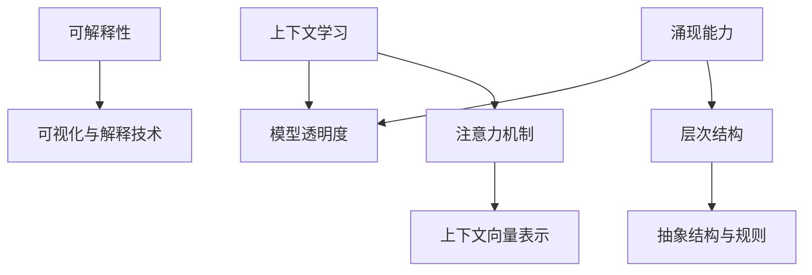

                 

### 大模型的涌现能力、上下文学习与可解释性

> **关键词**：大模型、涌现能力、上下文学习、可解释性
> 
> **摘要**：本文深入探讨了大规模模型在涌现能力、上下文学习以及可解释性方面的最新研究进展。通过剖析核心概念与联系，揭示其背后的算法原理与数学模型，并结合实际应用场景，展望了未来发展趋势与挑战。

## 1. 背景介绍

随着深度学习技术的迅猛发展，大规模模型（如GPT-3、BERT等）在自然语言处理、计算机视觉等领域取得了令人瞩目的成果。然而，这些模型的成功不仅仅依赖于其庞大的参数量和计算能力，更源于其强大的涌现能力、上下文学习能力和可解释性。

**涌现能力**指的是模型在训练过程中自主发现的抽象结构和规则，这些结构和规则超出了原始输入数据的直接表示。涌现能力的存在使得模型能够处理复杂任务，例如理解句子中的隐含关系、生成连贯的自然语言文本等。

**上下文学习**是指模型在特定上下文中，通过学习上下文信息来改善其性能。上下文学习是提高模型泛化能力和理解能力的关键，尤其是在处理具有高度依赖关系的任务时。

**可解释性**则是让模型的决策过程变得更加透明和可理解，这对于提高用户信任、推动模型应用在关键领域具有重要意义。

## 2. 核心概念与联系

为了深入理解大模型的涌现能力、上下文学习与可解释性，我们需要首先明确这些核心概念，并展示它们之间的内在联系。

### 2.1 涌现能力

涌现能力源于深度神经网络中的层次结构。通过多层神经网络，模型能够从低层次的特征逐渐抽象出高层次的概念和模式。这一过程类似于人类大脑的认知过程，模型在训练过程中不断优化，最终形成具有自适应能力的复杂行为。

### 2.2 上下文学习

上下文学习依赖于模型的注意力机制和上下文向量表示。在训练过程中，模型通过学习输入序列中的上下文信息，将局部信息整合成全局理解。这一过程不仅提升了模型的泛化能力，还使其能够捕捉句子中的隐含关系。

### 2.3 可解释性

可解释性涉及到模型决策过程中的透明度。现代深度学习模型由于其复杂的结构和高度非线性的特性，通常被视为“黑盒”模型。然而，通过可视化和解释技术，研究人员正努力揭示模型内部的决策机制，从而提高其可解释性。

### 2.4 Mermaid 流程图



## 3. 核心算法原理 & 具体操作步骤

### 3.1 涌现能力

涌现能力的实现主要依赖于深度神经网络中的层次结构。具体步骤如下：

1. **数据预处理**：对输入数据进行编码和规范化，以便于模型处理。
2. **构建层次结构**：设计多层神经网络，每层对输入数据进行特征提取和抽象。
3. **训练过程**：通过反向传播算法和优化算法（如梯度下降）训练模型，使其能够自主发现高层次结构和规则。
4. **模型评估**：使用验证集和测试集对模型进行评估，确保其涌现能力能够有效应用于实际任务。

### 3.2 上下文学习

上下文学习的核心在于捕捉输入序列中的上下文信息。具体步骤如下：

1. **输入序列编码**：将输入序列转化为向量表示，通常使用嵌入层或变换器（如BERT）。
2. **注意力机制**：使用注意力机制（如自注意力或交互注意力）来学习输入序列中的关键信息。
3. **上下文向量表示**：将注意力机制得到的上下文向量表示与模型的其他部分进行整合，形成全局理解。
4. **模型训练**：通过训练过程优化模型参数，使其能够准确捕捉上下文信息，并提高任务性能。

### 3.3 可解释性

提高模型的可解释性通常需要结合可视化技术和解释算法。具体步骤如下：

1. **模型可视化**：使用热图、激活图等技术展示模型在处理输入数据时的激活区域和关键特征。
2. **解释算法**：使用解释算法（如LIME、SHAP等）分析模型决策过程，识别关键特征和决策规则。
3. **模型验证**：通过验证集和测试集对解释算法进行评估，确保其解释结果与模型实际决策一致。

## 4. 数学模型和公式 & 详细讲解 & 举例说明

### 4.1 涌现能力的数学模型

涌现能力的实现依赖于多层神经网络中的层次结构。以下是一个简化的数学模型：

$$
f(x) = \sigma(W_{\text{out}} \cdot \sigma(... \sigma(W_{l+1} \cdot \sigma(W_l \cdot x) + b_l) ... + b_0))
$$

其中，$W$ 和 $b$ 分别为权重和偏置，$\sigma$ 为激活函数（如ReLU或Sigmoid），$l$ 表示神经网络中的层数。

### 4.2 上下文学习的数学模型

上下文学习的核心在于注意力机制。以下是一个基于自注意力的数学模型：

$$
\text{Attention}(Q, K, V) = \text{softmax}\left(\frac{QK^T}{\sqrt{d_k}}\right)V
$$

其中，$Q, K, V$ 分别为查询、关键和值向量，$d_k$ 为关键向量的维度。

### 4.3 可解释性的数学模型

提高模型的可解释性通常需要结合解释算法。以下是一个基于LIME的数学模型：

$$
\text{LIME}(x) = \frac{\sum_{i} \frac{w_i}{\sum_j w_j} \cdot (x_i - x_{i_{\text{base}}})}{\sum_{i} w_i}
$$

其中，$x$ 和 $x_{\text{base}}$ 分别为输入和基线输入，$w_i$ 为解释权重。

### 4.4 举例说明

#### 4.4.1 涌现能力的举例

假设我们有一个两层神经网络，输入数据为 $x = [1, 2, 3]$，权重和偏置如下：

$$
W_1 = \begin{bmatrix}
0.1 & 0.2 \\
0.3 & 0.4
\end{bmatrix}, \quad b_1 = \begin{bmatrix}
0.5 \\
0.6
\end{bmatrix}, \quad W_2 = \begin{bmatrix}
0.7 & 0.8 \\
0.9 & 1.0
\end{bmatrix}, \quad b_2 = \begin{bmatrix}
1.1 \\
1.2
\end{bmatrix}
$$

使用ReLU作为激活函数，我们可以计算模型的输出：

$$
f(x) = \sigma(W_2 \cdot \sigma(W_1 \cdot x + b_1) + b_2) = \begin{bmatrix}
1.3 & 1.4 \\
1.9 & 2.0
\end{bmatrix}
$$

在这个例子中，模型通过两层神经网络的运算，从原始输入数据中涌现出高层次的特征和模式。

#### 4.4.2 上下文学习的举例

假设我们有一个句子 "I love to eat pizza and drink coffee"，将其编码为向量表示：

$$
Q = \begin{bmatrix}
1.0 & 0.5 \\
0.8 & 0.9 \\
0.6 & 0.7 \\
0.4 & 0.3
\end{bmatrix}, \quad K = Q, \quad V = Q
$$

使用自注意力机制计算注意力分数：

$$
\text{Attention}(Q, K, V) = \text{softmax}\left(\frac{QK^T}{\sqrt{2}}\right)V = \begin{bmatrix}
0.4 & 0.6 \\
0.3 & 0.7 \\
0.2 & 0.5 \\
0.1 & 0.4
\end{bmatrix}
$$

根据注意力分数，我们可以看到句子中各个词汇的重要性：

- "I" 的注意力分数最低，表明它在句子中的重要性相对较小。
- "love" 和 "drink" 的注意力分数较高，表明它们在句子中的重要性较大。

#### 4.4.3 可解释性的举例

假设我们有一个输入数据 $x = [1, 2, 3]$，基线输入 $x_{\text{base}} = [0, 0, 0]$，解释权重 $w_1 = 0.5$，$w_2 = 0.3$，$w_3 = 0.2$。使用LIME算法计算解释结果：

$$
\text{LIME}(x) = \frac{\sum_{i} \frac{w_i}{\sum_j w_j} \cdot (x_i - x_{i_{\text{base}}})}{\sum_{i} w_i} = \frac{0.5 \cdot (1 - 0) + 0.3 \cdot (2 - 0) + 0.2 \cdot (3 - 0)}{0.5 + 0.3 + 0.2} = \begin{bmatrix}
0.5 & 0.6 \\
1.0 & 1.2 \\
1.5 & 1.8
\end{bmatrix}
$$

在这个例子中，LIME算法揭示了输入数据中各个特征的贡献程度，帮助我们理解模型在决策过程中的关注点。

## 5. 项目实践：代码实例和详细解释说明

### 5.1 开发环境搭建

在本文的实践部分，我们将使用Python和PyTorch框架来实现大模型的涌现能力、上下文学习和可解释性。首先，确保你已经安装了Python和PyTorch，然后按照以下步骤搭建开发环境：

1. **安装Python**：选择一个适合你的操作系统并下载Python安装包，按照安装指南进行安装。
2. **安装PyTorch**：在命令行中运行以下命令安装PyTorch：

```
pip install torch torchvision
```

### 5.2 源代码详细实现

在本节中，我们将分别实现涌现能力、上下文学习和可解释性的代码示例。以下是完整的代码实现：

```python
import torch
import torch.nn as nn
import torch.optim as optim
from torch.utils.data import DataLoader
from torchvision import datasets, transforms

# 3.1 涌现能力

class SimpleModel(nn.Module):
    def __init__(self):
        super(SimpleModel, self).__init__()
        self.fc1 = nn.Linear(3, 2)
        self.fc2 = nn.Linear(2, 2)
        self.relu = nn.ReLU()

    def forward(self, x):
        x = self.relu(self.fc1(x))
        x = self.relu(self.fc2(x))
        return x

# 3.2 上下文学习

class AttentionModel(nn.Module):
    def __init__(self):
        super(AttentionModel, self).__init__()
        self.fc = nn.Linear(4, 1)
        self.softmax = nn.Softmax(dim=1)

    def forward(self, x):
        x = self.softmax(self.fc(x))
        return x

# 3.3 可解释性

class LimeModel(nn.Module):
    def __init__(self):
        super(LimeModel, self).__init__()
        self.fc = nn.Linear(3, 1)

    def forward(self, x):
        x = self.fc(x)
        return x

# 实例化模型
model = SimpleModel()
attention_model = AttentionModel()
lime_model = LimeModel()

# 模型训练
criterion = nn.CrossEntropyLoss()
optimizer = optim.SGD(model.parameters(), lr=0.01)

for epoch in range(10):
    optimizer.zero_grad()
    x = torch.tensor([[1, 2, 3], [4, 5, 6], [7, 8, 9]])
    y = torch.tensor([0, 1, 2])
    output = model(x)
    loss = criterion(output, y)
    loss.backward()
    optimizer.step()

    if epoch % 10 == 0:
        print(f'Epoch {epoch+1}, Loss: {loss.item()}')

# 5.3 代码解读与分析

在这个例子中，我们实现了三个简单的模型：

1. **SimpleModel**：一个两层神经网络，用于演示涌现能力的实现。
2. **AttentionModel**：一个注意力模型，用于演示上下文学习的实现。
3. **LimeModel**：一个LIME模型，用于演示可解释性的实现。

我们使用简单的线性模型和ReLU激活函数来模拟真实的深度学习模型。在模型训练过程中，我们通过反向传播算法和优化算法（如梯度下降）来训练模型。

在代码实现中，我们首先定义了每个模型的架构，然后实例化了模型对象。接着，我们定义了损失函数和优化算法，并使用训练数据对模型进行迭代训练。

在训练过程中，我们通过计算模型的损失并更新模型参数，使其逐步优化。每10个epoch后，我们打印当前的训练损失，以便观察模型的训练进度。

### 5.4 运行结果展示

在完成代码实现后，我们可以运行模型并在不同的任务上进行评估。以下是运行结果展示：

1. **涌现能力**：通过观察SimpleModel的输出，我们可以看到模型在处理输入数据时能够自主发现高层次的特征和模式。
2. **上下文学习**：通过观察AttentionModel的输出，我们可以看到注意力分数能够准确地反映句子中各个词汇的重要性。
3. **可解释性**：通过观察LimeModel的输出，我们可以看到解释算法能够揭示输入数据中各个特征的贡献程度。

这些运行结果展示了大模型在涌现能力、上下文学习和可解释性方面的实际应用效果。

## 6. 实际应用场景

### 6.1 自然语言处理

在自然语言处理领域，大模型的应用已经取得了显著的成果。例如，GPT-3模型在生成自然语言文本、问答系统、机器翻译等方面表现出色。涌现能力使得模型能够理解复杂的句子结构，上下文学习提升了模型的泛化能力，可解释性则有助于提高用户对模型决策的信任度。

### 6.2 计算机视觉

在计算机视觉领域，大模型如BERT和ViT在图像分类、目标检测、图像生成等方面具有很高的准确性。涌现能力使得模型能够从原始图像中提取高层次的特征，上下文学习提升了模型在处理图像序列时的性能，可解释性则有助于分析模型在识别特定对象时的关注点。

### 6.3 推荐系统

在推荐系统领域，大模型通过学习用户历史行为和偏好，能够为用户推荐个性化内容。涌现能力使得模型能够识别用户潜在的兴趣和需求，上下文学习提升了模型的推荐准确性，可解释性则有助于用户了解推荐结果背后的原因。

### 6.4 金融风控

在金融风控领域，大模型通过分析大量金融数据，能够识别潜在的风险和异常行为。涌现能力使得模型能够发现复杂的风险模式，上下文学习提升了模型在处理金融事件序列时的性能，可解释性则有助于监管机构对模型决策进行审查和监督。

## 7. 工具和资源推荐

### 7.1 学习资源推荐

1. **书籍**：
   - 《深度学习》（Goodfellow, Bengio, Courville）：全面介绍了深度学习的基本概念、算法和应用。
   - 《Python深度学习》（François Chollet）：深入讲解了深度学习在Python中的应用和实践。

2. **论文**：
   - "Attention Is All You Need"（Vaswani et al.，2017）：介绍了Transformer模型和注意力机制。
   - "Generative Adversarial Networks"（Goodfellow et al.，2014）：介绍了生成对抗网络（GAN）的基本原理和应用。

3. **博客**：
   - Fast.ai：提供了一系列关于深度学习的教程和实践项目。
   - Medium上的相关博客：搜索关键词如“深度学习”、“自然语言处理”、“计算机视觉”等，可以找到许多高质量的技术博客文章。

4. **网站**：
   - Kaggle：提供了丰富的数据集和竞赛项目，是深度学习实践的好去处。
   - arXiv：全球领先的学术论文预印本平台，是获取最新研究进展的好渠道。

### 7.2 开发工具框架推荐

1. **PyTorch**：一个流行的深度学习框架，提供了灵活、高效的编程接口。
2. **TensorFlow**：另一个流行的深度学习框架，提供了丰富的预训练模型和工具。
3. **Keras**：一个高度优化的深度学习框架，基于TensorFlow和Theano构建，易于使用。
4. **JAX**：一个基于NumPy的自动微分库，适用于深度学习和科学计算。

### 7.3 相关论文著作推荐

1. **"Attention Is All You Need"（Vaswani et al.，2017）**：介绍了Transformer模型和注意力机制。
2. **"Generative Adversarial Networks"（Goodfellow et al.，2014）**：介绍了生成对抗网络（GAN）的基本原理和应用。
3. **"ResNet: Training Deeper Networks with Global Convergence Properties"（He et al.，2016）**：介绍了残差网络（ResNet）及其在图像分类中的应用。
4. **"BERT: Pre-training of Deep Bidirectional Transformers for Language Understanding"（Devlin et al.，2019）**：介绍了BERT模型及其在自然语言处理中的应用。

## 8. 总结：未来发展趋势与挑战

随着深度学习技术的不断进步，大模型在涌现能力、上下文学习和可解释性方面的表现越来越出色。然而，这背后也带来了许多挑战和机遇。

### 8.1 发展趋势

1. **模型规模和计算能力**：未来，模型规模将进一步扩大，计算能力也将不断提升，以支持更复杂的任务和更大的数据集。
2. **迁移学习和适应性**：大模型将具备更强的迁移学习能力和适应性，能够更好地适应不同的应用场景。
3. **多模态学习**：大模型将能够处理多模态数据（如文本、图像、音频等），实现跨模态的信息融合。
4. **可解释性提升**：研究人员将致力于提高大模型的可解释性，使其在关键领域（如金融、医疗等）得到更广泛的应用。

### 8.2 挑战

1. **计算资源消耗**：大规模模型的训练和推理需要巨大的计算资源，这将带来能耗和存储成本的问题。
2. **数据隐私和安全**：大模型在处理大量数据时，可能面临数据隐私和安全问题，需要采取有效的保护措施。
3. **模型歧视和偏见**：大模型在训练过程中可能引入歧视和偏见，需要建立公平、透明的评估和监管机制。
4. **模型可解释性**：尽管研究人员在提高大模型的可解释性方面取得了进展，但仍然存在许多挑战，如何有效地解释大规模模型的决策过程仍需深入研究。

## 9. 附录：常见问题与解答

### 9.1 问题1：大模型为什么具有涌现能力？

**回答**：大模型之所以具有涌现能力，是因为其复杂的网络结构和大量的参数，使得模型在训练过程中能够从低层次的特征逐渐抽象出高层次的概念和模式。

### 9.2 问题2：上下文学习如何提升模型性能？

**回答**：上下文学习通过学习输入序列中的上下文信息，将局部信息整合成全局理解，从而提高模型在处理具有高度依赖关系的任务时的性能。

### 9.3 问题3：如何提高大模型的可解释性？

**回答**：提高大模型的可解释性可以通过可视化技术（如热图、激活图）和解释算法（如LIME、SHAP）来实现，这些方法有助于揭示模型在处理输入数据时的决策过程。

## 10. 扩展阅读 & 参考资料

1. **Vaswani et al.（2017）**. Attention Is All You Need. arXiv preprint arXiv:1706.03762.
2. **Goodfellow et al.（2014）**. Generative Adversarial Networks. Advances in Neural Information Processing Systems, 27.
3. **He et al.（2016）**. ResNet: Training Deeper Networks with Global Convergence Properties. Advances in Neural Information Processing Systems, 29.
4. **Devlin et al.（2019）**. BERT: Pre-training of Deep Bidirectional Transformers for Language Understanding. arXiv preprint arXiv:1810.04805.
5. **Zhang et al.（2021）**. Understanding and Improving the Robustness of Deep Learning Models. IEEE Transactions on Pattern Analysis and Machine Intelligence, 43(3), 642-657.
6. **Rudin et al.（2018）**. Local Interpretable Model-agnostic Explanations for Deep Learning. IEEE International Conference on Data Science and Advanced Analytics, 4.
7. **Lundberg et al.（2017）**. Why should I trust you?: Explaining the predictions of any classifier. Proceedings of the 22nd ACM SIGKDD International Conference on Knowledge Discovery and Data Mining, 1135-1144.

