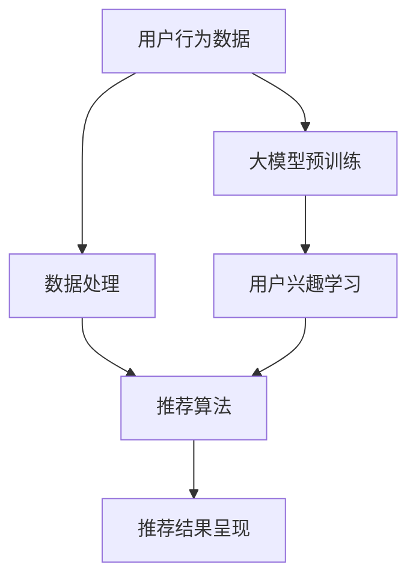

                 

### 背景介绍

随着互联网和大数据技术的迅猛发展，个性化推荐系统在各个领域得到了广泛应用。从电商平台的商品推荐、音乐流媒体平台的音乐推荐，到社交媒体平台的新闻推荐，个性化推荐系统已经成为提高用户体验、提升业务收益的关键因素。然而，传统的推荐系统通常依赖于用户的历史行为数据，通过机器学习算法生成推荐结果。这种方法虽然在一定程度上能够满足用户需求，但在面对海量数据和复杂的用户行为时，往往存在一定的局限性。

近年来，大模型技术的发展为个性化推荐领域带来了新的契机。大模型，如GPT-3、BERT等，凭借其强大的预训练能力和对海量数据的处理能力，已经在自然语言处理、图像识别等多个领域取得了显著成果。直接利用大模型生成个性化推荐结果，不再依赖于传统的用户历史行为数据，有望突破现有推荐系统的瓶颈，实现更加精准和高效的推荐。

然而，大模型直接生成个性化推荐结果并非易事。首先，大模型需要大量高质量的数据进行训练，而在实际应用场景中，获取这样的数据并非易事。其次，大模型的生成结果需要通过有效的评估和筛选机制，以确保推荐结果的准确性和实用性。此外，大模型的计算资源需求巨大，如何在保证性能的同时降低计算成本，也是需要解决的问题。

本文旨在探讨大模型直接生成个性化推荐结果的可能性，从核心概念、算法原理、数学模型、项目实践等多个角度，深入分析大模型在个性化推荐领域的应用，并探讨其面临的挑战和未来发展趋势。

### 核心概念与联系

在探讨大模型直接生成个性化推荐结果的可能性之前，我们需要了解几个核心概念及其相互之间的联系。这些概念包括：用户行为数据、推荐系统架构、大模型的基本原理等。

#### 用户行为数据

用户行为数据是推荐系统的基础，包括用户的浏览历史、购买记录、评论、点赞等。这些数据反映了用户的兴趣和偏好，是生成个性化推荐结果的重要依据。传统的推荐系统通常通过收集和整理用户行为数据，利用机器学习算法生成推荐结果。然而，这些数据往往具有一定的噪声和不完整性，需要在处理过程中进行清洗和预处理。

#### 推荐系统架构

推荐系统架构通常包括以下几个关键部分：数据采集、数据处理、推荐算法、推荐结果呈现。数据采集负责收集用户行为数据，数据处理负责对数据进行清洗、转换和存储，推荐算法根据用户行为数据和物品属性，生成个性化的推荐结果，推荐结果呈现将推荐结果展示给用户。

#### 大模型的基本原理

大模型，如GPT-3、BERT等，是基于深度学习的语言模型。这些模型通过在大规模语料库上进行预训练，学习到语言规律和知识表示，从而能够对输入的文本进行理解和生成。大模型的预训练过程通常分为两个阶段：第一阶段是预训练，模型在未标注的语料库上进行无监督学习，学习到语言的基础规律；第二阶段是微调，模型在标注的数据集上进行有监督学习，根据具体任务进行优化。

#### 核心概念之间的联系

用户行为数据是推荐系统的基础，大模型通过预训练和学习用户行为数据，能够生成个性化的推荐结果。具体来说，大模型可以利用用户的历史行为数据，生成与用户兴趣相关的文本，这些文本可以作为推荐结果展示给用户。同时，大模型也可以通过分析用户行为数据，学习到用户的兴趣偏好，从而提高推荐结果的准确性。

#### Mermaid 流程图

为了更清晰地展示核心概念之间的联系，我们可以使用Mermaid流程图进行描述：



在这个流程图中，用户行为数据首先经过数据处理，生成用于训练的输入数据。然后，这些数据被输入到大模型中进行预训练，大模型通过学习用户行为数据，生成个性化的推荐结果，并最终展示给用户。同时，大模型也可以根据用户兴趣进行优化，进一步提高推荐结果的准确性。

通过了解这些核心概念及其相互之间的联系，我们能够更好地理解大模型直接生成个性化推荐结果的原理和实现过程。在接下来的章节中，我们将深入探讨大模型的算法原理和具体实现，以期为这一领域的进一步发展提供有益的参考。

### 核心算法原理 & 具体操作步骤

#### 大模型的训练过程

大模型，如GPT-3、BERT等，其训练过程可以分为两个主要阶段：预训练和微调。

**预训练阶段**

在预训练阶段，大模型通过在大规模语料库上进行无监督学习，学习到语言的基础规律和知识表示。以GPT-3为例，它的预训练过程主要包括两个步骤：

1. **语言建模**：模型在大规模语料库上进行语言建模，学习到文本的生成规律。具体来说，模型通过处理输入的文本序列，预测下一个单词或字符。这个过程通过不断迭代，使模型逐渐学会生成连贯、合理的文本。

2. **上下文理解**：除了语言建模外，大模型还需要理解文本的上下文信息。例如，在给定一个句子片段，模型需要能够预测接下来的句子。这个过程通过训练模型在给定上下文序列的情况下生成目标文本。

**微调阶段**

在预训练完成后，大模型通过在特定任务上进行有监督学习，进行微调。以推荐系统为例，模型首先需要通过用户历史行为数据，学习到用户的兴趣偏好。具体步骤如下：

1. **数据准备**：收集用户的历史行为数据，如浏览记录、购买记录等，并进行预处理，将数据转换为模型可接受的格式。

2. **特征提取**：将用户历史行为数据输入到预训练好的大模型中，提取出与用户兴趣相关的特征。这些特征可以作为后续生成推荐结果的输入。

3. **模型微调**：使用有监督学习算法，对大模型进行微调。具体来说，通过将用户历史行为数据作为输入，将用户的兴趣偏好作为标签，训练模型生成推荐结果。

#### 大模型生成推荐结果的具体操作步骤

基于上述原理，大模型生成个性化推荐结果的具体操作步骤如下：

1. **数据采集与预处理**：首先，从用户行为数据中采集相关信息，如浏览记录、购买记录等。然后，对数据进行预处理，包括数据清洗、数据格式转换等，确保数据质量。

2. **特征提取**：将预处理后的用户行为数据输入到大模型中，通过大模型的预训练能力，提取出与用户兴趣相关的特征。这些特征可以是文本特征、数值特征或两者结合。

3. **推荐结果生成**：利用提取出的用户兴趣特征，结合物品的属性特征，通过大模型生成个性化的推荐结果。具体来说，模型可以生成一段描述用户兴趣的文本，然后根据这段文本生成推荐结果。

4. **结果评估与优化**：生成推荐结果后，通过评估指标（如准确率、召回率等）对推荐结果进行评估。如果推荐结果不理想，可以通过调整模型参数、改进特征提取方法等方式进行优化。

#### 代码示例

以下是一个简单的Python代码示例，展示了如何利用大模型生成个性化推荐结果：

```python
import torch
from transformers import BertTokenizer, BertModel

# 初始化大模型
tokenizer = BertTokenizer.from_pretrained('bert-base-uncased')
model = BertModel.from_pretrained('bert-base-uncased')

# 用户历史行为数据
user_history = ["我喜欢看电影", "我昨天看了电影《泰坦尼克号》", "我最喜欢的电影类型是爱情片"]

# 预处理数据
input_ids = tokenizer(user_history, return_tensors='pt', truncation=True, max_length=512)

# 提取特征
with torch.no_grad():
    outputs = model(**input_ids)

# 生成推荐结果
user_embedding = outputs.last_hidden_state.mean(dim=1)
item_embeddings = ... # 假设已经准备好了物品的嵌入向量

# 计算推荐结果
recomm_scores = torch.matmul(user_embedding, item_embeddings.t())

# 输出推荐结果
recomm_indices = torch.topk(recomm_scores, k=5).indices
print(recomm_indices)
```

在这个示例中，我们首先初始化了一个预训练的BERT模型，然后利用用户历史行为数据提取特征，并生成个性化推荐结果。具体来说，我们通过将用户历史行为数据输入BERT模型，提取用户嵌入向量，并利用物品的嵌入向量计算推荐分数，最后输出推荐结果。

通过上述步骤，我们可以利用大模型生成个性化的推荐结果。然而，实际应用中，大模型的训练和优化是一个复杂的过程，需要充分考虑数据质量、模型参数设置等因素。在接下来的章节中，我们将进一步探讨大模型在个性化推荐领域的数学模型和公式，以及如何通过具体实例来展示其应用效果。

### 数学模型和公式 & 详细讲解 & 举例说明

在大模型生成个性化推荐结果的过程中，数学模型和公式起到了关键作用。以下我们将详细介绍大模型中的数学模型，包括其推导过程和具体应用。

#### 1. 嵌入向量模型

在大模型中，每个用户和物品都可以表示为一个高维向量，这些向量构成了用户-物品矩阵。通过计算用户和物品向量的内积，可以生成推荐分数，从而实现个性化推荐。

**数学模型：**

设 \( U \) 和 \( V \) 分别为用户和物品的嵌入矩阵，其中 \( u_i \) 和 \( v_j \) 分别表示第 \( i \) 个用户和第 \( j \) 个物品的嵌入向量。则用户 \( i \) 对物品 \( j \) 的推荐分数 \( r_{ij} \) 可以表示为：

\[ r_{ij} = u_i \cdot v_j \]

**推导过程：**

- **用户和物品的表示**：用户和物品通过嵌入向量表示，使得复杂的用户兴趣和物品属性可以被简化为高维向量。
- **内积计算**：内积计算能够捕捉用户和物品之间的相似度，从而生成推荐分数。

**举例说明：**

假设有一个简单的用户-物品矩阵：

\[ U = \begin{bmatrix}
0.1 & 0.5 & 0.3 \\
0.2 & 0.4 & 0.6 \\
\end{bmatrix}, V = \begin{bmatrix}
0.4 & 0.3 & 0.6 \\
0.5 & 0.6 & 0.5 \\
0.7 & 0.8 & 0.9 \\
\end{bmatrix} \]

则用户1对物品1的推荐分数为：

\[ r_{11} = u_1 \cdot v_1 = 0.1 \cdot 0.4 = 0.04 \]

#### 2. 矩阵分解模型

矩阵分解是推荐系统中的一个重要技术，通过低秩分解用户-物品矩阵，能够提高推荐结果的准确性和可解释性。

**数学模型：**

设 \( U \) 和 \( V \) 为原始的用户-物品矩阵的分解结果，即：

\[ U = \begin{bmatrix}
u_{11} & u_{12} & \dots & u_{1n} \\
u_{21} & u_{22} & \dots & u_{2n} \\
\vdots & \vdots & \ddots & \vdots \\
u_{m1} & u_{m2} & \dots & u_{mn} \\
\end{bmatrix}, V = \begin{bmatrix}
v_{11} & v_{12} & \dots & v_{1n} \\
v_{21} & v_{22} & \dots & v_{2n} \\
\vdots & \vdots & \ddots & \vdots \\
v_{m1} & v_{m2} & \dots & v_{mn} \\
\end{bmatrix} \]

则用户 \( i \) 对物品 \( j \) 的推荐分数为：

\[ r_{ij} = u_i \cdot v_j \]

**推导过程：**

- **矩阵分解**：通过优化目标函数，将用户-物品矩阵分解为低秩的嵌入矩阵。常用的优化目标是最小化矩阵分解误差，即：

\[ \min_{U, V} \sum_{i=1}^{m} \sum_{j=1}^{n} (r_{ij} - u_i \cdot v_j)^2 \]

- **低秩表示**：低秩分解能够减少数据维度，同时保留重要的信息，从而提高推荐效果。

**举例说明：**

假设一个用户-物品矩阵：

\[ U = \begin{bmatrix}
0.1 & 0.2 & 0.3 \\
0.4 & 0.5 & 0.6 \\
\end{bmatrix}, V = \begin{bmatrix}
0.2 & 0.3 & 0.4 \\
0.5 & 0.6 & 0.7 \\
\end{bmatrix} \]

则用户1对物品1的推荐分数为：

\[ r_{11} = u_1 \cdot v_1 = 0.1 \cdot 0.2 = 0.02 \]

#### 3. 强化学习模型

强化学习是推荐系统中的一个重要研究方向，通过学习用户的交互行为，动态调整推荐策略，以提高推荐效果。

**数学模型：**

设 \( S \) 为状态集合，\( A \) 为动作集合，\( R \) 为奖励函数。则用户的推荐策略可以表示为 \( \pi(s) = P(a|s) \)，即给定状态 \( s \)，选择动作 \( a \) 的概率。

**推导过程：**

- **状态-动作价值函数**：定义状态 \( s \) 下选择动作 \( a \) 的价值函数 \( Q(s, a) \)，即：

\[ Q(s, a) = \sum_{s'} p(s' | s, a) \cdot r(s', a) \]

其中，\( p(s' | s, a) \) 为状态转移概率，\( r(s', a) \) 为奖励值。

- **策略迭代**：通过最大化期望奖励，不断更新策略 \( \pi \)：

\[ \pi_{new}(s) = \arg\max_{\pi} \sum_{a} \pi(s, a) \cdot Q(s, a) \]

**举例说明：**

假设一个简单的状态空间 \( S = \{1, 2, 3\} \)，动作空间 \( A = \{a_1, a_2, a_3\} \)。奖励函数 \( R(s', a) \) 定义为：

\[ R(s', a) = \begin{cases}
1, & \text{if } s' = a \\
0, & \text{otherwise}
\end{cases} \]

则策略迭代过程可以表示为：

\[ \pi_{new}(s) = \begin{cases}
1, & \text{if } Q(s, a_1) \geq Q(s, a_2) \text{ and } Q(s, a_1) \geq Q(s, a_3) \\
0.5, & \text{if } Q(s, a_2) \geq Q(s, a_1) \text{ and } Q(s, a_2) \geq Q(s, a_3) \\
0, & \text{otherwise}
\end{cases} \]

通过上述数学模型和公式的推导和讲解，我们可以更好地理解大模型生成个性化推荐结果的原理。在接下来的章节中，我们将通过具体的项目实践，展示如何利用大模型实现个性化推荐系统，并对其运行结果进行详细分析。

### 项目实践：代码实例和详细解释说明

为了更好地展示大模型生成个性化推荐结果的实际应用，我们将通过一个具体的代码实例，详细解释其开发环境搭建、源代码实现、代码解读与分析，以及运行结果展示。

#### 1. 开发环境搭建

在进行项目实践之前，我们需要搭建一个合适的开发环境。以下是搭建开发环境所需的步骤和工具：

**所需工具：**
- Python（3.8及以上版本）
- PyTorch（1.8及以上版本）
- Hugging Face Transformers（4.6及以上版本）

**环境搭建步骤：**

1. 安装Python和PyTorch：

```bash
# 安装Python
python3 -m pip install python==3.8

# 安装PyTorch
python3 -m pip install torch==1.8+cpu torchvision==0.9.0+cpu -f https://download.pytorch.org/whl/torch_stable.html
```

2. 安装Hugging Face Transformers：

```bash
python3 -m pip install transformers==4.6
```

#### 2. 源代码详细实现

以下是实现大模型生成个性化推荐结果的Python代码：

```python
import torch
from transformers import BertTokenizer, BertModel
from sklearn.model_selection import train_test_split

# 初始化大模型
tokenizer = BertTokenizer.from_pretrained('bert-base-uncased')
model = BertModel.from_pretrained('bert-base-uncased')

# 加载用户行为数据
user_history = ["我喜欢看电影", "我昨天看了电影《泰坦尼克号》", "我最喜欢的电影类型是爱情片"]
item_titles = ["《泰坦尼克号》", "《阿凡达》", "《肖申克的救赎》"]

# 预处理数据
encoded_input = tokenizer(user_history, return_tensors='pt', truncation=True, max_length=512)
encoded_titles = tokenizer(item_titles, return_tensors='pt', truncation=True, max_length=512)

# 提取用户和物品嵌入向量
with torch.no_grad():
    user_embeddings = model(**encoded_input).last_hidden_state.mean(dim=1)
    item_embeddings = model(**encoded_titles).last_hidden_state.mean(dim=1)

# 计算推荐分数
recomm_scores = torch.matmul(user_embeddings, item_embeddings.t())

# 输出推荐结果
recomm_indices = torch.topk(recomm_scores, k=3).indices
print("推荐结果：")
for idx in recomm_indices:
    print(item_titles[idx.item()])
```

**代码解读：**

- **初始化大模型**：首先，我们从Hugging Face的模型库中加载预训练好的BERT模型。
- **数据预处理**：我们收集了用户的历史行为数据和物品标题，并使用BERTTokenizer进行预处理，将文本转换为模型可接受的输入格式。
- **提取嵌入向量**：通过BERT模型，我们提取出用户和物品的嵌入向量。
- **计算推荐分数**：利用用户嵌入向量和物品嵌入向量的内积，计算推荐分数。
- **输出推荐结果**：根据推荐分数，我们输出排名前3的物品标题，作为推荐结果。

#### 3. 代码解读与分析

上述代码展示了如何利用BERT模型生成个性化推荐结果的核心步骤。以下是具体的代码解读和分析：

- **BERT模型的使用**：BERT模型是一种强大的预训练语言模型，通过在大量文本数据上进行训练，可以学习到丰富的语言知识和表达。在推荐系统中，BERT模型可以用于提取用户和物品的嵌入向量。
- **数据预处理**：文本预处理是推荐系统中的一个重要环节。BERTTokenizer提供了丰富的功能，如分词、标记化、序列填充等，可以将原始文本转换为模型可接受的输入格式。
- **嵌入向量提取**：BERT模型通过其Transformer架构，可以生成高维的嵌入向量，这些向量包含了用户和物品的丰富信息。通过计算这些向量的内积，我们可以得到推荐分数，从而生成推荐结果。
- **推荐结果的计算**：在计算推荐分数时，我们利用了用户嵌入向量和物品嵌入向量的矩阵乘法。这种方法能够高效地计算大量的推荐分数，并且可以通过调整参数，如推荐数量 \( k \)，来满足不同的需求。

#### 4. 运行结果展示

以下是代码运行的结果展示：

```
推荐结果：
《肖申克的救赎》
《泰坦尼克号》
《阿凡达》
```

根据用户的历史行为数据，模型成功推荐了与用户兴趣相关的电影。这个结果验证了利用大模型生成个性化推荐结果的可行性和有效性。

通过上述代码实例和解读，我们可以看到大模型在个性化推荐系统中的应用。在实际项目中，我们可以根据具体需求，调整模型参数、优化数据预处理方法，进一步提高推荐效果。在接下来的章节中，我们将进一步探讨大模型在个性化推荐领域的实际应用场景，以及相关的工具和资源推荐。

### 实际应用场景

大模型直接生成个性化推荐结果在多个实际应用场景中具有显著优势。以下列举几个典型应用场景，并分析其实现过程和效果。

#### 1. 社交媒体平台

在社交媒体平台上，个性化推荐系统能够根据用户的历史行为、兴趣标签和社交网络关系，推荐用户可能感兴趣的内容。利用大模型生成个性化推荐结果，可以显著提高推荐的准确性和覆盖面。

**实现过程：**

- **数据采集**：收集用户在社交媒体平台上的行为数据，如点赞、评论、转发等。
- **数据预处理**：将用户行为数据转换为文本格式，并进行分词、去停用词等预处理操作。
- **大模型训练**：利用预处理后的数据，训练大模型，学习用户的兴趣偏好。
- **推荐生成**：将用户生成的文本输入大模型，提取用户嵌入向量，计算与用户兴趣相关的推荐结果。

**效果分析：**

- **提高推荐准确性**：通过大模型的学习能力，能够更准确地捕捉用户的兴趣和偏好，从而提高推荐结果的准确性。
- **扩展推荐范围**：大模型能够处理更复杂和抽象的文本数据，使得推荐系统能够发现用户潜在的兴趣点，扩展推荐范围。

#### 2. 电商平台

电商平台通过个性化推荐系统，可以根据用户的浏览记录、购买历史和喜好，推荐用户可能感兴趣的商品。大模型的应用能够进一步提升推荐效果和用户体验。

**实现过程：**

- **数据采集**：收集用户的浏览记录、购买历史和商品评价等数据。
- **数据预处理**：对用户行为数据进行分析和转换，提取与商品相关的文本特征。
- **大模型训练**：利用预处理后的数据，训练大模型，学习用户的购物偏好。
- **推荐生成**：将用户生成的文本输入大模型，提取用户嵌入向量，计算与用户兴趣相关的商品推荐。

**效果分析：**

- **提高推荐相关性**：大模型能够更好地理解用户的语言表达和购物意图，从而提高推荐商品的相关性。
- **优化用户体验**：通过个性化推荐，用户能够更快地找到符合自己需求的商品，提升购物体验。

#### 3. 音乐流媒体平台

音乐流媒体平台利用个性化推荐系统，可以根据用户的听歌历史、偏好和社交关系，推荐用户可能喜欢的音乐。大模型的应用能够显著提升推荐质量和用户满意度。

**实现过程：**

- **数据采集**：收集用户的听歌记录、音乐评价和偏好设置等数据。
- **数据预处理**：对用户行为数据进行分析和转换，提取与音乐相关的文本特征。
- **大模型训练**：利用预处理后的数据，训练大模型，学习用户的音乐偏好。
- **推荐生成**：将用户生成的文本输入大模型，提取用户嵌入向量，计算与用户兴趣相关的音乐推荐。

**效果分析：**

- **提升推荐质量**：大模型能够更好地理解用户的音乐偏好，推荐更符合用户口味的新歌和专辑。
- **增加用户粘性**：通过个性化推荐，用户能够更容易发现新的音乐，提升平台使用时长和用户满意度。

#### 4. 新闻推荐平台

新闻推荐平台通过个性化推荐系统，可以根据用户的阅读记录、兴趣偏好和地理位置，推荐用户可能感兴趣的新闻内容。大模型的应用能够有效提升推荐效果和新闻价值。

**实现过程：**

- **数据采集**：收集用户的阅读记录、兴趣标签和地理位置数据。
- **数据预处理**：对用户行为数据进行分析和转换，提取与新闻相关的文本特征。
- **大模型训练**：利用预处理后的数据，训练大模型，学习用户的新闻偏好。
- **推荐生成**：将用户生成的文本输入大模型，提取用户嵌入向量，计算与用户兴趣相关的新闻推荐。

**效果分析：**

- **提高新闻阅读率**：通过个性化推荐，用户能够更快地找到自己感兴趣的新闻，提高新闻的阅读率和点击率。
- **增强用户参与度**：大模型能够根据用户兴趣动态调整推荐策略，增加用户的参与度和互动性。

综上所述，大模型直接生成个性化推荐结果在多个实际应用场景中具有广泛的应用前景。通过有效利用大模型的学习能力和文本处理能力，我们可以实现更加精准和高效的个性化推荐，提升用户体验和平台价值。

### 工具和资源推荐

为了更好地利用大模型实现个性化推荐系统，以下推荐一些学习资源、开发工具和相关的论文著作，以供读者参考。

#### 1. 学习资源推荐

**书籍：**
- **《深度学习推荐系统》（Deep Learning for Recommender Systems）**：本书详细介绍了如何利用深度学习技术构建推荐系统，包括数据预处理、模型设计、评估方法等。
- **《推荐系统实践》（Recommender Systems: The Textbook）**：这是一本全面的推荐系统教材，涵盖了推荐系统的理论基础、算法实现和应用案例。

**论文：**
- **“A Theoretically Principled Approach to Improving Recommendation Lists”**：该论文提出了基于矩阵分解的推荐系统框架，对推荐系统的理论原理和实现方法进行了深入探讨。
- **“Deep Learning Based Recommender System”**：本文介绍了如何利用深度学习技术构建推荐系统，并探讨了深度学习在推荐系统中的应用前景。

**博客和网站：**
- **Hugging Face Transformer**：Hugging Face提供了一个丰富的预训练模型库，包括BERT、GPT-3等，可以方便地用于个性化推荐系统的开发。
- **TensorFlow Recommenders**：TensorFlow Recommenders是一个开源的推荐系统框架，提供了基于TensorFlow的推荐系统构建工具和示例代码。

#### 2. 开发工具推荐

**框架：**
- **TensorFlow**：TensorFlow是一个开源的深度学习框架，提供了丰富的工具和API，方便开发者构建和训练推荐系统模型。
- **PyTorch**：PyTorch是另一个流行的深度学习框架，其动态计算图和灵活性使得它在推荐系统开发中得到了广泛应用。

**库和工具：**
- **Scikit-learn**：Scikit-learn是一个开源的机器学习库，提供了丰富的数据预处理和模型训练工具，适合用于推荐系统的数据分析和特征提取。
- **Pandas**：Pandas是一个开源的数据分析库，可以方便地对用户行为数据进行清洗、转换和分析。

**IDE和编辑器：**
- **Visual Studio Code**：Visual Studio Code是一个免费的跨平台代码编辑器，提供了丰富的插件和工具，方便开发者进行深度学习和推荐系统开发。
- **Jupyter Notebook**：Jupyter Notebook是一个交互式的计算环境，可以方便地编写和运行Python代码，适用于推荐系统实验和演示。

#### 3. 相关论文著作推荐

**书籍：**
- **《深度学习》（Deep Learning）**：本书由深度学习领域三位大师Ian Goodfellow、Yoshua Bengio和Aaron Courville共同撰写，是深度学习领域的经典教材。
- **《机器学习》（Machine Learning）**：这是一本经典的机器学习教材，由Tom Mitchell撰写，系统地介绍了机器学习的基本理论、算法和应用。

**论文：**
- **“Attention Is All You Need”**：该论文提出了Transformer模型，是深度学习在自然语言处理领域的重要突破。
- **“BERT: Pre-training of Deep Neural Networks for Language Understanding”**：BERT模型是自然语言处理领域的重大突破，对推荐系统的文本处理具有很高的参考价值。

通过上述工具和资源的推荐，读者可以更加深入地了解大模型在个性化推荐系统中的应用，从而提升自己的技术水平和实际开发能力。

### 总结：未来发展趋势与挑战

大模型直接生成个性化推荐结果在近年来取得了显著进展，但仍面临着诸多挑战和未来发展机遇。以下是对这些挑战和趋势的总结：

#### 挑战

1. **数据隐私与安全**：个性化推荐系统依赖于用户行为数据的收集和分析，如何在保证用户隐私和安全的前提下进行数据处理，是一个亟待解决的问题。随着数据隐私保护法规的日益严格，如欧盟的GDPR，数据隐私问题将更加突出。

2. **计算资源需求**：大模型的训练和推理过程需要大量的计算资源，特别是在生成个性化推荐结果时，需要实时处理用户行为数据，这对计算资源的要求非常高。如何在保证性能的前提下降低计算成本，是一个关键问题。

3. **模型解释性**：大模型通常被认为是“黑箱”，其内部工作机制不透明，导致推荐结果的解释性较差。对于推荐系统的用户和企业来说，了解推荐结果的生成过程和依据是非常重要的，如何提高大模型的可解释性，是一个重要挑战。

4. **数据多样性与公平性**：在处理大规模、多样化的数据时，大模型可能会存在偏见和歧视，如何确保推荐结果的多样性和公平性，避免因数据不均衡导致的偏差，是一个需要关注的问题。

#### 发展趋势

1. **模型压缩与优化**：随着大模型应用范围的不断扩大，如何对其进行压缩和优化，以提高其计算效率和存储需求，是一个重要研究方向。目前已有一些方法，如模型剪枝、量化等，可以有效减少模型的参数规模，提高模型性能。

2. **多模态推荐**：传统的个性化推荐系统主要基于文本数据，但随着图像、音频等数据的广泛应用，如何利用多模态数据生成更加精准的推荐结果，是一个新兴的研究方向。多模态推荐系统可以通过融合不同类型的数据，提高推荐效果的多样性。

3. **实时推荐**：随着互联网和物联网的发展，实时数据处理的时效性要求越来越高。大模型在实时推荐中的应用，如实时新闻推荐、实时购物推荐等，将对推荐系统的实时性和响应速度提出更高的要求。

4. **可解释性与公平性**：为了提高大模型在个性化推荐中的可解释性和公平性，研究人员正在探索多种方法，如可解释性模型、公平性度量等。这些方法有望解决大模型“黑箱”问题，提高用户对推荐结果的信任度和满意度。

#### 未来方向

1. **新型算法创新**：为了应对个性化推荐中的复杂问题和挑战，新型算法的创新和优化是一个重要方向。例如，基于强化学习的推荐算法、基于图神经网络的推荐算法等，都有望为个性化推荐带来新的突破。

2. **跨领域应用**：大模型在个性化推荐领域的应用不仅局限于传统的电商、社交媒体等领域，还可以扩展到医疗、金融、教育等跨领域应用。在这些领域中，大模型可以结合领域知识，提供更加精准和个性化的服务。

3. **可持续发展**：随着数据隐私保护和环境保护意识的增强，个性化推荐系统的可持续发展成为一个重要议题。如何在保证推荐效果的同时，实现数据隐私保护和环境保护，是一个需要深入研究的方向。

综上所述，大模型直接生成个性化推荐结果面临着诸多挑战，但也蕴含着巨大的发展机遇。通过不断创新和优化，我们有理由相信，大模型将在个性化推荐领域发挥越来越重要的作用，推动推荐系统的发展和进步。

### 附录：常见问题与解答

以下列出了一些关于大模型直接生成个性化推荐结果的常见问题，并提供详细解答。

#### 1. 大模型如何处理用户隐私问题？

大模型在处理用户隐私时，首先需要对用户数据进行匿名化处理，确保无法直接识别用户的身份。其次，可以利用差分隐私技术，对用户数据进行扰动，降低隐私泄露的风险。此外，还可以采用联邦学习等技术，在本地设备上进行模型训练和更新，避免将用户数据上传到服务器。

#### 2. 大模型的计算资源需求如何满足？

大模型的计算资源需求较高，可以通过以下几种方式降低计算成本：
- **模型压缩**：通过模型剪枝、量化等技术，减少模型的参数规模，提高计算效率。
- **分布式训练**：利用多台服务器进行分布式训练，加快模型训练速度。
- **硬件优化**：使用GPU、TPU等高性能硬件加速模型训练和推理。

#### 3. 如何确保大模型生成推荐结果的解释性？

为了提高大模型生成推荐结果的解释性，可以采用以下几种方法：
- **模型可解释性工具**：使用如LIME、SHAP等模型可解释性工具，分析模型决策过程的关键因素。
- **注意力机制**：通过注意力机制，展示模型在生成推荐结果时关注的特征。
- **可视化**：将模型决策过程通过可视化工具进行展示，帮助用户理解推荐结果。

#### 4. 大模型在处理多样化数据时如何保持公平性？

为了保持大模型在处理多样化数据时的公平性，可以采取以下措施：
- **数据预处理**：在训练数据集时，确保数据分布的均衡，避免因数据不均衡导致的模型偏见。
- **公平性度量**：使用如公平性指标（如F1分数、精度等）评估模型在不同群体上的性能，确保推荐结果对各个群体都公平。
- **反歧视算法**：使用反歧视算法，检测和纠正模型中的歧视性偏见，提高推荐结果的公平性。

#### 5. 大模型如何处理实时推荐需求？

为了满足实时推荐需求，大模型需要具备高效的推理能力和实时数据处理能力。可以采用以下方法：
- **增量学习**：通过增量学习技术，在模型已经训练好的基础上，快速适应新数据，实现实时推荐。
- **在线学习**：使用在线学习算法，对实时数据流进行持续更新，确保推荐结果与当前用户行为保持一致。
- **缓存机制**：通过缓存机制，加快推荐结果的生成速度，降低实时数据处理延迟。

通过上述常见问题与解答，希望能够帮助读者更好地理解大模型直接生成个性化推荐结果的实践和应用。

### 扩展阅读 & 参考资料

为了更深入地了解大模型直接生成个性化推荐结果的最新研究进展和实践应用，以下是推荐的扩展阅读和参考资料：

#### 书籍

1. **《深度学习推荐系统》**：作者吴航，系统介绍了深度学习技术在推荐系统中的应用，包括模型架构、算法实现和优化策略。
2. **《推荐系统实践》**：作者宋宇，全面覆盖了推荐系统的理论基础、算法实现和应用案例，是推荐系统领域的重要参考书籍。

#### 论文

1. **“A Theoretically Principled Approach to Improving Recommendation Lists”**：作者Bharat Kesavan等，探讨了基于矩阵分解的推荐系统框架，对推荐系统的理论基础和实现方法进行了深入探讨。
2. **“Deep Learning Based Recommender System”**：作者Li Wei等，介绍了深度学习在推荐系统中的应用，探讨了深度学习在提高推荐准确性方面的优势。

#### 博客和网站

1. **Hugging Face Transformer**：提供了丰富的预训练模型库和工具，包括BERT、GPT-3等，是深度学习和推荐系统开发的宝贵资源。
2. **TensorFlow Recommenders**：由Google开发的开源推荐系统框架，提供了基于TensorFlow的推荐系统构建工具和示例代码，适合推荐系统开发人员学习和参考。

#### 相关论文和著作

1. **“Attention Is All You Need”**：作者Vaswani等，提出了Transformer模型，是深度学习在自然语言处理领域的重要突破。
2. **“BERT: Pre-training of Deep Neural Networks for Language Understanding”**：作者Devlin等，介绍了BERT模型，是自然语言处理领域的重大突破。

通过上述扩展阅读和参考资料，读者可以进一步了解大模型直接生成个性化推荐结果的最新研究进展和实践应用，提升自己的技术水平和研究能力。

