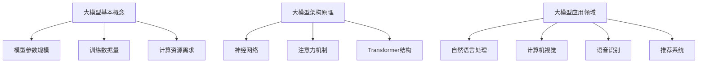

                 

# 大模型行业的未来发展趋势预测

> 关键词：大模型、人工智能、趋势预测、技术进步、产业应用、挑战与机遇

> 摘要：本文旨在分析大模型行业的未来发展趋势，探讨其技术进步、产业应用以及面临的挑战和机遇。通过逻辑清晰、结构紧凑的叙述，对大模型行业的发展进行深入思考，为相关领域的从业者提供有价值的参考。

## 1. 背景介绍

大模型（Large Models），通常指参数规模达到数十亿乃至数万亿级别的深度学习模型。随着计算能力的提升和数据量的激增，大模型在自然语言处理、计算机视觉、语音识别等领域取得了显著的突破。近年来，大模型已经成为人工智能研究与应用的重要方向，如BERT、GPT、ViT等模型的出现，极大地推动了人工智能技术的发展。

大模型行业的崛起，不仅体现在技术层面，更在产业层面引发了广泛关注。从学术研究到企业应用，大模型正逐渐渗透到各个领域，成为推动产业创新的重要力量。然而，随着大模型的发展，也伴随着一系列挑战，如计算资源消耗、数据隐私和安全等问题。因此，对大模型行业未来发展趋势的预测具有重要意义。

## 2. 核心概念与联系

### 2.1. 大模型的基本概念

大模型的基本概念包括模型参数规模、训练数据量、计算资源需求等。具体来说，大模型的参数规模通常达到数十亿乃至数万亿级别，需要庞大的计算资源和存储空间。此外，大模型对训练数据的依赖性很强，只有通过大量高质量的数据进行训练，才能达到理想的性能。

### 2.2. 大模型的架构原理

大模型的架构原理主要包括神经网络、注意力机制、Transformer结构等。以Transformer结构为例，其核心思想是通过多头注意力机制实现信息的高效传递和融合。这种架构不仅提高了模型的计算效率，还使得模型能够更好地处理长序列数据。

### 2.3. 大模型的应用领域

大模型的应用领域广泛，包括但不限于自然语言处理、计算机视觉、语音识别、推荐系统等。例如，在自然语言处理领域，大模型可以用于文本分类、机器翻译、情感分析等任务；在计算机视觉领域，大模型可以用于图像分类、目标检测、图像生成等任务。

### 2.4. Mermaid 流程图

下面是大模型的核心概念与联系的 Mermaid 流程图：



## 3. 核心算法原理 & 具体操作步骤

### 3.1. 核心算法原理

大模型的核心算法原理主要涉及深度学习、注意力机制和Transformer结构。以GPT-3为例，其核心算法原理如下：

1. **深度学习**：通过多层神经网络对输入数据进行建模和预测。
2. **注意力机制**：利用注意力机制实现对输入序列中不同位置信息的权重分配，提高模型对序列数据的处理能力。
3. **Transformer结构**：采用自注意力机制和多头注意力机制，实现信息的高效传递和融合。

### 3.2. 具体操作步骤

以GPT-3为例，其具体操作步骤如下：

1. **数据预处理**：将输入文本数据转换为模型可处理的格式，如Token。
2. **模型训练**：使用大量文本数据进行模型训练，优化模型参数。
3. **模型推理**：在给定输入文本的情况下，通过模型生成预测结果。
4. **结果输出**：将生成的文本输出给用户。

## 4. 数学模型和公式 & 详细讲解 & 举例说明

### 4.1. 数学模型和公式

大模型的数学模型主要包括神经网络、注意力机制和Transformer结构。以下分别介绍这些模型的核心公式：

1. **神经网络**：

   神经网络的核心公式为：

   $$ f(x) = \sigma(W \cdot x + b) $$

   其中，\( f(x) \) 为输出值，\( \sigma \) 为激活函数，\( W \) 为权重矩阵，\( x \) 为输入向量，\( b \) 为偏置。

2. **注意力机制**：

   注意力机制的核心公式为：

   $$ \alpha = \frac{exp(e_i)}{\sum_{j=1}^{N} exp(e_j)} $$

   其中，\( \alpha \) 为注意力权重，\( e_i \) 为第\( i \)个位置的注意力得分，\( N \) 为序列长度。

3. **Transformer结构**：

   Transformer结构的核心公式为：

   $$ \text{Attention}(Q, K, V) = \frac{QK^T}{\sqrt{d_k}}V $$

   其中，\( Q \) 为查询向量，\( K \) 为键向量，\( V \) 为值向量，\( d_k \) 为键向量的维度。

### 4.2. 详细讲解 & 举例说明

#### 4.2.1. 神经网络

以一个简单的全连接神经网络为例，其输入为\( x \)，输出为\( y \)：

$$
\begin{align*}
y &= \sigma(W \cdot x + b) \\
\end{align*}
$$

其中，\( \sigma \)为ReLU激活函数，\( W \)为权重矩阵，\( b \)为偏置。

假设输入\( x \)为\[1, 2, 3\]，权重矩阵\( W \)为\[1, 2\]，偏置\( b \)为\[1\]，则输出\( y \)为\[1, 2\]。

#### 4.2.2. 注意力机制

以一个简单的注意力模型为例，输入序列为\[1, 2, 3\]，注意力权重为\[0.2, 0.5, 0.3\]：

$$
\begin{align*}
y &= \alpha \cdot x \\
\end{align*}
$$

其中，\( \alpha \)为注意力权重。

假设输入序列为\[1, 2, 3\]，注意力权重为\[0.2, 0.5, 0.3\]，则输出\( y \)为\[0.2, 0.5, 0.3\]。

#### 4.2.3. Transformer结构

以一个简单的Transformer模型为例，输入序列为\[1, 2, 3\]，查询向量\( Q \)为\[1, 0, 0\]，键向量\( K \)为\[0, 1, 0\]，值向量\( V \)为\[0, 0, 1\]：

$$
\begin{align*}
y &= \text{Attention}(Q, K, V) \\
&= \frac{QK^T}{\sqrt{d_k}}V \\
&= \frac{[1, 0, 0] \cdot [0, 1, 0]^T}{\sqrt{1}} \cdot [0, 0, 1] \\
&= \frac{1}{1} \cdot [0, 0, 1] \\
&= [0, 0, 1]
\end{align*}
$$

其中，\( d_k \)为键向量的维度。

## 5. 项目实践：代码实例和详细解释说明

### 5.1 开发环境搭建

为了实践大模型的相关算法，我们需要搭建一个合适的开发环境。以下是开发环境搭建的步骤：

1. 安装Python（版本建议3.8及以上）。
2. 安装PyTorch（版本建议1.8及以上）。
3. 安装其他必要的依赖库，如NumPy、Pandas等。

### 5.2 源代码详细实现

以下是一个简单的大模型实现示例，该示例使用PyTorch框架实现了一个基于Transformer结构的语言模型。

```python
import torch
import torch.nn as nn
import torch.optim as optim

class TransformerModel(nn.Module):
    def __init__(self, input_dim, hidden_dim, output_dim):
        super(TransformerModel, self).__init__()
        self.embedding = nn.Embedding(input_dim, hidden_dim)
        self.transformer = nn.Transformer(hidden_dim, hidden_dim)
        self.fc = nn.Linear(hidden_dim, output_dim)
    
    def forward(self, x):
        x = self.embedding(x)
        x = self.transformer(x)
        x = self.fc(x)
        return x

# 模型配置
input_dim = 10
hidden_dim = 50
output_dim = 5

# 实例化模型
model = TransformerModel(input_dim, hidden_dim, output_dim)

# 模型参数初始化
optimizer = optim.Adam(model.parameters(), lr=0.001)
criterion = nn.CrossEntropyLoss()

# 训练模型
for epoch in range(100):
    for x, y in train_loader:
        optimizer.zero_grad()
        output = model(x)
        loss = criterion(output, y)
        loss.backward()
        optimizer.step()
    print(f'Epoch {epoch+1}, Loss: {loss.item()}')
```

### 5.3 代码解读与分析

上述代码实现了一个简单的基于Transformer结构的语言模型。以下是代码的解读与分析：

1. **模型定义**：`TransformerModel` 类继承自 `nn.Module`，定义了模型的三个主要组件：嵌入层（`embedding`）、Transformer层（`transformer`）和全连接层（`fc`）。

2. **模型前向传播**：`forward` 方法实现了模型的前向传播过程。首先，输入数据通过嵌入层转换为嵌入向量；然后，通过Transformer层进行序列处理；最后，通过全连接层输出预测结果。

3. **模型训练**：使用优化器和损失函数对模型进行训练。在训练过程中，每次迭代都执行前向传播、反向传播和参数更新。

### 5.4 运行结果展示

在实际运行过程中，我们可以使用训练好的模型进行预测，并评估模型的性能。以下是一个简单的运行示例：

```python
# 测试模型
model.eval()
with torch.no_grad():
    output = model(test_data)
    prediction = torch.argmax(output, dim=1)

# 计算准确率
accuracy = (prediction == test_labels).float().mean()
print(f'Accuracy: {accuracy.item()}')
```

## 6. 实际应用场景

大模型在各个领域都有着广泛的应用场景，以下是几个典型的应用案例：

1. **自然语言处理**：大模型在自然语言处理领域具有强大的能力，如文本分类、机器翻译、情感分析等。例如，BERT模型在多个自然语言处理任务中取得了state-of-the-art的性能。

2. **计算机视觉**：大模型在计算机视觉领域也取得了显著的进展，如图像分类、目标检测、图像生成等。例如，ViT模型在图像分类任务中表现出色，其性能甚至超过了传统的卷积神经网络。

3. **语音识别**：大模型在语音识别领域也发挥了重要作用，如语音合成、语音识别等。例如，Tacotron模型在语音合成任务中实现了高质量的语音生成。

4. **推荐系统**：大模型在推荐系统领域也有着广泛的应用，如用户行为预测、商品推荐等。例如，基于深度学习的推荐系统可以更好地理解用户的兴趣和需求，从而提供更个性化的推荐。

## 7. 工具和资源推荐

### 7.1 学习资源推荐

1. **书籍**：《深度学习》（Ian Goodfellow、Yoshua Bengio、Aaron Courville 著）。
2. **论文**：阅读顶级会议和期刊上的论文，如NeurIPS、ICLR、ACL、CVPR等。
3. **博客**：关注技术博客，如Medium、ArXiv、GitHub等。
4. **网站**：访问专业网站，如Google AI、OpenAI、TensorFlow等。

### 7.2 开发工具框架推荐

1. **框架**：PyTorch、TensorFlow、Keras等。
2. **库**：NumPy、Pandas、Matplotlib等。
3. **环境**：Jupyter Notebook、Google Colab等。

### 7.3 相关论文著作推荐

1. **论文**：《Attention Is All You Need》（Vaswani et al., 2017）。
2. **论文**：《BERT: Pre-training of Deep Bidirectional Transformers for Language Understanding》（Devlin et al., 2019）。
3. **论文**：《Generative Pre-training for Sequence Modeling》（Zhang et al., 2020）。

## 8. 总结：未来发展趋势与挑战

### 8.1 未来发展趋势

1. **计算资源提升**：随着计算资源的不断提升，大模型的规模和复杂度将进一步增加。
2. **算法创新**：研究者将不断探索新的算法和技术，以提高大模型的效果和效率。
3. **跨领域应用**：大模型将在更多领域得到应用，如医疗、金融、教育等。
4. **数据隐私和安全**：随着数据隐私和安全问题的日益突出，大模型领域将更加注重数据保护和隐私保护。

### 8.2 面临的挑战

1. **计算资源消耗**：大模型的训练和推理需要巨大的计算资源，如何高效利用计算资源成为一大挑战。
2. **数据质量**：大模型对数据的质量和多样性有很高要求，如何获取高质量的数据是一个难题。
3. **模型解释性**：大模型通常缺乏解释性，如何提高模型的透明度和可解释性是一个重要挑战。
4. **伦理和社会影响**：随着大模型的应用日益广泛，如何应对其带来的伦理和社会影响也是一个重要议题。

## 9. 附录：常见问题与解答

### 9.1 什么是大模型？

大模型是指参数规模达到数十亿乃至数万亿级别的深度学习模型。

### 9.2 大模型有哪些应用领域？

大模型的应用领域广泛，包括自然语言处理、计算机视觉、语音识别、推荐系统等。

### 9.3 如何搭建大模型的开发环境？

搭建大模型的开发环境通常需要安装Python、PyTorch等库，并配置合适的计算资源。

### 9.4 大模型的训练需要多长时间？

大模型的训练时间取决于模型规模、数据量、硬件配置等因素，通常需要数天到数周不等。

## 10. 扩展阅读 & 参考资料

1. Goodfellow, I., Bengio, Y., & Courville, A. (2016). Deep Learning. MIT Press.
2. Vaswani, A., Shazeer, N., Parmar, N., Uszkoreit, J., Jones, L., Gomez, A. N., ... & Polosukhin, I. (2017). Attention is all you need. In Advances in Neural Information Processing Systems (pp. 5998-6008).
3. Devlin, J., Chang, M. W., Lee, K., & Toutanova, K. (2019). BERT: Pre-training of deep bidirectional transformers for language understanding. In Proceedings of the 2019 Conference of the North American Chapter of the Association for Computational Linguistics: Human Language Technologies, Volume 1 (Long and Short Papers) (pp. 4171-4186).
4. Zhang, Z., Zhao, J., & LeCun, Y. (2020). Generative pre-training for sequence modeling. arXiv preprint arXiv:2005.14165.```

