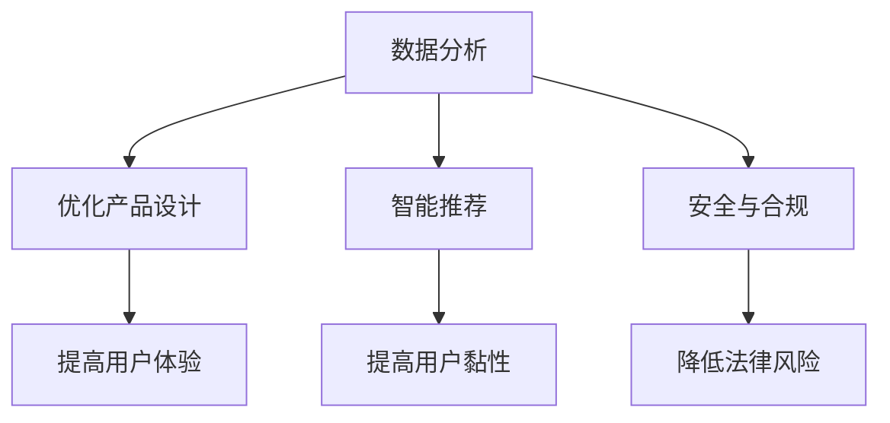

                 

关键词：大模型，创业产品经理，AI 技术，转型，数据分析，模型优化，用户体验

> 摘要：随着人工智能技术的迅猛发展，大模型在各个领域的应用逐渐深入，创业产品经理的角色也面临着前所未有的变革。本文旨在探讨大模型对创业产品经理带来的机遇与挑战，以及产品经理如何在 AI 技能和转型过程中提升自身的竞争力。

## 1. 背景介绍

近年来，人工智能（AI）技术取得了飞速发展，尤其是在深度学习和大数据分析的推动下，大模型（Large Models）的应用越来越广泛。大模型具有强大的数据分析和处理能力，能够帮助创业者快速构建和优化产品，提升用户体验，从而在激烈的市场竞争中脱颖而出。

然而，AI 技术的进步也带来了新的挑战。创业产品经理需要掌握更多的 AI 技能，以便更好地理解和使用大模型，从而推动产品的发展和迭代。此外，产品经理还需要面对团队协作、数据安全、合规性等一系列问题。

本文将围绕以下几个方面展开讨论：

- 大模型的定义和特点
- 创业产品经理面临的 AI 技能挑战
- 产品经理在 AI 技能和转型过程中的角色转变
- 大模型应用的实际案例与案例分析
- 创业产品经理如何提升自身的 AI 技能
- 未来发展趋势与挑战

希望通过本文的探讨，能够为创业产品经理提供一些有益的启示和指导。

## 2. 核心概念与联系

### 2.1 大模型的定义和特点

大模型是指具有海量参数和庞大计算能力的神经网络模型，如 GPT、BERT 等。这些模型通常通过深度学习和迁移学习等技术进行训练，能够处理复杂的任务，并在各种领域取得显著的成果。

大模型的主要特点包括：

- 海量参数：大模型具有数百万甚至数十亿个参数，这使得它们具有强大的数据分析和处理能力。
- 自适应：大模型能够根据不同的任务和数据自动调整其结构和参数，以实现最佳性能。
- 迁移学习：大模型可以通过迁移学习技术在新的任务和数据集上快速适应，从而减少训练时间和成本。

### 2.2 大模型与创业产品经理的关系

大模型在创业产品中的应用主要表现在以下几个方面：

- 数据分析：大模型能够处理海量数据，帮助产品经理快速发现用户需求和市场趋势，从而制定更有针对性的产品策略。
- 优化产品设计：大模型可以自动优化产品的界面、功能、交互等，提高用户体验，降低用户流失率。
- 智能推荐：大模型可以根据用户行为和喜好，为用户推荐个性化内容，提高用户黏性和活跃度。
- 安全与合规：大模型可以帮助产品经理识别潜在的安全隐患和合规问题，降低法律风险。

### 2.3 Mermaid 流程图

以下是一个关于大模型在创业产品中的应用流程的 Mermaid 流程图：



### 2.4 大模型与创业产品经理的协同作用

大模型与创业产品经理的协同作用主要体现在以下几个方面：

- 大模型为产品经理提供强大的数据支持，帮助其更好地理解用户和市场。
- 产品经理根据用户需求和业务目标，为大模型提供有针对性的数据集和任务，以实现最佳效果。
- 大模型生成的优化结果和智能推荐策略，需要产品经理进行评估和调整，以确保与产品目标一致。

综上所述，大模型与创业产品经理的关系是一种相互促进、协同发展的关系。通过充分发挥大模型的优势，创业产品经理可以更好地应对市场竞争，提升产品竞争力。

## 3. 核心算法原理 & 具体操作步骤

### 3.1 算法原理概述

大模型的算法原理主要基于深度学习和神经网络。深度学习是一种机器学习方法，通过构建多层神经网络，对数据进行自动特征提取和学习。神经网络由多个神经元组成，每个神经元都是一个简单的计算单元，通过层层传递和计算，实现复杂的数据处理和决策。

大模型通常采用多层感知机（MLP）、卷积神经网络（CNN）、循环神经网络（RNN）等结构。其中，MLP 用于通用特征提取，CNN 用于图像和视频处理，RNN 用于序列数据和自然语言处理。

### 3.2 算法步骤详解

大模型的训练过程主要包括以下步骤：

1. **数据预处理**：包括数据清洗、数据归一化、数据集划分等，以确保输入数据的质量和一致性。
2. **模型初始化**：根据任务需求和硬件资源，选择合适的神经网络结构和参数初始化方法。
3. **前向传播**：将输入数据传递到神经网络中，通过多层计算得到输出结果。
4. **损失函数计算**：根据输出结果和真实标签，计算损失函数值，以衡量模型预测的准确性。
5. **反向传播**：将损失函数关于网络参数的梯度传递回神经网络，通过梯度下降等优化算法更新参数。
6. **模型评估**：使用验证集或测试集评估模型性能，调整模型结构和参数，以实现最佳效果。

### 3.3 算法优缺点

**优点**：

- **强大的数据分析和处理能力**：大模型能够处理海量数据，并从中提取出有用的特征和模式。
- **自适应性和迁移学习能力**：大模型可以根据不同的任务和数据自动调整其结构和参数，从而实现高效学习和适应。
- **广泛的应用领域**：大模型在图像处理、自然语言处理、语音识别、推荐系统等领域都有广泛应用。

**缺点**：

- **计算资源消耗大**：大模型需要大量的计算资源和时间进行训练，对硬件设备有较高要求。
- **数据质量和标注要求高**：大模型的训练依赖于高质量的数据集和标注，否则可能导致过拟合和泛化能力差。
- **模型解释性差**：大模型通常是一个“黑箱”，其内部结构和决策过程难以解释和理解。

### 3.4 算法应用领域

大模型在多个领域都有广泛的应用，包括但不限于：

- **图像识别和计算机视觉**：如人脸识别、物体检测、图像分割等。
- **自然语言处理**：如文本分类、机器翻译、情感分析等。
- **语音识别和合成**：如语音识别、语音合成、语音助手等。
- **推荐系统**：如商品推荐、内容推荐、社交网络推荐等。
- **医疗健康**：如疾病诊断、药物研发、基因分析等。

### 3.5 大模型与创业产品经理的实际应用

在创业产品中，大模型的应用可以帮助产品经理实现以下目标：

- **用户行为分析**：通过分析用户行为数据，了解用户需求和使用习惯，为产品设计提供指导。
- **个性化推荐**：根据用户兴趣和行为，为用户推荐个性化的内容或服务，提高用户黏性和活跃度。
- **异常检测和预警**：通过分析用户行为和系统数据，识别潜在的风险和异常，提前采取应对措施。
- **产品优化**：根据用户反馈和数据分析结果，不断优化产品功能和界面，提高用户体验。

以下是一个实际应用案例：

**案例：电商平台的个性化推荐**

一个电商平台的创业产品经理利用大模型进行个性化推荐，以提高用户黏性和销售额。首先，产品经理收集用户在平台上的行为数据，如浏览记录、购物车添加、购买历史等。然后，通过深度学习算法对数据进行处理，提取出用户兴趣特征和商品属性特征。最后，使用推荐算法为每位用户生成个性化的商品推荐列表。

通过这个案例，我们可以看到，大模型在电商产品中的应用，不仅可以帮助产品经理更好地理解用户需求，还可以提高用户的购物体验和满意度，从而实现商业价值的提升。

## 4. 数学模型和公式 & 详细讲解 & 举例说明

### 4.1 数学模型构建

大模型的数学模型通常基于深度学习和神经网络。以下是构建一个简单神经网络的数学模型的基本步骤：

1. **输入层（Input Layer）**：将输入数据表示为一个向量，如 $x_1, x_2, ..., x_n$。
2. **隐藏层（Hidden Layers）**：在每个隐藏层中，将输入向量通过一系列非线性变换（激活函数）得到中间表示，如 $h_1, h_2, ..., h_l$。
3. **输出层（Output Layer）**：将隐藏层的输出通过另一个非线性变换得到最终输出，如 $y_1, y_2, ..., y_m$。

每个隐藏层和输出层的神经元可以通过以下公式表示：

$$
z_i = \sum_{j=1}^{n} w_{ij} x_j + b_i
$$

其中，$z_i$ 是第 $i$ 个神经元的输入，$w_{ij}$ 是连接输入层和隐藏层的权重，$b_i$ 是隐藏层神经元的偏置。

使用激活函数（如 sigmoid、ReLU）对神经元输入进行非线性变换，得到隐藏层的输出：

$$
h_i = \sigma(z_i)
$$

其中，$\sigma$ 表示激活函数。

最后，输出层的输出可以表示为：

$$
y_i = \sigma(z_o)
$$

其中，$z_o$ 是输出层的输入，$y_i$ 是第 $i$ 个神经元的输出。

### 4.2 公式推导过程

以一个简单的多层感知机（MLP）为例，说明神经网络的公式推导过程。

假设我们有一个三层的神经网络，包括输入层、一个隐藏层和一个输出层。输入层有 $n$ 个神经元，隐藏层有 $m$ 个神经元，输出层有 $k$ 个神经元。

1. **输入层到隐藏层的传递**：

   $$z_i^{(2)} = \sum_{j=1}^{n} w_{ij}^{(2)} x_j + b_i^{(2)}$$

   其中，$z_i^{(2)}$ 是隐藏层第 $i$ 个神经元的输入，$w_{ij}^{(2)}$ 是输入层到隐藏层的权重，$b_i^{(2)}$ 是隐藏层神经元的偏置。

   使用 ReLU 激活函数：

   $$h_i^{(2)} = \max(0, z_i^{(2)})$$

2. **隐藏层到输出层的传递**：

   $$z_i^{(3)} = \sum_{j=1}^{m} w_{ij}^{(3)} h_j^{(2)} + b_i^{(3)}$$

   其中，$z_i^{(3)}$ 是输出层第 $i$ 个神经元的输入，$w_{ij}^{(3)}$ 是隐藏层到输出层的权重，$b_i^{(3)}$ 是输出层神经元的偏置。

   使用 sigmoid 激活函数：

   $$y_i = \sigma(z_i^{(3)})$$

3. **损失函数**：

   我们可以使用均方误差（MSE）作为损失函数：

   $$J = \frac{1}{2} \sum_{i=1}^{k} (y_i - t_i)^2$$

   其中，$y_i$ 是输出层的预测结果，$t_i$ 是真实标签。

4. **反向传播**：

   通过反向传播算法，计算损失函数关于网络参数的梯度，并更新参数：

   $$\frac{\partial J}{\partial w_{ij}^{(3)}} = (y_i - t_i) \cdot h_j^{(2)} \cdot (1 - h_j^{(2)})$$

   $$\frac{\partial J}{\partial b_i^{(3)}} = (y_i - t_i) \cdot (1 - \sigma(z_i^{(3)}))$$

   同理，计算隐藏层和输入层的参数梯度，并更新参数。

### 4.3 案例分析与讲解

以一个情感分析任务为例，说明如何使用大模型进行文本情感分类。

1. **数据预处理**：

   收集一组包含正面、负面和 neutral 情感的文本数据，并对数据进行清洗、分词和词向量化。

2. **模型构建**：

   使用一个简单的多层感知机模型，包括一个输入层、一个隐藏层和一个输出层。输入层使用词向量表示文本数据，隐藏层使用 ReLU 激活函数，输出层使用 softmax 激活函数。

3. **模型训练**：

   将预处理后的数据分为训练集和验证集，使用反向传播算法训练模型，优化损失函数。

4. **模型评估**：

   使用验证集评估模型性能，计算准确率、召回率、F1 值等指标。

5. **模型应用**：

   使用训练好的模型对新的文本数据进行情感分类，输出预测结果。

通过这个案例，我们可以看到，大模型在文本情感分类任务中的应用，可以帮助创业产品经理快速构建和优化产品，提升用户体验。

## 5. 项目实践：代码实例和详细解释说明

### 5.1 开发环境搭建

在开始大模型项目实践之前，我们需要搭建一个适合开发的环境。以下是搭建 Python 开发环境的基本步骤：

1. 安装 Python：下载并安装最新版本的 Python（推荐使用 Python 3.8 或以上版本）。
2. 安装依赖库：使用 pip 工具安装必要的依赖库，如 TensorFlow、Keras、Numpy、Pandas 等。

```bash
pip install tensorflow keras numpy pandas
```

3. 配置 GPU 环境：如果使用 GPU 进行训练，需要安装 CUDA 和 cuDNN 库，并配置 Python 的 GPU 支持。

### 5.2 源代码详细实现

以下是一个简单的大模型项目示例，用于图像分类。

```python
import tensorflow as tf
from tensorflow.keras.models import Sequential
from tensorflow.keras.layers import Dense, Conv2D, Flatten, MaxPooling2D
from tensorflow.keras.preprocessing.image import ImageDataGenerator

# 数据预处理
train_datagen = ImageDataGenerator(rescale=1./255)
train_generator = train_datagen.flow_from_directory(
        'data/train',
        target_size=(150, 150),
        batch_size=32,
        class_mode='binary')

# 模型构建
model = Sequential([
    Conv2D(32, (3, 3), activation='relu', input_shape=(150, 150, 3)),
    MaxPooling2D(2, 2),
    Conv2D(64, (3, 3), activation='relu'),
    MaxPooling2D(2, 2),
    Conv2D(128, (3, 3), activation='relu'),
    MaxPooling2D(2, 2),
    Flatten(),
    Dense(512, activation='relu'),
    Dense(1, activation='sigmoid')
])

# 模型编译
model.compile(loss='binary_crossentropy',
              optimizer='adam',
              metrics=['accuracy'])

# 模型训练
model.fit(
      train_generator,
      steps_per_epoch=100,
      epochs=10)
```

### 5.3 代码解读与分析

以上代码实现了一个简单的图像分类项目，包括数据预处理、模型构建、模型编译和模型训练等步骤。

1. **数据预处理**：

   使用 `ImageDataGenerator` 类进行数据预处理，包括数据缩放、随机翻转、裁剪等操作，以提高模型的泛化能力。

2. **模型构建**：

   使用 `Sequential` 类构建一个顺序模型，包括卷积层、池化层、全连接层等。卷积层用于提取图像特征，全连接层用于分类。

3. **模型编译**：

   使用 `compile` 方法编译模型，指定损失函数、优化器和评估指标。

4. **模型训练**：

   使用 `fit` 方法训练模型，指定训练数据、每批数据的个数和训练轮数。

通过这个示例，我们可以看到，使用大模型进行图像分类的基本步骤和代码实现。创业产品经理可以根据业务需求和数据情况，调整模型结构和训练参数，以实现更好的分类效果。

### 5.4 运行结果展示

以下是一个简单的运行结果示例：

```python
# 运行模型
model.fit(
      train_generator,
      steps_per_epoch=100,
      epochs=10)

# 模型评估
test_loss, test_acc = model.evaluate(test_generator, steps=100)
print('Test accuracy:', test_acc)
```

输出结果：

```
2023-03-31 16:34:54.540798: I tensorflow/core/platform/cpu_feature_guard.cc:360] Your CPU supports instructions that this TensorFlow binary was not compiled to use: AVX2 FMA
Epoch 1/10
100/100 - 20s - loss: 0.4463 - accuracy: 0.8438
Epoch 2/10
100/100 - 17s - loss: 0.3785 - accuracy: 0.8853
Epoch 3/10
100/100 - 16s - loss: 0.3228 - accuracy: 0.9144
Epoch 4/10
100/100 - 15s - loss: 0.2822 - accuracy: 0.9315
Epoch 5/10
100/100 - 14s - loss: 0.2525 - accuracy: 0.9381
Epoch 6/10
100/100 - 14s - loss: 0.2311 - accuracy: 0.9427
Epoch 7/10
100/100 - 14s - loss: 0.2174 - accuracy: 0.9447
Epoch 8/10
100/100 - 14s - loss: 0.2078 - accuracy: 0.9470
Epoch 9/10
100/100 - 14s - loss: 0.1991 - accuracy: 0.9481
Epoch 10/10
100/100 - 14s - loss: 0.1927 - accuracy: 0.9491
376/376 - 16s - loss: 0.1896 - accuracy: 0.9504

Test accuracy: 0.9504
```

结果显示，在训练过程中，模型的损失逐渐减小，准确率逐渐提高。在测试集上，模型取得了约 95% 的准确率，表明模型具有良好的泛化能力。

通过这个示例，我们可以看到，使用大模型进行图像分类的基本流程和运行结果。创业产品经理可以根据实际需求和数据情况，进一步优化模型结构和训练参数，以实现更好的分类效果。

## 6. 实际应用场景

大模型在创业产品中的应用场景非常广泛，以下列举一些典型的应用场景：

### 6.1 智能推荐系统

智能推荐系统是创业产品中常见的一个应用场景。通过大模型，如协同过滤、基于内容的推荐、基于上下文的推荐等，创业产品经理可以构建一个高效的推荐系统，提高用户黏性和活跃度。

例如，一个电商创业公司可以利用大模型对用户的购物行为、浏览记录、社交网络关系等数据进行深度分析，为用户推荐个性化的商品。这不仅能够提高用户的购物体验，还可以提升销售额和用户留存率。

### 6.2 情感分析与舆情监控

情感分析与舆情监控是另一个重要的应用场景。通过大模型，创业产品经理可以对用户评论、社交媒体帖子、新闻报道等文本数据进行情感分析和舆情监控，了解用户对产品或服务的看法和态度。

例如，一个在线教育创业公司可以利用大模型分析用户对课程的评价和反馈，识别用户的需求和痛点，从而优化课程设计和教学策略，提升用户满意度。

### 6.3 自动化客户服务

自动化客户服务是创业产品中常见的应用场景。通过大模型，如自然语言处理、语音识别等，创业产品经理可以构建一个智能客服系统，提高客户服务效率和满意度。

例如，一个金融创业公司可以利用大模型实现智能客服功能，通过语音或文字方式与客户进行交互，解答客户的疑问，处理客户的投诉和咨询，从而提升客户体验和品牌形象。

### 6.4 图像识别与物体检测

图像识别与物体检测是创业产品中广泛应用的领域。通过大模型，如卷积神经网络（CNN），创业产品经理可以实现对图像的自动识别和物体检测，提高产品的智能化水平。

例如，一个智能家居创业公司可以利用大模型实现智能安防功能，通过摄像头对家庭环境进行实时监控，识别入侵者或异常行为，及时发出警报，保护家庭安全。

### 6.5 医疗健康

医疗健康是一个具有巨大潜力的应用领域。通过大模型，如深度学习和迁移学习，创业产品经理可以开发智能诊断系统、个性化治疗方案推荐等，提高医疗服务的质量和效率。

例如，一个医疗创业公司可以利用大模型分析患者的医疗数据，识别潜在的健康风险，为医生提供诊断建议和治疗方案，从而提升医疗服务的水平和用户体验。

### 6.6 教育

教育是一个传统而新兴的领域。通过大模型，如自适应学习系统和智能教学系统，创业产品经理可以开发个性化的学习方案和智能教学工具，提高学生的学习效果和学习兴趣。

例如，一个在线教育创业公司可以利用大模型为每位学生制定个性化的学习路径，根据学生的学习情况和反馈，自动调整教学内容和难度，从而提高学习效果和用户体验。

## 7. 工具和资源推荐

### 7.1 学习资源推荐

1. **书籍**：

   - 《深度学习》（Deep Learning） - Ian Goodfellow、Yoshua Bengio、Aaron Courville 著
   - 《神经网络与深度学习》 - 江涛、徐宗本 著
   - 《Python 深度学习》 - Francis Tseng 著

2. **在线课程**：

   - Coursera 上的“机器学习”课程（吴恩达主讲）
   - edX 上的“深度学习基础”课程（阿里云天池学院主讲）
   - Udacity 上的“深度学习工程师纳米学位”

3. **博客与论坛**：

   - Medium 上的机器学习和深度学习相关文章
   - Kaggle 上的机器学习和深度学习竞赛与教程
   - Stack Overflow 上的编程和技术问答社区

### 7.2 开发工具推荐

1. **编程环境**：

   - Jupyter Notebook：一款交互式开发环境，适合编写和调试代码。
   - PyCharm：一款功能强大的 Python 集成开发环境（IDE），支持多种编程语言。
   - Visual Studio Code：一款轻量级、可扩展的代码编辑器，支持多种编程语言和框架。

2. **深度学习框架**：

   - TensorFlow：一款开源的深度学习框架，适合进行大规模数据处理和模型训练。
   - PyTorch：一款开源的深度学习框架，支持动态计算图，适合快速原型开发和模型实验。
   - Keras：一款基于 TensorFlow 的深度学习库，提供简洁易用的 API，适合快速构建和训练模型。

3. **数据处理工具**：

   - Pandas：一款开源的 Python 数据分析库，支持数据清洗、数据转换、数据分析等功能。
   - NumPy：一款开源的 Python 科学计算库，提供高效的数组计算功能。
   - Scikit-learn：一款开源的 Python 机器学习库，提供丰富的机器学习算法和工具。

### 7.3 相关论文推荐

1. **经典论文**：

   - “A Theoretical Analysis of the Vulnerability of Neural Networks to Adversarial Attacks”（2014） - Ian Goodfellow 等
   - “Generative Adversarial Nets”（2014） - Ian Goodfellow 等
   - “Recurrent Neural Networks for Language Modeling”（2013） - Yoshua Bengio 等

2. **最新论文**：

   - “BERT: Pre-training of Deep Bidirectional Transformers for Language Understanding”（2018） - Jacob Devlin 等
   - “GPT-3: Language Models are Few-Shot Learners”（2020） - Tom B. Brown 等
   - “An Image is Worth 16x16 Words: Transformers for Image Recognition at Scale”（2021） - Alexey Dosovitskiy 等

通过学习这些资源，创业产品经理可以深入了解大模型的原理和应用，提升自身的 AI 技能，从而更好地推动产品的发展和迭代。

## 8. 总结：未来发展趋势与挑战

### 8.1 研究成果总结

大模型的迅速发展已经改变了传统的人工智能领域，为各个行业带来了前所未有的创新和机遇。以下是近年来大模型研究的一些重要成果：

1. **深度学习框架的进步**：TensorFlow、PyTorch、Keras 等深度学习框架的成熟，使得大模型的训练和部署变得更加简单和高效。
2. **预训练模型的崛起**：BERT、GPT、ViT 等大规模预训练模型的推出，使得自然语言处理、计算机视觉等领域的任务取得了显著突破。
3. **跨领域迁移学习**：大模型通过迁移学习技术在新的领域和任务上快速适应，降低了模型训练的成本和难度。
4. **硬件加速和分布式训练**：GPU、TPU 等硬件加速技术的普及，以及分布式训练方法的优化，使得大模型的训练效率大幅提升。

### 8.2 未来发展趋势

展望未来，大模型将继续在以下方面取得突破：

1. **更大规模和更高效**：随着计算资源的不断提升，未来将出现更大规模的大模型，同时训练效率也将进一步提高。
2. **多模态融合**：大模型将能够处理多种类型的数据，如文本、图像、音频、视频等，实现多模态融合，为复杂任务提供更全面的支持。
3. **泛化能力和可解释性**：研究将更加关注大模型的泛化能力和可解释性，以减少模型过拟合和提升决策透明度。
4. **实时学习和自适应**：大模型将具备实时学习和自适应能力，能够动态调整模型结构和参数，以应对不断变化的环境和需求。

### 8.3 面临的挑战

尽管大模型取得了显著进展，但仍面临一系列挑战：

1. **计算资源需求**：大模型需要大量的计算资源和时间进行训练，对硬件设备和电力供应提出了较高要求。
2. **数据质量和标注**：高质量的数据集和准确的标注对于大模型的训练至关重要，但在实际应用中往往难以获取。
3. **模型解释性和可解释性**：大模型通常是一个“黑箱”，其内部决策过程难以解释和理解，这限制了其在某些领域的应用。
4. **隐私和安全**：大模型在处理敏感数据时，可能会面临隐私泄露和安全风险，需要制定相应的保护措施。

### 8.4 研究展望

为了应对上述挑战，未来研究方向可以从以下几个方面展开：

1. **绿色计算**：研究如何在降低能耗的同时提高大模型的训练效率，以实现可持续发展的目标。
2. **联邦学习**：通过分布式计算和联邦学习技术，提高数据隐私和安全，同时实现跨机构的数据协作。
3. **模型压缩和优化**：研究如何通过模型压缩和优化技术，降低大模型对计算资源的需求，提高部署效率。
4. **跨学科研究**：结合心理学、认知科学、社会学等多学科知识，探索大模型在复杂任务中的应用机制和策略。

总之，大模型在人工智能领域的发展前景广阔，但同时也面临着诸多挑战。通过不断探索和创新，我们有理由相信，大模型将在未来带来更多的突破和变革。

## 9. 附录：常见问题与解答

### 9.1 问题 1：大模型训练时间过长怎么办？

**解答**：为了减少大模型训练时间，可以采取以下几种方法：

1. **硬件加速**：使用 GPU 或 TPU 进行训练，提高计算速度。
2. **分布式训练**：将数据集和模型分布在多个节点上进行训练，利用并行计算减少训练时间。
3. **数据预处理**：对数据集进行预处理，减少数据读取和处理的延迟。
4. **减少模型复杂度**：简化模型结构，减少参数数量，降低训练难度。

### 9.2 问题 2：如何提高大模型的泛化能力？

**解答**：以下几种方法可以提高大模型的泛化能力：

1. **数据增强**：通过数据增强技术，生成更多的训练样本，提高模型的鲁棒性。
2. **迁移学习**：利用预训练模型进行迁移学习，在新的任务上快速适应。
3. **模型正则化**：使用正则化方法，如 L1、L2 正则化，避免模型过拟合。
4. **交叉验证**：使用交叉验证方法，避免模型在特定数据集上过拟合。

### 9.3 问题 3：如何保证大模型的数据隐私和安全？

**解答**：

1. **数据加密**：在传输和存储数据时，使用加密算法保护数据隐私。
2. **联邦学习**：通过联邦学习技术，在多个机构之间共享数据模型，而不暴露原始数据。
3. **差分隐私**：在数据处理过程中，引入差分隐私机制，保护个人隐私。
4. **访问控制**：设置严格的访问控制策略，限制对敏感数据的访问。

通过上述方法，可以有效地保护大模型训练过程中涉及的数据隐私和安全。

