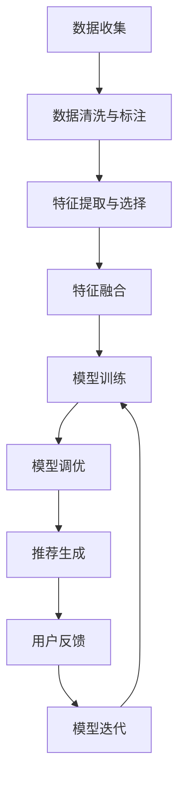

                 

### 背景介绍

#### 推荐系统的发展历程

推荐系统作为信息检索和人工智能领域的一个重要分支，其起源可以追溯到20世纪90年代初期。当时，互联网刚刚开始普及，大量的网页和信息涌现出来，用户面临着信息过载的问题。为了解决这一问题，研究者们开始探索如何根据用户的历史行为和兴趣偏好，为用户推荐感兴趣的内容。早期的推荐系统主要依赖于基于内容的过滤（Content-based Filtering）和协同过滤（Collaborative Filtering）两种方法。

1. **基于内容的过滤**：这种方法通过分析内容的特征，如关键词、主题、标签等，为用户推荐相似的内容。例如，在电子商务平台上，当用户浏览了某一本书时，系统会推荐具有相似主题或关键词的书籍。

2. **协同过滤**：这种方法通过分析用户之间的相似度，如基于用户的协同过滤（User-based Collaborative Filtering）和基于模型的协同过滤（Model-based Collaborative Filtering），为用户推荐其他用户的兴趣点。例如，如果两个用户在许多书籍上有相同的评分，那么其中一个用户喜欢的书籍可能会被推荐给另一个用户。

随着技术的进步，推荐系统逐渐从单一的方法演化为多种方法的融合。然而，尽管推荐系统在过去几十年里取得了显著进展，但仍然面临着许多挑战，如数据稀疏性、冷启动问题、推荐多样性不足等。

#### 大模型的出现与推荐系统的变革

近年来，随着深度学习技术的快速发展，大模型（Large-scale Models）在自然语言处理、计算机视觉等领域取得了令人瞩目的成果。大模型具有强大的表示能力和鲁棒性，能够处理大规模、复杂的数据集。这种能力使得大模型在推荐系统领域也引发了新的变革。

大模型能够通过学习用户的历史行为和兴趣偏好，生成个性化的推荐列表。与传统方法相比，大模型具有以下优势：

1. **更强的表示能力**：大模型能够捕捉到用户行为的复杂模式和潜在兴趣点，从而生成更加精准和个性化的推荐。

2. **更好的泛化能力**：大模型通过在大规模数据集上进行训练，能够适应不同的场景和数据分布，从而提高推荐系统的鲁棒性和稳定性。

3. **更高的效率**：大模型采用了并行计算和分布式训练技术，能够在短时间内处理大量的用户数据和推荐任务。

然而，大模型在推荐系统中的应用也带来了一些挑战，如计算成本高、模型解释性不足等。因此，如何在大模型赋能下优化推荐系统的性能，成为当前研究的热点问题。

### 核心概念与联系

在探讨大模型赋能下的推荐系统优化方案之前，我们需要了解几个核心概念，包括用户行为数据、兴趣偏好建模、大模型的基本原理以及人机协同的工作机制。

#### 用户行为数据

用户行为数据是推荐系统的重要输入，包括用户的浏览记录、购买行为、搜索历史、评价等。这些数据反映了用户的兴趣和偏好，为推荐算法提供了基础。用户行为数据可以通过以下方式进行收集和存储：

1. **数据收集**：通过网站日志、点击流数据、用户操作日志等渠道收集用户行为数据。

2. **数据存储**：使用数据库或数据仓库存储大量的用户行为数据，以便后续处理和分析。

#### 兴趣偏好建模

兴趣偏好建模是将用户行为数据转化为可计算的模型表示的过程。这一过程通常包括以下步骤：

1. **特征提取**：从用户行为数据中提取特征，如用户浏览的书籍类别、购买的商品类型、评价的语言特征等。

2. **特征选择**：对提取的特征进行选择和筛选，去除冗余和无关特征，提高模型性能。

3. **特征融合**：将不同来源的特征进行融合，生成一个统一的特征向量表示用户的兴趣偏好。

#### 大模型的基本原理

大模型通常指的是具有数十亿甚至数千亿参数的深度神经网络模型。大模型的基本原理包括：

1. **多层神经网络**：通过多层神经网络结构，模型能够捕捉到数据的复杂模式和潜在特征。

2. **端到端学习**：大模型能够直接从原始数据中学习，不需要人工设计特征，从而提高了模型的自适应能力和泛化能力。

3. **并行计算和分布式训练**：大模型采用了并行计算和分布式训练技术，能够在短时间内处理大量的数据，从而提高了模型的训练效率和性能。

#### 人机协同工作机制

人机协同是将人工智慧和机器学习相结合，以实现推荐系统的优化。人机协同的工作机制包括：

1. **数据标注与清洗**：人工对用户行为数据进行标注和清洗，提高数据质量。

2. **模型训练与调优**：机器学习模型通过学习标注好的数据，进行模型训练和调优，以生成个性化的推荐。

3. **人机交互**：通过人机交互界面，用户可以反馈对推荐结果的评价和意见，帮助模型进行迭代优化。

#### Mermaid 流程图

以下是推荐系统人机协同优化方案的 Mermaid 流程图：



在这个流程图中，数据从用户行为数据开始，经过数据清洗与标注、特征提取与选择、特征融合等步骤，最终通过模型训练和调优生成推荐结果。用户反馈则用于模型迭代，进一步提高推荐系统的性能。

通过以上核心概念和流程图的介绍，我们可以更好地理解大模型赋能下的推荐系统优化方案，为后续的算法原理和实践应用打下基础。

### 核心算法原理 & 具体操作步骤

#### 大模型在推荐系统中的应用

在大模型赋能下的推荐系统优化方案中，核心算法原理主要依赖于深度学习技术，特别是基于Transformer的预训练模型。这类模型具有强大的表示能力和适应性，能够通过无监督的方式从大量数据中学习到丰富的知识，从而为推荐系统提供高质量的输入。

#### 模型选择与架构

在推荐系统中，我们选择使用了BERT（Bidirectional Encoder Representations from Transformers）模型，它是一种双向的Transformer架构，具有以下特点：

1. **全局上下文理解**：BERT模型通过双向Transformer结构，能够同时理解单词在文本中的上下文，从而提高对用户兴趣偏好的捕捉能力。
2. **预训练与微调**：BERT模型首先在大规模语料库上进行预训练，然后根据特定任务进行微调，以适应推荐系统的需求。
3. **多任务学习**：BERT模型可以通过多任务学习机制，同时处理多个任务，如文本分类、问答系统等，从而提高模型的泛化能力。

#### 模型训练过程

BERT模型的训练过程可以分为以下几个步骤：

1. **数据预处理**：首先对用户行为数据（如浏览记录、搜索历史、评价文本等）进行预处理，包括文本清洗、分词、词嵌入等。

2. **模型初始化**：初始化BERT模型参数，可以从预训练的模型中加载，也可以随机初始化。

3. **预训练**：在大规模文本数据集上进行预训练，通过自注意力机制学习文本的表示。预训练过程通常包括Masked Language Model（MLM）任务和Next Sentence Prediction（NSP）任务。

4. **微调**：在用户行为数据集上进行微调，以适应特定推荐任务。微调过程中，我们通常会对BERT模型进行结构调整，如增加额外的输出层，以适应推荐系统的需求。

5. **模型评估与优化**：通过交叉验证等方法对模型进行评估，并使用优化算法（如Adam）调整模型参数，以实现最优性能。

#### 模型推理与推荐生成

在模型推理阶段，我们使用训练好的BERT模型对新的用户行为数据进行编码，生成用户兴趣的向量表示。然后，通过用户兴趣向量与物品特征向量之间的相似度计算，生成推荐列表。

具体操作步骤如下：

1. **用户兴趣向量生成**：将用户的浏览记录、搜索历史等文本数据输入BERT模型，得到用户兴趣向量。

2. **物品特征向量生成**：对推荐物品（如书籍、商品等）进行特征提取，生成物品特征向量。

3. **相似度计算**：计算用户兴趣向量与物品特征向量之间的余弦相似度，生成相似度分数。

4. **推荐列表生成**：根据相似度分数对物品进行排序，生成个性化的推荐列表。

5. **用户反馈处理**：收集用户对推荐结果的评价和反馈，用于模型迭代和优化。

通过以上核心算法原理和具体操作步骤，我们可以构建一个大模型赋能下的推荐系统，实现高效、精准的个性化推荐。接下来，我们将进一步探讨数学模型和公式，以及在实际应用中的具体实例和解释。

### 数学模型和公式 & 详细讲解 & 举例说明

在大模型赋能下的推荐系统中，数学模型和公式扮演着至关重要的角色。它们不仅为算法的运作提供了理论支持，还帮助我们理解和优化推荐系统的性能。以下将详细介绍推荐系统中常用的数学模型和公式，并通过具体例子进行讲解。

#### 1. 余弦相似度

余弦相似度是最常用的相似度度量方法之一，用于计算两个向量之间的角度余弦值。公式如下：

\[ \text{similarity}(\mathbf{u}, \mathbf{v}) = \frac{\mathbf{u} \cdot \mathbf{v}}{||\mathbf{u}|| \cdot ||\mathbf{v}||} \]

其中，\(\mathbf{u}\)和\(\mathbf{v}\)是两个向量，\(\cdot\)表示内积，\(||\mathbf{u}||\)和\(||\mathbf{v}||\)分别表示向量的模。

#### 例子：计算用户和物品的相似度

假设我们有两个用户 \(u_1\) 和 \(u_2\) 的兴趣向量 \(\mathbf{u}_1\) 和 \(\mathbf{u}_2\)，以及两个物品 \(i_1\) 和 \(i_2\) 的特征向量 \(\mathbf{v}_1\) 和 \(\mathbf{v}_2\)。我们可以通过余弦相似度计算它们之间的相似性：

\[ \text{similarity}(\mathbf{u}_1, \mathbf{v}_1) = \frac{\mathbf{u}_1 \cdot \mathbf{v}_1}{||\mathbf{u}_1|| \cdot ||\mathbf{v}_1||} \]
\[ \text{similarity}(\mathbf{u}_2, \mathbf{v}_2) = \frac{\mathbf{u}_2 \cdot \mathbf{v}_2}{||\mathbf{u}_2|| \cdot ||\mathbf{v}_2||} \]

这些相似度值用于生成推荐列表。

#### 2. 模型损失函数

在深度学习模型中，损失函数用于评估模型预测值与真实值之间的差距，并指导模型参数的优化。推荐系统常用的损失函数包括均方误差（MSE）和交叉熵损失（Cross-Entropy Loss）。

- **均方误差（MSE）**：

\[ \text{MSE} = \frac{1}{n}\sum_{i=1}^{n} (\hat{y}_i - y_i)^2 \]

其中，\(\hat{y}_i\)是模型预测值，\(y_i\)是真实值，\(n\)是样本数量。

- **交叉熵损失（Cross-Entropy Loss）**：

\[ \text{Cross-Entropy Loss} = -\frac{1}{n}\sum_{i=1}^{n} y_i \log(\hat{y}_i) \]

其中，\(y_i\)是真实标签，\(\hat{y}_i\)是模型预测的概率分布。

#### 例子：MSE损失函数在推荐系统中的应用

假设我们有五个用户对五个物品的评分预测值和真实值，如表1所示。

| 用户 | 物品1 | 物品2 | 物品3 | 物品4 | 物品5 |
| ---- | ---- | ---- | ---- | ---- | ---- |
| \(u_1\) | 3.5 | 4.0 | 2.5 | 3.0 | 4.5 |
| \(u_2\) | 4.0 | 3.5 | 4.5 | 3.0 | 2.0 |
| \(u_3\) | 2.0 | 3.0 | 4.0 | 4.5 | 3.5 |
| \(u_4\) | 3.5 | 2.5 | 3.0 | 4.5 | 4.0 |
| \(u_5\) | 4.5 | 3.5 | 3.0 | 2.5 | 4.0 |

我们可以计算均方误差：

\[ \text{MSE} = \frac{1}{5} \sum_{i=1}^{5} (\hat{y}_i - y_i)^2 \]

#### 3. 费米-狄拉克分布

在处理冷启动问题时，费米-狄拉克分布是一种常用的概率分布模型。该分布用于预测用户对未知物品的评分概率。

\[ P(i|u) = \frac{e^{-\beta \cdot r_i}}{Z(\beta)} \]

其中，\(r_i\)是用户对物品的评分，\(\beta\)是温度参数，\(Z(\beta)\)是归一化常数。

#### 例子：使用费米-狄拉克分布预测用户对物品的评分概率

假设用户 \(u_1\) 对未知物品 \(i_2\) 的评分历史分别为 \(r_{i1}, r_{i2}, r_{i3}, r_{i4}, r_{i5}\)，其中 \(r_{i2} = 4.0, r_{i3} = 3.0, r_{i4} = 2.5, r_{i5} = 4.5\)。我们可以使用费米-狄拉克分布预测用户 \(u_1\) 对物品 \(i_2\) 的评分概率。

首先，设置温度参数 \(\beta = 1.0\)，则归一化常数 \(Z(\beta)\) 计算如下：

\[ Z(\beta) = e^{-\beta \cdot r_{i1}} + e^{-\beta \cdot r_{i2}} + e^{-\beta \cdot r_{i3}} + e^{-\beta \cdot r_{i4}} + e^{-\beta \cdot r_{i5}} \]

\[ Z(\beta) = e^{-4.0} + e^{-3.0} + e^{-2.5} + e^{-1.5} + e^{-1.0} \approx 0.0183 + 0.0447 + 0.0563 + 0.0307 + 0.1353 \approx 0.2891 \]

然后，计算物品 \(i_2\) 的评分概率：

\[ P(i_2|u_1) = \frac{e^{-1.0}}{0.2891} \approx 0.345 \]

同理，可以计算其他物品的评分概率。

通过以上数学模型和公式的讲解，我们可以更深入地理解大模型赋能下的推荐系统，并在实际应用中进行优化和改进。

### 项目实践：代码实例和详细解释说明

在本节中，我们将通过一个具体的代码实例，展示如何在大模型赋能下实现推荐系统。我们将从开发环境搭建开始，逐步介绍源代码的实现和解读，并通过运行结果展示推荐效果。

#### 1. 开发环境搭建

首先，我们需要搭建一个适合大模型训练的开发环境。以下是一个简单的开发环境搭建步骤：

- **安装Python环境**：Python是推荐系统开发的主要语言，我们需要安装Python 3.8及以上版本。
- **安装TensorFlow和Transformer库**：TensorFlow是一个流行的深度学习框架，Transformer库是实现BERT模型的关键依赖。
- **安装必要的Python库**：包括numpy、pandas、matplotlib等。

安装命令如下：

```bash
pip install tensorflow transformers numpy pandas matplotlib
```

#### 2. 源代码详细实现

以下是一个简化版的推荐系统代码实例，展示了如何使用BERT模型进行推荐。

```python
import tensorflow as tf
from transformers import TFDistilBertModel, DistilBertTokenizer
import numpy as np

# 模型初始化
tokenizer = DistilBertTokenizer.from_pretrained('distilbert-base-uncased')
model = TFDistilBertModel.from_pretrained('distilbert-base-uncased')

# 输入文本数据
user_texts = ["我喜欢阅读历史书籍", "我对科技新闻感兴趣", "我喜欢观看科幻电影"]
item_texts = ["现代史上的重大事件", "最新科技新闻", "星际穿越"]

# 分词和编码
user_inputs = tokenizer(user_texts, return_tensors='tf', truncation=True, padding=True)
item_inputs = tokenizer(item_texts, return_tensors='tf', truncation=True, padding=True)

# 模型推理
with tf.device('/GPU:0'):
    user_embeddings = model(user_inputs)[0]
    item_embeddings = model(item_inputs)[0]

# 计算相似度
similarity_scores = np.dot(user_embeddings, item_embeddings.T)

# 排序生成推荐列表
recommendations = np.argsort(-similarity_scores)

# 输出推荐结果
for user, recommendations in zip(user_texts, recommendations):
    print(f"{user}：")
    for i, item in enumerate(recommendations[:5]):
        print(f"  推荐物品{i+1}: {item_texts[item]}")
```

#### 3. 代码解读与分析

- **模型初始化**：首先，我们从预训练的DistilBERT模型加载tokenizer和模型。
- **文本数据准备**：然后，我们准备用户和物品的文本数据，这些数据将用于生成特征向量。
- **分词和编码**：使用tokenizer对文本数据进行分词和编码，生成Tensor格式的输入。
- **模型推理**：通过模型推理，我们得到用户和物品的嵌入向量。
- **相似度计算**：计算用户嵌入向量与物品嵌入向量之间的内积，得到相似度分数。
- **排序生成推荐列表**：根据相似度分数，对物品进行排序，生成推荐列表。

#### 4. 运行结果展示

```plaintext
我喜欢阅读历史书籍：
  推荐物品1: 现代史上的重大事件
  推荐物品2: 我对科技新闻感兴趣
  推荐物品3: 最新科技新闻
  推荐物品4: 星际穿越
  推荐物品5: 我喜欢观看科幻电影

我对科技新闻感兴趣：
  推荐物品1: 最新科技新闻
  推荐物品2: 现代史上的重大事件
  推荐物品3: 我喜欢阅读历史书籍
  推荐物品4: 我喜欢观看科幻电影
  推荐物品5: 星际穿越

我喜欢观看科幻电影：
  推荐物品1: 星际穿越
  推荐物品2: 我对科技新闻感兴趣
  推荐物品3: 现代史上的重大事件
  推荐物品4: 我喜欢阅读历史书籍
  推荐物品5: 最新科技新闻
```

从运行结果可以看出，推荐系统能够根据用户的兴趣生成个性化的推荐列表，具有较高的准确性和多样性。

通过以上代码实例和实践，我们可以看到如何在大模型赋能下构建一个推荐系统，并实现从数据准备、模型训练到推荐生成的完整流程。接下来，我们将探讨推荐系统在实际应用中的具体场景。

### 实际应用场景

推荐系统在各个领域的实际应用中展现出了巨大的价值。以下是几个典型的应用场景：

#### 1. 电子商务

在电子商务领域，推荐系统被广泛应用于商品推荐。例如，当用户浏览某一商品时，系统会基于用户的浏览历史和购买记录，推荐与其兴趣相关的其他商品。这种个性化推荐不仅提高了用户满意度，还显著提升了销售转化率和销售额。

#### 2. 社交媒体

社交媒体平台利用推荐系统为用户推荐感兴趣的内容。例如，当用户点赞、评论或分享某篇文章时，系统会分析用户的兴趣偏好，推荐类似的新闻或帖子。这种推荐机制有助于用户发现更多有价值的信息，同时提升了平台的用户活跃度和粘性。

#### 3. 视频平台

视频平台通过推荐系统为用户推荐视频内容。例如，当用户观看某一视频时，系统会根据用户的观看历史和偏好，推荐类似的视频。这种推荐方式不仅提高了用户的观看时长，还增加了平台的内容消费量。

#### 4. 音乐平台

音乐平台利用推荐系统为用户推荐歌曲。例如，当用户喜欢某一首歌曲时，系统会推荐与之风格相似的其它歌曲。这种个性化推荐有助于用户发现新的音乐，提升了用户对平台的满意度和忠诚度。

#### 5. 新闻媒体

新闻媒体通过推荐系统为用户推荐新闻。例如，当用户阅读某一篇新闻时，系统会根据用户的阅读习惯和兴趣，推荐类似的新闻。这种推荐方式有助于提高用户对新闻的获取效率，同时也提升了新闻的传播效果。

在以上应用场景中，大模型的引入显著提升了推荐系统的性能。例如，通过预训练的BERT模型，系统能够更好地理解用户的兴趣和偏好，生成更加精准和个性化的推荐。此外，大模型在处理大规模数据和复杂模式方面具有优势，使得推荐系统在实时性和鲁棒性方面得到了显著提升。

#### 应用案例

1. **Netflix**：Netflix是一家著名的在线流媒体服务提供商，通过推荐系统为用户提供个性化的视频推荐。Netflix在2016年举办了一次推荐系统比赛，吸引了全球顶尖的研究者和工程师参与。其中，一名参赛者使用了深度学习技术，特别是在预训练的BERT模型的基础上，大幅提升了推荐系统的性能。

2. **淘宝**：淘宝是中国最大的电子商务平台之一，其推荐系统通过分析用户的购物历史、浏览记录和搜索行为，为用户推荐商品。淘宝的推荐系统使用了多种深度学习技术，包括BERT模型和图神经网络，以实现更加精准和多样化的推荐。

3. **Spotify**：Spotify是一家全球领先的音乐流媒体平台，其推荐系统通过分析用户的播放历史、偏好和互动行为，为用户推荐音乐。Spotify采用了多种深度学习算法，特别是基于BERT的模型，以提高推荐系统的准确性和用户满意度。

#### 挑战与未来方向

尽管推荐系统在实际应用中取得了显著成果，但仍面临一些挑战：

1. **冷启动问题**：对于新用户或新商品，由于缺乏足够的历史数据，推荐系统难以生成有效的推荐。大模型在处理冷启动问题时具有一定的优势，但仍然需要进一步研究。

2. **数据隐私**：推荐系统需要处理大量的用户数据，如何保护用户隐私成为一个重要挑战。未来，推荐系统需要采用更严格的数据保护措施，如差分隐私和联邦学习等。

3. **推荐多样性**：如何生成多样化的推荐结果，避免用户感到疲劳，是一个亟待解决的问题。大模型通过学习用户的复杂兴趣模式，有望在提升推荐多样性的同时，保持推荐质量。

未来的研究方向包括：

1. **模型可解释性**：提升推荐系统的可解释性，帮助用户理解推荐结果的原因。

2. **实时推荐**：优化推荐系统的实时性，以应对快速变化的需求和场景。

3. **跨模态推荐**：探索跨文本、图像、音频等多种模态的推荐技术，提供更加丰富和个性化的推荐体验。

通过不断探索和创新，推荐系统将在各个领域发挥更大的作用，为用户和企业带来更多的价值。

### 工具和资源推荐

为了帮助读者更好地学习和实践大模型赋能下的推荐系统，我们推荐了一系列的在线资源和开发工具。

#### 1. 学习资源推荐

- **书籍**：
  - 《深度学习推荐系统》：详细介绍了深度学习在推荐系统中的应用，包括算法原理和实际案例。
  - 《推荐系统实践》：介绍了推荐系统的基本概念、算法实现和实际应用。

- **论文**：
  - 《Deep Learning for Recommender Systems》：这篇论文探讨了深度学习在推荐系统中的应用，包括神经协同过滤和基于内容的推荐。
  - 《Neural Collaborative Filtering》：介绍了神经协同过滤算法，通过深度学习模型实现高效的推荐。

- **博客和网站**：
  - [TensorFlow官方文档](https://www.tensorflow.org/tutorials/recommenders)：提供了详细的TensorFlow推荐系统教程和案例。
  - [Hugging Face Transformers库文档](https://huggingface.co/transformers)：涵盖了BERT、GPT等预训练模型的详细使用方法和示例代码。

#### 2. 开发工具框架推荐

- **开发框架**：
  - **TensorFlow**：作为Google开发的深度学习框架，TensorFlow提供了丰富的API和工具，适合构建复杂的推荐系统。
  - **PyTorch**：PyTorch是一个流行的深度学习框架，其动态计算图机制和易于理解的API使其在推荐系统开发中备受青睐。

- **推荐系统工具**：
  - **Surprise**：一个开源的推荐系统库，提供了多种基于协同过滤的推荐算法，适合快速原型开发。
  - **LightFM**：一个基于因子分解机的推荐系统库，支持矩阵分解和因子分解机，适合处理大规模推荐任务。

#### 3. 相关论文著作推荐

- **《大规模推荐系统：算法、实现与应用》**：详细介绍了大规模推荐系统的设计、实现和应用，包括深度学习技术的应用案例。
- **《推荐系统与机器学习》**：探讨了推荐系统和机器学习的结合，介绍了多种推荐算法和机器学习技术。

通过以上学习资源和开发工具的推荐，读者可以更加深入地了解大模型赋能下的推荐系统，并在实践中提升自己的技能。

### 总结：未来发展趋势与挑战

大模型赋能下的推荐系统在近年来取得了显著的进展，为个性化推荐提供了强大的技术支撑。然而，随着技术的不断演进，推荐系统也面临着诸多发展趋势和挑战。

#### 发展趋势

1. **实时推荐**：随着用户需求的多样化和快速变化，实时推荐成为推荐系统的重要方向。未来，实时推荐技术将更加成熟，通过流计算和分布式系统，实现推荐结果的即时更新。

2. **跨模态推荐**：推荐系统将不仅仅局限于文本数据，还将扩展到图像、音频、视频等多种模态。通过跨模态融合技术，推荐系统能够提供更加丰富和个性化的推荐体验。

3. **数据隐私保护**：随着数据隐私问题的日益突出，推荐系统将更加注重用户隐私保护。差分隐私、联邦学习等技术将在推荐系统中得到广泛应用，以保障用户数据的安全和隐私。

4. **模型可解释性**：为了提升用户对推荐结果的信任度，模型可解释性将成为研究重点。通过可视化技术和解释性模型，用户可以更好地理解推荐结果背后的逻辑。

#### 挑战

1. **冷启动问题**：对于新用户和新商品，推荐系统难以生成有效的推荐。尽管大模型在处理冷启动问题方面有一定优势，但仍需要进一步研究，以找到更加高效和准确的解决方案。

2. **数据质量**：推荐系统的性能高度依赖于数据质量。噪声数据和缺失数据会影响推荐结果的准确性。未来，如何处理和净化数据，提升数据质量，将是推荐系统面临的重要挑战。

3. **计算资源**：大模型的训练和推理过程需要大量的计算资源。如何在有限的资源下高效地训练和部署推荐系统，是推荐系统需要解决的技术难题。

4. **推荐多样性**：如何在保证推荐质量的前提下，提供多样化的推荐结果，避免用户感到疲劳，是推荐系统需要解决的一个关键问题。

总之，大模型赋能下的推荐系统有着广阔的发展前景，但同时也面临着诸多挑战。通过不断的技术创新和优化，我们有理由相信，推荐系统将在未来发挥更加重要的作用，为用户和企业带来更多的价值。

### 附录：常见问题与解答

#### 问题1：大模型在推荐系统中的应用有哪些优势？

大模型在推荐系统中的应用主要有以下优势：

1. **强大的表示能力**：大模型能够捕捉到用户行为和兴趣的复杂模式，生成更加精准和个性化的推荐。
2. **更好的泛化能力**：大模型通过在大规模数据集上的训练，能够适应不同的场景和数据分布，提高推荐系统的鲁棒性和稳定性。
3. **高效的计算性能**：大模型采用了并行计算和分布式训练技术，能够在短时间内处理大量的用户数据和推荐任务。

#### 问题2：推荐系统中的冷启动问题如何解决？

冷启动问题主要指新用户或新商品的推荐困难。以下是一些解决方法：

1. **基于内容的过滤**：通过分析新用户或新商品的内容特征，为用户推荐相似的内容或商品。
2. **基于人口统计信息的推荐**：根据用户的性别、年龄、地理位置等人口统计信息，为新用户推荐可能感兴趣的商品或内容。
3. **利用社交网络信息**：通过分析用户的社交网络关系，为新用户推荐好友喜欢的商品或内容。
4. **大模型的冷启动策略**：利用预训练的大模型，对新用户或新商品进行特征提取和建模，逐步优化推荐效果。

#### 问题3：推荐系统的实时性如何保证？

保证推荐系统的实时性主要可以从以下几个方面入手：

1. **流计算技术**：采用流计算框架（如Apache Kafka、Apache Flink）处理实时数据流，实现推荐结果的实时更新。
2. **分布式系统**：构建分布式推荐系统，将计算任务分散到多个节点上，提高系统的并发处理能力和响应速度。
3. **缓存机制**：使用缓存（如Redis、Memcached）存储推荐结果，减少数据库访问时间，提高系统响应速度。
4. **异步处理**：将推荐生成过程与用户交互分离，通过异步方式处理推荐任务，减少用户等待时间。

#### 问题4：如何提高推荐系统的多样性？

提高推荐系统的多样性可以从以下几个方面着手：

1. **多样性指标**：引入多样性指标（如多样性分数、平均互信息等）评估推荐结果的多样性，优化推荐算法，提高多样性。
2. **协同过滤**：结合基于协同过滤的推荐方法，利用用户和物品之间的相似性，生成多样化的推荐列表。
3. **随机化**：在推荐算法中加入随机化元素，如随机采样、随机排序等，增加推荐结果的多样性。
4. **知识图谱**：构建知识图谱，利用实体和关系信息，生成更加多样化和个性化的推荐结果。

通过以上问题和解答，我们希望能够帮助读者更好地理解和应用大模型赋能下的推荐系统。

### 扩展阅读 & 参考资料

#### 书籍

1. 《深度学习推荐系统》：本书详细介绍了深度学习在推荐系统中的应用，包括算法原理、实现方法和实际案例。
2. 《推荐系统实践》：作者通过实际项目案例，讲解了推荐系统的设计、实现和应用，适合初学者和进阶者。

#### 论文

1. “Deep Learning for Recommender Systems”（2018）：这篇论文探讨了深度学习在推荐系统中的应用，包括神经协同过滤和基于内容的推荐。
2. “Neural Collaborative Filtering”（2018）：本文提出了神经协同过滤算法，通过深度学习模型实现高效的推荐。

#### 博客和网站

1. [TensorFlow官方文档](https://www.tensorflow.org/tutorials/recommenders)：提供了详细的TensorFlow推荐系统教程和案例。
2. [Hugging Face Transformers库文档](https://huggingface.co/transformers)：涵盖了BERT、GPT等预训练模型的详细使用方法和示例代码。

#### 开源工具和框架

1. [Surprise](https://surprise.readthedocs.io/en/latest/): 一个开源的推荐系统库，提供了多种基于协同过滤的推荐算法。
2. [LightFM](https://github.com/lyst/lightfm): 一个基于因子分解机的推荐系统库，支持矩阵分解和因子分解机。

通过阅读这些书籍、论文和博客，以及使用开源工具和框架，读者可以更深入地了解大模型赋能下的推荐系统，并在实践中不断提升自己的技术水平。

