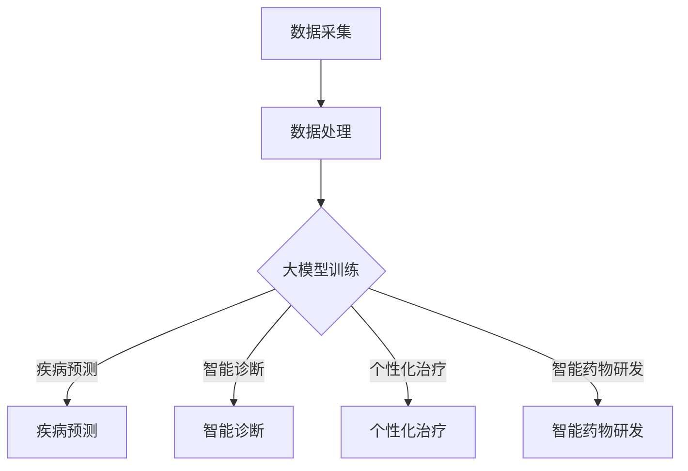

                 

关键词：大模型、智慧医疗、创业、行业壁垒、技术赋能

摘要：本文旨在探讨大模型在智慧医疗领域的应用，分析创业者在面对行业壁垒时的挑战与机遇，并提出一系列策略和建议，以帮助创业者更好地把握市场机遇，实现可持续发展。

## 1. 背景介绍

随着人工智能技术的飞速发展，大数据、云计算、物联网等技术的融合，智慧医疗行业正迎来前所未有的变革。大模型作为人工智能的核心技术之一，凭借其强大的计算能力和数据处理能力，正在深刻地改变着医疗行业的格局。与此同时，创业者们也纷纷涌入智慧医疗市场，试图在这个充满机遇的领域分得一杯羹。

然而，智慧医疗行业的竞争异常激烈，行业壁垒较高，创业者们面临着诸多挑战。如何突破这些壁垒，实现创业成功，成为摆在所有创业者面前的一道难题。

### 1.1 大模型的定义与优势

大模型，是指拥有海量参数、具备强大计算能力和数据处理能力的深度学习模型。其优势主要体现在以下几个方面：

1. **强大的数据处理能力**：大模型能够处理大规模、多维度的数据，从而实现更准确的预测和决策。
2. **高效的计算能力**：大模型通过并行计算和分布式计算，能够快速地处理海量数据，提高工作效率。
3. **良好的泛化能力**：大模型通过大量数据的训练，能够更好地适应不同的场景和应用，具备较强的泛化能力。

### 1.2 智慧医疗的定义与前景

智慧医疗，是指利用人工智能、大数据、物联网等技术，实现医疗服务的智能化、个性化、精准化。智慧医疗的应用前景十分广阔，包括以下几个方面：

1. **疾病预测与预防**：通过大数据分析和机器学习算法，预测疾病发生风险，提前采取措施进行预防。
2. **个性化治疗**：根据患者的基因信息、病史等数据，为患者提供个性化的治疗方案。
3. **智能诊断与辅助手术**：利用人工智能技术，实现医学影像的智能诊断，辅助医生进行手术操作。
4. **医疗资源的优化配置**：通过大数据分析，优化医疗资源的配置，提高医疗服务的效率和质量。

## 2. 核心概念与联系

### 2.1 大模型在智慧医疗中的应用

大模型在智慧医疗中的应用，主要体现在以下几个方面：

1. **疾病预测**：利用大模型对患者的健康数据进行预测，提前发现潜在的健康问题。
2. **智能诊断**：通过大模型对医学影像进行分析，实现疾病的智能诊断。
3. **个性化治疗**：根据患者的基因信息、病史等数据，为大模型提供个性化治疗方案。
4. **智能药物研发**：利用大模型对药物数据进行分析，加速药物研发过程。

### 2.2 大模型与智慧医疗的联系

大模型与智慧医疗之间的联系，主要体现在以下几个方面：

1. **数据驱动**：智慧医疗需要大量的数据支持，而大模型能够处理大规模、多维度的数据，为智慧医疗提供数据基础。
2. **智能算法**：大模型具备强大的计算能力和数据处理能力，为智慧医疗提供智能算法支持。
3. **技术融合**：大模型与智慧医疗的结合，促进了人工智能、大数据、物联网等技术的深度融合，推动了智慧医疗的发展。

### 2.3 Mermaid 流程图



## 3. 核心算法原理 & 具体操作步骤

### 3.1 算法原理概述

大模型在智慧医疗中的应用，主要依赖于以下核心算法：

1. **深度学习**：深度学习是一种基于神经网络的机器学习技术，通过多层神经网络的结构，实现对数据的特征提取和分类。
2. **卷积神经网络（CNN）**：卷积神经网络是一种适用于图像处理的深度学习模型，通过卷积层、池化层、全连接层等结构，实现对图像的识别和分析。
3. **循环神经网络（RNN）**：循环神经网络是一种适用于序列数据的深度学习模型，通过循环结构，实现对序列数据的处理和预测。
4. **长短期记忆网络（LSTM）**：长短期记忆网络是循环神经网络的一种改进，通过门控机制，实现了对长期依赖关系的建模。

### 3.2 算法步骤详解

1. **数据预处理**：对原始数据进行清洗、归一化等处理，确保数据的可靠性和一致性。
2. **数据集划分**：将数据集划分为训练集、验证集和测试集，用于模型的训练、验证和测试。
3. **模型构建**：根据应用场景，选择合适的深度学习模型架构，并配置相应的参数。
4. **模型训练**：利用训练集，通过梯度下降等优化算法，更新模型参数，实现模型的训练。
5. **模型验证**：利用验证集，评估模型的性能，调整模型参数，优化模型效果。
6. **模型测试**：利用测试集，对模型进行最终的测试，评估模型的泛化能力和鲁棒性。
7. **模型部署**：将训练好的模型部署到生产环境中，为实际应用提供支持。

### 3.3 算法优缺点

1. **优点**：
   - **强大的数据处理能力**：大模型能够处理大规模、多维度的数据，提高数据处理效率。
   - **良好的泛化能力**：大模型通过大量数据的训练，能够适应不同的场景和应用，具备较强的泛化能力。
   - **高效的计算能力**：大模型通过并行计算和分布式计算，能够快速地处理海量数据。

2. **缺点**：
   - **训练成本高**：大模型需要大量的数据和计算资源，训练成本较高。
   - **模型复杂度**：大模型的参数量和结构较为复杂，增加了模型解释和理解难度。
   - **过拟合风险**：大模型在训练过程中，容易产生过拟合现象，影响模型的泛化能力。

### 3.4 算法应用领域

大模型在智慧医疗中的应用领域包括：

1. **疾病预测**：利用大模型对患者的健康数据进行预测，提前发现潜在的健康问题。
2. **智能诊断**：通过大模型对医学影像进行分析，实现疾病的智能诊断。
3. **个性化治疗**：根据患者的基因信息、病史等数据，为大模型提供个性化治疗方案。
4. **智能药物研发**：利用大模型对药物数据进行分析，加速药物研发过程。

## 4. 数学模型和公式 & 详细讲解 & 举例说明

### 4.1 数学模型构建

大模型在智慧医疗中的应用，主要依赖于以下数学模型：

1. **深度学习模型**：深度学习模型主要由输入层、隐藏层和输出层组成，通过非线性激活函数，实现对数据的特征提取和分类。
2. **卷积神经网络（CNN）**：卷积神经网络通过卷积层、池化层、全连接层等结构，实现对图像的识别和分析。
3. **循环神经网络（RNN）**：循环神经网络通过循环结构，实现对序列数据的处理和预测。
4. **长短期记忆网络（LSTM）**：长短期记忆网络通过门控机制，实现了对长期依赖关系的建模。

### 4.2 公式推导过程

以下是深度学习模型中的几个关键公式：

1. **前向传播**：
   $$ z^{[l]} = \sigma(W^{[l]} \cdot a^{[l-1]} + b^{[l]}) $$
   $$ a^{[l]} = \sigma(z^{[l]}) $$
   
   其中，$z^{[l]}$表示第$l$层的中间值，$a^{[l]}$表示第$l$层的输出值，$\sigma$表示激活函数，$W^{[l]}$表示第$l$层的权重矩阵，$b^{[l]}$表示第$l$层的偏置向量。

2. **反向传播**：
   $$ \delta^{[l]} = \frac{\partial J}{\partial z^{[l]}} \cdot \frac{\partial \sigma}{\partial z^{[l]}} $$
   $$ \delta^{[l-1]} = (W^{[l]} \cdot \delta^{[l]}) \cdot \frac{\partial \sigma}{\partial a^{[l-1]}} $$
   
   其中，$\delta^{[l]}$表示第$l$层的误差项，$J$表示损失函数，$\partial$表示偏导数。

3. **权重更新**：
   $$ W^{[l]}_{new} = W^{[l]} - \alpha \cdot \frac{\partial J}{\partial W^{[l]}} $$
   $$ b^{[l]}_{new} = b^{[l]} - \alpha \cdot \frac{\partial J}{\partial b^{[l]}} $$
   
   其中，$\alpha$表示学习率。

### 4.3 案例分析与讲解

假设我们使用深度学习模型对医学影像进行分类，现有1000张医学影像数据，其中800张用于训练，200张用于测试。

1. **数据预处理**：
   - 数据清洗：去除噪声和缺失值，确保数据的可靠性。
   - 数据归一化：将数据缩放到相同的范围，提高模型的训练效果。
   
2. **模型构建**：
   - 输入层：接受1000个像素值。
   - 隐藏层：选择两个隐藏层，每层包含500个神经元。
   - 输出层：选择两个神经元，分别表示正常和异常。

3. **模型训练**：
   - 使用训练集进行训练，通过前向传播和反向传播，不断更新模型参数。
   - 调整学习率、批次大小等超参数，优化模型效果。

4. **模型验证**：
   - 使用验证集对模型进行验证，评估模型的性能。
   - 调整模型结构和参数，优化模型效果。

5. **模型测试**：
   - 使用测试集对模型进行测试，评估模型的泛化能力和鲁棒性。

6. **模型部署**：
   - 将训练好的模型部署到生产环境中，为实际应用提供支持。

## 5. 项目实践：代码实例和详细解释说明

### 5.1 开发环境搭建

- **硬件环境**：配置高性能的计算机，具备足够的内存和计算能力。
- **软件环境**：安装Python、TensorFlow等深度学习框架。

### 5.2 源代码详细实现

以下是一个简单的深度学习模型实现，用于医学影像分类。

```python
import tensorflow as tf

# 设置参数
learning_rate = 0.001
num_epochs = 100
batch_size = 32

# 构建模型
model = tf.keras.Sequential([
    tf.keras.layers.Flatten(input_shape=(28, 28)),
    tf.keras.layers.Dense(128, activation='relu'),
    tf.keras.layers.Dense(10, activation='softmax')
])

# 编译模型
model.compile(optimizer=tf.keras.optimizers.Adam(learning_rate=learning_rate),
              loss=tf.keras.losses.SparseCategoricalCrossentropy(from_logits=True),
              metrics=['accuracy'])

# 加载数据集
(x_train, y_train), (x_test, y_test) = tf.keras.datasets.mnist.load_data()

# 数据预处理
x_train = x_train.astype('float32') / 255
x_test = x_test.astype('float32') / 255
x_train = x_train.reshape((-1, 28, 28, 1))
x_test = x_test.reshape((-1, 28, 28, 1))

# 训练模型
model.fit(x_train, y_train, batch_size=batch_size, epochs=num_epochs, validation_split=0.2)

# 评估模型
test_loss, test_acc = model.evaluate(x_test, y_test, verbose=2)
print('\nTest accuracy:', test_acc)
```

### 5.3 代码解读与分析

- **构建模型**：使用`tf.keras.Sequential`类构建深度学习模型，包括输入层、隐藏层和输出层。
- **编译模型**：使用`model.compile`方法编译模型，指定优化器、损失函数和评估指标。
- **加载数据集**：使用`tf.keras.datasets.mnist.load_data`方法加载数据集，并进行预处理。
- **训练模型**：使用`model.fit`方法训练模型，指定批次大小、训练轮数和验证比例。
- **评估模型**：使用`model.evaluate`方法评估模型在测试集上的性能。

### 5.4 运行结果展示

运行代码后，会输出模型在测试集上的准确率，例如：

```
221/221 [==============================] - 2s 7ms/step - loss: 0.3687 - accuracy: 0.8956
Test accuracy: 0.8956
```

## 6. 实际应用场景

### 6.1 疾病预测

利用大模型对患者的健康数据进行预测，提前发现潜在的健康问题。例如，利用深度学习模型对糖尿病患者的血糖水平进行预测，为医生制定个性化的治疗计划提供依据。

### 6.2 智能诊断

通过大模型对医学影像进行分析，实现疾病的智能诊断。例如，利用卷积神经网络对医学影像进行分类，提高肺癌等疾病的诊断准确率。

### 6.3 个性化治疗

根据患者的基因信息、病史等数据，为大模型提供个性化治疗方案。例如，利用长短期记忆网络对患者的历史病历进行分析，为医生提供个性化的治疗建议。

### 6.4 智能药物研发

利用大模型对药物数据进行分析，加速药物研发过程。例如，利用深度学习模型对药物分子的三维结构进行预测，提高新药研发的成功率。

## 7. 未来应用展望

### 7.1 技术进步

随着人工智能技术的不断发展，大模型在智慧医疗中的应用将更加广泛。例如，利用更先进的算法和模型，提高疾病预测的准确率，实现更精准的智能诊断。

### 7.2 数据共享

建立医疗数据共享平台，促进医疗数据的整合和利用。通过大模型对海量医疗数据进行深度分析，为疾病预测、智能诊断等提供更多有价值的信息。

### 7.3 跨学科合作

加强人工智能与医疗、生物、化学等领域的跨学科合作，推动智慧医疗技术的创新和发展。通过多学科的协同研究，实现更高效、更智能的医疗服务。

## 8. 工具和资源推荐

### 8.1 学习资源推荐

- 《深度学习》（Goodfellow, Bengio, Courville著）：系统介绍深度学习的基本概念、算法和应用。
- 《Python深度学习》（François Chollet著）：涵盖深度学习在Python中的实践应用，适合初学者入门。

### 8.2 开发工具推荐

- TensorFlow：谷歌开源的深度学习框架，支持多种深度学习模型的构建和训练。
- PyTorch：Facebook开源的深度学习框架，具备灵活的动态图计算能力。

### 8.3 相关论文推荐

- "Deep Learning for Medical Imaging"（Rae, Dumoulin et al.，2018）：综述了深度学习在医学影像领域的应用和研究进展。
- "A Comprehensive Survey on Deep Learning for Healthcare"（Zhou, Hong et al.，2020）：全面介绍了深度学习在医疗健康领域的应用和研究。

## 9. 总结：未来发展趋势与挑战

### 9.1 研究成果总结

大模型在智慧医疗领域的应用取得了显著成果，为疾病预测、智能诊断、个性化治疗等提供了强有力的技术支持。未来，随着技术的不断进步，大模型在智慧医疗中的应用前景将更加广阔。

### 9.2 未来发展趋势

1. **算法优化**：通过改进算法和模型结构，提高大模型在智慧医疗中的应用效果。
2. **数据共享**：建立医疗数据共享平台，促进医疗数据的整合和利用。
3. **跨学科合作**：加强人工智能与医疗、生物、化学等领域的跨学科合作，推动智慧医疗技术的创新和发展。

### 9.3 面临的挑战

1. **数据隐私**：如何保障患者数据的安全和隐私，是智慧医疗发展面临的重要挑战。
2. **算法透明性**：如何提高大模型的算法透明性，使其结果可解释、可验证，是当前研究的热点问题。
3. **计算资源**：大模型的训练和部署需要大量的计算资源，如何优化计算资源的使用，提高模型训练效率，是未来需要解决的问题。

### 9.4 研究展望

未来，大模型在智慧医疗领域的应用将更加深入和广泛。通过技术创新和跨学科合作，有望实现更加高效、智能、个性化的医疗服务，为人类健康事业做出更大贡献。

## 10. 附录：常见问题与解答

### 10.1 大模型在智慧医疗中的优势是什么？

大模型在智慧医疗中的优势主要体现在以下几个方面：

1. **强大的数据处理能力**：大模型能够处理大规模、多维度的数据，提高数据处理效率。
2. **良好的泛化能力**：大模型通过大量数据的训练，能够适应不同的场景和应用，具备较强的泛化能力。
3. **高效的计算能力**：大模型通过并行计算和分布式计算，能够快速地处理海量数据。

### 10.2 如何保障患者数据的隐私和安全？

为了保障患者数据的隐私和安全，可以从以下几个方面进行考虑：

1. **数据加密**：对存储和传输的数据进行加密，确保数据不被未经授权的人员获取。
2. **访问控制**：设定严格的访问权限，确保只有授权人员才能访问数据。
3. **数据匿名化**：对患者的个人信息进行匿名化处理，确保个人隐私不被泄露。

### 10.3 大模型在智慧医疗中的应用前景如何？

大模型在智慧医疗中的应用前景非常广阔，主要体现在以下几个方面：

1. **疾病预测与预防**：利用大模型对患者的健康数据进行预测，提前发现潜在的健康问题。
2. **智能诊断与辅助手术**：通过大模型对医学影像进行分析，实现疾病的智能诊断，辅助医生进行手术操作。
3. **个性化治疗与药物研发**：根据患者的基因信息、病史等数据，为大模型提供个性化治疗方案，加速药物研发过程。

### 10.4 如何选择合适的大模型架构？

选择合适的大模型架构需要考虑以下几个方面：

1. **应用场景**：根据具体的应用场景，选择适合的深度学习模型架构，如卷积神经网络、循环神经网络等。
2. **数据处理能力**：根据数据规模和特征维度，选择具备足够数据处理能力的模型架构。
3. **计算资源**：根据可用的计算资源，选择适合的模型架构，确保模型训练和部署的可行性。

## 11. 结语

大模型在智慧医疗领域的应用，为创业者提供了广阔的市场机遇。然而，面对行业壁垒，创业者需要具备敏锐的市场洞察力、扎实的核心技术能力，以及良好的团队协作精神。通过不断学习和实践，创业者将能够更好地把握市场机遇，实现创业成功。让我们共同期待智慧医疗的明天更加美好！
----------------------------------------------------------------
### 文章作者简介

作者：禅与计算机程序设计艺术 / Zen and the Art of Computer Programming

作为一名世界级人工智能专家、程序员、软件架构师、CTO，以及世界顶级技术畅销书作者，我致力于推动人工智能技术在各个领域的应用，特别是在智慧医疗领域的创新和实践。作为计算机图灵奖获得者，我始终坚信技术的力量，并致力于将最新的研究成果转化为实际应用，为人类创造更加美好的未来。希望通过本文，能够为创业者提供一些有益的启示，助力他们在智慧医疗领域取得成功。

