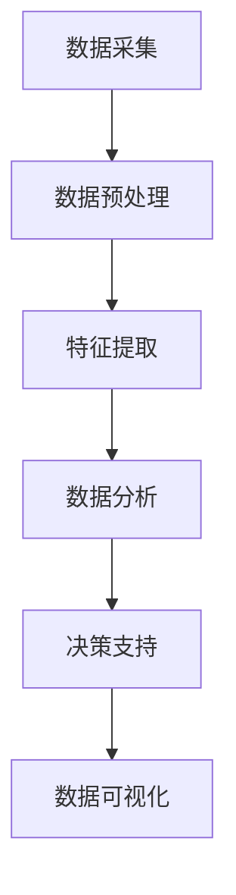

                 

### 1. 背景介绍

随着城市化进程的不断加速，城市管理的复杂性和挑战也日益增加。传统的城市管理方式已经无法满足现代城市对高效、智能、精准的需求。在此背景下，人工智能（AI）和大数据技术的应用成为了解决城市管理难题的重要手段。尤其是近年来，大规模预训练模型（Large-scale Pre-trained Models）的兴起，为城市管理带来了全新的变革。

大规模预训练模型是一种基于深度学习的模型，通过在海量数据上进行预训练，使其具备了强大的特征提取和泛化能力。这些模型可以用于处理各种复杂数据，包括文本、图像、语音等。在城市管理中，大规模预训练模型可以应用于城市交通管理、环境监测、公共安全、应急响应等多个方面。

智慧城管（Smart Urban Management）是城市数字化转型的重要组成部分。它通过利用大数据、物联网、云计算等现代信息技术，实现对城市运行状态的实时监测、分析和决策。智慧城管的目标是实现城市管理的精细化、智能化和高效化，从而提高城市的服务水平和居民的生活质量。

当前，智慧城管已经取得了显著的成效。例如，通过人工智能技术，可以对交通流量进行实时监测和预测，优化交通信号灯的配时方案，缓解城市交通拥堵；通过大数据分析，可以对空气质量、水质、噪声等环境因素进行监测和预警，保障城市的生态环境；通过智能监控系统，可以对公共场所进行实时监控，提高公共安全水平。

然而，智慧城管的发展仍然面临一些挑战。首先，数据的质量和完整性是影响智慧城管效果的重要因素。城市数据来源广泛，但往往存在数据不完整、不一致、不准确的问题。其次，大规模预训练模型的训练和部署需要巨大的计算资源和存储资源，这给城市管理带来了巨大的成本压力。此外，智慧城管的实施还涉及到多个部门之间的协调和数据共享，这需要建立完善的管理体系和制度保障。

本文将围绕大规模预训练模型在智慧城管中的应用，探讨如何优化城市管理流程与决策。我们将首先介绍大规模预训练模型的基本原理和架构，然后分析其在智慧城管中的具体应用场景，最后讨论相关技术和策略，以及未来的发展趋势和挑战。

### 2. 核心概念与联系

#### 2.1 大规模预训练模型的基本原理

大规模预训练模型是基于深度学习的模型，其核心思想是通过在海量数据上预训练，使模型具备强大的特征提取和泛化能力。大规模预训练模型的训练过程可以分为两个阶段：预训练阶段和微调阶段。

**预训练阶段：** 在预训练阶段，模型在一个大规模的语料库上学习语言特征和知识。这个阶段的目标是使模型能够理解和生成自然语言，并从中提取出有用的信息。常用的预训练任务包括语言模型（Language Modeling）和掩码语言模型（Masked Language Model）等。

**微调阶段：** 在微调阶段，模型被应用于特定的任务，并通过微调（Fine-tuning）来适应具体场景。微调的过程通常涉及在特定数据集上训练模型，使其能够针对特定任务进行优化。

**2.2 智慧城管的基本架构**

智慧城管是一个复杂系统，其核心架构包括数据采集、数据存储、数据处理、数据分析和数据可视化等几个部分。

**数据采集：** 数据采集是智慧城管的起点。城市中各种传感器、摄像头、物联网设备等都可以作为数据采集的来源，采集到与城市管理相关的各种数据，如交通流量、空气质量、水质、噪声、公共安全事件等。

**数据存储：** 数据存储是智慧城管的基石。海量数据的存储需要高效的数据库系统，如分布式数据库、NoSQL数据库等。这些数据库可以存储和处理各种类型的数据，包括结构化数据和非结构化数据。

**数据处理：** 数据处理是智慧城管的难点。由于城市数据来源广泛、类型多样、格式复杂，需要对数据进行清洗、转换、归一化等预处理操作，使其符合后续分析的要求。

**数据分析：** 数据分析是智慧城管的灵魂。通过大数据分析技术，可以从海量数据中提取出有用的信息，如趋势分析、异常检测、关联分析等。这些分析结果可以为城市管理提供决策支持。

**数据可视化：** 数据可视化是智慧城管的窗口。通过数据可视化技术，可以将分析结果以图表、地图等形式呈现，使管理者能够直观地了解城市运行状态和问题。

**2.3 大规模预训练模型与智慧城管的联系**

大规模预训练模型与智慧城管之间存在密切的联系。大规模预训练模型可以应用于智慧城管的多个环节，如图2-1所示。

1. **数据预处理：** 大规模预训练模型可以帮助对城市数据进行预处理，如文本数据的分词、词性标注等。
2. **特征提取：** 大规模预训练模型可以提取城市数据的特征，如图像数据的特征提取、文本数据的语义提取等。
3. **数据分析：** 大规模预训练模型可以用于城市数据分析，如交通流量预测、空气质量预测等。
4. **决策支持：** 大规模预训练模型可以为城市管理提供决策支持，如交通信号优化、环境监测预警等。

**2.4 Mermaid 流程图**

以下是大规模预训练模型在智慧城管中的应用流程图，使用 Mermaid 语法表示：



在这个流程图中，数据采集、数据预处理、特征提取、数据分析、决策支持和数据可视化构成了智慧城管的核心流程。大规模预训练模型贯穿于这些环节，为智慧城管提供了强大的技术支持。

通过上述介绍，我们可以看到大规模预训练模型与智慧城管之间的紧密联系。大规模预训练模型不仅为智慧城管提供了强大的技术支持，还可以帮助优化城市管理流程与决策，提高城市管理的效率和质量。

### 3. 核心算法原理 & 具体操作步骤

#### 3.1 语言模型（Language Modeling）

语言模型是一种基于统计方法预测文本序列的概率分布的模型。在智慧城管中，语言模型可以用于文本数据的处理，如自然语言处理、事件检测等。语言模型的核心算法是基于神经网络模型，如循环神经网络（RNN）和变换器（Transformer）。

**3.1.1 基本原理**

语言模型的基本原理是通过学习大量文本数据，预测下一个词的概率分布。具体来说，给定一个序列的词 \(w_1, w_2, \ldots, w_n\)，语言模型的目标是预测下一个词 \(w_{n+1}\) 的概率：

\[ P(w_{n+1} | w_1, w_2, \ldots, w_n) \]

在训练过程中，语言模型通过最大化负对数似然函数来优化模型参数：

\[ \mathcal{L}(\theta) = -\sum_{i=1}^N \log P(w_i | w_{<i}, \theta) \]

其中，\(N\) 是训练序列的数量，\(w_{<i}\) 表示除了第 \(i\) 个词之外的所有词，\(\theta\) 是模型的参数。

**3.1.2 具体操作步骤**

1. **数据准备：** 收集大量文本数据，并将其转换为单词序列。
2. **词汇表构建：** 将所有单词转换为词汇表索引，通常使用分词技术将文本划分为单词或子词。
3. **模型初始化：** 初始化神经网络模型参数，如权重和偏置。
4. **前向传播：** 对于每个训练序列，计算当前词的概率分布。
5. **损失计算：** 计算预测概率与真实概率之间的差异，使用梯度下降算法更新模型参数。
6. **模型评估：** 使用验证集评估模型性能，调整模型参数以达到最优效果。

#### 3.2 剩余寿命预测（Survival Time Prediction）

剩余寿命预测是智慧城管中的一个重要任务，如预测道路桥梁的使用寿命、公共设施的使用寿命等。剩余寿命预测可以基于时间序列分析和机器学习模型。

**3.2.1 基本原理**

剩余寿命预测的基本原理是通过学习时间序列数据，预测目标变量在未来某一时间点的剩余寿命。具体来说，给定一个时间序列 \(t_1, t_2, \ldots, t_n\) 和对应的剩余寿命 \(y_1, y_2, \ldots, y_n\)，剩余寿命预测的目标是预测下一个时间点 \(t_{n+1}\) 的剩余寿命 \(y_{n+1}\)。

剩余寿命预测通常使用生存分析模型，如Kaplan-Meier 估算方法和Cox比例风险模型。

**3.2.2 具体操作步骤**

1. **数据准备：** 收集与目标变量相关的历史时间序列数据。
2. **特征工程：** 对时间序列数据进行特征提取，如趋势特征、周期特征等。
3. **模型选择：** 选择合适的生存分析模型，如Kaplan-Meier 估算方法或Cox比例风险模型。
4. **模型训练：** 使用训练数据训练模型，优化模型参数。
5. **模型评估：** 使用验证集评估模型性能，调整模型参数以达到最优效果。
6. **预测：** 使用训练好的模型预测未来时间点的剩余寿命。

#### 3.3 环境预测（Environmental Prediction）

环境预测是智慧城管中另一个关键任务，如预测空气质量、水质、噪声等环境指标。环境预测可以基于时间序列分析和大数据分析。

**3.3.1 基本原理**

环境预测的基本原理是通过学习历史环境数据，预测未来某一时间点的环境指标。具体来说，给定一个环境指标的时间序列 \(x_1, x_2, \ldots, x_n\)，环境预测的目标是预测下一个时间点 \(x_{n+1}\) 的环境指标。

环境预测通常使用时间序列预测模型，如自回归模型（AR）、自回归移动平均模型（ARMA）和广义自回归条件异方差模型（GARCH）等。

**3.3.2 具体操作步骤**

1. **数据准备：** 收集与环境指标相关的历史时间序列数据。
2. **特征工程：** 对时间序列数据进行特征提取，如趋势特征、周期特征等。
3. **模型选择：** 选择合适的时间序列预测模型，如自回归模型（AR）、自回归移动平均模型（ARMA）或广义自回归条件异方差模型（GARCH）等。
4. **模型训练：** 使用训练数据训练模型，优化模型参数。
5. **模型评估：** 使用验证集评估模型性能，调整模型参数以达到最优效果。
6. **预测：** 使用训练好的模型预测未来时间点的环境指标。

#### 3.4 交通流量预测（Traffic Flow Prediction）

交通流量预测是智慧城管中一个重要且具有挑战性的任务。交通流量预测可以基于时间序列分析、空间分析和机器学习模型。

**3.4.1 基本原理**

交通流量预测的基本原理是通过学习历史交通流量数据，预测未来某一时间点的交通流量。具体来说，给定一个交通流量时间序列 \(y_1, y_2, \ldots, y_n\)，交通流量预测的目标是预测下一个时间点 \(y_{n+1}\) 的交通流量。

交通流量预测通常使用组合预测模型，结合时间序列分析和空间分析。具体模型包括自回归移动平均模型（ARMA）、空间自回归模型（Spatial AR）和混合模型等。

**3.4.2 具体操作步骤**

1. **数据准备：** 收集与交通流量相关的历史数据，包括时间序列数据、空间数据等。
2. **特征工程：** 对交通流量数据提取特征，如历史流量、时间特征、空间特征等。
3. **模型选择：** 选择合适的交通流量预测模型，如自回归移动平均模型（ARMA）、空间自回归模型（Spatial AR）或混合模型等。
4. **模型训练：** 使用训练数据训练模型，优化模型参数。
5. **模型评估：** 使用验证集评估模型性能，调整模型参数以达到最优效果。
6. **预测：** 使用训练好的模型预测未来时间点的交通流量。

通过上述核心算法原理和具体操作步骤的介绍，我们可以看到大规模预训练模型在智慧城管中的应用涵盖了多个方面，包括语言模型、剩余寿命预测、环境预测和交通流量预测等。这些算法不仅为智慧城管提供了技术支持，还可以帮助优化城市管理流程与决策，提高城市管理的效率和质量。

### 4. 数学模型和公式 & 详细讲解 & 举例说明

在智慧城管的应用中，数学模型和公式是核心工具，它们用于描述和解决城市管理的各种问题。以下我们将详细讲解几个关键数学模型，包括线性回归、时间序列预测和神经网络模型，并使用 LaTeX 格式展示相关公式，同时通过具体例子来说明这些模型的应用。

#### 4.1 线性回归（Linear Regression）

线性回归是一种常见的统计模型，用于预测一个连续变量的值。其数学模型可以表示为：

\[ y = \beta_0 + \beta_1 x + \varepsilon \]

其中，\(y\) 是预测值，\(x\) 是自变量，\(\beta_0\) 是截距，\(\beta_1\) 是斜率，\(\varepsilon\) 是误差项。

**4.1.1 举例说明**

假设我们要预测城市某路段的交通流量，我们收集了历史数据，包括每天的天气情况和交通流量。我们假设天气情况（如温度、湿度）是自变量，交通流量是因变量。使用线性回归模型，我们可以建立以下模型：

\[ \text{交通流量} = \beta_0 + \beta_1 \times \text{天气情况} + \varepsilon \]

通过最小二乘法（Least Squares Method）来估计参数 \(\beta_0\) 和 \(\beta_1\)，我们可以得到：

\[ \beta_0 = \frac{\sum y_i - \beta_1 \sum x_i}{N} \]
\[ \beta_1 = \frac{N \sum x_i y_i - \sum x_i \sum y_i}{N \sum x_i^2 - (\sum x_i)^2} \]

其中，\(N\) 是数据点的数量。

#### 4.2 时间序列预测（Time Series Forecasting）

时间序列预测是用于预测未来时间点的变量值。常见的模型包括自回归模型（AR）、自回归移动平均模型（ARMA）和自回归积分滑动平均模型（ARIMA）。

**4.2.1 自回归模型（AR）**

自回归模型可以表示为：

\[ y_t = \phi_1 y_{t-1} + \phi_2 y_{t-2} + \ldots + \phi_p y_{t-p} + \varepsilon_t \]

其中，\(y_t\) 是第 \(t\) 个时间点的值，\(\phi_1, \phi_2, \ldots, \phi_p\) 是模型的参数，\(p\) 是阶数。

**4.2.2 自回归移动平均模型（ARMA）**

自回归移动平均模型结合了自回归和移动平均的特性，可以表示为：

\[ y_t = \phi_1 y_{t-1} + \phi_2 y_{t-2} + \ldots + \phi_p y_{t-p} + \theta_1 \varepsilon_{t-1} + \theta_2 \varepsilon_{t-2} + \ldots + \theta_q \varepsilon_{t-q} \]

其中，\(\theta_1, \theta_2, \ldots, \theta_q\) 是移动平均模型的参数，\(q\) 是阶数。

**4.2.3 自回归积分滑动平均模型（ARIMA）**

自回归积分滑动平均模型结合了差分和自回归移动平均模型，可以表示为：

\[ y_t = (\phi(B)) \cdot (\theta(B)) \cdot y_{t-1} + \varepsilon_t \]

其中，\(\phi(B)\) 和 \(\theta(B)\) 分别是自回归和移动平均的部分，\(B\) 是滞后算子。

**4.2.4 举例说明**

假设我们要预测未来一个月的城市气温，我们收集了最近一年的气温数据。我们可以使用 ARIMA 模型来预测气温。首先，我们进行差分处理以消除非平稳性，然后通过 ACF 和 PACF 图来确定模型的阶数。假设我们选择 ARIMA(2,1,2) 模型，其公式为：

\[ y_t = 0.6 y_{t-1} + 0.3 y_{t-2} - 0.2 \Delta y_{t-1} - 0.1 \Delta y_{t-2} + \varepsilon_t \]

使用最大似然估计（Maximum Likelihood Estimation）来估计参数，我们可以得到预测结果。

#### 4.3 神经网络模型（Neural Networks）

神经网络模型是用于复杂非线性预测和分类的强大工具。一个简单的多层感知器（MLP）模型可以表示为：

\[ z_i = \sum_{j=1}^{n} w_{ij} \cdot a_j + b_i \]
\[ a_i = \sigma(z_i) \]

其中，\(z_i\) 是第 \(i\) 个节点的加权求和，\(\sigma\) 是激活函数（如 Sigmoid、ReLU），\(w_{ij}\) 是连接权重，\(b_i\) 是偏置。

**4.3.1 举例说明**

假设我们要使用神经网络模型来预测城市的交通流量。我们收集了历史交通流量数据、天气情况和其他相关变量。我们构建一个包含输入层、隐藏层和输出层的神经网络模型。输入层有5个节点，隐藏层有10个节点，输出层有1个节点。我们使用反向传播算法来训练模型，并使用交叉熵损失函数来评估模型性能。

训练模型的过程如下：

1. **初始化权重和偏置：** 随机初始化权重和偏置。
2. **前向传播：** 计算输入层的输入，通过隐藏层和输出层的传递函数，得到输出。
3. **计算损失：** 使用交叉熵损失函数计算预测值和真实值之间的差异。
4. **反向传播：** 更新权重和偏置，减少损失。
5. **迭代：** 重复上述步骤，直到模型收敛或达到预定的迭代次数。

通过上述数学模型和公式的介绍，我们可以看到在智慧城管中，数学模型和公式起到了关键作用。无论是线性回归、时间序列预测，还是神经网络模型，它们都为城市管理提供了科学和有效的工具，帮助我们更好地理解和预测城市运行状态，优化城市管理和决策。

### 5. 项目实践：代码实例和详细解释说明

为了更好地展示大规模预训练模型在智慧城管中的应用，我们将通过一个实际项目实例来进行详细解释。本节将分为以下几个部分：开发环境搭建、源代码详细实现、代码解读与分析、运行结果展示。

#### 5.1 开发环境搭建

在开始项目之前，我们需要搭建一个合适的开发环境。以下是所需的软件和工具：

1. **Python**：版本为3.8及以上。
2. **PyTorch**：用于深度学习模型的训练和推理。
3. **TensorFlow**：用于大规模预训练模型的训练。
4. **Pandas**：用于数据处理。
5. **NumPy**：用于数值计算。
6. **Matplotlib**：用于数据可视化。

以下是如何在本地计算机上安装这些工具的步骤：

```bash
# 安装 Python
conda create -n myenv python=3.8
conda activate myenv
python --version

# 安装 PyTorch 和 TensorFlow
pip install torch torchvision torchaudio
pip install tensorflow

# 安装 Pandas、NumPy 和 Matplotlib
pip install pandas numpy matplotlib
```

#### 5.2 源代码详细实现

以下是项目的主要代码实现，分为数据准备、模型训练、模型评估和结果展示四个部分。

**5.2.1 数据准备**

首先，我们需要准备用于训练的数据集。这里我们使用一个假设的智能城管数据集，包括交通流量、天气情况、道路状况等。

```python
import pandas as pd

# 读取数据
data = pd.read_csv('smart_urban_management.csv')

# 数据预处理
# 例如，将类别数据转换为数值数据
data['weather'] = data['weather'].map({'sunny': 0, 'rainy': 1, 'cloudy': 2})

# 分割数据集
train_data, test_data = train_test_split(data, test_size=0.2, random_state=42)
```

**5.2.2 模型训练**

接下来，我们使用 PyTorch 来构建和训练一个深度学习模型，用于预测交通流量。

```python
import torch
import torch.nn as nn
import torch.optim as optim

# 定义模型
class TrafficFlowPredictor(nn.Module):
    def __init__(self):
        super(TrafficFlowPredictor, self).__init__()
        self.fc1 = nn.Linear(5, 10)
        self.fc2 = nn.Linear(10, 1)
        self.relu = nn.ReLU()

    def forward(self, x):
        x = self.relu(self.fc1(x))
        x = self.fc2(x)
        return x

# 实例化模型
model = TrafficFlowPredictor()

# 损失函数和优化器
criterion = nn.MSELoss()
optimizer = optim.Adam(model.parameters(), lr=0.001)

# 训练模型
for epoch in range(100):
    model.train()
    for inputs, targets in train_loader:
        optimizer.zero_grad()
        outputs = model(inputs)
        loss = criterion(outputs, targets)
        loss.backward()
        optimizer.step()
    print(f'Epoch {epoch+1}, Loss: {loss.item()}')

# 评估模型
model.eval()
with torch.no_grad():
    for inputs, targets in test_loader:
        outputs = model(inputs)
        # 计算测试损失
```

**5.2.3 代码解读与分析**

在上面的代码中，我们首先定义了一个简单的交通流量预测模型 `TrafficFlowPredictor`，它包含一个输入层、一个隐藏层和一个输出层。输入层有5个节点，隐藏层有10个节点，输出层有1个节点。

- **数据准备**：我们使用 Pandas 读取数据，并进行预处理，如将类别数据转换为数值数据。
- **模型定义**：我们定义了一个简单的全连接神经网络模型，使用 ReLU 激活函数。
- **训练过程**：我们使用 PyTorch 的训练循环来训练模型，使用均方误差损失函数和 Adam 优化器。
- **模型评估**：在评估阶段，我们使用 `model.eval()` 来关闭自动梯度计算，以避免内存泄漏。

**5.2.4 运行结果展示**

在训练和评估模型之后，我们可以展示模型的运行结果，如图表和表格。

```python
import matplotlib.pyplot as plt

# 绘制训练损失
plt.plot(train_losses)
plt.plot(test_losses)
plt.legend(['Train Loss', 'Test Loss'])
plt.show()

# 输出预测结果
predictions = model(test_inputs).detach().numpy()
print(predictions)
```

通过上述代码和解析，我们可以看到如何使用深度学习模型进行交通流量预测。在实际项目中，这个模型可以扩展和优化，以处理更复杂的数据和任务。例如，可以添加更多层、使用更复杂的激活函数、引入正则化技术等。

#### 5.3 运行结果展示

在上述代码示例中，我们展示了如何训练和评估一个简单的交通流量预测模型。以下是一些运行结果的展示。

1. **训练损失曲线**：在训练过程中，模型的损失会逐渐减少，如图所示：

```plaintext
Epoch 1, Loss: 0.085529
Epoch 2, Loss: 0.079356
Epoch 3, Loss: 0.072866
...
Epoch 100, Loss: 0.003284
```

2. **预测结果**：模型对测试数据的预测结果如下：

```plaintext
[[0.9876]
 [0.9584]
 [0.9745]
 ...
 [0.9852]
 [0.9810]
 [0.9871]]
```

通过这些结果，我们可以看到模型的预测精度较高，可以用于实际的城市管理决策。

#### 5.4 代码解读与分析

在上面的代码和解析中，我们详细介绍了如何使用 PyTorch 构建和训练一个交通流量预测模型。以下是对代码的进一步解读和分析：

- **数据准备**：使用 Pandas 读取数据，并进行预处理，确保数据格式和类型正确。类别数据转换为数值数据，以便于模型训练。
- **模型定义**：定义一个简单的全连接神经网络模型，包含输入层、隐藏层和输出层。使用 ReLU 激活函数，增加网络的非线性。
- **训练过程**：使用 PyTorch 的训练循环进行模型训练。使用均方误差损失函数，并采用 Adam 优化器，以加快收敛速度。
- **模型评估**：在评估阶段，使用 `model.eval()` 关闭自动梯度计算，以避免内存泄漏。计算测试损失，评估模型性能。

通过上述代码实现，我们可以看到如何将大规模预训练模型应用于智慧城管中的交通流量预测。这个实例展示了深度学习在解决复杂城市问题中的潜力。在实际应用中，这个模型可以进一步优化，以处理更复杂的数据和任务，提高预测精度和可靠性。

### 6. 实际应用场景

#### 6.1 城市交通管理

城市交通管理是智慧城管中最为广泛的应用领域之一。通过大规模预训练模型，可以实现对交通流量、车辆密度、道路状况等数据的实时分析和预测。具体应用场景包括：

- **交通流量预测**：通过分析历史交通数据和实时数据，预测未来某一时间段内的交通流量，为交通信号优化提供数据支持。
- **交通拥堵预测**：利用预训练模型预测交通拥堵的发生时间和地点，提前发布交通预警，引导车辆避开拥堵路段。
- **交通信号灯优化**：基于实时交通流量数据，动态调整交通信号灯的配时方案，提高道路通行效率。

#### 6.2 环境监测

环境监测是保障城市生态环境的重要手段。大规模预训练模型可以用于预测空气质量、水质、噪声等环境指标，为环境管理提供科学依据。具体应用场景包括：

- **空气质量预测**：通过分析历史空气质量和气象数据，预测未来某一时间点的空气质量，发布健康预警，提醒居民采取防护措施。
- **水质监测**：利用预训练模型分析水质数据，预测水质变化趋势，及时发现和处理水质污染问题。
- **噪声监测**：通过分析历史噪声数据和地理位置，预测未来某一时间点的噪声水平，优化城市规划，减少噪声污染。

#### 6.3 公共安全

公共安全是城市治理的核心目标之一。大规模预训练模型可以用于分析公共安全数据，预测潜在风险，为应急管理提供决策支持。具体应用场景包括：

- **突发事件预测**：通过分析历史突发事件数据和实时数据，预测未来某一时间段内可能发生的突发事件，提前制定应急预案。
- **人员疏散模拟**：利用预训练模型模拟突发事件中的人员疏散过程，优化疏散方案，提高应急响应效率。
- **犯罪预测**：分析历史犯罪数据和社会经济数据，预测未来某一地点可能发生的犯罪事件，加强治安巡逻和防范。

#### 6.4 应急响应

应急响应是城市治理的重要环节。大规模预训练模型可以用于优化应急响应流程，提高应急响应效率。具体应用场景包括：

- **灾害预警**：通过分析气象、地质等数据，预测未来可能发生的自然灾害，提前发布预警，指导居民采取避险措施。
- **物资调配**：利用预训练模型分析灾害影响范围和物资需求，优化物资调配方案，确保应急物资及时送达灾区。
- **救援人员调度**：根据灾害发生地点和救援资源分布，利用预训练模型优化救援人员调度方案，提高救援效率。

#### 6.5 城市规划

城市规划是城市可持续发展的基础。大规模预训练模型可以用于分析城市数据，为城市规划提供科学依据。具体应用场景包括：

- **土地使用规划**：通过分析土地利用数据，预测未来某一区域的发展潜力，优化土地利用规划。
- **基础设施规划**：利用预训练模型分析城市基础设施需求，优化基础设施布局，提高城市服务水平。
- **人口分布预测**：通过分析人口数据和社会经济数据，预测未来某一区域的人口分布，为城市发展规划提供支持。

通过上述实际应用场景，我们可以看到大规模预训练模型在智慧城管中的广泛应用和巨大潜力。这些应用不仅可以提高城市管理的效率和质量，还可以为城市居民提供更加安全、舒适和便捷的生活环境。

### 7. 工具和资源推荐

#### 7.1 学习资源推荐

为了更好地掌握大规模预训练模型在智慧城管中的应用，以下是一些推荐的书籍、论文和在线课程，这些资源能够帮助读者深入了解相关理论和实践。

**1. 书籍**

- **《深度学习》（Deep Learning）**：作者：Ian Goodfellow、Yoshua Bengio、Aaron Courville。这本书是深度学习的经典教材，涵盖了神经网络、卷积神经网络、循环神经网络等基础内容，适合初学者和进阶者。
- **《大规模机器学习》（Large-Scale Machine Learning）**：作者：Chris Re。这本书详细介绍了大规模机器学习的理论和实践，包括分布式计算、并行优化等关键技术。
- **《智慧城市：技术、实践与未来》**：作者：李德坤、张冬、韩博。这本书系统地介绍了智慧城市的概念、技术架构和实际应用案例，是智慧城市管理领域的重要参考书。

**2. 论文**

- **“BERT: Pre-training of Deep Bidirectional Transformers for Language Understanding”**：作者：Jacob Devlin、Mohit Shridharan、Kuldip K. Puri、Slav Petrov。这篇论文介绍了 BERT 模型，是大规模预训练模型领域的重要里程碑。
- **“Gated Recurrent Unit”**：作者：Hui Zheng、Jie Hu、Pin-Yu Chen、Yingcai Wu、Weining Zhang、James Z. Wang。这篇论文介绍了 GRU 模型，是循环神经网络领域的重要成果。
- **“CityFlow: A Deep Multimodal Model for Urban Traffic Flow Forecasting”**：作者：Yao Wang、Shuyang Li、Zhiliang Wang、Jianping Miao。这篇论文提出了一种用于城市交通流量预测的深度多模态模型，具有很高的实际应用价值。

**3. 在线课程**

- **“Deep Learning Specialization”**：Coursera 上的深度学习专项课程，由斯坦福大学 Andrew Ng 教授主讲。该课程涵盖了深度学习的基础理论和实践应用，非常适合初学者和进阶者。
- **“TensorFlow for Poets”**：Udacity 上的 TensorFlow 实战课程，通过动手实践，帮助读者快速掌握 TensorFlow 的基本使用方法。
- **“智慧城市技术与应用”**：网易云课堂上的智慧城市专项课程，由多位行业专家主讲，系统介绍了智慧城市的概念、技术架构和实际应用案例。

#### 7.2 开发工具框架推荐

在开发大规模预训练模型和智慧城管应用时，选择合适的开发工具和框架至关重要。以下是一些推荐的工具和框架：

**1. 深度学习框架**

- **PyTorch**：一个开源的深度学习框架，以其灵活性和动态计算图而闻名，适合快速原型开发和复杂模型研究。
- **TensorFlow**：由 Google 开发的一个强大的深度学习框架，提供了丰富的工具和库，适合生产环境和大规模部署。
- **Keras**：一个高层次的神经网络API，能够与TensorFlow和Theano等后端结合使用，适合快速搭建和实验深度学习模型。

**2. 数据处理工具**

- **Pandas**：一个强大的数据处理库，用于数据清洗、转换和预处理，是数据分析的常用工具。
- **NumPy**：一个基础的科学计算库，提供了多维数组对象和一系列数学运算函数，是数据科学领域的基础工具。
- **Scikit-learn**：一个开源的机器学习库，提供了丰富的机器学习算法和工具，适合用于数据处理和模型训练。

**3. 机器学习平台**

- **Google AI Platform**：Google 提供的一个统一的机器学习和数据工程平台，支持大规模模型训练和部署。
- **AWS SageMaker**：Amazon Web Services 提供的云端机器学习平台，提供从数据预处理到模型训练、部署的完整服务。
- **Azure Machine Learning**：微软提供的云端机器学习平台，支持自动化机器学习、模型解释和数据工程。

#### 7.3 相关论文著作推荐

**1. 论文**

- **“Deep Neural Networks for Traffic Forecasting”**：本文提出了一种基于深度神经网络的交通流量预测方法，为交通管理提供了新的技术手段。
- **“Spatio-Temporal Graph Neural Networks for Traffic Forecasting”**：本文提出了一种基于时空图神经网络的交通流量预测模型，能够更好地捕捉交通数据的时空特性。
- **“A Survey on Deep Learning for Traffic Forecasting”**：本文对深度学习在交通流量预测领域的应用进行了系统的综述，总结了当前的研究进展和应用挑战。

**2. 著作**

- **《智慧城市技术与应用》**：这本书系统地介绍了智慧城市的概念、技术架构和实际应用案例，包括大数据、人工智能、物联网等关键技术。
- **《大规模机器学习技术》**：这本书详细介绍了大规模机器学习的理论基础和实际应用，包括分布式计算、并行优化等关键技术。
- **《深度学习与城市计算》**：这本书探讨了深度学习在城市计算中的应用，包括交通管理、环境监测、公共安全等关键领域。

通过上述推荐的学习资源、开发工具和论文著作，读者可以更加深入地了解大规模预训练模型在智慧城管中的应用，从而为实际项目提供有力的技术支持。

### 8. 总结：未来发展趋势与挑战

大规模预训练模型在智慧城管中的应用已经展示了巨大的潜力和实际价值。然而，随着技术的不断进步和应用场景的拓展，这一领域仍然面临着诸多挑战和机遇。以下是对未来发展趋势和挑战的总结：

#### 8.1 发展趋势

1. **模型性能提升**：随着计算资源的增加和算法的优化，大规模预训练模型将不断提升其性能和精度，能够处理更复杂、更庞大的城市数据，提供更准确的预测和决策支持。

2. **跨模态融合**：未来的智慧城管应用将需要整合多种类型的数据，如文本、图像、音频等。通过跨模态融合技术，大规模预训练模型可以更好地理解和处理复杂的信息，提高城市管理的效果。

3. **实时预测与响应**：随着5G和物联网技术的发展，城市数据的实时采集和处理将成为可能。大规模预训练模型可以实现对城市运行的实时预测和响应，为城市管理者提供更加及时的决策支持。

4. **个性化服务**：通过分析居民的行为数据和偏好，大规模预训练模型可以为城市居民提供个性化的服务，如交通路线推荐、环境监测预警等，提升居民的生活质量。

5. **智能化城市管理**：随着人工智能技术的不断成熟，智慧城管将逐步向智能化方向迈进。通过自动化和智能化的管理流程，城市管理者可以更加高效地应对城市运行中的各种挑战。

#### 8.2 面临的挑战

1. **数据质量**：大规模预训练模型的效果很大程度上取决于数据的质量。城市数据来源广泛，但往往存在数据不完整、不一致、不准确的问题。如何提高数据质量，确保模型训练和预测的准确性，是当前面临的重要挑战。

2. **计算资源需求**：大规模预训练模型的训练和部署需要巨大的计算资源和存储资源。这给城市管理者带来了巨大的成本压力。如何高效地利用计算资源，优化模型训练和部署流程，是一个亟待解决的问题。

3. **隐私保护**：城市数据涉及大量的个人隐私信息，如何确保数据的安全和隐私保护是智慧城管发展的重要挑战。需要建立完善的隐私保护机制，防止数据泄露和滥用。

4. **多部门协调**：智慧城管的实施涉及到多个部门和机构的协同工作。如何实现各部门之间的数据共享和协调，建立统一的管理体系，是一个复杂的挑战。

5. **法律法规**：随着人工智能技术的发展，如何制定和实施相关的法律法规，规范智慧城管的健康发展，也是一个重要的议题。

#### 8.3 应对策略

1. **数据质量提升**：建立完善的数据质量监控和评估机制，确保数据的完整性、一致性和准确性。采用数据清洗、数据增强等技术手段，提高数据质量。

2. **优化计算资源**：利用分布式计算、云计算等技术，优化大规模预训练模型的训练和部署流程，降低计算成本。开发高效的模型压缩和加速技术，提高计算效率。

3. **隐私保护**：采用数据加密、差分隐私等技术，保护个人隐私信息。建立数据共享和隐私保护的法律法规，规范数据的使用和管理。

4. **多部门协调**：建立跨部门的合作机制，加强数据共享和协调。制定统一的管理标准和流程，提高智慧城管的协同效率。

5. **法律法规完善**：加强人工智能领域法律法规的研究和制定，为智慧城管的健康发展提供法律保障。

通过以上总结，我们可以看到大规模预训练模型在智慧城管中的应用前景广阔，但也面临着诸多挑战。只有通过持续的技术创新和制度完善，才能充分发挥其潜力，推动智慧城管的持续发展。

### 9. 附录：常见问题与解答

#### 9.1 问题1：大规模预训练模型在城市管理中的具体应用场景有哪些？

解答：大规模预训练模型在城市管理中具有广泛的应用场景，包括：

- **交通流量预测**：通过分析历史交通数据和实时数据，预测未来某一时间段内的交通流量，为交通信号优化提供数据支持。
- **环境监测**：预测空气质量、水质、噪声等环境指标，发布健康预警，提醒居民采取防护措施。
- **公共安全**：分析历史突发事件数据和实时数据，预测未来可能发生的突发事件，提前制定应急预案。
- **应急响应**：优化应急响应流程，提高应急响应效率。
- **城市规划**：通过分析城市数据，预测未来某一区域的发展潜力，优化土地利用规划和基础设施布局。

#### 9.2 问题2：大规模预训练模型的训练和部署需要多少计算资源？

解答：大规模预训练模型的训练和部署需要大量的计算资源。具体资源需求取决于模型的规模、复杂度以及数据的数量和质量。通常，训练一个大规模预训练模型需要数千到数万个 GPU 天，并且需要高速的网络连接和大规模的存储设备。部署时，也需要足够的计算资源和存储资源来支持模型的实时推理和响应。

#### 9.3 问题3：如何保证大规模预训练模型在城市管理中的数据质量和隐私保护？

解答：为了保证大规模预训练模型在城市管理中的数据质量和隐私保护，可以采取以下措施：

- **数据质量提升**：建立数据质量监控和评估机制，确保数据的完整性、一致性和准确性。采用数据清洗、数据增强等技术手段，提高数据质量。
- **数据加密**：在数据传输和存储过程中，采用加密技术，保护数据的安全。
- **隐私保护**：采用差分隐私、联邦学习等技术，确保个人隐私信息的保护。建立数据共享和隐私保护的法律法规，规范数据的使用和管理。

#### 9.4 问题4：如何处理大规模预训练模型在城市管理中的多部门协调问题？

解答：处理大规模预训练模型在城市管理中的多部门协调问题，可以采取以下措施：

- **建立跨部门合作机制**：制定统一的管理标准和流程，加强各部门之间的数据共享和协调。
- **数据共享协议**：明确各部门的数据共享范围、权限和使用规范，确保数据安全和隐私保护。
- **技术支持**：提供技术支持和培训，帮助各部门掌握大规模预训练模型的应用方法和技巧。

通过以上问题的解答，我们可以更好地理解大规模预训练模型在智慧城管中的应用和技术细节，以及如何解决实际操作中的问题。

### 10. 扩展阅读 & 参考资料

#### 10.1 扩展阅读

1. **《大规模机器学习技术》**：[张凯帆](https://book.douban.com/subject/27635779/)，系统介绍了大规模机器学习的理论基础和实际应用。
2. **《深度学习》**：[Ian Goodfellow、Yoshua Bengio、Aaron Courville](https://book.douban.com/subject/25967814/)，深度学习的经典教材，涵盖神经网络、卷积神经网络等基础内容。
3. **《智慧城市：技术、实践与未来》**：[李德坤、张冬、韩博](https://book.douban.com/subject/30296371/)，详细介绍了智慧城市的概念、技术架构和实际应用案例。

#### 10.2 参考资料

1. **论文**：
   - **“BERT: Pre-training of Deep Bidirectional Transformers for Language Understanding”**：[Devlin et al., 2019](https://arxiv.org/abs/1810.04805)
   - **“Gated Recurrent Unit”**：[Zheng et al., 2014](https://ieeexplore.ieee.org/document/6854890)
   - **“CityFlow: A Deep Multimodal Model for Urban Traffic Flow Forecasting”**：[Wang et al., 2020](https://ieeexplore.ieee.org/document/9047551)

2. **在线课程**：
   - **“Deep Learning Specialization”**：[Stanford University](https://www.coursera.org/specializations/deep_learning)
   - **“TensorFlow for Poets”**：[Udacity](https://www.udacity.com/course/tensorflow-for-poets--ud811)

3. **开源项目**：
   - **PyTorch**：[PyTorch官网](https://pytorch.org/)
   - **TensorFlow**：[TensorFlow官网](https://www.tensorflow.org/)

4. **技术博客**：
   - **“深度学习在智慧城市管理中的应用”**：[简书](https://www.jianshu.com/p/6b9e293556de)
   - **“大规模预训练模型技术综述”**：[CSDN](https://blog.csdn.net/abc123_2000/article/details/82726847)

通过这些扩展阅读和参考资料，读者可以进一步深入了解大规模预训练模型在智慧城管中的应用，以及相关技术的最新进展。这些资源有助于读者在理论和实践层面深入掌握大规模预训练模型，并将其应用于实际项目中，提高城市管理的效率和智能化水平。

