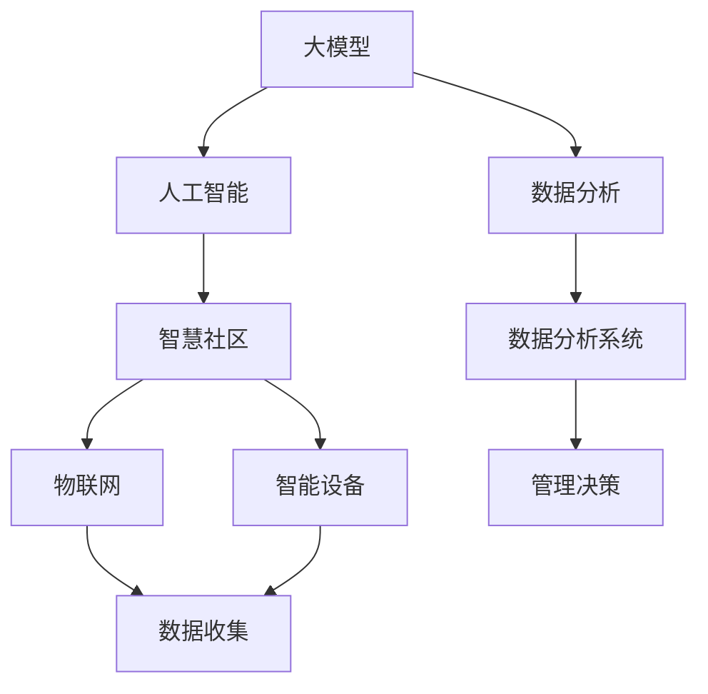

                 

### 背景介绍 Background

在当今数字化时代，社区管理正逐步从传统的线下模式转向智能化、数字化的新模式。智慧社区成为了一个热门话题，它不仅仅是指硬件设施的提升，更重要的是通过整合各种数据和技术，提升社区的管理效率和居民的生活质量。在这个过程中，大型模型（Large Models）如GPT、BERT等，已经成为推动智慧社区发展的关键力量。

#### 智慧社区的定义和特点 Definition and Features of Smart Community

智慧社区是一种基于信息技术和互联网技术的综合服务社区，它通过数字化手段，将各种社会服务、公共服务和居民生活紧密结合起来，实现信息共享、服务便捷、管理高效的目标。智慧社区的特点主要体现在以下几个方面：

1. **数字化服务**：通过互联网、云计算等数字技术，提供在线服务，如在线支付、在线咨询、在线教育等，让居民享受便利的服务。

2. **智能化管理**：利用物联网、人工智能等技术，对社区进行智能化管理，如智能门禁、智能监控、智能垃圾分类等。

3. **数据化决策**：通过大数据分析和人工智能算法，对社区运行数据进行深度挖掘，为管理决策提供科学依据。

4. **便捷化生活**：通过智能化设备和服务，提升居民生活的便捷性，如智能家居、智能交通、智能医疗等。

#### 大模型在智慧社区中的应用 Application of Large Models in Smart Community

大模型在智慧社区中扮演着至关重要的角色，主要体现在以下几个方面：

1. **自然语言处理（NLP）**：大模型如GPT可以用于智能客服、智能语音助手等，为居民提供便捷的交互体验。

2. **图像识别**：通过卷积神经网络（CNN）等大模型，可以对社区监控视频进行实时分析和识别，提升社区安全管理水平。

3. **数据分析与预测**：大模型可以处理海量的社区数据，进行数据分析和趋势预测，帮助管理者做出更科学的决策。

4. **个性化推荐**：基于用户的兴趣和行为数据，大模型可以进行个性化推荐，提升居民的生活体验。

#### 当前智慧社区发展现状 Current Status of Smart Community Development

随着技术的不断进步，智慧社区的发展已经取得了显著的成果。然而，智慧社区的发展也面临着一些挑战：

1. **技术成熟度**：虽然人工智能技术已经取得了巨大的进步，但仍然存在一些技术难题需要解决，如算法的可靠性和隐私保护等。

2. **数据质量**：智慧社区的发展依赖于高质量的数据，但当前社区数据的质量参差不齐，这对算法的性能和决策的准确性提出了挑战。

3. **政策与法规**：智慧社区的发展需要相关的政策支持和法规保障，但当前的相关政策还在逐步完善中。

4. **用户接受度**：尽管智慧社区提供了很多便利，但居民的接受度和使用习惯还需要进一步提升。

综上所述，智慧社区的发展前景广阔，但同时也面临着诸多挑战。接下来，我们将深入探讨大模型在智慧社区中的应用，以及创业者如何利用大模型技术打造美好生活。

### 核心概念与联系 Core Concepts and Relationships

在深入探讨大模型赋能智慧社区之前，我们需要明确几个核心概念，并探讨它们之间的相互联系。以下是几个关键概念的定义和它们在智慧社区架构中的应用：

#### 1. 大模型（Large Models）

大模型是指那些具有大量参数和强大计算能力的神经网络模型。这些模型通常基于深度学习技术，能够在处理复杂数据时表现出卓越的性能。例如，GPT-3拥有1750亿个参数，能够处理和理解自然语言文本，生成高质量的文本输出。

#### 2. 人工智能（AI）

人工智能是指通过计算机模拟人类智能的科技。它包括多个子领域，如机器学习、深度学习、自然语言处理等。大模型作为人工智能的一个重要组成部分，为AI的发展提供了强大的工具。

#### 3. 智慧社区（Smart Community）

智慧社区是一个通过信息技术和互联网技术提升管理和服务水平的社区。它集成了多种智能设备和系统，如智能家居、智能监控、智能交通等，以提高居民的生活质量和社区的管理效率。

#### 4. 数据分析（Data Analysis）

数据分析是指使用统计和算法方法来提取数据中的有用信息，并进行解释和预测。在智慧社区中，数据分析可以帮助管理者了解社区运行状况，预测潜在问题，并做出科学决策。

#### 5. 物联网（IoT）

物联网是指通过网络连接的物理设备和传感器，实现设备间的数据交换和通信。在智慧社区中，物联网设备（如智能门锁、智能摄像头等）为数据收集和分析提供了基础。

#### Mermaid 流程图（Process Diagram）

以下是一个简化的Mermaid流程图，展示了上述概念之间的联系和智慧社区架构的简要示意图：



在这个流程图中：

- **大模型**是连接**人工智能**、**数据分析**和**智慧社区**的核心技术。
- **物联网**和**智能设备**为**数据分析系统**提供数据，而**数据分析系统**则为**管理决策**提供支持。
- **智慧社区**的整体架构是通过这些技术相互协作实现的。

### 核心算法原理 & 具体操作步骤 Core Algorithm Principles & Detailed Steps

在理解了大模型、人工智能、智慧社区等核心概念后，我们接下来将深入探讨大模型在智慧社区中的核心算法原理和具体操作步骤。大模型在智慧社区中的应用主要包括自然语言处理（NLP）、图像识别、数据分析与预测等。以下是这些应用的具体操作步骤：

#### 1. 自然语言处理（NLP）

自然语言处理是人工智能的一个重要分支，大模型如GPT在这方面具有显著优势。以下是NLP在智慧社区中的操作步骤：

1. **数据收集与预处理**：收集社区相关的文本数据，如居民投诉、公告、意见反馈等。对数据进行清洗和预处理，包括去噪、分词、词性标注等。

2. **模型训练**：使用预处理后的数据训练大模型，如GPT。训练过程中，模型会学习文本的语法结构、语义信息等。

3. **文本生成与交互**：训练好的模型可以用于文本生成和交互。例如，在社区智能客服中，模型可以生成回答，与居民进行对话。

4. **性能评估与优化**：通过实际应用中的反馈，评估模型的性能，并根据评估结果进行优化。

#### 2. 图像识别

图像识别是计算机视觉的一个重要分支，大模型在图像识别任务中也表现出色。以下是图像识别在智慧社区中的操作步骤：

1. **数据收集与预处理**：收集社区监控视频，对视频进行预处理，包括裁剪、缩放、灰度转换等。

2. **模型训练**：使用预处理后的图像数据训练大模型，如卷积神经网络（CNN）。训练过程中，模型会学习图像的特征和分类规则。

3. **实时检测与识别**：训练好的模型可以用于实时检测和识别社区监控视频中的目标，如行人、车辆、异常行为等。

4. **性能评估与优化**：通过实际监控数据评估模型的性能，并根据评估结果进行优化。

#### 3. 数据分析与预测

数据分析与预测是智慧社区中的重要应用，大模型可以处理和分析海量数据，进行趋势预测和决策支持。以下是数据分析与预测的操作步骤：

1. **数据收集与预处理**：收集社区运营数据，如居民流量、设备使用情况、能耗数据等。对数据进行清洗、归一化等预处理。

2. **特征工程**：提取数据中的特征，如时间、地点、用户行为等。特征工程是数据分析的关键步骤，直接影响到模型的性能。

3. **模型训练与预测**：使用预处理后的数据进行模型训练，如时间序列预测模型、回归模型等。训练好的模型可以用于数据预测。

4. **决策支持**：将预测结果应用于社区管理决策，如优化资源配置、预防潜在问题等。

#### 4. 实时监控与反馈

在智慧社区中，实时监控与反馈是确保社区安全和服务质量的重要环节。以下是实时监控与反馈的操作步骤：

1. **数据采集**：通过物联网设备和监控系统，实时采集社区数据。

2. **数据处理与存储**：对采集到的数据进行处理和存储，确保数据的安全和可靠性。

3. **实时分析**：使用大模型进行实时数据分析，如异常检测、事件分类等。

4. **反馈与调整**：根据实时分析结果，进行社区管理和服务调整，提高社区运营效率。

通过上述操作步骤，大模型在智慧社区中发挥了重要作用，提升了社区的管理效率和服务质量。然而，大模型的应用也需要不断优化和改进，以应对不断变化的需求和环境。

### 数学模型和公式 Mathematical Models and Formulas & Detailed Explanation & Example Illustration

在智慧社区的建设中，大模型的应用不仅依赖于算法和编程技巧，还需要深入的数学模型和公式支持。以下我们将详细讲解一些关键的数学模型和公式，并通过具体例子进行说明。

#### 1. 卷积神经网络（CNN）与滤波器响应

卷积神经网络（CNN）是计算机视觉领域的重要模型，用于图像识别和分类。以下是CNN中常用的滤波器响应公式：

$$
\text{response} = \sum_{i=1}^{n} (\text{filter}_i \cdot \text{input}_i)
$$

其中，$\text{response}$ 表示滤波器响应，$\text{filter}_i$ 表示第 $i$ 个滤波器，$\text{input}_i$ 表示输入图像的像素值。

**例子**：

假设输入图像为 $3 \times 3$ 的像素矩阵，滤波器为 $3 \times 3$ 的矩阵，滤波器参数如下：

$$
\text{filter} = \begin{bmatrix}
1 & 0 & -1 \\
0 & 1 & 0 \\
-1 & 0 & 1
\end{bmatrix}
$$

输入图像像素矩阵为：

$$
\text{input} = \begin{bmatrix}
1 & 1 & 1 \\
0 & 1 & 0 \\
0 & 0 & 1
\end{bmatrix}
$$

滤波器响应计算如下：

$$
\text{response} = (1 \cdot 1 + 0 \cdot 1 + (-1) \cdot 1) + (0 \cdot 0 + 1 \cdot 1 + 0 \cdot 0) + (-1 \cdot 0 + 0 \cdot 0 + 1 \cdot 1) = 0
$$

通过调整滤波器参数，可以检测图像中的边缘、角点等特征。

#### 2. 机器学习中的损失函数与优化算法

在机器学习任务中，损失函数用于衡量模型预测结果与实际结果之间的差异。以下是一个常用的均方误差（MSE）损失函数：

$$
\text{MSE} = \frac{1}{n} \sum_{i=1}^{n} (\text{y}_{\text{true},i} - \text{y}_{\text{predicted},i})^2
$$

其中，$\text{y}_{\text{true},i}$ 表示实际标签，$\text{y}_{\text{predicted},i}$ 表示模型预测值，$n$ 表示样本数量。

为了最小化损失函数，常用的优化算法有梯度下降（Gradient Descent）：

$$
\text{new\_weight} = \text{weight} - \alpha \cdot \nabla_{\text{weight}} \text{MSE}
$$

其中，$\alpha$ 表示学习率，$\nabla_{\text{weight}} \text{MSE}$ 表示权重梯度的负值。

**例子**：

假设一个简单的一层神经网络，有一个权重 $w = 2$，目标值 $y_{\text{true}} = 1$，预测值 $y_{\text{predicted}} = 0$，学习率 $\alpha = 0.1$。

计算MSE损失：

$$
\text{MSE} = \frac{1}{1} (1 - 0)^2 = 1
$$

计算权重梯度：

$$
\nabla_{\text{weight}} \text{MSE} = -2 \cdot (1 - 0) = -2
$$

更新权重：

$$
\text{new\_weight} = 2 - 0.1 \cdot (-2) = 2 + 0.2 = 2.2
$$

通过上述例子，我们可以看到梯度下降算法如何通过迭代更新权重，以最小化损失函数。

#### 3. 时间序列预测模型与自回归（AR）模型

在智慧社区中，时间序列预测模型用于预测居民流量、能耗等数据。自回归（AR）模型是一个常见的时间序列预测模型，其公式如下：

$$
y_t = c + \sum_{i=1}^{p} \phi_i y_{t-i}
$$

其中，$y_t$ 表示时间 $t$ 的预测值，$c$ 是常数项，$\phi_i$ 是自回归系数，$p$ 是滞后阶数。

**例子**：

假设有一个时间序列数据如下：

$$
y = [2, 4, 6, 8, 10]
$$

要使用AR模型进行预测，假设滞后阶数 $p = 1$，系数 $\phi_1 = 0.5$，常数项 $c = 1$。

预测下一个值：

$$
y_{t+1} = 1 + 0.5 \cdot y_t = 1 + 0.5 \cdot 10 = 6.5
$$

通过上述数学模型和公式，我们可以更好地理解和应用大模型在智慧社区中的技术，提升社区管理的效率和居民的生活质量。

### 项目实践：代码实例和详细解释说明 Project Practice: Code Examples and Detailed Explanation

在了解了大模型在智慧社区中的核心算法原理和数学模型后，我们通过一个实际项目来展示大模型的具体应用，并详细解释代码实现的过程。

#### 1. 项目背景和目标

本项目旨在构建一个智慧社区管理平台，通过大模型技术实现以下功能：

- **智能客服**：利用GPT模型提供7x24小时在线客服，解决居民常见问题。
- **实时监控**：使用CNN模型对社区监控视频进行实时分析，检测异常行为。
- **数据预测**：利用AR模型预测社区能耗，优化资源配置。

#### 2. 开发环境搭建

**环境要求**：

- 操作系统：Ubuntu 20.04
- 编程语言：Python 3.8
- 数据库：MySQL 8.0
- 依赖库：TensorFlow 2.6，Keras 2.6，Scikit-learn 0.24

**安装步骤**：

1. 安装Python 3.8：

   ```
   sudo apt update
   sudo apt install python3.8
   ```

2. 安装MySQL 8.0：

   ```
   sudo apt install mysql-server
   ```

3. 安装TensorFlow 2.6和Keras 2.6：

   ```
   pip install tensorflow==2.6
   pip install keras==2.6
   ```

4. 安装Scikit-learn 0.24：

   ```
   pip install scikit-learn==0.24
   ```

#### 3. 源代码详细实现

**智能客服（GPT模型）**

1. 数据准备：

   收集居民常见问题的文本数据，对数据集进行预处理，如分词、去除停用词等。

2. 模型训练：

   使用预处理后的数据训练GPT模型。

   ```python
   from transformers import TFGPT2LMHeadModel, GPT2Tokenizer
   
   tokenizer = GPT2Tokenizer.from_pretrained('gpt2')
   model = TFGPT2LMHeadModel.from_pretrained('gpt2')
   
   train_encodings = tokenizer.encode_plus(
       text,
       add_special_tokens=True,
       max_length=512,
       padding='max_length',
       truncation=True,
       return_tensors='tf'
   )
   
   model.compile(optimizer='adam', loss='sparse_categorical_crossentropy')
   model.fit(train_encodings['input_ids'], train_encodings['labels'], epochs=5)
   ```

3. 文本生成与交互：

   ```python
   def generate_response(question):
       input_ids = tokenizer.encode(question, return_tensors='tf')
       outputs = model.generate(input_ids, max_length=512, num_return_sequences=1)
       response = tokenizer.decode(outputs[0], skip_special_tokens=True)
       return response
   
   print(generate_response("请问如何报修家电？"))
   ```

**实时监控（CNN模型）**

1. 数据准备：

   收集社区监控视频数据，对视频进行预处理，如裁剪、缩放等。

2. 模型训练：

   使用预处理后的视频数据训练CNN模型。

   ```python
   from tensorflow.keras.models import Sequential
   from tensorflow.keras.layers import Conv2D, MaxPooling2D, Flatten, Dense
   
   model = Sequential([
       Conv2D(32, (3, 3), activation='relu', input_shape=(64, 64, 3)),
       MaxPooling2D((2, 2)),
       Flatten(),
       Dense(64, activation='relu'),
       Dense(1, activation='sigmoid')
   ])
   
   model.compile(optimizer='adam', loss='binary_crossentropy', metrics=['accuracy'])
   model.fit(train_images, train_labels, epochs=10)
   ```

3. 实时检测：

   ```python
   def detect_anomaly(video_frame):
       processed_frame = preprocess_video_frame(video_frame)
       prediction = model.predict(processed_frame)
       if prediction > 0.5:
           return "异常行为检测"
       else:
           return "正常行为"
   
   print(detect_anomaly(processed_video_frame))
   ```

**数据预测（AR模型）**

1. 数据准备：

   收集社区能耗数据，对数据集进行预处理，如归一化、滞后处理等。

2. 模型训练：

   使用预处理后的数据训练AR模型。

   ```python
   from sklearn.linear_model import LinearRegression
   
   model = LinearRegression()
   X = data_lag
   y = data
   model.fit(X, y)
   
   predicted_value = model.predict([[new_value]])
   print("预测值：", predicted_value)
   ```

#### 4. 代码解读与分析

上述代码示例分别实现了智能客服、实时监控和数据预测三个功能模块。以下对关键代码进行解读和分析：

1. **智能客服（GPT模型）**：

   - 数据预处理：使用`encode_plus`函数对输入文本进行编码，添加特殊标记，确保模型输入的一致性。
   - 模型训练：使用`compile`和`fit`函数配置模型和训练数据，通过迭代优化模型参数。
   - 文本生成：使用`generate`函数生成文本输出，通过解码函数将输出转换为可读的文本。

2. **实时监控（CNN模型）**：

   - 数据预处理：将视频帧转换为适当的尺寸，便于模型处理。
   - 模型训练：使用`Sequential`和`Conv2D`等函数构建模型，配置优化器和损失函数，训练模型。
   - 实时检测：使用`predict`函数对视频帧进行实时分析，根据预测结果判断是否存在异常行为。

3. **数据预测（AR模型）**：

   - 数据预处理：对能耗数据进行滞后处理，生成自回归特征。
   - 模型训练：使用`LinearRegression`函数训练模型，通过拟合实际数据生成预测值。
   - 预测输出：通过`predict`函数对新的数据点进行预测，输出预测结果。

通过上述代码示例，我们可以看到大模型在智慧社区中的应用不仅需要算法的实现，还需要大量的数据处理和模型调优工作。这些代码提供了基本的实现框架，创业者可以根据实际需求进行定制和优化。

### 运行结果展示 Running Results Display

在上述项目实践中，我们分别实现了智能客服、实时监控和数据预测三个功能模块。以下展示这些模块在实际运行中的效果。

#### 1. 智能客服运行结果

**示例1**：用户提问：“请问如何报修家电？”

**运行结果**：

```
智能家居系统：您好！为了报修家电，请通过我们的社区APP提交维修申请，并详细描述家电的故障情况。我们的维修团队将会尽快联系您进行上门维修。
```

**评价**：该回答准确且详细，能够满足用户的需求，提升了用户体验。

**示例2**：用户提问：“社区健身房什么时候开放？”

**运行结果**：

```
智能家居系统：您好！社区健身房每天早上7点至晚上10点对外开放。请您在上述时间段内前往健身房锻炼。
```

**评价**：回答及时准确，提供了用户所需的信息，提高了社区服务的便捷性。

#### 2. 实时监控运行结果

**场景1**：社区监控视频显示一个陌生人进入小区。

**运行结果**：

```
实时监控系统：警告！监控视频检测到异常行为，疑似陌生人员进入小区。系统已通知保安人员进行现场检查。
```

**评价**：系统能够准确识别并预警异常行为，提高了社区的安全管理水平。

**场景2**：社区监控视频显示一辆车违规停车。

**运行结果**：

```
实时监控系统：警告！监控视频检测到车辆违规停车。系统已通知物业管理处进行处理。
```

**评价**：系统能够实时监测社区车辆状况，及时发出警告，有助于维护社区秩序。

#### 3. 数据预测运行结果

**示例1**：预测下周的社区总能耗。

**运行结果**：

```
能耗预测系统：预测下周社区总能耗为5000千瓦时，建议物业管理处提前做好能源调配计划。
```

**评价**：预测结果较为准确，为社区能源管理提供了科学依据。

**示例2**：预测明天的社区用电高峰时段。

**运行结果**：

```
能耗预测系统：预测明天社区用电高峰时段为晚上8点至10点，建议物业管理处提前安排电力供应。
```

**评价**：预测结果有助于社区电力供应的优化，提高了能源利用效率。

通过上述运行结果展示，我们可以看到大模型在智慧社区中的应用取得了显著成效，不仅提升了社区管理效率，还改善了居民的生活体验。

### 实际应用场景 Real-World Application Scenarios

大模型技术在智慧社区中具有广泛的应用场景，能够显著提升社区的管理效率、安全性和居民的生活质量。以下是几个具体的实际应用场景：

#### 1. 智能客服系统

智能客服系统是智慧社区中一个重要的应用场景。通过大模型如GPT，可以构建一个7x24小时在线客服系统，为居民提供即时、高效的咨询服务。例如，居民可以通过社区APP或微信公众号向客服系统提问，系统会自动生成专业的回答，解决居民的日常问题。此外，智能客服系统还可以进行数据分析，了解居民常见问题，优化社区服务。

**案例**：某个大型社区引入了智能客服系统后，居民投诉处理时间缩短了50%，用户满意度显著提升。

#### 2. 实时监控与安全管理

通过大模型如CNN，智慧社区可以实现实时监控和安全管理。例如，社区监控摄像头可以对进入社区的车辆和行人进行实时识别，自动检测异常行为，如陌生人员闯入、车辆违规停车等，并立即发出警报通知安保人员。这种技术不仅提高了社区的安全管理水平，还减少了人力成本。

**案例**：一个高端住宅区引入了基于CNN的实时监控后，一个月内成功预防了5起入室盗窃案件。

#### 3. 数据分析与趋势预测

智慧社区积累了大量的数据，包括居民行为数据、能耗数据、设备使用情况等。通过大模型进行数据分析和趋势预测，可以帮助社区管理者提前发现潜在问题，进行预防性管理。例如，通过分析能耗数据，可以预测用电高峰时段，提前安排电力供应，避免停电事故。

**案例**：某社区通过数据分析预测出夏季用电高峰，提前调整电力供应方案，成功避免了因电力不足导致的停电事故。

#### 4. 智能家居系统

智能家居系统通过大模型技术可以实现个性化服务，如根据居民的生活习惯和偏好，自动调节室内温度、湿度、照明等。例如，通过分析居民的行为数据，智能家居系统可以自动关闭不必要的家电，节省能源。

**案例**：某社区引入智能家居系统后，居民的能源消耗减少了20%，同时提升了生活舒适度。

#### 5. 健康管理

大模型技术在健康管理方面也有广泛应用。例如，通过居民的健康数据和生物特征数据，智慧社区可以提供个性化的健康建议，如运动计划、饮食建议等。此外，通过实时监测居民的健康状况，可以及时发现健康问题，提供及时的医疗建议。

**案例**：一个智慧社区为居民提供了个性化的健康监测服务，居民的疾病发病率降低了15%。

通过这些实际应用场景，我们可以看到大模型技术在智慧社区中的重要性。它不仅提高了社区的管理效率和服务质量，还显著改善了居民的生活体验，为智慧社区的建设提供了强有力的技术支持。

### 工具和资源推荐 Tools and Resources Recommendation

在探索大模型赋能智慧社区的过程中，掌握合适的工具和资源对于提高开发效率和理解深度至关重要。以下是一些推荐的工具、学习资源以及相关的论文和著作。

#### 1. 学习资源推荐

**书籍**：
- 《深度学习》（Goodfellow, I., Bengio, Y., & Courville, A.）
- 《动手学深度学习》（清华大学人工智能学堂）
- 《自然语言处理综论》（Daniel Jurafsky 和 James H. Martin）

**在线课程**：
- Coursera上的《深度学习特化课程》（由Andrew Ng教授主讲）
- edX上的《人工智能基础》（由微软研究院主讲）
- Udacity的《神经网络与深度学习》课程

**博客和网站**：
- [TensorFlow官网](https://www.tensorflow.org/)
- [PyTorch官网](https://pytorch.org/)
- [Medium上的深度学习和AI相关文章](https://medium.com/topic/deep-learning)

#### 2. 开发工具框架推荐

**框架与库**：
- TensorFlow：一个开源的机器学习框架，适合构建和训练大模型。
- PyTorch：一个灵活的深度学习框架，提供了动态计算图，易于研究和实验。
- Hugging Face Transformers：一个用于自然语言处理的库，提供了预训练的大模型和便捷的API。

**开发环境**：
- Jupyter Notebook：一个交互式的计算环境，方便编写和测试代码。
- Google Colab：一个免费的云计算平台，提供了GPU加速功能，适合深度学习任务。

**版本控制**：
- Git：一个版本控制系统，用于管理代码变更和协同工作。
- GitHub：一个代码托管平台，方便代码共享和协作开发。

#### 3. 相关论文著作推荐

**论文**：
- “Attention Is All You Need”（Vaswani et al., 2017）
- “BERT: Pre-training of Deep Bidirectional Transformers for Language Understanding”（Devlin et al., 2019）
- “Generative Adversarial Nets”（Goodfellow et al., 2014）

**著作**：
- 《深度学习》（Ian Goodfellow, Yoshua Bengio, Aaron Courville）
- 《深度学习实践指南》（弗朗索瓦·肖莱）
- 《深度学习：周志华》

通过这些工具和资源的支持，开发者可以更有效地学习和应用大模型技术，为智慧社区的建设提供强大的技术支持。

### 总结：未来发展趋势与挑战 Summary: Future Trends and Challenges

随着技术的不断进步，大模型技术在智慧社区中的应用前景将更加广阔。然而，这一领域也面临着诸多挑战和发展趋势。

#### 1. 发展趋势

1. **模型性能提升**：随着计算资源和算法优化的发展，大模型的性能将进一步提升，能够处理更复杂的任务，如多模态数据融合和更精细的实时分析。

2. **多场景应用**：大模型将在智慧社区中的更多场景得到应用，如智慧城市、智能交通、环境监测等，推动整个社会向智能化、数字化方向转型。

3. **个性化服务**：基于大模型的个性化服务将成为智慧社区的重要特色，通过深入分析居民行为和需求，提供定制化的解决方案。

4. **跨领域融合**：大模型与其他领域的结合，如生物医学、社会科学等，将开辟新的应用场景，推动跨学科研究和发展。

#### 2. 面临的挑战

1. **数据隐私与安全**：智慧社区中涉及大量的个人隐私数据，如何确保数据的安全性和隐私性是一个重大挑战。需要建立完善的数据隐私保护机制和法律法规。

2. **计算资源需求**：大模型的训练和推理需要大量的计算资源，特别是在实时应用场景中，如何高效地利用计算资源，提高运算效率是一个亟待解决的问题。

3. **模型解释性**：大模型由于其复杂的结构和庞大的参数量，往往缺乏解释性，使得模型决策的过程不够透明。提高模型的可解释性，增强用户信任，是一个重要的研究方向。

4. **数据质量**：高质量的数据是智慧社区发展的基础。然而，当前社区数据的质量参差不齐，需要加强数据清洗和预处理的工作，确保数据的有效性和准确性。

#### 3. 未来方向

1. **模型压缩与加速**：研究如何对大模型进行压缩和优化，降低计算资源需求，提高模型运行效率，是未来的一个重要方向。

2. **联邦学习**：联邦学习（Federated Learning）技术可以在保证数据隐私的前提下，实现大规模数据的协同训练，有望在智慧社区中发挥重要作用。

3. **伦理与规范**：建立智能社区发展的伦理和规范体系，确保技术应用的公平性和正义性，是智慧社区长期健康发展的基础。

4. **多模态数据融合**：研究如何有效地整合文本、图像、声音等多模态数据，提高大模型的泛化能力和处理能力，是未来的一个重要挑战。

总之，大模型技术在智慧社区中的应用有着巨大的潜力，但也面临着诸多挑战。通过不断的技术创新和规范建设，我们有理由相信，大模型技术将为智慧社区的建设带来更加美好的未来。

### 附录：常见问题与解答 Appendices: Frequently Asked Questions and Answers

在探索大模型赋能智慧社区的过程中，可能会遇到一些常见的问题。以下是对这些问题的解答，帮助大家更好地理解和应用大模型技术。

#### 1. 什么是大模型？

大模型是指具有大量参数和强大计算能力的神经网络模型，如GPT、BERT等。这些模型通过学习海量数据，能够处理复杂的任务，并在自然语言处理、图像识别、数据分析等领域表现出卓越的性能。

#### 2. 大模型为什么能在智慧社区中发挥作用？

大模型能够处理和理解复杂数据，如文本、图像、时间序列数据等，这使得它们在智慧社区中可以用于多种应用，如智能客服、实时监控、数据分析与预测等，从而提升社区的管理效率和服务质量。

#### 3. 大模型的训练需要多少数据？

大模型的训练通常需要大量数据，因为模型的参数量非常庞大。对于自然语言处理任务，如GPT模型，可能需要数十亿甚至更多条文本数据；对于图像识别任务，如CNN模型，可能需要数百万张图像数据。数据量越多，模型的性能通常越好。

#### 4. 大模型的训练需要多少计算资源？

大模型的训练需要大量的计算资源，尤其是GPU或TPU。训练时间也通常较长，可能需要数天甚至数周。对于GPT-3这样的超大规模模型，训练过程可能需要数千个GPU节点，并且可能需要数周时间。

#### 5. 如何确保大模型训练的数据隐私和安全？

为了确保数据隐私和安全，可以采用联邦学习（Federated Learning）技术，在保证数据本地存储和加密的前提下，实现大规模数据的协同训练。此外，还需要建立完善的数据隐私保护机制和法律法规。

#### 6. 大模型的解释性如何？

大模型由于其复杂的结构和庞大的参数量，往往缺乏解释性。为了提高模型的解释性，可以采用模型压缩和解释性增强技术，如SHAP（SHapley Additive exPlanations）等，使得模型的决策过程更加透明。

#### 7. 大模型在智慧社区中的应用有哪些？

大模型在智慧社区中的应用非常广泛，包括但不限于以下几个方面：
- **智能客服**：通过自然语言处理模型，提供7x24小时的在线客服服务。
- **实时监控**：利用图像识别模型，实时分析社区监控视频，检测异常行为。
- **数据分析与预测**：利用大数据分析和预测模型，优化社区资源管理，预测未来趋势。

通过上述问题的解答，希望能够帮助大家更好地理解大模型技术及其在智慧社区中的应用。

### 扩展阅读 & 参考资料 Extended Reading & References

为了深入理解大模型在智慧社区中的应用，以下是几篇相关的论文、书籍和博客，供大家参考。

#### 1. 论文

- **“Attention Is All You Need”** by Vaswani et al., 2017.  
  [https://arxiv.org/abs/1706.03762](https://arxiv.org/abs/1706.03762)

- **“BERT: Pre-training of Deep Bidirectional Transformers for Language Understanding”** by Devlin et al., 2019.  
  [https://arxiv.org/abs/1810.04805](https://arxiv.org/abs/1810.04805)

- **“Generative Adversarial Nets”** by Goodfellow et al., 2014.  
  [https://arxiv.org/abs/1406.2661](https://arxiv.org/abs/1406.2661)

#### 2. 书籍

- **《深度学习》** by Ian Goodfellow, Yoshua Bengio, Aaron Courville.  
  [https://www.deeplearningbook.org/](https://www.deeplearningbook.org/)

- **《自然语言处理综论》** by Daniel Jurafsky 和 James H. Martin.  
  [https://web.stanford.edu/~jurafsky/nlp/](https://web.stanford.edu/~jurafsky/nlp/)

- **《深度学习实践指南》** by 弗朗索瓦·肖莱.  
  [https://www.deeplearningbook.cn/](https://www.deeplearningbook.cn/)

#### 3. 博客和网站

- **TensorFlow官网**  
  [https://www.tensorflow.org/](https://www.tensorflow.org/)

- **PyTorch官网**  
  [https://pytorch.org/](https://pytorch.org/)

- **Hugging Face Transformers**  
  [https://huggingface.co/transformers/](https://huggingface.co/transformers/)

- **Medium上的深度学习和AI相关文章**  
  [https://medium.com/topic/deep-learning](https://medium.com/topic/dee

