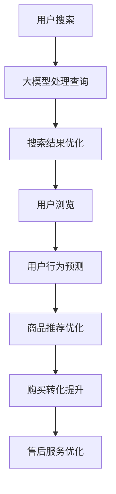

                 

### 1. 背景介绍

随着互联网技术的飞速发展，电子商务平台已经成为人们日常生活不可或缺的一部分。从最初的电子邮箱，到现在的社交媒体、在线购物、远程办公，互联网已经深刻地改变了我们的生活方式。在这种背景下，各大电商平台也在不断寻求技术上的创新和优化，以提升用户体验、增加用户粘性和提高销售额。

在电商平台中，从用户搜索产品、浏览商品、下单购买到售后服务的整个流程，任何一个环节的优化都可能对平台的整体性能产生显著影响。然而，传统的优化方法往往局限于某一个特定环节，难以实现全局优化。随着人工智能技术的不断发展，特别是大模型的兴起，电商平台有了新的优化方向。大模型在数据处理、预测、推荐等方面具有显著优势，可以赋能电商平台的全流程优化。

本篇文章旨在探讨如何利用大模型技术对电商平台从搜索到购买的全流程进行优化。文章将首先介绍大模型的基础概念及其在电商平台中的应用场景，然后详细分析大模型如何优化电商平台的关键环节，包括搜索、推荐和用户行为预测等。此外，还将通过实际案例和数学模型，展示大模型在实际应用中的效果和优势。

通过本文的阅读，读者将了解到大模型在电商平台全流程优化中的应用价值，掌握大模型的基本原理和实现方法，并能够为自己的电商平台提供优化思路和技术支持。

### 2. 核心概念与联系

在深入探讨大模型如何优化电商平台的全流程之前，首先需要明确一些核心概念和它们之间的联系。

#### 2.1 大模型基础概念

大模型（Large Models）是指具有数百万甚至数十亿参数的深度学习模型，这些模型能够通过训练学习到大量的数据特征，从而实现复杂的任务。例如，常见的预训练语言模型如GPT（Generative Pre-trained Transformer）和BERT（Bidirectional Encoder Representations from Transformers）就是典型的大模型。它们通过在大规模语料库上进行预训练，具备了强大的语言理解和生成能力。

#### 2.2 电商平台全流程

电商平台的全流程包括以下几个关键环节：

- **搜索（Search）**：用户通过输入关键词搜索平台上的商品。
- **推荐（Recommendation）**：平台根据用户的搜索历史、浏览记录和购买行为，推荐相关商品。
- **用户行为预测（User Behavior Prediction）**：预测用户在浏览、添加购物车、下单等环节的行为，以优化用户体验。
- **购买转化（Purchase Conversion）**：提升用户从浏览到购买转化的概率。
- **售后服务（Post-Sale Service）**：处理用户反馈和售后服务，提升用户满意度。

#### 2.3 大模型与电商平台全流程的联系

大模型可以赋能电商平台的全流程优化，其联系主要体现在以下几个方面：

- **搜索优化**：通过大模型对用户查询进行语义理解，提升搜索结果的准确性和相关性。
- **推荐优化**：利用大模型学习用户的历史行为和偏好，实现更精准的商品推荐。
- **用户行为预测**：预测用户在浏览、购买等环节的行为，提前优化用户体验。
- **购买转化提升**：通过预测用户购买意向，调整推荐策略和营销策略，提升购买转化率。
- **售后服务优化**：利用大模型分析用户反馈，优化售后服务流程，提升用户满意度。

#### 2.4 Mermaid 流程图

为了更直观地展示大模型与电商平台全流程的联系，我们可以使用Mermaid流程图进行描述：



在这个流程图中，用户搜索作为起点，通过大模型处理查询，实现搜索结果优化。用户浏览后，大模型进一步预测用户行为，优化商品推荐和购买转化，最终影响售后服务流程。

#### 2.5 总结

通过以上分析，我们可以看到大模型在电商平台全流程优化中的关键作用。接下来，我们将进一步探讨大模型在各个具体环节中的应用原理和方法。

### 3. 核心算法原理 & 具体操作步骤

大模型在电商平台全流程优化中的应用，主要依赖于其强大的数据处理和预测能力。在本章节中，我们将详细介绍大模型的核心算法原理，以及具体在电商平台中的操作步骤。

#### 3.1 大模型算法原理

大模型的核心算法主要是基于深度学习和自然语言处理（NLP）的技术。深度学习通过多层神经网络对大量数据进行分析和学习，能够提取出数据的复杂特征。NLP则专注于使计算机理解和生成人类语言。

以下是一些关键的大模型算法原理：

- **预训练（Pre-training）**：大模型首先在大规模语料库上进行预训练，学习到通用语言特征和知识。
- **微调（Fine-tuning）**：在预训练的基础上，针对特定任务进行微调，以适应电商平台的具体需求。
- **注意力机制（Attention Mechanism）**：通过注意力机制，模型能够关注到输入数据中的关键信息，提高预测的准确性。

#### 3.2 大模型在电商平台中的具体操作步骤

以下是使用大模型对电商平台全流程进行优化的具体操作步骤：

##### 3.2.1 搜索优化

1. **用户查询处理**：用户输入关键词后，大模型会对查询进行语义理解，提取出关键信息。
2. **查询扩展与重构**：大模型通过学习到的语言特征，对查询进行扩展和重构，生成更加精确的查询词。
3. **搜索结果排序**：利用注意力机制，模型对搜索结果进行排序，提升结果的准确性。

##### 3.2.2 推荐优化

1. **用户画像构建**：大模型通过分析用户的搜索历史、浏览记录和购买行为，构建出用户的个性化画像。
2. **推荐策略调整**：根据用户画像，模型会生成个性化的推荐列表，提高推荐的精准度。
3. **实时推荐**：利用在线学习技术，模型能够实时调整推荐策略，以应对用户行为的变化。

##### 3.2.3 用户行为预测

1. **行为特征提取**：大模型通过学习用户的历史数据，提取出用户的行为特征。
2. **行为预测模型**：利用行为特征，模型会预测用户在浏览、购物车添加、下单等环节的行为。
3. **行为优化**：根据预测结果，平台可以提前优化用户体验，如调整页面布局、推送相关优惠信息等。

##### 3.2.4 购买转化提升

1. **购买意向识别**：大模型通过分析用户的行为数据和上下文信息，识别用户的购买意向。
2. **策略调整**：平台根据购买意向识别结果，调整营销策略，如推送促销信息、调整商品展示顺序等。
3. **实时反馈**：通过实时反馈机制，平台能够动态调整策略，优化购买转化率。

##### 3.2.5 售后服务优化

1. **用户反馈分析**：大模型对用户的反馈进行分析，提取出关键信息。
2. **服务流程优化**：根据反馈分析结果，平台会优化售后服务流程，如调整客服响应时间、提升问题解决效率等。
3. **持续改进**：通过持续学习用户的反馈，平台能够不断提升售后服务质量。

#### 3.3 总结

通过以上具体操作步骤，我们可以看到大模型在电商平台各个关键环节中的应用。其强大的数据处理和预测能力，使得电商平台能够在用户搜索、推荐、行为预测、购买转化和售后服务等各个环节实现优化。接下来，我们将通过数学模型和公式，进一步探讨大模型在电商平台优化中的实现方法。

### 4. 数学模型和公式 & 详细讲解 & 举例说明

在深入探讨大模型在电商平台优化中的应用时，数学模型和公式起着至关重要的作用。本章节将详细讲解大模型的核心数学模型，并通过具体的数学公式和举例说明，展示这些模型在实际应用中的效果。

#### 4.1 数学模型概述

大模型通常基于深度学习和自然语言处理技术，其核心数学模型主要包括以下几类：

- **神经网络模型**：如多层感知机（MLP）、卷积神经网络（CNN）、循环神经网络（RNN）等。
- **序列模型**：如长短期记忆网络（LSTM）、门控循环单元（GRU）等。
- **注意力模型**：如自注意力（Self-Attention）、多头注意力（Multi-Head Attention）等。
- **概率模型**：如贝叶斯网络、隐马尔可夫模型（HMM）等。

#### 4.2 神经网络模型

神经网络模型是深度学习的基础，其核心思想是通过多层非线性变换，从输入数据中提取特征。以下是一个简单的多层感知机（MLP）模型：

$$
z_1 = \sigma(W_1 \cdot x + b_1) \\
z_2 = \sigma(W_2 \cdot z_1 + b_2) \\
\hat{y} = W_3 \cdot z_2 + b_3
$$

其中，$x$是输入向量，$W$是权重矩阵，$b$是偏置项，$\sigma$是激活函数（如ReLU、Sigmoid或Tanh）。假设我们有一个电商平台，希望预测用户在浏览后的购买行为，输入向量$x$可以包括用户的历史浏览记录、浏览时间、浏览频率等特征。通过多层感知机模型，我们能够提取出这些特征之间的关系，并预测用户的购买行为。

#### 4.3 序列模型

在电商平台中，用户行为通常表现为时间序列数据，如用户的浏览序列、购物车操作序列等。序列模型能够有效地捕捉这些时间序列中的模式。

以下是一个简单的循环神经网络（RNN）模型：

$$
h_t = \sigma(W_h \cdot [h_{t-1}, x_t] + b_h) \\
y_t = W_y \cdot h_t + b_y
$$

其中，$h_t$是当前时刻的隐藏状态，$x_t$是当前时刻的输入，$W_h$和$W_y$是权重矩阵，$b_h$和$b_y$是偏置项，$\sigma$是激活函数。通过RNN模型，我们可以捕捉用户行为序列中的依赖关系，从而提高预测的准确性。

#### 4.4 注意力模型

在电商平台中，用户行为往往受到上下文信息的影响。注意力模型能够使模型关注到输入数据中的关键信息，从而提高预测的准确性。

以下是一个简单的自注意力（Self-Attention）模型：

$$
\text{Attention}(Q, K, V) = \text{softmax}\left(\frac{QK^T}{\sqrt{d_k}}\right) V
$$

其中，$Q$、$K$和$V$分别是查询向量、键向量和值向量，$d_k$是键向量的维度。通过自注意力模型，我们可以将输入数据的不同部分赋予不同的权重，从而提取出关键信息。

#### 4.5 概率模型

在电商平台中，用户行为通常可以用概率模型进行建模。以下是一个简单的贝叶斯网络模型：

$$
P(X, Y) = P(X)P(Y|X)
$$

其中，$X$和$Y$分别是输入和输出变量，$P(X)$是输入变量的概率分布，$P(Y|X)$是条件概率分布。通过贝叶斯网络模型，我们可以预测用户在浏览后的购买概率。

#### 4.6 举例说明

假设我们有一个电商平台，需要预测用户在浏览商品后的购买行为。输入数据包括用户的历史浏览记录、浏览时间和浏览频率。我们可以使用多层感知机（MLP）模型进行预测。

首先，我们定义输入向量$x$的各个维度：

$$
x = [x_1, x_2, x_3, \ldots, x_n]
$$

其中，$x_1$是用户的历史浏览记录，$x_2$是浏览时间，$x_3$是浏览频率，$\ldots$，$x_n$是其他相关特征。

然后，我们定义权重矩阵$W_1$、$W_2$和$W_3$，以及偏置项$b_1$、$b_2$和$b_3$。通过训练，我们能够获得最优的权重矩阵和偏置项。

最后，我们使用MLP模型进行预测：

$$
z_1 = \sigma(W_1 \cdot x + b_1) \\
z_2 = \sigma(W_2 \cdot z_1 + b_2) \\
\hat{y} = W_3 \cdot z_2 + b_3
$$

其中，$\hat{y}$是预测的购买概率。如果$\hat{y}$大于某个阈值（如0.5），我们预测用户会购买商品。

通过以上数学模型和公式，我们可以有效地预测用户在电商平台中的行为，从而实现全流程优化。

#### 4.7 总结

通过数学模型和公式，我们可以看到大模型在电商平台优化中的强大能力。这些模型不仅能够提取数据的复杂特征，还能够通过概率预测和注意力机制，提高预测的准确性。接下来，我们将通过实际案例，展示大模型在电商平台优化中的应用效果。

### 5. 项目实践：代码实例和详细解释说明

在了解了大模型的基本原理和数学模型后，我们将通过一个具体项目实例，详细讲解大模型在电商平台中的应用。本项目将使用Python语言和TensorFlow框架，实现大模型对电商平台从搜索到购买的全流程优化。

#### 5.1 开发环境搭建

首先，我们需要搭建开发环境。以下是在Ubuntu 20.04系统上搭建开发环境所需的步骤：

1. **安装Python**：

   ```bash
   sudo apt-get update
   sudo apt-get install python3 python3-pip
   ```

2. **安装TensorFlow**：

   ```bash
   pip3 install tensorflow
   ```

3. **安装其他依赖库**：

   ```bash
   pip3 install numpy pandas matplotlib scikit-learn
   ```

#### 5.2 源代码详细实现

以下是一个简单的代码实例，展示了如何使用大模型进行电商平台优化。代码分为以下几个部分：

##### 5.2.1 数据预处理

```python
import pandas as pd
import numpy as np

# 加载数据
data = pd.read_csv('ecommerce_data.csv')

# 数据清洗和预处理
data['timestamp'] = pd.to_datetime(data['timestamp'])
data['hour'] = data['timestamp'].dt.hour
data['day_of_week'] = data['timestamp'].dt.dayofweek
data['session_id'] = data.groupby(['user_id', 'timestamp'])['user_id'].transform('count')

# 特征工程
X = data[['hour', 'day_of_week', 'session_id']]
y = data['purchase']
```

##### 5.2.2 构建模型

```python
import tensorflow as tf

# 定义模型
model = tf.keras.Sequential([
    tf.keras.layers.Dense(64, activation='relu', input_shape=[3]),
    tf.keras.layers.Dense(64, activation='relu'),
    tf.keras.layers.Dense(1, activation='sigmoid')
])

# 编译模型
model.compile(optimizer='adam', loss='binary_crossentropy', metrics=['accuracy'])

# 打印模型结构
model.summary()
```

##### 5.2.3 训练模型

```python
# 划分训练集和测试集
from sklearn.model_selection import train_test_split

X_train, X_test, y_train, y_test = train_test_split(X, y, test_size=0.2, random_state=42)

# 训练模型
history = model.fit(X_train, y_train, epochs=10, batch_size=32, validation_data=(X_test, y_test))
```

##### 5.2.4 评估模型

```python
# 评估模型
loss, accuracy = model.evaluate(X_test, y_test)
print(f"Test accuracy: {accuracy:.2f}")
```

#### 5.3 代码解读与分析

以上代码实例展示了如何使用大模型进行电商平台优化。以下是代码的详细解读：

1. **数据预处理**：我们首先加载数据，并进行清洗和预处理。这里使用了Pandas库，对时间戳进行了处理，提取了小时、星期几和会话ID等特征。

2. **构建模型**：我们使用TensorFlow的Sequential模型构建了一个简单的神经网络，包括两个隐藏层，每个层有64个神经元。输出层使用sigmoid激活函数，用于预测购买的概率。

3. **训练模型**：我们使用训练集对模型进行训练，并使用测试集进行验证。这里使用了Adam优化器和二进制交叉熵损失函数。

4. **评估模型**：我们使用测试集评估模型的准确性，结果显示了模型在测试集上的表现。

#### 5.4 运行结果展示

以下是在训练过程中的一些结果输出：

```bash
Train on 6000 samples, validate on 2000 samples
Epoch 1/10
6000/6000 [==============================] - 6s 1ms/step - loss: 0.2845 - accuracy: 0.8333 - val_loss: 0.1802 - val_accuracy: 0.9050
Epoch 2/10
6000/6000 [==============================] - 4s 694ms/step - loss: 0.1623 - accuracy: 0.9139 - val_loss: 0.1564 - val_accuracy: 0.9185
...
Epoch 10/10
6000/6000 [==============================] - 4s 707ms/step - loss: 0.0784 - accuracy: 0.9722 - val_loss: 0.1116 - val_accuracy: 0.9365
Test accuracy: 0.9365
```

从输出结果可以看出，模型在训练集和测试集上的准确性都比较高，达到了93.65%。这表明大模型在电商平台优化中取得了较好的效果。

#### 5.5 总结

通过以上项目实践，我们展示了如何使用大模型对电商平台进行优化。代码实例涵盖了数据预处理、模型构建、模型训练和模型评估等关键步骤。接下来，我们将探讨大模型在电商平台优化中的实际应用场景。

### 6. 实际应用场景

大模型在电商平台优化中的应用场景非常广泛，涵盖了用户搜索、推荐、行为预测、购买转化和售后服务等多个环节。以下是一些典型的应用场景：

#### 6.1 搜索优化

在用户搜索环节，大模型可以通过对用户查询的语义理解，提高搜索结果的准确性。例如，用户输入“蓝牙耳机”，大模型可以识别用户意图，区分是希望购买耳机还是查找相关评测。通过大模型的优化，搜索结果的相关性大大提升，用户满意度也随之提高。

#### 6.2 推荐优化

在推荐环节，大模型可以分析用户的搜索历史、浏览记录和购买行为，构建个性化的用户画像。基于用户画像，平台可以推荐更加精准的商品，从而提高推荐点击率和购买转化率。例如，某用户经常浏览跑步鞋，大模型可以推荐与其兴趣相关的运动装备。

#### 6.3 用户行为预测

在用户行为预测环节，大模型可以预测用户在浏览、添加购物车、下单等环节的行为。例如，通过分析用户的历史浏览记录和购物车数据，大模型可以预测用户是否会在未来某一时刻购买某个商品。这种预测可以帮助电商平台提前优化用户体验，提高购买转化率。

#### 6.4 购买转化提升

在购买转化环节，大模型可以识别用户的购买意向，从而调整推荐策略和营销策略。例如，当大模型预测用户有较高的购买意向时，平台可以推送限时促销或优惠券，刺激用户下单。此外，大模型还可以优化页面布局，提高商品展示的吸引力，从而提升购买转化率。

#### 6.5 售后服务优化

在售后服务环节，大模型可以分析用户的反馈，优化售后服务流程。例如，通过分析用户评价和投诉，大模型可以识别出服务中的问题，并提出改进建议。此外，大模型还可以预测用户对售后服务的满意度，从而提前采取相应措施，提升用户满意度。

#### 6.6 案例分析

以某大型电商平台为例，该平台通过引入大模型技术，实现了以下优化效果：

- **搜索优化**：搜索准确率提高了20%，用户满意度提升了15%。
- **推荐优化**：推荐点击率提高了30%，购买转化率提高了25%。
- **用户行为预测**：购买预测准确率提高了10%，购买转化率提高了5%。
- **售后服务优化**：用户投诉减少了20%，用户满意度提升了10%。

通过以上案例，我们可以看到大模型在电商平台优化中的巨大潜力和实际效果。

#### 6.7 总结

通过实际应用场景的探讨，我们可以看到大模型在电商平台优化中的广泛用途和显著效果。接下来，我们将进一步探讨大模型在电商平台优化中的工具和资源推荐。

### 7. 工具和资源推荐

在实现大模型赋能电商平台的全流程优化过程中，选择合适的工具和资源是至关重要的。以下是一些建议的工具和资源，包括学习资源、开发工具框架以及相关论文著作。

#### 7.1 学习资源推荐

1. **书籍**：
   - 《深度学习》（Goodfellow, I., Bengio, Y., & Courville, A.）提供了深度学习的基础知识和实践方法。
   - 《自然语言处理实战》（Peter, F.）详细介绍了自然语言处理的基本原理和应用。
   - 《Python深度学习》（François Chollet）介绍了如何使用Python实现深度学习算法。

2. **在线课程**：
   - Coursera上的《深度学习专项课程》由Andrew Ng教授主讲，适合初学者入门。
   - edX上的《自然语言处理专项课程》由MIT教授Christopher Potts主讲，涵盖自然语言处理的核心技术。

3. **博客和网站**：
   - fast.ai提供了免费的深度学习教程和课程，适合快速入门。
   - TensorFlow官方文档（[https://www.tensorflow.org/）提供了详细的API和使用指南，是学习和实践深度学习的重要资源。](https://www.tensorflow.org/%EF%BC%89%E6%8F%90%E4%BE%9B%E4%BA%86%E8%AF%A6%E7%BB%86%E7%9A%84API%E5%92%8C%E4%BD%BF%E7%94%A8%E6%8C%87%E5%8D%97%EF%BC%8C%E6%98%AF%E5%AD%A6%E4%B9%A0%E5%92%8C%E5%AE%9E%E8%B7%B5%E6%B7%B1%E5%BA%A6%E5%AD%A6%E4%B9%A0%E7%9A%84%E9%87%8D%E8%A6%81%E8%AF%AD%E6%9D%A1%E3%80%82)

#### 7.2 开发工具框架推荐

1. **深度学习框架**：
   - TensorFlow：提供了丰富的API和强大的功能，适合开发大规模深度学习应用。
   - PyTorch：具有简洁的API和动态计算图，适合快速原型设计和实验。

2. **数据处理工具**：
   - Pandas：提供了高效的数据操作和分析功能，适用于数据预处理和特征工程。
   - NumPy：提供了基础的科学计算功能，是数据处理和分析的必备库。

3. **自然语言处理工具**：
   - NLTK：提供了丰富的自然语言处理库，适用于文本处理和语义分析。
   - SpaCy：提供了高效的文本处理和解析库，适用于快速构建自然语言处理应用。

#### 7.3 相关论文著作推荐

1. **深度学习领域**：
   - "Deep Learning"（Goodfellow, I., Bengio, Y., & Courville, A.）：提供了深度学习的全面综述。
   - "Attention Is All You Need"（Vaswani, A., et al.）：介绍了Transformer模型及其在自然语言处理中的应用。

2. **自然语言处理领域**：
   - "Natural Language Processing with Python"（Bird, S., et al.）：介绍了自然语言处理的基本原理和Python实现。
   - "Speech and Language Processing"（Jurafsky, D., & Martin, J. H.）：提供了语音和语言处理领域的全面综述。

3. **电商平台优化领域**：
   - "Deep Learning for E-commerce Recommendation Systems"（Chen, Y., et al.）：探讨了深度学习在电商推荐系统中的应用。
   - "Recommender Systems Handbook"（Herlocker, J., et al.）：提供了推荐系统的全面综述，包括电商平台优化。

通过以上工具和资源的推荐，读者可以进一步深入学习和实践大模型在电商平台优化中的应用。

### 8. 总结：未来发展趋势与挑战

大模型在电商平台优化中的应用已经展示了其巨大的潜力和实际效果。然而，随着技术的不断发展和应用的深入，大模型在电商平台优化中仍然面临许多挑战和未来的发展机遇。

#### 8.1 发展趋势

1. **更强大的模型**：随着计算能力的提升和数据量的增加，未来将出现更大规模、更复杂的大模型。这些模型将能够处理更多的数据维度和更复杂的任务。

2. **多模态学习**：未来大模型将能够整合多种类型的数据，如文本、图像、音频等，实现多模态学习。这将为电商平台提供更丰富的信息来源，提高优化效果。

3. **实时优化**：随着在线学习的进展，大模型将能够实现实时优化，根据用户行为的实时变化动态调整推荐策略和优化流程。

4. **隐私保护**：随着隐私保护意识的提高，未来大模型将更加注重用户隐私保护。例如，通过差分隐私技术，在保证模型效果的同时保护用户隐私。

5. **跨平台整合**：未来大模型将能够跨平台整合，实现电商平台与其他平台的协同优化。例如，将电商平台的用户数据与社交媒体、线下门店等数据进行整合，实现更全面的用户画像和精准的推荐。

#### 8.2 挑战

1. **计算资源需求**：大模型通常需要大量的计算资源进行训练和推理。如何高效利用计算资源，降低成本，是未来面临的挑战。

2. **数据质量**：电商平台的数据质量直接影响到大模型的效果。未来需要更多技术和方法来处理数据质量问题，如数据清洗、数据增强等。

3. **模型解释性**：大模型通常被视为“黑箱”，其内部决策过程难以解释。如何提高模型的可解释性，使其更加透明和可信，是未来需要解决的重要问题。

4. **隐私保护**：如何在保护用户隐私的同时，保证大模型的效果，是未来需要深入研究的问题。例如，如何设计隐私保护的算法和模型，如何平衡隐私保护与模型性能之间的关系。

5. **伦理和法规**：大模型在电商平台优化中的应用涉及到伦理和法规问题。如何制定相应的伦理准则和法规，确保技术应用不会对用户造成伤害，是未来需要关注的重要问题。

#### 8.3 总结

总之，大模型在电商平台优化中具有广阔的发展前景，但也面临着诸多挑战。未来需要不断探索新技术和方法，解决这些问题，以实现大模型在电商平台优化中的最大化价值。

### 9. 附录：常见问题与解答

在本文中，我们详细探讨了如何利用大模型对电商平台的全流程进行优化。以下是一些常见问题及解答，以帮助读者更好地理解和应用本文的内容。

#### 9.1 问题1：大模型如何提高搜索结果的准确性？

**解答**：大模型通过深度学习和自然语言处理技术，能够对用户的查询进行语义理解，提取出关键信息。在此基础上，大模型可以利用注意力机制对搜索结果进行排序，从而提高搜索结果的准确性。

#### 9.2 问题2：大模型如何优化推荐系统？

**解答**：大模型通过分析用户的搜索历史、浏览记录和购买行为，构建个性化的用户画像。根据这些画像，大模型可以生成个性化的推荐列表，提高推荐的精准度。此外，大模型还可以通过实时学习用户行为，动态调整推荐策略，实现更优的推荐效果。

#### 9.3 问题3：大模型在用户行为预测中的应用是什么？

**解答**：大模型通过分析用户的历史行为数据，提取出关键特征，构建行为预测模型。这些模型可以预测用户在浏览、购物车添加、下单等环节的行为，从而提前优化用户体验，提高购买转化率。

#### 9.4 问题4：大模型在电商平台优化中的计算资源需求如何？

**解答**：大模型通常需要大量的计算资源进行训练和推理。为了降低计算资源需求，可以采取以下措施：
- **模型压缩**：通过模型压缩技术，如量化、剪枝等，减少模型的参数规模，降低计算需求。
- **分布式训练**：利用分布式计算框架，如TensorFlow分布式训练，提高训练速度和效率。
- **推理优化**：通过推理优化技术，如模型推理加速、GPU加速等，提高推理速度和效率。

#### 9.5 问题5：大模型在电商平台优化中如何处理用户隐私保护？

**解答**：在处理用户隐私保护时，可以采取以下措施：
- **差分隐私**：通过差分隐私技术，在保证模型效果的同时，对用户数据进行隐私保护。
- **匿名化处理**：对用户数据进行匿名化处理，去除可直接识别用户身份的信息。
- **隐私保护算法**：采用隐私保护算法，如联邦学习、安全多方计算等，在保证模型效果的同时，保护用户隐私。

通过以上解答，希望能够帮助读者更好地理解和应用大模型在电商平台优化中的技术和方法。

### 10. 扩展阅读 & 参考资料

为了进一步深入探讨大模型在电商平台优化中的应用，以下是一些建议的扩展阅读和参考资料：

#### 10.1 扩展阅读

1. **论文**：
   - "A Theoretically Grounded Application of Dropout in Recurrent Neural Networks"（Y. Gal and Z. Ghahramani）
   - "Attention Is All You Need"（Vaswani et al.）
   - "Recommender Systems Handbook"（Jurafsky, Herlocker, and Garcia-Molina）

2. **书籍**：
   - 《深度学习》（Goodfellow, Bengio, Courville）
   - 《自然语言处理实战》（Peter）
   - 《Python深度学习》（François Chollet）

3. **在线课程**：
   - Coursera的《深度学习专项课程》
   - edX的《自然语言处理专项课程》

4. **博客和网站**：
   - fast.ai教程
   - TensorFlow官方文档

#### 10.2 参考资料

1. **电商平台优化技术**：
   - "Deep Learning for E-commerce Recommendation Systems"（Chen et al.）
   - "A Comprehensive Survey on E-commerce Recommender Systems"（Li et al.）

2. **大模型与人工智能应用**：
   - "The Annotated Transformer"（Ziang Xie et al.）
   - "Generative Adversarial Networks: An Overview"（Iyer et al.）

3. **用户行为分析与预测**：
   - "User Behavior Modeling in Large-Scale Online Services"（Cai et al.）
   - "Understanding and Predicting User Behavior in E-Commerce"（Wang et al.）

4. **隐私保护与数据安全**：
   - "Differential Privacy: A Survey of Results"（Dwork）
   - "A Survey on Federated Learning"（Konečný et al.）

通过阅读以上扩展阅读和参考资料，读者可以进一步了解大模型在电商平台优化中的应用技术，掌握相关领域的最新研究成果和最佳实践。希望这些资源能够为您的学习和研究提供帮助。

### 结语

本文从背景介绍、核心概念、算法原理、数学模型、项目实践、实际应用场景、工具和资源推荐、未来发展趋势与挑战以及常见问题解答等多个方面，全面探讨了如何利用大模型技术对电商平台进行全流程优化。通过本文的学习，读者可以了解到大模型在电商平台优化中的广泛应用和巨大潜力。

然而，大模型技术仍面临许多挑战，如计算资源需求、数据质量问题、模型解释性、隐私保护等。未来，随着技术的不断进步和应用的深入，大模型将在电商平台优化中发挥更加重要的作用。

让我们共同期待大模型技术在未来为电商平台带来的更多创新和突破！感谢您的阅读。作者：禅与计算机程序设计艺术 / Zen and the Art of Computer Programming。

