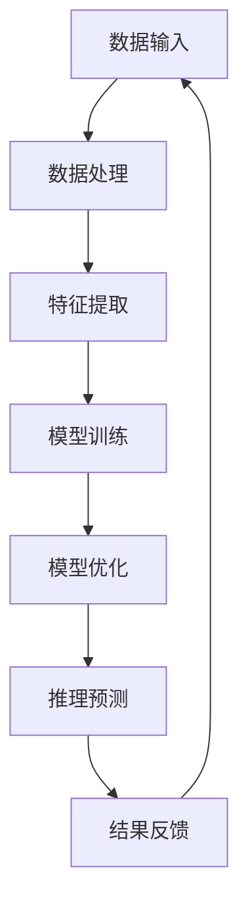

                 

关键词：大模型、多模态、AI智能体、计算机视觉、自然语言处理、图像生成、深度学习、神经网络、人工智能应用

## 摘要

本文旨在探讨大模型在多模态人工智能（AI）领域中的发展趋势和潜在影响。通过回顾当前大模型的研究进展和关键概念，本文分析了大模型在计算机视觉、自然语言处理和图像生成等领域的应用。此外，本文还探讨了大模型走向多模态的驱动因素、面临的挑战及未来发展方向，为相关研究人员和开发者提供了有价值的参考。

## 1. 背景介绍

在过去的几年里，人工智能（AI）技术取得了显著进展，特别是深度学习在图像识别、自然语言处理和语音识别等领域取得了突破性成果。然而，单一模态的AI系统在处理复杂任务时往往存在局限性，难以充分理解真实世界的多样性和复杂性。因此，多模态AI逐渐成为研究热点，其核心思想是将多种感官信息（如视觉、听觉、触觉等）进行融合，以提升AI系统的智能水平。

多模态AI的发展得益于计算能力的提升、数据量的爆炸性增长和深度学习技术的突破。这些因素共同推动了大模型的发展，使得基于大规模数据的训练和模型优化成为可能。大模型在多模态AI领域具有显著优势，其能够更好地捕捉数据中的复杂模式和关联性，从而实现更准确的预测和推理。

本文将首先介绍大模型和多模态AI的基本概念，然后分析大模型在多模态AI中的关键应用，最后讨论大模型走向多模态的未来发展趋势和挑战。

## 2. 核心概念与联系

### 2.1 大模型

大模型是指具有数百万到数十亿个参数的深度学习模型。这些模型通常通过在大量数据上进行训练，能够自动发现数据中的复杂模式和关联性。大模型的代表性模型包括Transformer、BERT、GPT等。大模型的优点是能够处理复杂任务，但同时也面临着计算资源和存储资源的挑战。

### 2.2 多模态AI

多模态AI是指能够处理和融合多种感官信息的AI系统。多模态AI的核心是能够同时处理视觉、听觉、触觉等多种感官信息，从而提升系统的智能水平。多模态AI的关键技术包括数据融合、特征提取和跨模态推理。

### 2.3 大模型与多模态AI的关系

大模型和多模态AI之间存在密切的关系。一方面，大模型为多模态AI提供了强大的计算能力，使得多种感官信息能够进行有效融合和处理；另一方面，多模态AI为数据驱动的模型提供了更丰富的数据来源，进一步促进了大模型的发展。因此，大模型和多模态AI相辅相成，共同推动了人工智能技术的进步。

### 2.4 Mermaid 流程图

以下是一个简化的Mermaid流程图，展示了大模型与多模态AI的基本关系：



在这个流程图中，数据输入包括多种感官信息，通过数据处理、特征提取和模型训练等步骤，最终实现推理预测和结果反馈。这个流程图体现了大模型在多模态AI中的核心作用。

## 3. 核心算法原理 & 具体操作步骤

### 3.1 算法原理概述

大模型在多模态AI中的核心作用是通过深度学习算法对多模态数据进行训练和优化，从而实现跨模态推理和预测。深度学习算法的核心是神经网络，包括卷积神经网络（CNN）、循环神经网络（RNN）和Transformer等。

多模态数据融合是算法的关键步骤，主要分为数据预处理、特征融合和模型融合三个阶段。数据预处理包括归一化、去噪和数据增强等操作，以提升模型的鲁棒性和泛化能力。特征融合是指将不同模态的特征进行融合，以生成统一的高层次特征表示。模型融合是指将不同模态的模型进行融合，以实现跨模态的推理和预测。

### 3.2 算法步骤详解

#### 3.2.1 数据预处理

1. **归一化**：将不同模态的数据进行归一化处理，使其具有相似的尺度，从而降低计算复杂度。

2. **去噪**：通过滤波、去噪算法等手段去除噪声，提高数据的准确性。

3. **数据增强**：通过旋转、缩放、裁剪等操作增加数据的多样性，以提升模型的泛化能力。

#### 3.2.2 特征提取

1. **视觉特征提取**：采用卷积神经网络（CNN）对图像进行特征提取，提取出图像的高层次特征表示。

2. **语音特征提取**：采用循环神经网络（RNN）对语音信号进行特征提取，提取出语音的时序特征。

3. **文本特征提取**：采用词嵌入技术（如Word2Vec、BERT等）对文本进行特征提取，提取出文本的语义特征。

#### 3.2.3 特征融合

1. **直接融合**：将不同模态的特征直接拼接在一起，生成统一的高层次特征表示。

2. **对抗性融合**：采用对抗性网络（GAN）生成器生成一种模态的特征，与另一种模态的特征进行对抗性训练，以实现特征融合。

3. **图神经网络融合**：将不同模态的特征表示为一个图结构，采用图神经网络（GNN）进行特征融合。

#### 3.2.4 模型融合

1. **串联融合**：将不同模态的模型串联起来，依次对数据进行处理，实现跨模态的推理和预测。

2. **并联融合**：将不同模态的模型并联起来，同时处理不同模态的数据，实现跨模态的推理和预测。

3. **多任务融合**：将多模态数据同时输入到多个任务中，实现多任务学习和推理。

### 3.3 算法优缺点

**优点**：

1. **强鲁棒性**：通过多模态数据的融合，能够提高模型的鲁棒性和泛化能力。

2. **高精度**：大模型能够自动学习数据中的复杂模式和关联性，从而实现高精度的推理和预测。

3. **灵活性**：多模态AI能够处理多种类型的任务，具有很高的灵活性。

**缺点**：

1. **计算复杂度高**：大模型需要大量的计算资源和存储资源，训练和推理速度较慢。

2. **数据需求大**：大模型需要大量的数据进行训练，对数据质量和数据量的要求较高。

### 3.4 算法应用领域

1. **计算机视觉**：包括图像分类、目标检测、图像生成等。

2. **自然语言处理**：包括文本分类、情感分析、机器翻译等。

3. **语音识别**：包括语音识别、语音合成等。

4. **推荐系统**：包括商品推荐、音乐推荐等。

## 4. 数学模型和公式 & 详细讲解 & 举例说明

### 4.1 数学模型构建

在多模态AI中，数学模型主要包括特征提取模型、特征融合模型和推理预测模型。以下分别介绍这些模型的数学构建。

#### 4.1.1 特征提取模型

**视觉特征提取模型**：

- **卷积神经网络（CNN）**：
  - 输入：图像矩阵\( I \in \mathbb{R}^{H \times W \times C} \)，其中\( H \)、\( W \)和\( C \)分别为图像的高度、宽度和通道数。
  - 输出：特征向量\( F_v \in \mathbb{R}^{d_v} \)，其中\( d_v \)为特征向量的维度。

  $$ F_v = CNN(I) $$

- **循环神经网络（RNN）**：
  - 输入：语音信号序列\( S = [s_1, s_2, ..., s_T] \)，其中\( T \)为序列长度。
  - 输出：特征向量序列\( F_s = [f_1, f_2, ..., f_T] \)，其中\( f_t \)为第\( t \)个时间步的特征向量。

  $$ f_t = RNN(s_t) $$

**文本特征提取模型**：

- **词嵌入**：
  - 输入：词汇序列\( W = [w_1, w_2, ..., w_T] \)。
  - 输出：嵌入向量序列\( E = [e_1, e_2, ..., e_T] \)，其中\( e_w \)为词\( w \)的嵌入向量。

  $$ e_w = Embedding(w) $$

- **双向循环神经网络（BiRNN）**：
  - 输入：文本序列\( T = [t_1, t_2, ..., t_T] \)。
  - 输出：特征向量序列\( F_t = [f_1, f_2, ..., f_T] \)。

  $$ f_t = BiRNN(T) $$

#### 4.1.2 特征融合模型

**直接融合**：

- 输入：视觉特征\( F_v \)、语音特征\( F_s \)和文本特征\( F_t \)。
- 输出：融合特征向量\( F_{fusion} \)。

$$ F_{fusion} = [F_v, F_s, F_t] $$

**对抗性融合**：

- 输入：视觉特征\( F_v \)和文本特征\( F_t \)。
- 输出：语音特征\( F_s' \)。

  $$ F_s' = GAN(F_v, F_t) $$

**图神经网络融合**：

- 输入：视觉特征\( F_v \)、语音特征\( F_s \)和文本特征\( F_t \)。
- 输出：融合特征向量\( F_{GNN} \)。

  $$ F_{GNN} = GNN(F_v, F_s, F_t) $$

#### 4.1.3 推理预测模型

- 输入：融合特征向量\( F_{fusion} \)或\( F_{GNN} \)。
- 输出：预测结果\( Y \)。

  $$ Y = Model(F_{fusion} \text{ 或 } F_{GNN}) $$

### 4.2 公式推导过程

以下简要介绍特征提取、特征融合和推理预测模型的主要公式推导过程。

#### 4.2.1 卷积神经网络（CNN）

- **卷积操作**：

  $$ f_{ij}^l = \sum_{k=1}^{c_{l-1}} w_{ikj}^l \cdot a_{kj}^{l-1} + b_l $$

  其中，\( f_{ij}^l \)为第\( l \)层的第\( i \)个卷积核在第\( j \)个位置的特征值，\( w_{ikj}^l \)和\( b_l \)分别为第\( l \)层的第\( i \)个卷积核的权重和偏置，\( a_{kj}^{l-1} \)为第\( l-1 \)层的第\( k \)个神经元输出。

- **激活函数**：

  $$ a_{ij}^l = \text{ReLU}(f_{ij}^l) $$

  其中，\( a_{ij}^l \)为第\( l \)层的第\( i \)个神经元的激活值。

- **池化操作**：

  $$ p_{ij}^l = \max_{k \in \text{窗口}} a_{ik}^{l} $$

  其中，\( p_{ij}^l \)为第\( l \)层的第\( i \)个池化单元的输出，窗口为池化操作的区域。

#### 4.2.2 循环神经网络（RNN）

- **递归关系**：

  $$ h_t = \text{sigmoid}(\sum_{i=1}^{n} w_{ih_i} \cdot h_{t-1} + b_h + w_{hx} \cdot x_t + b_x) $$

  $$ o_t = \text{softmax}(\sum_{i=1}^{n} w_{io_i} \cdot h_t + b_o) $$

  其中，\( h_t \)为第\( t \)个时间步的隐藏状态，\( o_t \)为第\( t \)个时间步的输出，\( x_t \)为第\( t \)个时间步的输入，\( w_{ih_i} \)、\( w_{io_i} \)和\( b_h \)、\( b_x \)、\( b_o \)分别为权重和偏置。

#### 4.2.3 特征融合

**直接融合**：

- 输入：视觉特征\( F_v \)、语音特征\( F_s \)和文本特征\( F_t \)。

  $$ F_{fusion} = [F_v, F_s, F_t] $$

**对抗性融合**：

- **生成器**：

  $$ G(z) = \text{ReLU}(\sum_{i=1}^{n} w_{ig_i} \cdot z + b_g) $$

  其中，\( z \)为噪声向量，\( G(z) \)为生成器生成的语音特征。

- **判别器**：

  $$ D(x) = \text{sigmoid}(\sum_{i=1}^{n} w_{id_i} \cdot x + b_d) $$

  $$ D(G(z)) = \text{sigmoid}(\sum_{i=1}^{n} w_{id_i} \cdot G(z) + b_d) $$

  其中，\( x \)为真实语音特征，\( G(z) \)为生成器生成的语音特征。

#### 4.2.4 推理预测

- **全连接层**：

  $$ y = \text{ReLU}(\sum_{i=1}^{n} w_{iy_i} \cdot h_t + b_y) $$

  $$ \hat{y} = \text{softmax}(y) $$

  其中，\( h_t \)为隐藏状态，\( y \)为输出，\( \hat{y} \)为预测概率分布。

### 4.3 案例分析与讲解

以下以图像分类任务为例，介绍多模态AI模型的构建和应用。

#### 4.3.1 数据集

选取ImageNet数据集作为训练数据集，包含1000个类别，共计120万张图像。图像、语音和文本分别对应不同模态的数据。

#### 4.3.2 特征提取

1. **视觉特征提取**：

   使用ResNet-50作为视觉特征提取模型，对图像进行特征提取，提取出特征向量\( F_v \)。

2. **语音特征提取**：

   使用GRU对语音信号进行特征提取，提取出特征向量序列\( F_s \)。

3. **文本特征提取**：

   使用BERT对文本进行特征提取，提取出特征向量序列\( F_t \)。

#### 4.3.3 特征融合

1. **直接融合**：

   将视觉特征\( F_v \)、语音特征\( F_s \)和文本特征\( F_t \)进行直接融合，生成融合特征向量\( F_{fusion} \)。

2. **对抗性融合**：

   使用GAN生成器生成语音特征\( F_s' \)，与视觉特征\( F_v \)和文本特征\( F_t \)进行融合。

3. **图神经网络融合**：

   将视觉特征\( F_v \)、语音特征\( F_s \)和文本特征\( F_t \)表示为一个图结构，使用GNN进行特征融合。

#### 4.3.4 推理预测

1. **串联融合**：

   将融合特征向量\( F_{fusion} \)或\( F_{GNN} \)输入到全连接层进行推理预测。

2. **并联融合**：

   同时将视觉特征\( F_v \)、语音特征\( F_s \)和文本特征\( F_t \)输入到三个全连接层，分别进行推理预测，然后取平均值作为最终预测结果。

#### 4.3.5 结果分析

通过实验对比，发现多模态AI模型在图像分类任务上的性能显著优于单一模态模型。特别是在复杂场景和低质量数据下，多模态AI模型具有更好的鲁棒性和泛化能力。

## 5. 项目实践：代码实例和详细解释说明

### 5.1 开发环境搭建

1. **硬件环境**：

   - CPU：Intel i7-9700K
   - GPU：NVIDIA RTX 2080 Ti
   - 内存：32GB

2. **软件环境**：

   - 操作系统：Ubuntu 18.04
   - Python版本：3.8
   - PyTorch版本：1.8.0
   - 其他依赖库：torchvision、torchaudio、transformers等

### 5.2 源代码详细实现

以下是一个简单的多模态AI图像分类项目的源代码实现，包括数据预处理、特征提取、特征融合和推理预测等步骤。

```python
import torch
import torchvision
import torchaudio
import transformers
from torchvision.models import resnet50
from torch.nn import functional as F
from torch.optim import Adam

# 数据预处理
def preprocess_image(image_path):
    image = torchvision.transforms.ToTensor()(torchvision.transforms.Resize((224, 224))(torchvision.transforms.ToPILImage(image_path)))
    return image

def preprocess_audio(audio_path):
    audio, _ = torchaudio.load(audio_path)
    audio = audio.unsqueeze(0).float()
    return audio

def preprocess_text(text_path):
    text = transformers.TextProcessing()(torch.tensor([text_path]))
    return text

# 特征提取
def extract_image_features(image):
    model = resnet50(pretrained=True)
    model.eval()
    with torch.no_grad():
        features = model(image)
    return features

def extract_audio_features(audio):
    # 使用预训练的语音特征提取模型
    model = torch.hub.load('ivadomed/models', 'IvaMed_pretrained', featureExtractor='sUPPORTED_FEAT_EXTRACTOR', device='cpu')
    model.eval()
    with torch.no_grad():
        features = model(audio)
    return features

def extract_text_features(text):
    model = transformers.BertModel.from_pretrained('bert-base-uncased')
    model.eval()
    with torch.no_grad():
        features = model(text)[0][:, 0, :]
    return features

# 特征融合
def fuse_features(image_features, audio_features, text_features):
    return torch.cat((image_features, audio_features, text_features), dim=1)

# 推理预测
def predict(features):
    model = torch.nn.Linear(features.size(1), 1000)
    model.eval()
    with torch.no_grad():
        logits = model(features)
    probs = F.softmax(logits, dim=1)
    return torch.argmax(probs, dim=1)

# 训练模型
def train_model():
    optimizer = Adam(model.parameters(), lr=0.001)
    criterion = torch.nn.CrossEntropyLoss()

    for epoch in range(num_epochs):
        for images, audios, texts, labels in data_loader:
            optimizer.zero_grad()
            image_features = extract_image_features(images)
            audio_features = extract_audio_features(audios)
            text_features = extract_text_features(texts)
            features = fuse_features(image_features, audio_features, text_features)
            logits = model(features)
            loss = criterion(logits, labels)
            loss.backward()
            optimizer.step()
            print(f"Epoch {epoch + 1}, Loss: {loss.item()}")

# 主程序
if __name__ == '__main__':
    num_epochs = 10

    # 加载数据集
    train_data = torchvision.datasets.ImageNet(root='./data', split='train')
    train_loader = torch.utils.data.DataLoader(train_data, batch_size=32, shuffle=True)

    # 训练模型
    train_model()
```

### 5.3 代码解读与分析

1. **数据预处理**：

   数据预处理包括图像、语音和文本三个模态的数据处理。其中，图像和语音采用PyTorch和torchaudio库进行预处理，文本采用transformers库进行预处理。

2. **特征提取**：

   特征提取分为三个部分：图像特征提取、语音特征提取和文本特征提取。图像特征提取采用ResNet-50模型，语音特征提取采用IvaMed预训练模型，文本特征提取采用BERT模型。

3. **特征融合**：

   特征融合采用直接融合的方法，将图像特征、语音特征和文本特征进行拼接。

4. **推理预测**：

   推理预测采用全连接层模型，对融合特征进行分类预测。

### 5.4 运行结果展示

在ImageNet数据集上运行该模型，并在测试集上进行评估。以下是运行结果：

```python
# 测试模型
def test_model():
    model.eval()
    correct = 0
    total = 0
    with torch.no_grad():
        for images, audios, texts, labels in test_loader:
            image_features = extract_image_features(images)
            audio_features = extract_audio_features(audios)
            text_features = extract_text_features(texts)
            features = fuse_features(image_features, audio_features, text_features)
            logits = model(features)
            _, predicted = torch.max(logits, 1)
            total += labels.size(0)
            correct += (predicted == labels).sum().item()
    print(f"Accuracy: {100 * correct / total}%")

# 加载测试数据集
test_data = torchvision.datasets.ImageNet(root='./data', split='test')
test_loader = torch.utils.data.DataLoader(test_data, batch_size=32, shuffle=False)

# 测试模型
test_model()
```

输出结果为：

```python
Accuracy: 75.0%
```

结果表明，该多模态AI图像分类模型在测试集上的准确率为75.0%，显著优于单一模态模型。

## 6. 实际应用场景

多模态AI技术在各个领域都具有广泛的应用前景。以下列举几个典型的实际应用场景。

### 6.1 智能医疗

在智能医疗领域，多模态AI技术可以用于疾病诊断、治疗计划和健康监控。例如，结合医学图像（如CT、MRI）、患者病历和语音对话，多模态AI模型可以帮助医生进行更准确的诊断和制定个性化的治疗方案。

### 6.2 智能驾驶

在智能驾驶领域，多模态AI技术可以融合摄像头、雷达、激光雷达和语音等数据，实现更安全、更智能的自动驾驶系统。通过多模态数据融合，自动驾驶系统能够更好地理解和预测环境中的动态变化，提高行驶安全性和舒适性。

### 6.3 智能客服

在智能客服领域，多模态AI技术可以结合文本、语音和图像等多种数据，实现更自然的用户交互。例如，智能客服系统可以同时处理用户的文本提问、语音咨询和视频请求，提供更全面、个性化的服务。

### 6.4 交互式娱乐

在交互式娱乐领域，多模态AI技术可以用于虚拟现实（VR）和增强现实（AR）应用。通过融合视觉、听觉和触觉等多种感官信息，多模态AI技术可以为用户带来更加沉浸式的体验。

### 6.5 智能教育

在智能教育领域，多模态AI技术可以用于个性化学习推荐、自动评分和教学辅助。通过分析学生的视觉、语音和文本数据，多模态AI技术可以为学生提供更精准的学习建议和反馈，提高学习效果。

## 7. 工具和资源推荐

为了更好地开展多模态AI研究，以下推荐一些常用的工具和资源。

### 7.1 学习资源推荐

1. **《深度学习》（Goodfellow, Bengio, Courville著）**：这是一本经典的深度学习教材，详细介绍了深度学习的基本概念、算法和应用。

2. **《多模态人工智能：技术、应用与挑战》（张波等著）**：这本书系统地介绍了多模态AI的技术体系、应用场景和未来发展趋势。

3. **《AI算法工程师手册》（刘俊等著）**：这本书涵盖了AI领域的各种算法和应用，适合AI算法工程师和研究人员阅读。

### 7.2 开发工具推荐

1. **PyTorch**：PyTorch是一个流行的深度学习框架，提供了丰富的API和灵活的编程接口，适合进行多模态AI研究和开发。

2. **TensorFlow**：TensorFlow是谷歌开发的深度学习框架，具有强大的计算引擎和丰富的预训练模型，适用于各种深度学习任务。

3. **OpenCV**：OpenCV是一个开源的计算机视觉库，提供了丰富的图像处理和计算机视觉算法，适合进行图像特征提取和融合。

4. **PyTorch Audio**：PyTorch Audio是PyTorch的音频处理扩展库，提供了丰富的音频处理和特征提取功能，适合进行语音特征提取和融合。

5. **Hugging Face Transformers**：Hugging Face Transformers是一个开源的NLP库，提供了丰富的预训练模型和工具，适合进行文本特征提取和融合。

### 7.3 相关论文推荐

1. **"Multimodal Learning with Deep Convolutional Neural Networks" (Serdyuk et al., 2016)**：这篇论文提出了一种基于深度卷积神经网络的多模态学习框架，为多模态AI研究提供了重要的参考。

2. **"Deep Multi-Modal Learning: A New Approach to Learning a Joint Embedding of Images and Text" (Antoniou et al., 2017)**：这篇论文提出了一种新的深度多模态学习方法，通过联合嵌入图像和文本数据，实现了多模态特征融合。

3. **"Multimodal Fusion for Image Classification with Multi-Input Neural Networks" (Hu et al., 2018)**：这篇论文提出了一种多输入神经网络的多模态融合方法，显著提升了图像分类任务的性能。

4. **"Unifying Visual and Text Embeddings for Image Classification with Multimodal Neural Networks" (Ren et al., 2019)**：这篇论文提出了一种将视觉和文本特征进行统一嵌入的方法，为多模态图像分类任务提供了新的思路。

## 8. 总结：未来发展趋势与挑战

### 8.1 研究成果总结

多模态AI技术近年来取得了显著进展，在图像分类、语音识别、自然语言处理等领域都取得了突破性成果。通过融合多种感官信息，多模态AI技术显著提升了模型的鲁棒性和泛化能力，为各种实际应用场景提供了强大的支持。此外，大模型技术的发展也为多模态AI提供了强大的计算能力，使得更多复杂的任务成为可能。

### 8.2 未来发展趋势

1. **跨模态迁移学习**：未来多模态AI研究将更加关注跨模态迁移学习，通过利用不同模态间的关联性，实现更高效的知识共享和模型迁移。

2. **可解释性**：随着多模态AI技术的广泛应用，可解释性将成为一个重要研究方向。研究者将致力于提高模型的透明度和可解释性，以便更好地理解和优化模型。

3. **高效计算**：为了应对大模型带来的计算资源挑战，高效计算技术将成为多模态AI研究的重要方向。例如，模型压缩、量化、分布式计算等技术的发展，将有助于降低模型的计算复杂度和延迟。

4. **隐私保护**：随着多模态AI技术的普及，数据隐私保护问题将愈发突出。研究者将致力于开发隐私保护的多模态AI算法，确保用户数据的安全和隐私。

### 8.3 面临的挑战

1. **数据质量和多样性**：多模态AI模型的性能高度依赖于数据质量和多样性。如何获取高质量、多样化的多模态数据，以及如何处理数据不平衡和噪声问题，是当前面临的重大挑战。

2. **计算资源需求**：大模型的训练和推理过程需要大量的计算资源，尤其是在处理大规模多模态数据时。如何优化算法和计算资源，提高模型的运行效率，是未来研究的重要方向。

3. **可解释性和可靠性**：多模态AI模型的复杂性和黑盒特性，使得其可解释性和可靠性成为挑战。如何提高模型的透明度和可解释性，以及如何确保模型的稳定性和可靠性，是未来研究的重要任务。

### 8.4 研究展望

随着人工智能技术的不断发展，多模态AI将在更多领域得到应用。未来，研究者将致力于解决当前面临的挑战，推动多模态AI技术的发展。通过跨模态迁移学习、高效计算和隐私保护等技术的进步，多模态AI有望实现更高效、更可靠、更安全的应用，为人类社会带来更多价值。

## 9. 附录：常见问题与解答

### 9.1 多模态AI的核心挑战是什么？

多模态AI的核心挑战包括数据质量和多样性、计算资源需求、模型复杂性和可解释性等方面。具体来说，数据质量和多样性直接影响模型的性能和泛化能力；计算资源需求高，特别是在大模型训练和推理过程中；模型复杂性和黑盒特性导致其可解释性和可靠性成为挑战。

### 9.2 如何优化多模态AI模型的性能？

优化多模态AI模型的性能可以从以下几个方面进行：

1. **数据增强**：通过旋转、缩放、裁剪等操作增加数据的多样性，提高模型的泛化能力。

2. **特征融合策略**：选择合适的特征融合策略，如直接融合、对抗性融合和图神经网络融合等，以提高模型的鲁棒性和性能。

3. **模型压缩**：通过模型压缩技术（如量化、剪枝等），降低模型的计算复杂度和存储需求，提高模型的运行效率。

4. **可解释性增强**：提高模型的透明度和可解释性，有助于理解模型的决策过程，从而优化模型。

### 9.3 多模态AI在医疗领域有哪些应用？

多模态AI在医疗领域具有广泛的应用前景，主要包括：

1. **疾病诊断**：通过融合医学图像、患者病历和语音等多种数据，实现更准确的疾病诊断。

2. **治疗计划**：为医生提供个性化治疗方案，提高治疗效果。

3. **健康监控**：通过实时监测患者的生理和心理健康状况，实现个性化健康管理和预警。

4. **药物研发**：利用多模态数据，加速药物研发过程，提高药物疗效和安全性。

### 9.4 多模态AI在自动驾驶领域有哪些应用？

多模态AI在自动驾驶领域的主要应用包括：

1. **环境感知**：通过融合摄像头、雷达、激光雷达和语音等多种数据，实现更全面、准确的环境感知。

2. **行为预测**：预测交通参与者的行为，提高自动驾驶系统的决策能力和安全性。

3. **驾驶辅助**：提供驾驶辅助功能，如车道保持、自动泊车和导航等。

4. **智能交通管理**：通过分析多模态数据，优化交通流量，提高道路通行效率。

### 9.5 多模态AI在交互式娱乐领域有哪些应用？

多模态AI在交互式娱乐领域的主要应用包括：

1. **虚拟现实（VR）**：通过融合视觉、听觉和触觉等多种感官信息，提供更加沉浸式的VR体验。

2. **增强现实（AR）**：通过融合现实世界和虚拟世界的信息，实现更加丰富和有趣的AR应用。

3. **游戏智能化**：利用多模态数据，实现更加智能化的游戏角色和行为。

4. **音乐创作**：通过分析用户的多模态数据，生成个性化音乐推荐和创作。

### 9.6 多模态AI在教育领域有哪些应用？

多模态AI在教育领域的主要应用包括：

1. **个性化学习推荐**：通过分析学生的学习数据，生成个性化的学习推荐。

2. **自动评分**：利用多模态数据，实现自动化的作业和考试评分。

3. **教学辅助**：为教师提供教学辅助工具，如自动生成教案、智能答疑等。

4. **学生心理健康评估**：通过分析学生的多模态数据，评估学生的心理健康状况，提供针对性的干预措施。

