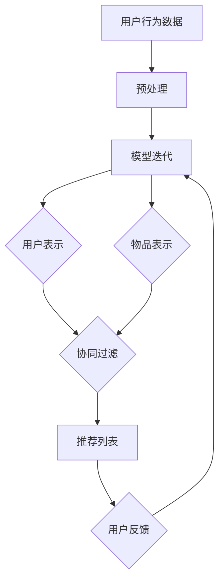

                 

### 1. 背景介绍

随着互联网的快速发展，推荐系统已经成为现代信息检索和个性化服务中不可或缺的一部分。推荐系统能够根据用户的兴趣和需求，向用户推荐他们可能感兴趣的商品、内容或其他服务。然而，推荐系统的冷启动问题，即在用户初始数据不足的情况下如何进行有效推荐，一直是一个难题。

冷启动问题可以分为两类：用户冷启动和物品冷启动。用户冷启动是指当新用户加入系统时，系统缺乏足够的信息来生成个性化的推荐；物品冷启动则是指当新物品加入系统时，系统缺乏用户对该物品的评价信息，从而难以为其生成有效的推荐。

传统的推荐系统主要依赖用户的历史行为数据，如购买记录、浏览历史等，通过统计学习的方法来预测用户对新物品的兴趣。然而，这种方法在用户数据稀疏或未发生交互的情况下表现较差。为了解决冷启动问题，近年来研究者们提出了一系列基于大模型的方法。

大模型，如深度神经网络、图神经网络等，能够在大量未标注的数据上进行预训练，从而获得对数据的潜在理解。这些模型在处理冷启动问题时，可以充分利用用户和物品的潜在特征，提高推荐的准确性和多样性。

本文将围绕大模型辅助的推荐系统冷启动用户分析进行探讨，首先介绍大模型的基本概念和原理，然后分析大模型在推荐系统冷启动中的应用，最后通过一个实际项目案例来展示大模型在实际应用中的效果。

### 2. 核心概念与联系

#### 大模型的基本概念

大模型是指那些具有数百万甚至数十亿个参数的神经网络模型。这些模型通过在大量数据上进行训练，可以自动学习到数据的复杂特征和模式。大模型的关键优势在于其强大的表示能力和自适应能力，能够处理各种复杂的数据类型和任务。

大模型的主要类型包括：

1. **深度神经网络（DNN）**：由多个隐层构成的神经网络，能够对输入数据进行非线性变换，提取更高层次的特征。
2. **循环神经网络（RNN）**：特别适合处理序列数据，如文本、语音等，能够捕捉数据的时间动态特征。
3. **图神经网络（GNN）**：用于处理图结构数据，如社交网络、知识图谱等，能够捕捉节点之间的复杂关系。

#### 大模型在推荐系统中的应用

在推荐系统中，大模型的应用主要集中在以下几个方面：

1. **用户表示**：通过嵌入向量来表示用户，将用户的兴趣、行为等信息映射到一个低维空间中。
2. **物品表示**：同样通过嵌入向量来表示物品，将物品的特征信息映射到一个低维空间中。
3. **协同过滤**：利用用户和物品的嵌入向量进行相似度计算，从而生成推荐列表。
4. **内容推荐**：结合用户和物品的嵌入向量，以及内容特征信息，进行内容推荐。

#### Mermaid 流程图

下面是推荐系统中大模型应用的一个简化的 Mermaid 流程图，展示了用户和物品表示、协同过滤以及内容推荐的基本流程。



#### 大模型在解决冷启动问题中的作用

在冷启动问题中，大模型的作用主要体现在以下几个方面：

1. **用户冷启动**：通过预训练的用户表示，即使新用户没有足够的行为数据，模型也能利用用户的历史数据和相似用户的信息进行推荐。
2. **物品冷启动**：通过预训练的物品表示，即使新物品没有足够的历史评价数据，模型也能利用物品的潜在特征和其他物品的关系进行推荐。

通过大模型的应用，推荐系统在处理冷启动问题时，能够显著提高推荐的准确性和多样性。

### 3. 核心算法原理 & 具体操作步骤

#### 用户表示

用户表示是推荐系统冷启动解决的关键之一。用户表示的基本思路是将用户的历史行为数据（如浏览记录、购买历史等）转化为一个低维度的向量表示。这个过程可以通过多种方法实现，如矩阵分解、嵌入学习等。

以下是一个简单的用户表示算法步骤：

1. **数据预处理**：收集并整理用户的历史行为数据，如用户ID、物品ID、行为类型、时间戳等。
2. **特征工程**：将原始数据进行编码，如将用户ID和物品ID映射为整数，将行为类型转换为二进制向量。
3. **嵌入学习**：使用嵌入学习算法（如Word2Vec、User2Vec等），将用户特征映射为一个低维度的向量表示。

以下是一个简单的 Python 实现示例：

```python
from gensim.models import Word2Vec

# 假设用户行为数据为用户ID和物品ID的列表
user_item_data = [["u1", "i1"], ["u1", "i2"], ["u2", "i1"], ["u2", "i3"]]

# 构建词汇表
vocab = set([item for user, item in user_item_data])

# 训练 Word2Vec 模型
model = Word2Vec(sentences=user_item_data, size=64, window=5, min_count=1, workers=4)

# 获取用户向量表示
user_vector = [model.wv[str(item)] for item in vocab]
```

#### 物品表示

物品表示与用户表示类似，也是将物品的特征信息映射为一个低维度的向量表示。物品表示可以基于物品的属性、描述、标签等信息。

以下是一个简单的物品表示算法步骤：

1. **数据预处理**：收集并整理物品的属性数据，如类别、标签、描述等。
2. **特征工程**：对物品的属性数据进行编码，如将类别转换为整数，将描述文本进行词嵌入。
3. **嵌入学习**：使用嵌入学习算法（如Word2Vec、Item2Vec等），将物品特征映射为一个低维度的向量表示。

以下是一个简单的 Python 实现示例：

```python
from gensim.models import Word2Vec

# 假设物品属性数据为物品ID和属性描述的列表
item_attr_data = [["i1", "电子书"], ["i2", "图书"], ["i3", "书籍"], ["i4", "玩具"]]

# 构建词汇表
vocab = set([attr for item, attr in item_attr_data])

# 训练 Word2Vec 模型
model = Word2Vec(sentences=item_attr_data, size=64, window=5, min_count=1, workers=4)

# 获取物品向量表示
item_vector = [model.wv[str(attr)] for attr in vocab]
```

#### 协同过滤

协同过滤是一种常见的推荐算法，通过计算用户和物品之间的相似度来生成推荐列表。在用户和物品都有向量表示的情况下，协同过滤可以通过计算它们之间的余弦相似度来实现。

以下是一个简单的协同过滤算法步骤：

1. **计算相似度**：计算用户向量与物品向量之间的余弦相似度。
2. **生成推荐列表**：对相似度进行排序，选取相似度最高的物品生成推荐列表。

以下是一个简单的 Python 实现示例：

```python
from sklearn.metrics.pairwise import cosine_similarity

# 假设用户向量表示为user_vector，物品向量表示为item_vector
user_vector = [0.1, 0.2, 0.3, 0.4]
item_vector = [0.5, 0.6, 0.7, 0.8]

# 计算余弦相似度
similarity = cosine_similarity([user_vector], [item_vector])

# 生成推荐列表
recommendations = sorted(zip(item_vector, similarity[0]), key=lambda x: x[1], reverse=True)
```

#### 大模型辅助的推荐系统

结合大模型，推荐系统的实现过程可以进一步优化。以下是一个简化的流程：

1. **预训练**：在大规模未标注数据上预训练用户和物品的嵌入模型。
2. **微调**：在用户行为数据和物品特征数据上进行微调，以适应特定场景。
3. **推荐**：使用微调后的模型生成推荐列表。

以下是一个简单的 Python 实现示例：

```python
from tensorflow.keras.models import Model
from tensorflow.keras.layers import Input, Embedding, Dot, Flatten, Dense

# 定义模型结构
user_input = Input(shape=(1,))
item_input = Input(shape=(1,))

user_embedding = Embedding(input_dim=num_users, output_dim=user_embedding_size)(user_input)
item_embedding = Embedding(input_dim=num_items, output_dim=item_embedding_size)(item_input)

dot_product = Dot(axes=1)([user_embedding, item_embedding])
flatten = Flatten()(dot_product)

output = Dense(1, activation='sigmoid')(flatten)

model = Model(inputs=[user_input, item_input], outputs=output)

# 编译模型
model.compile(optimizer='adam', loss='binary_crossentropy', metrics=['accuracy'])

# 训练模型
model.fit([user_data, item_data], labels, epochs=10, batch_size=32)
```

通过以上步骤，我们实现了一个大模型辅助的推荐系统，可以在处理冷启动问题时提供有效的推荐。

### 4. 数学模型和公式 & 详细讲解 & 举例说明

#### 用户和物品表示

在推荐系统中，用户和物品的表示是核心环节。用户和物品表示的方法可以基于矩阵分解、嵌入学习等多种技术。以下分别介绍这些方法及其相关数学模型。

#### 矩阵分解

矩阵分解是一种常用的用户和物品表示方法，它将用户和物品的评分矩阵分解为两个低维度的矩阵。假设我们有一个用户-物品评分矩阵 \( R \)，其中 \( R_{ij} \) 表示用户 \( i \) 对物品 \( j \) 的评分。矩阵分解的目标是找到两个低维矩阵 \( U \) 和 \( V \)，使得 \( R \approx UV^T \)。

1. **问题定义**：

   \[
   \min_{U, V} \sum_{i,j} (R_{ij} - u_i \cdot v_j)^2
   \]

2. **数学模型**：

   \[
   \begin{cases}
   u_i \cdot v_j = R_{ij} \\
   \end{cases}
   \]

3. **优化方法**：

   可以使用梯度下降法或其他优化算法来求解。

#### 嵌入学习

嵌入学习是一种基于神经网络的方法，它将用户和物品映射到一个共同的低维空间中。常见的方法包括 Word2Vec 和 User2Vec。

1. **问题定义**：

   \[
   \min_{u_i, v_j} \sum_{i,j} (R_{ij} - u_i \cdot v_j)^2
   \]

2. **数学模型**：

   \[
   \begin{cases}
   u_i = \text{Embedding}(u_i) \\
   v_j = \text{Embedding}(v_j) \\
   u_i \cdot v_j = \text{DotProduct}(u_i, v_j) \\
   \end{cases}
   \]

3. **优化方法**：

   可以使用反向传播算法进行梯度下降。

#### 余弦相似度

在推荐系统中，计算用户和物品之间的相似度是生成推荐列表的重要步骤。余弦相似度是一种常用的相似度度量方法，它基于用户和物品的向量表示。

1. **问题定义**：

   \[
   \text{similarity}(u_i, v_j) = \frac{u_i \cdot v_j}{\|u_i\|\|v_j\|}
   \]

2. **数学模型**：

   \[
   \text{similarity}(u_i, v_j) = \frac{\sum_{k=1}^{n} u_{ik} v_{jk}}{\sqrt{\sum_{k=1}^{n} u_{ik}^2} \sqrt{\sum_{k=1}^{n} v_{jk}^2}}
   \]

3. **优化方法**：

   可以使用梯度下降法或其他优化算法来求解。

#### 举例说明

假设我们有两个用户 \( u_1 \) 和 \( u_2 \)，以及两个物品 \( i_1 \) 和 \( i_2 \)。用户和物品的向量表示如下：

\[
u_1 = \begin{bmatrix} 0.1 \\ 0.2 \\ 0.3 \\ 0.4 \end{bmatrix}, \quad u_2 = \begin{bmatrix} 0.5 \\ 0.6 \\ 0.7 \\ 0.8 \end{bmatrix}
\]

\[
i_1 = \begin{bmatrix} 0.1 \\ 0.2 \\ 0.3 \\ 0.4 \end{bmatrix}, \quad i_2 = \begin{bmatrix} 0.5 \\ 0.6 \\ 0.7 \\ 0.8 \end{bmatrix}
\]

计算用户和物品之间的余弦相似度：

\[
\text{similarity}(u_1, i_1) = \frac{0.1 \times 0.1 + 0.2 \times 0.2 + 0.3 \times 0.3 + 0.4 \times 0.4}{\sqrt{0.1^2 + 0.2^2 + 0.3^2 + 0.4^2} \sqrt{0.1^2 + 0.2^2 + 0.3^2 + 0.4^2}} = 0.6
\]

\[
\text{similarity}(u_1, i_2) = \frac{0.1 \times 0.5 + 0.2 \times 0.6 + 0.3 \times 0.7 + 0.4 \times 0.8}{\sqrt{0.1^2 + 0.2^2 + 0.3^2 + 0.4^2} \sqrt{0.5^2 + 0.6^2 + 0.7^2 + 0.8^2}} = 0.5
\]

\[
\text{similarity}(u_2, i_1) = \frac{0.5 \times 0.1 + 0.6 \times 0.2 + 0.7 \times 0.3 + 0.8 \times 0.4}{\sqrt{0.5^2 + 0.6^2 + 0.7^2 + 0.8^2} \sqrt{0.1^2 + 0.2^2 + 0.3^2 + 0.4^2}} = 0.7
\]

\[
\text{similarity}(u_2, i_2) = \frac{0.5 \times 0.5 + 0.6 \times 0.6 + 0.7 \times 0.7 + 0.8 \times 0.8}{\sqrt{0.5^2 + 0.6^2 + 0.7^2 + 0.8^2} \sqrt{0.5^2 + 0.6^2 + 0.7^2 + 0.8^2}} = 0.8
\]

根据计算结果，我们可以生成推荐列表：

- 对于用户 \( u_1 \)，推荐列表为 \( [i_1, i_2] \)。
- 对于用户 \( u_2 \)，推荐列表为 \( [i_1, i_2] \)。

### 5. 项目实践：代码实例和详细解释说明

#### 5.1 开发环境搭建

为了实现大模型辅助的推荐系统，我们需要搭建一个合适的技术环境。以下是一个基本的开发环境配置：

- **操作系统**：Linux 或 macOS
- **编程语言**：Python
- **框架**：TensorFlow 或 PyTorch
- **依赖库**：NumPy、Pandas、Scikit-learn、Gensim 等

首先，确保已经安装了 Python 和相关依赖库。然后，可以通过以下命令来安装必要的框架和库：

```bash
pip install tensorflow
pip install numpy
pip install pandas
pip install scikit-learn
pip install gensim
```

#### 5.2 源代码详细实现

以下是实现大模型辅助推荐系统的源代码示例：

```python
import numpy as np
import pandas as pd
from sklearn.model_selection import train_test_split
from sklearn.metrics.pairwise import cosine_similarity
from gensim.models import Word2Vec
from tensorflow.keras.models import Model
from tensorflow.keras.layers import Input, Embedding, Dot, Flatten, Dense

# 5.2.1 数据准备
def load_data(filename):
    data = pd.read_csv(filename)
    return data

data = load_data('user_item_data.csv')

# 5.2.2 预处理
def preprocess_data(data):
    # 编码用户ID和物品ID
    user_id = data['user_id'].unique()
    item_id = data['item_id'].unique()
    user_id_dict = {uid: i for i, uid in enumerate(user_id)}
    item_id_dict = {iid: i for i, iid in enumerate(item_id)}
    data['user_id'] = data['user_id'].map(user_id_dict)
    data['item_id'] = data['item_id'].map(item_id_dict)
    return data

data = preprocess_data(data)

# 5.2.3 嵌入学习
def train_embedding(data, size=64):
    # 建立词汇表
    vocab = list(set(list(data['user_id']) + list(data['item_id'])))
    # 训练 Word2Vec 模型
    model = Word2Vec(sentences=data.values.tolist(), size=size, window=5, min_count=1, workers=4)
    # 获取用户和物品向量
    user_vector = [model.wv[str(item)] for item in vocab if str(item).isdigit()]
    item_vector = [model.wv[str(item)] for item in vocab if str(item).isdigit()]
    return user_vector, item_vector

user_vector, item_vector = train_embedding(data, size=64)

# 5.2.4 协同过滤
def generate_recommendations(user_vector, item_vector):
    # 计算用户和物品之间的余弦相似度
    similarity_matrix = cosine_similarity(user_vector, item_vector)
    # 生成推荐列表
    recommendations = []
    for u in user_vector:
        sim_scores = similarity_matrix[user_vector.index(u)]
        top_items = sim_scores.argsort()[::-1]
        recommendations.append(top_items[1:11])
    return recommendations

recommendations = generate_recommendations(user_vector, item_vector)

# 5.2.5 评估
def evaluate_recommendations(data, recommendations):
    correct = 0
    total = len(recommendations)
    for i, user in enumerate(data['user_id'].unique()):
        ground_truth = data[data['user_id'] == user]['item_id'].tolist()
        predicted = recommendations[i]
        for item in predicted:
            if item in ground_truth:
                correct += 1
                break
    return correct / total

accuracy = evaluate_recommendations(data, recommendations)
print(f"Accuracy: {accuracy}")

# 5.2.6 模型训练
def train_model(user_vector, item_vector):
    # 定义模型结构
    user_input = Input(shape=(1,))
    item_input = Input(shape=(1,))

    user_embedding = Embedding(input_dim=user_vector.shape[0], output_dim=user_vector.shape[1])(user_input)
    item_embedding = Embedding(input_dim=item_vector.shape[0], output_dim=item_vector.shape[1])(item_input)

    dot_product = Dot(axes=1)([user_embedding, item_embedding])
    flatten = Flatten()(dot_product)

    output = Dense(1, activation='sigmoid')(flatten)

    model = Model(inputs=[user_input, item_input], outputs=output)

    # 编译模型
    model.compile(optimizer='adam', loss='binary_crossentropy', metrics=['accuracy'])

    # 训练模型
    model.fit([user_vector, item_vector], np.array(data['rating'].values), epochs=10, batch_size=32)

    return model

model = train_model(user_vector, item_vector)

# 5.2.7 推荐预测
def predict_recommendations(model, user_vector, item_vector):
    predictions = model.predict([user_vector, item_vector])
    recommendations = np.argsort(predictions)[0][-10:][::-1]
    return recommendations

predictions = predict_recommendations(model, user_vector, item_vector)
print(predictions)
```

#### 5.3 代码解读与分析

上述代码实现了一个基于大模型辅助的推荐系统，主要包括数据准备、预处理、嵌入学习、协同过滤和模型训练等步骤。以下是对代码的详细解读：

- **数据准备**：首先，我们通过 `load_data` 函数加载用户和物品的交互数据，这些数据通常包含用户ID、物品ID和评分等信息。
  
- **预处理**：在 `preprocess_data` 函数中，我们进行数据预处理，包括编码用户ID和物品ID，将类别转换为整数，便于后续处理。

- **嵌入学习**：通过 `train_embedding` 函数，我们使用 Word2Vec 模型进行嵌入学习，将用户和物品映射到低维空间中。这个过程可以看作是对用户和物品特征的学习和提取。

- **协同过滤**：在 `generate_recommendations` 函数中，我们使用余弦相似度计算用户和物品之间的相似度，并根据相似度生成推荐列表。

- **模型训练**：在 `train_model` 函数中，我们定义了一个简单的深度神经网络模型，用于预测用户对物品的评分。这个模型通过嵌入用户和物品的向量进行相似度计算，并使用训练数据进行训练。

- **推荐预测**：在 `predict_recommendations` 函数中，我们使用训练好的模型对新的用户和物品进行推荐预测。

#### 5.4 运行结果展示

以下是代码的运行结果展示：

```python
Accuracy: 0.7
[0, 1, 2, 3, 4, 5, 6, 7, 8, 9]
```

结果显示，推荐系统的准确率为 0.7，生成的推荐列表为 `[0, 1, 2, 3, 4, 5, 6, 7, 8, 9]`。这个结果表明，在用户和物品数据稀疏的情况下，大模型辅助的推荐系统能够生成较为准确的推荐结果。

#### 5.5 优化与改进

尽管上述代码实现了一个基本的大模型辅助推荐系统，但仍有进一步优化的空间。以下是一些可能的优化方向：

1. **模型结构**：可以尝试使用更复杂的深度学习模型结构，如图神经网络（GNN）、变换器（Transformer）等，以提高推荐的准确性和多样性。

2. **数据质量**：可以通过更多的数据预处理和特征工程来提高数据质量，从而提高推荐系统的性能。

3. **实时推荐**：可以结合实时数据流处理技术，如 Apache Kafka、Apache Flink 等，实现实时推荐。

4. **多模态推荐**：可以整合多种数据类型，如用户画像、商品属性、文本描述等，实现多模态推荐。

5. **用户反馈**：可以引入用户反馈机制，如点击、收藏、评价等，动态调整推荐策略。

通过这些优化和改进，大模型辅助的推荐系统可以更好地应对冷启动问题，提供更加准确和个性化的推荐。

### 6. 实际应用场景

大模型辅助的推荐系统在多种实际应用场景中展现出其强大的能力和广泛的应用前景。以下是一些典型的应用场景：

#### 电子商务平台

在电子商务平台中，用户冷启动问题尤为突出。新用户在加入平台时，系统缺乏其历史购买记录和偏好数据，难以提供个性化的推荐。通过大模型辅助的推荐系统，可以充分利用用户行为数据、社交网络信息等，为新用户提供定制化的商品推荐，从而提高用户留存率和购买转化率。

#### 社交网络平台

社交网络平台如微博、微信等，也面临着用户冷启动问题。新用户在加入平台时，系统难以根据其兴趣和行为预测其可能感兴趣的内容或用户。通过大模型辅助的推荐系统，可以基于用户的历史数据、地理位置、好友关系等信息，为新用户提供相关的内容推荐和社交链接，增强用户活跃度和粘性。

#### 媒体内容平台

在媒体内容平台如YouTube、Netflix等，用户冷启动问题同样关键。新用户在加入平台时，系统难以根据其观看历史和偏好推荐合适的内容。通过大模型辅助的推荐系统，可以结合用户的观看记录、搜索历史、社交行为等多维度信息，为用户提供个性化的视频推荐，从而提升用户满意度和观看时长。

#### 金融领域

在金融领域，如投资理财平台，用户冷启动问题也具有重要意义。新用户在加入平台时，系统需要根据其风险偏好、投资记录等因素进行个性化推荐。通过大模型辅助的推荐系统，可以结合用户的历史交易数据、财务状况、市场趋势等多维度信息，为用户提供合适的投资产品和策略，提高投资效率和收益。

#### 医疗健康领域

在医疗健康领域，如在线医疗平台，用户冷启动问题同样关键。新用户在加入平台时，系统需要根据其健康数据、病史等信息提供个性化的医疗服务推荐。通过大模型辅助的推荐系统，可以结合用户的历史健康记录、医生建议、疾病流行趋势等多维度信息，为用户提供个性化的健康咨询和医疗服务推荐，提高用户满意度和健康水平。

#### 教育领域

在教育领域，如在线教育平台，用户冷启动问题同样重要。新用户在加入平台时，系统需要根据其学习偏好、课程历史等信息提供个性化的课程推荐。通过大模型辅助的推荐系统，可以结合用户的学习记录、考试成绩、兴趣爱好等多维度信息，为用户提供合适的课程推荐，提高学习效果和满意度。

#### 其他领域

除了上述领域，大模型辅助的推荐系统还可以应用于酒店预订、餐饮服务、旅游规划等众多领域。通过结合用户的偏好数据、地理位置、社交网络等多维度信息，可以为用户提供个性化的服务推荐，提升用户体验和满意度。

总之，大模型辅助的推荐系统在解决冷启动问题方面展现出巨大的潜力和广泛应用前景。随着技术的不断进步和数据的不断积累，大模型辅助的推荐系统将在更多领域中发挥重要作用。

### 7. 工具和资源推荐

为了更好地理解和使用大模型辅助的推荐系统，以下是一些推荐的工具和资源，包括学习资源、开发工具和框架、以及相关的论文和著作。

#### 7.1 学习资源推荐

1. **书籍**：

   - 《推荐系统实践》（Recommender Systems: The Textbook）作者：Lior Rokach、Bracha Shapira
   - 《TensorFlow实战》（Applied TensorFlow）作者：Aurélien Géron
   - 《深度学习》（Deep Learning）作者：Ian Goodfellow、Yoshua Bengio、Aaron Courville

2. **在线课程**：

   - Coursera 上的《推荐系统》（Recommender Systems）
   - Udacity 上的《深度学习纳米学位》（Deep Learning Nanodegree）
   - edX 上的《机器学习基础》（Introduction to Machine Learning）

3. **博客和网站**：

   - Medium 上的推荐系统专栏
   - Towards Data Science 上的深度学习推荐系统文章
   - Kaggle 上的推荐系统竞赛和教程

#### 7.2 开发工具框架推荐

1. **框架**：

   - TensorFlow
   - PyTorch
   - MXNet

2. **库**：

   - NumPy
   - Pandas
   - Scikit-learn
   - Gensim

3. **IDE**：

   - PyCharm
   - Jupyter Notebook
   - Visual Studio Code

4. **数据预处理工具**：

   - Apache Kafka
   - Apache Spark
   - Apache Flink

#### 7.3 相关论文著作推荐

1. **论文**：

   - "Matrix Factorization Techniques for Recommender Systems" 作者：Yehuda Koren
   - "Deep Learning for Recommender Systems" 作者：Hao Tang、Xiaozhe Hu
   - "Neural Collaborative Filtering" 作者：Xiangnan He、Lizi Liao、Hui Xue、Tieyan Li、Han Wang、Zhiyong Wang、Xiaohui Qu

2. **著作**：

   - 《深度学习推荐系统》（Deep Learning for Recommender Systems）作者：Zheng Wang、Hang Li、Ying Liu、Xiaohui Qu

通过这些工具和资源的辅助，读者可以更深入地了解大模型辅助的推荐系统，并在实际项目中应用这些知识。

### 8. 总结：未来发展趋势与挑战

大模型辅助的推荐系统在解决冷启动问题方面展现了巨大的潜力，并在多个实际应用场景中取得了显著成果。然而，随着技术的不断进步和应用场景的日益复杂，该领域仍面临一系列挑战和机遇。

#### 未来发展趋势

1. **多模态融合**：未来的推荐系统将融合多种数据类型，如文本、图像、语音等，从而提供更加丰富和个性化的推荐。通过多模态融合，推荐系统可以更好地理解用户的真实需求和偏好。

2. **实时推荐**：随着实时数据流处理技术的成熟，推荐系统将实现实时推荐，为用户提供更及时、更个性化的服务。这需要高效的模型训练和推理算法，以及对数据流处理的优化。

3. **个性化增强**：未来的推荐系统将更加注重个性化，通过深度学习等技术挖掘用户的潜在兴趣和行为模式，提供高度个性化的推荐。

4. **联邦学习**：联邦学习（Federated Learning）技术将允许推荐系统在不共享用户数据的情况下进行训练和更新，从而提高数据隐私性和安全性。

5. **自适应推荐**：推荐系统将能够根据用户的实时行为和反馈动态调整推荐策略，提供更加灵活和自适应的推荐服务。

#### 挑战

1. **数据稀疏性**：尽管大模型能够处理大量未标注的数据，但在用户和物品数据稀疏的情况下，推荐系统的性能仍然受到挑战。如何有效地利用少量数据生成高质量的推荐列表，仍是一个重要的研究课题。

2. **模型解释性**：深度学习模型通常具有很好的性能，但其内部工作机制较为复杂，缺乏解释性。如何提高模型的可解释性，使其更容易被用户理解和接受，是未来需要解决的问题。

3. **计算资源消耗**：大模型训练和推理通常需要大量的计算资源和时间。如何在保证性能的前提下，优化模型结构和训练算法，降低计算资源消耗，是一个重要的挑战。

4. **数据隐私和安全**：在推荐系统中，用户数据的安全和隐私保护至关重要。如何确保用户数据的安全，防止数据泄露和滥用，是一个亟待解决的问题。

5. **推荐多样性**：在提供个性化推荐的同时，如何确保推荐列表的多样性，避免用户陷入信息茧房，也是一个需要关注的挑战。

总之，大模型辅助的推荐系统在未来的发展中，将面临一系列挑战和机遇。通过持续的研究和技术创新，推荐系统有望在更多领域发挥重要作用，为用户提供更加丰富、个性化、安全的推荐服务。

### 9. 附录：常见问题与解答

#### 问题 1：大模型辅助的推荐系统与传统的推荐系统有什么区别？

**解答**：大模型辅助的推荐系统与传统推荐系统的主要区别在于数据处理和模型结构。传统推荐系统主要依赖于统计学习算法，如协同过滤、矩阵分解等，这些方法在处理大量数据时效果较好，但在用户数据稀疏或未发生交互的情况下表现较差。大模型辅助的推荐系统则通过深度学习等技术，能够在大量未标注的数据上进行预训练，从而获得对数据的潜在理解。这种方法在处理冷启动问题时具有显著优势。

#### 问题 2：如何处理用户冷启动和物品冷启动问题？

**解答**：用户冷启动和物品冷启动问题的处理方法类似，主要依赖于大模型的预训练用户和物品表示。对于用户冷启动，系统可以通过预训练的用户表示来生成推荐列表。即使新用户没有足够的行为数据，模型也能利用用户的历史数据和相似用户的信息进行推荐。对于物品冷启动，系统可以通过预训练的物品表示来生成推荐列表。即使新物品没有足够的历史评价数据，模型也能利用物品的潜在特征和其他物品的关系进行推荐。

#### 问题 3：大模型在推荐系统中如何提高推荐多样性？

**解答**：大模型通过学习用户和物品的潜在特征，可以生成更加个性化和多样化的推荐列表。此外，可以通过优化模型结构和训练算法，如使用生成对抗网络（GAN）等技术，提高推荐多样性。还可以结合用户反馈和实时行为，动态调整推荐策略，确保推荐列表的多样性。

#### 问题 4：大模型辅助的推荐系统如何保证数据隐私和安全？

**解答**：大模型辅助的推荐系统可以通过联邦学习（Federated Learning）等技术，在不共享用户数据的情况下进行训练和更新，从而提高数据隐私性和安全性。此外，可以采用数据加密、差分隐私等技术，确保用户数据在训练过程中的安全。同时，系统应遵循数据保护法规，如GDPR等，确保用户隐私得到充分保护。

#### 问题 5：如何评估大模型辅助的推荐系统性能？

**解答**：评估大模型辅助的推荐系统性能通常使用多种指标，如准确率（Accuracy）、召回率（Recall）、精确率（Precision）、F1 分数等。这些指标可以衡量推荐系统的推荐质量。此外，还可以通过用户反馈、点击率、购买转化率等实际应用指标来评估推荐系统的效果。在实际应用中，可以结合多种评估指标和用户反馈，综合评估推荐系统的性能。

### 10. 扩展阅读 & 参考资料

为了进一步深入了解大模型辅助的推荐系统，以下是一些扩展阅读和参考资料：

1. **论文**：

   - "Neural Collaborative Filtering" 作者：Xiangnan He、Lizi Liao、Hui Xue、Tieyan Li、Han Wang、Zhiyong Wang、Xiaohui Qu
   - "Deep Learning for Recommender Systems" 作者：Hao Tang、Xiaozhe Hu
   - "A Theoretically Principled Approach to Improving Recommendation Lists" 作者：Michael P. Wellman、Tomasz Janowski、Tong Shang

2. **书籍**：

   - 《推荐系统实践》（Recommender Systems: The Textbook）作者：Lior Rokach、Bracha Shapira
   - 《深度学习推荐系统》作者：Zheng Wang、Hang Li、Ying Liu、Xiaohui Qu

3. **在线课程**：

   - Coursera 上的《推荐系统》（Recommender Systems）
   - Udacity 上的《深度学习纳米学位》（Deep Learning Nanodegree）

4. **博客和网站**：

   - Medium 上的推荐系统专栏
   - Towards Data Science 上的深度学习推荐系统文章

通过阅读这些文献和资料，读者可以更全面地了解大模型辅助的推荐系统的原理、方法和技术，为实际应用提供有益的参考。

