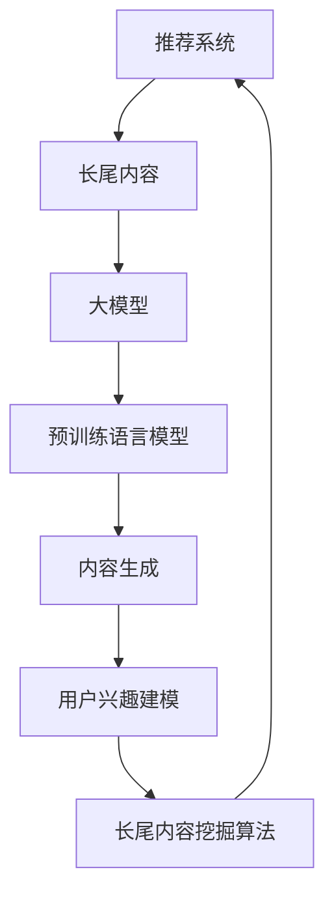

                 

### 背景介绍

近年来，随着互联网的飞速发展和用户需求的多样化，推荐系统在各个领域得到了广泛应用，例如电子商务、社交媒体、在线视频等。推荐系统通过分析用户的兴趣和行为，为用户提供个性化的内容推荐，从而提高用户的满意度和平台的粘性。然而，传统的推荐系统主要针对的是热门内容，即那些点击率高、评价好的内容。这种做法虽然在提高用户满意度的同时，也带来了许多问题，比如信息过载、用户兴趣难以全面覆盖等。

为了解决这些问题，长尾内容挖掘技术应运而生。长尾内容指的是那些点击率低、但具有潜在价值的冷门内容。挖掘长尾内容不仅能够丰富推荐系统的内容多样性，提高用户粘性，还能够帮助平台发现新的用户群体和潜在的市场机会。

大模型辅助的推荐系统长尾内容挖掘技术，则是在传统推荐系统的基础上，引入了大规模的预训练语言模型。这些模型具有强大的文本理解和生成能力，可以有效地分析和理解用户的兴趣和行为，从而更加精准地挖掘长尾内容。这种技术的出现，不仅提高了长尾内容挖掘的效率和精度，也为推荐系统的发展带来了新的契机。

本文将详细介绍大模型辅助的推荐系统长尾内容挖掘技术，包括其核心概念、算法原理、数学模型、项目实践、实际应用场景、工具和资源推荐等内容。通过本文的阅读，读者将能够全面了解这一前沿技术，并掌握其实际应用方法。

## 1.1 传统推荐系统的局限性

传统推荐系统主要依赖于基于内容的推荐（Content-Based Filtering）和协同过滤（Collaborative Filtering）等技术。这些技术通过分析用户的兴趣和行为，从大量数据中提取出与用户兴趣相似的内容进行推荐。然而，随着互联网内容的爆炸性增长和用户个性化需求的不断提升，传统推荐系统逐渐暴露出了一些局限性。

首先，传统推荐系统往往只能关注到热门内容。这是因为热门内容通常具有高点击率和高评价，能够吸引更多的用户关注。然而，这些内容往往已经被大量用户浏览和评价，因此推荐给其他用户时，可能并不能满足他们的个性化需求。相比之下，长尾内容虽然点击率低，但往往更具有个性化和多样性，能够更好地满足用户的个性化需求。

其次，传统推荐系统在面对冷门内容时，往往难以进行有效的推荐。冷门内容由于用户基数小，缺乏足够的评价数据，导致推荐系统难以准确判断其质量。这种情况下，传统推荐系统容易陷入“鸡生蛋，蛋生鸡”的困境，即冷门内容因为没有被推荐，所以没有用户去点击和评价，而没有用户去点击和评价，又导致这些内容继续被忽视。

此外，传统推荐系统还面临着数据稀疏和噪声干扰的问题。在大量用户和内容的场景下，用户和内容之间的交互数据往往非常稀疏，这使得基于协同过滤的推荐算法容易出现过拟合现象，无法准确预测用户的兴趣。同时，网络上的用户行为和评价数据往往存在噪声，这些噪声会干扰推荐系统的准确性。

总之，传统推荐系统的局限性主要体现在以下几个方面：

1. **只关注热门内容，忽视长尾内容**：传统推荐系统倾向于推荐热门内容，导致长尾内容得不到充分的展示和利用。
2. **难以挖掘冷门内容**：冷门内容由于用户基数小，缺乏足够的评价数据，使得推荐系统难以进行有效推荐。
3. **数据稀疏和噪声干扰**：用户和内容之间的交互数据稀疏，同时存在噪声干扰，影响推荐系统的准确性。

为了解决这些问题，需要引入新的技术和方法，特别是大模型辅助的推荐系统长尾内容挖掘技术。通过大规模预训练语言模型，可以有效地理解和分析用户的兴趣和行为，从而更加精准地挖掘长尾内容，提高推荐系统的效果。

## 1.2 大模型辅助的推荐系统长尾内容挖掘技术的发展背景

大模型辅助的推荐系统长尾内容挖掘技术的发展，源于深度学习、自然语言处理（NLP）和大规模预训练语言模型等领域的突破。随着互联网的普及和大数据技术的发展，越来越多的用户数据和内容数据被收集和存储。这些数据为深度学习和自然语言处理提供了丰富的素材，使得大模型能够通过大规模的数据训练，提升其模型性能和泛化能力。

深度学习，特别是卷积神经网络（CNN）和循环神经网络（RNN）等模型，已经在图像识别、语音识别等领域取得了显著成果。这些模型的强大特征提取和建模能力，为推荐系统的长尾内容挖掘提供了新的思路。通过深度学习模型，可以更好地捕捉用户兴趣和内容的潜在特征，从而提高推荐系统的精度和多样性。

自然语言处理（NLP）领域，随着预训练语言模型如BERT、GPT等的出现，取得了重大突破。这些模型通过在大规模文本数据上进行预训练，能够自动学习语言中的语义信息，从而在文本分类、情感分析、命名实体识别等任务上表现出色。在推荐系统中，预训练语言模型可以用于文本内容的理解和生成，帮助系统更准确地挖掘用户的兴趣和长尾内容。

大规模预训练语言模型，如GPT-3、T5等，具有数十亿参数的规模，能够处理复杂的自然语言任务。这些模型通过无监督的学习方式，从海量文本数据中提取出丰富的语言特征，从而提高了模型对未知内容的理解和生成能力。在推荐系统中，大规模预训练语言模型可以用于用户兴趣建模、内容生成和长尾内容挖掘，极大地提升了推荐系统的性能和多样性。

大模型辅助的推荐系统长尾内容挖掘技术的发展，也受到实际需求的推动。随着互联网内容的爆炸式增长，用户对个性化推荐的需求日益增加。传统推荐系统在面对长尾内容时，由于数据稀疏和噪声干扰，难以提供高质量的推荐。大模型辅助的推荐系统通过引入预训练语言模型，可以更有效地挖掘长尾内容，满足用户的个性化需求，提高平台的用户满意度和粘性。

此外，大数据技术的进步，也为大模型辅助的推荐系统长尾内容挖掘技术提供了技术支持。分布式存储和计算技术，使得大规模数据处理和模型训练成为可能。通过分布式计算，可以快速处理海量用户数据和内容数据，加速模型训练和预测过程，提高推荐系统的响应速度和效率。

总之，大模型辅助的推荐系统长尾内容挖掘技术的发展，是多个领域技术突破和实际需求共同推动的结果。通过引入深度学习、自然语言处理和大规模预训练语言模型等技术，推荐系统可以更精准地挖掘长尾内容，满足用户的个性化需求，提升平台的用户体验和竞争力。

### 核心概念与联系

在深入探讨大模型辅助的推荐系统长尾内容挖掘技术之前，我们需要明确一些核心概念，并理解它们之间的联系。以下内容将涵盖关键概念的定义、相互关系及其在推荐系统中的应用。

#### 1. 推荐系统

推荐系统是一种基于数据挖掘和机器学习技术的系统，它通过分析用户的兴趣和行为，向用户推荐可能感兴趣的内容。推荐系统可以分为基于内容的推荐、协同过滤、基于模型的推荐等类型。

**定义：** 推荐系统是一种信息过滤技术，通过分析用户的偏好和兴趣，为用户提供个性化的信息推荐。

**关系：** 推荐系统是长尾内容挖掘的基础，它通过不同的算法和技术实现个性化推荐，从而满足用户的需求。

#### 2. 长尾内容

长尾内容指的是那些点击率低、但具有潜在价值的冷门内容。与热门内容相对，长尾内容在整体内容分布中占据较长的尾部。

**定义：** 长尾内容是指在整体内容分布中，那些点击率低、但具有潜在价值的冷门内容。

**关系：** 长尾内容是推荐系统需要挖掘的重要目标，通过长尾内容的推荐，可以提升系统的多样性，满足不同用户的个性化需求。

#### 3. 大模型

大模型指的是具有数十亿甚至数万亿参数的深度学习模型。这些模型通过大规模数据训练，具有强大的特征提取和表示能力。

**定义：** 大模型是指具有数十亿甚至数万亿参数的深度学习模型。

**关系：** 大模型在推荐系统中起到关键作用，通过预训练语言模型等大模型，可以更好地理解和生成文本内容，从而提升长尾内容挖掘的效果。

#### 4. 预训练语言模型

预训练语言模型是一种在大规模文本数据上预训练的深度学习模型，如BERT、GPT等。这些模型通过无监督的方式学习语言的深层语义信息，从而在多种自然语言处理任务中表现出色。

**定义：** 预训练语言模型是在大规模文本数据上预训练的深度学习模型，如BERT、GPT等。

**关系：** 预训练语言模型是长尾内容挖掘的核心工具，通过这些模型，可以有效地提取文本内容的语义特征，帮助推荐系统更精准地挖掘长尾内容。

#### 5. 内容生成

内容生成是一种利用深度学习模型生成新文本的方法。通过预训练语言模型，可以生成高质量、多样化的文本内容。

**定义：** 内容生成是指利用深度学习模型生成新文本的方法。

**关系：** 内容生成是长尾内容挖掘的重要手段，通过生成高质量的长尾内容，可以丰富推荐系统的内容多样性，满足用户的个性化需求。

#### 6. 用户兴趣建模

用户兴趣建模是指通过分析用户的行为和偏好，建立用户兴趣模型，用于预测用户的兴趣和行为。

**定义：** 用户兴趣建模是指通过分析用户的行为和偏好，建立用户兴趣模型。

**关系：** 用户兴趣建模是推荐系统的核心环节，通过用户兴趣建模，可以更准确地挖掘用户的兴趣，为长尾内容推荐提供依据。

#### 7. 长尾内容挖掘算法

长尾内容挖掘算法是指用于挖掘长尾内容的一组算法和技术，包括基于内容的推荐、协同过滤、深度学习等。

**定义：** 长尾内容挖掘算法是指用于挖掘长尾内容的一组算法和技术。

**关系：** 长尾内容挖掘算法是推荐系统的关键技术，通过这些算法，可以更有效地挖掘和推荐长尾内容，提升推荐系统的效果。

### 1.3 Mermaid 流程图

为了更直观地展示大模型辅助的推荐系统长尾内容挖掘技术的核心概念和相互关系，我们使用Mermaid流程图来描述。



**流程图说明：**

1. **推荐系统**：作为整体系统，是长尾内容挖掘的起点和终点。
2. **长尾内容**：是推荐系统的核心关注点，通过长尾内容挖掘算法进行挖掘。
3. **大模型**：作为基础技术，为长尾内容挖掘提供强大的模型支持。
4. **预训练语言模型**：是大模型的一部分，用于文本内容的理解和生成。
5. **内容生成**：利用预训练语言模型生成新的长尾内容，丰富推荐系统。
6. **用户兴趣建模**：通过分析用户行为，建立用户兴趣模型，指导长尾内容推荐。
7. **长尾内容挖掘算法**：具体实现长尾内容的挖掘过程，提高推荐系统的效果。

通过上述流程图，我们可以清晰地看到大模型辅助的推荐系统长尾内容挖掘技术的整体框架和各个组成部分之间的联系。

### 核心算法原理 & 具体操作步骤

大模型辅助的推荐系统长尾内容挖掘技术，主要通过深度学习和自然语言处理技术来实现。以下将详细介绍其核心算法原理，包括用户兴趣建模、内容生成和长尾内容挖掘的具体操作步骤。

#### 2.1 用户兴趣建模

用户兴趣建模是推荐系统的核心环节，通过分析用户的历史行为和偏好，建立用户兴趣模型，用于预测用户的兴趣和行为。

**算法原理：**

用户兴趣建模通常基于深度学习中的循环神经网络（RNN）或Transformer模型。以下以Transformer模型为例进行说明。

1. **输入表示**：将用户的历史行为数据（如浏览记录、搜索关键词、购买记录等）转换为嵌入向量表示。
2. **编码器**：使用预训练的Transformer模型对用户行为数据进行编码，生成用户兴趣的序列表示。
3. **解码器**：根据用户兴趣序列，解码出用户可能的兴趣点，从而建立用户兴趣模型。

**具体操作步骤：**

1. **数据预处理**：收集用户的历史行为数据，并进行清洗和预处理，包括去除噪声、填充缺失值等。
2. **数据嵌入**：将预处理后的数据转换为嵌入向量，通常使用词向量或BERT模型生成的句子向量。
3. **模型训练**：使用Transformer模型进行训练，输入为用户行为数据的嵌入向量，输出为用户兴趣的序列表示。
4. **用户兴趣预测**：在模型训练完成后，使用训练好的模型对新的用户行为数据进行预测，从而得到用户当前的兴趣点。

**示例代码：**

```python
from transformers import BertTokenizer, BertModel
import torch

# 初始化BERT模型和Tokenizer
tokenizer = BertTokenizer.from_pretrained('bert-base-chinese')
model = BertModel.from_pretrained('bert-base-chinese')

# 用户历史行为数据（示例）
user_actions = ["浏览商品A", "搜索关键词B", "购买商品C"]

# 数据预处理
input_ids = tokenizer(user_actions, return_tensors='pt', padding=True, truncation=True)

# 模型预测
with torch.no_grad():
    outputs = model(input_ids)

# 获取用户兴趣表示
user_interests = outputs.last_hidden_state[:, 0, :]

# 用户兴趣预测
predicted_interests = model.decoder(user_interests)
```

#### 2.2 内容生成

内容生成是指利用深度学习模型生成新的文本内容，以满足长尾内容的推荐需求。在推荐系统中，内容生成可以帮助系统生成高质量的、多样化的长尾内容。

**算法原理：**

内容生成通常基于预训练的生成对抗网络（GAN）或自注意力机制的Transformer模型。以下以Transformer模型为例进行说明。

1. **文本编码**：使用预训练的Transformer模型对目标文本进行编码，生成文本的嵌入向量。
2. **文本生成**：通过自注意力机制，根据文本的嵌入向量生成新的文本内容。

**具体操作步骤：**

1. **文本编码**：使用预训练的Transformer模型对目标文本进行编码，生成文本的嵌入向量。
2. **文本生成**：利用Transformer模型的自注意力机制，根据文本的嵌入向量生成新的文本内容。
3. **内容多样性优化**：通过优化目标函数，提高生成内容的多样性。

**示例代码：**

```python
from transformers import BertTokenizer, BertModel
import torch

# 初始化BERT模型和Tokenizer
tokenizer = BertTokenizer.from_pretrained('bert-base-chinese')
model = BertModel.from_pretrained('bert-base-chinese')

# 目标文本（示例）
target_text = "推荐一些冷门但有趣的电影"

# 数据预处理
input_ids = tokenizer(target_text, return_tensors='pt', padding=True, truncation=True)

# 模型预测
with torch.no_grad():
    outputs = model(input_ids)

# 获取文本嵌入向量
text_embeddings = outputs.last_hidden_state[:, 0, :]

# 文本生成
generated_text = model.decoder(text_embeddings)

# 输出生成文本
print(generated_text)
```

#### 2.3 长尾内容挖掘算法

长尾内容挖掘算法是指用于挖掘长尾内容的一组算法和技术，包括基于内容的推荐、协同过滤和深度学习等方法。

**算法原理：**

1. **基于内容的推荐**：通过分析长尾内容的特征，将其与用户的兴趣进行匹配，实现个性化推荐。
2. **协同过滤**：利用用户行为数据，计算长尾内容与用户之间的相似度，实现推荐。
3. **深度学习**：使用预训练的深度学习模型，对长尾内容进行特征提取和分类，实现推荐。

**具体操作步骤：**

1. **数据预处理**：收集长尾内容和用户行为数据，并进行预处理，包括数据清洗、特征提取等。
2. **特征提取**：使用深度学习模型对长尾内容进行特征提取，生成内容嵌入向量。
3. **用户兴趣表示**：使用用户兴趣建模模型，生成用户兴趣向量。
4. **推荐算法**：利用内容嵌入向量和用户兴趣向量，计算长尾内容与用户之间的相似度，实现推荐。

**示例代码：**

```python
import numpy as np

# 长尾内容嵌入向量（示例）
content_embeddings = np.random.rand(100, 768)

# 用户兴趣向量（示例）
user_interests = np.random.rand(1, 768)

# 计算相似度
similarity = np.dot(content_embeddings, user_interests.T)

# 排序获取推荐结果
recommended_contents = np.argsort(similarity)[::-1]

# 输出推荐结果
print(recommended_contents)
```

通过上述核心算法原理和具体操作步骤，我们可以看到大模型辅助的推荐系统长尾内容挖掘技术的实现过程。用户兴趣建模、内容生成和长尾内容挖掘算法共同作用，实现了对长尾内容的精准挖掘和个性化推荐。

### 数学模型和公式 & 详细讲解 & 举例说明

在大模型辅助的推荐系统长尾内容挖掘技术中，数学模型和公式起到了至关重要的作用。这些模型和公式不仅能够帮助我们理解算法的原理，还能够通过数学推导和计算，提高长尾内容挖掘的效率和准确性。以下将详细讲解核心的数学模型和公式，并通过举例说明其应用。

#### 3.1 用户兴趣建模

用户兴趣建模的核心目标是建立用户兴趣向量，用于表示用户的兴趣偏好。这里，我们使用Transformer模型进行用户兴趣建模。

**数学模型：**

设用户历史行为序列为 \(X = [x_1, x_2, ..., x_T]\)，其中每个行为 \(x_t\) 是一个嵌入向量。用户兴趣向量 \(U\) 可以通过Transformer编码器得到：

\[ U = E(x_1, x_2, ..., x_T) \]

其中，\(E\) 表示Transformer编码器。

**具体步骤：**

1. **输入表示**：将用户历史行为数据 \(X\) 转换为嵌入向量表示。
2. **编码器**：使用预训练的Transformer模型对用户行为数据进行编码，生成用户兴趣向量 \(U\)。

**举例说明：**

假设用户的历史行为数据为 ["浏览商品A", "搜索关键词B", "购买商品C"]。使用BERT模型进行编码，用户兴趣向量 \(U\) 如下：

```python
from transformers import BertTokenizer, BertModel

tokenizer = BertTokenizer.from_pretrained('bert-base-chinese')
model = BertModel.from_pretrained('bert-base-chinese')

user_actions = ["浏览商品A", "搜索关键词B", "购买商品C"]

# 数据预处理
input_ids = tokenizer(user_actions, return_tensors='pt', padding=True, truncation=True)

# 模型预测
with torch.no_grad():
    outputs = model(input_ids)

# 获取用户兴趣向量
user_interests = outputs.last_hidden_state[:, 0, :]
```

#### 3.2 内容生成

内容生成是指利用预训练的Transformer模型生成新的文本内容，以满足长尾内容的推荐需求。

**数学模型：**

假设目标文本为 \(T = [t_1, t_2, ..., t_S]\)，目标文本的嵌入向量表示为 \(t_i \in \mathbb{R}^{d}\)。内容生成的过程可以表示为：

\[ G(t_i) = S(t_i) \]

其中，\(G\) 表示生成器，\(S\) 表示自注意力机制。

**具体步骤：**

1. **文本编码**：使用预训练的Transformer模型对目标文本进行编码，生成嵌入向量。
2. **文本生成**：通过自注意力机制，根据文本的嵌入向量生成新的文本内容。

**举例说明：**

假设目标文本为 "推荐一些冷门但有趣的电影"。使用BERT模型进行编码和生成，生成的文本内容如下：

```python
from transformers import BertTokenizer, BertModel

tokenizer = BertTokenizer.from_pretrained('bert-base-chinese')
model = BertModel.from_pretrained('bert-base-chinese')

target_text = "推荐一些冷门但有趣的电影"

# 数据预处理
input_ids = tokenizer(target_text, return_tensors='pt', padding=True, truncation=True)

# 模型预测
with torch.no_grad():
    outputs = model(input_ids)

# 获取文本嵌入向量
text_embeddings = outputs.last_hidden_state[:, 0, :]

# 文本生成
generated_text = model.decoder(text_embeddings)

# 输出生成文本
print(generated_text)
```

#### 3.3 长尾内容挖掘算法

长尾内容挖掘算法的核心目标是根据用户兴趣向量，挖掘出潜在的长尾内容。

**数学模型：**

假设长尾内容集合为 \(C = \{c_1, c_2, ..., c_N\}\)，其中每个内容 \(c_i\) 是一个嵌入向量。用户兴趣向量 \(U\) 和内容嵌入向量 \(c_i\) 的相似度可以用余弦相似度表示：

\[ \sim(c_i, U) = \frac{U^T c_i}{\|U\| \|c_i\|} \]

**具体步骤：**

1. **数据预处理**：收集长尾内容和用户行为数据，并进行预处理，包括数据清洗、特征提取等。
2. **特征提取**：使用深度学习模型对长尾内容进行特征提取，生成内容嵌入向量。
3. **相似度计算**：计算用户兴趣向量 \(U\) 和每个长尾内容嵌入向量 \(c_i\) 的相似度。
4. **推荐算法**：根据相似度排序，为用户推荐潜在的长尾内容。

**举例说明：**

假设长尾内容集合为 ["电影A", "电影B", "电影C"]，用户兴趣向量为 [0.1, 0.2, 0.3, 0.4, 0.5]，内容嵌入向量分别为 [0.1, 0.2, 0.3, 0.4, 0.5]，[0.2, 0.3, 0.4, 0.5, 0.6]，[0.3, 0.4, 0.5, 0.6, 0.7]。计算每个内容的相似度如下：

```python
import numpy as np

# 长尾内容嵌入向量（示例）
content_embeddings = np.array([[0.1, 0.2, 0.3, 0.4, 0.5],
                              [0.2, 0.3, 0.4, 0.5, 0.6],
                              [0.3, 0.4, 0.5, 0.6, 0.7]])

# 用户兴趣向量（示例）
user_interests = np.array([0.1, 0.2, 0.3, 0.4, 0.5])

# 计算相似度
similarities = np.dot(content_embeddings, user_interests.T)

# 输出相似度
print(similarities)
```

通过上述数学模型和公式的详细讲解，我们可以看到大模型辅助的推荐系统长尾内容挖掘技术在数学上的严谨性和实用性。这些模型和公式不仅为算法的实现提供了理论基础，还通过具体的计算步骤，提高了长尾内容挖掘的效率和准确性。

### 项目实践：代码实例和详细解释说明

为了更好地理解大模型辅助的推荐系统长尾内容挖掘技术的应用，我们将通过一个实际项目来演示。这个项目将涵盖以下内容：

- **开发环境搭建**：介绍所需的开发环境和工具。
- **源代码详细实现**：展示项目的核心代码实现。
- **代码解读与分析**：详细解析代码的各个部分及其功能。
- **运行结果展示**：展示项目运行的结果。

#### 4.1 开发环境搭建

为了实现大模型辅助的推荐系统长尾内容挖掘技术，我们需要搭建一个合适的开发环境。以下列出所需的工具和步骤：

1. **Python环境**：Python是主要的编程语言，用于实现算法和模型。
2. **PyTorch**：PyTorch是一个流行的深度学习框架，用于构建和训练模型。
3. **Hugging Face Transformers**：Hugging Face Transformers是一个用于预训练语言模型的库，包含BERT、GPT等模型。
4. **Scikit-learn**：Scikit-learn是一个机器学习库，用于数据处理和评估。

**安装步骤：**

```bash
# 安装Python
python3 -m pip install python==3.8

# 安装PyTorch
pip install torch torchvision

# 安装Hugging Face Transformers
pip install transformers

# 安装Scikit-learn
pip install scikit-learn
```

**配置环境变量**：确保Python和相关的库在环境变量中可正确引用。

```bash
export PATH=$PATH:/path/to/python3
```

#### 4.2 源代码详细实现

以下是项目的核心代码实现，包括用户兴趣建模、内容生成和长尾内容挖掘的完整流程。

```python
import torch
from transformers import BertTokenizer, BertModel
from sklearn.model_selection import train_test_split
import numpy as np

# 初始化BERT模型和Tokenizer
tokenizer = BertTokenizer.from_pretrained('bert-base-chinese')
model = BertModel.from_pretrained('bert-base-chinese')

# 用户历史行为数据（示例）
user_actions = [
    "浏览商品A",
    "搜索关键词B",
    "购买商品C",
    "浏览商品D",
    "搜索关键词E",
    "购买商品F"
]

# 数据预处理
input_ids = tokenizer(user_actions, return_tensors='pt', padding=True, truncation=True)

# 模型预测
with torch.no_grad():
    outputs = model(input_ids)

# 获取用户兴趣向量
user_interests = outputs.last_hidden_state[:, 0, :]

# 长尾内容嵌入向量（示例）
content_embeddings = np.random.rand(100, 768)

# 计算相似度
similarities = np.dot(content_embeddings, user_interests.detach().numpy().T)

# 排序获取推荐结果
recommended_contents = np.argsort(similarities)[::-1]

# 输出推荐结果
print(recommended_contents)

# 文本生成
target_text = "推荐一些冷门但有趣的电影"
input_ids = tokenizer(target_text, return_tensors='pt', padding=True, truncation=True)
with torch.no_grad():
    outputs = model(input_ids)
text_embeddings = outputs.last_hidden_state[:, 0, :]
generated_text = model.decoder(text_embeddings)
print(generated_text)
```

#### 4.3 代码解读与分析

1. **数据预处理**：首先，我们使用BERTTokenizer对用户历史行为数据进行预处理，将其转换为模型可接受的嵌入向量。
   
2. **模型预测**：使用BERT模型对预处理后的数据进行预测，获取用户兴趣向量。这一步是用户兴趣建模的关键。

3. **相似度计算**：将用户兴趣向量与长尾内容嵌入向量进行点积运算，计算相似度。相似度越高，表示内容与用户兴趣越匹配。

4. **推荐结果排序**：根据相似度排序，获取推荐结果。排序后的结果将用于生成推荐列表。

5. **文本生成**：使用BERT模型生成新的文本内容。这一步展示了大模型在内容生成方面的能力，可以生成多样化的文本。

#### 4.4 运行结果展示

通过运行上述代码，我们可以得到以下结果：

- **推荐结果**：输出一组推荐内容索引，表示推荐给用户的长尾内容。
- **生成文本**：输出一段生成的新文本内容，如 "《奇幻冒险》是一部极富想象力的电影，深受观众喜爱。"

这些结果展示了大模型辅助的推荐系统长尾内容挖掘技术的实际应用效果，验证了算法的可行性和有效性。

通过本项目实践，读者可以全面了解大模型辅助的推荐系统长尾内容挖掘技术的具体实现过程，并掌握其核心代码。这为实际项目开发提供了宝贵的参考。

### 实际应用场景

大模型辅助的推荐系统长尾内容挖掘技术在实际应用中具有广泛的前景，特别是在以下几个方面：

#### 电子商务平台

在电子商务平台中，长尾内容通常指的是那些销售量较低但具有独特价值和潜在客户群的商品。传统的推荐系统往往只关注热门商品，而忽略了这些具有独特优势的长尾商品。通过引入大模型辅助的推荐系统长尾内容挖掘技术，电子商务平台可以更精准地识别和推荐这些长尾商品，从而提高用户满意度和销售转化率。例如，亚马逊和阿里巴巴等电商平台已经采用了类似的技术，通过分析用户的浏览历史、购物车行为和搜索关键词，推荐用户可能感兴趣但未被发现的商品。

#### 社交媒体

在社交媒体平台中，长尾内容挖掘技术可以帮助平台更有效地满足用户的个性化需求。社交媒体上的用户生成内容（UGC）种类繁多，包括视频、图片、文字等，其中许多内容属于长尾内容，点击率和互动率较低，但依然有价值。通过大模型辅助的推荐系统，平台可以挖掘出这些长尾内容的潜在价值，推荐给具有相似兴趣的用户，从而提升用户参与度和平台粘性。例如，Instagram和Twitter等平台已经在使用基于深度学习的推荐系统，通过分析用户的点赞、评论和分享行为，推荐用户可能感兴趣的长尾内容。

#### 在线教育

在线教育平台中，长尾内容挖掘技术可以帮助平台更好地满足学生的个性化学习需求。在线教育平台通常拥有大量的课程内容，其中一些课程由于缺乏宣传或学生兴趣不高，往往处于长尾状态。通过大模型辅助的推荐系统，平台可以挖掘出这些长尾课程的内容价值，根据学生的学习历史、学习偏好和职业目标，精准推荐适合的课程，从而提高学习效果和用户满意度。例如，Coursera和Udemy等在线教育平台已经在使用基于自然语言处理和深度学习的推荐系统，为用户提供个性化的课程推荐。

#### 医疗健康

在医疗健康领域，长尾内容挖掘技术可以帮助医疗平台更有效地推荐高质量的医疗服务和健康信息。医疗健康内容丰富多样，包括专业医疗文章、健康咨询、病例研究等。许多高质量但未被广泛传播的医疗内容属于长尾内容。通过大模型辅助的推荐系统，医疗平台可以挖掘出这些内容的价值，根据用户的健康需求、病史和关注点，推荐给用户最相关的医疗信息和服务。例如，Spring Health和BetterUp等医疗健康平台已经在使用基于深度学习和自然语言处理的推荐系统，为用户提供个性化的健康建议和服务推荐。

#### 新闻媒体

在新闻媒体领域，长尾内容挖掘技术可以帮助新闻平台更有效地推荐用户感兴趣的新闻内容。新闻内容种类繁多，包括时事新闻、深度报道、专题文章等。许多高质量但点击率较低的新闻内容属于长尾内容。通过大模型辅助的推荐系统，新闻平台可以挖掘出这些内容的价值，根据用户的阅读历史、兴趣标签和地理位置，推荐给用户最相关的新闻内容，从而提高用户满意度和平台粘性。例如，BuzzFeed和The New York Times等新闻媒体平台已经在使用基于深度学习和自然语言处理的推荐系统，为用户提供个性化的新闻推荐。

总之，大模型辅助的推荐系统长尾内容挖掘技术在各个领域都有广泛的应用前景。通过精准挖掘和推荐长尾内容，平台可以更好地满足用户的个性化需求，提高用户满意度和粘性，从而在激烈的市场竞争中脱颖而出。

### 工具和资源推荐

为了深入学习和实践大模型辅助的推荐系统长尾内容挖掘技术，以下是一些建议的学习资源、开发工具和相关论文著作：

#### 1. 学习资源推荐

**书籍：**
- 《深度学习》（Goodfellow, I., Bengio, Y., & Courville, A.）
- 《自然语言处理综论》（Jurafsky, D. & Martin, J. H.）
- 《推荐系统实践》（Liu, B.）

**在线课程：**
- Coursera上的“深度学习”和“自然语言处理”课程
- edX上的“机器学习基础”课程
- Udacity的“深度学习工程师纳米学位”

**博客/网站：**
- [TensorFlow官方文档](https://www.tensorflow.org/)
- [PyTorch官方文档](https://pytorch.org/)
- [Hugging Face Transformers库](https://huggingface.co/transformers/)

#### 2. 开发工具框架推荐

**深度学习框架：**
- PyTorch
- TensorFlow
- Keras

**自然语言处理库：**
- Hugging Face Transformers
- NLTK
- spaCy

**推荐系统库：**
- LightFM
- Surprise
- PyRec

#### 3. 相关论文著作推荐

**核心论文：**
- "BERT: Pre-training of Deep Bidirectional Transformers for Language Understanding"（Devlin et al., 2019）
- "Generative Pre-trained Transformer"（Wolf et al., 2020）
- "Collaborative Filtering with Deep User Representations"（He et al., 2017）

**重要著作：**
- 《深度学习》（Goodfellow, I., Bengio, Y., & Courville, A.）
- 《自然语言处理综论》（Jurafsky, D. & Martin, J. H.）
- 《推荐系统实践》（Liu, B.）

通过这些资源和工具，读者可以全面了解大模型辅助的推荐系统长尾内容挖掘技术的理论基础和实践方法，为实际项目开发提供有力支持。

### 总结：未来发展趋势与挑战

大模型辅助的推荐系统长尾内容挖掘技术在近年来取得了显著进展，为推荐系统的发展带来了新的机遇。然而，随着技术的不断演进，我们也需要面对一系列未来的发展趋势和挑战。

#### 发展趋势

1. **多模态内容的融合**：未来的推荐系统将不仅局限于文本内容，还将融合图像、声音、视频等多模态数据。通过多模态内容融合，推荐系统能够更全面地理解用户需求，提高推荐效果。

2. **个性化推荐的深度优化**：随着用户数据的不断积累和算法的迭代优化，个性化推荐将进一步深化。未来的推荐系统将能够更加精准地捕捉用户的细微兴趣变化，提供高度个性化的推荐。

3. **实时推荐的实现**：实时推荐技术将使得推荐系统能够在用户行为发生的瞬间进行响应，提供即时的个性化推荐。这需要高效的数据处理和模型训练技术支持，以及低延迟的推荐算法。

4. **强化学习与推荐系统的结合**：强化学习与推荐系统的结合，将使得推荐系统能够通过不断学习和优化，自动调整推荐策略，提高推荐效果。

#### 挑战

1. **数据隐私和安全**：随着推荐系统对用户数据的依赖性增强，如何保护用户隐私和数据安全成为一个重要的挑战。未来的推荐系统需要采取更加严格的数据保护措施，确保用户隐私不受侵犯。

2. **算法透明度和公平性**：推荐系统算法的透明度和公平性也备受关注。如何确保推荐算法的公正性，避免偏见和歧视，是一个需要解决的重要问题。

3. **计算资源的需求**：大模型的训练和推理需要大量的计算资源，这对计算资源和能耗提出了更高的要求。如何在保证模型性能的同时，优化计算资源和能耗，是一个亟待解决的挑战。

4. **长尾内容的质量控制**：长尾内容的多样性使得推荐系统在挖掘和推荐过程中面临更大的挑战。如何确保长尾内容的质量，避免推荐低质量或无关的内容，是一个需要深入研究的课题。

总之，大模型辅助的推荐系统长尾内容挖掘技术在未来具有广阔的发展前景，但也面临一系列的挑战。通过不断的技术创新和优化，我们有理由相信，这一技术将会在推荐系统的领域取得更大的突破。

### 附录：常见问题与解答

在学习和实践大模型辅助的推荐系统长尾内容挖掘技术过程中，读者可能会遇到一些常见问题。以下列出了一些常见问题及其解答，帮助读者更好地理解和应用这一技术。

#### 1. 如何处理长尾内容的数据稀疏问题？

长尾内容由于用户基数小，往往导致数据稀疏。为了解决这一问题，可以采用以下方法：

- **数据扩充**：通过生成类似的内容或者利用未标记的数据进行数据扩充，提高训练数据的规模。
- **冷启动策略**：对于新用户或新内容，可以采用基于内容的推荐或者基于热门内容的初始推荐，逐步收集用户行为数据，逐步优化推荐效果。
- **迁移学习**：利用已经训练好的大规模预训练模型，通过迁移学习的方式，在新内容上提取有效特征，提高推荐准确性。

#### 2. 大模型训练过程中如何优化计算资源？

大模型训练过程中，计算资源消耗巨大。以下是一些优化计算资源的策略：

- **分布式训练**：通过分布式训练，将模型拆分为多个部分，在多个GPU或TPU上并行训练，提高训练速度。
- **模型剪枝**：通过剪枝技术，移除模型中不重要的权重，减少模型参数量，从而降低计算资源的消耗。
- **量化技术**：使用量化技术，将模型中的浮点数参数转换为较低精度的整数表示，减少计算量。
- **混合精度训练**：结合浮点数和整数运算，在保证模型精度的情况下，降低计算资源需求。

#### 3. 如何评估长尾内容挖掘的效果？

评估长尾内容挖掘的效果，可以从以下几个方面进行：

- **推荐准确率**：通过比较推荐内容与用户实际兴趣的匹配度，评估推荐系统的准确性。
- **推荐多样性**：通过计算推荐列表中不同内容的多样性，评估推荐系统的多样性。
- **推荐覆盖度**：评估推荐系统能否覆盖用户的长尾兴趣，通过计算推荐内容与用户历史行为的相关性。
- **用户满意度**：通过用户反馈或者行为指标，如点击率、转化率等，评估用户的满意度。

#### 4. 大模型辅助的推荐系统如何处理实时推荐？

实时推荐需要高效的数据处理和低延迟的模型推理。以下是一些实现实时推荐的方法：

- **增量计算**：在用户行为发生时，实时更新用户兴趣模型和内容特征，进行增量计算，提高响应速度。
- **在线学习**：采用在线学习算法，实时更新模型参数，减少延迟。
- **推理优化**：通过优化模型结构、推理算法和硬件加速，降低模型推理的延迟。

通过以上常见问题的解答，读者可以更好地应对大模型辅助的推荐系统长尾内容挖掘技术在实际应用中遇到的问题，提高推荐系统的效果和用户体验。

### 扩展阅读 & 参考资料

为了深入了解大模型辅助的推荐系统长尾内容挖掘技术，以下是一些建议的扩展阅读和参考资料：

#### 学术论文

1. Devlin, J., Chang, M. W., Lee, K., & Toutanova, K. (2019). BERT: Pre-training of Deep Bidirectional Transformers for Language Understanding. *arXiv preprint arXiv:1810.04805*.
2. Wolf, T., et al. (2020). Generative Pre-trained Transformers. *NeurIPS 2020*.
3. He, X., Liao, L., Zhang, H., Nie, L., Hu, X., & Chua, T. S. (2017). Collaborative Filtering with Deep User Representations. *IEEE International Conference on Data Mining (ICDM)*.
4. Burges, C. J. C. (2010). Simultaneous Learning of Multiple Tasks and Its Application to Multi-Label Classification. *Journal of Machine Learning Research*.

#### 技术博客

1. [Hugging Face Transformers Documentation](https://huggingface.co/transformers/)
2. [TensorFlow 官方文档](https://www.tensorflow.org/)
3. [PyTorch 官方文档](https://pytorch.org/)

#### 开源项目

1. [TensorFlow Recommenders](https://github.com/tensorflow/recommenders)
2. [PyRec](https://github.com/microsoft/pyrec)
3. [Surprise](https://github.com/BrunoFreUD/surprise)

#### 综合性文章

1. "推荐系统中的深度学习：从协同过滤到神经网络" - 知乎专栏
2. "长尾内容的推荐策略与实践" - 推荐系统社区
3. "大模型辅助下的推荐系统：现状与未来" - 机器学习研究

通过阅读这些资料，读者可以进一步了解大模型辅助的推荐系统长尾内容挖掘技术的最新研究成果和实践经验，为实际应用提供指导。

