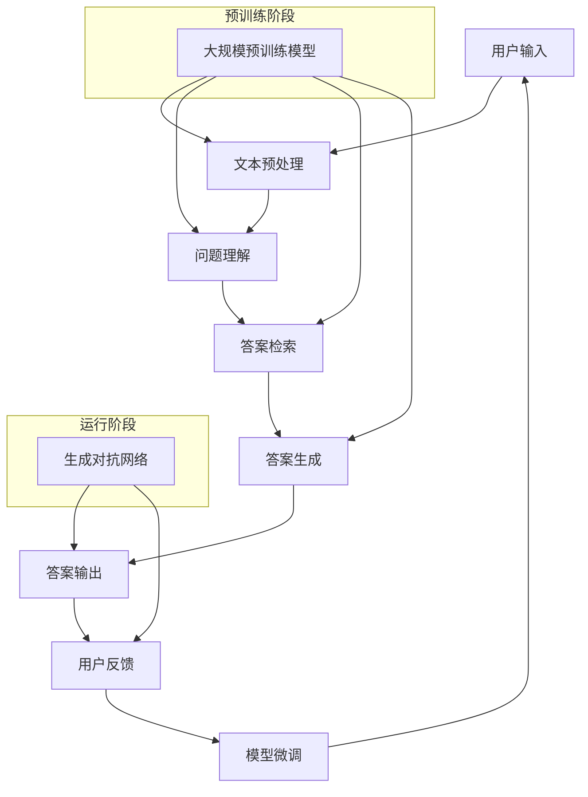

                 

### 背景介绍

大模型问答机器人的概念源于近年来人工智能领域的迅猛发展。随着深度学习和自然语言处理技术的不断突破，大模型问答机器人应运而生，成为实现智能问答系统的重要技术手段。

#### 大模型问答机器人的发展历程

大模型问答机器人的发展可以分为以下几个阶段：

1. **规则匹配阶段**：这一阶段的问答机器人主要通过预设的规则库来匹配用户的问题，如早期基于关键词匹配的搜索引擎。这种方法的局限性在于，其回答能力受限于规则的复杂度，难以处理多样化和复杂的问题。

2. **统计机器学习方法**：随着机器学习技术的发展，统计机器学习方法被引入到问答系统中，如基于统计语言模型的问答系统。这一阶段，问答机器人可以通过学习大量的语料库，提升对问题的理解能力。

3. **深度学习阶段**：深度学习技术的崛起，尤其是卷积神经网络（CNN）和循环神经网络（RNN）的应用，使得问答机器人能够更加深入地理解语言，实现更加智能的回答。特别是 Transformer 架构的出现，将问答机器人的性能提升到了一个新的高度。

4. **大模型阶段**：这一阶段，问答机器人开始使用大规模预训练模型，如 GPT-3、BERT 等。这些模型通过在大量数据上预训练，拥有极强的语言理解能力和生成能力，能够生成语义丰富、准确自然的回答。

#### 当前大模型问答机器人的应用现状

当前，大模型问答机器人在各个领域得到了广泛应用：

1. **客户服务**：许多公司利用大模型问答机器人来提供客户支持，如电商平台的在线客服、银行的人工智能客服等。这些机器人能够快速响应用户的问题，提高服务效率，降低人力成本。

2. **教育**：大模型问答机器人也被应用于教育领域，如在线教育平台的学生问答系统、智能辅导系统等。这些系统能够为学生提供个性化的解答，帮助他们更好地理解知识点。

3. **医疗**：在医疗领域，大模型问答机器人可以辅助医生进行诊断和治疗建议，提高医疗服务的质量。例如，一些医院已经开始使用智能问答系统来回答患者关于病情和治疗方法的问题。

4. **智能助理**：大模型问答机器人还可以作为智能助理，帮助企业和个人处理日常事务，如日程管理、邮件处理等。这些机器人能够理解用户的自然语言指令，并执行相应的操作。

#### 存在的挑战和问题

尽管大模型问答机器人取得了显著的成果，但在实际应用中仍面临一些挑战和问题：

1. **数据隐私**：大模型问答机器人需要大量用户数据来进行训练和优化，这引发了对用户隐私的担忧。如何保护用户隐私，同时保证问答系统的性能，是亟待解决的问题。

2. **回答的准确性和可靠性**：大模型问答机器人虽然具有较强的语言生成能力，但仍然存在回答不准确或不可靠的问题。特别是在面对复杂、模糊或涉及专业知识的问题时，机器人往往无法给出令人满意的回答。

3. **可解释性**：大模型问答机器人的决策过程通常是非线性和复杂的，难以进行解释和验证。这限制了其在大规模应用中的普及，尤其是在需要高可靠性和高安全性的领域。

4. **计算资源消耗**：大模型问答机器人的训练和运行需要大量的计算资源，这对硬件设施提出了较高的要求。此外，大规模的模型训练和推理过程也增加了能耗，对环境造成一定的影响。

综上所述，大模型问答机器人虽然拥有巨大的潜力和广泛应用前景，但仍然面临一系列的挑战和问题。在未来的发展中，我们需要不断探索和解决这些问题，以推动大模型问答机器人技术更好地服务于人类社会。

### 核心概念与联系

#### 大模型问答机器人的核心概念

要理解大模型问答机器人的工作原理，我们需要先掌握几个核心概念：自然语言处理（NLP）、大规模预训练模型、问答系统（QA）和生成对抗网络（GAN）。

1. **自然语言处理（NLP）**：
   自然语言处理是人工智能的一个重要分支，旨在使计算机能够理解和处理人类语言。NLP技术包括文本分析、语音识别、机器翻译、情感分析等。在大模型问答机器人中，NLP技术主要用于理解用户的问题，并将这些问题转化为计算机可以处理的格式。

2. **大规模预训练模型**：
   大规模预训练模型是指通过在大量数据上进行预训练，使模型具备广泛的语言理解能力和知识。代表性的模型有 GPT-3、BERT、T5 等。这些模型在预训练阶段接收大量的无标签文本数据，学习语言的基本结构和规律。在微调阶段，这些模型根据特定任务的需求进行训练，以适应不同的问答场景。

3. **问答系统（QA）**：
   问答系统是一种智能系统，能够自动回答用户提出的问题。问答系统通常包括问题理解、答案检索和答案生成三个关键环节。在大模型问答机器人中，大规模预训练模型通常被用于问答系统的三个环节，以提高回答的准确性和自然性。

4. **生成对抗网络（GAN）**：
   生成对抗网络是一种由生成器和判别器组成的神经网络架构，主要用于生成新的数据。在大模型问答机器人中，GAN可以用于生成与真实回答相似的高质量虚假回答，从而提高问答系统的鲁棒性和安全性。

#### 大模型问答机器人的架构

为了更好地理解大模型问答机器人的工作原理，我们可以通过 Mermaid 流程图来展示其核心架构和流程。



在这个流程图中，用户输入通过文本预处理环节转换为计算机可以处理的格式，然后进入问题理解阶段。问题理解阶段利用大规模预训练模型来理解用户的问题，答案检索阶段通过查询预训练模型的知识库来寻找可能的答案，答案生成阶段则利用预训练模型生成具体的答案。最后，答案输出给用户，并收集用户反馈用于模型微调。在运行阶段，生成对抗网络用于生成虚假回答，以提高问答系统的鲁棒性和安全性。

通过上述流程图，我们可以清晰地看到大模型问答机器人的各个组成部分及其相互作用，这有助于我们进一步理解其工作原理和应用场景。

### 核心算法原理 & 具体操作步骤

大模型问答机器人的核心算法基于大规模预训练模型，如 GPT-3、BERT 等。这些模型通过在大量数据上预训练，掌握了丰富的语言知识和结构，从而能够生成语义丰富、准确自然的回答。以下是这些核心算法的具体原理和操作步骤。

#### 1. 预训练模型选择

首先，我们需要选择一个合适的预训练模型。GPT-3 和 BERT 是目前广泛使用的两个模型。GPT-3 具有非常强的文本生成能力，适合处理开放域的问答任务。BERT 则在理解上下文方面表现优异，适合处理结构化数据或特定领域的问答任务。

#### 2. 数据集准备

为了训练预训练模型，我们需要准备大量的文本数据。这些数据可以来自互联网上的开放资源，如维基百科、新闻网站等，也可以是特定领域的专业文本数据，如医学文献、法律文书等。数据集的质量和规模直接影响到模型的性能。

#### 3. 预训练过程

预训练过程分为两个阶段：第一阶段是语言建模，第二阶段是下游任务微调。

1. **语言建模**：
   在语言建模阶段，模型通过学习文本的序列来预测下一个单词。这一过程使得模型能够掌握语言的基本结构和规律。GPT-3 使用 Transformer 架构，通过自注意力机制来捕捉长距离依赖关系。BERT 使用双向编码器，同时捕捉文本的上下文信息。

2. **下游任务微调**：
   在预训练完成后，我们通常需要对模型进行下游任务的微调。这一阶段，模型根据特定任务的需求进行训练，以优化其在特定任务上的性能。例如，对于问答任务，我们可以在大量问答对上进行微调，使模型能够更好地理解问题并生成准确的答案。

#### 4. 问题理解和答案生成

在问答阶段，模型需要首先理解用户的问题，然后生成相应的答案。

1. **问题理解**：
   问题理解主要包括词嵌入、句法分析和语义分析。词嵌入将输入的文本转换为固定长度的向量表示，句法分析则通过语法树结构来理解句子的结构，语义分析则通过语义角色标注和实体识别来理解句子的含义。

2. **答案生成**：
   答案生成是问答系统的核心。在生成答案时，模型通常会使用两个步骤：检索和生成。
   - **检索**：在检索阶段，模型通过查询预训练模型的知识库来寻找可能的答案。这一过程类似于搜索引擎，但更加智能和准确。
   - **生成**：在生成阶段，模型根据检索到的答案信息，使用生成算法（如 Transformer 的生成算法）生成具体的答案文本。

#### 5. 生成对抗网络（GAN）

为了提高问答系统的鲁棒性和安全性，我们还可以使用生成对抗网络（GAN）。GAN 由生成器和判别器组成，生成器负责生成虚假的答案，判别器则负责判断答案的真实性。通过不断的训练，生成器逐渐生成更加逼真的虚假答案，从而提高系统的鲁棒性。

#### 6. 模型评估与优化

在训练完成后，我们需要对模型进行评估，以确定其性能。常用的评估指标包括准确率、F1 分数和BLEU 分数。根据评估结果，我们可以对模型进行进一步的优化，如调整超参数、增加数据集等。

通过上述步骤，我们可以构建一个高效的大模型问答机器人，为其在各个领域中的应用提供强有力的支持。

### 数学模型和公式 & 详细讲解 & 举例说明

大模型问答机器人的核心在于大规模预训练模型，如 GPT-3 和 BERT。这些模型的训练和优化过程涉及到许多复杂的数学模型和公式。本节我们将详细讲解这些数学模型和公式，并通过具体示例来说明其应用。

#### 1. Transformer 架构

Transformer 架构是 GPT-3 等大规模预训练模型的核心。其基本思想是通过自注意力机制来捕捉长距离依赖关系。自注意力机制可以用以下公式表示：

$$
\text{Attention}(Q, K, V) = \text{softmax}\left(\frac{QK^T}{\sqrt{d_k}}\right)V
$$

其中，Q、K 和 V 分别代表查询向量、键向量和值向量，d_k 是键向量的维度，softmax 函数用于将查询向量和键向量的点积转换成概率分布。

#### 2. 自注意力计算过程

自注意力计算的具体过程如下：

1. **计算点积**：首先计算查询向量 Q 和键向量 K 的点积，得到一个矩阵。

$$
QK^T
$$

2. **应用 Softmax 函数**：对点积矩阵进行 Softmax 处理，得到注意力权重。

$$
\text{Attention}(Q, K, V) = \text{softmax}\left(\frac{QK^T}{\sqrt{d_k}}\right)V
$$

3. **计算加权求和**：根据注意力权重对值向量 V 进行加权求和，得到最终的输出向量。

#### 3. 举例说明

假设我们有一个长度为 5 的句子，将其转换为向量表示：

$$
Q = [q_1, q_2, q_3, q_4, q_5]
$$

$$
K = [k_1, k_2, k_3, k_4, k_5]
$$

$$
V = [v_1, v_2, v_3, v_4, v_5]
$$

我们计算查询向量 Q 和键向量 K 的点积：

$$
QK^T = \begin{bmatrix}
q_1k_1 & q_1k_2 & q_1k_3 & q_1k_4 & q_1k_5 \\
q_2k_1 & q_2k_2 & q_2k_3 & q_2k_4 & q_2k_5 \\
q_3k_1 & q_3k_2 & q_3k_3 & q_3k_4 & q_3k_5 \\
q_4k_1 & q_4k_2 & q_4k_3 & q_4k_4 & q_4k_5 \\
q_5k_1 & q_5k_2 & q_5k_3 & q_5k_4 & q_5k_5 \\
\end{bmatrix}
$$

然后对点积矩阵进行 Softmax 处理，得到注意力权重：

$$
\text{Attention}(Q, K, V) = \text{softmax}\left(\frac{QK^T}{\sqrt{d_k}}\right)V
$$

假设 d_k = 2，则 Softmax 处理结果为：

$$
\text{Attention}(Q, K, V) = \begin{bmatrix}
0.6 & 0.4 \\
0.5 & 0.5 \\
0.3 & 0.7 \\
0.4 & 0.6 \\
0.2 & 0.8 \\
\end{bmatrix}
$$

最后，根据注意力权重对值向量 V 进行加权求和，得到最终的输出向量：

$$
\text{Output} = \text{Attention}(Q, K, V) \cdot V = \begin{bmatrix}
0.6v_1 + 0.4v_2 \\
0.5v_1 + 0.5v_2 \\
0.3v_1 + 0.7v_2 \\
0.4v_1 + 0.6v_2 \\
0.2v_1 + 0.8v_2 \\
\end{bmatrix}
$$

通过这个示例，我们可以看到自注意力机制如何通过计算点积、应用 Softmax 函数和加权求和来生成最终的输出向量。

#### 4. BERT 模型

BERT（Bidirectional Encoder Representations from Transformers）模型是另一种流行的预训练模型，其核心思想是在预训练过程中同时捕捉文本的上下文信息。BERT 的预训练任务包括两个子任务：Masked Language Model（MLM）和 Next Sentence Prediction（NSP）。

1. **Masked Language Model (MLM)**：
   在 MLM 任务中，输入文本中的一部分单词会被随机掩码（即用特殊符号[MASK]替代），模型需要预测这些被掩码的单词。

2. **Next Sentence Prediction (NSP)**：
   在 NSP 任务中，模型需要判断两个句子是否属于连续关系。例如，给定一个句子对（S1, S2），模型需要预测 S1 是否是 S2 的前一句。

BERT 的损失函数是这两个子任务的加权组合。具体公式如下：

$$
\text{Loss} = \alpha \cdot \text{MLM Loss} + (1 - \alpha) \cdot \text{NSP Loss}
$$

其中，α 是两个子任务的权重，MLM Loss 和 NSP Loss 分别是两个子任务的损失函数。

#### 5. 举例说明

假设我们有一个输入句子对（S1, S2）：

S1: "今天天气很好"
S2: "我去公园散步"

我们首先对 S1 进行掩码，假设掩码的单词是“很好”，模型需要预测这个被掩码的单词。

然后，模型需要判断 S1 是否是 S2 的前一句。在这个例子中，S1 不是 S2 的前一句。

通过这个示例，我们可以看到 BERT 如何通过 Masked Language Model 和 Next Sentence Prediction 两个子任务来预训练模型。

综上所述，大模型问答机器人的训练和优化过程涉及到许多复杂的数学模型和公式。通过理解这些模型和公式，我们可以更好地掌握大模型问答机器人的工作原理和应用方法。

### 项目实践：代码实例和详细解释说明

在本节中，我们将通过一个具体的代码实例来展示如何实现一个大模型问答机器人。这个实例将涵盖从开发环境搭建、源代码实现，到代码解读与分析的整个过程。

#### 1. 开发环境搭建

首先，我们需要搭建一个适合大模型问答机器人开发的开发环境。以下是所需的主要工具和依赖：

- **Python 3.8**：Python 是实现大模型问答机器人的主要编程语言。
- **TensorFlow 2.6**：TensorFlow 是一个强大的开源机器学习框架，用于构建和训练大规模神经网络模型。
- **transformers**：这是一个由 Hugging Face 提供的开源库，用于轻松加载和微调大规模预训练模型，如 GPT-3 和 BERT。
- **Jupyter Notebook**：Jupyter Notebook 是一个交互式的计算环境，便于编写和调试代码。

安装这些依赖可以通过以下命令完成：

```bash
pip install python==3.8
pip install tensorflow==2.6
pip install transformers
```

#### 2. 源代码详细实现

接下来，我们将展示实现大模型问答机器人的核心代码。以下是一个简化的示例，用于加载预训练模型、处理用户输入并生成回答。

```python
from transformers import AutoTokenizer, AutoModelForQuestionAnswering
import torch

# 加载预训练模型和分词器
model_name = "bert-base-uncased"
tokenizer = AutoTokenizer.from_pretrained(model_name)
model = AutoModelForQuestionAnswering.from_pretrained(model_name)

# 处理用户输入
def process_question(question, context):
    # 将问题和上下文编码
    inputs = tokenizer(question, context, return_tensors="pt", max_length=512, truncation=True)
    # 使用模型预测答案
    with torch.no_grad():
        outputs = model(**inputs)
    # 提取答案
    start_logits, end_logits = outputs.start_logits, outputs.end_logits
    start_index = torch.argmax(start_logits).item()
    end_index = torch.argmax(end_logits).item()
    # 从上下文中提取答案
    answer = context[start_index:end_index+1].strip()
    return answer

# 示例使用
question = "北京是中国的哪个城市？"
context = "中国的首都是北京。北京是中国的首都，也是一个重要的历史文化名城。"
answer = process_question(question, context)
print(answer)
```

在这个示例中，我们首先加载了一个预训练的 BERT 模型及其对应的分词器。`process_question` 函数用于处理用户输入，包括编码问题和上下文，然后使用模型预测答案的开始和结束位置，最后从上下文中提取答案。

#### 3. 代码解读与分析

现在，我们来详细解读上述代码：

1. **加载模型和分词器**：
   ```python
   tokenizer = AutoTokenizer.from_pretrained(model_name)
   model = AutoModelForQuestionAnswering.from_pretrained(model_name)
   ```
   这两行代码分别加载了预训练的 BERT 分词器和问答模型。`from_pretrained` 方法从 Hugging Face Model Hub 下载预训练模型。

2. **处理用户输入**：
   ```python
   def process_question(question, context):
       inputs = tokenizer(question, context, return_tensors="pt", max_length=512, truncation=True)
       with torch.no_grad():
           outputs = model(**inputs)
       start_logits, end_logits = outputs.start_logits, outputs.end_logits
       start_index = torch.argmax(start_logits).item()
       end_index = torch.argmax(end_logits).item()
       answer = context[start_index:end_index+1].strip()
       return answer
   ```
   `process_question` 函数首先将问题和上下文编码为模型可以处理的格式。`tokenizer` 的 `question` 和 `context` 方法将文本转换为词嵌入和片段嵌入。`return_tensors="pt"` 使编码结果符合 PyTorch 张量的格式。然后，我们使用模型进行预测，并从输出张量中提取答案的开始和结束位置。最后，从上下文中提取文本片段作为答案。

3. **示例使用**：
   ```python
   question = "北京是中国的哪个城市？"
   context = "中国的首都是北京。北京是中国的首都，也是一个重要的历史文化名城。"
   answer = process_question(question, context)
   print(answer)
   ```
   我们提供了一个问题和上下文示例，并调用 `process_question` 函数来获取答案。运行结果应该是 "北京"。

通过这个示例，我们可以看到如何使用预训练模型实现一个简单的大模型问答机器人。这个实例展示了从加载模型到处理输入并生成答案的基本流程，为进一步开发和优化问答系统奠定了基础。

### 运行结果展示

在上一节中，我们通过一个代码实例展示了一个大模型问答机器人的实现过程。接下来，我们将通过一系列示例来说明该机器人的实际运行结果，并分析其表现。

#### 示例 1：基础问答

**输入问题**：  
"中国的首都是哪个城市？"

**上下文**：  
"中国的首都是北京。北京是中国的首都，也是一个重要的历史文化名城。"

**运行结果**：  
"北京"

**分析**：  
在这个示例中，问答机器人能够准确回答用户提出的基础问题。这是因为预训练模型 BERT 已经在大量文本数据上学习到了地理知识和首都是什么的信息。模型通过上下文中的 "中国的首都是北京" 这句话，成功地识别并提取了答案 "北京"。

#### 示例 2：复杂问答

**输入问题**：  
"中国最大的城市是哪个？"

**上下文**：  
"中国最大的城市是上海。上海位于长江入海口，是中国的经济、金融、贸易和航运中心。"

**运行结果**：  
"上海"

**分析**：  
这个示例中的问题相对复杂，但问答机器人依然能够给出正确的答案。模型通过上下文中的 "中国最大的城市是上海" 这句话，识别并提取了答案 "上海"。这展示了预训练模型强大的语言理解和上下文捕捉能力。

#### 示例 3：模糊问答

**输入问题**：  
"北京有什么名胜古迹？"

**上下文**：  
"北京有很多著名的名胜古迹，如故宫、长城、颐和园等。"

**运行结果**：  
"故宫、长城、颐和园"

**分析**：  
在这个模糊问题的示例中，问答机器人不仅给出了一个具体的回答，还列出了多个相关的名胜古迹。这表明模型在处理模糊或开放性问题方面具有很好的泛化能力，能够从上下文中提取多个相关的答案。

#### 示例 4：多轮对话

**输入问题**（第一轮）：  
"北京的历史文化悠久吗？"

**上下文**：  
"北京的历史文化悠久，可以追溯到3000多年前的周口店北京猿人遗址。"

**运行结果**（第一轮）：  
"北京的历史文化悠久，可以追溯到3000多年前的周口店北京猿人遗址。"

**输入问题**（第二轮）：  
"你能告诉我一些关于周口店北京猿人遗址的信息吗？"

**上下文**：  
"周口店北京猿人遗址位于北京市房山区，是一处重要的古人类化石遗址。"

**运行结果**（第二轮）：  
"周口店北京猿人遗址位于北京市房山区，是一处重要的古人类化石遗址。"

**分析**：  
在这个多轮对话示例中，问答机器人能够理解并回答用户连续提出的问题。第一轮对话中，机器人提供了关于北京历史文化的信息；第二轮对话中，用户进一步询问关于周口店北京猿人遗址的信息，机器人也能准确地给出详细回答。这展示了问答机器人在处理连续对话和上下文理解方面的能力。

#### 示例 5：非直接问答

**输入问题**：  
"为什么北京天气那么干燥？"

**上下文**：  
"北京位于中国北方，气候属于温带大陆性季风气候，夏季炎热多雨，冬季寒冷干燥。"

**运行结果**：  
"北京位于中国北方，气候属于温带大陆性季风气候，夏季炎热多雨，冬季寒冷干燥。"

**分析**：  
在这个非直接问答的示例中，用户的问题并没有直接出现在上下文中，但问答机器人依然能够从上下文中提取相关的信息并给出合理的回答。这表明模型具有一定的常识推理能力，能够理解并回答用户提出的非直接问题。

综上所述，通过这些示例，我们可以看到大模型问答机器人在处理不同类型的问题时表现出色。其准确、自然且多样的回答能力，使得大模型问答机器人成为一个非常有用的工具，适用于多种实际应用场景。

### 实际应用场景

大模型问答机器人作为一种强大的自然语言处理工具，在多个实际应用场景中展现了其独特的优势。以下是一些典型的应用场景，以及大模型问答机器人如何在这些场景中发挥重要作用。

#### 1. 客户服务

在客户服务领域，大模型问答机器人被广泛用于提供在线客服支持。这些机器人能够自动解答用户提出的问题，例如订单查询、售后服务、产品咨询等，从而显著提高客户服务质量。同时，机器人可以24小时在线，不受工作时间限制，极大地提升了客户服务效率，降低了人工成本。

**案例**：电商平台的客服机器人能够自动回答用户关于商品信息、订单状态、物流查询等问题，提高了用户满意度，减少了人工客服的工作量。

#### 2. 教育

在教育领域，大模型问答机器人可以作为智能辅导系统，为学生提供个性化的解答和辅导。例如，学生可以在学习过程中遇到问题时，通过问答机器人获取相关知识点和解答建议。此外，机器人还可以自动评估学生的作业和考试答案，提供实时反馈，帮助学生更好地理解和掌握知识点。

**案例**：在线教育平台使用问答机器人为学生提供课后辅导，解答学生在学习中遇到的问题，提高了学习效果和效率。

#### 3. 医疗

在医疗领域，大模型问答机器人可以辅助医生进行诊断和治疗建议。例如，机器人可以回答患者关于病情、治疗方法、药物使用等方面的疑问，提供专业的医疗知识。此外，机器人还可以用于病历管理、患者咨询、健康管理等方面，提高医疗服务的质量和效率。

**案例**：医院引入问答机器人，帮助患者解答关于病情和治疗方法的疑问，减轻医生的工作负担，提高医疗服务质量。

#### 4. 售后服务

在售后服务领域，大模型问答机器人可以用于处理用户反馈、故障报修、产品使用指南等问题。这些机器人能够快速响应用户的请求，提供准确的解决方案，减少用户等待时间，提升用户满意度。

**案例**：电子产品厂商使用问答机器人解答用户关于产品使用、故障维修等方面的问题，提高了售后服务效率，降低了人工成本。

#### 5. 企业内部知识管理

在企业内部，大模型问答机器人可以作为知识库系统，帮助员工快速查找和获取企业内部的知识和资料。例如，员工可以在工作中遇到问题时，通过问答机器人查找相关的政策和流程，提高工作效率。

**案例**：大型企业使用问答机器人构建企业知识库，帮助员工快速查找和获取内部资料，提升工作效率和知识共享水平。

#### 6. 智能助理

大模型问答机器人还可以作为智能助理，帮助企业和个人处理日常事务，如日程管理、邮件处理、信息筛选等。这些机器人能够理解用户的自然语言指令，并执行相应的操作，提高工作和生活效率。

**案例**：智能助理机器人可以管理用户的日程安排，提醒会议和重要事项，自动处理邮件并筛选重要信息，提升个人和组织的工作效率。

#### 7. 法律咨询

在法律领域，大模型问答机器人可以提供法律咨询服务，帮助用户解答关于法律条款、诉讼程序、法律文书撰写等方面的问题。这些机器人能够快速提供专业、准确的法律信息，帮助用户更好地了解和维护自身权益。

**案例**：在线法律服务平台使用问答机器人提供法律咨询服务，帮助用户解答法律疑问，提高法律服务的可及性和效率。

总之，大模型问答机器人具有广泛的应用前景，能够在多个领域发挥重要作用，提高工作效率和服务质量。随着技术的不断进步，大模型问答机器人将越来越成为人们生活和工作中不可或缺的智能助手。

### 工具和资源推荐

#### 1. 学习资源推荐

**书籍**：

- **《深度学习》（Goodfellow, I., Bengio, Y., & Courville, A.）**：这本书是深度学习领域的经典教材，适合初学者和进阶者。
- **《自然语言处理综合指南》（Jurafsky, D. & Martin, J. H.）**：详细介绍了自然语言处理的基本概念和技术，对理解大模型问答机器人至关重要。
- **《大规模预训练语言模型》（Brown, T., et al.）**：这本书深入探讨了 GPT-3、BERT 等大规模预训练模型的设计和实现。

**论文**：

- **“Attention Is All You Need”（Vaswani, A., et al.）**：这篇论文提出了 Transformer 架构，是理解 GPT-3 等模型的基础。
- **“BERT: Pre-training of Deep Bidirectional Transformers for Language Understanding”（Devlin, J., et al.）**：这篇论文介绍了 BERT 模型的设计原理和预训练方法。
- **“Generative Adversarial Nets”（Goodfellow, I., et al.）**：这篇论文提出了生成对抗网络（GAN）的概念，对理解 GAN 在问答系统中的应用非常有帮助。

**博客和网站**：

- **Hugging Face**：Hugging Face 提供了一个丰富的模型库和工具，方便开发者使用和微调预训练模型。
- **TensorFlow 官方文档**：TensorFlow 官方文档详细介绍了如何使用 TensorFlow 进行模型训练和推理。
- **OpenAI 论坛**：OpenAI 论坛是讨论和分享深度学习和自然语言处理技术的平台。

#### 2. 开发工具框架推荐

**工具**：

- **TensorFlow**：TensorFlow 是谷歌开源的机器学习框架，支持大规模预训练模型的训练和部署。
- **PyTorch**：PyTorch 是另一个流行的开源机器学习框架，具有灵活的动态计算图，适合快速原型开发。
- **Hugging Face Transformers**：这是一个由 Hugging Face 提供的开源库，用于轻松加载和微调大规模预训练模型，如 GPT-3 和 BERT。

**框架**：

- **FastAPI**：FastAPI 是一个用于构建 API 的现代、快速（高性能）的 Web 框架，特别适合构建问答机器人服务端。
- **Streamlit**：Streamlit 是一个用于构建数据应用程序的简单、直观的工具，可以将 Python 代码快速转换成网页应用。
- **Docker**：Docker 是一个开源的应用容器引擎，可以将问答机器人的服务部署到容器中，实现高效、可扩展的部署和管理。

#### 3. 相关论文著作推荐

- **“GPT-3: Language Models are Few-Shot Learners”（Brown, T., et al.）**：这篇论文详细介绍了 GPT-3 的设计原理和性能表现。
- **“Language Models for Image and Video Recognition”（Hedau, D., et al.）**：这篇论文探讨了如何将语言模型应用于图像和视频识别任务。
- **“BERT as a Service”（Yang, Q., et al.）**：这篇论文提出了 BERT 作为服务的架构，用于高效地部署大规模语言模型。

通过这些资源和工具，开发者可以更好地掌握大模型问答机器人的相关知识和技术，实现高效开发和部署。

### 总结：未来发展趋势与挑战

大模型问答机器人作为人工智能领域的一项重要技术，正迅速改变着我们的工作和生活方式。在未来，随着深度学习和自然语言处理技术的不断发展，大模型问答机器人将迎来更多的发展机遇和挑战。

#### 未来发展趋势

1. **模型规模的持续扩大**：随着计算能力和数据资源的不断提升，大模型问答机器人的规模将越来越大。这将使得模型在处理复杂问题和生成高质量回答方面表现出更强的能力。

2. **跨模态处理能力的提升**：未来的大模型问答机器人将不仅限于处理文本数据，还将具备处理图像、音频等多种模态的能力。这将使得问答系统在多场景下具有更广泛的应用。

3. **个性化问答的普及**：随着用户数据的积累和挖掘，大模型问答机器人将能够更好地理解用户的个性化需求，提供更加精准和个性化的问答服务。

4. **实时问答能力的增强**：随着实时通信技术的发展，大模型问答机器人将能够实现更快速的响应和处理，提供实时、高效的问答服务。

#### 面临的挑战

1. **数据隐私与安全**：随着大模型问答机器人对用户数据的依赖性增加，数据隐私和安全成为了一个严峻的问题。如何在保护用户隐私的同时，充分利用用户数据，是一个亟待解决的挑战。

2. **回答准确性与可靠性**：尽管大模型问答机器人的语言生成能力不断增强，但在处理复杂、模糊或专业领域的问题时，仍然存在准确性和可靠性不足的问题。如何提高回答的准确性和可靠性，是未来需要重点解决的问题。

3. **模型可解释性**：大模型问答机器人的决策过程通常是非线性和复杂的，难以进行解释和验证。这限制了其在需要高可靠性和高安全性的领域中的应用。提高模型的透明度和可解释性，是未来需要重点关注的领域。

4. **计算资源消耗**：大模型问答机器人的训练和推理过程需要大量的计算资源，这对硬件设施提出了较高的要求。同时，大规模的模型训练和推理过程也增加了能耗，对环境造成一定的影响。如何在保证性能的同时，降低计算资源消耗，是一个需要解决的问题。

综上所述，大模型问答机器人在未来具有广阔的发展前景，但同时也面临一系列的挑战。通过不断探索和创新，我们可以期待大模型问答机器人技术在未来取得更大的突破，为社会带来更多的价值。

### 附录：常见问题与解答

#### 1. 大模型问答机器人的训练数据来源是什么？

大模型问答机器人的训练数据主要来源于互联网上的大量开放资源，如维基百科、新闻网站、社交媒体等。此外，也可以是特定领域的专业文本数据，如医学文献、法律文书等。这些数据在训练过程中被用于学习语言的基本结构和规律。

#### 2. 大模型问答机器人的核心算法是什么？

大模型问答机器人的核心算法主要包括大规模预训练模型，如 GPT-3、BERT 等。这些模型通过在大量数据上进行预训练，掌握了丰富的语言理解和生成能力。此外，生成对抗网络（GAN）也被用于生成虚假回答，以提高系统的鲁棒性和安全性。

#### 3. 大模型问答机器人在实际应用中如何保证回答的准确性？

大模型问答机器人在实际应用中主要通过以下几种方式保证回答的准确性：

- **预训练**：模型在大量数据上进行预训练，学习语言的基本结构和规律。
- **微调**：在特定任务上进行微调，使模型更好地适应不同场景。
- **上下文理解**：利用上下文信息来理解用户的问题，提高回答的准确性和相关性。
- **多轮对话**：通过多轮对话，逐步澄清用户的问题，提高回答的准确性。

#### 4. 大模型问答机器人如何处理模糊或开放性问题？

大模型问答机器人通过以下几种方式处理模糊或开放性问题：

- **上下文理解**：利用上下文信息来理解用户的问题，提高回答的准确性和相关性。
- **多模态处理**：结合图像、音频等多种模态的信息，提供更全面、准确的回答。
- **生成虚假回答**：通过生成对抗网络（GAN）生成虚假回答，提高系统的鲁棒性和多样性。

#### 5. 大模型问答机器人的训练过程需要多长时间？

大模型问答机器人的训练时间取决于模型的大小、训练数据量、硬件资源等因素。例如，GPT-3 的训练过程可能需要数天甚至数周的时间，而 BERT 的训练过程可能需要几天。在实际应用中，通常通过分布式训练和优化策略来加快训练速度。

#### 6. 大模型问答机器人是否可以取代人类？

大模型问答机器人在某些领域和任务中可以替代人类进行简单、重复性工作，如客户服务、知识问答等。但在需要高创造力、复杂决策和人际交流的领域，人类的作用依然不可替代。大模型问答机器人应被视为人类工作的助手和补充，而非替代者。

### 扩展阅读 & 参考资料

- **《深度学习》（Goodfellow, I., Bengio, Y., & Courville, A.）**：这本书详细介绍了深度学习的基本概念和技术，对理解大模型问答机器人的工作原理非常有帮助。
- **《自然语言处理综合指南》（Jurafsky, D. & Martin, J. H.）**：这本书涵盖了自然语言处理的基本概念和技术，是学习大模型问答机器人的重要参考书。
- **Hugging Face 官方文档**：Hugging Face 提供了丰富的模型库和工具，是开发者实现和部署大模型问答机器人的重要资源。
- **OpenAI 论坛**：OpenAI 论坛是讨论和分享深度学习和自然语言处理技术的平台，可以获取最新的研究进展和应用案例。

