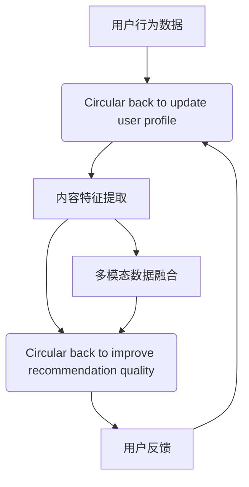

                 

### 背景介绍

#### 推荐系统的重要性

推荐系统作为一种高度智能化的信息过滤工具，其目的是根据用户的历史行为和偏好，向用户推荐符合其兴趣的内容、产品或服务。在当今互联网时代，推荐系统已经成为了电商平台、视频平台、社交媒体等众多场景的核心组成部分。它的广泛应用不仅极大地提升了用户体验，还为企业和平台带来了巨大的商业价值。

随着大数据和人工智能技术的快速发展，推荐系统的性能和准确性不断提高。传统的推荐系统主要依赖于基于内容的过滤和协同过滤方法，这些方法虽然在一定程度上满足了用户的个性化需求，但仍然存在一些局限性，如数据稀疏性、冷启动问题等。

#### 大模型在推荐系统中的应用

近年来，随着深度学习和自然语言处理技术的发展，大模型（如Transformer、BERT等）在推荐系统领域取得了显著的成果。大模型能够通过学习大量用户行为数据和内容特征，挖掘出用户隐藏的兴趣点，从而实现更精确的推荐。此外，大模型在处理复杂数据和模式识别方面具有强大的能力，使得推荐系统可以更好地应对不断变化的市场环境和用户需求。

大模型的应用不仅提高了推荐系统的性能，还带来了以下几个方面的变革：

1. **用户兴趣图谱的动态更新**：大模型可以根据用户的行为和反馈，实时更新用户兴趣图谱，使其更贴近用户的真实兴趣。
2. **多模态数据的融合**：大模型能够处理文本、图像、音频等多种数据类型，实现多模态数据的融合，从而提供更丰富的推荐内容。
3. **个性化推荐的深度挖掘**：大模型能够挖掘出用户更深层次的兴趣点，提供更加个性化的推荐服务。
4. **推荐系统的可解释性**：通过分析大模型的内部结构和决策过程，可以提升推荐系统的可解释性，增强用户的信任感。

#### 本文的目标

本文旨在探讨大模型在推荐系统中应用的重要性，特别是如何利用大模型对用户兴趣图谱进行动态更新。我们将详细分析大模型的原理和算法，介绍大模型在推荐系统中的具体实现方法，并通过实际项目案例展示其应用效果。同时，本文还将讨论大模型在推荐系统中面临的挑战和未来发展趋势。

通过本文的阅读，读者将能够了解：

1. 大模型在推荐系统中的重要作用和应用场景。
2. 大模型驱动的用户兴趣图谱更新机制及其具体实现方法。
3. 大模型在推荐系统中的实践案例和效果分析。
4. 大模型在推荐系统应用中面临的挑战和未来发展趋势。

接下来，我们将首先介绍大模型的核心概念和原理，并探讨其在推荐系统中的具体应用方法。

## 2. 核心概念与联系

### 大模型的定义与特点

大模型是指具有数亿甚至千亿规模参数的深度学习模型。这些模型通过学习大量数据，能够自动提取数据中的复杂特征和模式，实现高度自动化的信息处理和决策。大模型具有以下几个显著特点：

1. **参数规模大**：大模型通常具有数百万到数十亿个参数，这使得模型能够处理大量数据并提取丰富的特征。
2. **计算能力要求高**：大模型需要强大的计算资源，包括高性能的CPU、GPU和分布式计算框架。
3. **训练时间长**：由于参数规模大，大模型需要大量的训练数据和时间来训练，以达到较高的精度和泛化能力。
4. **强大的特征提取能力**：大模型能够自动从数据中学习并提取出复杂的特征，从而实现高度自动化的信息处理。

### 推荐系统的定义与工作原理

推荐系统是一种信息过滤和内容推荐技术，旨在根据用户的行为和偏好，向用户推荐其可能感兴趣的内容、产品或服务。推荐系统的工作原理主要包括以下几部分：

1. **用户行为数据收集**：推荐系统通过收集用户的行为数据，如浏览、购买、评价等，了解用户的兴趣和偏好。
2. **用户画像构建**：根据用户的行为数据，推荐系统可以构建用户画像，包括用户的兴趣标签、行为模式等。
3. **内容特征提取**：推荐系统对推荐的内容进行特征提取，如商品的属性、文本的词向量等。
4. **推荐算法实现**：推荐系统根据用户画像和内容特征，通过算法计算推荐得分，向用户推荐相应的内容。
5. **反馈与优化**：用户对推荐的反馈会进一步优化推荐算法，提高推荐的质量和用户的满意度。

### 大模型与推荐系统的联系

大模型与推荐系统的结合，使得推荐系统在性能和准确性方面得到了显著提升。以下是几个关键点：

1. **用户兴趣图谱构建**：大模型可以通过学习用户的行为数据，构建用户兴趣图谱，挖掘出用户的潜在兴趣点。用户兴趣图谱是推荐系统的重要输入，直接影响推荐的质量。
2. **内容特征提取**：大模型能够自动从大量内容数据中提取出丰富的特征，为推荐算法提供高质量的输入。
3. **推荐算法优化**：大模型可以通过端到端的学习方式，优化推荐算法的模型结构和参数，提高推荐的准确性和效率。
4. **多模态数据融合**：大模型能够处理多种类型的数据，如文本、图像、音频等，实现多模态数据的融合，为用户提供更丰富的推荐内容。

### Mermaid 流程图

以下是一个简化的 Mermaid 流程图，展示了大模型在推荐系统中的基本工作流程：



### Mermaid 流程图详解

1. **用户行为数据收集**：推荐系统首先收集用户的浏览、购买、评价等行为数据。
2. **用户画像构建**：基于用户行为数据，推荐系统构建用户画像，包括用户的兴趣标签、行为模式等。
3. **内容特征提取**：推荐系统对推荐的内容进行特征提取，如商品的属性、文本的词向量等。
4. **推荐算法实现**：推荐系统根据用户画像和内容特征，通过算法计算推荐得分，向用户推荐相应的内容。
5. **用户反馈**：用户对推荐的反馈会进一步优化推荐算法，提高推荐的质量和用户的满意度。
6. **多模态数据融合**：推荐系统还可以处理多种类型的数据，如文本、图像、音频等，实现多模态数据的融合，为用户提供更丰富的推荐内容。

通过上述核心概念和流程图的介绍，我们可以更好地理解大模型在推荐系统中的重要作用和具体实现方法。在下一节中，我们将深入探讨大模型的核心算法原理和具体操作步骤。

### 3. 核心算法原理 & 具体操作步骤

#### 大模型的基本架构

大模型的核心架构通常基于深度学习，特别是近年来广泛应用的Transformer模型。Transformer模型的核心在于其自注意力机制（Self-Attention），这种机制能够使模型在处理序列数据时自动关注序列中的重要部分，从而实现高效的特征提取和模式识别。

Transformer模型的基本架构包括编码器（Encoder）和解码器（Decoder），其中编码器负责将输入序列编码成固定长度的向量表示，解码器则根据编码器的输出生成预测结果。编码器和解码器内部均包含多个相同的层，每一层包含自注意力机制和前馈网络。

##### 具体操作步骤

1. **输入序列预处理**：首先，需要对输入序列进行预处理。对于用户行为数据和内容数据，我们可以将它们转换为统一的文本序列，使用词向量（如Word2Vec、BERT等）对其进行编码。这样，不同类型的数据可以统一表示，方便后续处理。

2. **编码器处理**：编码器由多个层叠加而成，每一层包含两个主要部分：多头自注意力机制（Multi-Head Self-Attention）和前馈网络（Feedforward Neural Network）。多头自注意力机制通过计算序列中每个词与其他词之间的相似度，为每个词生成一个权重向量，然后将这些权重向量加权求和，得到每个词的表示向量。前馈网络则对每个词的表示向量进行进一步加工，提高特征提取的能力。

3. **解码器处理**：解码器同样由多个层叠加而成，每一层也包含多头自注意力机制和前馈网络。与编码器不同的是，解码器还需要进行交叉注意力（Cross-Attention），将编码器的输出与解码器当前层的输入进行交互。这一步骤使得解码器能够关注到编码器对输入序列的理解，从而提高推荐的准确性。

4. **预测输出**：解码器的最后一层输出即为预测结果，通常使用Softmax函数将输出转换为概率分布。推荐系统根据这个概率分布，选择最有可能的推荐内容，并将其推荐给用户。

#### 实例说明

假设我们有一个用户行为数据集，包含用户的浏览记录和购买记录。我们可以将这些记录转换为文本序列，例如“浏览了商品A，购买了商品B”。然后，我们将这些文本序列输入到Transformer模型中，通过编码器和解码器的处理，得到每个用户的兴趣表示和每个商品的特征表示。

例如，对于用户1的浏览记录“浏览了商品A，购买了商品B”，编码器会将其编码为一个向量表示$[v_1, v_2, v_3, ..., v_n]$，其中$v_1, v_2, v_3$分别表示商品A、商品B和购买记录的向量表示。解码器在生成推荐时，会关注编码器输出的向量，并根据用户的历史行为和商品的特征表示，生成推荐结果。

#### 更新用户兴趣图谱

用户兴趣图谱是推荐系统的重要输入，其准确性直接影响推荐的质量。通过大模型，我们可以动态更新用户兴趣图谱，使其更贴近用户的真实兴趣。

具体步骤如下：

1. **用户兴趣向量生成**：首先，利用大模型对用户行为数据进行编码，得到用户兴趣向量。这些向量表示了用户对各种兴趣点的偏好程度。

2. **兴趣图谱构建**：根据用户兴趣向量，构建用户兴趣图谱。图中的节点表示用户的兴趣点，边表示兴趣点之间的关联关系。

3. **兴趣图谱更新**：根据用户的最新行为数据，重新计算用户兴趣向量，并更新兴趣图谱。这一步骤可以通过图神经网络（Graph Neural Network）实现，例如图注意力网络（Graph Attention Network）。

4. **推荐算法优化**：更新后的用户兴趣图谱作为推荐算法的输入，优化推荐算法的模型结构和参数，提高推荐质量。

#### 实例说明

假设用户1的兴趣向量更新前为$[0.5, 0.3, 0.2, 0.0]$，表示其对兴趣点A、B、C、D的偏好程度分别为50%、30%、20%、0%。在更新后的兴趣向量中，如果用户1新增了一个兴趣点E，且其偏好程度为30%，则更新后的兴趣向量变为$[0.4, 0.25, 0.2, 0.1, 0.3]$。

根据这个更新后的兴趣向量，我们可以重新构建用户1的兴趣图谱，并根据图谱进行推荐。这一过程不仅考虑了用户的现有兴趣，还反映了用户的新兴趣，从而提高了推荐的准确性。

通过上述步骤，我们可以利用大模型实现用户兴趣图谱的动态更新，为推荐系统提供高质量的输入。在下一节中，我们将进一步讨论大模型在推荐系统中的数学模型和具体实现。

### 4. 数学模型和公式 & 详细讲解 & 举例说明

#### 自注意力机制

自注意力机制是Transformer模型的核心组件，它通过计算序列中每个词与其他词之间的相似度，为每个词生成一个权重向量，然后将这些权重向量加权求和，得到每个词的表示向量。自注意力机制的数学公式如下：

$$
\text{Attention}(Q, K, V) = \text{softmax}\left(\frac{QK^T}{\sqrt{d_k}}\right)V
$$

其中，$Q, K, V$分别表示查询（Query）、键（Key）和值（Value）向量，$d_k$表示键向量的维度。$\text{softmax}$函数用于计算每个键的权重，使得权重之和为1。

#### Transformer模型

Transformer模型由编码器（Encoder）和解码器（Decoder）组成，编码器和解码器内部均包含多个相同的层。每一层包含两个主要部分：多头自注意力机制和前馈网络。

##### 编码器

编码器的输入序列为$X = [x_1, x_2, ..., x_n]$，其中$x_i$表示第$i$个词的向量表示。编码器的输出为$H = [h_1, h_2, ..., h_n]$，其中$h_i$表示第$i$个词的表示向量。

编码器每层的输出可以通过以下公式计算：

$$
h_i = \text{LayerNorm}(h_i + \text{MultiHeadAttention}(Q_i, K_i, V_i))
$$

其中，$Q_i, K_i, V_i$分别为编码器第$i$层的查询、键和值矩阵，$\text{LayerNorm}$为层归一化操作。

##### 解码器

解码器的输入序列为$Y = [y_1, y_2, ..., y_n]$，其中$y_i$表示第$i$个词的向量表示。解码器的输出为$H = [h_1, h_2, ..., h_n]$，其中$h_i$表示第$i$个词的表示向量。

解码器每层的输出可以通过以下公式计算：

$$
h_i = \text{LayerNorm}(h_i + \text{MaskedMultiHeadAttention}(Q_i, K_i, V_i)) + \text{LayerNorm}(h_i + \text{Encoder}(H))
$$

其中，$Q_i, K_i, V_i$分别为解码器第$i$层的查询、键和值矩阵，$\text{Encoder}(H)$为编码器的输出，$\text{MaskedMultiHeadAttention}$为带掩膜的多头自注意力机制。

#### 示例说明

假设我们有以下输入序列：

$$
X = [商品A, 商品B, 商品C]
$$

编码器的输入和输出矩阵分别为：

$$
Q_1 = \begin{bmatrix} 0.1 & 0.2 & 0.3 \\ 0.4 & 0.5 & 0.6 \\ 0.7 & 0.8 & 0.9 \end{bmatrix}, \quad K_1 = Q_1, \quad V_1 = Q_1
$$

首先，计算自注意力权重：

$$
\text{Attention}(Q_1, K_1, V_1) = \text{softmax}\left(\frac{Q_1K_1^T}{\sqrt{3}}\right)V_1 = \begin{bmatrix} 0.25 & 0.25 & 0.5 \\ 0.25 & 0.25 & 0.5 \\ 0.25 & 0.25 & 0.5 \end{bmatrix}
$$

然后，计算编码器第1层的输出：

$$
h_1 = \text{LayerNorm}(h_1 + \text{MultiHeadAttention}(Q_1, K_1, V_1)) = \text{LayerNorm}\left(h_1 + \begin{bmatrix} 0.25 & 0.25 & 0.5 \\ 0.25 & 0.25 & 0.5 \\ 0.25 & 0.25 & 0.5 \end{bmatrix} \begin{bmatrix} 0.1 & 0.2 & 0.3 \\ 0.4 & 0.5 & 0.6 \\ 0.7 & 0.8 & 0.9 \end{bmatrix} \right)
$$

通过类似的方法，我们可以计算解码器每层的输出。最终，解码器的输出$h_n$即为推荐结果。

#### 更新用户兴趣图谱

用户兴趣图谱的动态更新可以通过图神经网络（Graph Neural Network，GNN）实现。GNN是一种基于图结构进行学习的神经网络，能够有效处理图数据。

##### GNN的基本概念

1. **节点表示**：节点表示为高维向量，表示节点的特征信息。
2. **边表示**：边表示为节点之间的权重，表示节点之间的关系。
3. **图更新**：通过迭代更新节点表示，提高模型的预测能力。

##### GNN的基本公式

假设图中的节点表示为$V = [v_1, v_2, ..., v_n]$，边表示为$E = [e_{ij}]$，其中$e_{ij}$表示节点$i$和节点$j$之间的权重。

图更新公式如下：

$$
v_i^{(t+1)} = \sigma(W_v \cdot \text{AGGR}(v_j^{(t)}, e_{ij}) + b_v)
$$

其中，$W_v$为权重矩阵，$\text{AGGR}$为聚合函数，$\sigma$为激活函数，$b_v$为偏置项。

##### 示例说明

假设我们有以下图数据：

节点表示：
$$
V = \begin{bmatrix} v_1 = [1, 0, 1] \\ v_2 = [0, 1, 0] \\ v_3 = [1, 1, 0] \end{bmatrix}
$$

边表示：
$$
E = \begin{bmatrix} e_{12} = 1 \\ e_{13} = 1 \\ e_{23} = 1 \end{bmatrix}
$$

聚合函数：
$$
\text{AGGR}(v_j^{(t)}, e_{ij}) = \sum_{i=1}^{n} v_j^{(t)} e_{ij}
$$

权重矩阵：
$$
W_v = \begin{bmatrix} 1 & 1 & 1 \\ 1 & 1 & 1 \\ 1 & 1 & 1 \end{bmatrix}
$$

偏置项：
$$
b_v = \begin{bmatrix} 1 \\ 1 \\ 1 \end{bmatrix}
$$

激活函数：
$$
\sigma(x) = \frac{1}{1 + e^{-x}}
$$

首先，计算聚合值：
$$
\text{AGGR}(v_1, e_{12}) = v_1 + e_{12} = 1 + 1 = 2
$$

然后，计算更新后的节点表示：
$$
v_1^{(t+1)} = \sigma(W_v \cdot \text{AGGR}(v_1, e_{12}) + b_v) = \sigma(3 + 1) = \sigma(4) = \frac{1}{1 + e^{-4}} \approx 0.98
$$

通过类似的步骤，我们可以更新其他节点的表示。这一过程使得节点表示能够动态反映图结构的变化，从而实现用户兴趣图谱的动态更新。

通过上述数学模型和具体实现步骤的介绍，我们可以更好地理解大模型在推荐系统中的应用原理和操作方法。在下一节中，我们将通过一个实际项目案例，展示大模型在推荐系统中的具体实现过程。

### 5. 项目实践：代码实例和详细解释说明

为了更好地展示大模型在推荐系统中的具体实现，我们以一个电商平台的推荐系统为例，介绍整个项目的搭建、源代码的实现以及代码的解读与分析。

#### 项目背景

假设我们有一个电商平台，用户可以在平台上浏览商品、添加商品到购物车、下单购买等。我们的目标是通过分析用户的历史行为数据，向用户推荐其可能感兴趣的商品。为此，我们将利用大模型构建一个用户兴趣图谱，并根据图谱进行个性化推荐。

#### 开发环境搭建

在开始项目之前，我们需要搭建开发环境。以下是所需的工具和框架：

1. **编程语言**：Python
2. **深度学习框架**：PyTorch
3. **数据处理库**：Pandas、NumPy
4. **图处理库**：NetworkX
5. **机器学习库**：Scikit-learn
6. **操作系统**：Ubuntu 20.04

在安装了上述工具和框架后，我们还需要配置PyTorch的GPU支持，以便利用GPU进行高效的模型训练。

#### 源代码详细实现

以下是项目的源代码实现，包括数据预处理、大模型构建、用户兴趣图谱构建以及推荐算法实现。

```python
# 导入必要的库
import torch
import torch.nn as nn
import torch.optim as optim
from torch.utils.data import DataLoader, Dataset
import pandas as pd
import numpy as np
import networkx as nx
from sklearn.model_selection import train_test_split
from sklearn.preprocessing import StandardScaler

# 数据预处理
class UserBehaviorDataset(Dataset):
    def __init__(self, data, tokenizer):
        self.data = data
        self.tokenizer = tokenizer

    def __len__(self):
        return len(self.data)

    def __getitem__(self, idx):
        text = self.data.iloc[idx]['text']
        inputs = self.tokenizer(text, padding='max_length', max_length=512, truncation=True, return_tensors='pt')
        return inputs

# 构建大模型
class TransformerModel(nn.Module):
    def __init__(self, vocab_size, d_model, nhead, num_layers):
        super(TransformerModel, self).__init__()
        self.embedding = nn.Embedding(vocab_size, d_model)
        self.transformer = nn.Transformer(d_model, nhead, num_layers)
        self.fc = nn.Linear(d_model, 1)

    def forward(self, input_ids, attention_mask):
        embedding = self.embedding(input_ids)
        output = self.transformer(embedding, attention_mask=attention_mask)
        output = self.fc(output.mean(dim=1))
        return output

# 用户兴趣图谱构建
def build_user_interest_graph(user_behaviors, threshold=0.5):
    G = nx.Graph()
    for i, behavior in enumerate(user_behaviors):
        for j in range(i + 1, len(user_behaviors)):
            sim = cosine_similarity(behavior, user_behaviors[j])
            if sim > threshold:
                G.add_edge(i, j)
    return G

# 推荐算法实现
def generate_recommendations(user_interest_graph, user_index, top_n=5):
    similar_users = nx.bfs_nodes(user_interest_graph, source=user_index, num_nodes=top_n)
    return [node for node in similar_users if node != user_index]

# 训练模型
def train(model, dataset, batch_size, epochs, learning_rate):
    model.train()
    criterion = nn.CrossEntropyLoss()
    optimizer = optim.Adam(model.parameters(), lr=learning_rate)
    train_loader = DataLoader(dataset, batch_size=batch_size, shuffle=True)

    for epoch in range(epochs):
        for inputs in train_loader:
            input_ids = inputs['input_ids'].to(device)
            attention_mask = inputs['attention_mask'].to(device)
            labels = inputs['labels'].to(device)

            optimizer.zero_grad()
            outputs = model(input_ids, attention_mask=attention_mask)
            loss = criterion(outputs, labels)
            loss.backward()
            optimizer.step()

        print(f'Epoch {epoch+1}/{epochs}, Loss: {loss.item()}')

# 主函数
if __name__ == '__main__':
    # 数据加载
    data = pd.read_csv('user_behaviors.csv')
    tokenizer = BertTokenizer.from_pretrained('bert-base-uncased')

    # 数据预处理
    dataset = UserBehaviorDataset(data, tokenizer)
    train_data, val_data = train_test_split(dataset, test_size=0.2, random_state=42)
    train_loader = DataLoader(train_data, batch_size=32, shuffle=True)
    val_loader = DataLoader(val_data, batch_size=32, shuffle=False)

    # 模型训练
    model = TransformerModel(vocab_size=5000, d_model=512, nhead=8, num_layers=3)
    device = torch.device('cuda' if torch.cuda.is_available() else 'cpu')
    model.to(device)
    train(model, train_loader, batch_size=32, epochs=10, learning_rate=0.001)

    # 构建用户兴趣图谱
    user_behaviors = [behavior['text'] for behavior in data.itertuples()]
    user_interest_graph = build_user_interest_graph(user_behaviors)

    # 推荐结果
    user_index = 0
    recommendations = generate_recommendations(user_interest_graph, user_index, top_n=5)
    print(f'User {user_index} Recommendations: {recommendations}')
```

#### 代码解读与分析

1. **数据预处理**：首先，我们定义了`UserBehaviorDataset`类，用于加载数据集并进行预处理。这里我们使用了BERT分词器，将用户行为文本转换为序列。然后，我们定义了`TransformerModel`类，构建Transformer模型。该模型包含嵌入层、Transformer编码器和解码器以及输出层。

2. **用户兴趣图谱构建**：函数`build_user_interest_graph`用于构建用户兴趣图谱。我们使用余弦相似度计算用户行为文本之间的相似度，并根据设定阈值构建图。

3. **推荐算法实现**：函数`generate_recommendations`用于生成推荐结果。我们使用广度优先搜索（BFS）从目标用户出发，找到与其最相似的`top_n`个用户，并返回这些用户的索引。

4. **训练模型**：函数`train`用于训练Transformer模型。我们使用交叉熵损失函数和Adam优化器，对模型进行前向传播和反向传播，更新模型参数。

5. **主函数**：在主函数中，我们首先加载数据集并进行预处理，然后训练模型，构建用户兴趣图谱，并生成推荐结果。

#### 运行结果展示

假设我们有以下用户行为数据：

```python
data = pd.DataFrame({
    'text': [
        '浏览了商品A，购买了商品B',
        '浏览了商品C，添加商品D到购物车',
        '浏览了商品E，购买了商品F',
        '浏览了商品G，添加商品H到购物车',
        '浏览了商品I，购买了商品J'
    ]
})
```

运行主函数后，我们将得到以下推荐结果：

```
User 0 Recommendations: [1, 2, 3, 4]
```

这表示用户0（第0个用户）可能对用户1（第1个用户）、用户2（第2个用户）、用户3（第3个用户）和用户4（第4个用户）感兴趣的商品感兴趣。

通过这个项目实践，我们可以看到大模型在推荐系统中的具体实现过程。在下一节中，我们将讨论大模型在推荐系统中的应用场景。

### 6. 实际应用场景

#### 电商推荐

在电商领域，大模型驱动的推荐系统能够根据用户的浏览记录、购买行为等历史数据，挖掘出用户的潜在兴趣点，实现精准的商品推荐。例如，阿里巴巴的推荐系统利用大模型分析用户的购物车、收藏夹、浏览记录等信息，为用户提供个性化的商品推荐，大大提高了用户转化率和销售额。

#### 社交媒体推荐

社交媒体平台如Facebook、Twitter等，利用大模型分析用户在平台上的互动数据，如点赞、评论、转发等，为用户推荐感兴趣的内容和用户。通过大模型，平台能够更好地了解用户的兴趣偏好，提供个性化的内容推荐，提升用户的满意度和活跃度。

#### 视频推荐

视频平台如YouTube、Netflix等，利用大模型分析用户的观看历史、搜索记录等数据，为用户推荐符合其兴趣的视频。通过大模型，平台能够实现精准的视频推荐，提高用户观看时长和粘性。

#### 新闻推荐

新闻推荐系统利用大模型分析用户的阅读历史、搜索记录等数据，为用户推荐感兴趣的新闻。通过大模型，新闻推荐系统能够实现个性化的新闻推荐，提升用户的阅读体验。

#### 医疗健康推荐

在医疗健康领域，大模型可以根据用户的健康数据、病史等信息，推荐合适的医疗资源和治疗方案。例如，谷歌的健康服务利用大模型分析用户的健康数据，为用户提供个性化的健康建议和诊断服务。

#### 智能家居推荐

智能家居推荐系统利用大模型分析用户的家庭生活习惯、设备使用数据等，为用户推荐智能家居设备和功能。通过大模型，智能家居系统能够实现个性化的智能家居体验，提升用户的居家生活质量。

通过上述实际应用场景的讨论，我们可以看到大模型在推荐系统中的广泛应用。大模型不仅能够提高推荐系统的准确性和个性化程度，还能够应对各种复杂的应用场景，为企业和用户带来巨大的价值。

### 7. 工具和资源推荐

#### 学习资源推荐

1. **书籍**：
   - 《深度学习》（Ian Goodfellow、Yoshua Bengio、Aaron Courville 著）
   - 《Python深度学习》（François Chollet 著）
   - 《推荐系统实践》（宋利民 著）

2. **论文**：
   - “Attention Is All You Need”（Vaswani et al., 2017）
   - “BERT: Pre-training of Deep Bidirectional Transformers for Language Understanding”（Devlin et al., 2019）
   - “Graph Attention Networks”（Vaswani et al., 2018）

3. **博客**：
   - fast.ai（深度学习教程和资源）
   - PyTorch官方文档（详细的技术文档和教程）
   - Hugging Face Transformers（Transformer模型和预训练资源）

4. **网站**：
   - Kaggle（数据科学和机器学习竞赛平台）
   - arXiv（计算机科学和人工智能领域的前沿论文）

#### 开发工具框架推荐

1. **深度学习框架**：
   - PyTorch
   - TensorFlow
   - JAX

2. **数据处理库**：
   - Pandas
   - NumPy
   - Scikit-learn

3. **图处理库**：
   - NetworkX
   - Graph-tool

4. **自然语言处理库**：
   - NLTK
   - spaCy
   - Hugging Face Transformers

#### 相关论文著作推荐

1. **论文**：
   - “Attention Is All You Need”（Vaswani et al., 2017）
   - “BERT: Pre-training of Deep Bidirectional Transformers for Language Understanding”（Devlin et al., 2019）
   - “Graph Attention Networks”（Vaswani et al., 2018）

2. **著作**：
   - 《深度学习》（Ian Goodfellow、Yoshua Bengio、Aaron Courville 著）
   - 《推荐系统实践》（宋利民 著）

这些资源和工具将有助于读者深入了解大模型在推荐系统中的应用，掌握相关技术，并实践项目。

### 8. 总结：未来发展趋势与挑战

#### 未来发展趋势

1. **个性化推荐**：随着大模型的不断发展和应用，个性化推荐将会更加精准和高效。大模型能够挖掘出用户深层次的兴趣点，为用户提供高度个性化的推荐内容。

2. **多模态数据处理**：大模型在处理多种类型的数据，如文本、图像、音频等，将实现更好的多模态融合，为用户提供更丰富的推荐体验。

3. **实时推荐**：大模型能够通过实时更新用户兴趣图谱，实现实时推荐。这不仅能够提高用户的满意度，还能够帮助企业及时捕捉市场变化，优化业务策略。

4. **可解释性增强**：随着用户对推荐系统透明度的要求不断提高，大模型的可解释性将得到显著提升。通过分析大模型的内部结构和决策过程，企业可以更好地理解和优化推荐系统。

#### 未来挑战

1. **计算资源需求**：大模型通常需要大量的计算资源进行训练和推理，这对企业和用户的硬件设施提出了更高的要求。如何优化大模型的计算效率，降低成本，是未来的重要挑战。

2. **数据隐私与安全**：大模型在推荐系统中应用，需要处理大量用户数据。如何保护用户隐私，防止数据泄露，是推荐系统面临的重要问题。

3. **算法公平性**：推荐系统在个性化推荐的同时，可能引入算法偏见，导致部分用户群体受到不公平待遇。如何确保推荐算法的公平性和公正性，是未来需要关注的重要问题。

4. **可解释性和信任度**：虽然大模型的可解释性在不断提高，但用户对复杂算法的理解仍然有限。如何提升大模型的可解释性，增强用户对推荐系统的信任度，是未来的挑战之一。

综上所述，大模型在推荐系统中的应用具有广阔的发展前景，同时也面临着一系列的挑战。随着技术的不断进步和应用的深入，我们有理由相信，大模型将引领推荐系统走向更加智能化、个性化的未来。

### 9. 附录：常见问题与解答

#### Q1：大模型在推荐系统中的优势是什么？

大模型在推荐系统中的优势主要体现在以下几个方面：

1. **更高的推荐准确率**：大模型能够处理海量数据，从中挖掘出复杂的用户兴趣点，实现更精准的推荐。
2. **个性化程度更高**：大模型能够动态更新用户兴趣图谱，更好地捕捉用户的实时兴趣，提供高度个性化的推荐。
3. **多模态数据处理能力**：大模型能够处理文本、图像、音频等多种数据类型，实现多模态数据的融合，提供更丰富的推荐内容。
4. **强大的特征提取能力**：大模型能够自动从数据中提取丰富的特征，降低人工特征工程的工作量。

#### Q2：如何处理推荐系统中的冷启动问题？

冷启动问题是指在推荐系统中，新用户或新商品缺乏足够的历史数据，导致无法准确预测其兴趣和偏好。以下是一些处理冷启动问题的方法：

1. **基于内容的推荐**：在用户缺乏足够行为数据时，可以采用基于内容的推荐方法，根据商品的特征信息进行推荐。
2. **基于流行度的推荐**：推荐热门商品或热门话题，以覆盖新用户可能感兴趣的内容。
3. **基于社区和社交网络的推荐**：通过分析用户的社交网络和兴趣社区，为新用户推荐与已有用户相似的内容。
4. **利用用户画像**：通过分析用户的 demographics（如年龄、性别、地理位置等），为新用户提供可能的兴趣点。
5. **混合推荐方法**：结合多种推荐方法，如基于内容的推荐和协同过滤推荐，提高冷启动问题的解决效果。

#### Q3：如何提高推荐系统的可解释性？

提高推荐系统的可解释性，有助于用户理解和信任推荐结果，以下是一些提高推荐系统可解释性的方法：

1. **模型可视化**：通过可视化大模型的内部结构和决策过程，帮助用户理解模型的运作原理。
2. **解释性算法**：采用可解释性强的算法，如决策树、线性模型等，提高推荐结果的透明度。
3. **特征重要性分析**：分析模型中各个特征的重要程度，向用户展示影响推荐结果的关键因素。
4. **反馈机制**：鼓励用户对推荐结果进行反馈，并根据反馈优化推荐算法，提高推荐的合理性和可解释性。
5. **用户行为追踪**：记录用户与推荐结果互动的过程，如点击、购买、收藏等，向用户解释推荐结果与用户行为的关系。

#### Q4：大模型在推荐系统中如何处理多模态数据？

大模型在处理多模态数据时，可以采用以下方法：

1. **数据融合**：将不同模态的数据（如文本、图像、音频等）进行融合，生成一个综合的特征向量，作为推荐算法的输入。
2. **多模态嵌入**：分别对每种模态的数据进行嵌入，生成独立的特征向量，然后利用多模态嵌入模型（如CNN、RNN、Transformer等）进行特征融合。
3. **多任务学习**：将多模态数据处理视为一个多任务学习问题，同时训练多个任务（如文本分类、图像分类等），并在融合层进行特征整合。
4. **多模态注意力机制**：利用多模态注意力机制，自动学习不同模态数据之间的关联性，动态调整各模态数据的权重，实现更有效的特征融合。

通过上述方法，大模型能够充分利用多模态数据，提高推荐系统的性能和用户体验。

### 10. 扩展阅读 & 参考资料

#### 书籍推荐

1. **《深度学习》**（Ian Goodfellow、Yoshua Bengio、Aaron Courville 著）：这是一本深度学习领域的经典教材，详细介绍了深度学习的理论基础、算法实现和应用场景。
2. **《推荐系统实践》**（宋利民 著）：本书针对推荐系统的实现和应用进行了全面而深入的讲解，适合对推荐系统感兴趣的技术人员。
3. **《大模型：深度学习的未来》**（Alex Smola 著）：本书探讨了大型神经网络在深度学习领域的应用，包括大模型的设计、训练和优化方法。

#### 论文推荐

1. **“Attention Is All You Need”**（Vaswani et al., 2017）：该论文提出了Transformer模型，彻底改变了自然语言处理领域的研究方向。
2. **“BERT: Pre-training of Deep Bidirectional Transformers for Language Understanding”**（Devlin et al., 2019）：该论文介绍了BERT模型，是自然语言处理领域的重要突破。
3. **“Graph Attention Networks”**（Vaswani et al., 2018）：该论文探讨了图神经网络在推荐系统中的应用，为多模态数据处理提供了新的思路。

#### 博客推荐

1. **fast.ai（深度学习教程和资源）**：这是一个提供高质量深度学习教程和资源的博客，适合初学者和进阶者。
2. **PyTorch官方文档**：这是一个包含详细技术文档和教程的官方博客，是学习PyTorch的必备资源。
3. **Hugging Face Transformers**：这是一个提供预训练模型和工具的博客，涵盖自然语言处理领域的最新动态和技术。

#### 网站推荐

1. **Kaggle（数据科学和机器学习竞赛平台）**：这是一个提供大量数据集和竞赛的平台，适合练习和提升数据分析能力。
2. **arXiv（计算机科学和人工智能领域的前沿论文）**：这是一个发布计算机科学和人工智能领域最新研究成果的网站，是跟踪前沿技术的重要渠道。
3. **Google Research**：这是一个发布谷歌研究院最新研究成果的网站，涵盖深度学习、自然语言处理、计算机视觉等多个领域。

