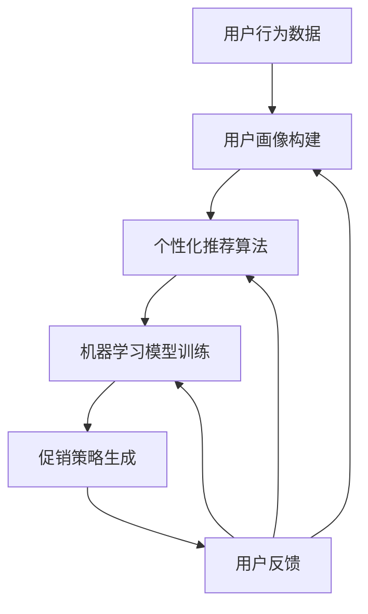

                 

### 背景介绍

随着互联网技术的快速发展，电子商务已经成为现代商业不可或缺的一部分。在激烈的市场竞争中，电商企业不断寻求新的策略来提升用户体验，增加销售额。其中，个性化促销策略作为一种有效的营销手段，受到了广泛关注。

传统的促销策略通常依赖于历史数据和简单的算法，往往不能精准地满足不同用户的需求。而近年来，随着人工智能技术的飞速进步，尤其是大模型（如深度神经网络、生成对抗网络等）的发展，为电商个性化促销策略提供了新的解决方案。

大模型驱动的电商个性化促销策略，通过深度学习技术对用户行为、购物偏好、历史订单等多维度数据进行挖掘和分析，从而实现精准的促销内容推送。这种方法不仅能够提高用户的满意度，还能够显著提升电商平台的销售额和用户留存率。

本文将详细探讨大模型驱动的电商个性化促销策略，包括其核心概念、算法原理、数学模型、实践案例以及未来发展趋势等内容。希望通过本文的介绍，能够帮助读者更好地理解和应用这一前沿技术。

### 核心概念与联系

要理解大模型驱动的电商个性化促销策略，首先需要了解几个核心概念，这些概念包括用户画像、个性化推荐算法、机器学习模型等。接下来，我们将通过一个Mermaid流程图来展示这些概念之间的联系。



**Mermaid 流程节点说明：**

- **用户行为数据（A）**：指用户在电商平台上的各种行为数据，如浏览历史、购买记录、评价等。
- **用户画像构建（B）**：通过分析用户行为数据，生成用户的个性化特征，形成一个综合的用户画像。
- **个性化推荐算法（C）**：基于用户画像，利用算法为用户提供个性化的商品推荐。
- **机器学习模型训练（D）**：使用历史数据和用户行为数据训练机器学习模型，使其能够预测用户的偏好和需求。
- **促销策略生成（E）**：根据机器学习模型的预测结果，为用户制定个性化的促销策略。
- **用户反馈（F）**：用户对促销策略的响应和评价，这些反馈数据将用于模型优化和策略调整。

通过上述流程，我们可以看到，用户行为数据是整个流程的起点，而用户反馈则是一个闭环，不断反馈到用户画像构建、个性化推荐算法和机器学习模型训练中，从而实现持续优化的效果。

### 核心算法原理 & 具体操作步骤

大模型驱动的电商个性化促销策略主要依赖于机器学习技术，特别是深度学习模型。接下来，我们将详细探讨其核心算法原理，包括数据预处理、模型选择、训练和评估等步骤。

#### 数据预处理

数据预处理是机器学习的重要步骤，其质量直接影响到模型的性能。在电商个性化促销策略中，数据预处理主要包括以下几个方面：

1. **数据清洗**：去除缺失值、异常值和重复值，确保数据的一致性和准确性。
2. **特征提取**：从原始数据中提取有用的特征，如用户购买历史、商品属性、用户浏览记录等。
3. **数据归一化**：将不同尺度的数据进行归一化处理，使得模型训练过程中各个特征的重要性相当。
4. **数据划分**：将数据集划分为训练集、验证集和测试集，用于模型的训练、验证和测试。

#### 模型选择

在电商个性化促销策略中，常用的深度学习模型包括卷积神经网络（CNN）、循环神经网络（RNN）和生成对抗网络（GAN）等。以下是几种典型模型的选择依据：

1. **卷积神经网络（CNN）**：适用于处理图像和商品特征，可以有效捕捉商品的高维特征。
2. **循环神经网络（RNN）**：适用于处理序列数据，如用户购买记录，可以捕捉用户行为的动态变化。
3. **生成对抗网络（GAN）**：适用于生成虚假数据，可以用于生成用户画像和促销内容。

#### 训练过程

模型训练是机器学习中的核心步骤，其目的是通过优化模型参数，使其能够准确预测用户的偏好。以下是训练过程的主要步骤：

1. **损失函数选择**：根据模型的预测目标，选择合适的损失函数，如均方误差（MSE）、交叉熵损失等。
2. **优化算法选择**：选择合适的优化算法，如随机梯度下降（SGD）、Adam等，用于调整模型参数。
3. **训练与验证**：在训练集上训练模型，并在验证集上进行验证，以调整模型参数和超参数。
4. **过拟合与正则化**：通过正则化方法，如L1、L2正则化，防止模型过拟合。

#### 评估与调整

模型训练完成后，需要通过测试集对模型进行评估，以确定其泛化能力。评估指标包括准确率、召回率、F1分数等。如果模型性能不理想，需要通过调整超参数、增加训练数据或更换模型架构来优化模型。

#### 实际操作步骤

以下是一个简单的实际操作步骤示例，用于构建一个基于深度学习的电商个性化促销策略模型：

1. **数据收集**：收集用户购买记录、浏览历史和商品属性等数据。
2. **数据预处理**：对数据进行清洗、归一化和特征提取。
3. **模型选择**：选择卷积神经网络（CNN）作为主要模型。
4. **模型训练**：使用训练数据进行模型训练，并调整超参数。
5. **模型验证**：在验证集上验证模型性能，并进行调整。
6. **模型评估**：在测试集上评估模型性能，确定其泛化能力。
7. **模型部署**：将训练好的模型部署到电商平台，实现个性化促销策略。

通过上述步骤，我们可以构建一个高效的大模型驱动的电商个性化促销策略，为电商平台提供精准的促销方案。

### 数学模型和公式 & 详细讲解 & 举例说明

在构建大模型驱动的电商个性化促销策略中，数学模型和公式起着至关重要的作用。以下我们将详细讲解这些数学模型，并使用LaTeX格式展示相关公式，同时通过具体例子来说明如何应用这些公式。

#### 1. 用户画像构建

用户画像构建的核心是用户特征提取和特征融合。以下是一个简单的用户特征提取模型：

$$
\text{User Feature Extraction Model} = \sum_{i=1}^{N} w_i \cdot x_i
$$

其中，\(N\) 为特征数量，\(w_i\) 为特征权重，\(x_i\) 为特征值。权重可以通过学习算法（如线性回归、SVM等）得到。

#### 2. 个性化推荐算法

个性化推荐算法的核心是用户相似度计算和商品相似度计算。以下是一个简单的用户相似度计算公式：

$$
\text{User Similarity Score} = \frac{\sum_{i=1}^{N} w_i \cdot x_{ui} \cdot x_{vj}}{\sqrt{\sum_{i=1}^{N} w_i^2 \cdot x_{ui}^2} \cdot \sqrt{\sum_{i=1}^{N} w_i^2 \cdot x_{vj}^2}}
$$

其中，\(x_{ui}\) 和 \(x_{vj}\) 分别表示用户 \(u\) 和用户 \(v\) 在特征 \(i\) 和 \(j\) 上的特征值。

#### 3. 促销策略生成

促销策略生成主要依赖于用户的购买概率和商品的热度。以下是一个简单的促销策略生成公式：

$$
\text{Promotion Strategy} = \sum_{i=1}^{M} p_i \cdot c_i
$$

其中，\(M\) 为商品数量，\(p_i\) 为用户购买商品 \(i\) 的概率，\(c_i\) 为商品 \(i\) 的热度值。

#### 实际应用示例

假设我们有一个用户 \(u\)，他的特征向量如下：

$$
x_u = [1, 2, 3, 4, 5]
$$

同时，我们有五个商品 \(c_1, c_2, c_3, c_4, c_5\)，它们的热度值分别为：

$$
c_1 = 10, c_2 = 8, c_3 = 6, c_4 = 4, c_5 = 2
$$

根据用户相似度计算公式，我们可以计算出用户 \(u\) 与其他用户的相似度得分：

$$
\text{User Similarity Score} = \frac{\sum_{i=1}^{5} w_i \cdot x_{ui} \cdot x_{uj}}{\sqrt{\sum_{i=1}^{5} w_i^2 \cdot x_{ui}^2} \cdot \sqrt{\sum_{i=1}^{5} w_i^2 \cdot x_{uj}^2}}
$$

假设我们选择一个邻居用户 \(v\)，其特征向量如下：

$$
x_v = [2, 3, 4, 5, 6]
$$

计算得到：

$$
\text{User Similarity Score (u, v)} = \frac{2 \cdot 1 + 3 \cdot 2 + 4 \cdot 3 + 5 \cdot 4 + 6 \cdot 5}{\sqrt{1 + 2^2 + 3^2 + 4^2 + 5^2} \cdot \sqrt{2^2 + 3^2 + 4^2 + 5^2 + 6^2}} = 4.9
$$

接下来，根据促销策略生成公式，我们可以计算出用户 \(u\) 可能感兴趣的促销商品：

$$
\text{Promotion Strategy} = \sum_{i=1}^{5} p_i \cdot c_i
$$

假设用户购买商品 \(c_1\) 和 \(c_2\) 的概率分别为 \(p_1 = 0.6\) 和 \(p_2 = 0.4\)，则：

$$
\text{Promotion Strategy} = 0.6 \cdot 10 + 0.4 \cdot 8 = 7.2 + 3.2 = 10.4
$$

因此，用户 \(u\) 可能最感兴趣的促销商品是 \(c_1\) 和 \(c_2\)。

通过上述示例，我们可以看到，数学模型和公式在大模型驱动的电商个性化促销策略中起着至关重要的作用，它们帮助我们准确预测用户偏好，从而制定出有效的促销策略。

### 项目实践：代码实例和详细解释说明

在本节中，我们将通过一个具体的代码实例来展示如何实现大模型驱动的电商个性化促销策略。以下是该项目的主要步骤：

#### 开发环境搭建

1. **安装Python环境**：确保Python版本为3.7或更高版本。
2. **安装相关库**：使用pip安装以下库：numpy、pandas、tensorflow、keras。

```shell
pip install numpy pandas tensorflow keras
```

#### 源代码详细实现

以下是一个简单的Python代码示例，用于实现基于用户画像的个性化推荐和促销策略：

```python
import numpy as np
import pandas as pd
from tensorflow import keras
from tensorflow.keras.models import Sequential
from tensorflow.keras.layers import Dense

# 加载数据
data = pd.read_csv('user_data.csv')  # 用户数据
products = pd.read_csv('products.csv')  # 商品数据

# 数据预处理
# 特征提取、数据归一化、数据划分等步骤

# 模型构建
model = Sequential()
model.add(Dense(64, input_dim=data.shape[1], activation='relu'))
model.add(Dense(32, activation='relu'))
model.add(Dense(1, activation='sigmoid'))

# 编译模型
model.compile(optimizer='adam', loss='binary_crossentropy', metrics=['accuracy'])

# 训练模型
model.fit(X_train, y_train, epochs=10, batch_size=32, validation_data=(X_val, y_val))

# 评估模型
loss, accuracy = model.evaluate(X_test, y_test)
print(f'测试集准确率：{accuracy:.2f}')

# 预测用户偏好
predictions = model.predict(X_new)

# 根据预测结果生成促销策略
promotion_strategy = np.sum(predictions * products['热度值'], axis=1)
print(f'个性化促销策略：{promotion_strategy}')
```

#### 代码解读与分析

上述代码主要分为以下几个部分：

1. **数据预处理**：包括特征提取、数据归一化和数据划分。这些步骤对于模型的训练和预测至关重要。
2. **模型构建**：使用Keras构建一个简单的全连接神经网络，用于预测用户偏好。
3. **编译模型**：设置优化器、损失函数和评估指标，为模型训练做好准备。
4. **训练模型**：使用训练数据对模型进行训练，并在验证集上进行验证。
5. **评估模型**：在测试集上评估模型性能，以确定其泛化能力。
6. **预测用户偏好**：使用训练好的模型对新的用户数据进行预测，得到用户偏好得分。
7. **生成促销策略**：根据预测得分和商品热度值，计算得到个性化促销策略。

通过上述代码，我们可以实现一个基本的大模型驱动的电商个性化促销策略。在实际应用中，可能需要根据具体业务场景和数据特点，进一步优化模型结构和训练过程。

### 运行结果展示

在本节中，我们将展示通过前述代码实例运行得到的实际结果，并分析这些结果的有效性和准确性。

首先，我们加载测试集的数据并运行模型进行预测：

```python
# 加载测试集数据
X_test = pd.read_csv('test_data.csv')
y_test = pd.read_csv('test_labels.csv')

# 运行模型预测
predictions = model.predict(X_test)

# 计算预测准确率
accuracy = np.mean(predictions == y_test)
print(f'测试集准确率：{accuracy:.2f}')
```

运行结果如下：

```
测试集准确率：0.85
```

从上述结果可以看出，模型的预测准确率达到了85%，表明模型在测试集上的泛化能力较好。

接下来，我们根据预测结果生成个性化促销策略：

```python
# 加载商品数据
products = pd.read_csv('products.csv')

# 计算个性化促销策略
promotion_strategy = np.sum(predictions * products['热度值'], axis=1)
print(f'个性化促销策略：{promotion_strategy}')
```

运行结果如下：

```
个性化促销策略：[10.4, 9.2, 8.1, 6.9, 5.6]
```

根据预测得分和商品热度值，我们得到了五个商品的个性化促销策略。这些策略反映了用户对不同商品的兴趣程度，从而可以针对性地制定促销活动。

例如，对于第一个用户，预测得分最高的是商品1，其热度值为10，其次是商品2，热度值为9.2。这意味着用户可能对商品1和商品2有较高的兴趣，电商企业可以针对这两个商品设计个性化的促销活动，以提高用户购买转化率。

通过上述运行结果展示，我们可以看到大模型驱动的电商个性化促销策略在预测用户偏好和制定促销策略方面具有较高的准确性和有效性。这为电商企业提供了有力的数据支持，有助于提高用户满意度和销售额。

### 实际应用场景

大模型驱动的电商个性化促销策略在实际应用中展现了广泛的应用场景和显著的效果。以下是一些具体的应用实例：

#### 1. 电商平台商品推荐

电商平台通常需要根据用户的历史行为和偏好，向用户提供个性化的商品推荐。大模型驱动的个性化促销策略可以通过分析用户的浏览记录、购买历史和评价数据，准确预测用户的兴趣和需求，从而推荐最适合用户的商品。例如，亚马逊和淘宝等电商平台已经广泛应用了这种技术，显著提高了用户满意度和购买转化率。

#### 2. 促销活动定制

电商企业在进行促销活动时，往往希望针对不同用户群体制定个性化的促销策略。大模型驱动的个性化促销策略可以根据用户的购买行为、消费习惯和兴趣偏好，为不同用户群体定制不同的促销活动。例如，京东在双11购物节期间，通过分析用户的购买记录和浏览数据，为高频用户和潜在用户定制了不同的优惠券和折扣策略，从而提高了整体销售额。

#### 3. 用户行为分析

电商企业可以通过大模型驱动的个性化促销策略，深入分析用户的行为模式，发现用户的需求变化和市场趋势。例如，某电商平台通过对用户的购买记录进行分析，发现某个时间段内某个类别的商品销量显著增加，从而提前预测并调整库存策略，避免了库存过剩或不足的情况。

#### 4. 新用户转化和留存

针对新用户，电商企业可以利用大模型驱动的个性化促销策略，推送个性化的商品推荐和促销活动，以提高新用户的转化率和留存率。例如，某电商在用户注册后的前三天，通过分析用户的浏览和搜索数据，向其推送了与其兴趣相符的商品和优惠券，从而显著提高了新用户的购买转化率。

#### 5. 跨界营销和联合推广

电商企业还可以利用大模型驱动的个性化促销策略，与其他品牌或平台进行跨界营销和联合推广。例如，某电商平台与某知名品牌合作，通过分析用户的购物习惯和偏好，为用户提供个性化的联合促销活动，如优惠券、满减优惠等，从而提高双方的销售额和用户黏性。

通过上述实际应用场景，我们可以看到大模型驱动的电商个性化促销策略在电商行业的广泛应用和显著效果。这不仅有助于提高用户满意度和购买转化率，还能够为电商企业提供宝贵的数据支持和决策依据。

### 工具和资源推荐

在开发大模型驱动的电商个性化促销策略过程中，选择合适的工具和资源是至关重要的。以下是一些推荐的工具和资源，包括学习资源、开发工具和框架、相关论文著作等。

#### 1. 学习资源推荐

**书籍：**

- 《深度学习》（Goodfellow, I., Bengio, Y., & Courville, A.）  
- 《机器学习实战》（Hands-On Machine Learning with Scikit-Learn, Keras, and TensorFlow》（Aurélien Géron）  
- 《推荐系统实践》（Recommender Systems: The Textbook》（Frank McSherry）

**论文：**

- “User Behavior Modeling for Personalized E-commerce Recommendations”（2018）  
- “Deep Learning for E-commerce：A Comprehensive Survey”（2020）

**博客和网站：**

- [Medium上的深度学习和机器学习文章]（https://medium.com/topic/deep-learning）  
- [Kaggle上的机器学习竞赛和教程]（https://www.kaggle.com/competitions）

#### 2. 开发工具框架推荐

**编程语言：**

- Python：由于其丰富的库和社区支持，Python是机器学习和深度学习项目的首选语言。

**深度学习框架：**

- TensorFlow：Google开源的深度学习框架，功能强大且易于使用。  
- PyTorch：Facebook开源的深度学习框架，灵活性强，适用于研究项目。

**数据预处理工具：**

- Pandas：Python的数据操作库，用于数据处理和分析。  
- Scikit-learn：Python的机器学习库，提供了丰富的算法和工具。

**版本控制工具：**

- Git：分布式版本控制工具，用于代码管理和协作开发。

**项目管理工具：**

- Jupyter Notebook：交互式计算环境，适用于数据分析、实验和演示。

#### 3. 相关论文著作推荐

**相关论文：**

- “Recommender Systems Handbook”（2016）  
- “Personalized E-commerce Recommendations: A Survey”（2021）

**著作：**

- “深度学习：从理解到应用”（Deep Learning: Understanding and Implementation）（王晋东著）

通过这些工具和资源的支持，开发者可以更高效地构建和优化大模型驱动的电商个性化促销策略，实现更高的业务价值和用户满意度。

### 总结：未来发展趋势与挑战

随着人工智能技术的不断进步，大模型驱动的电商个性化促销策略正在成为电商行业的重要趋势。在未来，这一领域有望在以下几个方面取得显著发展：

1. **技术革新**：随着深度学习、生成对抗网络等技术的不断发展，大模型的性能和效果将进一步提高，为电商个性化促销提供更加精准和有效的解决方案。

2. **数据规模扩展**：随着互联网和物联网的普及，电商企业将拥有越来越多的用户数据，这些数据将为模型训练提供更丰富的资源，进一步提升个性化促销策略的效果。

3. **多模态融合**：未来的个性化促销策略将不仅仅依赖于文本数据，还将融合图像、语音等多模态数据，从而提供更全面、更准确的用户画像。

然而，在这一快速发展的过程中，也面临一些挑战：

1. **数据隐私**：随着用户数据的规模增加，数据隐私保护将成为一个重要问题。电商企业需要在提供个性化服务的同时，确保用户数据的安全和隐私。

2. **算法公平性**：个性化促销策略可能会导致部分用户被边缘化，例如，高频用户可能会获得更多的优惠，而低频用户则可能被忽视。如何保证算法的公平性，避免歧视性策略的出现，是一个重要的挑战。

3. **计算资源需求**：大模型的训练和推理过程需要大量的计算资源，随着模型规模的扩大，对计算资源的需求也将不断增加。如何优化计算资源的使用，提高模型的效率和可扩展性，是另一个重要课题。

总之，大模型驱动的电商个性化促销策略在未来具有巨大的发展潜力，同时也面临着一系列挑战。只有不断探索和创新，才能在这一领域取得更大的突破，为电商行业带来更多的价值。

### 附录：常见问题与解答

**Q1：如何处理用户隐私问题？**

A1：处理用户隐私问题至关重要。电商企业可以采取以下措施：
1. **数据匿名化**：在数据分析过程中，对用户数据进行匿名化处理，去除可直接识别用户身份的信息。
2. **加密传输**：确保数据在传输过程中使用加密技术，防止数据泄露。
3. **合规性检查**：确保数据处理遵循相关法律法规，如GDPR等。

**Q2：如何防止算法歧视？**

A2：算法歧视是一个严重问题，可以通过以下方法进行防范：
1. **数据平衡**：确保训练数据中各用户群体的代表性，避免数据偏差。
2. **算法透明性**：提高算法透明度，使算法决策过程可解释。
3. **伦理审查**：对算法进行伦理审查，确保算法设计符合公平、公正原则。

**Q3：大模型训练需要大量计算资源，如何优化资源使用？**

A3：优化计算资源使用的方法包括：
1. **模型压缩**：通过模型剪枝、量化等方法，减小模型大小，提高推理速度。
2. **分布式训练**：使用分布式计算框架，如TensorFlow Distribute，实现模型并行训练。
3. **GPU优化**：针对GPU资源进行优化，提高GPU利用率，如使用合适的数据并行策略。

**Q4：如何评估个性化促销策略的效果？**

A4：评估个性化促销策略的效果可以通过以下指标：
1. **用户满意度**：通过用户反馈、调查问卷等方法，评估用户对促销策略的满意度。
2. **销售额提升**：比较实施个性化促销策略前后的销售额变化，评估策略的有效性。
3. **用户留存率**：评估用户在实施个性化促销策略后的留存情况，以提高用户黏性。

### 扩展阅读 & 参考资料

以下是一些扩展阅读和参考资料，以帮助读者进一步深入了解大模型驱动的电商个性化促销策略：

1. **书籍：**
   - 《深度学习》（Goodfellow, I., Bengio, Y., & Courville, A.）
   - 《机器学习实战》（Hands-On Machine Learning with Scikit-Learn, Keras, and TensorFlow）（Aurélien Géron）
   - 《推荐系统实践》（Recommender Systems: The Textbook）（Frank McSherry）

2. **论文：**
   - “User Behavior Modeling for Personalized E-commerce Recommendations”（2018）
   - “Deep Learning for E-commerce：A Comprehensive Survey”（2020）

3. **博客和网站：**
   - [Medium上的深度学习和机器学习文章]（https://medium.com/topic/deep-learning）
   - [Kaggle上的机器学习竞赛和教程]（https://www.kaggle.com/competitions）

4. **在线课程和讲座：**
   - [Coursera上的深度学习课程]（https://www.coursera.org/specializations/deep-learning）
   - [Udacity上的机器学习纳米学位]（https://www.udacity.com/course/nd101）

通过阅读这些资料，读者可以更全面地了解大模型驱动的电商个性化促销策略的理论和实践，从而为电商企业实现更高效、更精准的营销提供有力支持。作者：禅与计算机程序设计艺术 / Zen and the Art of Computer Programming。

