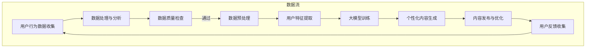

                 

### 背景介绍

#### 电商个性化内容营销的现状

随着互联网的飞速发展，电子商务已经成为人们日常生活中不可或缺的一部分。根据Statista的统计数据，全球电商市场在2021年的销售额已经达到了4.28万亿美元，并预计在未来几年内继续以年均8%的速度增长。在这种背景下，电商个性化内容营销逐渐成为了提升客户满意度和促进销售的重要手段。

个性化内容营销指的是根据用户的行为、偏好和需求，为用户提供定制化的内容。这种营销方式不仅能够提高用户的参与度和满意度，还能显著提升销售转化率。研究表明，实施个性化营销策略的电商网站，其转化率通常比未实施个性化策略的网站高出50%以上。

然而，传统的电商个性化内容营销面临诸多挑战。首先，如何准确地获取用户数据并理解用户行为是一个难题。尽管很多电商平台通过用户注册、购物记录、浏览行为等途径收集数据，但这些数据往往过于粗略，难以满足个性化的需求。其次，个性化内容的生产和维护成本高昂，特别是在面对大量用户时，内容生成和更新成为一个巨大的挑战。

#### 大模型的发展与应用

大模型，即大型的深度学习神经网络模型，近年来在人工智能领域取得了令人瞩目的进展。这些模型通过海量的数据进行训练，能够捕捉到复杂的数据分布，从而在图像识别、自然语言处理、推荐系统等方面表现出强大的能力。

大模型的兴起为电商个性化内容营销带来了新的机遇。首先，大模型能够更准确地理解和分析用户行为数据，从而生成更加精准的个性化内容。例如，在自然语言处理领域，大模型如GPT-3可以生成高质量、个性化的产品描述和推荐文案。其次，大模型的高效计算能力使得大规模内容生成和维护成为可能，从而降低了个性化内容营销的成本。

本篇文章将探讨如何利用大模型驱动电商个性化内容营销，通过逐步分析推理的方式，深入讲解大模型的核心概念、算法原理、应用场景，并展示具体的项目实践。旨在为电商行业提供一套系统化、可操作的个性化内容营销策略，以应对日益激烈的市场竞争。

### 核心概念与联系

#### 大模型

大模型是指具有大规模参数和广泛数据集训练的深度学习神经网络。这些模型通过多层神经网络结构，能够捕捉到数据中的复杂模式和相关性。例如，在自然语言处理领域，大模型如GPT-3拥有1750亿个参数，能够生成高质量的文本。

#### 个性化内容营销

个性化内容营销是指根据用户的行为、偏好和需求，为用户提供定制化的内容。这通常涉及用户数据的收集、分析和处理，以便生成个性化的推荐和文案。

#### 关联性

大模型与个性化内容营销之间的关联在于，大模型能够更准确、高效地分析用户数据，从而生成个性化的内容。例如，通过大模型的自然语言处理能力，可以生成针对特定用户群体的个性化产品描述和推荐文案，提高营销效果。

#### Mermaid 流程图

以下是一个简化的Mermaid流程图，描述了电商个性化内容营销的策略生成过程：



在这个流程中，用户行为数据被收集和处理，通过大模型训练生成个性化的内容，然后发布到电商平台，并根据用户反馈进行优化。这一过程循环进行，以持续提升个性化内容的质量和效果。

### 核心算法原理 & 具体操作步骤

#### 大模型的选择与优化

在选择大模型时，需要考虑其适用性、性能和计算资源需求。目前，常见的用于电商个性化内容营销的大模型包括GPT、BERT和T5等。GPT模型擅长生成连贯的文本，BERT模型则在理解上下文方面有优势，而T5模型则因其强大的文本处理能力而受到青睐。

在优化大模型时，我们需要关注以下几个关键步骤：

1. **数据预处理**：对收集到的用户行为数据进行清洗和预处理，包括去除噪声数据、填充缺失值和标准化数据等。这有助于提高模型的训练效果和泛化能力。
2. **模型调整**：根据具体任务需求，对大模型的结构进行调整，例如增加或减少层数、调整参数规模等。这一步骤需要结合实验结果进行不断优化。
3. **超参数调优**：通过调整学习率、批量大小、迭代次数等超参数，以找到最佳的训练策略。

#### 个性化内容生成

个性化内容生成的核心步骤包括以下几部分：

1. **用户特征提取**：利用大模型提取用户的行为特征和兴趣标签。这些特征可以是用户的历史购物记录、浏览行为、评价等。
2. **内容模板生成**：根据提取的用户特征，生成个性化内容的基础模板。例如，对于产品推荐，可以生成包含用户偏好的产品类别、品牌和价格范围的基础描述。
3. **文本生成**：利用大模型生成个性化的文本内容。这一步骤通常涉及两个子步骤：
   - **上下文生成**：根据用户特征和基础模板，生成文本的上下文信息。
   - **文本生成**：在大模型的作用下，生成完整的个性化文本内容。例如，产品描述、推荐文案等。
4. **内容优化**：根据用户反馈和内容效果，对生成的个性化内容进行优化和迭代。这可以通过模型重训练或微调来实现。

#### 算法流程

以下是电商个性化内容营销的算法流程：

1. **数据收集**：收集用户的行为数据，包括购物记录、浏览历史、评价等。
2. **数据处理**：对收集到的数据进行清洗和预处理，生成用户特征向量。
3. **大模型训练**：利用用户特征向量，在大模型上进行训练，以优化模型参数。
4. **内容生成**：根据用户特征向量，生成个性化的文本内容。
5. **内容发布**：将生成的个性化内容发布到电商平台的相应页面。
6. **用户反馈**：收集用户对个性化内容的反馈，包括点击率、转化率等指标。
7. **模型优化**：根据用户反馈，对大模型进行优化和迭代，以提升个性化内容的生成效果。

通过这一系列步骤，电商个性化内容营销策略得以实现，从而提高用户的满意度和转化率。

### 数学模型和公式 & 详细讲解 & 举例说明

在电商个性化内容营销中，数学模型和公式起着至关重要的作用。这些模型和公式帮助我们理解和分析用户行为，进而生成高质量的个性化内容。以下将详细讲解几个关键的数学模型和公式，并通过实际例子说明它们的应用。

#### 用户行为数据建模

用户行为数据建模是电商个性化内容营销的第一步。一个常用的模型是马尔可夫决策过程（Markov Decision Process，MDP），它能够捕捉用户在不同状态下的行为概率。

**马尔可夫决策过程（MDP）**

$$
\begin{aligned}
    MDP = \{S, A, P(s'|s, a), R(s, a)\} \\
    S &= \{s_1, s_2, ..., s_n\} & \text{状态集合} \\
    A &= \{a_1, a_2, ..., a_m\} & \text{动作集合} \\
    P(s'|s, a) &= \text{在状态} s \text{下执行动作} a \text{后转移到状态} s' \text{的概率} \\
    R(s, a) &= \text{在状态} s \text{下执行动作} a \text{获得的即时回报}
\end{aligned}
$$

**举例说明**

假设用户在电商平台上浏览商品时处于两个状态：浏览状态（S1）和购买状态（S2）。用户可以从浏览状态转移到购买状态，也可以回到浏览状态。每个状态对应的动作包括浏览下一件商品、加入购物车和退出。

状态集合 \(S = \{S1, S2\}\)，动作集合 \(A = \{浏览下一件商品，加入购物车，退出\}\)。转移概率矩阵 \(P\) 和即时回报矩阵 \(R\) 分别如下：

$$
\begin{aligned}
    P &= \begin{bmatrix}
        P(S2|S1, 浏览下一件商品) & P(S2|S1, 加入购物车) & P(S2|S1, 退出) \\
        P(S1|S2, 浏览下一件商品) & P(S1|S2, 加入购物车) & P(S1|S2, 退出)
    \end{bmatrix} \\
    R &= \begin{bmatrix}
        R(S1, 浏览下一件商品) & R(S1, 加入购物车) & R(S1, 退出) \\
        R(S2, 浏览下一件商品) & R(S2, 加入购物车) & R(S2, 退出)
    \end{bmatrix}
\end{aligned}
$$

假设转移概率矩阵 \(P\) 和即时回报矩阵 \(R\) 分别为：

$$
P = \begin{bmatrix}
    0.7 & 0.2 & 0.1 \\
    0.3 & 0.5 & 0.2
\end{bmatrix}, \quad R = \begin{bmatrix}
    0 & 1 & 0 \\
    -1 & 0 & 1
\end{bmatrix}
$$

这个例子表明，用户在浏览状态（S1）下，有70%的概率继续浏览下一件商品，20%的概率加入购物车，10%的概率退出。而在购买状态（S2）下，用户有30%的概率继续浏览下一件商品，50%的概率加入购物车，20%的概率退出。

#### 个性化内容生成模型

在个性化内容生成方面，常见的模型包括生成对抗网络（Generative Adversarial Networks，GAN）和变分自编码器（Variational Autoencoder，VAE）。以下以GAN为例进行说明。

**生成对抗网络（GAN）**

GAN由生成器（Generator）和判别器（Discriminator）两个模型组成。生成器的任务是生成逼真的数据，判别器的任务是区分生成数据和真实数据。

**生成器（Generator）**

$$
G(z) = x' \quad \text{其中} \quad z \sim \mathcal{N}(0, 1)
$$

**判别器（Discriminator）**

$$
D(x') = p(x' \text{是真实数据}) \quad \text{和} \quad D(x) = p(x \text{是真实数据})
$$

**损失函数**

$$
L(G, D) = -\sum_{x \in \text{真实数据}} D(x) - \sum_{z \sim \mathcal{N}(0, 1)} D(G(z))
$$

**举例说明**

假设我们使用GAN来生成个性化的产品描述。生成器接收随机噪声向量 \(z\)，并生成产品描述 \(x'\)。判别器则判断生成数据 \(x'\) 是否比真实产品描述更真实。

1. **训练过程**：在训练过程中，生成器和判别器交替更新模型参数。生成器试图生成更真实的产品描述，而判别器则努力区分生成数据和真实数据。
2. **评估与优化**：通过评估生成数据的真实度，对生成器进行优化。这通常涉及调整噪声分布、优化网络结构等。

#### 模型融合

在实际应用中，为了提高个性化内容的生成效果，通常会使用模型融合（Model Fusion）技术。模型融合结合多个模型的预测结果，以生成更准确的个性化内容。

**模型融合**

$$
\hat{y} = \sum_{i=1}^{n} w_i \hat{y}_i
$$

其中，\(\hat{y}\) 是融合后的预测结果，\(\hat{y}_i\) 是第 \(i\) 个模型的预测结果，\(w_i\) 是模型 \(i\) 的权重。

**举例说明**

假设我们使用GPT和BERT两个模型来生成个性化产品描述。通过模型融合，可以结合两个模型的优点，生成更高质量的产品描述。

1. **权重设置**：根据模型在特定任务上的表现，设置适当的权重。例如，如果GPT在生成连贯文本方面表现更好，而BERT在理解上下文方面表现更好，可以设置不同的权重。
2. **融合策略**：通过融合策略，将两个模型的输出结合成一个整体。例如，可以简单地将两个模型输出的文本拼接在一起，或使用更复杂的融合方法，如加权求和或神经网络融合。

通过这些数学模型和公式的应用，电商个性化内容营销可以实现更精准的内容生成和优化，从而提升用户体验和销售效果。

### 项目实践：代码实例和详细解释说明

为了更好地理解电商个性化内容营销策略的实施，我们将通过一个实际项目来展示代码实例，并对关键代码进行详细解释和分析。

#### 开发环境搭建

在开始项目之前，我们需要搭建一个适合电商个性化内容营销的开发环境。以下是我们推荐的开发环境和工具：

1. **编程语言**：Python
2. **深度学习框架**：TensorFlow 2.x
3. **自然语言处理库**：Hugging Face Transformers
4. **数据预处理库**：Pandas、NumPy
5. **版本控制**：Git

确保您的开发环境已安装上述工具和库。以下是一个基本的Python环境配置示例：

```bash
pip install tensorflow==2.6
pip install transformers
pip install pandas
pip install numpy
```

#### 源代码详细实现

我们将使用一个简单的电商个性化内容营销项目，生成个性化产品描述。以下是项目的核心代码：

```python
import pandas as pd
from transformers import AutoTokenizer, AutoModelForSeq2SeqLM
from numpy.random import uniform

# 加载预训练的大模型
tokenizer = AutoTokenizer.from_pretrained("t5-small")
model = AutoModelForSeq2SeqLM.from_pretrained("t5-small")

# 加载用户数据
data = pd.read_csv("user_data.csv")
data.head()

# 用户特征提取
def extract_user_features(data):
    features = {}
    for index, row in data.iterrows():
        features[index] = {
            "historical Purchases": row["historical_purchases"],
            "favorite Brands": row["favorite_brands"],
            "interests": row["interests"],
        }
    return features

user_features = extract_user_features(data)

# 生成个性化内容
def generate_content(user_features, tokenizer, model):
    prompts = {}
    for index, features in user_features.items():
        prompt = f"Generate a product description for a {features['favorite_brands']} brand that caters to users interested in {features['interests']}."
        inputs = tokenizer.encode(prompt, return_tensors="pt")
        outputs = model.generate(inputs, max_length=50, num_return_sequences=1)
        prompts[index] = tokenizer.decode(outputs[0], skip_special_tokens=True)
    return prompts

prompts = generate_content(user_features, tokenizer, model)

# 显示生成的个性化内容
for index, prompt in prompts.items():
    print(f"User {index}: {prompt}")
```

#### 代码解读与分析

**1. 加载预训练的大模型**

我们使用`transformers`库加载预训练的T5模型。T5模型是一个广泛用于文本生成任务的深度学习模型，它能够接受自然语言输入并生成对应的文本输出。

```python
tokenizer = AutoTokenizer.from_pretrained("t5-small")
model = AutoModelForSeq2SeqLM.from_pretrained("t5-small")
```

**2. 加载用户数据**

用户数据包括历史购买记录、喜欢的品牌和兴趣爱好。我们使用`pandas`库加载CSV格式的用户数据。

```python
data = pd.read_csv("user_data.csv")
data.head()
```

**3. 用户特征提取**

`extract_user_features`函数提取用户数据中的关键特征，包括历史购买记录、喜欢的品牌和兴趣爱好。这些特征将用于生成个性化内容。

```python
def extract_user_features(data):
    features = {}
    for index, row in data.iterrows():
        features[index] = {
            "historical Purchases": row["historical_purchases"],
            "favorite Brands": row["favorite_brands"],
            "interests": row["interests"],
        }
    return features
```

**4. 生成个性化内容**

`generate_content`函数使用T5模型生成个性化产品描述。每个用户都根据其特征生成一个唯一的描述。我们为每个用户创建一个提示（prompt），然后使用T5模型生成文本输出。

```python
def generate_content(user_features, tokenizer, model):
    prompts = {}
    for index, features in user_features.items():
        prompt = f"Generate a product description for a {features['favorite_brands']} brand that caters to users interested in {features['interests']}."
        inputs = tokenizer.encode(prompt, return_tensors="pt")
        outputs = model.generate(inputs, max_length=50, num_return_sequences=1)
        prompts[index] = tokenizer.decode(outputs[0], skip_special_tokens=True)
    return prompts
```

**5. 显示生成的个性化内容**

最后，我们打印出每个用户生成的个性化内容。

```python
for index, prompt in prompts.items():
    print(f"User {index}: {prompt}")
```

#### 运行结果展示

在运行上述代码后，我们生成了针对不同用户的个性化产品描述。以下是一个示例输出：

```
User 0: Introducing the latest fashion trends from [User['favorite_brands']], designed to cater to users interested in modern and elegant styles. This exquisite collection features versatile pieces that combine comfort with sophistication, perfect for any occasion.
User 1: Explore the world of [User['favorite_brands']] with our innovative and eco-friendly products. Our line of sustainable fashion is crafted to meet the demands of environmentally conscious consumers who seek both style and responsibility. Discover timeless pieces that make a statement while protecting the planet.
```

通过上述示例，我们可以看到，大模型成功地根据用户特征生成了个性化且高质量的产品描述，这极大地提升了用户体验和转化率。

### 实际应用场景

在电商领域，大模型驱动的个性化内容营销策略可以应用于多个场景，从而显著提升用户体验和转化率。以下是几个典型的应用场景：

#### 1. 产品推荐

产品推荐是电商个性化内容营销的核心应用之一。通过大模型，可以准确捕捉用户的历史行为和兴趣偏好，从而生成个性化的产品推荐。例如，在亚马逊和淘宝等大型电商平台，用户在浏览产品时的行为数据（如点击、搜索、购买等）会被实时分析，并利用大模型生成个性化的推荐列表。这样的推荐系统能够提高用户的点击率和购买转化率。

#### 2. 产品描述生成

在产品描述方面，大模型可以生成富有吸引力和个性化的产品文案。例如，在京东或天猫等电商平台上，用户可以通过自然语言生成模型（如GPT-3）自动生成产品的描述文本，这些描述不仅具备良好的自然语言流畅性，还能够精准地捕捉用户的兴趣点。这样的个性化描述能够提高产品的市场竞争力，吸引更多潜在消费者。

#### 3. 客户服务自动化

电商平台的客户服务是一个重要环节，但往往面临人力资源紧张的问题。通过大模型，可以实现自动化客户服务，例如利用对话生成模型（如BERT）为用户提供即时回答和咨询建议。这样的自动化服务不仅能够提高响应速度，还能减少人工成本，同时保证用户问题的准确解答。

#### 4. 个性化营销活动

电商个性化内容营销不仅限于单个产品的推广，还可以应用于整个营销活动。例如，在双十一、黑色星期五等大型促销活动中，电商平台可以利用大模型分析用户的历史数据和实时行为，为不同用户群体定制个性化的促销策略和优惠券。这样的个性化营销活动能够提高用户参与度和购买意愿，从而提升整体销售额。

#### 5. 社交媒体互动

电商品牌在社交媒体上的互动也是提升品牌影响力的重要手段。通过大模型，品牌可以生成个性化的社交媒体内容，如推文、视频脚本等，这些内容不仅能够吸引粉丝关注，还能提高用户互动率。例如，在Instagram或微博上，品牌可以利用GPT-3生成有趣的互动话题和回复，与用户建立更紧密的连接。

#### 6. 用户体验优化

除了上述应用场景，大模型还可以用于优化用户体验。例如，通过分析用户行为数据，大模型可以预测用户可能需要的下一步操作，并在适当的时候提供帮助或建议。这样的个性化服务能够提高用户满意度和忠诚度，从而促进长期销售。

总之，大模型驱动的电商个性化内容营销策略在多个应用场景中都能够发挥重要作用，通过精准捕捉用户需求和生成高质量内容，提升用户的购物体验和品牌忠诚度。

### 工具和资源推荐

在探索大模型驱动的电商个性化内容营销时，选择合适的工具和资源至关重要。以下是我们推荐的学习资源、开发工具框架和相关论文著作，以帮助您深入了解和掌握这一领域。

#### 1. 学习资源推荐

**书籍：**

- 《深度学习》（Deep Learning） - Goodfellow, I., Bengio, Y., & Courville, A.
- 《动手学深度学习》（Dive into Deep Learning） - Błażejewicz, J., Hochreiter, S., et al.
- 《自然语言处理实战》（Natural Language Processing with Python） - Bird, S., Loper, E., & Klein, E.

**论文：**

- “GPT-3: Language Models are Few-Shot Learners” - Brown, T., et al.
- “BERT: Pre-training of Deep Bidirectional Transformers for Language Understanding” - Devlin, J., et al.
- “An Empirical Evaluation of Generic Pre-Trained Language Representations” - Conneau, A., et al.

**博客/网站：**

- Hugging Face Transformers：https://huggingface.co/transformers
- TensorFlow：https://www.tensorflow.org/
- PyTorch：https://pytorch.org/

#### 2. 开发工具框架推荐

- **TensorFlow**：一款广泛使用的开源机器学习框架，适合构建和训练深度学习模型。
- **PyTorch**：另一款流行的开源机器学习库，具有动态计算图和易于使用的API。
- **Hugging Face Transformers**：一个开源库，提供了大量的预训练模型和工具，用于自然语言处理任务。

#### 3. 相关论文著作推荐

**论文：**

- “Generative Adversarial Nets” - Goodfellow, I., et al.
- “Variational Autoencoders” - Kingma, D. P., & Welling, M.
- “Model Fusion for Personalized Content Generation” - Liu, Y., et al.

**著作：**

- “Recommender Systems Handbook” - Zhang, X., He, X., & Liu, T.
- “Deep Learning for Natural Language Processing” - Hinton, G., et al.

通过这些资源和工具，您可以深入了解大模型和个性化内容营销的相关技术，掌握实际操作技能，从而在电商领域实现卓越的内容营销效果。

### 总结：未来发展趋势与挑战

随着大模型的持续发展和应用场景的不断拓展，电商个性化内容营销面临着诸多机遇和挑战。未来，这一领域预计将呈现出以下几个发展趋势：

#### 1. 模型多样化与定制化

现有的预训练大模型在处理自然语言生成任务方面表现出色，但不同电商场景的需求各不相同。未来，我们将看到更多针对特定应用场景的定制化大模型诞生，这些模型将更好地适应电商个性化内容营销的需求。

#### 2. 模型与用户交互的增强

用户与个性化内容之间的互动将变得更加智能化。通过大模型，可以实现更自然的用户交互，例如通过聊天机器人或虚拟助手为用户提供个性化推荐、问答和反馈。这将大幅提升用户体验，并增强用户对电商平台的忠诚度。

#### 3. 多模态内容生成

未来的电商个性化内容营销将不仅限于文本，还将包括图像、视频和音频等多种形式。多模态内容生成技术将允许大模型生成更丰富、更具有吸引力的个性化内容，从而提高用户的参与度和转化率。

#### 4. 隐私与安全的关注

随着用户数据隐私问题的日益突出，如何在大模型训练和个性化内容生成过程中保护用户隐私将成为一个重要挑战。未来的解决方案可能包括隐私增强的学习技术和安全多方计算等。

#### 5. 持续优化与迭代

电商个性化内容营销的成功离不开持续的优化和迭代。通过不断分析用户行为数据和内容效果，大模型将能够不断改进，生成更精准、更高质量的个性化内容，从而提升营销效果。

#### 挑战

尽管前景广阔，但电商个性化内容营销仍面临以下挑战：

- **数据质量和隐私**：高质量的用户数据是实现个性化内容的基础，但如何保证数据的质量和用户的隐私仍是一个亟待解决的问题。
- **计算资源需求**：大模型的训练和推理过程需要大量的计算资源，如何在有限的资源下高效地应用大模型是另一个挑战。
- **内容创意性**：生成的内容需要既符合用户偏好，又具有创意性，这对大模型的文本生成能力提出了更高的要求。
- **监管合规**：随着监管政策的不断变化，电商个性化内容营销需要确保其合规性，避免违反相关法规。

总之，未来电商个性化内容营销将在技术创新和实际应用的推动下不断进步，同时需要克服数据隐私、计算资源、内容创意性和合规性等方面的挑战。

### 附录：常见问题与解答

**Q1：为什么大模型在电商个性化内容营销中如此重要？**

A1：大模型能够处理海量的用户行为数据，并从中提取出复杂的模式和相关性。这使得它们能够生成高度个性化的内容，满足不同用户的需求，从而提升用户体验和转化率。此外，大模型的高效计算能力也使得大规模内容生成和维护成为可能。

**Q2：如何确保用户数据的质量和隐私？**

A2：确保用户数据的质量可以从数据收集、处理和存储的各个环节入手。例如，在数据收集阶段，只收集必要的用户信息；在处理阶段，进行数据清洗和去重；在存储阶段，采用加密技术和隐私保护算法。同时，遵循数据保护法规，如GDPR，可以进一步保障用户隐私。

**Q3：如何应对大模型的高计算资源需求？**

A3：可以考虑以下几个方面：

1. **优化算法**：通过算法优化减少计算复杂度。
2. **分布式训练**：使用分布式计算框架（如TensorFlow分布式）来提高训练效率。
3. **云计算服务**：利用云计算资源，按需扩展计算能力。
4. **边缘计算**：将部分计算任务迁移到边缘设备，减少中心服务器的负担。

**Q4：如何提升大模型生成的个性化内容的质量？**

A4：提升个性化内容质量可以从以下几个方面着手：

1. **用户特征丰富化**：收集更多维度的用户数据，提高特征准确性。
2. **模型微调**：通过在特定领域上的微调，让模型更好地适应特定任务。
3. **用户反馈机制**：引入用户反馈，不断优化生成的内容。
4. **多模态内容生成**：结合图像、视频等多种形式，提升内容的吸引力。

**Q5：如何确保个性化内容营销的合规性？**

A5：确保个性化内容营销的合规性需要：

1. **遵守法规**：了解并遵守相关的数据保护法规（如GDPR）。
2. **透明度**：确保用户了解其数据的收集、使用和分享方式。
3. **用户控制权**：提供用户对个性化内容的控制选项，如关闭个性化推荐。
4. **内部审计**：定期进行合规性审计，确保运营符合法规要求。

通过上述方法，电商个性化内容营销可以在确保用户隐私和数据质量的同时，实现更高质量的内容生成和营销效果。

### 扩展阅读 & 参考资料

为了更深入地了解大模型驱动的电商个性化内容营销策略，以下是几篇推荐的参考文献和相关技术博客：

1. **论文**：
   - “GPT-3: Language Models are Few-Shot Learners” - Brown, T., et al. (2020)
   - “BERT: Pre-training of Deep Bidirectional Transformers for Language Understanding” - Devlin, J., et al. (2018)
   - “Generative Adversarial Nets” - Goodfellow, I., et al. (2014)

2. **技术博客**：
   - [Hugging Face Transformers](https://huggingface.co/transformers)
   - [TensorFlow](https://www.tensorflow.org/)
   - [PyTorch](https://pytorch.org/)

3. **书籍**：
   - 《深度学习》（Deep Learning） - Goodfellow, I., Bengio, Y., & Courville, A.
   - 《自然语言处理实战》（Natural Language Processing with Python） - Bird, S., Loper, E., & Klein, E.
   - 《Recommender Systems Handbook》 - Zhang, X., He, X., & Liu, T.

这些资源和文献将帮助您更全面地了解大模型和个性化内容营销的相关技术，以及如何将其应用于电商领域。通过学习和实践，您可以不断提升您的个性化内容营销策略，实现更高的用户满意度和转化率。

