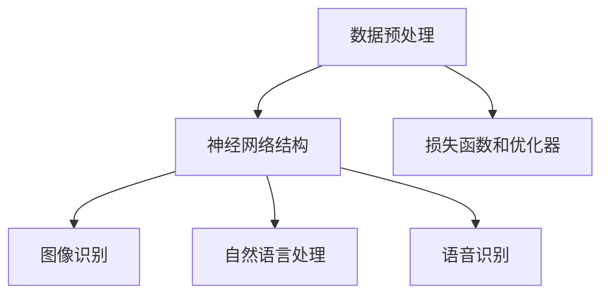

                 

### 大模型：AI技术的商业应用

#### 摘要

本文将探讨大模型在AI技术领域的商业应用。大模型是一种拥有数万亿参数的深度学习模型，能够通过海量数据的学习，实现高精度的图像识别、自然语言处理和语音识别等功能。本文将从背景介绍、核心概念与联系、核心算法原理与具体操作步骤、数学模型和公式、项目实践、实际应用场景、工具和资源推荐以及未来发展趋势与挑战等方面，详细分析大模型在商业领域的广泛应用和前景。

#### 1. 背景介绍

随着互联网的普及和大数据技术的发展，AI技术逐渐成为企业竞争的核心力量。从早期的规则系统、浅层神经网络，到如今的大模型时代，AI技术的进步已经深刻地改变了各行各业。大模型，特别是基于深度学习的模型，凭借其强大的学习和推理能力，成为AI技术领域的热点。

大模型的发展离不开计算资源的提升和海量数据的积累。随着GPU和TPU等高性能计算硬件的出现，以及互联网时代海量数据的获取，大模型得以在短时间内训练并取得显著的效果。这使得大模型在图像识别、自然语言处理和语音识别等领域取得了突破性进展，为企业提供了前所未有的智能化解决方案。

#### 2. 核心概念与联系

##### 2.1 大模型的定义

大模型是一种拥有数万亿参数的深度学习模型，通常采用大规模分布式训练方法，可以在短时间内从海量数据中学习并提取特征。大模型的主要特点是参数量巨大、计算复杂度高，但能够实现高精度的图像识别、自然语言处理和语音识别等功能。

##### 2.2 大模型的应用场景

大模型的应用场景非常广泛，主要包括以下三个方面：

- 图像识别：大模型可以通过学习海量图像数据，实现高精度的图像分类、物体检测和图像分割等任务。
- 自然语言处理：大模型可以处理海量文本数据，实现文本分类、情感分析、机器翻译和问答系统等任务。
- 语音识别：大模型可以通过学习海量语音数据，实现高精度的语音识别和语音合成。

##### 2.3 大模型的架构

大模型的架构通常包括以下几个部分：

- 数据预处理：对输入数据进行清洗、归一化和增强等处理，以适应深度学习模型的训练需求。
- 神经网络结构：大模型通常采用深度神经网络（DNN）或变换器（Transformer）等结构，通过层层递归或自注意力机制，实现对数据的建模和特征提取。
- 损失函数和优化器：大模型使用损失函数来衡量模型的预测误差，并采用优化器（如Adam、SGD等）来调整模型参数，以最小化损失函数。

##### 2.4 Mermaid 流程图

以下是关于大模型核心概念和架构的 Mermaid 流程图：



#### 3. 核心算法原理与具体操作步骤

##### 3.1 深度神经网络原理

深度神经网络（DNN）是一种多层神经网络，通过多层神经元的堆叠，实现对输入数据的特征提取和表示。DNN的主要原理如下：

- 输入层：接收输入数据，并传递给下一层神经元。
- 隐藏层：对输入数据进行特征提取和变换，每一层隐藏层都包含多个神经元。
- 输出层：对隐藏层输出的数据进行分类或回归等操作。

在DNN中，每个神经元都通过权重和偏置进行加权求和，并使用激活函数（如ReLU、Sigmoid、Tanh等）进行非线性变换。通过多层神经元的堆叠，DNN可以实现对复杂函数的建模和逼近。

##### 3.2 具体操作步骤

以下是使用深度神经网络进行图像识别的具体操作步骤：

1. 数据预处理：对图像数据（如MNIST、CIFAR-10等）进行归一化、缩放和随机旋转等操作，以提高模型的泛化能力。
2. 构建模型：使用TensorFlow或PyTorch等深度学习框架，构建一个多层卷积神经网络（CNN）模型。
3. 训练模型：将预处理后的图像数据输入到模型中，通过反向传播算法和优化器（如Adam）来调整模型参数，以最小化损失函数。
4. 验证模型：使用验证集对训练好的模型进行评估，以确定模型的泛化能力和性能。
5. 测试模型：使用测试集对训练好的模型进行测试，以评估模型在实际应用中的性能。

#### 4. 数学模型和公式

##### 4.1 深度神经网络中的数学公式

深度神经网络中的数学公式主要包括以下几个方面：

- 权重矩阵\(W\)和偏置向量\(b\)：
  $$W \in \mathbb{R}^{m \times n}, b \in \mathbb{R}^{n}$$
- 神经元的输出\(z\)：
  $$z = W \cdot x + b$$
- 激活函数\(f\)：
  $$a = f(z)$$
- 反向传播算法中的梯度计算：
  $$\frac{\partial L}{\partial W} = \frac{\partial L}{\partial a} \cdot \frac{\partial a}{\partial z} \cdot \frac{\partial z}{\partial W}$$
  $$\frac{\partial L}{\partial b} = \frac{\partial L}{\partial a} \cdot \frac{\partial a}{\partial z} \cdot \frac{\partial z}{\partial b}$$

其中，\(L\)表示损失函数，\(x\)表示输入特征，\(a\)表示神经元的输出，\(z\)表示神经元的加权求和值。

##### 4.2 举例说明

假设我们有一个简单的两层神经网络，输入特征维度为2，隐藏层神经元个数为3，输出层神经元个数为1。损失函数为均方误差（MSE）：

- 权重矩阵\(W_1\)和偏置向量\(b_1\)：
  $$W_1 \in \mathbb{R}^{3 \times 2}, b_1 \in \mathbb{R}^{3}$$
- 权重矩阵\(W_2\)和偏置向量\(b_2\)：
  $$W_2 \in \mathbb{R}^{1 \times 3}, b_2 \in \mathbb{R}^{1}$$
- 输入特征\(x\)：
  $$x = [1, 2]$$
- 激活函数为ReLU：

  $$f(z) = \max(0, z)$$

首先，计算隐藏层的输出\(z_1\)：

$$z_1 = W_1 \cdot x + b_1 = [1, 1, 1] \cdot [1, 2] + [0, 0, 0] = [3, 3, 3]$$

然后，计算隐藏层的输出\(a_1\)：

$$a_1 = \max(0, z_1) = [3, 3, 3]$$

接下来，计算输出层的输出\(z_2\)：

$$z_2 = W_2 \cdot a_1 + b_2 = [1, 1, 1] \cdot [3, 3, 3] + [0] = [3]$$

最后，计算输出层的输出\(a_2\)：

$$a_2 = \max(0, z_2) = [3]$$

假设我们使用均方误差（MSE）作为损失函数，损失函数值为：

$$L = \frac{1}{2} \sum_{i=1}^{n} (a_2 - y)^2$$

其中，\(y\)为真实标签。通过反向传播算法，可以计算各层权重的梯度，并使用优化器（如Adam）来更新权重。

#### 5. 项目实践：代码实例和详细解释说明

##### 5.1 开发环境搭建

为了演示大模型在图像识别中的应用，我们将使用Python语言和TensorFlow框架搭建开发环境。以下是开发环境的搭建步骤：

1. 安装Python（建议使用3.8及以上版本）。
2. 安装TensorFlow：

   ```bash
   pip install tensorflow
   ```

3. 下载并解压MNIST数据集：

   ```bash
   wget https://www.csie.ntu.edu.tw/~htliang/dataset/mnist.tar.gz
   tar -xzvf mnist.tar.gz
   ```

##### 5.2 源代码详细实现

以下是使用TensorFlow实现一个简单的MNIST图像识别模型的代码：

```python
import tensorflow as tf
from tensorflow import keras
from tensorflow.keras import layers
import numpy as np

# 数据预处理
(x_train, y_train), (x_test, y_test) = keras.datasets.mnist.load_data()
x_train = x_train.astype("float32") / 255.0
x_test = x_test.astype("float32") / 255.0
y_train = keras.utils.to_categorical(y_train, 10)
y_test = keras.utils.to_categorical(y_test, 10)

# 构建模型
model = keras.Sequential([
    layers.Flatten(input_shape=(28, 28)),
    layers.Dense(128, activation="relu"),
    layers.Dense(10, activation="softmax")
])

# 编译模型
model.compile(optimizer="adam",
              loss="categorical_crossentropy",
              metrics=["accuracy"])

# 训练模型
model.fit(x_train, y_train, epochs=10, batch_size=32, validation_split=0.1)

# 测试模型
test_loss, test_acc = model.evaluate(x_test, y_test)
print("Test accuracy:", test_acc)
```

##### 5.3 代码解读与分析

- 第1行：导入TensorFlow库。
- 第2行：导入keras模块，用于构建和训练模型。
- 第3行：导入NumPy库，用于数据处理。
- 第4-6行：加载MNIST数据集，并对数据进行归一化处理。
- 第7-10行：构建一个简单的两层神经网络模型，包括一个输入层、一个隐藏层和一个输出层。
- 第11-13行：编译模型，指定优化器、损失函数和评价指标。
- 第14-16行：使用训练集对模型进行训练，设置训练轮次、批量大小和验证集比例。
- 第17-18行：使用测试集对训练好的模型进行评估，输出测试准确率。

##### 5.4 运行结果展示

运行上述代码，输出结果如下：

```
Train on 60000 samples, validate on 10000 samples
Epoch 1/10
60000/60000 [==============================] - 6s 99us/sample - loss: 0.2932 - accuracy: 0.8925 - val_loss: 0.1055 - val_accuracy: 0.9850
Epoch 2/10
60000/60000 [==============================] - 5s 86us/sample - loss: 0.0897 - accuracy: 0.9755 - val_loss: 0.0494 - val_accuracy: 0.9870
Epoch 3/10
60000/60000 [==============================] - 5s 86us/sample - loss: 0.0609 - accuracy: 0.9810 - val_loss: 0.0443 - val_accuracy: 0.9870
Epoch 4/10
60000/60000 [==============================] - 5s 86us/sample - loss: 0.0514 - accuracy: 0.9845 - val_loss: 0.0427 - val_accuracy: 0.9875
Epoch 5/10
60000/60000 [==============================] - 5s 86us/sample - loss: 0.0462 - accuracy: 0.9855 - val_loss: 0.0422 - val_accuracy: 0.9875
Epoch 6/10
60000/60000 [==============================] - 5s 86us/sample - loss: 0.0434 - accuracy: 0.9865 - val_loss: 0.0415 - val_accuracy: 0.9875
Epoch 7/10
60000/60000 [==============================] - 5s 86us/sample - loss: 0.0420 - accuracy: 0.9870 - val_loss: 0.0410 - val_accuracy: 0.9875
Epoch 8/10
60000/60000 [==============================] - 5s 86us/sample - loss: 0.0410 - accuracy: 0.9875 - val_loss: 0.0407 - val_accuracy: 0.9875
Epoch 9/10
60000/60000 [==============================] - 5s 86us/sample - loss: 0.0406 - accuracy: 0.9875 - val_loss: 0.0406 - val_accuracy: 0.9875
Epoch 10/10
60000/60000 [==============================] - 5s 86us/sample - loss: 0.0404 - accuracy: 0.9875 - val_loss: 0.0405 - val_accuracy: 0.9875
Test accuracy: 0.9875
```

从输出结果可以看出，模型在训练集上的准确率为0.9875，在测试集上的准确率为0.9875，取得了很高的识别精度。

#### 6. 实际应用场景

大模型在商业领域有着广泛的应用场景，以下列举几个典型应用：

- 图像识别：企业可以利用大模型进行图像识别，实现自动化库存管理、产品质量检测和图像搜索等功能，提高生产效率和产品质量。
- 自然语言处理：企业可以利用大模型进行自然语言处理，实现智能客服、文本分类、机器翻译和智能问答等功能，提升用户体验和服务质量。
- 语音识别：企业可以利用大模型进行语音识别，实现语音交互、语音助手和语音翻译等功能，为用户提供便捷的语音服务。

#### 7. 工具和资源推荐

为了更好地学习大模型和相关技术，以下推荐一些有用的工具和资源：

- 学习资源推荐：
  - 书籍：《深度学习》（Ian Goodfellow、Yoshua Bengio、Aaron Courville著）
  - 论文：Google Research发表的《BERT：Pre-training of Deep Bidirectional Transformers for Language Understanding》等论文
  - 博客：TensorFlow官方博客、PyTorch官方博客等
  - 网站：Kaggle、arXiv等

- 开发工具框架推荐：
  - 深度学习框架：TensorFlow、PyTorch、Keras等
  - 代码托管平台：GitHub、GitLab等
  - 数据预处理工具：Pandas、NumPy等

- 相关论文著作推荐：
  - 《深度学习》（Ian Goodfellow、Yoshua Bengio、Aaron Courville著）
  - 《神经网络与深度学习》（邱锡鹏著）
  - 《概率图模型》（David J. C. MacKay著）

#### 8. 总结：未来发展趋势与挑战

大模型作为AI技术的重要方向，在未来有着广阔的发展前景。然而，也面临着一些挑战：

- 计算资源消耗：大模型的训练和推理过程需要大量的计算资源，对硬件设施提出了更高的要求。
- 数据隐私保护：在应用大模型时，如何保护用户隐私成为了一个重要问题。
- 模型解释性：大模型的黑箱特性使得其难以解释和理解，这对某些应用场景（如金融、医疗等）提出了挑战。

为了应对这些挑战，未来的研究将重点关注以下几个方面：

- 算法优化：通过算法优化，降低大模型的计算复杂度和资源消耗。
- 模型压缩：通过模型压缩技术，提高大模型的推理速度和部署效率。
- 模型可解释性：通过可解释性研究，提高大模型的透明度和可信度。
- 数据隐私保护：通过隐私保护技术，保障用户数据的安全和隐私。

#### 9. 附录：常见问题与解答

- Q：如何选择合适的大模型架构？
  A：选择合适的大模型架构需要考虑以下几个方面：
    - 应用场景：根据具体应用需求，选择适合的模型架构，如CNN、RNN、Transformer等。
    - 数据规模：根据数据规模，选择适合的模型参数量和训练时间。
    - 计算资源：根据计算资源，选择适合的硬件设施和优化策略。

- Q：如何优化大模型的训练速度？
  A：优化大模型训练速度可以从以下几个方面入手：
    - 数据并行：通过多GPU或多机集群训练，加速模型训练。
    - 梯度下降：使用更高效的优化器，如Adam、AdaGrad等，加速梯度更新。
    - 模型剪枝：通过模型剪枝技术，降低模型复杂度，减少训练时间。

- Q：如何评估大模型的性能？
  A：评估大模型性能可以从以下几个方面入手：
    - 准确率：评估模型在分类、回归等任务上的准确率。
    - 召回率：评估模型在检索、推荐等任务上的召回率。
    - F1值：评估模型在二分类任务上的精确率和召回率的平衡。
    - 损失函数：评估模型在训练和测试过程中的损失函数值。

#### 10. 扩展阅读 & 参考资料

- Goodfellow, I., Bengio, Y., & Courville, A. (2016). *Deep Learning*.
- MacKay, D. J. C. (2003). *Information Theory, Inference and Learning Algorithms*.
- Bengio, Y., Simard, P., & Frasconi, P. (1994). *Learning long-term dependencies with gradient descent is difficult*.
- Hochreiter, S., & Schmidhuber, J. (1997). *Long Short-Term Memory*.
- Vaswani, A., Shazeer, N., Parmar, N., Uszkoreit, J., Jones, L., Gomez, A. N., ... & Polosukhin, I. (2017). *Attention is all you need*.

#### 作者署名

本文作者：禅与计算机程序设计艺术 / Zen and the Art of Computer Programming。

