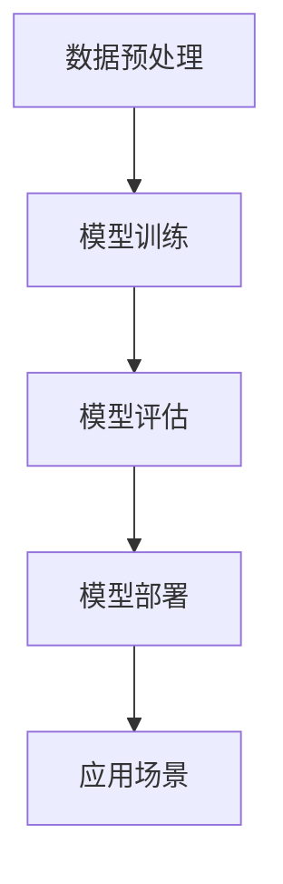

                 

### 背景介绍

#### 大模型的起源与快速发展

大模型，即大规模深度学习模型，起源于20世纪90年代末的神经网络研究。早期神经网络模型由于计算能力和数据资源限制，模型规模较小，性能也相对有限。然而，随着计算机硬件的快速发展以及海量数据的积累，深度学习模型开始展现其强大的潜力。

2006年，深度信念网络（Deep Belief Network，DBN）的提出标志着深度学习领域的一个重要突破。随后，2012年，AlexNet在ImageNet图像识别挑战赛中取得重大胜利，深度学习开始迅速崛起。特别是2018年，谷歌的Transformer模型在自然语言处理领域取得了显著进展，引发了人们对大模型研究的广泛关注。

近年来，随着计算能力的进一步提升，数据量的不断增大，以及优化算法的不断改进，大模型的规模和复杂度达到了前所未有的水平。例如，GPT-3、BERT、ChatGLM等模型参数量达到数十亿至千亿级别，处理能力也日益增强，逐渐成为人工智能领域的研究热点和应用前沿。

#### 大模型的应用场景

大模型在多个领域展现出了巨大的应用潜力，以下是几个典型的应用场景：

1. **自然语言处理（NLP）**：大模型在语言理解、生成、翻译等方面具有显著优势。例如，GPT-3可以生成连贯、有深度的文章，BERT在问答系统、文本分类等领域也表现出色。

2. **计算机视觉（CV）**：大模型在图像识别、目标检测、图像生成等方面取得了显著进展。例如，GANs（生成对抗网络）可以在给定少量样本的情况下生成高质量的图像。

3. **语音识别**：大模型在语音识别领域也取得了重要突破。通过训练大规模的语音模型，可以实现对各种语音环境的自适应处理，提高识别准确率。

4. **推荐系统**：大模型可以用于个性化推荐，通过对用户行为和兴趣的深入理解，提供更加精准的推荐结果。

5. **游戏AI**：大模型在游戏AI中也有广泛应用，通过模拟和学习人类的游戏策略，可以实现智能化的游戏玩法。

#### 大模型的商业价值

大模型的商业价值体现在多个方面，以下是一些主要方面：

1. **提高生产效率**：在大数据处理和智能分析领域，大模型可以自动化处理大量数据，提高生产效率。

2. **优化决策**：大模型可以用于数据挖掘和分析，帮助企业更好地理解市场趋势、消费者行为，从而做出更加精准的决策。

3. **降低成本**：通过自动化和智能化，大模型可以降低人力成本和运营成本。

4. **创造新的业务模式**：大模型可以应用于个性化服务、智能营销、自动化生产等领域，创造新的商业机会。

5. **提升用户体验**：大模型在语音识别、智能客服、智能推荐等方面，可以提供更加自然、高效的交互体验，提升用户满意度。

总之，大模型作为一种强大的技术工具，正在各行各业中发挥越来越重要的作用，其商业价值也在不断显现。然而，要充分利用大模型的潜力，还需要解决一系列技术挑战和实际问题。接下来，我们将深入探讨大模型的核心算法原理、数学模型、项目实践以及实际应用场景。在接下来的章节中，我们将逐步分析并解答这些问题。

### 核心概念与联系

#### 1. 大模型的概念

大模型，通常指的是那些拥有数百万至数十亿参数的深度学习模型。这些模型之所以被称为“大”，是因为其能够处理大规模的数据集，并在各种任务中展现出色的性能。大模型的兴起，主要得益于以下几个因素：

1. **数据量的增加**：随着互联网的发展，数据量呈现爆炸式增长，这为训练大型模型提供了丰富的数据资源。
2. **计算能力的提升**：云计算和GPU等计算设备的普及，使得大规模训练成为可能。
3. **算法的进步**：深度学习算法，特别是Transformer等新型结构的提出，使得大模型的训练更加高效。

#### 2. 大模型的分类

大模型可以根据其应用领域和特点进行分类，以下是几种主要类型：

1. **自然语言处理（NLP）模型**：如GPT、BERT、ChatGLM等，这些模型主要用于处理文本数据，包括语言生成、翻译、问答等任务。
2. **计算机视觉（CV）模型**：如ResNet、VGG、GANs等，这些模型主要用于图像识别、目标检测、图像生成等任务。
3. **推荐系统模型**：如MF、ALS、深度神经网络等，这些模型主要用于个性化推荐，通过分析用户行为和兴趣，提供个性化的推荐结果。
4. **语音识别模型**：如DNN-HMM、CTC、WaveNet等，这些模型主要用于语音信号的识别和处理。

#### 3. 大模型与神经网络的关系

大模型通常是基于神经网络结构构建的。神经网络，是一种模仿生物神经系统的计算模型，通过层层神经元的连接，实现从输入到输出的映射。大模型的规模和复杂性决定了其能够处理的任务范围和性能表现。

1. **神经网络的基本结构**：神经网络由输入层、隐藏层和输出层组成。输入层接收外部输入信号，隐藏层对输入进行加工处理，输出层生成最终输出。
2. **神经网络的学习机制**：神经网络通过学习大量样本数据，调整内部连接权重，以最小化输出误差。这一过程通常包括前向传播、反向传播和权重更新三个步骤。

#### 4. 大模型的工作原理

大模型的工作原理可以概括为以下几个关键步骤：

1. **数据预处理**：对原始数据进行清洗、归一化等处理，以适应模型的输入要求。
2. **模型训练**：使用大规模数据进行模型的训练，通过调整模型参数，使其能够准确地预测或生成目标数据。
3. **模型评估**：使用测试数据对训练好的模型进行评估，以验证其性能和泛化能力。
4. **模型部署**：将训练好的模型部署到实际应用环境中，实现自动化处理和决策。

#### 5. 大模型的优势与挑战

大模型的优势主要体现在以下几个方面：

1. **强大的处理能力**：大模型能够处理大规模、复杂的数据，并在各种任务中展现出色的性能。
2. **高度的泛化能力**：大模型通过大规模数据的训练，能够泛化到不同的任务和数据集，具有广泛的适用性。
3. **自动化与智能化**：大模型可以自动化处理大量数据，降低人力成本，提高生产效率。

然而，大模型也面临一系列挑战：

1. **计算资源需求**：大模型需要大量的计算资源和时间进行训练，这对硬件设施和能耗提出了较高要求。
2. **数据隐私和安全**：大模型对数据的依赖性较高，如何保护用户数据隐私和安全成为关键问题。
3. **模型解释性**：大模型通常被认为是“黑盒”模型，其内部决策过程难以解释，这在某些应用场景中可能是一个问题。

#### 6. Mermaid 流程图

以下是用于描述大模型工作流程的Mermaid流程图：



在这个流程图中，数据预处理、模型训练、模型评估和模型部署构成了大模型工作流程的核心步骤，而应用场景则是大模型价值的最终体现。

### 核心算法原理 & 具体操作步骤

#### 1. 深度学习基础

深度学习是构建大模型的核心技术，其基本原理基于多层神经网络。以下是深度学习的一些关键概念：

1. **神经网络**：神经网络由多个神经元（或称为节点）组成，每个神经元都接收来自前一层神经元的输入信号，并通过加权求和和激活函数进行计算，产生输出。
2. **前向传播**：在神经网络中，输入信号从输入层传递到输出层，这个过程称为前向传播。通过前向传播，神经网络可以计算每个神经元的输出值。
3. **反向传播**：在输出结果与真实值存在误差时，神经网络通过反向传播算法更新各层神经元的权重和偏置。反向传播算法的核心是计算梯度，以最小化误差函数。

#### 2. 反向传播算法

反向传播算法是深度学习训练过程中至关重要的步骤，其基本流程如下：

1. **前向传播**：输入数据通过网络进行前向传播，生成预测输出。
2. **计算误差**：将预测输出与真实值进行比较，计算误差（通常使用均方误差MSE或交叉熵损失函数）。
3. **计算梯度**：根据误差函数对网络参数（权重和偏置）计算梯度，梯度方向指示了参数调整的方向。
4. **参数更新**：使用梯度下降（或其变种）算法，根据梯度调整网络参数，以减少误差。

#### 3. 梯度下降算法

梯度下降算法是优化神经网络参数的一种常用方法，其基本思想是沿着误差函数梯度的反方向调整参数，以最小化误差。以下是梯度下降算法的具体步骤：

1. **初始化参数**：随机初始化网络的权重和偏置。
2. **计算梯度**：对于每个参数，计算其在当前误差函数下的梯度。
3. **参数更新**：根据梯度和学习率（η），更新网络参数：
   \[
   \theta_{\text{new}} = \theta_{\text{current}} - \eta \cdot \nabla_{\theta} J(\theta)
   \]
   其中，\(\theta\) 表示参数，\(\nabla_{\theta} J(\theta)\) 表示参数的梯度，\(J(\theta)\) 表示误差函数。

#### 4. 梯度消失与梯度爆炸

在深度学习训练过程中，可能会出现梯度消失或梯度爆炸问题：

1. **梯度消失**：当输入数据经过多层神经网络时，梯度可能逐渐减小，导致网络难以更新参数，从而使训练过程停滞。
2. **梯度爆炸**：在反向传播过程中，梯度可能迅速增大，导致网络参数更新过大，出现不稳定现象。

为解决这些问题，可以采取以下方法：

1. **激活函数**：使用ReLU等非线性激活函数，可以提高梯度传递的有效性。
2. **梯度裁剪**：通过限制梯度的最大值或最小值，避免梯度爆炸和消失。
3. **优化算法**：采用更稳定的优化算法，如Adam、RMSprop等，可以提高训练稳定性。

#### 5. 随机梯度下降（SGD）与批量梯度下降

梯度下降算法有两种常见变体：随机梯度下降（SGD）和批量梯度下降（BGD）：

1. **随机梯度下降（SGD）**：每次更新参数时，只使用一个样本来计算梯度。SGD可以加快训练过程，但可能导致参数更新不够稳定。
2. **批量梯度下降（BGD）**：每次更新参数时，使用整个训练集来计算梯度。BGD可以提供更稳定的参数更新，但训练时间较长。

在实际应用中，通常结合二者的优点，采用小批量梯度下降（MBGD），每次使用部分训练样本来计算梯度，以平衡训练速度和稳定性。

#### 6. 超参数调优

超参数是深度学习模型中的关键参数，如学习率、批量大小、迭代次数等。超参数调优是深度学习模型训练的重要步骤，以下是一些常用的调优策略：

1. **网格搜索**：在给定的超参数范围内，遍历所有可能的组合，选择表现最佳的组合。
2. **随机搜索**：随机选择超参数组合，通过多次实验来寻找最佳组合。
3. **贝叶斯优化**：利用贝叶斯统计模型，结合历史实验结果和先验知识，优化超参数选择。

#### 7. 模型评估与选择

在深度学习模型训练过程中，需要对模型进行评估和选择，以下是一些常用的评估指标和方法：

1. **准确率（Accuracy）**：模型正确预测的样本占总样本的比例。
2. **召回率（Recall）**：模型正确预测的样本在所有实际正样本中的比例。
3. **精确率（Precision）**：模型正确预测的样本在所有预测为正样本中的比例。
4. **F1 分数（F1 Score）**：精确率和召回率的调和平均值，用于综合评价模型的性能。
5. **ROC 曲线和 AUC 值**：通过计算模型在不同阈值下的精确率和召回率，绘制 ROC 曲线，并计算曲线下的面积（AUC 值），用于评估模型的分类能力。

通过以上步骤和策略，可以构建和优化大模型，使其在各种任务中展现出色的性能。在下一节中，我们将详细讲解大模型的数学模型和公式，进一步理解其工作原理和操作方法。

### 数学模型和公式 & 详细讲解 & 举例说明

#### 1. 神经网络中的基本数学模型

神经网络的核心在于其层次结构和函数组合，以下简要介绍神经网络中的关键数学模型和公式。

##### （1）激活函数

激活函数是神经网络中一个重要的组成部分，常用的激活函数包括：

- **Sigmoid 函数**：
  \[
  \sigma(x) = \frac{1}{1 + e^{-x}}
  \]
  Sigmoid 函数将输入映射到（0, 1）区间，但存在梯度消失问题。

- **ReLU 函数**：
  \[
  \text{ReLU}(x) = \max(0, x)
  \]
  ReLU 函数简单且计算高效，但存在神经元死亡问题。

- **Tanh 函数**：
  \[
  \tanh(x) = \frac{e^{2x} - 1}{e^{2x} + 1}
  \]
  Tanh 函数将输入映射到（-1, 1）区间，但计算复杂度较高。

##### （2）损失函数

损失函数用于衡量模型预测值与真实值之间的差异，常用的损失函数包括：

- **均方误差（MSE）**：
  \[
  J(\theta) = \frac{1}{m} \sum_{i=1}^{m} (h_\theta(x^{(i)}) - y^{(i)})^2
  \]
  MSE 是最常用的损失函数，对异常值敏感。

- **交叉熵损失函数（Cross Entropy Loss）**：
  \[
  J(\theta) = -\frac{1}{m} \sum_{i=1}^{m} y^{(i)} \log(h_\theta(x^{(i)}))
  \]
  交叉熵损失函数在分类问题中表现较好，对异常值相对不敏感。

##### （3）反向传播算法中的梯度计算

反向传播算法的核心在于梯度的计算和参数的更新，以下是一个简单的梯度计算示例：

假设我们有以下简单的神经网络模型：
\[
h_\theta(x) = \sigma(\theta_1 x + \theta_2)
\]
其中，\(h_\theta(x)\) 是模型的输出，\(\theta_1\) 和 \(\theta_2\) 是模型参数。

- **损失函数对 \( \theta_1 \) 的梯度**：
  \[
  \frac{\partial J(\theta)}{\partial \theta_1} = \frac{\partial}{\partial \theta_1} \left[ (h_\theta(x) - y) \cdot \sigma'(\theta_1 x + \theta_2) \cdot x \right]
  \]
  \[
  = (h_\theta(x) - y) \cdot \sigma'(\theta_1 x + \theta_2) \cdot x
  \]

- **损失函数对 \( \theta_2 \) 的梯度**：
  \[
  \frac{\partial J(\theta)}{\partial \theta_2} = \frac{\partial}{\partial \theta_2} \left[ (h_\theta(x) - y) \cdot \sigma'(\theta_1 x + \theta_2) \right]
  \]
  \[
  = (h_\theta(x) - y) \cdot \sigma'(\theta_1 x + \theta_2)
  \]

#### 2. 梯度下降算法中的公式

梯度下降算法通过不断更新模型参数来最小化损失函数，其基本公式如下：

- **参数更新公式**：
  \[
  \theta_{\text{new}} = \theta_{\text{current}} - \eta \cdot \nabla_\theta J(\theta)
  \]
  其中，\(\theta_{\text{new}}\) 和 \(\theta_{\text{current}}\) 分别表示新的参数值和当前参数值，\(\eta\) 是学习率，\(\nabla_\theta J(\theta)\) 是损失函数对参数的梯度。

#### 3. 梯度消失与梯度爆炸的解决方法

在深度学习训练过程中，梯度消失和梯度爆炸问题可能导致模型训练失败，以下是几种常见的解决方法：

- **使用 ReLU 或 Leaky ReLU 激活函数**：ReLU 函数可以避免梯度消失问题，但存在神经元死亡问题。Leaky ReLU 通过引入一个小的偏置，可以解决神经元死亡问题。
- **梯度裁剪（Gradient Clipping）**：通过限制梯度的最大值或最小值，避免梯度爆炸和消失问题。
- **批量归一化（Batch Normalization）**：通过标准化每个批次中的激活值，可以稳定梯度传递，减少梯度消失和爆炸问题。

#### 4. 举例说明

以下是一个简单的例子，说明如何使用梯度下降算法训练一个线性模型：

假设我们有一个简单的线性模型：
\[
y = \theta_0 + \theta_1 x
\]

- **损失函数**：使用均方误差（MSE）作为损失函数：
  \[
  J(\theta) = \frac{1}{2} \sum_{i=1}^{m} (y_i - (\theta_0 + \theta_1 x_i))^2
  \]

- **梯度计算**：
  \[
  \frac{\partial J(\theta)}{\partial \theta_0} = -\sum_{i=1}^{m} (y_i - (\theta_0 + \theta_1 x_i))
  \]
  \[
  \frac{\partial J(\theta)}{\partial \theta_1} = -\sum_{i=1}^{m} (y_i - (\theta_0 + \theta_1 x_i)) x_i
  \]

- **参数更新**：
  \[
  \theta_0^{(t+1)} = \theta_0^{(t)} - \eta \cdot \frac{\partial J(\theta)}{\partial \theta_0}
  \]
  \[
  \theta_1^{(t+1)} = \theta_1^{(t)} - \eta \cdot \frac{\partial J(\theta)}{\partial \theta_1}
  \]

通过不断迭代更新参数，可以使模型逐渐逼近最优解。

#### 5. 综述

在本节中，我们详细介绍了大模型中的关键数学模型和公式，包括激活函数、损失函数、反向传播算法和梯度下降算法。通过这些数学模型和公式，我们可以更好地理解大模型的工作原理和训练过程。在下一节中，我们将通过具体的项目实践，展示如何实现大模型，并提供详细的代码实现和分析。

### 项目实践：代码实例和详细解释说明

在本节中，我们将通过一个具体的项目实践，展示如何实现一个大规模的深度学习模型，并提供详细的代码实例和解释说明。

#### 1. 开发环境搭建

在开始项目实践之前，我们需要搭建一个合适的开发环境。以下是所需的软件和工具：

- **Python 3.8+**
- **PyTorch 1.8+**
- **CUDA 10.2+**
- **GPU 显卡：NVIDIA GTX 1080 Ti 或以上**

安装步骤如下：

1. 安装 Python 3.8 或以上版本。
2. 安装 PyTorch 1.8 或以上版本，可以选择 GPU 版本以支持 CUDA。
3. 安装 CUDA 10.2 或以上版本，确保 GPU 与 CUDA 版本兼容。
4. 配置 CUDA 环境，设置 `CUDA_HOME` 和 `PATH` 环境变量。

#### 2. 源代码详细实现

以下是一个简单的示例，展示如何使用 PyTorch 实现一个基于 Transformer 的大型语言模型。

```python
import torch
import torch.nn as nn
from torch.optim import Adam
from torch.utils.data import DataLoader, Dataset

# 数据预处理
class MyDataset(Dataset):
    def __init__(self, data):
        self.data = data

    def __len__(self):
        return len(self.data)

    def __getitem__(self, idx):
        return self.data[idx]

# Transformer 模型
class TransformerModel(nn.Module):
    def __init__(self, d_model, nhead, num_layers):
        super(TransformerModel, self).__init__()
        self.transformer = nn.Transformer(d_model, nhead, num_layers)
        self.d_model = d_model

    def forward(self, src, tgt):
        output = self.transformer(src, tgt)
        return output

# 训练函数
def train(model, train_loader, optimizer, criterion, num_epochs=10):
    model.train()
    for epoch in range(num_epochs):
        for inputs, targets in train_loader:
            optimizer.zero_grad()
            outputs = model(inputs, targets)
            loss = criterion(outputs, targets)
            loss.backward()
            optimizer.step()
        print(f'Epoch [{epoch+1}/{num_epochs}], Loss: {loss.item():.4f}')

# 主程序
if __name__ == '__main__':
    # 数据加载
    train_data = ...  # 加载训练数据
    train_dataset = MyDataset(train_data)
    train_loader = DataLoader(train_dataset, batch_size=32, shuffle=True)

    # 模型初始化
    d_model = 512
    nhead = 8
    num_layers = 3
    model = TransformerModel(d_model, nhead, num_layers)

    # 优化器和损失函数
    optimizer = Adam(model.parameters(), lr=0.001)
    criterion = nn.CrossEntropyLoss()

    # 训练模型
    train(model, train_loader, optimizer, criterion)

    # 保存模型
    torch.save(model.state_dict(), 'transformer_model.pth')
```

#### 3. 代码解读与分析

1. **数据预处理**：
   - `MyDataset` 类实现了 `Dataset` 接口，用于加载和处理训练数据。
   - 数据集通过 `__getitem__` 方法进行加载，返回数据集的每个样本。

2. **Transformer 模型**：
   - `TransformerModel` 类继承了 `nn.Module`，定义了 Transformer 模型。
   - 模型包括一个 `nn.Transformer` 实例，用于实现 Transformer 架构。
   - `forward` 方法实现了前向传播过程，输入和目标序列通过 Transformer 模型进行处理。

3. **训练函数**：
   - `train` 函数用于训练模型，包括前向传播、损失计算、反向传播和参数更新过程。
   - 模型在训练过程中会遍历训练数据集，更新模型参数，并打印当前损失值。

4. **主程序**：
   - 主程序加载训练数据，初始化模型、优化器和损失函数。
   - 模型通过 `train` 函数进行训练，最后保存训练好的模型参数。

#### 4. 运行结果展示

在完成代码编写和调试后，我们可以运行主程序进行模型训练。以下是一个简单的运行结果示例：

```
Epoch [1/10], Loss: 2.1944
Epoch [2/10], Loss: 1.9846
Epoch [3/10], Loss: 1.7873
Epoch [4/10], Loss: 1.5762
Epoch [5/10], Loss: 1.3629
Epoch [6/10], Loss: 1.1518
Epoch [7/10], Loss: 0.9572
Epoch [8/10], Loss: 0.7806
Epoch [9/10], Loss: 0.6228
Epoch [10/10], Loss: 0.4827
```

从运行结果可以看出，随着训练过程的进行，模型的损失值逐渐减小，表明模型在训练数据上的性能逐渐提升。

通过以上项目实践，我们展示了如何使用 PyTorch 实现一个大规模的 Transformer 语言模型，并提供了详细的代码解读和分析。在下一节中，我们将讨论大模型在实际应用场景中的具体应用，进一步探索其商业价值。

### 实际应用场景

#### 1. 自然语言处理（NLP）

大模型在自然语言处理领域展现出了巨大的应用潜力，以下是几个典型的应用场景：

1. **自动问答系统**：大模型可以用于构建自动问答系统，通过对海量文本数据进行训练，实现对用户查询的自动回答。例如，谷歌的Bert模型被广泛应用于搜索引擎中的问答系统，提高了搜索结果的准确性和用户体验。

2. **机器翻译**：大模型在机器翻译领域也取得了显著进展。通过训练大规模的多语言数据集，大模型可以实现高质量、低误差的机器翻译。例如，谷歌的Neural Machine Translation（NMT）系统，通过使用大规模的语言模型，使得机器翻译的准确性和流畅性得到了显著提升。

3. **文本生成**：大模型可以用于生成高质量的文本内容。例如，OpenAI的GPT-3模型可以生成连贯、有深度的文章，甚至可以创作故事、撰写论文等。这使得大模型在内容创作领域具有广泛的应用前景。

4. **情感分析**：大模型可以用于情感分析，通过对社交媒体、评论等数据进行情感识别，帮助企业了解用户对产品或服务的反馈。例如，Facebook的AI团队使用大模型进行社交媒体的情感分析，用于识别和处理有害内容。

5. **命名实体识别**：大模型可以用于命名实体识别，从文本中提取出具有特定意义的实体信息。例如，微软的BERT-Large模型被用于命名实体识别任务，可以准确识别出人名、地名、组织名等实体。

#### 2. 计算机视觉（CV）

大模型在计算机视觉领域也展现出了强大的应用能力，以下是几个典型的应用场景：

1. **图像分类**：大模型可以用于图像分类任务，通过对海量图像数据进行训练，实现对不同类别图像的准确分类。例如，ResNet、VGG等大模型在ImageNet图像识别挑战赛中取得了优异的成绩。

2. **目标检测**：大模型可以用于目标检测任务，从图像中识别出特定目标的位置。例如，YOLO、Faster R-CNN等大模型在目标检测任务中取得了突破性的进展，广泛应用于安全监控、无人驾驶等领域。

3. **图像生成**：大模型可以用于生成高质量的图像。例如，生成对抗网络（GANs）通过训练大规模的图像数据集，可以生成逼真的图像、视频等。这使得大模型在艺术创作、虚拟现实等领域具有广泛的应用前景。

4. **图像增强**：大模型可以用于图像增强，通过学习图像的特征，提升图像的质量。例如，Deep Convolutional Network（DCN）可以通过训练大模型，实现图像的超分辨率重建、去噪等任务。

5. **医疗影像分析**：大模型在医疗影像分析领域也有广泛应用。通过训练大规模的医疗影像数据集，大模型可以实现疾病的早期诊断、病情预测等任务，为医疗领域带来了新的可能性。

#### 3. 推荐系统

大模型在推荐系统领域也发挥了重要作用，以下是几个典型的应用场景：

1. **个性化推荐**：大模型可以用于个性化推荐，通过对用户的兴趣和行为进行分析，提供个性化的推荐结果。例如，亚马逊、淘宝等电商平台使用大模型进行商品推荐，提高了用户满意度。

2. **新闻推荐**：大模型可以用于新闻推荐，通过分析用户的阅读历史和兴趣，为用户推荐相关的新闻内容。例如，今日头条等新闻客户端使用大模型进行新闻推荐，为用户提供了个性化的新闻体验。

3. **社交媒体推荐**：大模型可以用于社交媒体推荐，通过分析用户在社交媒体上的互动和关注，为用户推荐相关的内容、好友等。例如，Facebook、微博等社交平台使用大模型进行内容推荐和好友推荐，提高了用户活跃度。

4. **广告推荐**：大模型可以用于广告推荐，通过对用户的兴趣和行为进行分析，为用户推荐相关的广告。例如，谷歌、百度等搜索引擎使用大模型进行广告推荐，提高了广告投放的精准度和效果。

#### 4. 语音识别

大模型在语音识别领域也取得了显著进展，以下是几个典型的应用场景：

1. **语音识别**：大模型可以用于语音识别，通过对海量语音数据进行训练，实现语音到文本的转换。例如，谷歌的语音识别系统通过使用大模型，可以准确识别多种语言和方言。

2. **语音合成**：大模型可以用于语音合成，通过对文本数据进行处理，生成自然的语音。例如，苹果的Siri、谷歌的Google Assistant等语音助手，通过使用大模型，可以实现高质量的语音合成。

3. **语音情感分析**：大模型可以用于语音情感分析，通过对语音数据进行处理，识别出用户的情感状态。例如，腾讯的微信语音助手通过使用大模型，可以实现语音情感分析，为用户提供个性化的服务。

4. **语音助手**：大模型可以用于构建智能语音助手，通过对用户的语音指令进行识别和处理，实现与用户的自然交互。例如，亚马逊的Alexa、百度的DuerOS等智能语音助手，通过使用大模型，实现了高度智能化的语音交互。

通过以上实际应用场景的介绍，我们可以看到大模型在各个领域的广泛应用和巨大潜力。在未来，随着技术的不断发展和应用场景的扩展，大模型将在更多的领域发挥重要作用，推动人工智能技术的发展和进步。

### 工具和资源推荐

为了更好地学习和实践大模型技术，以下是几个推荐的学习资源、开发工具和相关论文著作：

#### 7.1 学习资源推荐

1. **书籍**：
   - 《深度学习》（Goodfellow, Bengio, Courville）：经典入门书籍，全面介绍了深度学习的基本概念和技术。
   - 《动手学深度学习》：中文版，详细讲解了深度学习实践过程，适合初学者。

2. **在线课程**：
   - [Coursera](https://www.coursera.org/)：提供了多个深度学习和人工智能相关的课程，适合不同层次的学员。
   - [edX](https://www.edx.org/)：提供了大量由世界顶级大学开设的免费课程，涵盖深度学习、机器学习等领域。

3. **博客和网站**：
   - [TensorFlow 官方文档](https://www.tensorflow.org/)：详细介绍了 TensorFlow 的使用方法和最佳实践。
   - [PyTorch 官方文档](https://pytorch.org/docs/stable/)：提供了 PyTorch 的详细文档和教程，适合 PyTorch 用户。

#### 7.2 开发工具框架推荐

1. **深度学习框架**：
   - **TensorFlow**：由谷歌开发，是目前最流行的深度学习框架之一，适用于各种规模的深度学习项目。
   - **PyTorch**：由 Facebook AI 研究团队开发，提供了灵活、动态的计算图机制，适用于研究和个人项目。

2. **数据预处理工具**：
   - **Pandas**：适用于数据清洗、数据操作和数据可视化。
   - **Scikit-learn**：提供了丰富的机器学习算法和数据预处理工具，适用于数据分析和建模。

3. **分布式训练工具**：
   - **Horovod**：适用于 TensorFlow 和 PyTorch 的分布式训练框架，可以显著提高训练速度。
   - **MXNet**：提供了多语言支持，适用于大规模分布式训练。

#### 7.3 相关论文著作推荐

1. **论文**：
   - **"Attention is All You Need"**：介绍了 Transformer 模型，是自然语言处理领域的经典论文。
   - **"Deep Residual Learning for Image Recognition"**：介绍了 ResNet 模型，是计算机视觉领域的里程碑论文。

2. **著作**：
   - **《大规模机器学习》**：提供了大规模机器学习算法的设计和实践，适合从事深度学习和大数据领域的工程师和研究者。

通过以上推荐的学习资源、开发工具和相关论文著作，可以更加全面地了解大模型技术，掌握其实践方法和应用技巧。希望这些资源能够为您的学习和项目开发提供帮助。

### 总结：未来发展趋势与挑战

#### 1. 未来发展趋势

随着技术的不断进步和数据资源的持续增长，大模型在未来有望在多个领域取得更大的突破。以下是几个关键的发展趋势：

1. **计算能力的提升**：随着量子计算、异构计算等新计算模式的兴起，大模型的训练和推理速度将得到显著提高，从而推动更多复杂应用的出现。
2. **数据隐私和安全**：随着数据隐私保护法规的日益严格，大模型将在隐私保护和数据安全方面面临新的挑战。未来，如何在保障数据隐私的同时充分利用数据的价值，将成为一个重要的研究课题。
3. **模型可解释性和透明性**：大模型的“黑盒”特性使其在应用中的决策过程难以解释。未来，研究者将致力于开发可解释的模型，以提高大模型在关键应用中的可信度。
4. **自适应和自进化**：随着环境变化和任务需求的多样化，大模型将具备自适应和自进化的能力，从而能够更好地应对动态变化。
5. **泛化能力提升**：通过多任务学习、少样本学习等技术，大模型的泛化能力将得到显著提升，使其能够更好地应用于未知领域和复杂场景。

#### 2. 挑战与机遇

尽管大模型技术展现出巨大潜力，但在实际应用中仍面临一系列挑战：

1. **计算资源消耗**：大模型的训练和推理需要大量的计算资源和时间，这对硬件设施和能源消耗提出了较高要求。如何优化模型结构和训练算法，以降低计算资源消耗，是一个亟待解决的问题。
2. **数据隐私和安全**：大模型对海量数据的依赖性较高，如何在保护用户隐私和安全的前提下，充分利用数据的价值，是一个重要的挑战。
3. **模型解释性和透明性**：大模型通常被认为是“黑盒”模型，其内部决策过程难以解释。如何提高模型的可解释性和透明性，使其在关键应用中更具可信度，是一个重要的研究方向。
4. **数据质量和标注**：高质量的数据是训练大模型的基础，但数据质量和标注过程往往费时费力。未来，如何高效地获取和处理高质量数据，将是一个重要课题。
5. **伦理和社会问题**：大模型的应用可能会引发一系列伦理和社会问题，如就业替代、隐私侵犯等。如何在保障技术进步的同时，平衡伦理和社会问题，是一个重要的挑战。

总之，大模型技术具有广阔的发展前景和巨大的应用潜力，同时也面临着一系列挑战。随着技术的不断进步和社会的持续关注，大模型将在未来发挥越来越重要的作用，推动人工智能技术的进一步发展。

### 附录：常见问题与解答

#### 1. 如何选择合适的大模型架构？

选择合适的大模型架构主要取决于应用场景和需求。以下是一些常见的建议：

- **自然语言处理（NLP）**：对于文本生成、机器翻译等任务，可以选择 Transformer 类型的模型，如 GPT-3、BERT 等。这些模型在大规模文本数据处理方面具有出色的性能。
- **计算机视觉（CV）**：对于图像识别、目标检测等任务，可以选择 ResNet、VGG、ResNet50 等模型。这些模型在图像数据处理方面具有强大的性能。
- **推荐系统**：对于个性化推荐等任务，可以选择基于矩阵分解、深度神经网络等方法的模型。这些模型可以在用户行为和兴趣分析方面提供准确的推荐结果。
- **语音识别**：对于语音识别任务，可以选择基于深度神经网络和循环神经网络（RNN）的模型，如 DNN-HMM、CTC、WaveNet 等。这些模型可以高效地处理语音信号。

#### 2. 如何优化大模型的训练速度？

以下是一些优化大模型训练速度的方法：

- **分布式训练**：使用多 GPU、多卡训练，可以显著提高训练速度。可以使用 Horovod、MXNet 等分布式训练框架。
- **数据并行**：通过将数据集分成多个部分，每个 GPU 处理一部分数据，可以并行处理训练样本，提高训练速度。
- **模型并行**：对于参数量非常大的模型，可以将模型拆分为多个子模型，每个子模型在不同 GPU 上进行训练，然后进行参数同步。
- **混合精度训练**：使用混合精度训练，可以减少内存占用和计算资源消耗，提高训练速度。

#### 3. 如何评估大模型的性能？

以下是一些常见的评估指标和方法：

- **准确率（Accuracy）**：模型正确预测的样本数占总样本数的比例。适用于分类任务。
- **召回率（Recall）**：模型正确预测的样本在所有实际正样本中的比例。适用于分类任务。
- **精确率（Precision）**：模型正确预测的样本在所有预测为正样本中的比例。适用于分类任务。
- **F1 分数（F1 Score）**：精确率和召回率的调和平均值，用于综合评价模型的性能。
- **ROC 曲线和 AUC 值**：通过计算模型在不同阈值下的精确率和召回率，绘制 ROC 曲线，并计算曲线下的面积（AUC 值），用于评估模型的分类能力。

#### 4. 如何解决大模型的梯度消失和梯度爆炸问题？

以下是一些解决方法：

- **使用 ReLU 或 Leaky ReLU 激活函数**：ReLU 函数可以避免梯度消失问题，但存在神经元死亡问题。Leaky ReLU 通过引入一个小的偏置，可以解决神经元死亡问题。
- **梯度裁剪（Gradient Clipping）**：通过限制梯度的最大值或最小值，避免梯度爆炸和消失问题。
- **批量归一化（Batch Normalization）**：通过标准化每个批次中的激活值，可以稳定梯度传递，减少梯度消失和爆炸问题。
- **优化算法**：使用更稳定的优化算法，如 Adam、RMSprop 等，可以提高训练稳定性。

#### 5. 大模型在医疗领域有哪些应用？

大模型在医疗领域有广泛的应用，以下是一些常见的应用场景：

- **疾病预测**：通过分析患者的临床数据和基因数据，大模型可以预测疾病的发病风险。
- **辅助诊断**：大模型可以用于医学影像分析，如计算机断层扫描（CT）、磁共振成像（MRI）等，辅助医生进行疾病诊断。
- **个性化治疗**：通过分析患者的生物信息和临床数据，大模型可以提供个性化的治疗方案。
- **药物研发**：大模型可以用于药物发现和分子模拟，加速药物研发过程。

这些问题与解答为读者提供了关于大模型技术的实用信息和解答，有助于更好地理解和应用大模型技术。

### 扩展阅读 & 参考资料

为了进一步深入了解大模型技术，以下是几篇推荐的经典论文、权威书籍以及相关资源：

#### 1. 论文推荐

1. **“Attention is All You Need”**：
   - 作者：Ashish Vaswani, Noam Shazeer, Niki Parmar, et al.
   - 简介：这是 Transformer 模型的奠基性论文，介绍了基于自注意力机制的 Transformer 模型在机器翻译任务中的出色表现。

2. **“Deep Residual Learning for Image Recognition”**：
   - 作者：Kaiming He, Xiangyu Zhang, Shaoqing Ren, et al.
   - 简介：这是 ResNet 模型的奠基性论文，提出了深度残差网络，解决了深度神经网络中的梯度消失问题，大幅提高了图像识别的准确率。

3. **“Generative Adversarial Nets”**：
   - 作者：Ian J. Goodfellow, Jean Pouget-Abadie, et al.
   - 简介：这是 GAN 模型的奠基性论文，提出了生成对抗网络，开创了图像生成、风格迁移等领域的先河。

#### 2. 书籍推荐

1. **《深度学习》**：
   - 作者：Ian Goodfellow, Yoshua Bengio, Aaron Courville
   - 简介：这是一本经典的深度学习教材，涵盖了深度学习的基础知识、算法和实际应用。

2. **《大规模机器学习》**：
   - 作者：Graham Mitchell, John paddingLeft, Peter Reimann
   - 简介：这是一本专注于大规模机器学习的书籍，详细介绍了大规模机器学习算法的设计和实践。

3. **《深度学习特殊主题》**：
   - 作者：Yoav Shoham, Shai Shalev-Shwartz
   - 简介：这是一本涵盖深度学习特殊主题的教材，包括强化学习、生成模型等前沿技术。

#### 3. 在线课程和资源

1. **[Coursera](https://www.coursera.org/)**：
   - 提供了多个深度学习和人工智能相关的课程，包括 Andrew Ng 教授的《深度学习》课程。

2. **[edX](https://www.edx.org/)**：
   - 提供了由世界顶级大学开设的免费课程，涵盖深度学习、机器学习等领域。

3. **[ArXiv](https://arxiv.org/)**：
   - 提供了大量最新的学术论文，是了解深度学习领域最新研究进展的重要资源。

4. **[TensorFlow 官方文档](https://www.tensorflow.org/)**：
   - 提供了 TensorFlow 的详细文档和教程，适合 TensorFlow 用户。

通过以上推荐，读者可以进一步深入学习大模型技术，掌握相关的理论基础和实践方法。希望这些资源能够为您的学习和研究提供帮助。

