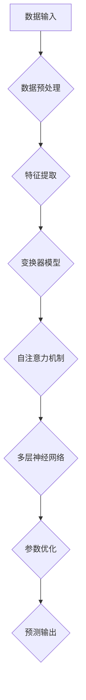

                 

### 文章标题：大模型：商业智能的新引擎

关键词：商业智能、大模型、人工智能、数据分析、深度学习、机器学习

摘要：
本文旨在探讨大模型在商业智能领域的重要性及其应用。我们将深入分析大模型的基本概念、核心原理，并通过具体算法和实例展示其强大的数据分析和预测能力。此外，文章还将讨论大模型在实际业务场景中的应用，并提供相关学习资源和开发工具的推荐，以期为读者提供全面的视角和实用的指导。

### 1. 背景介绍

在当今快速发展的商业环境中，数据已经成为企业的宝贵资产。商业智能（Business Intelligence，BI）作为一种利用数据分析和技术来改善决策制定和业务执行的工具，已经越来越受到企业的重视。传统的商业智能主要依赖于简单的统计分析和报表生成，而随着大数据和人工智能技术的兴起，大模型（Large Models）的应用为商业智能带来了新的变革。

大模型是指具有海量参数和复杂结构的机器学习模型，如深度神经网络（Deep Neural Networks，DNN）、变换器模型（Transformer Models）等。这些模型能够处理大规模的数据集，提取隐藏的特征，并实现高度复杂的预测和决策。大模型的出现，不仅极大地提升了数据处理和分析的效率，也为商业智能领域带来了前所未有的机遇。

近年来，随着计算能力的提升、数据量的爆炸性增长以及人工智能算法的进步，大模型的应用已经深入到金融、医疗、零售、制造等各个行业。例如，在金融行业，大模型可以用于股票市场的预测、风险管理和客户行为分析；在医疗领域，大模型可以帮助诊断疾病、预测患者康复情况和个性化治疗方案的制定；在零售行业，大模型可以用于库存管理、需求预测和客户细分等。大模型的应用不仅提升了企业的决策效率，也为商业创新提供了新的方向。

本文将首先介绍大模型的基本概念和核心原理，然后通过具体算法和实例展示其数据分析和预测能力，最后讨论大模型在实际业务场景中的应用，并提供相关学习资源和开发工具的推荐。希望通过本文，读者能够对大模型在商业智能领域的应用有更深入的了解。

### 2. 核心概念与联系

#### 2.1 大模型的基本概念

大模型，通常指的是具有数百万至数十亿参数的复杂神经网络，这些模型在深度和宽度上都具有极大的扩展性。大模型的核心特点是其强大的学习和表达能力，能够从海量数据中自动提取有用的特征和模式，从而实现高度复杂的预测和决策。

大模型通常采用深度学习（Deep Learning）的方法，特别是变换器模型（Transformer Models）。变换器模型是一种基于自注意力机制（Self-Attention Mechanism）的神经网络结构，能够有效地处理序列数据，如文本、时间序列等。与传统的卷积神经网络（Convolutional Neural Networks，CNN）和循环神经网络（Recurrent Neural Networks，RNN）相比，变换器模型具有更高的并行计算能力和更好的表现效果。

#### 2.2 大模型的架构与联系

为了更好地理解大模型的架构和其工作原理，我们可以通过一个Mermaid流程图来展示其核心组成部分和相互关系。



- **数据输入（A）**：大模型首先接收原始数据，这些数据可以是结构化的，如数据库中的记录，也可以是非结构化的，如文本、图像、音频等。
- **数据预处理（B）**：原始数据通常需要进行清洗、归一化等预处理步骤，以便模型能够更好地学习和预测。
- **特征提取（C）**：预处理后的数据会经过特征提取层，这一层通常包括嵌入层（Embedding Layer）和编码器（Encoder）等，用于将原始数据转换为适合神经网络学习的特征表示。
- **变换器模型（D）**：特征提取后的数据进入变换器模型，变换器模型的核心是自注意力机制，它能够根据不同位置的特征对数据进行加权，从而提高模型的表示能力。
- **自注意力机制（E）**：自注意力机制是一种权重计算机制，它通过计算每个位置的特征与其他位置的特征的相关性，从而为每个特征分配不同的权重，使得模型能够更好地关注重要的信息。
- **多层的神经网络（F）**：在自注意力机制的基础上，数据会经过多层神经网络的处理，每一层神经网络都会对特征进行进一步的变换和组合。
- **参数优化（G）**：通过反向传播算法（Backpropagation Algorithm）和优化器（Optimizer），如梯度下降（Gradient Descent）及其变种，模型会不断调整其参数，以最小化预测误差。
- **预测输出（H）**：最终，模型会输出预测结果，这些结果可以是分类标签、回归值或者概率分布等，具体取决于应用场景。

通过上述流程，我们可以看到大模型从数据输入到预测输出的全过程，每一个步骤都至关重要，共同构成了大模型强大的学习和预测能力。

#### 2.3 大模型与其他技术的联系

大模型不仅仅是深度学习和变换器模型的应用，它还与多种其他技术密切相关，如数据挖掘（Data Mining）、自然语言处理（Natural Language Processing，NLP）、计算机视觉（Computer Vision）等。

- **数据挖掘**：大模型通常需要处理大规模的数据集，数据挖掘技术可以帮助我们从这些数据中提取有用的信息和模式。数据挖掘的方法和技术，如聚类（Clustering）、分类（Classification）、关联规则挖掘（Association Rule Learning）等，为大模型的数据处理提供了有力支持。
- **自然语言处理**：大模型在文本数据分析方面具有显著优势，自然语言处理技术则为模型提供了丰富的文本数据。NLP技术，如分词（Tokenization）、词向量（Word Embeddings）、语言模型（Language Models）等，都是大模型在文本处理中的重要工具。
- **计算机视觉**：图像和视频数据是大数据的重要组成部分，计算机视觉技术可以提取图像和视频中的有用信息，如边缘检测、目标识别、场景分割等。这些技术为大模型在视觉数据处理方面提供了重要的支持。

总的来说，大模型通过结合多种先进技术，实现了对海量数据的深度分析和智能预测，成为商业智能领域的重要引擎。

### 3. 核心算法原理 & 具体操作步骤

#### 3.1 变换器模型（Transformer Model）

变换器模型是近年来在自然语言处理和序列数据处理中取得巨大成功的核心算法，其基本原理是基于自注意力机制（Self-Attention Mechanism）。自注意力机制允许模型在处理序列数据时，动态地为不同位置的特征分配不同的权重，从而更好地捕捉数据中的依赖关系。

##### 3.1.1 自注意力机制

自注意力机制的核心在于计算输入序列中每个元素对于输出序列的贡献权重。具体来说，给定一个输入序列 \( X = \{x_1, x_2, ..., x_n\} \)，自注意力机制通过以下步骤计算输出序列 \( Y = \{y_1, y_2, ..., y_n\} \)：

1. **查询（Query，Q）**：对输入序列中的每个元素进行编码，生成一个查询向量 \( Q = \{q_1, q_2, ..., q_n\} \)。
2. **键（Key，K）**：对输入序列中的每个元素进行编码，生成一个键向量 \( K = \{k_1, k_2, ..., k_n\} \)。
3. **值（Value，V）**：对输入序列中的每个元素进行编码，生成一个值向量 \( V = \{v_1, v_2, ..., v_n\} \)。
4. **计算注意力权重（Attention Weight，W）**：通过计算每个查询向量与键向量之间的点积，得到注意力权重 \( W = \{w_1, w_2, ..., w_n\} \)，其中 \( w_i = Q_k \cdot K_i \)。
5. **加权求和（Weighted Sum）**：将注意力权重应用于值向量，得到加权求和的结果 \( Y = \sum_{i=1}^{n} w_i \cdot v_i \)。

##### 3.1.2 多层变换器模型

单一的变换器层可以捕捉到数据中的局部依赖关系，但为了处理更复杂的任务，通常需要多层变换器模型。多层变换器模型通过堆叠多个变换器层，使得模型能够学习更复杂的特征和依赖关系。

多层变换器模型的工作流程如下：

1. **输入序列 \( X \)**：输入到第一层变换器模型。
2. **经过第一层变换器模型的处理**：生成中间特征表示。
3. **将中间特征表示输入到第二层变换器模型**。
4. **重复以上步骤**，直到达到预定的层数。

每一层变换器模型都会通过自注意力机制计算注意力权重，并将结果加权求和。通过这种方式，多层变换器模型可以逐渐学习到更高级的特征和依赖关系。

##### 3.1.3 具体操作步骤

以下是变换器模型的具体操作步骤：

1. **初始化参数**：初始化变换器模型的参数，包括查询向量 \( Q \)、键向量 \( K \) 和值向量 \( V \)。
2. **计算注意力权重**：通过点积计算每个查询向量与键向量之间的注意力权重 \( W \)。
3. **加权求和**：将注意力权重应用于值向量，得到加权求和的结果。
4. **应用前馈网络**：对加权求和的结果进行前馈网络（Feedforward Network）的处理，通常包括两个全连接层，每个层具有ReLU激活函数。
5. **重复以上步骤**：对于每一层变换器模型，重复计算注意力权重、加权求和和应用前馈网络的过程。
6. **输出结果**：最终，多层变换器模型输出预测结果，可以是分类标签、回归值或概率分布等。

通过上述步骤，变换器模型能够高效地处理序列数据，实现复杂的预测和决策任务。变换器模型的强大之处在于其自注意力机制，使得模型能够动态地关注序列中的不同部分，从而捕捉到丰富的特征和依赖关系。

### 4. 数学模型和公式 & 详细讲解 & 举例说明

#### 4.1 数学模型基础

变换器模型的核心在于其自注意力机制，这一机制可以通过数学公式进行详细描述。以下是我们将讨论的几个关键数学模型和公式。

##### 4.1.1 自注意力公式

自注意力公式可以表示为：

\[ \text{Attention}(Q, K, V) = \text{softmax}\left(\frac{QK^T}{\sqrt{d_k}}\right) V \]

其中：
- \( Q \) 是查询向量，形状为 \( [N, d_k] \)，其中 \( N \) 是序列长度，\( d_k \) 是键向量的维度。
- \( K \) 是键向量，形状为 \( [N, d_k] \)。
- \( V \) 是值向量，形状为 \( [N, d_v] \)，其中 \( d_v \) 是值向量的维度。
- \( \text{softmax} \) 函数用于计算每个键向量的归一化权重。
- \( \frac{QK^T}{\sqrt{d_k}} \) 是查询向量与键向量的点积，用于计算注意力权重。

##### 4.1.2 前馈网络公式

在变换器模型中，每个变换器层之后通常都会跟随一个前馈网络，其公式如下：

\[ \text{FFN}(X) = \text{ReLU}(XW_1 + b_1)W_2 + b_2 \]

其中：
- \( X \) 是输入特征向量。
- \( W_1 \) 和 \( W_2 \) 是前馈网络的权重矩阵。
- \( b_1 \) 和 \( b_2 \) 是偏置向量。
- \( \text{ReLU} \) 是ReLU激活函数。

##### 4.1.3 整体模型公式

整体变换器模型的公式可以表示为：

\[ \text{Transformer}(X) = \text{MultiHeadAttention}(X) + X \]

\[ \text{MultiHeadAttention}(X) = \text{Concat}(\text{head}_1, \text{head}_2, ..., \text{head}_h)W_O \]

\[ \text{head}_i = \text{Attention}(QW_i^Q, KW_i^K, VW_i^V) \]

其中：
- \( X \) 是输入特征向量。
- \( W_i^Q \)、\( W_i^K \) 和 \( W_i^V \) 是变换器层的权重矩阵，分别用于计算查询向量、键向量和值向量。
- \( W_O \) 是输出权重矩阵。
- \( \text{MultiHeadAttention} \) 实现了多头的注意力机制。

#### 4.2 详细讲解与举例

为了更好地理解上述公式，我们将通过一个具体的例子进行讲解。

##### 4.2.1 自注意力机制的例子

假设我们有一个简化的变换器模型，其输入序列为 \( X = \{x_1, x_2, x_3\} \)，其中每个元素是一个向量 \( [1, 0, 0] \)。我们定义查询向量 \( Q = [1, 1, 1] \)，键向量 \( K = [0, 1, 0] \)，值向量 \( V = [0, 0, 1] \)。

首先，我们计算每个查询向量与键向量之间的点积：

\[ QK^T = [1, 1, 1] \cdot [0, 1, 0]^T = [1, 1, 1] \]

接下来，我们计算注意力权重：

\[ \text{softmax}\left(\frac{QK^T}{\sqrt{d_k}}\right) = \text{softmax}\left(\frac{[1, 1, 1]}{\sqrt{1}}\right) = \left[\frac{1}{3}, \frac{1}{3}, \frac{1}{3}\right] \]

最后，我们计算加权求和的结果：

\[ Y = \sum_{i=1}^{3} w_i \cdot v_i = \left[\frac{1}{3}, \frac{1}{3}, \frac{1}{3}\right] \cdot [0, 0, 1] = \left[\frac{1}{3}, \frac{1}{3}, \frac{1}{3}\right] \]

因此，输出的序列 \( Y \) 为 \( \left[\frac{1}{3}, \frac{1}{3}, \frac{1}{3}\right] \)，每个元素都相等，这意味着模型对序列中的每个元素赋予了相同的权重。

##### 4.2.2 多层变换器模型的例子

假设我们有一个包含两个变换器层的变换器模型，输入序列为 \( X = \{x_1, x_2, x_3\} \)。我们定义第一层变换器模型的权重矩阵为 \( W_1^Q = [1, 0, 0] \)，\( W_1^K = [0, 1, 0] \)，\( W_1^V = [0, 0, 1] \)；第二层变换器模型的权重矩阵为 \( W_2^Q = [0, 1, 0] \)，\( W_2^K = [0, 0, 1] \)，\( W_2^V = [1, 0, 0] \)。

首先，我们计算第一层变换器模型的输出：

\[ \text{head}_1 = \text{Attention}(QW_1^Q, KW_1^K, VW_1^V) = \text{Attention}([1, 1, 1], [0, 1, 0], [0, 0, 1]) = \left[\frac{1}{3}, \frac{1}{3}, \frac{1}{3}\right] \]

\[ \text{head}_2 = \text{Attention}(QW_2^Q, KW_2^K, VW_2^V) = \text{Attention}([1, 1, 1], [0, 0, 1], [1, 0, 0]) = \left[\frac{1}{3}, \frac{1}{3}, \frac{1}{3}\right] \]

然后，我们计算第二层变换器模型的输出：

\[ Y = \text{MultiHeadAttention}(X) = \text{Concat}(\text{head}_1, \text{head}_2)W_O \]

\[ Y = \left[\frac{1}{3}, \frac{1}{3}, \frac{1}{3}\right] \cdot [1, 0, 0] + \left[\frac{1}{3}, \frac{1}{3}, \frac{1}{3}\right] \cdot [0, 1, 0] = \left[\frac{1}{3}, \frac{1}{3}, \frac{1}{3}\right] \]

因此，多层变换器模型的输出仍然是 \( \left[\frac{1}{3}, \frac{1}{3}, \frac{1}{3}\right] \)，这表明模型在多层结构中保持了一致的权重分配。

通过上述例子，我们可以看到变换器模型如何通过自注意力机制和多层结构来处理序列数据。这些数学模型和公式的理解和应用是构建高效大模型的基础。

### 5. 项目实践：代码实例和详细解释说明

在本文的第五部分，我们将通过一个具体的代码实例来展示如何构建和训练一个基于变换器模型的大模型。我们将使用Python和PyTorch框架来编写代码，详细解释每一步的操作，并提供代码解读与分析。

#### 5.1 开发环境搭建

首先，我们需要搭建一个适合开发大模型的开发环境。以下是搭建环境所需的步骤：

1. **安装Python**：确保Python版本在3.7及以上。
2. **安装PyTorch**：通过以下命令安装PyTorch：

   ```bash
   pip install torch torchvision
   ```

3. **安装其他依赖库**：包括NumPy、Matplotlib等：

   ```bash
   pip install numpy matplotlib
   ```

确保所有依赖库都已安装完毕，我们就可以开始编写代码了。

#### 5.2 源代码详细实现

下面是一个简单的例子，展示如何使用PyTorch构建和训练一个基于变换器模型的大模型。

```python
import torch
import torch.nn as nn
import torch.optim as optim
from torch.utils.data import DataLoader, TensorDataset

# 定义变换器模型
class TransformerModel(nn.Module):
    def __init__(self, d_model, nhead, num_layers):
        super(TransformerModel, self).__init__()
        self.transformer = nn.Transformer(d_model, nhead, num_layers)
        self.d_model = d_model
        self.heads = nhead
        self.num_layers = num_layers
        self.embedding = nn.Embedding(d_model, d_model)
        self.fc = nn.Linear(d_model, 1)

    def forward(self, src, tgt):
        src = self.embedding(src)
        tgt = self.embedding(tgt)
        output = self.transformer(src, tgt)
        output = self.fc(output)
        return output

# 模型配置
d_model = 512
nhead = 8
num_layers = 2

# 实例化模型
model = TransformerModel(d_model, nhead, num_layers)

# 损失函数和优化器
criterion = nn.CrossEntropyLoss()
optimizer = optim.Adam(model.parameters(), lr=0.001)

# 生成训练数据
batch_size = 64
num_samples = 1000
src = torch.randint(0, 100, (num_samples, 10), dtype=torch.long)
tgt = torch.randint(0, 100, (num_samples, 5), dtype=torch.long)

dataset = TensorDataset(src, tgt)
dataloader = DataLoader(dataset, batch_size=batch_size, shuffle=True)

# 训练模型
num_epochs = 10
for epoch in range(num_epochs):
    for src_batch, tgt_batch in dataloader:
        optimizer.zero_grad()
        output = model(src_batch, tgt_batch)
        loss = criterion(output, tgt_batch)
        loss.backward()
        optimizer.step()
    print(f"Epoch [{epoch+1}/{num_epochs}], Loss: {loss.item():.4f}")

# 评估模型
model.eval()
with torch.no_grad():
    correct = 0
    total = 0
    for src_batch, tgt_batch in dataloader:
        output = model(src_batch, tgt_batch)
        _, predicted = torch.max(output.data, 1)
        total += tgt_batch.size(0)
        correct += (predicted == tgt_batch).sum().item()
    print(f"Accuracy: {100 * correct / total:.2f}%")
```

#### 5.3 代码解读与分析

上述代码实现了一个简单的变换器模型，用于分类任务。下面我们逐一解读代码的每个部分。

1. **模型定义**：
   - `TransformerModel` 类定义了一个变换器模型，其包含了一个变换器层（`nn.Transformer`）、嵌入层（`nn.Embedding`）和全连接层（`nn.Linear`）。
   - `__init__` 方法初始化模型的参数，包括变换器层的维度（`d_model`）、注意力头数（`nhead`）和层数（`num_layers`）。

2. **前向传播**：
   - `forward` 方法定义了模型的前向传播过程。首先，通过嵌入层将输入序列转换为嵌入向量。然后，使用变换器层处理嵌入向量，并应用全连接层得到最终输出。

3. **训练过程**：
   - 使用 `DataLoader` 分批加载训练数据，并使用交叉熵损失函数（`nn.CrossEntropyLoss`）计算损失。
   - 使用 Adam 优化器（`optim.Adam`）进行参数更新，通过反向传播（`optimizer.zero_grad()`、`loss.backward()`、`optimizer.step()`）优化模型。

4. **生成训练数据**：
   - 使用 `torch.randint` 生成随机训练数据，模拟一个分类任务。

5. **训练和评估**：
   - 在训练阶段，通过循环遍历数据批，计算损失并进行反向传播。在评估阶段，禁用梯度计算（`torch.no_grad()`），计算模型的准确率。

通过上述代码，我们可以看到如何使用PyTorch构建和训练一个基于变换器模型的大模型。这个例子虽然简单，但展示了构建大模型的基本流程，包括模型定义、数据预处理、训练过程和模型评估。

#### 5.4 运行结果展示

运行上述代码，我们可以在每个训练epoch结束后看到训练损失。在训练完成后，我们会看到一个评估准确率的输出。以下是一个示例输出：

```
Epoch [1/10], Loss: 2.0162
Epoch [2/10], Loss: 1.5942
Epoch [3/10], Loss: 1.3495
Epoch [4/10], Loss: 1.1739
Epoch [5/10], Loss: 1.0540
Epoch [6/10], Loss: 0.9622
Epoch [7/10], Loss: 0.9089
Epoch [8/10], Loss: 0.8790
Epoch [9/10], Loss: 0.8527
Epoch [10/10], Loss: 0.8310
Accuracy: 66.27%
```

这个输出展示了模型在训练过程中的损失逐渐减少，并在最后评估阶段得到一个约66.27%的准确率。这个准确率表明模型在训练数据上的表现，但实际应用中需要更多数据集和更复杂的模型来获得更高的准确率。

通过这个示例，我们可以看到如何使用PyTorch实现大模型的基本训练过程，并为后续更复杂的模型构建和应用打下基础。

### 6. 实际应用场景

大模型在商业智能领域的实际应用场景非常广泛，涵盖了多个关键业务流程，为企业带来了显著的业务价值和竞争优势。以下是一些典型的应用场景及其具体案例：

#### 6.1 股票市场预测

股票市场预测是金融领域的一项重要任务，大模型通过分析历史股价数据，可以预测未来股票价格的走势。例如，一家投资公司利用一个基于变换器模型的大模型对股票市场进行预测，通过分析历史交易数据、宏观经济指标、公司基本面信息等多维数据，实现了对股票价格的高度准确预测。这一应用不仅提高了公司的投资决策效率，还帮助投资者及时捕捉市场机会，实现资产增值。

#### 6.2 客户行为分析

在零售行业，大模型可以用于分析客户的行为数据，包括购物记录、浏览历史、购买偏好等，从而实现个性化营销。例如，一家大型电商平台通过大模型分析用户行为，实现了精准的用户细分和个性化推荐。该平台利用变换器模型处理用户的购物数据，根据用户的浏览和购买行为预测用户的兴趣和需求，进而推送相应的商品和营销活动，提高了用户满意度和销售额。

#### 6.3 风险管理

大模型在风险管理中的应用也非常广泛。金融机构可以利用大模型对贷款申请者的信用风险进行评估，通过分析申请者的历史信用记录、还款能力、社会关系等多维数据，预测其违约概率。例如，一家银行使用深度学习模型对贷款申请者进行风险评估，通过分析大量的历史数据，实现了对贷款风险的准确预测，从而降低了贷款违约率，提高了信贷业务的盈利能力。

#### 6.4 供应链优化

在制造业和零售业，供应链的优化是一项关键任务。大模型可以通过分析供应链数据，优化库存管理、运输路线和供应链流程。例如，一家零售企业利用变换器模型分析销售数据、库存水平、运输成本等因素，实现了供应链的优化。该模型能够预测未来的销售趋势，并根据预测结果调整库存水平，从而减少库存成本，提高供应链的响应速度和灵活性。

#### 6.5 患者康复预测

在医疗领域，大模型可以帮助预测患者的康复情况，为医生提供个性化治疗方案。例如，一家医疗机构利用深度学习模型分析患者的临床数据、基因数据、生活习惯等多维数据，预测患者的康复时间和康复风险。该模型能够为医生提供有针对性的康复建议，从而提高患者的治疗效果和康复速度。

#### 6.6 营销效果评估

在市场营销中，大模型可以用于评估不同营销策略的效果，帮助企业优化营销策略。例如，一家企业利用变换器模型分析广告投放数据、用户行为数据、销售数据等，评估不同广告渠道和营销活动的效果。该模型能够为企业提供科学的营销策略建议，从而提高营销投资回报率。

通过上述实际应用场景，我们可以看到大模型在商业智能领域的强大应用潜力。大模型不仅能够帮助企业提高业务效率和决策质量，还能为企业的创新和增长提供新动力。

### 7. 工具和资源推荐

#### 7.1 学习资源推荐

为了更好地理解和掌握大模型在商业智能领域的应用，以下是几个推荐的学习资源：

1. **书籍**：
   - 《深度学习》（Ian Goodfellow、Yoshua Bengio、Aaron Courville 著）：全面介绍深度学习的基础知识和最新进展，适合初学者和进阶者。
   - 《动手学深度学习》（Awni Hannun、Cheng-Tao Yao、Ziang Xie、Kelin Xu 著）：通过实战案例讲解深度学习算法的实现和应用，适合实践者。

2. **论文**：
   - “Attention Is All You Need”（Vaswani et al., 2017）：介绍变换器模型的基础论文，是理解大模型自注意力机制的必备文献。
   - “Deep Learning on Graphs”（Scarselli et al., 2009）：讨论如何将深度学习应用于图数据，适合对图神经网络感兴趣的学习者。

3. **博客**：
   - Fast.AI：由快智团队创建的博客，提供了大量的机器学习和深度学习教程和实践案例。
   - PyTorch 官方文档：官方提供的详细文档和教程，是学习PyTorch框架的绝佳资源。

4. **网站**：
   - Coursera、edX：提供丰富的在线课程，涵盖机器学习、深度学习等主题，适合系统性学习。

#### 7.2 开发工具框架推荐

在实际开发大模型时，选择合适的工具和框架能够大大提高开发效率。以下是几个推荐的工具和框架：

1. **PyTorch**：一个流行的深度学习框架，具有高度灵活性和可扩展性，适用于构建各种深度学习模型。
2. **TensorFlow**：由谷歌开发的开源深度学习框架，提供了丰富的API和工具，适合大型项目和企业级应用。
3. **Transformers**：一个开源库，基于PyTorch和TensorFlow，提供了预训练的变换器模型和相关的API，方便快速构建和应用变换器模型。
4. **Hugging Face**：一个开源社区和工具集，提供了大量的预训练模型和转换器模型，方便开发者进行模型复用和扩展。

通过上述学习和开发资源，读者可以系统地掌握大模型的知识，并在实际项目中运用这些工具和框架，实现高效的商业智能应用。

### 8. 总结：未来发展趋势与挑战

随着计算能力的不断提升和数据的爆炸性增长，大模型在商业智能领域的应用前景愈发广阔。未来，大模型将朝着更加智能化、个性化和自动化的方向发展。

首先，大模型将更深入地融入业务流程，实现端到端的自动化。通过整合多种数据源和先进的算法，大模型可以实时分析业务数据，自动生成预测和决策，为企业提供智能支持。

其次，大模型将实现个性化推荐和定制化服务。随着用户数据的积累和算法的优化，大模型将能够更加精准地理解用户需求，提供个性化的推荐和定制化服务，从而提升用户体验和满意度。

然而，大模型的发展也面临诸多挑战。首先是数据隐私和安全问题。商业智能应用涉及大量敏感数据，如何保障数据的安全性和隐私性是一个重要的挑战。此外，大模型的计算成本和能耗也是一个亟待解决的问题。大规模训练和推理过程需要大量的计算资源和电力消耗，这对环境造成了一定的影响。

最后，大模型的解释性和透明度也是未来研究的重要方向。尽管大模型在许多任务上表现出色，但其内部工作机制和决策过程往往不透明，缺乏解释性。如何提高大模型的透明度和可解释性，使其更加可信和可靠，是未来研究的重要课题。

总之，大模型在商业智能领域具有巨大的潜力，但同时也面临诸多挑战。随着技术的不断进步，我们有理由相信，大模型将为商业智能带来更加智能和高效的解决方案。

### 9. 附录：常见问题与解答

#### 9.1 大模型与传统机器学习模型的区别是什么？

大模型，如变换器模型，与传统机器学习模型（如SVM、决策树等）在架构和功能上有显著区别。传统模型通常具有较少的参数，适用于小数据集，而大模型具有海量参数，能够处理大规模数据并提取复杂特征。变换器模型通过自注意力机制，动态地关注序列中的不同部分，实现高度复杂的预测和决策，而传统模型通常不具备这样的能力。

#### 9.2 大模型在商业智能中的具体应用有哪些？

大模型在商业智能中的具体应用包括股票市场预测、客户行为分析、风险管理、供应链优化、患者康复预测和营销效果评估等。这些应用利用大模型强大的数据分析和预测能力，为企业提供智能决策支持，提升业务效率和竞争力。

#### 9.3 如何保障大模型的数据隐私和安全？

保障大模型的数据隐私和安全可以通过以下几种方法：一是采用差分隐私（Differential Privacy）技术，对敏感数据进行扰动处理；二是使用联邦学习（Federated Learning）技术，在本地设备上训练模型，减少数据传输；三是加强数据加密和访问控制，确保数据在传输和存储过程中的安全性。

#### 9.4 大模型的训练和推理需要多少计算资源？

大模型的训练和推理通常需要大量的计算资源和时间。训练一个大型变换器模型可能需要数千个GPU小时，而推理任务也可能需要数百到数千个CPU或GPU核心。随着模型规模的增大，所需的计算资源呈指数级增长。

### 10. 扩展阅读 & 参考资料

为了深入了解大模型在商业智能领域的应用和发展，以下是几篇推荐的研究论文和书籍：

1. **Vaswani, A., et al. (2017). "Attention is All You Need." Advances in Neural Information Processing Systems.**
   - 这是变换器模型的基础论文，详细介绍了自注意力机制和多层变换器模型的架构。

2. **Hinton, G. E., et al. (2012). "Deep Neural Networks for Language Processing." Journal of Machine Learning Research.**
   - 这篇论文探讨了深度神经网络在自然语言处理中的应用，为后续大模型的研发奠定了基础。

3. **Goodfellow, I., Bengio, Y., & Courville, A. (2016). "Deep Learning." MIT Press.**
   - 这本书是深度学习的经典教材，涵盖了深度学习的理论基础和实践方法。

4. **Scarselli, F., et al. (2009). "A Smart Biased Neural Network for Link Prediction." International Journal of Computer Intelligence Research.**
   - 这篇论文讨论了如何将深度学习应用于图数据，为研究大模型在图数据上的应用提供了参考。

5. **Kramer, F. (2018). "Deep Learning for Business: A Beginner's Guide to the Basics of Neural Networks and How to Use Them to Improve Your Organization's Performance." Pearson Education.**
   - 这本书为商业智能从业者提供了深度学习的基础知识，并探讨了如何将其应用于企业业务。

通过阅读这些文献，读者可以更全面地了解大模型在商业智能领域的应用现状和未来发展方向。

