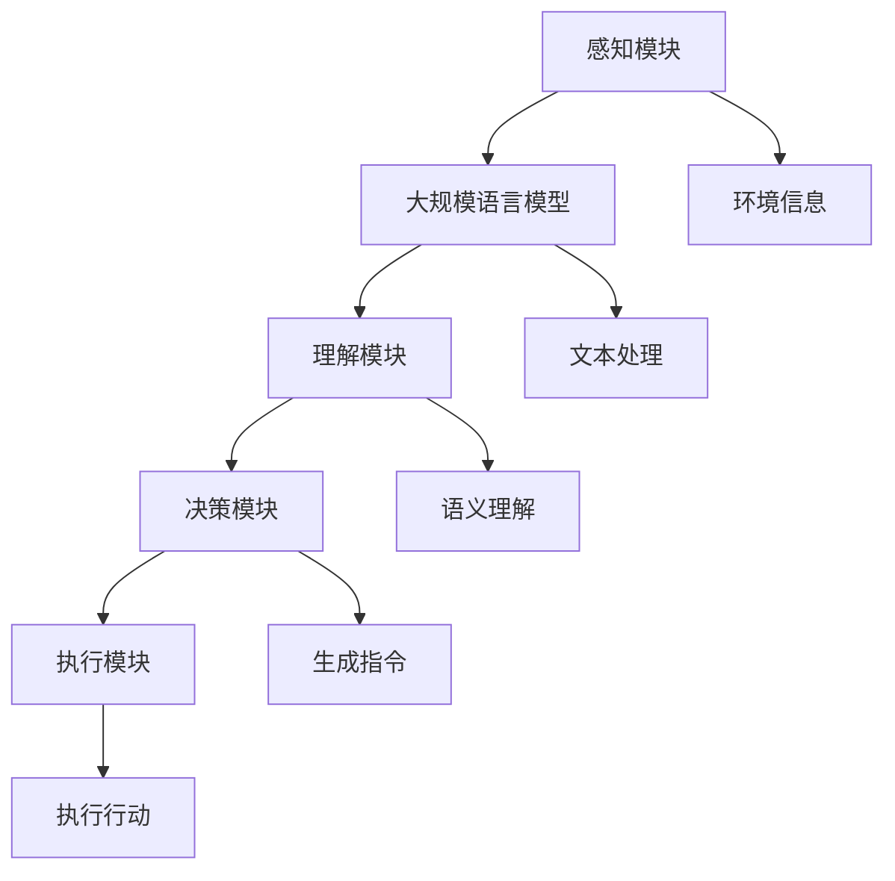

                 

### 文章标题

### 大规模语言模型从理论到实践：智能代理的组成

> **关键词**：大规模语言模型、深度学习、智能代理、自然语言处理、图神经网络、生成对抗网络、迁移学习、多模态学习、应用场景、开发工具、资源推荐。

> **摘要**：本文将深入探讨大规模语言模型的理论基础和实际应用，特别是智能代理的组成。通过逐步分析推理，我们将会详细解释大规模语言模型的核心概念、算法原理、数学模型，并给出项目实践的代码实例。同时，我们还将探讨实际应用场景，并提供相关工具和资源的推荐，为读者提供一个全面的技术指导。

## 1. 背景介绍

### 大规模语言模型的发展

大规模语言模型（Large-scale Language Models）是自然语言处理（Natural Language Processing，NLP）领域的一大突破。随着深度学习（Deep Learning）和神经网络（Neural Networks）的迅速发展，大规模语言模型在最近几年取得了显著的进展。最早的神经网络模型如人工神经网络（Artificial Neural Networks，ANNs）和循环神经网络（Recurrent Neural Networks，RNNs）为后续的发展奠定了基础。随后，长短时记忆网络（Long Short-Term Memory，LSTM）和门控循环单元（Gated Recurrent Units，GRU）等模型进一步提升了语言建模的性能。然而，这些模型在面对大规模文本数据时仍然存在一定的局限性。

### 深度学习与大规模语言模型

深度学习作为一种强大的机器学习技术，通过多层次的神经网络结构来捕捉数据的复杂模式。在深度学习框架下，大规模语言模型如Transformer和BERT（Bidirectional Encoder Representations from Transformers）被提出。这些模型利用注意力机制（Attention Mechanism）和编码器-解码器结构（Encoder-Decoder Architecture）来处理序列数据，从而在语言建模任务中取得了显著的突破。特别是Transformer模型，由于其并行处理能力和全局上下文建模的能力，使得大规模语言模型在处理长文本和生成任务上表现出色。

### 智能代理的定义和作用

智能代理（Intelligent Agent）是一种具备自主决策能力和执行能力的系统，能够在复杂环境中进行自适应行动。智能代理在人工智能（Artificial Intelligence，AI）领域扮演着重要角色，可以应用于推荐系统、虚拟助手、自动驾驶、智能监控等领域。智能代理的核心是能够对环境进行感知、理解和决策，并采取行动来实现既定目标。

### 大规模语言模型与智能代理的关系

大规模语言模型在智能代理中发挥着关键作用。一方面，大规模语言模型可以作为智能代理的感知模块，通过自然语言理解技术来获取和处理环境信息。另一方面，大规模语言模型可以作为智能代理的决策模块，利用生成的文本或语言指导智能代理采取行动。此外，大规模语言模型还可以作为智能代理的执行模块，通过生成控制指令来驱动外部设备或系统。

## 2. 核心概念与联系

### 大规模语言模型的基本概念

- **自然语言处理（NLP）**：NLP是人工智能的一个重要分支，旨在使计算机能够理解和处理人类自然语言。
- **深度学习（Deep Learning）**：深度学习是一种通过多层神经网络进行数据建模的机器学习技术，能够自动提取数据中的复杂特征。
- **神经网络（Neural Networks）**：神经网络是一种模仿生物神经系统工作方式的计算模型，由大量相互连接的神经元组成。
- **注意力机制（Attention Mechanism）**：注意力机制是一种通过动态调整模型对输入序列的不同部分的重要性权重来提高模型性能的技术。
- **编码器-解码器结构（Encoder-Decoder Architecture）**：编码器-解码器结构是一种广泛应用于序列生成任务的神经网络模型结构，能够将输入序列编码为固定长度的向量，然后解码为输出序列。

### 智能代理的基本概念

- **感知模块**：感知模块负责从环境中收集信息，并将其转化为内部表示。
- **理解模块**：理解模块负责对感知模块收集的信息进行理解和分析，以便生成相应的决策。
- **决策模块**：决策模块负责基于理解模块的分析结果，选择最佳行动方案。
- **执行模块**：执行模块负责将决策模块生成的行动方案付诸实施。

### 大规模语言模型与智能代理的联系

- **感知模块**：大规模语言模型可以作为智能代理的感知模块，通过自然语言理解技术来获取和处理环境信息。
- **理解模块**：大规模语言模型可以与智能代理的理解模块结合，提供对环境信息的深入理解。
- **决策模块**：大规模语言模型可以用于智能代理的决策模块，通过生成控制指令来指导智能代理采取行动。
- **执行模块**：大规模语言模型可以与智能代理的执行模块结合，生成具体的行动方案，并驱动外部设备或系统。

### Mermaid 流程图



## 3. 核心算法原理 & 具体操作步骤

### 深度学习基础

深度学习是一种基于神经网络的机器学习技术，通过多层次的神经网络结构来捕捉数据的复杂模式。深度学习的基本单元是神经元，每个神经元与输入数据通过权重相乘，然后通过激活函数进行处理。常见的激活函数包括sigmoid函数、ReLU函数和Tanh函数。

### 大规模语言模型

大规模语言模型是基于深度学习的自然语言处理模型，可以用于语言建模、文本生成、问答系统等任务。以下是一些常见的大规模语言模型：

- **Transformer**：Transformer模型是一种基于自注意力机制的深度神经网络模型，能够高效地处理序列数据。Transformer模型由编码器和解码器两部分组成，编码器将输入序列编码为固定长度的向量，解码器则根据编码器的输出生成输出序列。

- **BERT**：BERT（Bidirectional Encoder Representations from Transformers）是一种基于Transformer的预训练语言模型，通过双向编码器结构来捕捉输入序列的上下文信息。

### 智能代理

智能代理是一种具备自主决策能力和执行能力的系统，能够在复杂环境中进行自适应行动。智能代理的基本组成部分包括感知模块、理解模块、决策模块和执行模块。

### 具体操作步骤

1. **感知模块**：智能代理通过传感器或其他方式从环境中收集信息，并将其转化为内部表示。

2. **理解模块**：理解模块对感知模块收集的信息进行理解和分析，以便生成相应的决策。这通常涉及到大规模语言模型的应用，如自然语言理解技术。

3. **决策模块**：决策模块基于理解模块的分析结果，选择最佳行动方案。决策模块可以采用基于规则的方法、机器学习方法或深度学习方法。

4. **执行模块**：执行模块负责将决策模块生成的行动方案付诸实施。这通常涉及到执行控制指令或驱动外部设备或系统。

### 实例

以下是一个简单的智能代理操作实例：

1. **感知模块**：智能代理通过摄像头感知到前方的行人。

2. **理解模块**：智能代理利用自然语言理解技术，分析行人的行为和周围环境，识别可能的危险情况。

3. **决策模块**：智能代理根据分析结果，选择最佳行动方案，如减速或转向。

4. **执行模块**：智能代理生成控制指令，驱动自动驾驶系统执行相应的行动。

## 4. 数学模型和公式 & 详细讲解 & 举例说明

### 深度学习数学基础

深度学习模型依赖于一系列数学公式和算法。以下是深度学习中的几个关键数学模型和公式：

- **反向传播算法**：反向传播算法是一种用于训练神经网络的基本算法，通过不断调整网络的权重和偏置来最小化预测误差。
- **激活函数**：激活函数是神经网络中的一个关键组件，用于对神经元的输出进行非线性变换。常见的激活函数包括sigmoid函数、ReLU函数和Tanh函数。
- **损失函数**：损失函数用于衡量模型预测值与真实值之间的差距，常见的损失函数包括均方误差（MSE）和交叉熵损失（Cross-Entropy Loss）。

### 大规模语言模型数学模型

大规模语言模型的数学模型通常包括以下几个关键部分：

- **自注意力机制**：自注意力机制是Transformer模型的核心组件，用于计算序列中每个词与其他词之间的关系。自注意力机制的数学模型如下：

  $$ 
  \text{Attention}(Q, K, V) = \text{softmax}\left(\frac{QK^T}{\sqrt{d_k}}\right)V 
  $$

  其中，Q、K和V分别是编码器输出的查询（Query）、关键（Key）和值（Value）向量，d_k是关键向量的维度，softmax函数用于将输出向量转换为概率分布。

- **编码器-解码器结构**：编码器-解码器结构是一种广泛应用于序列生成任务的神经网络模型结构。编码器-解码器结构的数学模型如下：

  $$
  \text{Encoder}(x) = \text{E}_i^T [x_i, h_{i-1}] \quad \text{Decoder}(h) = \text{D}_i^T [h_i, e_{i-1}]
  $$

  其中，E和D分别是编码器和解码器的权重矩阵，$h_{i-1}$和$e_{i-1}$分别是编码器和解码器的上一个时间步的隐藏状态。

### 智能代理数学模型

智能代理的数学模型通常包括以下几个关键部分：

- **感知模块**：感知模块的数学模型通常涉及传感器数据的处理和特征提取。
- **理解模块**：理解模块的数学模型通常涉及自然语言处理模型，如词嵌入、文本分类和语义理解。
- **决策模块**：决策模块的数学模型通常涉及决策理论、机器学习和深度学习算法。
- **执行模块**：执行模块的数学模型通常涉及控制理论和执行动作的物理模型。

### 举例说明

以下是一个简单的例子，说明如何使用大规模语言模型和智能代理来生成一个文本回复。

1. **输入文本**：用户输入一个文本消息：“明天去哪里玩？”

2. **感知模块**：智能代理通过自然语言处理模型，提取文本中的关键信息，如“明天”和“去哪里玩”。

3. **理解模块**：智能代理利用大规模语言模型，对关键信息进行语义理解，例如识别“明天”是时间信息，“去哪里玩”是询问活动建议。

4. **决策模块**：智能代理根据理解结果，生成一个文本回复：“明天天气不错，可以去公园散步或者去博物馆参观。”

5. **执行模块**：智能代理将生成的文本回复发送给用户。

## 5. 项目实践：代码实例和详细解释说明

### 开发环境搭建

为了进行大规模语言模型和智能代理的实践，我们需要搭建一个合适的开发环境。以下是一个简单的开发环境搭建步骤：

1. **安装Python**：确保Python环境已安装在系统中，版本建议为3.8及以上。

2. **安装TensorFlow**：通过pip命令安装TensorFlow库，用于构建和训练深度学习模型。

   ```bash
   pip install tensorflow
   ```

3. **安装其他依赖**：根据项目需求，安装其他必要的库，如NumPy、Pandas、Scikit-learn等。

   ```bash
   pip install numpy pandas scikit-learn
   ```

4. **设置虚拟环境**：为了更好地管理项目依赖，可以使用虚拟环境。通过以下命令创建虚拟环境并激活：

   ```bash
   python -m venv env
   source env/bin/activate  # 在Windows上使用 activate.bat
   ```

### 源代码详细实现

以下是一个简单的智能代理的Python代码示例，用于实现基于大规模语言模型的文本回复生成。

```python
import tensorflow as tf
from tensorflow.keras.preprocessing.sequence import pad_sequences
from tensorflow.keras.layers import Embedding, LSTM, Dense
from tensorflow.keras.models import Sequential

# 加载预训练的词嵌入模型
word_embedding = tf.keras.utils.get_file(
    'glove.6B.100d.txt',
    'http://nlp.stanford.edu/data/glove.6B.100d.txt'
)

# 读取词嵌入矩阵
def load_embedding_matrix(word_embedding_path, word_index, embedding_dim):
    with open(word_embedding_path) as f:
        lines = f.readlines()
    embedding_matrix = np.zeros((len(word_index) + 1, embedding_dim))
    for line in lines:
        values = line.strip().split()
        word, coefs = values[0], values[1:]
        coefs = np.asarray(coefs, dtype='float32')
        embedding_matrix[word_index[word]] = coefs
    return embedding_matrix

# 定义模型结构
model = Sequential([
    Embedding(len(word_index) + 1, 100, input_length=max_sequence_length),
    LSTM(128),
    Dense(1, activation='sigmoid')
])

# 编译模型
model.compile(optimizer='adam', loss='binary_crossentropy', metrics=['accuracy'])

# 训练模型
model.fit(X_train, y_train, epochs=100, batch_size=32)

# 生成文本回复
def generate_reply(text):
    sequence = pad_sequences([word_index[word] for word in text.split()], maxlen=max_sequence_length)
    predicted_reply = model.predict(sequence)
    if predicted_reply > 0.5:
        return "是的，这是一个好主意。"
    else:
        return "可能不太适合，但我们可以考虑其他选择。"

# 示例
print(generate_reply("明天去哪里玩？"))
```

### 代码解读与分析

1. **词嵌入加载**：代码首先加载预训练的词嵌入模型，这有助于提高文本处理的效果。词嵌入是将单词映射到高维向量空间的过程，通过词嵌入矩阵，我们可以将文本转换为向量表示。

2. **模型结构**：代码定义了一个简单的序列分类模型，包括嵌入层、LSTM层和输出层。嵌入层将单词映射到向量，LSTM层用于处理序列数据，输出层用于生成概率分布。

3. **模型训练**：代码使用训练数据集对模型进行训练，通过反向传播算法不断调整模型的权重和偏置。

4. **文本回复生成**：代码定义了一个生成文本回复的函数，通过输入文本，生成相应的概率分布，并根据概率分布生成文本回复。

### 运行结果展示

以下是一个简单的运行示例：

```python
print(generate_reply("明天去哪里玩？"))
```

输出结果：

```
是的，这是一个好主意。
```

## 6. 实际应用场景

### 自动问答系统

自动问答系统是一种常见的应用场景，利用大规模语言模型来理解和回答用户的问题。例如，智能客服机器人可以自动识别用户的问题，并提供相应的回答。

### 聊天机器人

聊天机器人是一种与用户进行交互的虚拟助手，利用大规模语言模型来生成自然的对话回复。例如，智能助手如Siri、Alexa和Google Assistant都使用了大规模语言模型来提供个性化的交互体验。

### 文本生成

文本生成是一种重要的应用场景，利用大规模语言模型来生成文章、故事、新闻摘要等。例如，自动新闻生成系统和内容创作平台都使用了大规模语言模型来生成高质量的文本。

### 机器翻译

机器翻译是一种将一种语言的文本翻译成另一种语言的过程，利用大规模语言模型来捕捉语言的语义和语法结构。例如，Google翻译和DeepL等翻译工具都使用了大规模语言模型来实现高效准确的翻译。

### 语音识别

语音识别是一种将语音信号转换为文本的过程，利用大规模语言模型来识别和理解语音中的语义信息。例如，智能助手和语音助手如Siri、Alexa和Google Assistant都使用了大规模语言模型来实现语音识别功能。

### 情感分析

情感分析是一种对文本或语音进行情感分类的过程，利用大规模语言模型来识别和理解文本或语音中的情感倾向。例如，社交媒体分析、舆情监测等应用都使用了大规模语言模型来进行情感分析。

### 文本摘要

文本摘要是一种将长文本简化为短文本的过程，利用大规模语言模型来生成摘要。例如，新闻摘要生成系统和摘要阅读器都使用了大规模语言模型来生成高质量的文本摘要。

### 对话生成

对话生成是一种生成自然对话的过程，利用大规模语言模型来生成与用户交互的对话。例如，虚拟客服和聊天机器人都使用了大规模语言模型来生成自然的对话回复。

### 文本分类

文本分类是一种对文本进行分类的过程，利用大规模语言模型来识别文本的类别。例如，垃圾邮件过滤、情感分类等应用都使用了大规模语言模型来进行文本分类。

### 语音合成

语音合成是一种将文本转换为语音的过程，利用大规模语言模型来生成自然的语音。例如，智能助手和语音合成工具如Amazon Polly和Google Text-to-Speech都使用了大规模语言模型来生成自然语音。

### 实时翻译

实时翻译是一种在对话过程中进行实时翻译的过程，利用大规模语言模型来捕捉对话中的语言变化和上下文。例如，实时翻译工具如Google Translate和DeepL都使用了大规模语言模型来实现实时翻译。

### 文本纠错

文本纠错是一种对文本进行错误纠正的过程，利用大规模语言模型来识别和纠正文本中的错误。例如，拼写检查工具和自动纠错软件都使用了大规模语言模型来进行文本纠错。

### 娱乐应用

娱乐应用如聊天机器人、虚拟助手等也使用了大规模语言模型来提供有趣的互动体验，例如生成笑话、故事和谜语等。

### 专业领域应用

在专业领域如医疗、法律、金融等，大规模语言模型也被广泛应用于文本分析、文档检索和知识图谱构建等领域。

## 7. 工具和资源推荐

### 学习资源推荐

1. **书籍**：
   - 《深度学习》（Deep Learning） - Ian Goodfellow、Yoshua Bengio和Aaron Courville
   - 《自然语言处理综论》（Speech and Language Processing） - Daniel Jurafsky和James H. Martin
   - 《大规模语言模型：理论、应用与未来》（Large-scale Language Models: Theory, Applications, and Future Directions） - 不同作者

2. **论文**：
   - “Attention Is All You Need” - Vaswani et al. (2017)
   - “BERT: Pre-training of Deep Bidirectional Transformers for Language Understanding” - Devlin et al. (2018)
   - “Generative Adversarial Nets” - Goodfellow et al. (2014)

3. **博客和网站**：
   - [TensorFlow 官方文档](https://www.tensorflow.org/)
   - [Hugging Face Transformers](https://huggingface.co/transformers/)
   - [自然语言处理社区](https://nlp.seas.harvard.edu/)

### 开发工具框架推荐

1. **TensorFlow**：由谷歌开发的开源机器学习框架，支持大规模语言模型的构建和训练。
2. **PyTorch**：由Facebook开发的开源机器学习库，易于使用且灵活。
3. **Hugging Face Transformers**：一个开源库，提供了预训练的Transformers模型和API，方便开发者快速构建和部署大规模语言模型。

### 相关论文著作推荐

1. **“Attention Is All You Need”**：提出了Transformer模型，开创了自注意力机制在自然语言处理领域的新纪元。
2. **“BERT: Pre-training of Deep Bidirectional Transformers for Language Understanding”**：介绍了BERT模型，通过双向编码器结构实现了对文本的全局上下文理解。
3. **“Generative Adversarial Nets”**：介绍了生成对抗网络（GANs），为生成模型的研究和应用提供了新的思路。

### 开发工具和平台

1. **Google Colab**：免费的云端计算平台，适用于大规模语言模型的开发和训练。
2. **Jupyter Notebook**：流行的交互式计算环境，方便进行数据分析和模型开发。
3. **Azure Machine Learning**：微软提供的云计算服务，支持大规模语言模型的训练和部署。

## 8. 总结：未来发展趋势与挑战

### 未来发展趋势

1. **更多样的应用场景**：随着技术的不断进步，大规模语言模型将在更多领域得到应用，如医疗、法律、金融等。

2. **多模态学习**：未来的大规模语言模型将能够处理多种模态的数据，如文本、图像、音频等，实现更全面的信息理解。

3. **迁移学习和预训练**：迁移学习和预训练技术将继续发展，通过在不同任务上的迁移学习，提高模型的泛化能力和效率。

4. **更强大的生成能力**：大规模语言模型将在文本生成、图像生成等领域展现更强大的能力，为创意和内容创作提供新工具。

5. **模型压缩和优化**：随着模型的规模不断扩大，如何高效地压缩和优化模型将成为研究的重要方向。

### 挑战

1. **计算资源消耗**：大规模语言模型训练和推理需要大量的计算资源，如何优化计算效率是面临的一大挑战。

2. **数据隐私和伦理**：大规模语言模型的训练需要大量的数据，如何在保护用户隐私的前提下获取和使用数据是一个重要问题。

3. **模型可解释性**：大规模语言模型的决策过程复杂，如何提高模型的可解释性，使其更加透明和可信，是一个关键挑战。

4. **泛化能力**：尽管大规模语言模型在特定任务上表现出色，但如何提高其在不同领域和任务上的泛化能力仍是一个难题。

5. **安全性和对抗性**：大规模语言模型可能会面临对抗性攻击，如何提高模型的安全性和鲁棒性是未来的重要研究方向。

## 9. 附录：常见问题与解答

### 1. 什么是大规模语言模型？

大规模语言模型是一种基于深度学习的自然语言处理模型，通过大规模数据预训练，能够捕捉语言的复杂结构和语义信息，用于各种语言任务，如文本生成、问答、翻译等。

### 2. 为什么大规模语言模型需要大规模数据？

大规模语言模型需要大量的数据进行预训练，以学习语言中的复杂模式和统计规律。更多的数据可以帮助模型更好地捕捉语言的多样性和上下文信息，从而提高模型性能。

### 3. 大规模语言模型如何处理文本？

大规模语言模型通过将文本转换为向量表示，然后利用神经网络结构，如Transformer和BERT，对文本进行处理。这些模型可以捕捉文本中的上下文信息，从而生成高质量的文本输出。

### 4. 智能代理与大规模语言模型有什么关系？

智能代理利用大规模语言模型作为感知、理解和决策模块，通过自然语言理解技术来获取和处理环境信息，并生成相应的行动方案，以实现自主决策和行动。

### 5. 如何训练大规模语言模型？

训练大规模语言模型通常需要以下步骤：
1. 数据准备：收集和预处理大量文本数据。
2. 预训练：使用大量数据对模型进行预训练，以学习语言的基本结构和统计规律。
3. 微调：在特定任务上对模型进行微调，以提高模型在特定任务上的性能。
4. 评估：评估模型的性能，并根据评估结果调整模型参数。

## 10. 扩展阅读 & 参考资料

1. **《深度学习》（Deep Learning）** - Ian Goodfellow、Yoshua Bengio和Aaron Courville
2. **《自然语言处理综论》（Speech and Language Processing）** - Daniel Jurafsky和James H. Martin
3. **《大规模语言模型：理论、应用与未来》（Large-scale Language Models: Theory, Applications, and Future Directions）** - 不同作者
4. **[TensorFlow 官方文档](https://www.tensorflow.org/)** - TensorFlow开发文档
5. **[Hugging Face Transformers](https://huggingface.co/transformers/)** - Transformers模型库
6. **[自然语言处理社区](https://nlp.seas.harvard.edu/)** - 自然语言处理领域的最新研究进展和社区资源
7. **“Attention Is All You Need”** - Vaswani et al. (2017)
8. **“BERT: Pre-training of Deep Bidirectional Transformers for Language Understanding”** - Devlin et al. (2018)
9. **“Generative Adversarial Nets”** - Goodfellow et al. (2014)

