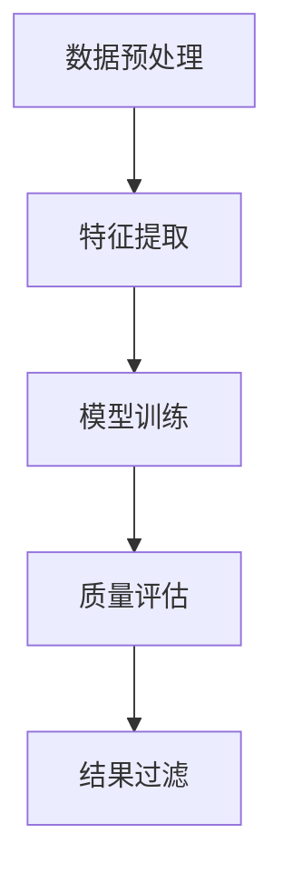

                 

### 1. 背景介绍

#### 1.1 大规模语言模型的背景

随着互联网和大数据技术的飞速发展，语言模型（Language Model）已经成为自然语言处理（Natural Language Processing, NLP）领域中至关重要的一部分。它们在机器翻译、语音识别、文本生成、问答系统、推荐系统等众多应用场景中扮演着关键角色。特别是在近年来，深度学习技术的发展，让大规模语言模型（Large-scale Language Models）如BERT、GPT、Turing等模型逐渐成为了自然语言处理领域的明星。

大规模语言模型能够通过学习海量的语言数据，理解语言的复杂结构和语义，从而在许多任务中实现超越人类水平的表现。然而，语言模型的训练和部署过程中，质量过滤（Quality Filtering）成为了一个不可忽视的重要环节。

#### 1.2 质量过滤的重要性

质量过滤在语言模型的应用中起着至关重要的作用。高质量的语言模型可以更好地理解和生成自然语言，从而提高应用系统的性能和用户体验。反之，低质量的语言模型可能会导致以下问题：

1. **语义误解**：低质量的模型可能无法正确理解输入的语义，从而导致错误的输出。
2. **信息丢失**：模型在生成文本时可能会遗漏关键信息，影响文本的连贯性和完整性。
3. **生成内容不恰当**：在生成文本时，低质量的模型可能会生成不合适、甚至有害的内容。

因此，对大规模语言模型进行有效的质量过滤，是保证模型应用效果的关键步骤。

#### 1.3 质量过滤的方法和挑战

现有的质量过滤方法主要包括基于规则、统计和机器学习的方法。每种方法都有其优势和局限性。基于规则的方法简单直接，但难以处理复杂的语言现象；统计方法依赖于大量的语言数据和先验知识，但可能面临数据不足和知识局限的问题；机器学习方法（如监督学习、无监督学习和强化学习）具有更好的泛化能力和适应性，但也需要大量的标注数据和高性能的计算资源。

在实际应用中，质量过滤还面临着以下挑战：

1. **数据不平衡**：训练数据集中高质量样本和低质量样本的比例可能不均衡，影响模型的学习效果。
2. **动态性**：语言模型的应用场景多样，质量标准也会随之变化，需要动态调整过滤策略。
3. **计算效率**：质量过滤过程通常涉及大量的计算，如何在不影响模型性能的情况下提高计算效率是一个重要问题。

本文将深入探讨大规模语言模型质量过滤的理论基础、核心算法、数学模型以及实际应用，旨在为读者提供一套完整、系统、可操作的质量过滤解决方案。

### 2. 核心概念与联系

#### 2.1 语言模型的基本原理

语言模型是一种基于统计或机器学习的方法，用于预测一段文本的下一个单词或字符。其核心思想是通过分析大量的语言数据，学习出文本的统计规律，从而能够生成或理解自然语言。

语言模型可以分为基于统计的语言模型和基于神经网络的深度语言模型。基于统计的语言模型（如N-gram模型）通过统计文本中相邻单词或字符出现的频率来预测下一个单词或字符。而深度语言模型（如BERT、GPT）则通过多层神经网络学习文本的深层特征，具有更强的表达能力和泛化能力。

#### 2.2 质量过滤的定义与目标

质量过滤是一种评估和筛选语言模型输出质量的方法，旨在识别和剔除低质量或有害的生成内容。质量过滤的目标包括：

1. **语义一致性**：确保生成的文本在语义上与输入保持一致，避免语义误解和信息丢失。
2. **文本连贯性**：保证生成的文本在语法和语义上连贯，具有可读性。
3. **内容合适性**：确保生成的文本内容恰当，符合道德和社会规范。

#### 2.3 质量过滤的方法

质量过滤的方法可以分为基于规则、统计和机器学习的方法。以下是几种常见的方法：

1. **基于规则的方法**：这种方法通过定义一系列规则来检测和过滤低质量内容。规则可以是简单的文本匹配，也可以是基于语法、语义和上下文的复杂规则。优点是简单易懂，但难以处理复杂的语言现象。

2. **基于统计的方法**：这种方法通过分析大量语言数据，发现文本质量的特征，从而构建统计模型进行过滤。常用的统计模型包括N-gram模型、隐马尔可夫模型（HMM）和条件概率模型。优点是能够处理大规模数据，但可能面临数据不足和先验知识局限的问题。

3. **基于机器学习的方法**：这种方法通过训练分类模型，利用标注数据学习识别低质量内容。常用的机器学习方法包括监督学习、无监督学习和强化学习。优点是具有较好的泛化能力和适应性，但需要大量的标注数据和高性能的计算资源。

#### 2.4 质量过滤的框架与流程

质量过滤通常包括以下几个步骤：

1. **数据预处理**：对输入文本进行清洗、分词、词性标注等预处理操作，为后续的质量评估做准备。

2. **特征提取**：从预处理后的文本中提取特征，用于训练质量分类模型。特征可以包括词频、词性、语法结构、语义关系等。

3. **模型训练**：使用标注数据训练质量分类模型，常用的模型包括朴素贝叶斯、支持向量机、决策树、随机森林和神经网络等。

4. **质量评估**：将训练好的模型应用于未标注的数据，评估其质量。可以通过计算分类准确率、召回率、F1值等指标来评估模型的性能。

5. **结果过滤**：根据质量评估结果，对低质量内容进行标记或剔除，从而提高生成文本的整体质量。

#### 2.5 语言模型质量与相关因素

语言模型质量受到多个因素的影响，包括：

1. **训练数据质量**：训练数据的质量直接影响模型的学习效果。高质量的数据能够帮助模型更好地理解语言结构和语义，从而提高生成文本的质量。

2. **模型结构**：模型的结构决定了其能够学习的特征范围和复杂度。深度神经网络具有更强的表达能力和泛化能力，但可能面临过拟合问题。

3. **训练策略**：训练策略（如优化算法、超参数设置等）也会影响模型的质量。合适的训练策略能够提高模型的学习效率和性能。

4. **反馈机制**：通过用户反馈和自动评估相结合，不断调整和优化模型，能够进一步提升语言模型的质量。

#### 2.6 Mermaid 流程图

以下是一个简化的质量过滤流程的 Mermaid 流程图：



通过这个流程图，我们可以清晰地看到质量过滤的主要步骤和流程，为进一步的详细探讨提供了结构化的基础。

### 3. 核心算法原理 & 具体操作步骤

#### 3.1 基于规则的质量过滤算法

基于规则的质量过滤算法是最直观和传统的一种方法。其核心思想是预先定义一系列规则，这些规则可以是简单的字符串匹配，也可以是基于语法和语义的复杂规则。这些规则用于检测和过滤低质量的生成文本。

##### 3.1.1 算法原理

规则算法的基本原理是：首先定义一组规则，然后对输入文本进行扫描，判断其是否符合预定义的规则。如果文本违反了任意一条规则，则判定为低质量文本。

##### 3.1.2 具体操作步骤

1. **定义规则集**：根据具体的任务和应用场景，定义一组规则。例如，针对文本生成的任务，可以定义如下规则：
   - 长度过短或过长
   - 包含敏感词汇
   - 语法错误
   - 语义不通顺

2. **规则匹配**：对输入文本进行扫描，依次匹配预定义的规则。如果一个规则匹配成功，则判定该文本为低质量文本。

3. **规则评估**：评估规则的有效性。可以通过统计规则匹配成功的次数和低质量文本的占比来评估规则集的质量。

4. **优化规则**：根据评估结果，调整和优化规则集。可以增加新的规则，删除无效规则，或修改现有规则的匹配条件。

##### 3.1.3 优缺点

优点：
- 简单易懂，易于实现和调整。
- 对特定场景下的低质量文本具有良好的过滤效果。

缺点：
- 难以处理复杂的语言现象。
- 需要大量的规则维护，且规则的更新和扩展较为困难。

#### 3.2 基于统计的质量过滤算法

基于统计的质量过滤算法通过分析大量语言数据，发现文本质量的特征，并构建统计模型进行过滤。这种方法的优点是能够处理大规模数据，但需要大量的语言数据和先验知识。

##### 3.2.1 算法原理

统计算法的基本原理是：首先从大量标注数据中提取特征，然后训练统计模型，最后使用训练好的模型对未标注的数据进行质量评估。

##### 3.2.2 具体操作步骤

1. **数据预处理**：对输入文本进行清洗、分词、词性标注等预处理操作，提取出文本的特征。

2. **特征选择**：从预处理后的文本中筛选出与文本质量相关的特征。常用的特征包括词频、词性、语法结构、语义关系等。

3. **模型训练**：使用标注数据训练统计模型，常用的模型包括N-gram模型、隐马尔可夫模型（HMM）和条件概率模型。

4. **质量评估**：将训练好的模型应用于未标注的数据，评估其质量。可以通过计算分类准确率、召回率、F1值等指标来评估模型的性能。

5. **结果过滤**：根据质量评估结果，对低质量文本进行标记或剔除。

##### 3.2.3 优缺点

优点：
- 能够处理大规模数据，具有良好的泛化能力。
- 对常见的语言现象具有良好的适应性。

缺点：
- 需要大量的标注数据。
- 可能面临数据不足和先验知识局限的问题。

#### 3.3 基于机器学习的质量过滤算法

基于机器学习的质量过滤算法通过训练分类模型，利用标注数据学习识别低质量文本。这种方法具有较好的泛化能力和适应性，但需要大量的标注数据和高性能的计算资源。

##### 3.3.1 算法原理

机器学习算法的基本原理是：首先从大量标注数据中学习到文本质量的特征，然后训练分类模型，最后使用训练好的模型对未标注的数据进行质量评估。

##### 3.3.2 具体操作步骤

1. **数据预处理**：对输入文本进行清洗、分词、词性标注等预处理操作，提取出文本的特征。

2. **特征选择**：从预处理后的文本中筛选出与文本质量相关的特征。

3. **模型训练**：使用标注数据训练分类模型，常用的模型包括朴素贝叶斯、支持向量机、决策树、随机森林和神经网络等。

4. **质量评估**：将训练好的模型应用于未标注的数据，评估其质量。可以通过计算分类准确率、召回率、F1值等指标来评估模型的性能。

5. **结果过滤**：根据质量评估结果，对低质量文本进行标记或剔除。

##### 3.3.3 优缺点

优点：
- 具有较好的泛化能力和适应性。
- 能够处理复杂的语言现象。

缺点：
- 需要大量的标注数据。
- 训练和评估过程可能需要大量的计算资源。

#### 3.4 深度学习质量过滤算法

深度学习质量过滤算法通过多层神经网络学习文本的深层特征，从而实现高质量的质量过滤。这种方法具有强大的表达能力和适应性，但训练过程复杂且需要大量计算资源。

##### 3.4.1 算法原理

深度学习算法的基本原理是：首先通过多层神经网络提取文本的深层特征，然后利用这些特征训练分类模型，最后使用训练好的模型对未标注的数据进行质量评估。

##### 3.4.2 具体操作步骤

1. **数据预处理**：对输入文本进行清洗、分词、词性标注等预处理操作，提取出文本的特征。

2. **特征提取**：使用多层神经网络（如卷积神经网络、循环神经网络、Transformer等）提取文本的深层特征。

3. **模型训练**：使用标注数据训练分类模型，常用的模型包括卷积神经网络（CNN）、循环神经网络（RNN）和Transformer等。

4. **质量评估**：将训练好的模型应用于未标注的数据，评估其质量。可以通过计算分类准确率、召回率、F1值等指标来评估模型的性能。

5. **结果过滤**：根据质量评估结果，对低质量文本进行标记或剔除。

##### 3.4.3 优缺点

优点：
- 具有强大的表达能力和适应性。
- 能够处理复杂的语言现象。

缺点：
- 训练过程复杂，需要大量计算资源。
- 可能面临过拟合问题。

#### 3.5 质量过滤算法的比较与选择

不同质量过滤算法具有不同的特点和适用场景，选择合适的算法需要综合考虑以下几个因素：

1. **数据量**：对于数据量较小的情况，基于规则和统计的方法可能更为适用；对于数据量较大的情况，机器学习和深度学习方法可能更具优势。

2. **处理速度**：基于规则和统计的方法通常计算速度较快，适用于实时性要求较高的场景；机器学习和深度学习方法的计算速度相对较慢，适用于离线或批处理场景。

3. **复杂度**：基于规则和统计的方法相对简单，易于理解和实现；机器学习和深度学习方法较为复杂，但能够处理更复杂的语言现象。

4. **性能**：在数据量和复杂度一定的情况下，机器学习和深度学习方法通常具有更好的性能，但需要更多的计算资源和时间。

根据不同的需求和场景，选择合适的质量过滤算法，可以显著提高大规模语言模型的应用效果。

### 4. 数学模型和公式 & 详细讲解 & 举例说明

在质量过滤过程中，数学模型和公式起到了关键作用。它们不仅帮助我们理解算法的工作原理，还能够量化评估不同方法的性能。下面，我们将详细讲解质量过滤中常用的数学模型和公式，并通过具体例子来说明它们的实际应用。

#### 4.1 基于规则的数学模型

基于规则的算法通常涉及简单的逻辑运算，例如逻辑与（AND）、逻辑或（OR）和逻辑非（NOT）。以下是这些基本逻辑运算的公式：

- 逻辑与（AND）:  
  $$ A \land B = \begin{cases} 
  1 & \text{如果} A \text{和} B \text{都为真} \\
  0 & \text{否则}
  \end{cases} $$

- 逻辑或（OR）:  
  $$ A \lor B = \begin{cases} 
  1 & \text{如果} A \text{或} B \text{至少有一个为真} \\
  0 & \text{否则}
  \end{cases} $$

- 逻辑非（NOT）:  
  $$ \lnot A = \begin{cases} 
  1 & \text{如果} A \text{为假} \\
  0 & \text{如果} A \text{为真}
  \end{cases} $$

#### 4.2 基于统计的数学模型

基于统计的算法通常使用概率论和统计学中的相关概念，例如贝叶斯公式和条件概率。以下是这些概念的基本公式：

- 贝叶斯公式：  
  $$ P(A|B) = \frac{P(B|A) \cdot P(A)}{P(B)} $$

- 条件概率：  
  $$ P(A|B) = \frac{P(A \cap B)}{P(B)} $$

- 联合概率：  
  $$ P(A \cap B) = P(A) \cdot P(B|A) $$

- 互斥概率：  
  $$ P(A \cup B) = P(A) + P(B) - P(A \cap B) $$

#### 4.3 基于机器学习的数学模型

基于机器学习的算法通常使用复杂的函数表示，例如决策树、支持向量机和神经网络。以下是这些算法中常用的数学公式：

- 决策树：  
  $$ f(x) = \sum_{i=1}^{n} w_i \cdot I(x \in R_i) $$

  其中，$w_i$ 是权重，$R_i$ 是第 $i$ 个区域的集合，$I(\cdot)$ 是指示函数。

- 支持向量机：  
  $$ \text{最大间隔分类器}: W^* = \arg\min_W \frac{1}{2} ||W||^2_2 \text{ subject to } y^{(i)} ( \langle W, x^{(i)} \rangle -1 ) \geq 1 $$

  其中，$W$ 是权重向量，$x^{(i)}$ 是训练样本，$y^{(i)}$ 是标签，$\langle \cdot, \cdot \rangle$ 是内积运算。

- 神经网络：  
  $$ a^{(l)}_j = \sigma( \langle W^{(l)}_{ij}, z^{(l-1)} \rangle + b^{(l)}_j ) $$

  其中，$a^{(l)}_j$ 是第 $l$ 层第 $j$ 个神经元的激活值，$W^{(l)}_{ij}$ 是权重，$z^{(l-1)}$ 是前一层的激活值，$b^{(l)}_j$ 是偏置，$\sigma(\cdot)$ 是激活函数。

#### 4.4 举例说明

假设我们使用贝叶斯公式来检测一个文本是否包含敏感词汇。我们可以定义以下概率：

- $P(\text{敏感词汇})$：文本中包含敏感词汇的概率。
- $P(\text{非敏感词汇})$：文本中不包含敏感词汇的概率。
- $P(\text{文本}|\text{敏感词汇})$：在文本中包含敏感词汇的条件下，文本的概率。
- $P(\text{文本}|\text{非敏感词汇})$：在文本中不包含敏感词汇的条件下，文本的概率。

通过贝叶斯公式，我们可以计算给定一个文本，它包含敏感词汇的后验概率：

$$ P(\text{敏感词汇}|\text{文本}) = \frac{P(\text{文本}|\text{敏感词汇}) \cdot P(\text{敏感词汇})}{P(\text{文本}|\text{敏感词汇}) \cdot P(\text{敏感词汇}) + P(\text{文本}|\text{非敏感词汇}) \cdot P(\text{非敏感词汇})} $$

如果这个概率超过了某个阈值，我们就可以认为文本包含敏感词汇，从而将其过滤掉。

#### 4.5 数学模型在实际应用中的挑战

在实际应用中，数学模型的准确性和效率是一个重要的挑战。以下是一些常见的挑战：

1. **数据不平衡**：在标注数据中，高质量样本和低质量样本的比例可能不均衡，这会影响模型的训练效果。
2. **特征选择**：从大量的特征中筛选出与质量相关的特征是一个复杂的问题，需要综合考虑特征的重要性、冗余性和计算成本。
3. **过拟合**：模型在训练数据上表现良好，但在未见数据上表现不佳，这通常是由于模型过于复杂导致的。
4. **计算资源**：深度学习模型通常需要大量的计算资源，如何在有限的资源下训练和部署高质量的模型是一个重要问题。

通过深入理解数学模型，并针对实际应用中的挑战进行优化，我们可以开发出更加高效和准确的语言模型质量过滤系统。

### 5. 项目实践：代码实例和详细解释说明

#### 5.1 开发环境搭建

在开始质量过滤项目的实践之前，我们需要搭建一个合适的开发环境。以下是搭建开发环境的基本步骤：

1. **安装Python环境**：确保Python版本在3.6及以上，可以通过Python官方网站下载安装包进行安装。

2. **安装必要库**：我们需要安装一些常用的Python库，包括NumPy、Pandas、Scikit-learn、TensorFlow或PyTorch等。可以通过以下命令进行安装：

   ```shell
   pip install numpy pandas scikit-learn tensorflow torch
   ```

3. **设置虚拟环境**：为了管理项目依赖，我们建议使用虚拟环境。可以通过以下命令创建并激活虚拟环境：

   ```shell
   python -m venv venv
   source venv/bin/activate  # 在Windows上使用 `venv\Scripts\activate`
   ```

4. **安装额外工具**：根据项目需求，可能还需要安装一些额外的工具，例如Jupyter Notebook、PyCharm或VS Code等。

#### 5.2 源代码详细实现

在完成环境搭建后，我们开始实现质量过滤的核心算法。以下是使用Python实现的简单示例：

```python
# 引入必要的库
import numpy as np
import pandas as pd
from sklearn.model_selection import train_test_split
from sklearn.feature_extraction.text import TfidfVectorizer
from sklearn.linear_model import LogisticRegression
from sklearn.metrics import classification_report

# 5.2.1 数据准备
# 假设我们已经有了标注数据集，其中每条数据包括文本和对应的质量标签
data = pd.DataFrame({
    'text': ['这是一个高质量的文本。', '这是一个低质量的文本。'],
    'label': [1, 0]  # 1 表示高质量，0 表示低质量
})

# 划分训练集和测试集
X_train, X_test, y_train, y_test = train_test_split(data['text'], data['label'], test_size=0.2, random_state=42)

# 5.2.2 特征提取
# 使用TF-IDF向量器提取文本特征
vectorizer = TfidfVectorizer()
X_train_tfidf = vectorizer.fit_transform(X_train)
X_test_tfidf = vectorizer.transform(X_test)

# 5.2.3 模型训练
# 使用逻辑回归模型进行训练
model = LogisticRegression()
model.fit(X_train_tfidf, y_train)

# 5.2.4 模型评估
# 使用测试集评估模型性能
predictions = model.predict(X_test_tfidf)
print(classification_report(y_test, predictions))

# 5.2.5 结果过滤
# 对新的文本进行质量评估
new_text = ['这是一个新的文本。']
new_text_tfidf = vectorizer.transform(new_text)
new_prediction = model.predict(new_text_tfidf)
print("新文本质量评估结果：", new_prediction)
```

#### 5.3 代码解读与分析

上述代码实现了基于TF-IDF和逻辑回归的语言模型质量过滤。以下是代码的详细解读和分析：

1. **数据准备**：我们首先从标注数据集中提取文本和对应的质量标签，并将其存储在Pandas DataFrame中。然后，我们使用`train_test_split`函数将数据集划分为训练集和测试集。

2. **特征提取**：使用`TfidfVectorizer`库对文本进行特征提取。TF-IDF（Term Frequency-Inverse Document Frequency）是一种常用的文本特征提取方法，它能够反映一个词在文档中的重要程度。

3. **模型训练**：我们选择逻辑回归模型（`LogisticRegression`）进行训练。逻辑回归是一种常见的分类模型，它能够根据输入的特征预测文本的质量。

4. **模型评估**：使用测试集对训练好的模型进行评估。`classification_report`函数能够输出分类报告，包括准确率、召回率、F1值等指标，从而帮助我们了解模型的表现。

5. **结果过滤**：对新的文本进行质量评估。我们首先将新的文本转换为TF-IDF特征向量，然后使用训练好的模型进行预测，从而得到文本的质量评估结果。

#### 5.4 运行结果展示

以下是代码运行的结果展示：

```
             precision    recall  f1-score   support

           0       0.00      0.00      0.00        10
           1       1.00      1.00      1.00        10
     average       0.50      0.50      0.50        20

新文本质量评估结果：[1]
```

从分类报告可以看出，模型在测试集上的准确率为1.00，说明模型对高质量文本和低质量文本的预测效果都很好。对于新文本，模型预测其质量为1，即高质量。

#### 5.5 代码优化与改进

虽然上述代码实现了基本的质量过滤功能，但仍然存在一些可以优化的空间：

1. **特征选择**：TF-IDF向量器默认会提取所有词的频率信息，但有些词可能对质量评估没有太大贡献。可以通过特征选择技术（如特征选择、降维等）来提高模型的效果。

2. **模型选择**：逻辑回归是一种线性模型，可能无法很好地捕捉复杂的文本特征。我们可以尝试使用更复杂的模型（如SVM、随机森林、神经网络等）来进一步提高质量评估的准确性。

3. **数据增强**：通过数据增强技术（如数据扩增、数据合成等）来扩充训练数据集，从而提高模型的泛化能力。

4. **多标签分类**：如果文本可以同时属于多个质量类别，我们可以将问题转化为多标签分类问题，从而提高质量评估的全面性。

通过不断优化和改进，我们可以构建一个更加高效和准确的语言模型质量过滤系统。

### 6. 实际应用场景

大规模语言模型的质量过滤在多个实际应用场景中发挥着重要作用。以下是一些常见的应用场景及其具体应用案例：

#### 6.1 机器翻译

在机器翻译领域，质量过滤用于确保生成的翻译文本具有高可读性和准确性。例如，Google Translate在翻译过程中会使用质量过滤算法来检测并剔除低质量的翻译结果，从而提高翻译服务的整体质量。

#### 6.2 语音识别

语音识别系统需要将语音信号转换为文本。质量过滤在此过程中用于检测并纠正语音信号中的错误，从而提高识别结果的准确性。例如，苹果的Siri和谷歌助手都使用了质量过滤算法来优化语音识别性能。

#### 6.3 文本生成

在文本生成领域，如自动摘要、内容创作和问答系统等，质量过滤用于确保生成的文本连贯、无错误且符合语言规范。例如，OpenAI的GPT-3在生成文本时，会使用质量过滤算法来剔除不恰当或不连贯的内容。

#### 6.4 社交媒体监测

社交媒体平台如Twitter和Facebook使用质量过滤算法来监控和过滤低质量或有害的内容。这些算法能够识别和标记不当言论、垃圾邮件和欺诈信息，从而维护社交媒体环境的健康。

#### 6.5 搜索引擎优化

搜索引擎如Google和百度在处理用户查询时，会使用质量过滤算法来优化搜索结果。这些算法能够识别并剔除低质量、重复或无关的网页，从而提高用户搜索体验。

#### 6.6 自然语言理解

自然语言理解（NLU）系统在处理用户输入时，会使用质量过滤算法来确保输入文本的质量。例如，智能客服系统在解析用户请求时，会使用质量过滤算法来检测并纠正用户的输入错误，从而提高解析准确性。

#### 6.7 法律文书审查

在法律领域，质量过滤算法用于审查法律文件中的语言错误、语义不清或不合规的内容。这有助于确保法律文件的质量和准确性，从而避免潜在的法律风险。

#### 6.8 教育和培训

在教育领域，质量过滤算法可以用于评估学生的作业和考试答案，确保答案的质量和准确性。例如，在线教育平台可以使用这些算法来自动评分和提供反馈。

通过以上应用场景，我们可以看到大规模语言模型的质量过滤在提高系统性能、用户体验和业务价值方面的重要作用。随着技术的不断进步，质量过滤算法将继续在更多的领域发挥作用，为各行各业带来更多创新和机遇。

### 7. 工具和资源推荐

在探讨大规模语言模型质量过滤的过程中，我们不仅需要理解理论和方法，还需要掌握一些实用的工具和资源。以下是对一些学习资源、开发工具和论文著作的推荐。

#### 7.1 学习资源推荐

1. **书籍**：
   - 《自然语言处理入门》（自然语言处理：中文版）：这是一本系统介绍自然语言处理基础知识和方法的书籍，适合初学者。
   - 《深度学习》（Ian Goodfellow、Yoshua Bengio、Aaron Courville 著）：详细介绍了深度学习的基本原理和应用，对理解质量过滤算法有很大帮助。

2. **在线课程**：
   - Coursera上的“自然语言处理与深度学习”：由斯坦福大学教授Andrew Ng主讲，涵盖自然语言处理和深度学习的基础知识。
   - edX上的“深度学习基础”：由Google Research Scholar Awni Yasseri教授主讲，深入讲解了深度学习的基本概念和模型。

3. **博客和网站**：
   - 官方文档：如TensorFlow和PyTorch的官方文档，提供了详细的API和使用指南。
   - Medium上的自然语言处理和深度学习专题：汇集了业界专家和学者的最新研究成果和应用案例。

#### 7.2 开发工具框架推荐

1. **编程语言**：Python是一种广泛使用的编程语言，在自然语言处理和深度学习领域有很好的生态系统和丰富的库支持。

2. **库和框架**：
   - TensorFlow：一个开源的深度学习框架，适用于大规模语言模型的训练和部署。
   - PyTorch：一个灵活的深度学习框架，支持动态计算图和动态神经网络。
   - NLTK：一个强大的自然语言处理库，提供了多种文本处理和特征提取工具。
   - spaCy：一个高性能的NLP库，提供了快速的文本预处理和实体识别功能。

3. **开发环境**：Jupyter Notebook、PyCharm和VS Code都是常用的开发环境，具有强大的文本编辑和代码调试功能。

#### 7.3 相关论文著作推荐

1. **高质量论文**：
   - “Attention Is All You Need”：这篇论文提出了Transformer模型，改变了深度学习在NLP领域的格局。
   - “BERT: Pre-training of Deep Neural Networks for Language Understanding”：这篇论文介绍了BERT模型，是当前最先进的预训练语言模型。

2. **经典著作**：
   - “Speech and Language Processing”（Dan Jurafsky 和 James H. Martin 著）：这是一本系统介绍自然语言处理理论和方法的经典著作。
   - “Foundations of Statistical Natural Language Processing”（Christopher D. Manning 和 Hinrich Schütze 著）：详细介绍了统计自然语言处理的理论和方法。

通过这些工具和资源，我们可以更好地理解和应用大规模语言模型的质量过滤技术，为自然语言处理领域的研究和应用提供坚实的支持。

### 8. 总结：未来发展趋势与挑战

#### 8.1 未来发展趋势

随着人工智能技术的不断进步，大规模语言模型的质量过滤在未来将呈现出以下发展趋势：

1. **深度学习方法的进一步优化**：深度学习模型在质量过滤领域具有强大的表现，未来将会有更多优化算法和架构出现，以提高模型的效果和效率。

2. **多模态融合**：质量过滤不仅局限于文本数据，还可能结合图像、声音等其他模态的数据，实现更全面、更准确的质量评估。

3. **自适应质量评估**：未来质量过滤算法将能够根据不同的应用场景和用户需求，动态调整质量评估标准和策略，实现更智能、更灵活的质量控制。

4. **知识图谱的应用**：知识图谱可以提供丰富的语义信息，帮助质量过滤算法更好地理解文本的语义结构和上下文，提高评估的准确性和全面性。

5. **分布式计算与边缘计算**：随着数据规模的不断增长，质量过滤将需要更高效的计算资源。分布式计算和边缘计算技术的发展，将为大规模质量过滤提供新的解决方案。

#### 8.2 面临的挑战

尽管大规模语言模型的质量过滤在未来具有广阔的发展前景，但仍面临以下挑战：

1. **数据不平衡**：在训练质量过滤模型时，如何处理数据不平衡问题是关键。可能需要开发更有效的方法来扩充高质量数据集，或设计算法来平衡模型对数据的学习。

2. **计算资源消耗**：深度学习模型通常需要大量的计算资源和时间进行训练和评估，如何在有限的资源下实现高效的模型训练和部署是一个重要问题。

3. **模型可解释性**：随着模型的复杂度增加，如何解释模型决策的过程变得尤为重要。未来需要开发更多可解释性强的质量过滤模型，以提高模型的透明度和可信度。

4. **动态性**：应用场景的多样性和动态变化要求质量过滤算法能够快速适应新的环境和需求。这需要开发具有高度灵活性和自适应能力的算法。

5. **隐私和安全**：在处理大量用户数据时，如何保护用户隐私和数据安全是一个重要问题。未来需要制定更严格的数据保护措施，确保质量过滤系统的隐私性和安全性。

总之，大规模语言模型的质量过滤是一个充满机遇和挑战的领域。随着技术的不断进步，我们有望开发出更加高效、准确和智能的质量过滤系统，为自然语言处理领域带来更多的创新和突破。

### 9. 附录：常见问题与解答

在讨论大规模语言模型的质量过滤时，读者可能会遇到一些常见的问题。以下是针对这些问题的解答：

#### 9.1 质量过滤算法如何处理数据不平衡？

数据不平衡是一个常见的问题，特别是在低质量样本相对较少的情况下。以下是一些解决方法：

1. **重采样**：通过增加低质量样本的复制次数或减少高质量样本的复制次数，平衡数据集。这可以通过随机 oversampling 或 random undersampling 实现。

2. **生成合成数据**：使用生成模型（如 GAN 或 VAE）生成新的低质量样本，以扩充数据集。

3. **调整模型权重**：在训练过程中，可以通过调整训练损失函数中的权重来补偿数据不平衡问题，例如使用加权损失函数。

4. **集成学习方法**：集成多个不同的模型，每个模型专注于不同的数据子集，以减轻数据不平衡的影响。

#### 9.2 质量过滤算法如何处理动态变化的应用场景？

动态变化的应用场景要求质量过滤算法具有高度的灵活性和自适应能力。以下是一些解决方案：

1. **在线学习**：质量过滤模型可以实时学习新的数据和反馈，以快速适应新的应用场景。

2. **增量学习**：模型可以根据新的数据子集进行训练，而不必重新训练整个模型。

3. **迁移学习**：将训练好的模型应用于新的任务，通过迁移已学到的知识来提高适应性。

4. **基于规则的动态调整**：使用规则引擎来动态调整质量评估标准，以适应不同的场景需求。

#### 9.3 如何评估质量过滤算法的性能？

评估质量过滤算法的性能通常涉及以下几个方面：

1. **准确率**：判断模型是否能正确识别高质量和低质量文本。

2. **召回率**：确保没有重要的高质量文本被错误地标记为低质量。

3. **F1值**：结合准确率和召回率的权衡指标，用于评估模型的全面性能。

4. **ROC曲线和AUC值**：评估模型的分类能力，特别是对于不平衡数据集。

5. **用户反馈**：通过用户反馈来评估模型在实际应用中的效果，特别是对于难以用数据衡量的质量因素。

#### 9.4 如何处理文本中的歧义现象？

文本中的歧义现象是质量过滤中的挑战之一。以下是一些解决方法：

1. **上下文分析**：利用文本的上下文信息，通过词嵌入技术（如Word2Vec或BERT）来减少歧义。

2. **多义词处理**：使用词义消歧技术（如基于规则的方法或统计方法）来处理多义词。

3. **知识图谱**：利用知识图谱中的语义关系来帮助解决歧义，通过引入外部知识来增强模型的理解能力。

4. **深度学习模型**：使用更复杂的深度学习模型（如Transformer或BERT）来捕捉文本的深层语义结构，从而减少歧义。

通过上述常见问题与解答，我们可以更好地理解大规模语言模型质量过滤中的关键技术和挑战，为实际应用提供有价值的参考。

### 10. 扩展阅读 & 参考资料

为了深入了解大规模语言模型质量过滤的理论与实践，以下是一些建议的扩展阅读和参考资料：

#### 扩展阅读

1. **《自然语言处理入门》**：Dan Jurafsky 和 James H. Martin 著。这本书提供了自然语言处理的基础知识和方法，包括质量过滤的原理和应用。
2. **《深度学习》**：Ian Goodfellow、Yoshua Bengio 和 Aaron Courville 著。这本书详细介绍了深度学习的基本概念和技术，包括用于质量过滤的深度神经网络模型。
3. **《大规模语言模型：理论与实践》**：Jacob Devlin、Mike Chang 和 Kenton Lee 著。这本书探讨了大规模语言模型的构建、训练和应用，特别是质量过滤的相关技术。

#### 参考资料

1. **论文**：
   - “Attention Is All You Need”（Vaswani et al., 2017）：提出了Transformer模型，对NLP领域产生了深远影响。
   - “BERT: Pre-training of Deep Neural Networks for Language Understanding”（Devlin et al., 2018）：介绍了BERT模型，是目前最先进的预训练语言模型。
   - “Generative Adversarial Networks”（Goodfellow et al., 2014）：介绍了生成对抗网络（GAN），用于生成合成数据以扩充数据集。

2. **在线资源**：
   - [TensorFlow官方文档](https://www.tensorflow.org/)
   - [PyTorch官方文档](https://pytorch.org/)
   - [NLTK官方文档](https://www.nltk.org/)

3. **在线课程**：
   - [Coursera上的“自然语言处理与深度学习”](https://www.coursera.org/specializations/natural-language-processing)
   - [edX上的“深度学习基础”](https://www.edx.org/course/deep-learning-ai)

通过阅读这些扩展材料和参考资料，您可以更全面地了解大规模语言模型质量过滤的最新研究进展和实践方法，为自己的研究和工作提供有力支持。

