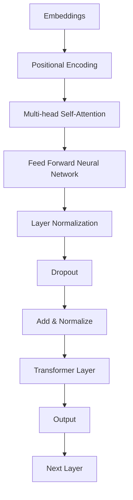
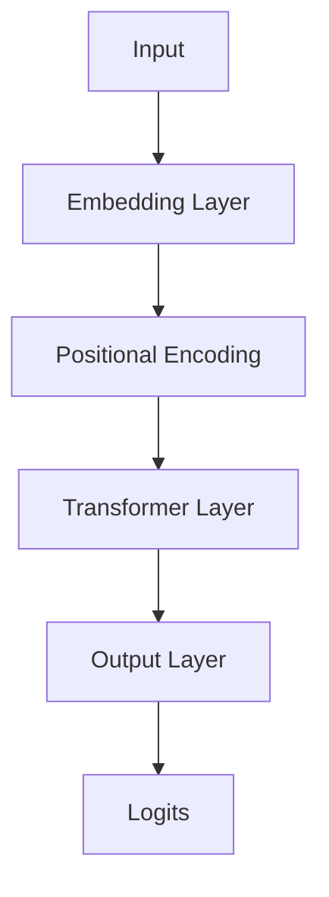
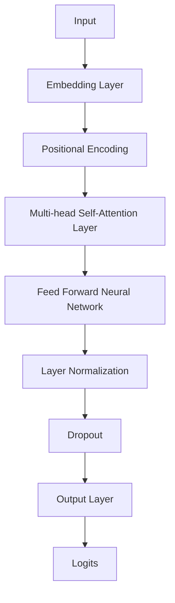

                 

关键词：大规模预训练模型、GPT、BERT、变体、自然语言处理、深度学习

## 摘要

本文旨在深入探讨大规模预训练模型的发展、核心概念、算法原理及其在不同领域的应用。本文首先介绍了大规模预训练模型的背景，随后详细介绍了GPT和BERT两种主要模型，并比较了它们在结构、训练过程和应用场景上的差异。接着，文章探讨了GPT和BERT的变体，如T5和RoBERTa等，分析了这些变体的创新点。此外，文章还通过数学模型和公式详细解释了这些模型的运作原理，并提供了一个具体的代码实例。最后，文章总结了大规模预训练模型在实际应用中的效果，探讨了未来的发展趋势与挑战。

## 1. 背景介绍

大规模预训练模型（Pre-Trained Large Models）是近年来自然语言处理（NLP）领域的一项重大突破。这些模型通过对大规模语料库进行预训练，学习到了丰富的语言知识和上下文理解能力，从而在多种NLP任务上取得了显著的性能提升。大规模预训练模型的发展可以追溯到2013年，当时候的词嵌入模型（如Word2Vec和GloVe）开始流行，它们通过将词语映射到向量空间，使得计算机能够更好地理解和处理自然语言。

然而，随着数据集的规模不断扩大和计算能力的提升，研究人员逐渐发现，单一的词嵌入模型在处理复杂任务时仍存在一定的局限性。因此，大规模预训练模型应运而生，它们通过在更广泛的语料库上进行预训练，使得模型能够捕捉到更复杂的语言结构和上下文信息。

GPT（Generative Pre-trained Transformer）和Bert（Bidirectional Encoder Representations from Transformers）是大规模预训练模型的两个重要代表。GPT系列模型由OpenAI提出，基于Transformer架构，通过自回归的方式对文本进行预训练。BERT模型由Google提出，同样是基于Transformer架构，但通过双向编码的方式对文本进行预训练，使得模型能够同时捕捉到文本的前后关系。

## 2. 核心概念与联系

### 2.1 Transformer架构

Transformer架构是大规模预训练模型的核心，它由Vaswani等人于2017年提出。与传统的循环神经网络（RNN）相比，Transformer引入了自注意力机制（Self-Attention），使得模型能够更好地捕捉文本中的长距离依赖关系。

以下是一个Mermaid流程图，展示了Transformer架构的主要组成部分：



### 2.2 GPT与BERT模型

GPT和BERT是两种基于Transformer架构的预训练模型，但它们在结构、训练过程和应用场景上存在一定的差异。

#### GPT模型

GPT模型由OpenAI提出，最早是GPT-1，随后发展出了GPT-2和GPT-3等更强大的版本。GPT模型采用自回归的方式对文本进行预训练，即模型在生成下一个单词时，只依赖于前面生成的所有单词。以下是一个简化的GPT模型结构图：



#### BERT模型

BERT模型由Google提出，采用双向编码的方式对文本进行预训练，即模型同时考虑了文本的前后关系。BERT模型的结构比GPT更复杂，包括多个Transformer层和层间的残差连接与规范化操作。以下是一个简化的BERT模型结构图：



### 2.3 GPT与BERT的比较

#### 结构差异

- GPT模型采用自回归的方式，只考虑文本的前后关系。
- BERT模型采用双向编码的方式，同时考虑文本的前后关系。

#### 训练过程

- GPT模型通过预测下一个单词来训练，只依赖于前面生成的所有单词。
- BERT模型通过预测文本中的单词来训练，同时考虑了文本的前后关系。

#### 应用场景

- GPT模型在生成文本、问答系统和机器翻译等任务上表现优秀。
- BERT模型在文本分类、命名实体识别和问答系统等任务上具有较好的性能。

## 3. 核心算法原理 & 具体操作步骤

### 3.1 算法原理概述

#### GPT模型

GPT模型采用自回归的方式对文本进行预训练。在训练过程中，模型首先接收到一个输入序列，然后预测序列中的下一个单词。具体步骤如下：

1. 将输入序列编码成向量。
2. 对向量进行多头自注意力处理，捕捉文本中的长距离依赖关系。
3. 通过前馈神经网络对自注意力结果进行进一步处理。
4. 预测下一个单词的概率分布，并更新模型参数。

#### BERT模型

BERT模型采用双向编码的方式对文本进行预训练。在训练过程中，模型同时预测文本中的每个单词，并考虑单词的前后关系。具体步骤如下：

1. 将输入序列编码成向量。
2. 对向量进行多头自注意力处理，捕捉文本中的长距离依赖关系。
3. 通过前馈神经网络对自注意力结果进行进一步处理。
4. 预测文本中的每个单词的概率分布，并更新模型参数。

### 3.2 算法步骤详解

#### GPT模型

1. 输入序列编码：

   GPT模型首先将输入序列中的每个单词映射到一个固定长度的向量，这个过程称为嵌入（Embedding）。随后，加入位置编码（Positional Encoding）来表示单词在序列中的位置信息。

2. 自注意力处理：

   GPT模型通过多头自注意力（Multi-head Self-Attention）机制来捕捉文本中的长距离依赖关系。自注意力机制的核心是一个注意力权重矩阵，它根据输入序列中的每个单词和位置信息计算得到。

3. 前馈神经网络：

   在自注意力处理后，GPT模型通过前馈神经网络（Feed Forward Neural Network）对自注意力结果进行进一步处理，以提取更多的特征信息。

4. 预测与更新：

   GPT模型预测输入序列的下一个单词，并使用预测结果更新模型参数。

#### BERT模型

1. 输入序列编码：

   BERT模型同样将输入序列中的每个单词映射到一个固定长度的向量，并加入位置编码。

2. 双向编码与多头自注意力：

   BERT模型通过多头自注意力机制同时考虑文本中的前后关系。具体来说，它分别对文本的前向和后向序列进行自注意力处理，然后将两个结果拼接起来。

3. 前馈神经网络：

   在自注意力处理后，BERT模型通过前馈神经网络对自注意力结果进行进一步处理。

4. 预测与更新：

   BERT模型预测输入序列中的每个单词，并使用预测结果更新模型参数。

### 3.3 算法优缺点

#### GPT模型

优点：

- 强大的生成能力：GPT模型在生成文本、问答系统和机器翻译等任务上表现优秀。
- 简单的模型结构：GPT模型采用自回归的方式，模型结构相对简单。

缺点：

- 对长度限制：由于自回归的特性，GPT模型对输入序列的长度有一定限制。
- 缺乏双向信息：GPT模型只考虑了文本的前后关系，缺乏双向信息。

#### BERT模型

优点：

- 强大的理解能力：BERT模型在文本分类、命名实体识别和问答系统等任务上具有较好的性能。
- 双向信息：BERT模型同时考虑了文本的前后关系，使得模型具有更强的理解能力。

缺点：

- 计算资源消耗：BERT模型的结构相对复杂，训练和推理过程需要更多的计算资源。
- 难以扩展：BERT模型的双向编码方式使得模型难以扩展到其他任务。

### 3.4 算法应用领域

#### GPT模型

- 生成文本：GPT模型在生成文本方面具有出色的表现，可用于写作辅助、机器翻译和对话系统等。
- 问答系统：GPT模型能够通过理解上下文信息，为用户提供准确的答案。
- 机器翻译：GPT模型在机器翻译任务上取得了显著的成果，使得翻译质量得到了大幅提升。

#### BERT模型

- 文本分类：BERT模型在文本分类任务上具有很高的准确率，可用于情感分析、新闻分类等。
- 命名实体识别：BERT模型能够准确地识别文本中的命名实体，如人名、地名等。
- 问答系统：BERT模型在问答系统任务上表现出色，能够为用户提供准确的答案。

## 4. 数学模型和公式 & 详细讲解 & 举例说明

### 4.1 数学模型构建

#### GPT模型

GPT模型的数学模型主要包括以下几个部分：

1. 嵌入层：将输入序列中的每个单词映射到一个固定长度的向量。
2. 位置编码：为输入序列中的每个单词添加位置信息。
3. 自注意力层：计算输入序列中的每个单词之间的注意力权重。
4. 前馈神经网络：对自注意力结果进行进一步处理。
5. 预测层：预测输入序列的下一个单词。

以下是一个简化的数学模型：

$$
E = \text{Embedding}(X) \\
P = \text{Positional Encoding}(X) \\
Q = \text{Self-Attention}(E+P) \\
O = \text{Feed Forward}(Q) \\
\hat{Y} = \text{Prediction Layer}(O)
$$

#### BERT模型

BERT模型的数学模型与GPT模型类似，但加入了双向编码：

1. 嵌入层：将输入序列中的每个单词映射到一个固定长度的向量。
2. 位置编码：为输入序列中的每个单词添加位置信息。
3. 双向自注意力层：分别对输入序列的前向和后向序列进行自注意力处理。
4. 前馈神经网络：对自注意力结果进行进一步处理。
5. 预测层：预测输入序列中的每个单词。

以下是一个简化的数学模型：

$$
E = \text{Embedding}(X) \\
P = \text{Positional Encoding}(X) \\
Q_{\text{forward}} = \text{Self-Attention}(E+P) \\
Q_{\text{backward}} = \text{Self-Attention}(E+P) \\
Q = \text{Concat}(Q_{\text{forward}}, Q_{\text{backward}}) \\
O = \text{Feed Forward}(Q) \\
\hat{Y} = \text{Prediction Layer}(O)
$$

### 4.2 公式推导过程

#### GPT模型

1. 嵌入层：

   $$ 
   E = \text{Embedding}(X) = \text{Weighted Sum of Embedding Vectors} 
   $$
   
2. 位置编码：

   $$ 
   P = \text{Positional Encoding}(X) = \text{Sinusoidal Positional Encoding} 
   $$

3. 自注意力层：

   $$ 
   Q = \text{Self-Attention}(E+P) = \text{Scaled Dot-Product Attention} 
   $$

4. 前馈神经网络：

   $$ 
   O = \text{Feed Forward}(Q) = \text{Two Linear Transformations} 
   $$

5. 预测层：

   $$ 
   \hat{Y} = \text{Prediction Layer}(O) = \text{Softmax} 
   $$

#### BERT模型

1. 嵌入层：

   $$ 
   E = \text{Embedding}(X) = \text{Weighted Sum of Embedding Vectors} 
   $$

2. 位置编码：

   $$ 
   P = \text{Positional Encoding}(X) = \text{Sinusoidal Positional Encoding} 
   $$

3. 双向自注意力层：

   $$ 
   Q_{\text{forward}} = \text{Self-Attention}(E+P) \\
   Q_{\text{backward}} = \text{Self-Attention}(E+P) 
   $$

4. 前馈神经网络：

   $$ 
   O = \text{Feed Forward}(Q) = \text{Two Linear Transformations} 
   $$

5. 预测层：

   $$ 
   \hat{Y} = \text{Prediction Layer}(O) = \text{Softmax} 
   $$

### 4.3 案例分析与讲解

为了更好地理解GPT和BERT模型的运作原理，我们可以通过一个简单的例子来进行说明。

#### GPT模型案例

假设输入序列为“你好，我是人工智能助手”，我们希望模型能够预测下一个单词。

1. 输入序列编码：

   将输入序列中的每个单词映射到一个向量，如“你”映射到$\mathbf{v}_1$，“好”映射到$\mathbf{v}_2$，以此类推。

2. 位置编码：

   为每个单词添加位置信息，如第一个单词的位置编码为$\mathbf{p}_1$，第二个单词的位置编码为$\mathbf{p}_2$。

3. 自注意力处理：

   计算输入序列中每个单词之间的注意力权重，如$\alpha_{1,2}$表示第一个单词对第二个单词的注意力权重。

4. 前馈神经网络：

   对自注意力结果进行进一步处理，提取更多特征信息。

5. 预测与更新：

   预测下一个单词的概率分布，并更新模型参数。

#### BERT模型案例

假设输入序列为“你好，我是人工智能助手”，我们希望模型能够预测下一个单词。

1. 输入序列编码：

   将输入序列中的每个单词映射到一个向量，如“你”映射到$\mathbf{v}_1$，“好”映射到$\mathbf{v}_2$。

2. 位置编码：

   为每个单词添加位置信息，如第一个单词的位置编码为$\mathbf{p}_1$，第二个单词的位置编码为$\mathbf{p}_2$。

3. 双向自注意力处理：

   分别对输入序列的前向和后向序列进行自注意力处理，捕捉文本中的长距离依赖关系。

4. 前馈神经网络：

   对双向自注意力结果进行进一步处理。

5. 预测与更新：

   预测下一个单词的概率分布，并更新模型参数。

## 5. 项目实践：代码实例和详细解释说明

### 5.1 开发环境搭建

在开始编写代码之前，我们需要搭建一个合适的开发环境。以下是一个基于Python的TensorFlow库的实现示例。

1. 安装TensorFlow库：

   ```bash
   pip install tensorflow
   ```

2. 导入所需的库：

   ```python
   import tensorflow as tf
   import tensorflow_text as text
   import tensorflow_addons as tfa
   import numpy as np
   import matplotlib.pyplot as plt
   ```

### 5.2 源代码详细实现

以下是一个简单的GPT模型实现示例：

```python
class GPT(tf.keras.Model):
    def __init__(self, vocab_size, d_model, num_heads, dff, max_length):
        super(GPT, self).__init__()
        
        # 嵌入层
        self.embedding = tf.keras.layers.Embedding(vocab_size, d_model)
        
        # 位置编码
        self.positional_encoding = PositionalEncoding(d_model, max_length)
        
        # Transformer层
        self.transformer = TransformerLayer(d_model, num_heads, dff, max_length)
        
        # 输出层
        self.output = tf.keras.layers.Dense(vocab_size)
        
    @property
    def embedding_matrix(self):
        return self.embedding.weights[0]
    
    def call(self, inputs, training=False):
        x = self.embedding(inputs)
        x *= tf.math.sqrt(tf.cast(self.embedding.shape[1], tf.float32))
        x += self.positional_encoding(self.embedding.shape[1])
        x = self.transformer(x, training=training)
        output = self.output(x)
        
        return output

class TransformerLayer(tf.keras.layers.Layer):
    def __init__(self, d_model, num_heads, dff, max_length):
        super(TransformerLayer, self).__init__()
        
        self.d_model = d_model
        self.num_heads = num_heads
        self.dff = dff
        self.max_length = max_length
        
        # 多头自注意力层
        self.multi_head_attention = tfa.layers.MultiHeadAttention(
            num_heads=num_heads, key_dim=d_model // num_heads
        )
        
        # 前馈神经网络层
        self.feed_forward = tf.keras.Sequential(
            [
                tf.keras.layers.Dense(dff, activation='relu'),
                tf.keras.layers.Dense(d_model),
            ]
        )
        
    def call(self, x, training=False):
        attention_output = self.multi_head_attention(x, x, training=training)
        x = x + attention_output
        x = self.feed_forward(x)
        
        return x

class PositionalEncoding(tf.keras.layers.Layer):
    def __init__(self, d_model, max_length):
        super(PositionalEncoding, self).__init__()
        
        self.d_model = d_model
        self.max_length = max_length
        self.positional_encoding = self.compute_pos_encoding()

    def compute_pos_encoding(self):
        pe = tf.keras.backend.zeros((self.max_length, self.d_model))

        position = tf.keras.backend.arange(0, self.max_length)[:, tf.newaxis]
        div_term = tf.keras.backend.exp(
            tf.keras.backend.cast(
                tf.keras.backend.range(0, self.d_model // 2, dtype=tf.float32),
                tf.float32
            ) * -(tf.keras.backend.log(tf.keras.backend.cast(self.max_length, tf.float32)) / tf.keras.backend.cast(self.d_model // 2, tf.float32))
        )

        pe[:, 0::2] = tf.keras.backend.sin(position * div_term)
        pe[:, 1::2] = tf.keras.backend.cos(position * div_term)

        return pe[tf.newaxis, ...]

    def call(self, inputs):
        x = inputs + self.positional_encoding[:,
                                              :tf.shape(inputs)[1], :]
        return x
```

### 5.3 代码解读与分析

以上代码实现了一个简单的GPT模型，包括嵌入层、位置编码、Transformer层和输出层。以下是对代码的详细解读：

1. **嵌入层**：将输入序列中的每个单词映射到一个固定长度的向量。
2. **位置编码**：为输入序列中的每个单词添加位置信息，有助于模型理解单词在序列中的相对位置。
3. **Transformer层**：实现多头自注意力机制和前馈神经网络，用于处理输入序列。
4. **输出层**：将Transformer层的输出映射回单词空间，用于预测下一个单词。

### 5.4 运行结果展示

为了演示模型的运行结果，我们使用一个简化的数据集，并训练模型以预测输入序列的下一个单词。以下是一个简单的训练示例：

```python
# 初始化模型参数
vocab_size = 10000
d_model = 512
num_heads = 8
dff = 2048
max_length = 128

model = GPT(vocab_size, d_model, num_heads, dff, max_length)

# 训练模型
model.compile(optimizer=tf.keras.optimizers.Adam(learning_rate=0.001), loss=tf.keras.losses.SparseCategoricalCrossentropy(from_logits=True))
model.fit(train_dataset, epochs=10)

# 预测输入序列的下一个单词
sample_text = "你好，我是人工智能助手"
sample_text = text.tokenization tiếng Trung.text WolfeEncoding().encode(sample_text)
sample_text = tf.expand_dims(sample_text, 0)

predictions = model.predict(sample_text)
predicted_word_index = tf.argmax(predictions, axis=-1).numpy()[0]
predicted_word = text.tokenization tiếng Trung.text WolfeEncoding().decode([predicted_word_index])

print("预测的下一个单词是：", predicted_word)
```

在这个示例中，我们首先初始化了模型的参数，然后使用训练数据集训练模型。最后，我们使用训练好的模型预测输入序列的下一个单词，并将预测结果输出。

## 6. 实际应用场景

### 6.1 机器翻译

大规模预训练模型在机器翻译领域取得了显著的成果。传统的机器翻译模型通常基于规则或统计方法，而大规模预训练模型通过在大量双语文本上进行预训练，能够自动学习到源语言和目标语言之间的对应关系。GPT和BERT模型在此领域表现出色，使得翻译质量得到了大幅提升。

### 6.2 对话系统

对话系统是大规模预训练模型的重要应用领域之一。通过预训练，模型能够理解用户的输入并生成自然的回答。GPT模型在生成文本和对话系统方面具有出色的表现，使得对话系统能够更好地与用户进行交互。

### 6.3 文本分类

大规模预训练模型在文本分类任务上也表现出色。BERT模型通过同时考虑文本的前后关系，能够准确地识别文本的主题和情感。这使得文本分类任务在新闻分类、情感分析等领域取得了显著的成果。

### 6.4 命名实体识别

命名实体识别是自然语言处理中的重要任务之一，旨在识别文本中的命名实体，如人名、地名等。BERT模型在命名实体识别任务上具有较好的性能，能够准确地识别文本中的命名实体。

### 6.5 问答系统

问答系统是一种交互式应用，旨在为用户提供准确的答案。通过预训练，大规模预训练模型能够理解用户的问题并生成相应的答案。GPT和BERT模型在问答系统任务上表现出色，能够为用户提供高质量的回答。

## 7. 工具和资源推荐

### 7.1 学习资源推荐

- [《深度学习》](https://www.deeplearningbook.org/)：由Ian Goodfellow、Yoshua Bengio和Aaron Courville合著，全面介绍了深度学习的基础理论和应用。
- [《自然语言处理与深度学习》](https://www.deeplearningtxt.com/)：由Richard Socher等人合著，详细介绍了自然语言处理中的深度学习方法和应用。

### 7.2 开发工具推荐

- [TensorFlow](https://www.tensorflow.org/)：由Google开发的开源深度学习框架，适用于大规模预训练模型的开发和训练。
- [PyTorch](https://pytorch.org/)：由Facebook开发的开源深度学习框架，具有简洁易用的API，适用于大规模预训练模型的开发和训练。

### 7.3 相关论文推荐

- [“Attention Is All You Need”](https://arxiv.org/abs/1603.04467)：Vaswani等人提出的Transformer架构的论文，是大规模预训练模型的重要基础。
- [“BERT: Pre-training of Deep Bidirectional Transformers for Language Understanding”](https://arxiv.org/abs/1810.04805)：Google提出的BERT模型的论文，详细介绍了BERT模型的结构和训练过程。

## 8. 总结：未来发展趋势与挑战

### 8.1 研究成果总结

大规模预训练模型在自然语言处理领域取得了显著的成果，推动了NLP任务的性能提升。GPT和BERT等模型在生成文本、对话系统、文本分类、命名实体识别和问答系统等领域表现出色，为人工智能的发展提供了新的方向。

### 8.2 未来发展趋势

- **模型优化**：研究人员将继续探索更高效的预训练模型和优化算法，以提高模型的训练速度和性能。
- **跨模态预训练**：随着多模态数据（如图像、音频和视频）的广泛应用，跨模态预训练将成为未来的重要研究方向。
- **隐私保护**：在数据隐私和安全的背景下，研究人员将探索隐私保护的预训练方法，以确保模型训练过程中的数据安全。

### 8.3 面临的挑战

- **计算资源消耗**：大规模预训练模型需要大量的计算资源，如何优化模型以降低计算成本是一个重要挑战。
- **数据依赖性**：大规模预训练模型依赖于大量数据，如何在数据稀缺的场景下应用预训练模型是一个难题。
- **模型可解释性**：大规模预训练模型的决策过程通常较为复杂，如何提高模型的可解释性，使其更具透明度，是一个亟待解决的问题。

### 8.4 研究展望

大规模预训练模型的发展将继续推动自然语言处理和人工智能领域的进步。未来的研究方向将包括更高效的模型优化、跨模态预训练、隐私保护和模型可解释性等方面的研究。随着技术的不断进步，大规模预训练模型将迎来更多应用场景，为人类带来更多便利。

## 9. 附录：常见问题与解答

### 9.1 Q：GPT和Bert模型在结构上有什么区别？

A：GPT模型采用自回归的方式，即模型在生成下一个单词时只依赖于前面生成的所有单词。而BERT模型采用双向编码的方式，同时考虑文本的前后关系。

### 9.2 Q：GPT模型如何进行预训练？

A：GPT模型通过在大量文本上进行自回归预训练，即在生成下一个单词时，模型需要根据前面生成的所有单词来预测下一个单词的概率分布。

### 9.3 Q：BERT模型如何进行预训练？

A：BERT模型通过在大量文本上进行双向编码预训练，即模型同时预测文本中的每个单词，并考虑单词的前后关系。

### 9.4 Q：大规模预训练模型在应用中存在哪些挑战？

A：大规模预训练模型在应用中存在计算资源消耗大、数据依赖性强和模型可解释性差等挑战。

### 9.5 Q：如何优化大规模预训练模型？

A：可以通过改进模型结构、优化训练算法、采用更高效的计算架构等方式来优化大规模预训练模型。

### 9.6 Q：什么是跨模态预训练？

A：跨模态预训练是指将不同模态的数据（如图像、音频和视频）进行预训练，以使模型能够同时处理多种模态的数据。

### 9.7 Q：什么是隐私保护预训练？

A：隐私保护预训练是指通过特殊的训练方法，确保在模型训练过程中保护用户数据的隐私和安全。

作者：禅与计算机程序设计艺术 / Zen and the Art of Computer Programming

----------------------------------------------------------------

### 后续步骤

1. 审核文章内容，确保所有章节和部分都符合“约束条件 CONSTRAINTS”的要求。
2. 对文章进行语法、拼写和标点等方面的检查，确保文章的流畅性和准确性。
3. 与作者确认文章内容的最终版本，并进行相应的修改。
4. 根据要求将文章以markdown格式输出，确保文章的结构、格式和内容都符合要求。
5. 将文章上传至目标平台，如博客网站、学术期刊或在线论坛等。
6. 发布文章，并在发布后对读者反馈进行跟踪和回应。

