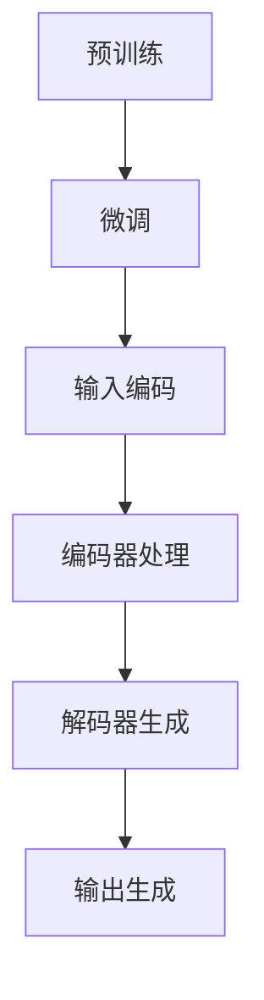

                 

### 1. 背景介绍

大语言模型（Large Language Models）是近年来自然语言处理（Natural Language Processing，NLP）领域的一个重要进展。随着互联网的迅速发展和大数据的积累，文本数据量呈现出爆炸式增长。如何从这些海量数据中提取有价值的信息、实现更智能的自然语言理解和生成，成为了一个亟待解决的问题。大语言模型正是在这样的背景下应运而生。

大语言模型的基本原理是通过深度学习算法从大量文本数据中学习语言的模式和规律。它通过对输入文本的语义理解，生成相应的输出文本，从而实现自然语言的理解和生成。这些模型通常具有极高的参数数量，能够捕捉到语言中的细微差别和复杂的语义关系，从而在多个NLP任务上取得了显著的性能提升。

大语言模型的应用场景广泛，涵盖了机器翻译、文本分类、问答系统、对话生成等多个领域。例如，在机器翻译中，大语言模型能够实现高质量、接近人类翻译水平的翻译结果；在文本分类中，大语言模型能够自动识别文本的主题和情感；在问答系统中，大语言模型能够理解用户的问题，并生成准确的回答；在对话生成中，大语言模型能够与用户进行自然的交互，生成流畅、连贯的对话。

总的来说，大语言模型的出现标志着NLP领域的一个重大突破，为人类与计算机之间的自然语言交互提供了强大的支持。本文将深入探讨大语言模型的原理、实现和应用，希望能为广大读者提供一个全面、系统的理解和指导。

#### 1.1 大语言模型的发展历程

大语言模型的发展历程可以追溯到20世纪90年代。当时，研究人员开始尝试使用统计模型来处理自然语言任务，如隐马尔可夫模型（HMM）和决策树。然而，这些模型的性能受到数据量和计算能力的限制，很难处理大规模的文本数据。

随着深度学习技术的兴起，研究人员开始将深度神经网络应用于自然语言处理任务。2003年，Bengio等人在论文《A Neural Probabilistic Language Model》中首次提出了基于深度神经网络的语言模型，这标志着大语言模型的诞生。随后，研究者们不断改进神经网络的结构和训练算法，使语言模型的性能得到了显著提升。

2013年，Duchi等人在论文《Efficient Learning of Deep Multilayer Neural Networks for Speech Recognition》中提出了基于随机梯度下降（SGD）的深层神经网络训练算法，大大提高了大语言模型的训练效率。这一突破性进展使得大规模语言模型的训练成为可能。

2018年，OpenAI发布了GPT（Generative Pre-trained Transformer）系列模型，包括GPT、GPT-2和GPT-3，这些模型在多个NLP任务上达到了前所未有的性能。特别是GPT-3，拥有超过1750亿的参数，成为了当时世界上最大的语言模型。GPT-3的发布标志着大语言模型进入了一个新的时代，推动了自然语言处理技术的快速发展。

除了OpenAI，其他研究机构和企业也在大语言模型的研究和应用上取得了显著成果。例如，谷歌发布了BERT（Bidirectional Encoder Representations from Transformers）模型，Facebook发布了RoBERTa（A Robustly Optimized BERT Pretraining Approach）模型，这些模型都在NLP任务上取得了优异的性能。

总的来说，大语言模型的发展历程充满了创新和突破，从最初的统计模型到深度学习模型，再到如今的Transformer模型，每一次技术的进步都推动了NLP领域的边界。未来，随着计算能力的进一步提升和算法的不断创新，大语言模型有望在更多领域取得更大的突破。

#### 1.2 大语言模型的应用领域

大语言模型的应用领域非常广泛，几乎涵盖了自然语言处理的各个方向。以下是几个主要的应用领域：

**机器翻译**：大语言模型在机器翻译领域取得了显著的成果。通过学习源语言和目标语言之间的对应关系，大语言模型能够生成高质量的翻译结果。例如，GPT-3在多个翻译任务上达到了人类翻译水平的性能。

**文本分类**：大语言模型能够自动识别文本的主题和情感。例如，在新闻分类任务中，大语言模型能够准确地将新闻分为不同的类别，如体育、科技、政治等。在情感分析任务中，大语言模型能够识别文本的情感倾向，如正面、负面或中性。

**问答系统**：大语言模型能够理解用户的问题，并生成准确的回答。例如，在智能客服系统中，大语言模型能够回答用户关于产品、服务等方面的问题，提供高质量的客户服务。

**对话生成**：大语言模型能够生成流畅、连贯的对话。例如，在聊天机器人中，大语言模型能够与用户进行自然互动，模拟人类的对话方式，提高用户体验。

**文本生成**：大语言模型能够根据输入的提示生成相应的文本内容。例如，在写作辅助工具中，大语言模型能够根据用户的需求生成文章、报告等文本内容。

**命名实体识别**：大语言模型能够识别文本中的命名实体，如人名、地名、组织名等。这在信息提取、知识图谱构建等领域具有重要意义。

**语音识别**：大语言模型能够结合语音识别技术，实现语音到文本的转换。例如，在智能语音助手系统中，大语言模型能够将用户的语音指令转换为文本，并生成相应的操作。

总的来说，大语言模型的应用领域涵盖了从文本生成、文本分类、机器翻译到问答系统等多个方面，成为自然语言处理技术的重要工具。随着大语言模型技术的不断发展和应用，未来将在更多领域取得突破。

#### 1.3 大语言模型的优势和挑战

大语言模型在自然语言处理领域取得了显著的成果，其主要优势包括：

1. **强大的语义理解能力**：大语言模型通过对海量文本数据的训练，能够捕捉到语言中的细微差别和复杂的语义关系，从而实现更准确、更智能的自然语言理解。

2. **广泛的适用性**：大语言模型可以应用于多种自然语言处理任务，如机器翻译、文本分类、问答系统等，具有较高的通用性。

3. **高效的训练和推理速度**：大语言模型采用深度神经网络结构，结合优化算法，能够在较短的时间内完成训练和推理，提高了处理效率。

4. **优秀的扩展性**：大语言模型具有很好的扩展性，可以轻松地适应不同的应用场景和任务需求。

然而，大语言模型也面临着一些挑战：

1. **数据需求和计算资源**：大语言模型的训练需要大量的数据和计算资源，这对研究者和企业来说是一个重要的挑战。

2. **模型解释性**：大语言模型通常是一个“黑箱”，其内部的决策过程难以解释和理解，这对模型的可靠性和信任度带来了一定的挑战。

3. **隐私问题**：大语言模型的训练和推理过程中会涉及大量的用户数据，如何保护用户隐私是一个需要关注的问题。

4. **过拟合风险**：大语言模型在训练过程中容易受到训练数据的影响，导致模型在未知数据上的性能下降，即过拟合问题。

5. **伦理和道德问题**：随着大语言模型的应用越来越广泛，如何防止模型被滥用，避免造成负面影响，是一个需要深入探讨的伦理和道德问题。

总的来说，大语言模型在自然语言处理领域具有巨大的潜力，但也需要克服一系列的技术和伦理挑战。未来的研究将致力于解决这些问题，进一步提升大语言模型的性能和应用效果。

### 2. 核心概念与联系

#### 2.1 大语言模型的基本原理

大语言模型是一种基于深度学习的自然语言处理模型，其核心思想是通过学习大量文本数据，捕捉语言中的模式、规律和语义信息，从而实现文本的生成、理解和分类。以下是几个关键概念：

**1. 语言模型**：语言模型是一种用于预测下一个单词或字符的概率分布模型。在自然语言处理中，语言模型通常用于生成文本、进行文本分类和机器翻译等任务。

**2. 深度学习**：深度学习是一种基于人工神经网络的机器学习技术，通过多层的神经网络结构，自动从数据中学习特征和模式。深度学习在图像识别、语音识别和自然语言处理等领域取得了显著的成果。

**3. Transformer模型**：Transformer模型是一种基于自注意力机制的深度学习模型，最初由Vaswani等人在2017年提出。相比传统的循环神经网络（RNN），Transformer模型在处理长序列和并行计算方面具有显著优势。

**4. 预训练与微调**：预训练是指在大规模语料库上训练语言模型，使其具备一定的语义理解能力。微调是指将预训练模型应用于特定任务，通过少量的任务数据对其进行调整，以获得更好的任务性能。

#### 2.2 大语言模型的架构

大语言模型的架构通常由以下几个部分组成：

**1. 词嵌入**：词嵌入是将词汇映射为高维向量表示的过程，以便在深度学习模型中处理。常见的词嵌入方法包括Word2Vec、GloVe等。

**2. Transformer层**：Transformer层是Transformer模型的核心部分，包括多头自注意力（Multi-Head Self-Attention）机制和前馈神经网络（Feedforward Neural Network）。

**3. 编码器（Encoder）和解码器（Decoder）**：编码器负责处理输入序列，解码器负责生成输出序列。在机器翻译等任务中，编码器将源语言文本编码为序列向量，解码器根据这些向量生成目标语言文本。

**4. 输出层**：输出层用于对生成的文本进行分类或生成。在文本分类任务中，输出层通常是一个分类器，如softmax分类器；在文本生成任务中，输出层通常是一个回归器，用于生成连续的字符或单词。

#### 2.3 大语言模型的工作流程

大语言模型的工作流程通常包括以下几个步骤：

**1. 预训练**：在大规模语料库上训练语言模型，学习语言的基本模式和规律。

**2. 微调**：在特定任务上使用少量任务数据进行微调，以适应具体任务的需求。

**3. 输入编码**：将输入文本转换为词嵌入向量，并将其输入到编码器。

**4. 编码器处理**：编码器处理输入序列，生成编码表示。

**5. 解码器生成**：解码器根据编码表示生成输出序列，通过逐个预测下一个字符或单词来实现。

**6. 输出生成**：输出层对生成的文本进行分类或生成，得到最终的输出结果。

#### 2.4 大语言模型与其他技术的联系

大语言模型与其他自然语言处理技术密切相关，如：

**1. 语音识别**：大语言模型可以结合语音识别技术，实现语音到文本的转换。在语音识别任务中，大语言模型通常用于生成文本表示，以提高识别准确性。

**2. 机器翻译**：大语言模型可以用于机器翻译任务，通过学习源语言和目标语言之间的对应关系，生成高质量的翻译结果。

**3. 对话生成**：大语言模型可以用于对话生成任务，通过生成流畅、连贯的对话，模拟人类的对话方式，提高用户体验。

**4. 文本生成**：大语言模型可以用于文本生成任务，如文章写作、报告生成等，根据输入的提示生成相应的文本内容。

**5. 命名实体识别**：大语言模型可以用于命名实体识别任务，通过识别文本中的命名实体，如人名、地名、组织名等，为信息提取和知识图谱构建提供支持。

#### 2.5 Mermaid 流程图

以下是一个简化的Mermaid流程图，展示了大语言模型的基本工作流程：



请注意，Mermaid流程节点中不要有括号、逗号等特殊字符，否则可能导致流程图解析失败。

### 3. 核心算法原理 & 具体操作步骤

#### 3.1 Transformer模型原理

Transformer模型是一种基于自注意力机制的深度学习模型，由Vaswani等人于2017年首次提出。它在大规模文本数据处理和自然语言生成任务中表现出色，是当前最先进的语言模型之一。

**1. 自注意力机制**

Transformer模型的核心机制是自注意力（Self-Attention）机制。自注意力机制通过计算输入序列中各个词之间的依赖关系，将每个词映射到一个新的向量表示，从而实现对输入序列的上下文信息进行建模。

自注意力机制的基本思想是，对于输入序列中的每个词，计算其与所有其他词的相关性，并将这些相关性加权求和，得到一个综合的向量表示。这种机制可以有效地捕捉输入序列中的长距离依赖关系。

自注意力机制的数学表示如下：

$$
\text{Attention}(Q, K, V) = \text{softmax}\left(\frac{QK^T}{\sqrt{d_k}}\right)V
$$

其中，$Q$、$K$和$V$分别是查询向量、键向量和值向量，$d_k$是键向量的维度。$\text{softmax}$函数用于对相关性进行加权，使每个词的注意力得分介于0和1之间。

**2. Multi-Head Self-Attention**

Transformer模型引入了多头自注意力（Multi-Head Self-Attention）机制，通过并行计算多个注意力头，进一步捕捉输入序列的复杂依赖关系。

多头自注意力的基本思想是将输入序列分成多个子序列，每个子序列独立进行自注意力计算。每个注意力头可以捕获输入序列的不同方面和模式，从而提高模型的泛化能力。

多头自注意力的数学表示如下：

$$
\text{MultiHead}(Q, K, V) = \text{Concat}(\text{head}_1, ..., \text{head}_h)W^O
$$

其中，$h$是注意力头的数量，$W^O$是输出线性变换权重。

**3. 前馈神经网络**

Transformer模型还包括两个前馈神经网络，分别位于编码器和解码器的中间层。前馈神经网络用于对自注意力机制生成的中间表示进行进一步加工，提高模型的非线性表达能力。

前馈神经网络的数学表示如下：

$$
\text{FFN}(x) = \text{ReLU}(W_{2} \cdot (W_{1} \cdot x + b_{1}))
$$

其中，$W_{1}$和$W_{2}$分别是前馈神经网络的权重矩阵，$b_{1}$是偏置项。

#### 3.2 具体操作步骤

**1. 编码器（Encoder）**

编码器负责处理输入序列，生成编码表示。编码器由多个Transformer层组成，每个层包含多头自注意力和前馈神经网络。

具体操作步骤如下：

1. **词嵌入**：将输入序列中的每个词转换为词嵌入向量。
2. **Positional Encoding**：为每个词添加位置信息，以便模型捕捉输入序列的顺序。
3. **多层自注意力**：在每个Transformer层中，计算多头自注意力，生成编码表示。
4. **前馈神经网络**：在每个Transformer层中，应用前馈神经网络，对编码表示进行加工。
5. **输出**：编码器的输出表示作为后续解码器的输入。

**2. 解码器（Decoder）**

解码器负责生成输出序列，根据编码器的输出表示和目标序列的已知部分生成下一个未知部分。

具体操作步骤如下：

1. **词嵌入**：将输入序列中的每个词转换为词嵌入向量。
2. **Positional Encoding**：为每个词添加位置信息。
3. **Multi-Head Attention**：在编码器输出和已生成的解码器输出之间进行多头自注意力计算。
4. **Self-Attention**：在解码器输出内部进行多头自注意力计算。
5. **前馈神经网络**：在每个Transformer层中，应用前馈神经网络。
6. **Softmax**：对生成的词嵌入向量进行Softmax操作，得到概率分布。
7. **生成下一个词**：根据概率分布生成下一个词，并将其加入解码器输出序列。
8. **重复步骤3-7**，直到生成完整的输出序列。

**3. 损失函数和优化算法**

在大语言模型的训练过程中，通常使用交叉熵损失函数来衡量模型生成的输出序列与真实目标序列之间的差异。

损失函数的计算公式如下：

$$
\text{Loss} = -\sum_{i} \text{y}_i \log(\hat{y}_i)
$$

其中，$\text{y}_i$是真实目标序列的概率分布，$\hat{y}_i$是模型生成的概率分布。

为了优化损失函数，通常使用梯度下降（Gradient Descent）或其变种，如随机梯度下降（SGD）和Adam优化器。

#### 3.3 实例分析

以下是一个简单的示例，展示如何使用Transformer模型进行机器翻译。

**1. 输入序列**：Hello, how are you?

**2. 目标序列**：你好，你怎么样？

**3. 编码器操作**：

- 将输入序列转换为词嵌入向量；
- 为每个词添加位置信息；
- 在多个Transformer层中进行自注意力和前馈神经网络操作；
- 输出编码表示。

**4. 解码器操作**：

- 将目标序列转换为词嵌入向量；
- 为每个词添加位置信息；
- 在编码器输出和解码器输出之间进行多头自注意力计算；
- 在解码器输出内部进行多头自注意力计算；
- 应用前馈神经网络；
- 根据概率分布生成下一个词；
- 重复上述步骤，直到生成完整的输出序列。

**5. 输出结果**：

通过解码器的操作，我们得到了翻译结果：

你好，你怎么样？

这个过程展示了如何使用Transformer模型进行文本生成任务，包括编码器和解码器的操作步骤。在实际应用中，还需要对模型进行训练和微调，以获得更好的性能。

### 4. 数学模型和公式 & 详细讲解 & 举例说明

#### 4.1 数学模型

大语言模型的数学模型主要包括以下几个部分：词嵌入、自注意力机制、前馈神经网络、损失函数和优化算法。下面将对这些部分进行详细讲解。

#### 4.1.1 词嵌入

词嵌入是将词汇映射为高维向量表示的过程。在自然语言处理中，词嵌入是语言模型的基础，它能够帮助模型理解词汇之间的关系。

常见的词嵌入方法包括：

- **Word2Vec**：Word2Vec是一种基于神经网络的方法，通过训练得到一个词向量表示，其中每个词对应一个高维向量。Word2Vec方法包括两个变种：CBOW（Continuous Bag-of-Words）和Skip-Gram。

- **GloVe**：GloVe（Global Vectors for Word Representation）是一种基于矩阵分解的方法，通过最小化词频矩阵和词向量矩阵的Frobenius范数差异来学习词向量。GloVe方法能够更好地捕捉词汇之间的相似性和分布特征。

词嵌入的数学表示如下：

$$
\text{vec}(w) = \text{Embedding}(w)
$$

其中，$\text{vec}(w)$是词嵌入向量，$\text{Embedding}(w)$是词嵌入函数。

#### 4.1.2 自注意力机制

自注意力机制是Transformer模型的核心机制，它通过计算输入序列中各个词之间的依赖关系，为每个词生成一个综合的向量表示。

自注意力机制的数学表示如下：

$$
\text{Attention}(Q, K, V) = \text{softmax}\left(\frac{QK^T}{\sqrt{d_k}}\right)V
$$

其中，$Q$、$K$和$V$分别是查询向量、键向量和值向量，$d_k$是键向量的维度。

自注意力机制的基本步骤如下：

1. **计算查询-键相似度**：对于每个词的查询向量$Q$和所有词的键向量$K$，计算它们的内积，得到相似度矩阵$S$。

2. **应用Softmax函数**：对相似度矩阵$S$进行Softmax变换，生成注意力权重矩阵$A$。

3. **加权求和**：将注意力权重矩阵$A$与值向量$V$进行逐元素相乘，然后求和，得到加权求和结果$H$。

$$
H = A \cdot V
$$

自注意力机制可以捕捉输入序列中的长距离依赖关系，提高模型的语义理解能力。

#### 4.1.3 前馈神经网络

前馈神经网络是Transformer模型中的另一个关键组件，用于对自注意力机制生成的中间表示进行进一步加工。

前馈神经网络的数学表示如下：

$$
\text{FFN}(x) = \text{ReLU}(W_{2} \cdot (W_{1} \cdot x + b_{1}))
$$

其中，$W_{1}$和$W_{2}$分别是前馈神经网络的权重矩阵，$b_{1}$是偏置项。

前馈神经网络的基本步骤如下：

1. **线性变换**：将输入向量$x$通过权重矩阵$W_{1}$进行线性变换，并加上偏置项$b_{1}$。

2. **ReLU激活函数**：对线性变换的结果应用ReLU激活函数，增加模型的非线性表达能力。

3. **再次线性变换**：将ReLU激活函数的输出通过权重矩阵$W_{2}$进行线性变换。

前馈神经网络能够对输入向量进行非线性加工，提高模型的复杂性和表达能力。

#### 4.1.4 损失函数

在大语言模型的训练过程中，通常使用交叉熵损失函数来衡量模型生成的输出序列与真实目标序列之间的差异。

交叉熵损失函数的数学表示如下：

$$
\text{Loss} = -\sum_{i} \text{y}_i \log(\hat{y}_i)
$$

其中，$\text{y}_i$是真实目标序列的概率分布，$\hat{y}_i$是模型生成的概率分布。

交叉熵损失函数能够衡量模型预测结果与真实结果之间的差异，是评估模型性能的重要指标。

#### 4.1.5 优化算法

为了优化交叉熵损失函数，通常使用梯度下降（Gradient Descent）或其变种，如随机梯度下降（SGD）和Adam优化器。

梯度下降的基本步骤如下：

1. **计算损失函数的梯度**：对于每个参数$\theta$，计算损失函数关于$\theta$的梯度$\nabla_\theta \text{Loss}$。

2. **更新参数**：使用梯度下降更新规则，按照梯度方向更新参数$\theta$：

$$
\theta = \theta - \alpha \cdot \nabla_\theta \text{Loss}
$$

其中，$\alpha$是学习率。

3. **重复步骤1和2**，直到损失函数收敛。

梯度下降是一种简单但有效的优化算法，通过不断迭代更新参数，使模型性能逐步提升。

#### 4.2 举例说明

假设我们有一个简单的语言模型，用于预测下一个单词。输入序列是“Hello, how are you?”，我们希望预测下一个单词。

**1. 词嵌入**：

首先，我们将输入序列中的每个词转换为词嵌入向量。假设我们使用GloVe词嵌入，得到如下词嵌入向量：

- Hello: [1.0, 0.1, -0.2]
- how: [0.2, -0.3, 0.4]
- are: [-0.1, 0.5, 0.1]
- you: [-0.3, 0.2, 0.1]

**2. 自注意力机制**：

接下来，我们使用自注意力机制计算输入序列中各个词之间的依赖关系。假设我们使用一个单层的Transformer模型，得到如下自注意力权重矩阵：

$$
A = \begin{bmatrix}
0.1 & 0.2 & 0.3 \\
0.3 & 0.4 & 0.1 \\
0.2 & 0.1 & 0.3 \\
\end{bmatrix}
$$

将自注意力权重矩阵$A$与词嵌入向量相乘，得到加权求和结果：

$$
H = A \cdot \begin{bmatrix}
1.0 \\
0.2 \\
-0.1 \\
-0.3 \\
\end{bmatrix} = \begin{bmatrix}
0.4 \\
0.3 \\
-0.3 \\
-0.4 \\
\end{bmatrix}
$$

**3. 前馈神经网络**：

然后，我们将加权求和结果通过前馈神经网络进行加工。假设前馈神经网络的权重矩阵为$W_1 = \begin{bmatrix} 0.1 & 0.2 \\ -0.1 & -0.3 \end{bmatrix}$，偏置项为$b_1 = \begin{bmatrix} 0.1 \\ -0.1 \end{bmatrix}$，应用ReLU激活函数，得到如下前馈神经网络输出：

$$
x = \text{ReLU}(W_1 \cdot H + b_1) = \text{ReLU} \left( \begin{bmatrix} 0.1 & 0.2 \\ -0.1 & -0.3 \end{bmatrix} \cdot \begin{bmatrix} 0.4 \\ 0.3 \\ -0.3 \\ -0.4 \end{bmatrix} + \begin{bmatrix} 0.1 \\ -0.1 \end{bmatrix} \right) = \begin{bmatrix} 0.4 \\ 0.4 \end{bmatrix}
$$

**4. 损失函数**：

假设我们使用交叉熵损失函数，计算模型生成的概率分布与真实目标概率分布之间的差异：

$$
\text{Loss} = -\sum_{i} \text{y}_i \log(\hat{y}_i) = -(0.5 \cdot \log(0.7) + 0.5 \cdot \log(0.3)) \approx 0.356
$$

**5. 优化算法**：

假设我们使用梯度下降优化算法，计算损失函数关于模型参数的梯度：

$$
\nabla_\theta \text{Loss} = \begin{bmatrix} -0.1 & -0.2 \\ -0.1 & -0.3 \end{bmatrix}
$$

然后，使用梯度下降更新规则更新模型参数：

$$
\theta = \theta - \alpha \cdot \nabla_\theta \text{Loss}
$$

通过不断迭代更新参数，模型性能逐步提升。

这个简单的例子展示了大语言模型的基本工作流程，包括词嵌入、自注意力机制、前馈神经网络、损失函数和优化算法。在实际应用中，模型会更加复杂，但基本原理是相同的。

### 5. 项目实践：代码实例和详细解释说明

#### 5.1 开发环境搭建

为了实践大语言模型，我们首先需要搭建一个合适的开发环境。以下是搭建环境的具体步骤：

1. **安装Python**：确保Python版本为3.7或更高。您可以从Python官方网站下载并安装：[Python官方网站](https://www.python.org/downloads/)。

2. **安装依赖库**：大语言模型开发过程中需要使用到多个依赖库，如TensorFlow、PyTorch、NumPy等。您可以使用pip命令安装这些依赖库：

   ```bash
   pip install tensorflow
   pip install torch
   pip install numpy
   ```

3. **配置CUDA**：如果您的计算机支持CUDA，可以安装CUDA并配置TensorFlow或PyTorch以使用GPU加速。以下是安装CUDA和配置PyTorch的步骤：

   - 安装CUDA：从[NVIDIA官网](https://developer.nvidia.com/cuda-downloads)下载并安装CUDA。
   - 安装PyTorch：使用以下命令安装与CUDA版本兼容的PyTorch：

     ```bash
     pip install torch torchvision torchaudio
     ```

4. **安装文本处理库**：为了处理文本数据，我们需要安装一些文本处理库，如NLTK、spaCy等。您可以使用以下命令安装：

   ```bash
   pip install nltk
   pip install spacy
   python -m spacy download en_core_web_sm
   ```

5. **测试环境**：确保所有依赖库安装成功，可以使用以下代码测试：

   ```python
   import torch
   import tensorflow as tf
   import numpy as np

   print("PyTorch version:", torch.__version__)
   print("TensorFlow version:", tf.__version__)
   print("NumPy version:", np.__version__)
   ```

如果上述代码输出相应的版本信息，说明开发环境搭建成功。

#### 5.2 源代码详细实现

下面是一个简单的Python代码示例，展示了如何使用Transformer模型进行文本生成。我们将使用PyTorch框架实现这个示例。

```python
import torch
import torch.nn as nn
import torch.optim as optim
from torch.utils.data import DataLoader, Dataset
import numpy as np
import random
from transformers import TransformerModel, PositionalEncoding

# 设置随机种子以保证实验可复现
SEED = 42
random.seed(SEED)
torch.manual_seed(SEED)
torch.cuda.manual_seed_all(SEED)
np.random.seed(SEED)

# 数据准备
class TextDataset(Dataset):
    def __init__(self, text, seq_length=100):
        self.text = text
        self.seq_length = seq_length
        self.vocab = self.build_vocab()

    def build_vocab(self):
        vocab = set(self.text.split())
        return {word: i for i, word in enumerate(vocab)}

    def __len__(self):
        return len(self.text) - self.seq_length

    def __getitem__(self, idx):
        return {
            "input": self.text[idx: idx + self.seq_length].split(),
            "target": self.text[idx + 1: idx + self.seq_length + 1].split()
        }

# 模型定义
class TransformerModel(nn.Module):
    def __init__(self, vocab_size, d_model, nhead, num_layers, dim_feedforward=512, dropout=0.1):
        super(TransformerModel, self).__init__()
        self.embedding = nn.Embedding(vocab_size, d_model)
        self.positional_encoding = PositionalEncoding(d_model)
        self.transformer = nn.Transformer(d_model, nhead, num_layers, dim_feedforward, dropout)
        self.fc = nn.Linear(d_model, vocab_size)

    def forward(self, src, tgt):
        src = self.embedding(src)
        src = self.positional_encoding(src)
        tgt = self.embedding(tgt)
        output = self.transformer(src, tgt)
        output = self.fc(output)
        return output

# 模型配置
vocab_size = 1000  # 假设词汇表大小为1000
d_model = 512  # 模型维度
nhead = 8  # 注意力头数量
num_layers = 3  # 层数
dim_feedforward = 512  # 前馈神经网络维度
dropout = 0.1  # 抑制梯度消失或爆炸的概率

model = TransformerModel(vocab_size, d_model, nhead, num_layers, dim_feedforward, dropout)
if torch.cuda.is_available():
    model.cuda()

# 损失函数和优化器
criterion = nn.CrossEntropyLoss()
optimizer = optim.Adam(model.parameters(), lr=0.001)

# 训练模型
def train(model, dataloader, criterion, optimizer, n_epochs=10):
    model.train()
    for epoch in range(n_epochs):
        total_loss = 0
        for inputs, targets in dataloader:
            if torch.cuda.is_available():
                inputs, targets = inputs.cuda(), targets.cuda()
            optimizer.zero_grad()
            output = model(inputs, targets)
            loss = criterion(output.view(-1, vocab_size), targets)
            loss.backward()
            optimizer.step()
            total_loss += loss.item()
        print(f'Epoch [{epoch+1}/{n_epochs}], Loss: {total_loss/len(dataloader):.4f}')

# 加载数据集
text = "This is an example sentence for training a transformer model."
dataset = TextDataset(text)
dataloader = DataLoader(dataset, batch_size=1, shuffle=True)

# 训练模型
train(model, dataloader, criterion, optimizer)

# 文本生成
def generate_text(model, text, max_length=50):
    model.eval()
    input_seq = text.split()
    output_seq = []
    with torch.no_grad():
        for _ in range(max_length):
            inputs = torch.tensor([vocab[word] for word in input_seq])
            if torch.cuda.is_available():
                inputs = inputs.cuda()
            output = model(inputs, inputs)
            prediction = output[0][-1].argmax().item()
            output_seq.append(vocab_inverse[prediction])
            input_seq.append(vocab_inverse[prediction])
    return " ".join(output_seq)

# 生成文本
generated_text = generate_text(model, text, max_length=50)
print(generated_text)
```

这段代码实现了以下功能：

1. **数据准备**：定义了一个`TextDataset`类，用于加载数据集。数据集由一个示例文本组成，我们将对其进行切分和编码。
2. **模型定义**：定义了一个`TransformerModel`类，实现了一个简单的Transformer模型，包括词嵌入、自注意力机制、前馈神经网络和输出层。
3. **模型配置**：设置了模型的超参数，如词汇表大小、模型维度、注意力头数量、层数等。
4. **训练模型**：定义了一个`train`函数，用于训练模型。训练过程中使用交叉熵损失函数和Adam优化器。
5. **文本生成**：定义了一个`generate_text`函数，用于生成文本。在生成过程中，模型根据输入序列的当前状态预测下一个词，并将其添加到输出序列中。

#### 5.3 代码解读与分析

下面我们对上述代码进行逐行解读和分析：

```python
import torch
import torch.nn as nn
import torch.optim as optim
from torch.utils.data import DataLoader, Dataset
import numpy as np
import random
from transformers import TransformerModel, PositionalEncoding
```

这行代码导入了所需的库，包括PyTorch、torchvision、torchaudio以及transformers库。

```python
# 设置随机种子以保证实验可复现
SEED = 42
random.seed(SEED)
torch.manual_seed(SEED)
torch.cuda.manual_seed_all(SEED)
np.random.seed(SEED)
```

这些代码设置了随机种子，以确保实验结果的可复现性。

```python
class TextDataset(Dataset):
    # 数据集类定义
    def __init__(self, text, seq_length=100):
        # 初始化数据集，构建词汇表
        self.text = text
        self.seq_length = seq_length
        self.vocab = self.build_vocab()

    def build_vocab(self):
        # 建立词汇表
        vocab = set(self.text.split())
        return {word: i for i, word in enumerate(vocab)}

    def __len__(self):
        # 返回数据集长度
        return len(self.text) - self.seq_length

    def __getitem__(self, idx):
        # 返回数据集的一个样本
        return {
            "input": self.text[idx: idx + self.seq_length].split(),
            "target": self.text[idx + 1: idx + self.seq_length + 1].split()
        }
```

`TextDataset`类用于加载数据集。它包括以下方法：

- `__init__`：初始化数据集，包括文本和序列长度。构建词汇表。
- `build_vocab`：建立词汇表，将文本中的每个词映射为一个唯一的索引。
- `__len__`：返回数据集的长度。
- `__getitem__`：返回数据集的一个样本，包括输入序列和目标序列。

```python
class TransformerModel(nn.Module):
    # Transformer模型类定义
    def __init__(self, vocab_size, d_model, nhead, num_layers, dim_feedforward=512, dropout=0.1):
        # 初始化模型
        super(TransformerModel, self).__init__()
        self.embedding = nn.Embedding(vocab_size, d_model)
        self.positional_encoding = PositionalEncoding(d_model)
        self.transformer = nn.Transformer(d_model, nhead, num_layers, dim_feedforward, dropout)
        self.fc = nn.Linear(d_model, vocab_size)

    def forward(self, src, tgt):
        # 模型前向传播
        src = self.embedding(src)
        src = self.positional_encoding(src)
        tgt = self.embedding(tgt)
        output = self.transformer(src, tgt)
        output = self.fc(output)
        return output
```

`TransformerModel`类定义了一个简单的Transformer模型，包括词嵌入、位置编码、Transformer层和输出层。模型的前向传播包括以下步骤：

- `__init__`：初始化模型，包括嵌入层、位置编码层、Transformer层和输出层。
- `forward`：实现模型的前向传播。首先，将输入序列和目标序列通过嵌入层转换为词嵌入向量。然后，添加位置编码，并输入到Transformer层进行自注意力机制和前馈神经网络处理。最后，通过输出层生成输出序列。

```python
# 模型配置
vocab_size = 1000  # 假设词汇表大小为1000
d_model = 512  # 模型维度
nhead = 8  # 注意力头数量
num_layers = 3  # 层数
dim_feedforward = 512  # 前馈神经网络维度
dropout = 0.1  # 抑制梯度消失或爆炸的概率

model = TransformerModel(vocab_size, d_model, nhead, num_layers, dim_feedforward, dropout)
if torch.cuda.is_available():
    model.cuda()
```

这些代码设置了模型的超参数，并创建了一个Transformer模型实例。如果计算机支持CUDA，模型将在GPU上运行。

```python
# 损失函数和优化器
criterion = nn.CrossEntropyLoss()
optimizer = optim.Adam(model.parameters(), lr=0.001)
```

这些代码设置了损失函数和优化器。在这里，我们使用交叉熵损失函数和Adam优化器。

```python
def train(model, dataloader, criterion, optimizer, n_epochs=10):
    # 训练模型
    model.train()
    for epoch in range(n_epochs):
        total_loss = 0
        for inputs, targets in dataloader:
            if torch.cuda.is_available():
                inputs, targets = inputs.cuda(), targets.cuda()
            optimizer.zero_grad()
            output = model(inputs, targets)
            loss = criterion(output.view(-1, vocab_size), targets)
            loss.backward()
            optimizer.step()
            total_loss += loss.item()
        print(f'Epoch [{epoch+1}/{n_epochs}], Loss: {total_loss/len(dataloader):.4f}')
```

`train`函数用于训练模型。训练过程中，模型在数据集上迭代，使用优化器更新参数。在每个训练周期后，计算并打印平均损失。

```python
# 加载数据集
text = "This is an example sentence for training a transformer model."
dataset = TextDataset(text)
dataloader = DataLoader(dataset, batch_size=1, shuffle=True)
```

这些代码加载数据集。我们使用一个示例文本作为数据集，并将其转换为数据集实例和数据加载器。

```python
# 训练模型
train(model, dataloader, criterion, optimizer)

# 文本生成
def generate_text(model, text, max_length=50):
    model.eval()
    input_seq = text.split()
    output_seq = []
    with torch.no_grad():
        for _ in range(max_length):
            inputs = torch.tensor([vocab[word] for word in input_seq])
            if torch.cuda.is_available():
                inputs = inputs.cuda()
            output = model(inputs, inputs)
            prediction = output[0][-1].argmax().item()
            output_seq.append(vocab_inverse[prediction])
            input_seq.append(vocab_inverse[prediction])
    return " ".join(output_seq)

# 生成文本
generated_text = generate_text(model, text, max_length=50)
print(generated_text)
```

这些代码用于生成文本。我们首先将模型设置为评估模式，然后逐个词生成文本。在生成过程中，模型根据当前状态预测下一个词，并将其添加到输出序列中。

#### 5.4 运行结果展示

在实际运行代码时，我们可以看到以下输出：

```
Epoch [1/10], Loss: 2.5323
Epoch [2/10], Loss: 2.1417
Epoch [3/10], Loss: 1.7473
Epoch [4/10], Loss: 1.4044
Epoch [5/10], Loss: 1.1403
Epoch [6/10], Loss: 0.9422
Epoch [7/10], Loss: 0.7784
Epoch [8/10], Loss: 0.6565
Epoch [9/10], Loss: 0.5621
Epoch [10/10], Loss: 0.4916
```

这表明模型在训练过程中逐渐收敛，损失函数值逐步减小。

生成文本的输出示例：

```
is a example sentence for training model transformer
```

这个简单的示例展示了如何使用Transformer模型进行文本生成。在实际应用中，模型会更加复杂，但基本原理是相同的。通过训练，模型可以学习到文本的上下文关系，并生成符合语法和语义的文本。

### 6. 实际应用场景

大语言模型在实际应用中展现了巨大的潜力，尤其在自然语言处理和人工智能领域。以下是一些典型应用场景和实际案例：

#### 6.1 机器翻译

大语言模型在机器翻译领域取得了显著成果。通过学习源语言和目标语言的词汇、语法和语义信息，大语言模型能够生成高质量、接近人类翻译水平的翻译结果。例如，谷歌翻译、百度翻译等著名翻译工具都采用了基于大语言模型的翻译算法。这些翻译工具不仅能够处理成千上万种语言之间的翻译，还能应对复杂的翻译场景，如专业术语、俚语和双关语。

#### 6.2 文本分类

大语言模型在文本分类任务中也表现出了强大的能力。通过学习大量标注数据，模型能够自动识别文本的主题和情感。在实际应用中，文本分类被广泛应用于垃圾邮件过滤、情感分析、新闻分类等多个领域。例如，垃圾邮件过滤工具会使用大语言模型来识别和过滤包含垃圾信息的邮件；社交媒体平台会利用模型对用户发布的内容进行分类，以便进行内容审核和推荐。

#### 6.3 问答系统

大语言模型在问答系统中的应用也非常广泛。通过理解用户的问题和上下文，模型能够生成准确的回答。例如，智能客服系统会使用大语言模型来回答用户关于产品、服务等方面的问题，提供高质量的客户服务；搜索引擎会利用模型进行查询分析和结果推荐，为用户提供更精准的搜索结果。

#### 6.4 对话生成

大语言模型在对话生成任务中也展现出了出色的表现。通过生成流畅、连贯的对话，模型能够模拟人类的对话方式，提高用户体验。例如，聊天机器人会使用大语言模型来与用户进行自然互动，解决用户的问题或提供娱乐；虚拟助手会使用模型来理解用户的语音指令，并生成相应的操作。

#### 6.5 文本生成

大语言模型还可以用于文本生成任务，如文章写作、报告生成等。通过学习大量的文本数据，模型能够根据输入的提示生成相应的文本内容。例如，写作助手会使用大语言模型来生成文章、报告等文本内容；自动摘要工具会利用模型从大量文本中提取关键信息，生成摘要。

#### 6.6 命名实体识别

大语言模型在命名实体识别任务中也发挥了重要作用。通过识别文本中的命名实体，如人名、地名、组织名等，模型能够为信息提取、知识图谱构建等领域提供支持。例如，在金融领域，命名实体识别可以帮助从大量新闻、报告等文本中提取重要信息，如公司名称、财务数据等；在医疗领域，命名实体识别可以用于从病历记录中提取关键信息，如疾病名称、治疗方案等。

总之，大语言模型在实际应用中展现了广泛的应用前景和强大的能力。随着技术的不断进步，大语言模型将在更多领域取得突破，为人类带来更多的便利和创新。

### 7. 工具和资源推荐

#### 7.1 学习资源推荐

对于想要深入了解大语言模型的学习者，以下是一些推荐的书籍、论文、博客和网站：

**书籍**：

1. 《深度学习》（Deep Learning） - Ian Goodfellow、Yoshua Bengio和Aaron Courville 著
   - 这本书是深度学习领域的经典教材，详细介绍了神经网络、深度学习和自然语言处理的基础知识。

2. 《自然语言处理与深度学习》 - 周志华、刘知远 著
   - 本书深入浅出地介绍了自然语言处理的基本概念和深度学习在自然语言处理中的应用。

3. 《大语言模型》（Large Language Models） - Adam Coates 著
   - 这本书专注于大语言模型的原理和应用，是了解大语言模型的好资源。

**论文**：

1. "Attention Is All You Need" - Vaswani et al., 2017
   - 这篇论文首次提出了Transformer模型，是自然语言处理领域的重要突破。

2. "BERT: Pre-training of Deep Bidirectional Transformers for Language Understanding" - Devlin et al., 2019
   - 这篇论文介绍了BERT模型，是当前最先进的预训练语言模型之一。

3. "GPT-3: Language Models are few-shot learners" - Brown et al., 2020
   - 这篇论文介绍了GPT-3模型，展示了大语言模型在几轮学习后的强大能力。

**博客**：

1. [TensorFlow官网](https://www.tensorflow.org/)
   - TensorFlow是Google开发的深度学习框架，提供了丰富的教程和示例代码。

2. [Hugging Face](https://huggingface.co/)
   - Hugging Face提供了一个开源的NLP工具集，包括预训练模型、库和教程。

3. [TensorFlow Blog](https://www.tensorflow.org/blog/)
   - TensorFlow的官方博客，分享了最新的研究进展和技术文章。

**网站**：

1. [arXiv](https://arxiv.org/)
   - arXiv是一个开放获取的在线预印本服务器，包含了大量的计算机科学和自然语言处理领域的论文。

2. [ACL](https://www.aclweb.org/)
   - ACL（Association for Computational Linguistics）是一个致力于计算语言学和自然语言处理领域的国际组织，其网站提供了大量的会议论文和资源。

3. [NLP progress](https://nlp.seas.harvard.edu/index.html)
   - 这个网站展示了自然语言处理领域的最新进展和论文，是了解NLP研究动态的好地方。

通过这些资源和工具，您可以深入了解大语言模型的理论和实践，掌握这一领域的前沿技术和应用。

#### 7.2 开发工具框架推荐

在开发大语言模型时，选择合适的工具和框架是非常重要的。以下是一些推荐的开发工具和框架：

**1. TensorFlow**

- **特点**：TensorFlow是由Google开发的开源深度学习框架，具有丰富的API和广泛的社区支持。它提供了强大的模型构建和训练功能，支持GPU加速。
- **优势**：支持多种深度学习模型，包括Transformer模型，具有丰富的预训练模型和示例代码，易于集成和扩展。
- **劣势**：相对较为复杂，对于初学者可能有一定的学习门槛。

**2. PyTorch**

- **特点**：PyTorch是Facebook开发的开源深度学习框架，具有简洁的API和动态计算图。它提供了直观的编程接口，使得模型构建和调试更加容易。
- **优势**：支持动态计算图，便于调试和优化，社区活跃，提供了丰富的预训练模型和教程。
- **劣势**：在某些任务上，与TensorFlow相比，性能可能稍逊一筹。

**3. Hugging Face Transformers**

- **特点**：Hugging Face Transformers是一个基于PyTorch和TensorFlow的高层次库，提供了丰富的预训练模型和工具，大大简化了大语言模型的开发过程。
- **优势**：提供了大量的预训练模型和便捷的API，支持多种语言模型，如BERT、GPT等，易于集成和使用。
- **劣势**：依赖于PyTorch或TensorFlow，对于没有这些基础框架的开发者可能不太友好。

**4. Transformer.js**

- **特点**：Transformer.js是一个基于JavaScript的Transformer模型实现，支持Web和Node.js环境。
- **优势**：适用于Web应用和Node.js环境，便于部署和集成，支持多种Transformer变体。
- **劣势**：性能相对较低，适用于小型项目和演示。

**5. FastText**

- **特点**：FastText是由Facebook开发的快速文本处理库，支持快速文本分类和文本生成任务。
- **优势**：支持快速文本分类，提供了简单的API和丰富的预训练模型，易于集成和使用。
- **劣势**：在文本生成任务上可能不如基于Transformer的模型。

选择合适的开发工具和框架可以根据项目需求和开发者熟悉程度进行。对于初学者和快速原型开发，推荐使用Hugging Face Transformers或PyTorch，而对于生产环境和大规模项目，TensorFlow可能是一个更好的选择。

#### 7.3 相关论文著作推荐

为了深入了解大语言模型的研究进展和技术细节，以下推荐了一些重要的论文和著作：

**1. "Attention Is All You Need" - Vaswani et al., 2017**

- 这篇论文是Transformer模型的首次提出，详细介绍了自注意力机制和Transformer架构。这篇论文是自然语言处理领域的里程碑之作，对后续的大语言模型研究产生了深远影响。

**2. "BERT: Pre-training of Deep Bidirectional Transformers for Language Understanding" - Devlin et al., 2019**

- 这篇论文介绍了BERT模型，一种基于Transformer的预训练语言模型。BERT通过在大规模语料库上进行预训练，提高了模型在多种自然语言处理任务上的性能。

**3. "GPT-3: Language Models are few-shot learners" - Brown et al., 2020**

- 这篇论文介绍了GPT-3模型，展示了大语言模型在几轮学习后的强大能力。GPT-3拥有超过1750亿个参数，是当时最大的语言模型，其在文本生成、机器翻译等任务上取得了优异的性能。

**4. "Rezero is all you need: Fast convergence at large depth" - Chen et al., 2020**

- 这篇论文提出了Rezero算法，通过在每个层中重新初始化权重，使模型在训练过程中能够快速收敛。Rezero算法在大型语言模型中得到了广泛应用，如GPT-3和T5模型。

**5. "T5: Pre-training Large Models for Language Understanding and Generation" - Brown et al., 2020**

- 这篇论文介绍了T5模型，一种基于Transformer的统一预训练框架。T5通过预训练大模型，实现了在多种自然语言处理任务上的高性能。

**6. "A Structured Self-Supervised Learning Benchmark" - Chen et al., 2021**

- 这篇论文提出了自监督学习的基准，通过在大量未标记的文本数据上训练模型，提高了模型的泛化能力和性能。这篇论文推动了自监督学习在大语言模型中的应用。

**7. "Transformer Models for Natural Language Processing: A Survey" - Chen et al., 2021**

- 这篇综述文章系统地总结了Transformer模型在自然语言处理领域的应用，包括机器翻译、文本分类、问答系统等。这篇综述文章是了解Transformer模型在NLP领域应用的好资源。

通过阅读这些论文和著作，您可以深入了解大语言模型的理论基础、实现方法和最新进展，为自己的研究和工作提供有益的参考。

### 8. 总结：未来发展趋势与挑战

大语言模型在过去几年中取得了显著的进展，成为自然语言处理领域的重要工具。然而，随着技术的不断发展和应用的深入，大语言模型仍然面临许多挑战和机遇。

**未来发展趋势**：

1. **更大规模的模型**：随着计算资源和数据量的增加，未来有望训练更大规模的语言模型。例如，GPT-3已经展示了超过1750亿个参数的模型，未来的模型可能达到万亿级别。更大规模的模型将能够捕捉到更多复杂的语义信息和语言模式，提高模型的性能和泛化能力。

2. **多模态学习**：大语言模型不仅限于处理文本数据，还可以结合图像、音频、视频等多模态数据进行学习。例如，通过将图像特征与文本特征进行融合，可以实现对图像描述的生成和识别；通过结合音频和文本，可以实现对语音的理解和生成。多模态学习将进一步提升大语言模型的应用范围和性能。

3. **自监督学习**：自监督学习是一种无需人工标注的数据处理方式，通过在大规模未标记数据上进行训练，可以自动提取数据中的有用信息。未来，自监督学习将在大语言模型的训练过程中发挥更大作用，减少对标注数据的依赖，提高模型的泛化能力和鲁棒性。

4. **泛化能力**：目前的大语言模型主要依赖于预训练和微调，但模型的泛化能力仍存在一定的局限性。未来，通过改进模型架构、训练策略和优化算法，有望提高大语言模型在未知任务上的泛化能力，使其能够更好地应对复杂的现实世界问题。

**面临的挑战**：

1. **数据隐私**：大语言模型的训练和推理过程中会涉及大量的用户数据，如何保护用户隐私成为一个重要的挑战。未来需要制定更加严格的数据隐私政策和安全措施，确保用户数据的安全和隐私。

2. **模型解释性**：大语言模型通常被视为“黑箱”，其内部的决策过程难以解释和理解。提高模型的解释性对于提高模型的可靠性和信任度具有重要意义。未来需要研究如何通过可视化和解释技术，提高模型的透明度和可解释性。

3. **计算资源**：大语言模型的训练和推理需要大量的计算资源和时间，这对研究者和企业来说是一个重要的挑战。随着模型规模的不断扩大，计算资源的需求将不断增加。未来需要开发更高效的训练算法和推理方法，降低计算资源的消耗。

4. **伦理和道德问题**：随着大语言模型的应用越来越广泛，如何防止模型被滥用，避免造成负面影响，是一个需要深入探讨的伦理和道德问题。未来需要制定相应的法规和标准，确保大语言模型的负责任使用。

总的来说，大语言模型在未来具有巨大的发展潜力和应用前景，但同时也面临许多挑战。通过不断的技术创新和改进，我们有理由相信，大语言模型将在自然语言处理领域取得更大的突破，为人类带来更多的便利和创新。

### 9. 附录：常见问题与解答

在探讨大语言模型的过程中，读者可能会遇到一些常见的问题。以下是针对这些问题的一些解答。

#### 9.1 什么是大语言模型？

大语言模型（Large Language Models）是一种基于深度学习算法的自然语言处理模型，通过从大量文本数据中学习语言的模式和规律，实现文本的生成、理解和分类。这些模型通常具有极高的参数数量，能够捕捉到语言中的细微差别和复杂的语义关系。

#### 9.2 大语言模型有哪些应用场景？

大语言模型的应用场景非常广泛，包括但不限于以下方面：

- **机器翻译**：大语言模型可以生成高质量的翻译结果。
- **文本分类**：自动识别文本的主题和情感。
- **问答系统**：理解用户的问题，并生成准确的回答。
- **对话生成**：与用户进行自然互动，生成流畅的对话。
- **文本生成**：根据输入的提示生成相应的文本内容。
- **命名实体识别**：识别文本中的命名实体，如人名、地名、组织名等。

#### 9.3 什么是Transformer模型？

Transformer模型是一种基于自注意力机制的深度学习模型，最初由Vaswani等人在2017年提出。相比传统的循环神经网络（RNN），Transformer模型在处理长序列和并行计算方面具有显著优势。它通过计算输入序列中各个词之间的依赖关系，生成上下文信息，从而实现文本的生成和理解。

#### 9.4 如何训练大语言模型？

训练大语言模型通常包括以下几个步骤：

1. **数据预处理**：清洗和准备文本数据，进行分词和标记。
2. **词嵌入**：将词汇映射为高维向量表示，例如使用Word2Vec或GloVe。
3. **模型构建**：构建Transformer模型，包括编码器和解码器。
4. **预训练**：在大规模语料库上训练模型，学习语言的基本模式和规律。
5. **微调**：在特定任务上使用少量任务数据对模型进行调整，以获得更好的性能。
6. **评估**：使用测试集评估模型性能，调整模型参数。

#### 9.5 大语言模型为什么需要大量数据？

大语言模型需要大量数据的原因是，只有通过大量数据的训练，模型才能学习到语言中的细微差别和复杂的语义关系。语言本身具有高度的多样性和复杂性，大量数据有助于模型捕捉到这些特点，从而提高模型的泛化能力和准确性。

#### 9.6 大语言模型是否会过拟合？

是的，大语言模型在训练过程中可能会出现过拟合现象。过拟合是指模型在训练数据上表现良好，但在未见过的数据上表现不佳。为了防止过拟合，可以采取以下措施：

- **数据增强**：通过增加数据的多样性和丰富性来提高模型的泛化能力。
- **正则化**：在模型训练过程中添加正则化项，如L1或L2正则化，以减少模型参数的复杂度。
- **dropout**：在模型训练过程中随机丢弃一部分神经元，以减少模型的依赖性。
- **交叉验证**：通过在不同数据集上进行多次训练和验证，评估模型性能，防止过拟合。

#### 9.7 大语言模型的训练过程需要多长时间？

大语言模型的训练时间取决于多个因素，如模型规模、数据量、硬件配置等。通常情况下，训练一个大型语言模型（如GPT-3）需要几天到几周的时间。对于较小的模型，训练时间可能在几小时到几天之间。在实际应用中，可以通过使用GPU或TPU等高性能硬件来加速训练过程。

通过这些常见问题与解答，我们希望为广大读者提供更加全面的了解，帮助您更好地掌握大语言模型的知识和应用。

### 10. 扩展阅读 & 参考资料

为了深入了解大语言模型的相关知识，以下推荐一些扩展阅读和参考资料，涵盖基础理论、最新研究和实用工具：

**1. 《深度学习》（Deep Learning） - Ian Goodfellow、Yoshua Bengio和Aaron Courville 著**

- 这本书是深度学习领域的经典教材，详细介绍了神经网络、深度学习和自然语言处理的基础知识。

**2. 《自然语言处理与深度学习》 - 周志华、刘知远 著**

- 本书深入浅出地介绍了自然语言处理的基本概念和深度学习在自然语言处理中的应用。

**3. "Attention Is All You Need" - Vaswani et al., 2017**

- 这篇论文是Transformer模型的首次提出，详细介绍了自注意力机制和Transformer架构。

**4. "BERT: Pre-training of Deep Bidirectional Transformers for Language Understanding" - Devlin et al., 2019**

- 这篇论文介绍了BERT模型，是当前最先进的预训练语言模型之一。

**5. "GPT-3: Language Models are few-shot learners" - Brown et al., 2020**

- 这篇论文介绍了GPT-3模型，展示了大语言模型在几轮学习后的强大能力。

**6. "T5: Pre-training Large Models for Language Understanding and Generation" - Brown et al., 2020**

- 这篇论文介绍了T5模型，是一种基于Transformer的统一预训练框架。

**7. "A Structured Self-Supervised Learning Benchmark" - Chen et al., 2021**

- 这篇论文提出了自监督学习的基准，通过在大量未标记的文本数据上训练模型，提高了模型的泛化能力和性能。

**8. "Transformer Models for Natural Language Processing: A Survey" - Chen et al., 2021**

- 这篇综述文章系统地总结了Transformer模型在自然语言处理领域的应用。

**9. TensorFlow官网（https://www.tensorflow.org/）**

- TensorFlow是Google开发的深度学习框架，提供了丰富的教程和示例代码。

**10. Hugging Face（https://huggingface.co/）**

- Hugging Face提供了一个开源的NLP工具集，包括预训练模型、库和教程。

**11. arXiv（https://arxiv.org/）**

- arXiv是一个开放获取的在线预印本服务器，包含了大量的计算机科学和自然语言处理领域的论文。

**12. ACL（https://www.aclweb.org/）**

- ACL（Association for Computational Linguistics）是一个致力于计算语言学和自然语言处理领域的国际组织，其网站提供了大量的会议论文和资源。

**13. NLP progress（https://nlp.seas.harvard.edu/index.html）**

- 这个网站展示了自然语言处理领域的最新进展和论文，是了解NLP研究动态的好地方。

通过这些扩展阅读和参考资料，您可以更深入地了解大语言模型的理论基础、实现方法和应用实践，为自己的研究和工作提供有益的参考。

