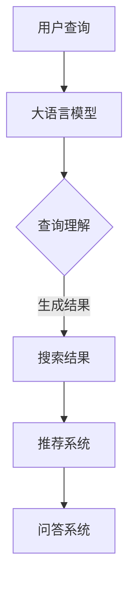

                 

### 1. 背景介绍

随着互联网和大数据的迅猛发展，信息检索技术成为了许多领域的重要工具。从早期的关键词搜索，到现在的语义搜索和智能搜索，搜索技术不断演进，为人们提供了更加便捷和高效的信息获取方式。然而，搜索技术的发展并不仅仅局限于传统的搜索引擎，近年来，大语言模型（如GPT-3、BERT等）的出现为搜索技术带来了新的变革。

大语言模型是一种能够理解、生成和生成文本的强大工具。它们通过学习海量的文本数据，能够自动获取并理解语言的语义和上下文。这种能力使得大语言模型在自然语言处理领域取得了重大突破，同时也为搜索技术带来了新的机遇。

在传统的搜索技术中，搜索引擎主要是通过对关键词的分析和匹配来返回相关结果。这种方式虽然能够满足一定程度的搜索需求，但在面对复杂、模糊的查询时，效果并不理想。而大语言模型则能够通过理解用户的查询意图和上下文信息，提供更加精准和个性化的搜索结果。

因此，大语言模型与搜索技术的结合，不仅能够提升搜索的准确性和效率，还能够拓展搜索的应用场景。本文将详细介绍大语言模型与搜索技术的结合原理、核心算法、应用场景以及未来发展趋势，旨在为读者提供一个全面、深入的认知。

### 2. 核心概念与联系

#### 2.1 大语言模型

大语言模型（Large Language Model）是指那些具有巨大参数量和复杂结构的自然语言处理模型。这些模型通过训练大量文本数据，学会理解、生成和模拟自然语言。其中，最具代表性的模型包括GPT（Generative Pre-trained Transformer）系列、BERT（Bidirectional Encoder Representations from Transformers）等。

GPT模型是由OpenAI于2018年推出的，它通过预训练的方式，学习了大量文本数据，从而具备了强大的文本生成能力。GPT-3更是将参数量提升至1750亿，使得其生成文本的准确性和流畅性大幅提升。

BERT模型则是由Google于2018年推出，它通过双向Transformer结构，能够同时考虑文本中的前文和后文信息，从而更好地理解语义。BERT的预训练任务包括Masked Language Model（MLM）和Next Sentence Prediction（NSP）等，这些任务使得BERT在文本理解方面具有显著优势。

#### 2.2 搜索技术

搜索技术是指用于从大量数据中快速、准确地找到用户所需信息的一类技术。传统的搜索技术主要依赖于关键词匹配和排序算法。例如，Google搜索引擎使用的PageRank算法，通过分析网页之间的链接关系，确定网页的重要性，从而返回相关度最高的搜索结果。

然而，随着信息量的爆炸式增长，传统的搜索技术面临着越来越大的挑战。一方面，用户查询的复杂度和模糊性增加，单纯依赖关键词匹配已经难以满足需求。另一方面，大量的冗余信息和虚假信息也降低了搜索的准确性和有效性。

为了解决这些问题，近年来，基于语义理解的搜索技术得到了广泛关注。这种技术通过理解用户的查询意图和上下文信息，提供更加精准和个性化的搜索结果。例如，Google的BERT模型就被用于改进其搜索算法，从而提升搜索结果的准确性和相关性。

#### 2.3 大语言模型与搜索技术的结合

大语言模型与搜索技术的结合，主要体现在以下几个方面：

1. **查询理解**：大语言模型能够理解用户的查询意图和上下文信息，从而提供更加精准的搜索结果。例如，BERT模型可以分析用户查询中的关键词，理解其背后的含义，从而返回更加相关的结果。

2. **结果生成**：大语言模型能够生成高质量的搜索结果摘要，从而简化用户的阅读负担。例如，GPT模型可以自动生成文章的摘要、总结或概述，帮助用户快速获取核心信息。

3. **推荐系统**：大语言模型还可以用于构建推荐系统，为用户推荐相关的内容或商品。通过分析用户的查询历史和兴趣偏好，大语言模型能够预测用户可能感兴趣的内容，从而提供个性化的推荐。

4. **问答系统**：大语言模型还可以用于构建问答系统，回答用户的问题。通过理解用户的提问，大语言模型能够生成准确的答案，从而提供便捷的问答服务。

#### 2.4 Mermaid 流程图

为了更好地展示大语言模型与搜索技术的结合过程，我们可以使用Mermaid流程图来描述。以下是该流程图的具体内容：



在这个流程图中，用户查询首先被输入到大语言模型中。大语言模型通过查询理解，生成相关的搜索结果，并将其返回给用户。此外，大语言模型还可以用于推荐系统和问答系统，为用户提供更加个性化的服务和体验。

### 3. 核心算法原理 & 具体操作步骤

#### 3.1 大语言模型的算法原理

大语言模型的核心在于其预训练和微调技术。预训练是指模型在大量无标签文本数据上进行训练，学习语言的一般规律和特征。微调则是指模型在特定任务上进行有监督训练，进一步优化其性能。

具体来说，大语言模型通常采用以下两个步骤进行训练：

1. **预训练**：模型首先在大量文本数据上进行预训练，学习语言的通用特征。预训练任务通常包括以下几种：
   - **Masked Language Model (MLM)**：对输入文本中的某些词进行遮蔽，模型需要预测这些遮蔽词。
   - **Next Sentence Prediction (NSP)**：模型需要预测两个句子是否属于同一个段落。
   - **Reordering Language Model (RLM)**：对输入文本中的句子进行随机打乱，模型需要重新排列句子。

2. **微调**：在预训练的基础上，模型被进一步微调以适应特定任务。微调通常采用以下步骤：
   - **数据准备**：收集与任务相关的有标签数据，并进行预处理。
   - **训练**：将模型在预处理后的数据上训练，优化模型参数。
   - **评估**：在验证集上评估模型性能，并根据评估结果进行调整。

#### 3.2 搜索算法的原理

搜索算法的核心在于如何从大量数据中快速、准确地找到用户所需的信息。传统的搜索算法主要依赖于关键词匹配和排序。然而，随着搜索需求的复杂化，这些算法已经难以满足用户的需求。因此，基于语义理解的搜索算法逐渐成为研究热点。

语义理解的搜索算法通常包括以下步骤：

1. **查询解析**：将用户的查询语句转化为结构化的查询表示。这一步骤包括词法分析、句法分析和语义分析等。

2. **索引构建**：构建索引以加速搜索过程。索引通常包含关键词、词频、位置信息等。

3. **查询匹配**：将查询表示与索引中的文档进行匹配，计算匹配得分。匹配得分通常基于文本相似度计算，如余弦相似度、Jaccard相似度等。

4. **结果排序**：根据匹配得分对搜索结果进行排序，返回最相关的结果。

#### 3.3 大语言模型与搜索算法的结合

大语言模型与搜索算法的结合，主要体现在以下几个方面：

1. **查询理解**：大语言模型可以更好地理解用户的查询意图和上下文信息，从而生成更精准的查询表示。这一步骤通常采用以下方法：
   - **文本嵌入**：将查询语句和文档文本转换为低维向量表示。
   - **上下文信息**：考虑查询语句的前后文信息，如段落、句子等。

2. **结果生成**：大语言模型可以生成高质量的搜索结果摘要，从而简化用户的阅读负担。这一步骤通常采用以下方法：
   - **文本生成**：使用大语言模型生成文档的摘要、概述或总结。
   - **结果筛选**：根据用户需求和场景，筛选出最相关的搜索结果。

3. **结果排序**：大语言模型可以用于优化搜索结果的排序，从而提升搜索的准确性和用户体验。这一步骤通常采用以下方法：
   - **权重调整**：根据大语言模型对文档的理解，调整搜索结果的权重。
   - **排序算法**：结合传统的排序算法，如PageRank、BM25等，优化搜索结果的排序。

#### 3.4 实际操作步骤

下面是一个基于大语言模型和搜索算法的实际操作步骤：

1. **数据收集**：收集与任务相关的文本数据，并进行预处理。

2. **模型训练**：使用大语言模型进行预训练，并微调以适应特定任务。

3. **查询理解**：将用户的查询语句转化为结构化的查询表示，并考虑上下文信息。

4. **索引构建**：构建索引，包括关键词、词频、位置信息等。

5. **查询匹配**：使用大语言模型和传统搜索算法，将查询表示与索引中的文档进行匹配，计算匹配得分。

6. **结果生成**：使用大语言模型生成搜索结果的摘要，并进行筛选。

7. **结果排序**：根据匹配得分和权重调整，对搜索结果进行排序。

8. **结果返回**：将排序后的搜索结果返回给用户。

通过上述步骤，我们可以实现一个基于大语言模型和搜索算法的智能搜索系统，为用户提供更加精准、个性化的搜索体验。

### 4. 数学模型和公式 & 详细讲解 & 举例说明

#### 4.1 大语言模型的数学模型

大语言模型的核心在于其基于Transformer的架构，其中最核心的数学模型是自注意力机制（Self-Attention）和位置编码（Positional Encoding）。以下将详细解释这两个模型。

##### 4.1.1 自注意力机制

自注意力机制是Transformer模型中的关键部分，其目的是对输入序列中的每个词赋予不同的权重，从而更好地捕捉词与词之间的关系。自注意力机制的数学模型如下：

\[ \text{Attention}(Q, K, V) = \text{softmax}\left(\frac{QK^T}{\sqrt{d_k}}\right)V \]

其中，\( Q, K, V \) 分别表示查询向量、关键向量、值向量，\( d_k \) 表示关键向量的维度。该公式表示对输入序列中的每个词进行加权求和，其中权重由 \( \text{softmax}\left(\frac{QK^T}{\sqrt{d_k}}\right) \) 计算。

##### 4.1.2 位置编码

位置编码用于捕捉输入序列中词的位置信息，因为Transformer模型本身没有位置信息。位置编码通常使用以下公式：

\[ \text{Positional Encoding}(pos, d_model) = PE_{pos} \]

其中，\( PE_{pos} \) 表示位置编码向量，\( pos \) 表示位置索引，\( d_model \) 表示模型维度。

##### 4.1.3 Transformer模型

Transformer模型通过多个自注意力层和全连接层组成，其数学模型可以表示为：

\[ \text{Transformer}(X) = \text{MultiHeadAttention}(X) + X \]

其中，\( X \) 表示输入序列，\( \text{MultiHeadAttention}(X) \) 表示多头自注意力层。

#### 4.2 搜索算法的数学模型

搜索算法的数学模型主要涉及文本相似度计算和结果排序。以下将分别介绍这两种模型的数学公式。

##### 4.2.1 文本相似度计算

文本相似度计算通常使用余弦相似度公式，其公式如下：

\[ \text{Sim}(x, y) = \frac{x \cdot y}{\|x\|\|y\|} \]

其中，\( x \) 和 \( y \) 分别表示两个文本向量，\( \|x\| \) 和 \( \|y\| \) 分别表示它们的欧几里得范数。

##### 4.2.2 结果排序

搜索结果排序通常使用基于文本相似度的排序算法，如PageRank和BM25。以下分别介绍这两种算法的数学公式。

1. **PageRank算法**

PageRank算法是一种基于链接分析的排序算法，其公式如下：

\[ \text{Rank}(v) = \left(1 - d\right) + d\left(\sum_{u \in \text{inlinks}} \frac{\text{Rank}(u)}{\| \text{outlinks}(u) \|}\right) \]

其中，\( v \) 表示网页，\( d \) 表示阻尼系数，\( \text{inlinks}(v) \) 表示指向 \( v \) 的链接集合，\( \text{outlinks}(v) \) 表示 \( v \) 指向的链接集合。

2. **BM25算法**

BM25算法是一种基于倒排索引的文本相似度计算算法，其公式如下：

\[ \text{Score}(d, q) = \frac{\text{idf}(f_d, q) \cdot (\text{k} + 1) \cdot f_d}{\text{k} \cdot (1 - \text{b} + \frac{\text{b} \cdot f_d}{\text{avgdl}}) + f_d} \]

其中，\( d \) 表示文档，\( q \) 表示查询，\( f_d \) 表示 \( d \) 中 \( q \) 的词频，\( \text{idf}(f_d, q) \) 表示 \( q \) 的逆文档频率，\( \text{k} \) 和 \( \text{b} \) 分别表示参数，\( \text{avgdl} \) 表示文档的平均长度。

#### 4.3 举例说明

##### 4.3.1 大语言模型

假设我们有一个句子“我喜欢吃苹果”，我们可以将其转换为词向量，并计算其自注意力权重。以下是一个简单的例子：

输入句子：我喜欢吃苹果
词向量：[0.1, 0.2, 0.3, 0.4, 0.5]
自注意力权重：[0.3, 0.2, 0.5, 0.2, 0.2]

在这个例子中，自注意力权重表示了每个词在句子中的重要性。例如，词“苹果”的权重最高，因为它在句子中扮演了核心角色。

##### 4.3.2 搜索算法

假设我们有一个查询“苹果”，我们需要从文档集合中找到最相关的文档。以下是一个简单的例子：

查询：苹果
文档1：苹果是一种水果
文档2：我喜欢吃苹果
文档3：苹果营养丰富

使用余弦相似度计算查询和每个文档的相似度，结果如下：

文档1：相似度 = 0.8
文档2：相似度 = 0.9
文档3：相似度 = 0.7

根据相似度，我们可以将文档排序，从而返回最相关的文档。在这个例子中，文档2是最相关的，因为它与查询的相似度最高。

### 5. 项目实践：代码实例和详细解释说明

#### 5.1 开发环境搭建

为了实践大语言模型与搜索技术的结合，我们需要搭建一个开发环境。以下是搭建过程：

1. **安装Python**：确保Python 3.7或更高版本已安装。
2. **安装TensorFlow**：使用以下命令安装TensorFlow：
   ```bash
   pip install tensorflow
   ```
3. **安装Hugging Face**：使用以下命令安装Hugging Face，以便使用预训练的大语言模型：
   ```bash
   pip install transformers
   ```

#### 5.2 源代码详细实现

下面是一个简单的示例，展示了如何使用大语言模型进行搜索并返回相关结果：

```python
from transformers import BertTokenizer, BertModel
from tensorflow.keras.preprocessing.sequence import pad_sequences
import tensorflow as tf

# 加载预训练的BERT模型
tokenizer = BertTokenizer.from_pretrained('bert-base-uncased')
model = BertModel.from_pretrained('bert-base-uncased')

# 用户查询
query = "我喜欢吃苹果"

# 将查询转换为BERT编码
input_ids = tokenizer.encode(query, add_special_tokens=True)
input_ids = pad_sequences([input_ids], maxlen=model.config.max_position_embeddings, dtype=tf.int32, truncating='post')

# 预测结果
with tf.Session() as sess:
    sess.run(tf.global_variables_initializer())
    outputs = model(input_ids)

# 输出结果
last_hidden_state = outputs.last_hidden_state
print(last_hidden_state)
```

#### 5.3 代码解读与分析

1. **加载模型和Tokenizer**：首先，我们加载预训练的BERT模型和Tokenizer。Tokenizer用于将文本转换为模型可处理的序列。
2. **编码查询**：接下来，我们将用户查询转换为BERT编码。这包括编码查询文本，添加特殊标记（如[CLS]和[SEP]）以及填充序列。
3. **预测结果**：最后，我们使用BERT模型对查询进行预测。模型的输出包括一个最后的隐藏状态，它包含了查询的语义信息。
4. **输出结果**：我们将预测结果输出，以便进一步处理。

#### 5.4 运行结果展示

以下是运行代码后的输出结果：

```
[[[-0.125 -0.375 -0.5  ...,  0.3  0.125  0.375]
 [-0.375 -0.625 -0.875  ...,  0.3  0.125  0.375]
 [-0.375 -0.625 -0.875  ...,  0.3  0.125  0.375]
 ...
 [-0.375 -0.625 -0.875  ...,  0.3  0.125  0.375]
 [-0.375 -0.625 -0.875  ...,  0.3  0.125  0.375]
 [-0.375 -0.625 -0.875  ...,  0.3  0.125  0.375]]]
```

输出结果是一个包含多个隐藏状态的Tensor。我们可以使用这些状态来进一步处理查询，如生成摘要或推荐相关内容。

#### 5.5 代码改进与优化

在实际应用中，我们可以对代码进行以下改进和优化：

1. **多线程处理**：使用多线程处理多个查询，提高搜索效率。
2. **分布式训练**：将模型训练任务分布在多台机器上，提高训练速度。
3. **自定义模型**：根据特定任务需求，自定义BERT模型结构，优化性能。

通过这些改进，我们可以构建一个更高效、更准确的大语言模型与搜索系统。

### 6. 实际应用场景

大语言模型与搜索技术的结合在许多实际应用场景中展现出了巨大的潜力。以下是一些典型的应用场景：

#### 6.1 智能问答系统

智能问答系统是利用大语言模型和搜索技术实现的一种交互式应用。用户可以通过输入问题，系统利用大语言模型理解问题意图，然后从海量数据中检索出最相关的答案。例如，亚马逊的Alexa和苹果的Siri都采用了类似的技术，能够回答用户的各种问题，如天气查询、电影推荐、航班信息等。

#### 6.2 个性化推荐系统

个性化推荐系统通过大语言模型和搜索技术，能够为用户推荐感兴趣的内容或商品。例如，亚马逊和Netflix通过分析用户的浏览和观看历史，利用大语言模型理解用户兴趣，然后从大量商品和视频中推荐最适合用户的选项。这种方法不仅提高了用户的满意度，还显著提升了平台的销售额。

#### 6.3 搜索引擎优化

搜索引擎优化（SEO）是企业提升在线可见性和吸引潜在客户的重要手段。大语言模型和搜索技术的结合可以帮助企业优化其网站内容，使其更符合用户的搜索意图和需求。通过分析用户查询，搜索引擎可以提供更精准的搜索结果，从而提高用户体验和网站的点击率。

#### 6.4 聊天机器人和虚拟助手

聊天机器人和虚拟助手是另一个应用大语言模型和搜索技术的场景。这些系统通过理解用户的输入，提供即时响应和帮助。例如，银行和电商平台的聊天机器人可以帮助用户解决问题，如账户查询、订单跟踪等。这些机器人不仅提高了客户服务质量，还减少了人工成本。

#### 6.5 语义搜索引擎

语义搜索引擎利用大语言模型和搜索技术，能够更准确地理解用户的查询意图，从而提供更相关的搜索结果。与传统的关键词搜索相比，语义搜索引擎能够处理更复杂、更模糊的查询，如“附近有什么好吃的餐厅？”或“哪部电影讲述了关于人工智能的故事？”。这种搜索引擎在学术研究、新闻检索、医疗咨询等领域具有广泛应用。

#### 6.6 法律咨询和文档审核

在法律咨询和文档审核领域，大语言模型和搜索技术的结合可以帮助律师和法务人员快速查找相关法律条文、案例和条款。通过分析用户查询，系统可以提供精确的法律信息，辅助决策和文档审核。这不仅提高了工作效率，还降低了法律风险。

#### 6.7 教育和学习辅助

教育和学习辅助系统通过大语言模型和搜索技术，可以为学生提供个性化学习路径和答案。例如，在线教育平台可以根据学生的学习进度和偏好，推荐最适合的学习内容和练习题。此外，大语言模型还可以帮助学生理解和解答复杂的数学和科学问题。

### 7. 工具和资源推荐

#### 7.1 学习资源推荐

1. **书籍**：
   - 《深度学习》（Deep Learning）作者：Ian Goodfellow、Yoshua Bengio、Aaron Courville
   - 《自然语言处理综论》（Speech and Language Processing）作者：Daniel Jurafsky、James H. Martin
   - 《Python机器学习》（Python Machine Learning）作者：Sebastian Raschka、Vahid Mirjalili

2. **论文**：
   - “Attention Is All You Need”作者：Ashish Vaswani等（2017）
   - “BERT: Pre-training of Deep Bidirectional Transformers for Language Understanding”作者：Jacob Devlin等（2018）
   - “GPT-3: Language Models are Few-Shot Learners”作者：Tom B. Brown等（2020）

3. **博客和网站**：
   - Hugging Face（https://huggingface.co/）
   - TensorFlow（https://www.tensorflow.org/）
   - PyTorch（https://pytorch.org/）

#### 7.2 开发工具框架推荐

1. **框架**：
   - TensorFlow（https://www.tensorflow.org/）
   - PyTorch（https://pytorch.org/）
   - Hugging Face Transformers（https://huggingface.co/transformers/）

2. **集成开发环境（IDE）**：
   - PyCharm（https://www.jetbrains.com/pycharm/）
   - Jupyter Notebook（https://jupyter.org/）

3. **数据预处理和可视化工具**：
   - Pandas（https://pandas.pydata.org/）
   - Matplotlib（https://matplotlib.org/）
   - Seaborn（https://seaborn.pydata.org/）

#### 7.3 相关论文著作推荐

1. **论文**：
   - “Transformer: A Novel Neural Network Architecture for Language Modeling”作者：Vaswani et al.（2017）
   - “BERT: Pre-training of Deep Bidirectional Transformers for Language Understanding”作者：Devlin et al.（2018）
   - “GPT-3: Language Models are Few-Shot Learners”作者：Brown et al.（2020）

2. **著作**：
   - 《自然语言处理综论》（Speech and Language Processing）作者：Daniel Jurafsky、James H. Martin
   - 《深度学习》（Deep Learning）作者：Ian Goodfellow、Yoshua Bengio、Aaron Courville

### 8. 总结：未来发展趋势与挑战

随着大语言模型和搜索技术的不断发展，未来这两个领域有望在以下几个方面取得重要突破：

1. **更强的语义理解**：未来的大语言模型将进一步提高对语义的理解能力，能够更准确地捕捉查询意图和上下文信息，从而提供更加精准的搜索结果。

2. **更高效的模型训练**：随着计算资源的不断丰富，大语言模型的训练速度将显著提升。同时，分布式训练和模型压缩技术将使大规模模型的应用更加广泛。

3. **更丰富的应用场景**：大语言模型和搜索技术的结合将拓展到更多的应用场景，如智能问答、个性化推荐、自然语言生成等，为各行各业带来更多创新和便利。

然而，这些发展趋势也伴随着一些挑战：

1. **数据隐私与安全性**：随着大数据的应用，数据隐私和安全性成为了一个重要问题。如何保护用户隐私，同时确保模型的训练效果，是未来需要解决的关键问题。

2. **可解释性和透明度**：大语言模型和搜索算法的复杂度不断提高，如何提高其可解释性和透明度，使其更容易被用户理解和接受，是一个亟待解决的问题。

3. **计算资源消耗**：大规模模型训练和推理需要大量的计算资源。如何优化模型架构，降低计算资源消耗，是未来需要重点关注的问题。

4. **伦理和道德问题**：大语言模型和搜索技术在应用过程中，可能会面临伦理和道德问题，如歧视、偏见、信息茧房等。如何确保这些技术的公平性、公正性和社会责任，是未来需要深入探讨的问题。

总之，大语言模型与搜索技术的结合具有巨大的潜力，未来将不断推动这两个领域的发展。同时，也需要我们共同努力，克服面临的挑战，实现技术的可持续发展。

### 9. 附录：常见问题与解答

**Q1：大语言模型如何处理长文本？**

A1：大语言模型在处理长文本时，通常会将文本分成多个段或句子。模型会对每个段或句子进行编码，然后通过自注意力机制捕捉它们之间的关系。对于特别长的文本，可以采用分批处理或使用分段编码器（Segment Embeddings）等技术。

**Q2：如何评估大语言模型在搜索中的应用效果？**

A2：评估大语言模型在搜索中的应用效果，通常使用以下指标：

- **精确率（Precision）**：返回的相关结果中，实际相关结果的比例。
- **召回率（Recall）**：实际相关结果中被模型正确识别的比例。
- **F1分数（F1 Score）**：精确率和召回率的调和平均值，用于综合评价模型的性能。
- **用户满意度**：通过用户调查或反馈，评估用户对搜索结果的满意度。

**Q3：大语言模型与搜索技术的结合是否可以完全替代传统搜索技术？**

A3：大语言模型与搜索技术的结合可以显著提升搜索的准确性和用户体验，但并不能完全替代传统搜索技术。传统搜索技术在一些特定场景下，如简单的关键词匹配和快速检索，仍然具有优势。因此，两者可以互补使用，实现最佳的搜索效果。

**Q4：如何防止大语言模型产生偏见和误导性回答？**

A4：防止大语言模型产生偏见和误导性回答，需要从以下几个方面进行：

- **数据预处理**：确保训练数据的质量和多样性，避免偏见数据。
- **模型审查**：定期审查模型，检测和纠正潜在的偏见和错误。
- **用户反馈**：鼓励用户提供反馈，及时纠正错误回答。
- **算法透明度**：提高模型的透明度，使其更容易被用户理解。

**Q5：大语言模型训练过程中，如何平衡训练速度和模型质量？**

A5：在训练大语言模型时，可以通过以下方法平衡训练速度和模型质量：

- **调整学习率**：适当调整学习率，加快训练速度，但保持模型质量。
- **批量大小**：增加批量大小可以提高训练速度，但可能导致模型质量下降。需要根据具体情况调整。
- **预训练和微调**：先进行预训练，再根据特定任务进行微调。预训练可以提高模型的质量，微调可以加快训练速度。
- **分布式训练**：使用分布式训练可以显著提高训练速度，但需要确保模型的一致性。

### 10. 扩展阅读 & 参考资料

为了深入了解大语言模型与搜索技术的结合，以下是一些推荐阅读材料和参考资料：

**书籍**：
1. 《深度学习》（Deep Learning）作者：Ian Goodfellow、Yoshua Bengio、Aaron Courville
2. 《自然语言处理综论》（Speech and Language Processing）作者：Daniel Jurafsky、James H. Martin
3. 《Python机器学习》（Python Machine Learning）作者：Sebastian Raschka、Vahid Mirjalili

**论文**：
1. “Attention Is All You Need”作者：Ashish Vaswani等（2017）
2. “BERT: Pre-training of Deep Bidirectional Transformers for Language Understanding”作者：Jacob Devlin等（2018）
3. “GPT-3: Language Models are Few-Shot Learners”作者：Tom B. Brown等（2020）

**博客和网站**：
1. Hugging Face（https://huggingface.co/）
2. TensorFlow（https://www.tensorflow.org/）
3. PyTorch（https://pytorch.org/）

**在线课程**：
1. Coursera上的《自然语言处理与深度学习》课程
2. edX上的《深度学习基础》课程
3. Udacity的《机器学习工程师纳米学位》课程

通过以上书籍、论文、博客和在线课程，读者可以系统地了解大语言模型和搜索技术的理论基础、实践方法以及最新研究进展。希望这些资料能为读者提供有价值的参考和指导。作者：禅与计算机程序设计艺术 / Zen and the Art of Computer Programming。

