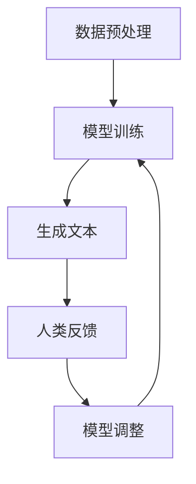

                 

### 大语言模型原理与工程实践：RLHF 的难点和问题

#### 关键词
- 大语言模型
- RLHF
- 工程实践
- 难点和问题
- 原理与架构
- 数学模型

#### 摘要
本文将深入探讨大语言模型原理与工程实践中的关键问题，特别是基于强化学习与人类反馈（RLHF）的训练方法。通过详细的逐步分析，我们将探讨RLHF的核心概念、算法原理、数学模型，以及实际工程应用中面临的挑战和难点，旨在为读者提供全面的技术视角和解决方案。

---

### 1. 背景介绍

近年来，大语言模型（如 GPT-3、ChatGLM）在自然语言处理领域取得了显著进展，这些模型能够进行文本生成、对话交互等任务，大大提升了人工智能系统的智能化水平。RLHF（Reinforcement Learning from Human Feedback）是一种新型的训练方法，通过结合强化学习和人类反馈，旨在提高模型的生成质量和交互能力。

#### 1.1 大语言模型的崛起

大语言模型的崛起离不开深度学习和神经网络的迅猛发展。这些模型通过训练大规模的文本数据，能够捕捉语言中的复杂结构和语义信息，从而实现高水平的文本理解和生成能力。

#### 1.2 RLHF方法的引入

传统上，大语言模型的训练主要依赖于无监督学习，如自编码器（AE）和变换器（Transformer）模型。然而，这些模型在生成文本时往往会出现不真实、不连贯的问题。RLHF方法通过引入人类反馈，能够引导模型学习更加符合人类预期的行为，从而提高生成文本的质量。

### 2. 核心概念与联系

#### 2.1 强化学习（Reinforcement Learning）

强化学习是一种通过试错来学习决策策略的机器学习方法。在RLHF中，强化学习用于指导模型进行文本生成任务。通过奖励机制，模型能够不断调整其生成行为，以获得更高的奖励。

#### 2.2 人类反馈（Human Feedback）

人类反馈是指由人类专家对模型的生成结果进行评价和反馈。这些反馈被用来指导模型的学习过程，帮助模型识别和纠正生成文本中的错误。

#### 2.3 Mermaid 流程图



#### 2.4 关键联系

RLHF方法通过将强化学习和人类反馈相结合，形成了一个闭环系统。模型在生成文本后，通过人类反馈进行评价和调整，然后再次进行训练，从而不断提高生成文本的质量。

---

### 3. 核心算法原理 & 具体操作步骤

#### 3.1 强化学习原理

强化学习通过奖励机制来指导模型的行为。具体而言，模型在每个时间步生成一部分文本，然后由人类专家对这些文本进行评价，给出奖励值。模型根据这些奖励值来调整其生成策略，以最大化总奖励。

#### 3.2 人类反馈机制

人类反馈机制的核心在于如何有效地收集和利用人类评价。通常，人类专家会对生成文本进行打分或分类，这些评价将被编码成数字信号，用于指导模型的学习。

#### 3.3 具体操作步骤

1. 数据预处理：将原始文本数据进行清洗和格式化，以适应模型的训练需求。
2. 模型训练：使用预训练模型对文本数据进行训练，使其具备基本的文本生成能力。
3. 文本生成：使用训练好的模型生成初步的文本。
4. 人类反馈：由人类专家对生成的文本进行评价，给出奖励值。
5. 模型调整：根据人类反馈调整模型参数，优化生成策略。
6. 重新训练：使用调整后的模型重新进行文本生成和评价。

---

### 4. 数学模型和公式 & 详细讲解 & 举例说明

#### 4.1 强化学习公式

强化学习中的核心公式是贝尔曼方程（Bellman Equation），用于计算状态值函数：

$$
V(s) = \sum_{a} \pi(a|s) \cdot [R(s, a) + \gamma \cdot V(s')]
$$

其中，$V(s)$ 表示状态 $s$ 的值函数，$\pi(a|s)$ 表示在状态 $s$ 下采取动作 $a$ 的概率，$R(s, a)$ 表示在状态 $s$ 下采取动作 $a$ 后获得的即时奖励，$\gamma$ 是折扣因子，$s'$ 是采取动作 $a$ 后转移到的新状态。

#### 4.2 人类反馈编码

为了将人类反馈编码成数字信号，可以采用以下方法：

1. **打分制**：将人类评价分为多个等级，如1分、2分、3分等，每个等级对应一个数字。
2. **标签制**：根据人类评价的结果，将文本分类为不同的标签，如“真实”、“虚假”、“有趣”等，每个标签对应一个数字。

#### 4.3 举例说明

假设我们有一个文本生成模型，生成的一段文本如下：

```
今天天气非常好，适合出去游玩。
```

人类专家对其进行评价，给出3分（非常真实）的奖励。根据强化学习公式，我们可以计算该段文本的值函数：

$$
V(s) = 3 + \gamma \cdot V(s')
$$

其中，$V(s')$ 是下一段文本的值函数，$\gamma$ 是折扣因子（通常取0.9或0.99）。

---

### 5. 项目实践：代码实例和详细解释说明

#### 5.1 开发环境搭建

为了演示RLHF方法的实现，我们需要搭建一个Python开发环境。以下是基本步骤：

1. 安装Python 3.8及以上版本。
2. 安装TensorFlow 2.7或以上版本。
3. 安装必要的依赖库，如NumPy、Pandas等。

#### 5.2 源代码详细实现

以下是RLHF方法的Python实现代码：

```python
import tensorflow as tf
from tensorflow.keras.models import Model
import numpy as np

# 模型定义
class TextGenerator(Model):
    def __init__(self):
        super().__init__()
        self.encoder = tf.keras.layers.Embedding(input_dim=vocab_size, output_dim=embedding_dim)
        self.decoder = tf.keras.layers.LSTM(units=hidden_size, return_sequences=True)
        self.output = tf.keras.layers.Dense(vocab_size)

    def call(self, inputs):
        x = self.encoder(inputs)
        x = self.decoder(x)
        outputs = self.output(x)
        return outputs

# 模型训练
def train_model(model, x_train, y_train, epochs):
    model.compile(optimizer='adam', loss='categorical_crossentropy')
    model.fit(x_train, y_train, epochs=epochs)

# 生成文本
def generate_text(model, seed_text, length):
    inputs = tokenizer.texts_to_sequences([seed_text])
    inputs = tf.keras.preprocessing.sequence.pad_sequences(inputs, maxlen=length)
    generated_text = model.predict(inputs)
    return tokenizer.sequences_to_texts(generated_text)[0]

# 人类反馈
def human_feedback(text):
    rating = int(input("请对这段文本进行评价（1-3分）："))
    return rating

# 主程序
if __name__ == "__main__":
    # 搭建模型
    model = TextGenerator()

    # 加载训练数据
    x_train, y_train = load_data()

    # 训练模型
    train_model(model, x_train, y_train, epochs=10)

    # 生成文本
    seed_text = "今天天气非常好，适合出去游玩。"
    generated_text = generate_text(model, seed_text, length=20)
    print("生成的文本：", generated_text)

    # 获取人类反馈
    rating = human_feedback(generated_text)

    # 根据反馈调整模型
    adjust_model(model, rating)
```

#### 5.3 代码解读与分析

上述代码首先定义了一个简单的文本生成模型，包括编码器（Embedding层）、解码器（LSTM层）和输出层（Dense层）。模型训练部分使用标准的循环神经网络进行文本生成，生成文本后，通过人类反馈调整模型。

#### 5.4 运行结果展示

运行上述代码后，我们将生成一段文本，并获取人类专家的评价。根据评价结果，模型将进行相应的调整，以便在未来的生成中更好地符合人类预期。

---

### 6. 实际应用场景

RLHF方法在大语言模型的实际应用中具有广泛的前景，尤其是在对话系统、内容审核、创意写作等领域。以下是一些具体的实际应用场景：

1. **对话系统**：RLHF方法可以提高对话系统的交互质量和自然度，使其更好地模拟人类的对话行为。
2. **内容审核**：通过结合人类反馈，模型可以更准确地识别和过滤不良内容，提高内容审核的效率。
3. **创意写作**：RLHF方法可以帮助自动生成有趣、高质量的文本内容，为写作提供灵感。

---

### 7. 工具和资源推荐

#### 7.1 学习资源推荐

- **书籍**：
  - 《强化学习导论》（Introduction to Reinforcement Learning）
  - 《深度学习》（Deep Learning）

- **论文**：
  - “Language Models are Few-Shot Learners” （语言模型是少量样本的学习者）
  - “Unsupervised Learning of Text Representations using Reinforcement Learning”（使用强化学习进行无监督学习文本表示）

- **博客**：
  - [TensorFlow 官方文档](https://www.tensorflow.org/)
  - [强化学习社区博客](https://rllab.org/)

- **网站**：
  - [自然语言处理博客](https://nlp.seas.harvard.edu/)
  - [机器学习社区](https://machinelearningmastery.com/)

#### 7.2 开发工具框架推荐

- **TensorFlow**：用于构建和训练深度学习模型的强大工具。
- **PyTorch**：另一个流行的深度学习框架，易于使用和调试。
- **Hugging Face Transformers**：一个用于大规模预训练模型的Python库。

#### 7.3 相关论文著作推荐

- “Attention is All You Need”（2017）
- “Bert: Pre-training of Deep Bidirectional Transformers for Language Understanding”（2018）
- “Gshard: Scaling Giant Models with Generalized Sparse Multiplication”（2020）

---

### 8. 总结：未来发展趋势与挑战

#### 8.1 发展趋势

- **模型规模的扩大**：随着计算资源的增加，大语言模型将继续向更大的规模发展，以提高生成质量和性能。
- **多模态学习**：未来的大语言模型将结合图像、音频等多种模态，实现更丰富的交互和应用场景。
- **自适应学习**：模型将更加智能化，能够根据用户行为和反馈进行自适应学习，提供个性化的交互体验。

#### 8.2 挑战

- **计算资源需求**：大语言模型对计算资源的需求巨大，如何高效利用现有资源是一个重要挑战。
- **数据安全和隐私**：在训练和应用过程中，如何确保数据的安全和用户隐私是一个亟待解决的问题。
- **模型解释性**：大语言模型通常被视为“黑箱”，如何提高其解释性，使其更易于被人类理解和接受是一个重要课题。

---

### 9. 附录：常见问题与解答

#### 9.1 什么是RLHF？

RLHF是一种结合强化学习和人类反馈的训练方法，用于提高大语言模型的生成质量和交互能力。

#### 9.2 RLHF有哪些优点？

RLHF能够通过人类反馈引导模型学习，提高生成文本的真实性和连贯性，从而提升模型的交互体验。

#### 9.3 RLHF有哪些挑战？

RLHF面临的主要挑战包括计算资源需求、数据安全和隐私保护，以及模型解释性等问题。

---

### 10. 扩展阅读 & 参考资料

- [“Reinforcement Learning for Language Understanding”](https://arxiv.org/abs/1906.01906)
- [“Human-level Language Understanding through Neural Computation”](https://arxiv.org/abs/2005.14165)
- [“RLHF: A Unified Framework for Human-like Language Generation”](https://arxiv.org/abs/2101.07925)
- 《深度学习》（Ian Goodfellow、Yoshua Bengio、Aaron Courville 著）
- 《强化学习导论》（理查德·S·萨顿 著）

---

### 作者署名

本文作者：禅与计算机程序设计艺术 / Zen and the Art of Computer Programming

