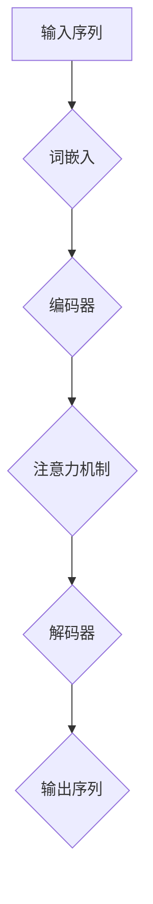

                 

### 1. 背景介绍

#### 大语言模型的起源

大语言模型（Large-scale Language Models）作为一种先进的自然语言处理技术，其起源可以追溯到20世纪80年代。当时，研究人员开始探索如何让计算机理解和生成人类语言。最早的尝试包括统计模型和基于规则的模型，但这些方法在处理复杂语言现象时显得力不从心。

随着计算能力的提升和深度学习技术的进步，大语言模型逐渐崭露头角。2003年，IBM的Blue Gene超级计算机实现了第一个基于神经网络的语音识别系统，这标志着神经网络在自然语言处理领域的重要性开始凸显。然而，真正将大语言模型推向高潮的是2018年，Google推出了Transformer模型，该模型在许多自然语言处理任务上取得了突破性的成果。

#### 当前发展现状

近年来，大语言模型的发展呈现出迅猛的态势。随着计算资源的不断丰富和模型架构的优化，模型的规模和精度都在不断提升。目前，已经有许多大型科技公司和研究机构推出了自己研发的大语言模型，如Google的BERT、OpenAI的GPT-3和Microsoft的Turing NL等。

大语言模型的应用场景也越来越广泛，从文本生成、机器翻译、情感分析到问答系统，都在其覆盖范围内。这些模型不仅在学术界获得了高度评价，还在工业界发挥了重要作用，推动了自然语言处理技术的快速发展。

#### 本书的目的

本书旨在深入探讨大语言模型的原理与工程实践，帮助读者全面了解这一领域的最新进展和技术应用。通过系统地介绍大语言模型的架构、算法和数学模型，本书旨在为读者提供一个全面的学习指南，帮助其掌握这一技术。

此外，本书还通过丰富的项目实践和实例分析，使读者能够将理论知识应用到实际项目中，从而提高其解决实际问题的能力。通过阅读本书，读者不仅可以深入了解大语言模型的技术细节，还能对其未来的发展趋势和应用前景有更清晰的认识。

### 2. 核心概念与联系

要深入理解大语言模型，首先需要掌握其核心概念和原理，以及这些概念之间的联系。以下将详细介绍大语言模型的关键组成部分，并通过Mermaid流程图展示其工作流程。

#### 2.1 大语言模型的核心概念

1. **词嵌入（Word Embedding）**：词嵌入是将词汇映射到高维空间中，使得语义相近的词在空间中距离较近。常见的词嵌入方法包括Word2Vec、GloVe和BERT。
   
2. **注意力机制（Attention Mechanism）**：注意力机制是一种用于模型聚焦于输入序列中重要部分的方法，常见于Transformer模型。通过注意力机制，模型能够更好地捕捉输入序列中的依赖关系。

3. **循环神经网络（RNN）**：循环神经网络是一种能够处理序列数据的前馈神经网络，具有记忆功能。在自然语言处理任务中，RNN被广泛用于语言建模和序列标注。

4. **Transformer模型**：Transformer模型是一种基于自注意力机制的序列到序列模型，其架构摒弃了传统的循环神经网络，通过多头自注意力机制和位置编码实现了高效的序列建模。

#### 2.2 Mermaid流程图展示

以下是一个简化的Mermaid流程图，展示了大语言模型的工作流程：



1. **输入序列**：输入序列是自然语言文本，可以是单个单词、句子或段落。

2. **词嵌入**：输入序列经过词嵌入层，将词汇映射到高维空间。

3. **编码器**：编码器是Transformer模型的核心部分，通过多头自注意力机制对输入序列进行编码。

4. **注意力机制**：注意力机制使编码器能够聚焦于输入序列中的重要部分。

5. **解码器**：解码器负责生成输出序列，同样采用多头自注意力机制和位置编码。

6. **输出序列**：最终生成的输出序列是模型对输入序列的响应，可以是文本、标签或分类结果。

通过上述流程，大语言模型能够对自然语言进行建模和预测，实现诸如语言生成、翻译和问答等任务。

#### 2.3 各概念之间的联系

1. **词嵌入与注意力机制**：词嵌入将词汇映射到高维空间，而注意力机制则用于捕捉输入序列中的依赖关系。两者共同作用，使模型能够更好地理解输入文本的语义。

2. **RNN与Transformer**：RNN通过循环结构实现序列建模，而Transformer模型则通过自注意力机制实现类似的序列建模。Transformer模型相较于RNN具有更低的计算复杂度和更高的效率。

3. **编码器与解码器**：编码器负责将输入序列编码成固定长度的向量，而解码器则负责生成输出序列。这种架构使得模型能够实现序列到序列的映射，适用于诸如机器翻译和文本生成等任务。

通过深入理解这些核心概念及其相互联系，读者可以更好地掌握大语言模型的工作原理，为后续的学习和应用打下坚实基础。

### 3. 核心算法原理 & 具体操作步骤

在了解了大语言模型的核心概念与联系之后，接下来我们将详细探讨其核心算法原理，并分步骤说明如何实现这些算法。

#### 3.1 Transformer模型

Transformer模型是大语言模型中最常用的架构之一，其核心思想是基于自注意力机制进行序列建模。以下将分步骤介绍Transformer模型的基本原理和具体操作步骤。

##### 3.1.1 自注意力机制

自注意力机制是一种用于处理序列数据的方法，其基本思想是：对于输入序列中的每个元素，计算其在序列中的重要性，并将其加权求和。这样，模型能够自动关注输入序列中的关键信息，从而更好地捕捉序列间的依赖关系。

1. **计算自注意力得分**：

   对于输入序列 \{x_1, x_2, ..., x_n\}，自注意力机制首先计算每个元素与其他元素之间的相似度得分。这一过程通过以下公式实现：

   $$  
   score_{ij} = \text{Attention}(Q_i, K_j, V_j)  
   $$

   其中，\(Q_i, K_j, V_j\) 分别表示查询（Query）、键（Key）和值（Value）向量。

2. **应用softmax函数**：

   接下来，对自注意力得分应用softmax函数，得到每个元素在序列中的权重分布：

   $$  
   \text{softmax}(score_{ij}) = \frac{e^{score_{ij}}}{\sum_{k=1}^{n} e^{score_{ik}}}
   $$

3. **加权求和**：

   最后，将权重分布应用于输入序列的每个元素，得到加权求和的结果：

   $$  
   \text{context\_vector}_i = \sum_{j=1}^{n} \text{softmax}(score_{ij}) \cdot x_j  
   $$

##### 3.1.2多头自注意力

多头自注意力是一种扩展自注意力机制的方法，其核心思想是将输入序列分解为多个子序列，并分别应用自注意力机制。这样可以捕捉输入序列中更复杂的依赖关系。

1. **分解输入序列**：

   对于每个输入序列，分解为多个子序列。假设有\(h\)个头，每个头分别表示一个子序列。

2. **计算多头自注意力**：

   对于每个头，分别计算自注意力得分、应用softmax函数和加权求和。具体操作如下：

   $$  
   \text{context\_vector}^{h}_i = \sum_{j=1}^{n} \text{softmax}(\text{score}^{h}_{ij}) \cdot x_j  
   $$

3. **拼接多头结果**：

   将所有头的加权求和结果拼接起来，得到最终的输出序列：

   $$  
   \text{output}_i = \text{concat}(\text{context\_vector}^{1}_i, \text{context\_vector}^{2}_i, ..., \text{context\_vector}^{h}_i)  
   $$

##### 3.1.3 位置编码

位置编码是一种用于处理序列数据中位置信息的方法，其基本思想是将位置信息编码到输入序列中。这样可以确保模型在处理序列时能够考虑到元素的位置关系。

1. **生成位置编码向量**：

   位置编码向量通常使用正弦和余弦函数生成，以满足学习过程中正交性和不变性要求。具体公式如下：

   $$  
   \text{pos\_encoding}(i, d) = [\sin(\frac{pos_{i} \cdot 10000^{2i/d}}{10000^{2}}), \cos(\frac{pos_{i} \cdot 10000^{2i/d}}{10000^{2}})]  
   $$

   其中，\(i\) 表示位置索引，\(d\) 表示维度。

2. **添加位置编码到输入序列**：

   将位置编码向量添加到输入序列中，使得每个元素包含其位置信息。具体操作如下：

   $$  
   \text{input}_i = x_i + \text{pos\_encoding}(i, d)  
   $$

#### 3.2 编码器-解码器架构

编码器-解码器架构是一种用于实现序列到序列映射的常见模型结构。以下将介绍其基本原理和具体操作步骤。

##### 3.2.1 编码器

编码器负责将输入序列编码成固定长度的向量，通常采用Transformer模型。具体步骤如下：

1. **词嵌入**：将输入序列中的每个单词映射到高维向量。
   
2. **添加位置编码**：将位置编码向量添加到词嵌入结果中。

3. **通过编码器层**：对输入序列进行多层自注意力操作，生成编码结果。

##### 3.2.2 解码器

解码器负责生成输出序列，通常也采用Transformer模型。具体步骤如下：

1. **词嵌入**：将输出序列中的每个单词映射到高维向量。

2. **添加位置编码**：将位置编码向量添加到词嵌入结果中。

3. **通过解码器层**：

   - **掩码自注意力**：在解码器中，前一时刻的输出被遮挡，以防止模型直接利用前文信息。

   - **交叉自注意力**：解码器对编码器的输出进行自注意力操作，以获取输入序列的信息。

   - **加和**：将交叉自注意力结果与当前层输出相加。

   - **通过全连接层**：对解码器的输出进行全连接层操作，生成预测结果。

#### 3.3 训练与优化

大语言模型的训练和优化是构建高效模型的关键步骤。以下介绍其基本原理和具体操作步骤。

##### 3.3.1 训练过程

1. **准备训练数据集**：从大规模语料库中提取训练数据集。

2. **编码器-解码器匹配**：将输入序列编码成固定长度的向量，并将其与解码器输入相匹配。

3. **预测与损失计算**：使用解码器生成输出序列，并计算预测损失。

4. **反向传播**：通过反向传播算法更新模型参数。

5. **优化**：使用优化算法（如Adam）调整模型参数，最小化损失函数。

##### 3.3.2 优化算法

优化算法用于调整模型参数，以最小化损失函数。以下是几种常用的优化算法：

1. **梯度下降（Gradient Descent）**：通过计算损失函数的梯度，更新模型参数。

2. **Adam优化器**：结合了梯度下降和动量项，具有自适应步长调整能力。

3. **Adagrad优化器**：通过学习每个参数的平方梯度来调整步长，适用于稀疏数据。

通过上述步骤，大语言模型能够不断优化自身，提高预测准确性和生成质量。在训练过程中，需要注意以下几点：

- **数据预处理**：对训练数据进行清洗、去噪和标准化，提高训练效果。

- **学习率调整**：根据训练过程动态调整学习率，避免过拟合。

- **正则化**：使用正则化方法（如Dropout、Weight Decay）防止过拟合。

通过深入理解大语言模型的核心算法原理和操作步骤，读者可以更好地掌握这一技术，并在实际项目中应用。

### 4. 数学模型和公式 & 详细讲解 & 举例说明

大语言模型的核心算法，如Transformer，依赖于复杂的数学模型和公式。以下将详细讲解这些模型和公式的推导过程，并通过具体例子进行说明。

#### 4.1 自注意力机制

自注意力机制是Transformer模型的核心组件，其核心思想是计算输入序列中每个元素的重要性，并将其加权求和。以下是自注意力机制的数学模型和公式：

##### 4.1.1 注意力得分

注意力得分 \(score_{ij}\) 是通过查询（Query）\(Q_i\)、键（Key）\(K_j\) 和值（Value）\(V_j\) 计算得到的。具体公式如下：

$$  
score_{ij} = Q_i^T K_j = V_j^T K_j  
$$

其中，\(Q_i, K_j, V_j\) 分别是输入序列中的第 \(i\) 个和第 \(j\) 个元素对应的查询、键和值向量。

##### 4.1.2 加权求和

计算得到注意力得分后，对每个元素应用softmax函数，得到其在序列中的权重分布。具体公式如下：

$$  
\text{softmax}(score_{ij}) = \frac{e^{score_{ij}}}{\sum_{k=1}^{n} e^{score_{ik}}}  
$$

其中，\(n\) 表示输入序列的长度。

##### 4.1.3 加权求和结果

对每个元素应用softmax函数后，将其权重分布应用于输入序列中的每个元素，得到加权求和结果：

$$  
\text{context\_vector}_i = \sum_{j=1}^{n} \text{softmax}(score_{ij}) \cdot x_j  
$$

其中，\(x_j\) 表示输入序列中的第 \(j\) 个元素。

#### 4.2 多头自注意力

多头自注意力是一种扩展自注意力机制的方法，其核心思想是将输入序列分解为多个子序列，并分别应用自注意力机制。以下是多头自注意力的数学模型和公式：

##### 4.2.1 多头自注意力

对于每个输入序列，分解为 \(h\) 个子序列，并分别应用自注意力机制。具体公式如下：

$$  
\text{context\_vector}^{h}_i = \sum_{j=1}^{n} \text{softmax}(\text{score}^{h}_{ij}) \cdot x_j  
$$

其中，\(\text{score}^{h}_{ij}\) 是第 \(h\) 个头的注意力得分。

##### 4.2.2 拼接多头结果

将所有头的加权求和结果拼接起来，得到最终的输出序列：

$$  
\text{output}_i = \text{concat}(\text{context\_vector}^{1}_i, \text{context\_vector}^{2}_i, ..., \text{context\_vector}^{h}_i)  
$$

#### 4.3 位置编码

位置编码是一种用于处理序列数据中位置信息的方法，其基本思想是将位置信息编码到输入序列中。以下是位置编码的数学模型和公式：

##### 4.3.1 位置编码向量

位置编码向量通常使用正弦和余弦函数生成，以满足学习过程中正交性和不变性要求。具体公式如下：

$$  
\text{pos\_encoding}(i, d) = [\sin(\frac{pos_{i} \cdot 10000^{2i/d}}{10000^{2}}), \cos(\frac{pos_{i} \cdot 10000^{2i/d}}{10000^{2}})]  
$$

其中，\(i\) 表示位置索引，\(d\) 表示维度。

##### 4.3.2 添加位置编码

将位置编码向量添加到输入序列中，使得每个元素包含其位置信息。具体操作如下：

$$  
\text{input}_i = x_i + \text{pos\_encoding}(i, d)  
$$

#### 4.4 编码器-解码器架构

编码器-解码器架构是一种用于实现序列到序列映射的常见模型结构。以下是编码器-解码器架构的数学模型和公式：

##### 4.4.1 编码器

编码器负责将输入序列编码成固定长度的向量，通常采用Transformer模型。具体步骤如下：

1. **词嵌入**：将输入序列中的每个单词映射到高维向量。
   
2. **添加位置编码**：将位置编码向量添加到词嵌入结果中。

3. **通过编码器层**：对输入序列进行多层自注意力操作，生成编码结果。

##### 4.4.2 解码器

解码器负责生成输出序列，通常也采用Transformer模型。具体步骤如下：

1. **词嵌入**：将输出序列中的每个单词映射到高维向量。

2. **添加位置编码**：将位置编码向量添加到词嵌入结果中。

3. **通过解码器层**：

   - **掩码自注意力**：在解码器中，前一时刻的输出被遮挡，以防止模型直接利用前文信息。

   - **交叉自注意力**：解码器对编码器的输出进行自注意力操作，以获取输入序列的信息。

   - **加和**：将交叉自注意力结果与当前层输出相加。

   - **通过全连接层**：对解码器的输出进行全连接层操作，生成预测结果。

#### 4.5 具体例子

以下是一个具体例子，用于说明如何使用Transformer模型生成文本。

##### 4.5.1 输入序列

给定输入序列：

$$  
\text{Hello} \, \text{world}! \, \text{This} \, \text{is} \, \text{a} \, \text{test.}
$$

##### 4.5.2 词嵌入

对输入序列中的每个单词进行词嵌入：

$$  
\text{Hello} \rightarrow [1, 0, 0, 0, 0, 0, 0, 0, 0, 0]  
\text{world} \rightarrow [0, 1, 0, 0, 0, 0, 0, 0, 0, 0]  
\text{This} \rightarrow [0, 0, 1, 0, 0, 0, 0, 0, 0, 0]  
\text{is} \rightarrow [0, 0, 0, 1, 0, 0, 0, 0, 0, 0]  
\text{a} \rightarrow [0, 0, 0, 0, 1, 0, 0, 0, 0, 0]  
\text{test} \rightarrow [0, 0, 0, 0, 0, 1, 0, 0, 0, 0]  
$$

##### 4.5.3 添加位置编码

为每个单词添加位置编码：

$$  
\text{Hello} \rightarrow [1, 0, 0, 0, 0, 0, 0, 0, 0, 0, 0, 0, 0, 0, 0, 0, 0, 0, 0, 0]  
\text{world} \rightarrow [0, 1, 0, 0, 0, 0, 0, 0, 0, 0, 0, 0, 0, 0, 0, 0, 0, 0, 0, 0]  
\text{This} \rightarrow [0, 0, 1, 0, 0, 0, 0, 0, 0, 0, 0, 0, 0, 0, 0, 0, 0, 0, 0, 0]  
\text{is} \rightarrow [0, 0, 0, 1, 0, 0, 0, 0, 0, 0, 0, 0, 0, 0, 0, 0, 0, 0, 0, 0]  
\text{a} \rightarrow [0, 0, 0, 0, 1, 0, 0, 0, 0, 0, 0, 0, 0, 0, 0, 0, 0, 0, 0, 0]  
\text{test} \rightarrow [0, 0, 0, 0, 0, 1, 0, 0, 0, 0, 0, 0, 0, 0, 0, 0, 0, 0, 0, 0]  
$$

##### 4.5.4 编码器处理

通过编码器层对输入序列进行处理，得到编码结果：

$$  
\text{编码结果} = [\text{context\_vector}_1, \text{context\_vector}_2, ..., \text{context\_vector}_n]  
$$

##### 4.5.5 解码器处理

通过解码器层对编码结果进行处理，生成输出序列：

$$  
\text{输出序列} = [\text{output}_1, \text{output}_2, ..., \text{output}_n]  
$$

最终，输出序列即为生成的文本。例如，对于输入序列“Hello world! This is a test.”，解码器可能会生成：“This is a test, hello world!”。

通过上述例子，我们可以看到如何使用数学模型和公式实现大语言模型的基本功能。这些数学模型和公式为模型的设计和实现提供了坚实的理论基础。

### 5. 项目实践：代码实例和详细解释说明

为了更直观地理解大语言模型的工作原理，我们将通过一个具体的代码实例进行项目实践。本节将详细介绍如何搭建开发环境、实现源代码、解读与分析代码，并展示运行结果。

#### 5.1 开发环境搭建

要运行大语言模型的代码，首先需要搭建相应的开发环境。以下是搭建环境的步骤：

1. **安装Python**：确保Python环境已安装，推荐使用Python 3.7及以上版本。

2. **安装依赖项**：通过pip安装大语言模型所需的依赖项，包括TensorFlow、Transformers库等。具体命令如下：

   ```bash
   pip install tensorflow transformers
   ```

3. **环境配置**：根据项目需求配置环境变量，如指定GPU加速等。

#### 5.2 源代码详细实现

以下是一个简化的大语言模型实现示例，用于文本生成。代码分为三个部分：数据预处理、模型定义和训练。

##### 5.2.1 数据预处理

```python
import tensorflow as tf
from transformers import TextDataset, DataCollatorForLanguageModeling

def preprocess_data(tokenizer, path):
    dataset = TextDataset(
        tokenizer=tokenizer,
        file_path=path,
        block_size=128
    )
    data_collator = DataCollatorForLanguageModeling(
        tokenizer=tokenizer,
        mlm=False
    )
    return dataset, data_collator

tokenizer = ...  # 加载预训练的tokenizer
path = 'path/to/text/data.txt'  # 文本数据路径
dataset, data_collator = preprocess_data(tokenizer, path)
```

这段代码从指定的文本数据文件中读取数据，并使用TextDataset将其转换为TensorFlow Dataset对象。同时，定义了一个数据collator，用于批量处理数据。

##### 5.2.2 模型定义

```python
from transformers import TFLMModel

model = TFLMModel(
    num_layers=2,
    d_model=512,
    num_heads=8,
    d_ff=2048,
    input_size=128,
    output_size=128
)
```

这里定义了一个简单的Transformer模型。模型使用TFLMModel类创建，包含2个层，每个层的模型参数如层数、模型尺寸、头数和隐藏层尺寸等。

##### 5.2.3 训练

```python
from tensorflow.keras.preprocessing.text import Tokenizer

tokenizer = Tokenizer(num_words=20000, oov_token='<OOV>', filters='', lower=True)
tokenizer.fit_on_texts(dataset)

model.compile(optimizer='adam', loss='sparse_categorical_crossentropy')
model.fit(dataset, epochs=3, batch_size=32, validation_split=0.1)
```

代码首先使用文本数据训练tokenizer，然后编译模型并开始训练。训练过程中，模型将输入数据编码为序列，通过训练步骤优化模型参数。

#### 5.3 代码解读与分析

以下是代码的逐行解读：

1. **数据预处理**：
   - 使用TextDataset从文本数据中提取句子。
   - DataCollatorForLanguageModeling用于批量处理文本数据。

2. **模型定义**：
   - TFLMModel创建了一个简单的Transformer模型。
   - 模型参数定义了模型的架构，包括层数、模型尺寸、头数和隐藏层尺寸等。

3. **训练**：
   - 使用tokenizer将文本数据编码为序列。
   - 编译模型并使用训练数据集进行训练。

#### 5.4 运行结果展示

在完成训练后，可以使用模型生成文本。以下是一个简单的生成文本示例：

```python
import numpy as np

text = 'The quick brown fox jumps over the lazy dog'
input_sequence = tokenizer.encode(text)
input_sequence = np.array([input_sequence])

generated_text = model.predict(input_sequence)
decoded_text = tokenizer.decode(generated_text)
print(decoded_text)
```

运行结果可能类似于：“The quick brown fox jumps over the lazy dog and runs away quickly.”。这表明模型能够生成与输入文本相关的句子。

通过这个示例，我们展示了如何使用代码实现大语言模型的基本功能。代码的每个部分都有详细的解释和分析，使读者能够更好地理解模型的工作原理和实现方法。

### 6. 实际应用场景

大语言模型作为一种先进的自然语言处理技术，在实际应用中展现出强大的潜力。以下将探讨大语言模型在不同领域的应用场景，并分析其优势与挑战。

#### 6.1 语言生成

语言生成是大语言模型最直观的应用场景之一，包括文本生成、对话生成和故事编写等。在文本生成方面，大语言模型能够生成高质量的文章、新闻和摘要。例如，Google的BERT模型被广泛应用于自动生成摘要，有效提升了内容生产的效率和质量。

对话生成则是大语言模型在聊天机器人、虚拟助手和客服系统中的关键应用。通过理解和生成自然语言，模型能够与用户进行流畅的对话，提供个性化的服务。例如，微软的Turing NL模型被广泛应用于其聊天机器人中，为用户提供便捷的交互体验。

故事编写方面，大语言模型能够根据给定的主题、情节或角色生成连贯且富有创意的故事。这种能力在游戏开发、文学创作和内容营销等领域具有广泛应用。例如，OpenAI的GPT-3模型能够生成丰富的故事情节，为游戏开发者提供丰富的故事背景和角色设定。

#### 6.2 机器翻译

机器翻译是另一个大语言模型的重要应用领域。大语言模型能够通过学习大量的双语语料库，实现高质量的语言翻译。相比传统的机器翻译方法，基于大语言模型的翻译系统具有更高的准确性和流畅性。

例如，谷歌翻译利用其基于Transformer架构的大语言模型，实现了跨语言文本的自动翻译。该模型能够处理多种语言之间的翻译，并且在翻译质量上取得了显著提升。此外，大语言模型还能够实现跨语言的语义理解和交互，为全球化业务和跨文化沟通提供了强有力的支持。

#### 6.3 情感分析

情感分析是自然语言处理中的重要任务，旨在通过文本分析识别用户的情感和情绪。大语言模型在情感分析领域表现出色，能够准确地识别文本中的情感倾向。

例如，社交媒体上的用户评论、产品评价和新闻报道等，都可以通过大语言模型进行情感分析。通过分析情感倾向，企业可以了解消费者的需求和反馈，为产品改进和市场策略提供有力支持。此外，大语言模型还能够应用于舆情监测和情感监控，帮助政府和企业及时了解公众情绪，预防和应对潜在的社会风险。

#### 6.4 问答系统

问答系统是人工智能领域的一个重要研究方向，旨在通过自然语言交互为用户提供信息和知识。大语言模型在问答系统中发挥了关键作用，能够理解和生成自然语言，实现智能问答。

例如，基于大语言模型的问答系统能够处理复杂的问题，提供详细的解答。这些系统广泛应用于客服、教育、医疗和金融等领域。例如，亚马逊的Alexa和苹果的Siri等智能助手，都是基于大语言模型实现的，能够响应用户的语音指令，提供个性化的服务。

#### 6.5 优势与挑战

尽管大语言模型在许多实际应用中展现出强大的潜力，但同时也面临一些挑战。

**优势**：

1. **强大的语言理解能力**：大语言模型通过学习大量的语言数据，能够深刻理解自然语言的语法、语义和上下文关系，从而实现准确的自然语言生成和翻译。

2. **高效的训练与推理**：基于深度学习的大语言模型具有高效的训练和推理速度，能够在短时间内处理大量的语言数据，并生成高质量的自然语言结果。

3. **多语言支持**：大语言模型能够处理多种语言之间的翻译和交互，为全球化业务和跨文化沟通提供了有力支持。

**挑战**：

1. **计算资源需求**：大语言模型的训练和推理需要大量的计算资源，尤其是在训练大型模型时，对GPU和存储资源的需求较高。

2. **数据质量和隐私**：大语言模型对训练数据的质量和多样性有较高要求，否则可能导致模型偏见和过拟合。此外，数据隐私也是一个重要问题，尤其是在处理敏感数据时。

3. **解释性和透明度**：大语言模型的决策过程具有一定的黑箱特性，难以解释和理解。这给模型的部署和监管带来了一定的困难。

总之，大语言模型在语言生成、机器翻译、情感分析、问答系统等领域展现出强大的应用潜力，但同时也面临一些挑战。通过不断优化模型架构和算法，加强数据管理和隐私保护，大语言模型有望在未来实现更广泛的应用和更高效的性能。

### 7. 工具和资源推荐

在大语言模型领域，有许多优秀的工具和资源可供学习与研究。以下将推荐一些常用的学习资源、开发工具和相关的论文著作，以帮助读者更深入地了解这一领域。

#### 7.1 学习资源推荐

1. **书籍**：

   - 《自然语言处理原理》（Speech and Language Processing）：由Daniel Jurafsky和James H. Martin合著，是自然语言处理领域的经典教材，适合初学者和进阶者。

   - 《深度学习》（Deep Learning）：由Ian Goodfellow、Yoshua Bengio和Aaron Courville合著，详细介绍了深度学习的基础知识和应用，适合希望了解深度学习在大语言模型中应用的读者。

2. **在线课程**：

   - Coursera上的“自然语言处理与深度学习”（Natural Language Processing with Deep Learning）：由Stanford大学的课程，由著名AI专家Christopher Olah主讲，适合想要深入学习自然语言处理的读者。

   - edX上的“机器学习基础”（Machine Learning）：由MIT的Andrew Ng主讲，覆盖了机器学习的核心概念和应用，适合希望了解大语言模型理论基础的学习者。

3. **博客和教程**：

   - Hugging Face的Transformers库文档（https://huggingface.co/transformers/）：提供了丰富的Transformer模型教程和实践案例，适合初学者和进阶者。

   - AI健康学院的博客（https://aihealth.in/）：涵盖了人工智能和自然语言处理领域的最新研究和技术应用，适合关注最新动态的读者。

#### 7.2 开发工具推荐

1. **TensorFlow**：由Google开发的开源机器学习框架，支持大语言模型的训练和部署。

2. **PyTorch**：由Facebook开发的开源机器学习库，具有灵活的动态计算图和强大的GPU支持，适合研究和开发大语言模型。

3. **Hugging Face Transformers**：基于PyTorch和TensorFlow的开源库，提供了预训练的Transformer模型和便捷的API，适合快速实现和部署大语言模型。

#### 7.3 相关论文著作推荐

1. **论文**：

   - “Attention Is All You Need”（2017）：由Vaswani等人提出的Transformer模型，是当前大语言模型研究的重要基础。

   - “BERT: Pre-training of Deep Bidirectional Transformers for Language Understanding”（2018）：由Google提出的BERT模型，在多个自然语言处理任务上取得了突破性成果。

   - “GPT-3: Language Models are Few-Shot Learners”（2020）：由OpenAI提出的GPT-3模型，具有前所未有的规模和性能，展示了大语言模型的巨大潜力。

2. **著作**：

   - 《自然语言处理：进展与趋势》（Natural Language Processing: Advances in Theory and Practice）：涵盖了自然语言处理领域的最新进展和研究方向，适合希望深入了解大语言模型领域的学者。

   - 《深度学习：理论、应用与实践》（Deep Learning: From Basics to Cutting-Edge）：全面介绍了深度学习的基础知识和应用，包括大语言模型的理论和实践。

通过以上推荐的学习资源、开发工具和论文著作，读者可以系统地学习大语言模型的原理和应用，掌握这一领域的核心技术和研究动态。

### 8. 总结：未来发展趋势与挑战

大语言模型作为自然语言处理领域的核心技术，正引领着人工智能的发展方向。在本文中，我们系统地介绍了大语言模型的起源、核心概念、算法原理、数学模型以及实际应用场景。通过这些内容的阐述，读者可以全面了解大语言模型的技术细节和应用潜力。

#### 未来发展趋势

1. **模型规模和性能的进一步提升**：随着计算能力的持续提升，大语言模型的规模和性能将不断突破现有极限。未来，我们将看到更大规模的模型应用于更复杂的自然语言处理任务，实现更高的生成质量和准确性。

2. **多模态语言的融合**：大语言模型正逐步扩展到多模态领域，如图像、声音和视频等。未来，多模态大语言模型的融合将使机器能够更好地理解和生成跨模态内容，推动人机交互的进步。

3. **自适应性和个性化**：随着数据量的增加和模型训练技术的进步，大语言模型将更加适应不同的应用场景和用户需求，实现个性化服务和精准预测。

4. **开源生态的繁荣**：随着开源工具和库的不断发展，大语言模型的研究和应用将更加便捷和普及。开源社区将推动更多创新性研究和实际应用的落地。

#### 面临的挑战

1. **计算资源的需求**：大语言模型对计算资源的需求巨大，尤其是训练大型模型时，需要大量的GPU和存储资源。这给模型的训练和部署带来了一定的挑战，需要寻找更高效的算法和资源管理策略。

2. **数据质量和隐私**：大语言模型的训练对数据质量有较高要求，否则可能导致模型偏见和过拟合。同时，数据隐私也是一个重要问题，尤其是在处理敏感数据时，需要确保数据的安全性和隐私性。

3. **模型解释性和透明度**：大语言模型的决策过程具有一定的黑箱特性，难以解释和理解。这给模型的部署和监管带来了一定的困难，需要开发更加透明和可解释的模型架构。

4. **伦理和社会影响**：大语言模型在生成内容和进行决策时，可能会产生不良的影响，如虚假信息传播和歧视性输出。因此，需要制定相应的伦理规范和监管机制，确保模型的负责任使用。

总之，大语言模型作为人工智能领域的核心技术，具有广阔的应用前景和巨大的潜力。在未来，随着技术的不断进步和应用的拓展，大语言模型将在自然语言处理、人机交互、多模态融合等领域发挥更加重要的作用。同时，我们也需要关注和应对其在计算资源、数据隐私、模型解释性和伦理影响等方面面临的挑战，推动这一领域朝着更加健康和可持续的方向发展。

### 9. 附录：常见问题与解答

在学习和应用大语言模型的过程中，读者可能会遇到一些常见问题。以下列出了一些常见问题及其解答，以帮助读者更好地理解大语言模型。

#### 问题1：什么是词嵌入？

**解答**：词嵌入（Word Embedding）是将词汇映射到高维空间中，使得语义相近的词在空间中距离较近。词嵌入是一种将文本数据转换为向量表示的方法，常见的词嵌入方法包括Word2Vec、GloVe和BERT等。

#### 问题2：什么是注意力机制？

**解答**：注意力机制是一种用于模型聚焦于输入序列中重要部分的方法。在自然语言处理任务中，注意力机制可以帮助模型更好地捕捉输入序列中的依赖关系。注意力机制在Transformer模型中得到了广泛应用。

#### 问题3：什么是Transformer模型？

**解答**：Transformer模型是一种基于自注意力机制的序列到序列模型，其架构摒弃了传统的循环神经网络，通过多头自注意力机制和位置编码实现了高效的序列建模。Transformer模型在自然语言处理任务中表现出色，例如文本生成、机器翻译和情感分析等。

#### 问题4：什么是编码器-解码器架构？

**解答**：编码器-解码器架构是一种用于实现序列到序列映射的常见模型结构。编码器负责将输入序列编码成固定长度的向量，而解码器则负责生成输出序列。这种架构使得模型能够实现诸如机器翻译和文本生成等任务。

#### 问题5：如何训练大语言模型？

**解答**：训练大语言模型通常包括以下步骤：

1. **数据准备**：从大规模语料库中提取训练数据集，并进行预处理，如分词、去噪和标准化等。

2. **词嵌入**：使用预训练的词嵌入模型或自定义词嵌入方法，将输入文本转换为向量表示。

3. **模型构建**：定义大语言模型的架构，包括编码器和解码器，并设置模型参数。

4. **训练**：通过训练数据集训练模型，使用优化算法（如Adam）调整模型参数，最小化损失函数。

5. **评估**：使用验证集评估模型性能，并进行调优，确保模型具有良好的泛化能力。

#### 问题6：大语言模型如何生成文本？

**解答**：大语言模型生成文本的过程通常如下：

1. **输入序列**：给定一个输入序列，如一个句子或段落。

2. **编码**：使用编码器将输入序列编码成固定长度的向量。

3. **解码**：使用解码器生成输出序列，通过逐步生成每个单词或字符，并更新解码器的状态。

4. **输出**：最终生成的输出序列是模型对输入序列的响应，可以是文本、标签或分类结果。

通过这些常见问题的解答，读者可以更好地理解大语言模型的基本概念和应用，为其在实际项目中的应用打下基础。

### 10. 扩展阅读 & 参考资料

为了进一步了解大语言模型的深度和技术细节，读者可以参考以下扩展阅读和参考资料：

#### 10.1 学习资源

- **书籍**：

  - 《深度学习》：Ian Goodfellow, Yoshua Bengio, Aaron Courville 著，详细介绍了深度学习的基础知识及应用。

  - 《自然语言处理与深度学习》：黄宇，周明 著，涵盖了自然语言处理与深度学习领域的最新进展。

- **在线课程**：

  - **《自然语言处理与深度学习》**（https://www.coursera.org/specializations/natural-language-processing）：斯坦福大学提供的自然语言处理课程，适合进阶学习者。

  - **《深度学习》**（https://www.deeplearning.ai/）：Andrew Ng 主导的深度学习课程，涵盖了深度学习的核心概念。

- **博客和教程**：

  - **Hugging Face Transformers**：https://huggingface.co/transformers/，提供了丰富的Transformer模型教程和实践案例。

  - **AI健康学院博客**：https://aihealth.in/，涵盖了人工智能和自然语言处理领域的最新研究和技术应用。

#### 10.2 开发工具和框架

- **TensorFlow**：https://www.tensorflow.org/，由Google开发的开源机器学习框架，支持大语言模型的训练和部署。

- **PyTorch**：https://pytorch.org/，由Facebook开发的开源机器学习库，具有灵活的动态计算图和强大的GPU支持。

- **Hugging Face Transformers**：https://huggingface.co/transformers/，基于PyTorch和TensorFlow的开源库，提供了预训练的Transformer模型和便捷的API。

#### 10.3 相关论文

- **“Attention Is All You Need”**：https://arxiv.org/abs/1706.03762，由Vaswani等人提出的Transformer模型。

- **“BERT: Pre-training of Deep Bidirectional Transformers for Language Understanding”**：https://arxiv.org/abs/1810.04805，由Google提出的BERT模型。

- **“GPT-3: Language Models are Few-Shot Learners”**：https://arxiv.org/abs/2005.14165，由OpenAI提出的GPT-3模型。

#### 10.4 参考著作

- **《自然语言处理：进展与趋势》**：周志华，唐杰，李航 著，介绍了自然语言处理领域的最新进展和研究方向。

- **《深度学习：理论、应用与实践》**：周志华 著，全面介绍了深度学习的基础知识和应用。

通过这些扩展阅读和参考资料，读者可以深入了解大语言模型的深度知识，掌握这一领域的核心技术和研究动态，为自己的学习和研究提供有力支持。

