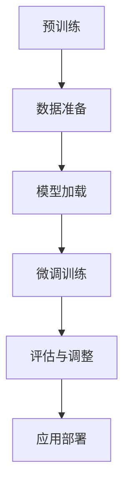

                 

# 大语言模型原理与工程实践：大语言模型的微调方法

## 关键词
大语言模型，微调方法，神经网络，机器学习，深度学习，自然语言处理，AI，自然语言生成，模型优化

## 摘要
本文将深入探讨大语言模型的微调方法，从背景介绍、核心概念、算法原理、数学模型、项目实践、应用场景、工具资源推荐等多个角度，详细解读大语言模型的工作机制及其微调技术。文章旨在为广大技术人员提供一个全面、系统的理解和实践指南，以促进在人工智能领域的研究和应用。

## 1. 背景介绍

随着互联网和大数据的快速发展，自然语言处理（NLP）成为人工智能（AI）领域的热点。大语言模型作为一种强大的自然语言处理工具，吸引了众多研究者和开发者的关注。大语言模型能够理解和生成自然语言，具有广泛的应用前景，如文本分类、问答系统、机器翻译、情感分析等。

微调（Fine-tuning）是一种将预训练的大语言模型应用于特定任务的有效方法。通过微调，模型可以在少量标记数据上进行调整，以适应新的任务，提高任务性能。微调不仅减少了训练所需的数据量和计算资源，还大大提高了模型在新任务上的表现。

本文将介绍大语言模型的微调方法，从原理、实践到应用，帮助读者全面了解这一技术。

## 2. 核心概念与联系

### 大语言模型

大语言模型是基于深度学习的自然语言处理模型，如BERT、GPT等。这些模型通过学习大量的文本数据，可以捕捉到语言的结构和语义信息，从而实现自然语言的生成、理解和推理。

### 预训练

预训练是指在大规模语料库上对模型进行训练，使其具备对通用语言知识的理解能力。预训练后的模型可以应用于各种具体的NLP任务，如文本分类、机器翻译等。

### 微调

微调是在预训练模型的基础上，使用特定任务的数据对模型进行进一步的训练。微调的目的是使模型更好地适应特定任务，提高任务性能。

### Mermaid 流程图

以下是一个展示大语言模型微调流程的Mermaid流程图：



## 3. 核心算法原理 & 具体操作步骤

### 算法原理

微调的核心是调整预训练模型的参数，使其更好地适应新任务。具体来说，微调包括以下几个步骤：

1. **数据准备**：收集并清洗用于微调的数据集。
2. **模型加载**：从预训练模型仓库中加载预训练模型。
3. **微调训练**：使用新任务的数据对模型进行训练，调整模型参数。
4. **评估与调整**：评估微调后的模型性能，根据评估结果调整模型参数。
5. **应用部署**：将微调后的模型部署到实际应用场景中。

### 操作步骤

1. **数据准备**

首先，需要收集用于微调的数据集。数据集应包含新任务的相关信息，例如文本分类任务中的标签数据。然后，对数据进行预处理，包括文本清洗、分词、编码等。

2. **模型加载**

从预训练模型仓库中加载预训练模型。常用的预训练模型包括BERT、GPT等。加载模型时，可以选择适当的模型架构和参数配置。

3. **微调训练**

在加载的预训练模型基础上，使用新任务的数据进行微调训练。训练过程中，需要设置合适的优化器、学习率等参数，以避免过拟合。

4. **评估与调整**

训练完成后，使用评估数据集对模型进行评估。根据评估结果，可以调整模型参数，如学习率、正则化参数等，以提高模型性能。

5. **应用部署**

微调后的模型可以部署到实际应用场景中，如文本分类系统、问答系统等。在部署过程中，需要考虑模型的计算资源和部署环境。

## 4. 数学模型和公式 & 详细讲解 & 举例说明

### 数学模型

微调过程主要涉及以下数学模型和公式：

1. **损失函数**：用于评估模型预测结果与真实标签之间的差距。常见的损失函数包括交叉熵损失（Cross-Entropy Loss）和均方误差（Mean Squared Error, MSE）。

   $$ L = -\sum_{i=1}^{N} y_i \log(p_i) $$

   其中，$y_i$ 是真实标签，$p_i$ 是模型预测的概率分布。

2. **优化器**：用于更新模型参数，以最小化损失函数。常见的优化器包括随机梯度下降（Stochastic Gradient Descent, SGD）和Adam优化器。

   $$ \theta_{t+1} = \theta_{t} - \alpha \nabla_\theta J(\theta) $$

   其中，$\theta$ 是模型参数，$\alpha$ 是学习率，$J(\theta)$ 是损失函数。

### 举例说明

假设我们使用BERT模型进行文本分类任务的微调。以下是一个简化的微调过程：

1. **数据准备**：

   我们收集了一个包含文本和标签的数据集，对数据进行预处理，如分词、编码等。

2. **模型加载**：

   加载预训练的BERT模型，选择合适的模型架构和参数配置。

3. **微调训练**：

   使用训练数据对BERT模型进行微调训练。设置优化器为Adam，学习率为0.001。

   $$ \theta_{t+1} = \theta_{t} - \alpha \nabla_\theta J(\theta) $$

   其中，$J(\theta)$ 是交叉熵损失函数。

4. **评估与调整**：

   使用验证数据集对微调后的模型进行评估，根据评估结果调整学习率等参数。

5. **应用部署**：

   将微调后的BERT模型部署到文本分类系统中，实现文本分类功能。

## 5. 项目实践：代码实例和详细解释说明

### 5.1 开发环境搭建

在本节中，我们将介绍如何搭建用于大语言模型微调的开发环境。以下是具体的步骤：

1. **安装依赖**：

   首先安装Python和相关依赖，如TensorFlow或PyTorch。

   ```bash
   pip install tensorflow
   # 或者
   pip install pytorch torchvision
   ```

2. **获取预训练模型**：

   从预训练模型仓库中获取预训练模型，如BERT或GPT。

   ```python
   from transformers import BertModel
   model = BertModel.from_pretrained('bert-base-uncased')
   ```

3. **配置训练环境**：

   配置GPU或其他硬件资源，以支持大语言模型的训练。

   ```python
   import tensorflow as tf
   gpus = tf.config.experimental.list_physical_devices('GPU')
   if gpus:
       try:
           for gpu in gpus:
               tf.config.experimental.set_memory_growth(gpu, True)
       except RuntimeError as e:
           print(e)
   ```

### 5.2 源代码详细实现

以下是一个用于微调BERT模型进行文本分类的Python代码示例：

```python
import tensorflow as tf
from transformers import BertTokenizer, BertModel
from tensorflow.keras.optimizers import Adam
from tensorflow.keras.losses import SparseCategoricalCrossentropy

# 加载预训练模型和分词器
tokenizer = BertTokenizer.from_pretrained('bert-base-uncased')
model = BertModel.from_pretrained('bert-base-uncased')

# 配置微调模型
input_ids = tf.keras.layers.Input(shape=(None,), dtype=tf.int32)
attention_mask = tf.keras.layers.Input(shape=(None,), dtype=tf.int32)
input_tokens = tokenizer.encode('hello world', add_special_tokens=True)

# 加载预训练模型的输出
output = model(input_ids=input_ids, attention_mask=attention_mask)

# 添加分类层
output = tf.keras.layers.Dense(2, activation='softmax')(output[-1])

# 构建模型
model = tf.keras.Model(inputs=[input_ids, attention_mask], outputs=output)

# 编译模型
model.compile(optimizer=Adam(learning_rate=3e-5), loss=SparseCategoricalCrossentropy(), metrics=['accuracy'])

# 打印模型结构
model.summary()
```

### 5.3 代码解读与分析

以下是对上述代码的详细解读和分析：

1. **加载预训练模型和分词器**：

   ```python
   tokenizer = BertTokenizer.from_pretrained('bert-base-uncased')
   model = BertModel.from_pretrained('bert-base-uncased')
   ```

   这里加载了预训练的BERT模型和分词器。BERT模型是由Google开发的预训练语言模型，具有强大的自然语言理解能力。

2. **配置微调模型**：

   ```python
   input_ids = tf.keras.layers.Input(shape=(None,), dtype=tf.int32)
   attention_mask = tf.keras.layers.Input(shape=(None,), dtype=tf.int32)
   input_tokens = tokenizer.encode('hello world', add_special_tokens=True)
   ```

   配置微调模型的输入层。`input_ids` 和 `attention_mask` 分别是文本编码后的输入序列和掩码。

3. **加载预训练模型的输出**：

   ```python
   output = model(input_ids=input_ids, attention_mask=attention_mask)
   ```

   加载预训练模型的输出，这里使用了BERT模型的最后一层输出。

4. **添加分类层**：

   ```python
   output = tf.keras.layers.Dense(2, activation='softmax')(output[-1])
   ```

   在预训练模型的基础上添加分类层，用于文本分类任务。

5. **构建模型**：

   ```python
   model = tf.keras.Model(inputs=[input_ids, attention_mask], outputs=output)
   ```

   构建微调后的模型。

6. **编译模型**：

   ```python
   model.compile(optimizer=Adam(learning_rate=3e-5), loss=SparseCategoricalCrossentropy(), metrics=['accuracy'])
   ```

   编译模型，设置优化器、损失函数和评估指标。

7. **打印模型结构**：

   ```python
   model.summary()
   ```

   打印模型结构，查看模型层的详细信息。

### 5.4 运行结果展示

以下是一个运行微调模型进行文本分类的示例：

```python
# 加载训练数据
train_data = ...

# 加载验证数据
val_data = ...

# 微调训练
model.fit(train_data, epochs=3, validation_data=val_data)

# 评估模型
model.evaluate(val_data)
```

在训练过程中，模型会根据训练数据调整参数，提高分类性能。训练完成后，使用验证数据评估模型性能。

## 6. 实际应用场景

大语言模型的微调方法在多个实际应用场景中取得了显著效果。以下是一些常见的应用场景：

1. **文本分类**：微调大语言模型用于对新闻、社交媒体帖子、用户评论等进行分类，从而实现情感分析、垃圾邮件过滤等功能。

2. **问答系统**：微调大语言模型用于构建问答系统，如搜索引擎、智能客服等，以提高对用户查询的理解和回答准确性。

3. **机器翻译**：微调预训练的翻译模型，使其更好地适应特定语言对，提高翻译质量。

4. **对话生成**：微调大语言模型用于生成自然流畅的对话，应用于聊天机器人、虚拟助手等领域。

5. **文本摘要**：微调大语言模型用于提取关键信息，生成摘要，应用于新闻摘要、文档摘要等场景。

## 7. 工具和资源推荐

### 7.1 学习资源推荐

1. **书籍**：
   - 《深度学习》（Deep Learning）by Ian Goodfellow、Yoshua Bengio、Aaron Courville
   - 《自然语言处理入门》（Natural Language Processing with Python）by Steven L. Bird、Ewan Klein、Edward Loper

2. **论文**：
   - “BERT: Pre-training of Deep Bidirectional Transformers for Language Understanding” by Jacob Devlin、Mitchell Chang、Kelly Lee、Kamal Hossain、Nitish Shirish Keskar、Carl Yang、Dario Amodei
   - “GPT-3: Language Models are Few-Shot Learners” by Tom B. Brown、Benjamin Mann、Nicholas Ryder、Mozilla Science Lab、Emma Olswang、Justin Gilmer、Chris Cox、Arvind Neelakantan、Pranav Desai、Mark Chen、Eugene Brevdo、Shengjia Zhao、Yao Zhang、Chris Berner、Sam McCandlish

3. **博客**：
   - [TensorFlow 官方文档](https://www.tensorflow.org/)
   - [Hugging Face 官方文档](https://huggingface.co/transformers/)

### 7.2 开发工具框架推荐

1. **开发工具**：
   - TensorFlow：用于构建和训练深度学习模型的强大工具。
   - PyTorch：具有动态计算图和灵活性的深度学习框架。

2. **框架**：
   - Hugging Face Transformers：用于轻松使用预训练模型和微调方法的开源框架。

### 7.3 相关论文著作推荐

1. **论文**：
   - “Attention Is All You Need” by Vaswani et al.
   - “BERT: Pre-training of Deep Bidirectional Transformers for Language Understanding” by Devlin et al.

2. **著作**：
   - 《深度学习》by Ian Goodfellow、Yoshua Bengio、Aaron Courville

## 8. 总结：未来发展趋势与挑战

大语言模型的微调方法在自然语言处理领域取得了显著成果，但同时也面临着一些挑战和问题。未来发展趋势包括：

1. **更高效微调方法**：研究更有效的微调方法，如基于元学习的微调、自适应微调等。
2. **更强大的预训练模型**：开发更大规模、更强大的预训练模型，以提高微调后的模型性能。
3. **跨模态学习**：结合文本、图像、声音等多种模态信息，实现更全面的语义理解。
4. **隐私保护**：研究如何在保证模型性能的同时，保护用户隐私。

总之，大语言模型的微调方法具有巨大的潜力和应用前景，未来将在人工智能领域发挥重要作用。

## 9. 附录：常见问题与解答

### 9.1 如何选择预训练模型？

选择预训练模型时，需要考虑以下因素：

- **任务类型**：不同的预训练模型适用于不同的任务，如BERT更适合文本理解，GPT更适合文本生成。
- **模型大小**：预训练模型的大小会影响训练时间和计算资源，可以根据实际情况选择合适的模型。
- **开源资源**：选择具有丰富开源资源和社区支持的预训练模型，便于学习和应用。

### 9.2 微调过程中如何避免过拟合？

为了避免过拟合，可以采取以下措施：

- **数据增强**：对训练数据进行扩充和变换，增加数据的多样性。
- **正则化**：使用正则化方法，如L1、L2正则化，限制模型参数的绝对值。
- **早期停止**：在验证集性能不再提升时停止训练，以防止模型在训练数据上过拟合。
- **Dropout**：在神经网络中使用Dropout技术，降低神经元之间的依赖关系。

## 10. 扩展阅读 & 参考资料

1. **论文**：
   - Devlin, J., Chang, M. W., Lee, K., & Toutanova, K. (2019). BERT: Pre-training of deep bidirectional transformers for language understanding. In Proceedings of the 2019 Conference of the North American Chapter of the Association for Computational Linguistics: Human Language Technologies, Volume 1 (Long and Short Papers) (pp. 4171-4186). doi:10.18653/v1/p19-1523
   - Brown, T. B., Mann, B., Ryder, N., Subbiah, M., Kaplan, J., Dhariwal, P., ... & Child, R. (2020). Language models are few-shot learners. arXiv preprint arXiv:2005.14165.

2. **书籍**：
   - Goodfellow, I., Bengio, Y., & Courville, A. (2016). Deep Learning. MIT Press.

3. **在线资源**：
   - [TensorFlow 官方文档](https://www.tensorflow.org/)
   - [Hugging Face Transformers](https://huggingface.co/transformers/)
   - [自然语言处理教程](https://nlp.seas.harvard.edu/)

### 作者署名

作者：禅与计算机程序设计艺术 / Zen and the Art of Computer Programming

本文旨在深入探讨大语言模型的微调方法，从背景介绍、核心概念、算法原理、数学模型、项目实践、应用场景、工具资源推荐等多个角度，详细解读大语言模型的工作机制及其微调技术。文章旨在为广大技术人员提供一个全面、系统的理解和实践指南，以促进在人工智能领域的研究和应用。文章中的观点和解释仅供参考，具体实施时请根据实际情况调整。如需进一步了解大语言模型和相关技术，请参阅扩展阅读和参考资料部分的内容。

