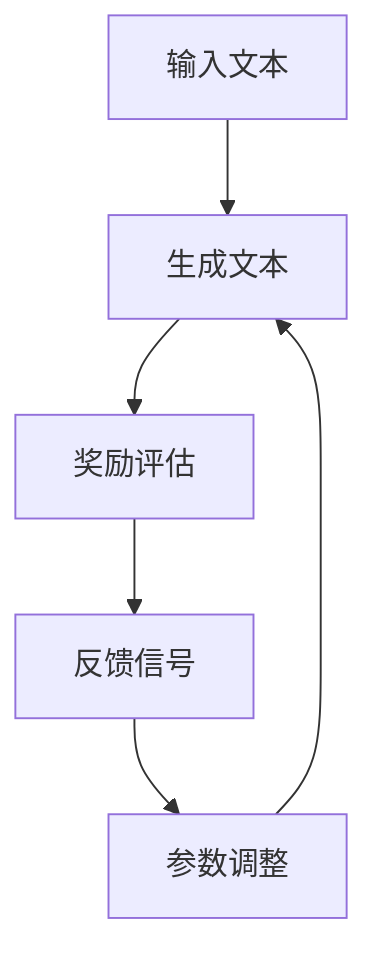

                 

### 1. 背景介绍

#### 大语言模型的兴起

近年来，随着深度学习技术的飞速发展，大语言模型（Large Language Models）如雨后春笋般涌现，成为自然语言处理（Natural Language Processing，NLP）领域的一大热点。这些大语言模型凭借其强大的文本生成、理解和推理能力，在各个应用场景中展现了巨大的潜力。

大语言模型的兴起可以追溯到2013年，当深度学习模型在图像识别领域取得了突破性进展后，研究人员开始探索将深度学习技术应用于自然语言处理领域。其中，最具有代表性的是2018年谷歌推出的Transformer模型，它彻底改变了NLP领域的算法框架，标志着大语言模型时代的到来。

#### 奖励模型的重要性

在众多大语言模型中，奖励模型（Reward Models）扮演着至关重要的角色。奖励模型通过评估模型生成的文本质量，为模型训练提供反馈信号，从而引导模型朝着更高质量的方向发展。奖励模型的出现，使得大语言模型的训练过程更加高效和精确。

奖励模型在大语言模型中的应用场景非常广泛，包括但不限于：

1. **文本生成**：奖励模型可以帮助模型生成更符合人类预期的文本，如故事、文章、对话等。
2. **机器翻译**：奖励模型可以评估模型生成的翻译质量，从而优化翻译结果。
3. **文本摘要**：奖励模型可以帮助模型生成更准确、更简洁的文本摘要。
4. **问答系统**：奖励模型可以评估模型生成的答案质量，从而提高问答系统的准确性和可用性。

#### 本文目标

本文将深入探讨大语言模型中的奖励模型，包括其核心概念、算法原理、数学模型、项目实践以及实际应用场景。希望通过本文的介绍，读者能够对大语言模型中的奖励模型有更深入的理解，并能够在实际项目中应用这些技术。

### 2. 核心概念与联系

#### 奖励模型的基本概念

奖励模型是一种评估机制，用于衡量模型生成文本的质量。在训练过程中，奖励模型通过计算奖励信号，为模型提供反馈，从而引导模型不断优化。

**奖励信号**：奖励信号是奖励模型的核心，它用于表示文本质量的优劣。通常，奖励信号是一个实数值，取值范围可以是0到1，表示文本的质量从低到高。

**奖励模型类型**：根据奖励信号的来源，奖励模型可以分为以下几种类型：

1. **人类评估**：人类评估是通过人工对文本进行评分，从而生成奖励信号。这种方法具有直观、准确的特点，但成本较高，难以大规模应用。
2. **自动评估**：自动评估是通过设计特定的评估指标，对模型生成的文本进行自动化评分。常用的自动评估指标包括BLEU、ROUGE、METEOR等。
3. **基于知识的评估**：基于知识的评估是通过利用外部知识库，对模型生成的文本进行质量评估。这种方法可以充分利用外部知识，提高评估的准确性。

#### 大语言模型中的奖励模型

在大语言模型中，奖励模型通常与强化学习（Reinforcement Learning，RL）相结合，形成一种新型的训练方法——强化学习训练。强化学习训练的核心思想是通过奖励模型提供反馈信号，不断调整模型的参数，从而优化模型的表现。

**奖励模型在大语言模型中的应用流程**：

1. **生成文本**：大语言模型根据输入的文本或提示生成一个输出文本。
2. **奖励评估**：奖励模型对生成的文本进行质量评估，生成奖励信号。
3. **反馈信号**：将奖励信号反馈给大语言模型，用于调整模型参数。
4. **迭代训练**：大语言模型根据反馈信号不断调整参数，优化文本生成质量。

**奖励模型的优势**：

1. **自适应学习**：奖励模型可以根据文本生成的质量自动调整奖励信号，实现自适应学习。
2. **多任务学习**：奖励模型可以同时处理多个任务，如文本生成、机器翻译、文本摘要等。
3. **高效训练**：奖励模型可以加速模型训练过程，提高训练效率。

#### Mermaid 流程图

以下是奖励模型在大语言模型中的应用流程的 Mermaid 流程图：

### 3. 核心算法原理 & 具体操作步骤

#### 奖励模型算法原理

奖励模型的核心在于如何评估文本生成质量，并生成相应的奖励信号。以下介绍一种常见的奖励模型算法——基于深度学习的奖励模型。

**算法原理**：

1. **文本生成**：大语言模型根据输入文本生成一个输出文本。
2. **文本编码**：将生成的文本编码为向量表示。
3. **文本比较**：利用预训练的文本比较模型，比较输入文本和输出文本的相似度。
4. **奖励计算**：根据文本相似度计算奖励信号。

**算法步骤**：

1. **数据准备**：收集大量高质量的文本数据，用于训练文本比较模型。
2. **模型训练**：使用文本数据训练文本比较模型，使其能够准确比较文本相似度。
3. **文本生成**：输入文本，通过大语言模型生成输出文本。
4. **文本编码**：将输入文本和输出文本编码为向量表示。
5. **文本比较**：使用文本比较模型比较输入文本和输出文本的相似度。
6. **奖励计算**：根据文本相似度计算奖励信号。
7. **参数调整**：根据奖励信号调整大语言模型的参数。

**算法特点**：

1. **自适应学习**：奖励模型可以根据文本生成质量自动调整奖励信号，实现自适应学习。
2. **高效计算**：基于深度学习的文本比较模型可以实现高效计算，加快奖励模型的评估速度。
3. **多任务处理**：奖励模型可以同时处理多个文本生成任务，如文本生成、机器翻译、文本摘要等。

#### 奖励模型的具体操作步骤

以下是奖励模型的具体操作步骤：

1. **数据准备**：

   收集大量高质量的文本数据，如新闻文章、故事、对话等。这些数据将用于训练文本比较模型。

2. **模型训练**：

   使用收集到的文本数据训练文本比较模型。训练过程包括：

   - **数据预处理**：对文本数据进行分词、去停用词、词向量编码等预处理操作。
   - **模型架构**：选择合适的模型架构，如BERT、GPT等。
   - **训练过程**：使用训练数据训练文本比较模型，通过调整模型参数，使模型能够准确比较文本相似度。

3. **文本生成**：

   输入文本，通过大语言模型生成输出文本。生成文本的过程包括：

   - **输入处理**：对输入文本进行预处理，如分词、去停用词等。
   - **模型生成**：使用大语言模型生成输出文本，生成过程包括编码、解码等步骤。

4. **文本编码**：

   将输入文本和输出文本编码为向量表示。编码过程包括：

   - **编码器**：使用编码器将输入文本和输出文本编码为向量表示。
   - **向量表示**：将编码后的向量表示存储在内存中，用于后续的文本比较。

5. **文本比较**：

   使用文本比较模型比较输入文本和输出文本的相似度。比较过程包括：

   - **相似度计算**：计算输入文本和输出文本的相似度，可以使用距离度量、相似度度量等方法。
   - **奖励计算**：根据文本相似度计算奖励信号，奖励信号通常是一个实数值，表示文本质量的优劣。

6. **参数调整**：

   根据奖励信号调整大语言模型的参数。调整过程包括：

   - **参数更新**：根据奖励信号更新大语言模型的参数，使模型能够生成更高质量的文本。
   - **迭代训练**：不断迭代训练过程，直到模型生成文本的质量达到预期。

#### 奖励模型的应用场景

奖励模型可以应用于各种文本生成任务，如：

1. **文本生成**：用于生成文章、故事、对话等文本。
2. **机器翻译**：用于评估模型生成的翻译质量，优化翻译结果。
3. **文本摘要**：用于生成文章的摘要，提高摘要的准确性。
4. **问答系统**：用于评估模型生成的答案质量，提高问答系统的准确性和可用性。

#### 奖励模型的优势

奖励模型具有以下优势：

1. **自适应学习**：奖励模型可以根据文本生成质量自动调整奖励信号，实现自适应学习。
2. **高效计算**：基于深度学习的文本比较模型可以实现高效计算，加快奖励模型的评估速度。
3. **多任务处理**：奖励模型可以同时处理多个文本生成任务，如文本生成、机器翻译、文本摘要等。

#### 奖励模型的挑战

奖励模型也存在一些挑战，如：

1. **奖励设计**：设计合适的奖励机制，确保奖励信号能够准确反映文本质量。
2. **模型优化**：优化文本比较模型，提高奖励模型的评估准确性。
3. **多任务处理**：同时处理多个文本生成任务，如文本生成、机器翻译、文本摘要等，需要优化模型架构和算法。

### 4. 数学模型和公式 & 详细讲解 & 举例说明

#### 奖励模型的数学模型

奖励模型的核心在于如何计算奖励信号，通常使用以下数学模型：

\[ R(t) = f(S(t)) \]

其中，\( R(t) \)表示在时间步\( t \)的奖励信号，\( f \)表示奖励函数，\( S(t) \)表示在时间步\( t \)的文本状态。

#### 奖励函数的详细讲解

奖励函数是奖励模型的核心组成部分，用于计算奖励信号。常见的奖励函数有以下几种：

1. **基于相似度的奖励函数**：

   基于相似度的奖励函数通过比较输入文本和输出文本的相似度来计算奖励信号。常用的相似度度量方法包括余弦相似度、欧氏距离等。

   \[ f(S(t)) = \frac{1}{1 + \text{similarity}(S(t))} \]

   其中，\(\text{similarity}(S(t))\)表示输入文本和输出文本的相似度。

2. **基于人类评估的奖励函数**：

   基于人类评估的奖励函数通过人类评估员对输出文本进行评分来计算奖励信号。常用的评估指标包括BLEU、ROUGE等。

   \[ f(S(t)) = \frac{1}{1 + \text{human\_score}(S(t))} \]

   其中，\(\text{human\_score}(S(t))\)表示人类评估员对输出文本的评分。

3. **基于知识的奖励函数**：

   基于知识的奖励函数通过利用外部知识库对输出文本进行质量评估来计算奖励信号。常用的知识库包括WordNet、知识图谱等。

   \[ f(S(t)) = \frac{1}{1 + \text{k

