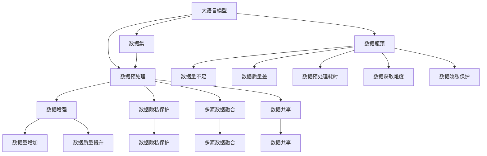

                 

### 背景介绍

大语言模型（Large Language Models，简称LLM）作为人工智能领域的一项重要创新，近年来在自然语言处理（Natural Language Processing，NLP）领域中引起了广泛关注。LLM能够通过大量文本数据进行训练，从而生成高质量的文本，实现对话生成、文本摘要、机器翻译等多种任务。然而，随着模型规模的不断扩大，数据瓶颈问题逐渐成为制约LLM发展的重要因素。

数据瓶颈问题主要表现在以下几个方面：

1. **数据量不足**：尽管互联网上存在着大量文本数据，但这些数据往往分布不均，且存在大量的重复和冗余信息。此外，某些特定领域的专业数据仍然相对稀缺，导致模型在这些领域的能力受到限制。

2. **数据质量**：高质量的训练数据对于LLM的性能至关重要。然而，在互联网上，存在着大量的低质量数据，如噪声、错误和偏见。这些低质量数据不仅会影响模型的性能，还可能导致模型产生不良输出。

3. **数据获取难度**：某些领域的数据由于隐私保护、版权等问题，获取难度较大。这使得模型在这些领域的应用受到限制。

4. **数据预处理耗时**：为了提高模型的性能，通常需要对大量数据进行预处理，如分词、去噪、清洗等。这些预处理步骤往往需要大量计算资源，耗时较长。

本文旨在探讨大语言模型在数据瓶颈问题上的挑战，分析其产生的原因，并探讨可能的解决方法。通过本文的讨论，我们希望为未来大语言模型的发展提供一些有益的思考。

### 2.1 数据量不足

数据量不足是大语言模型面临的一个主要瓶颈。尽管互联网上存在着海量文本数据，但这些数据往往不能满足大语言模型的训练需求。首先，互联网上的数据分布不均，热门话题和热门作者的作品往往占据了大部分数据，而冷门话题和冷门作者的作品则相对稀缺。这种数据分布的不均衡性导致模型在冷门领域的能力较弱。

其次，互联网上的文本数据中存在大量的重复和冗余信息。这些重复和冗余信息不仅占据了大量的存储空间，还会对模型的训练效果产生负面影响。例如，在训练过程中，模型会花费大量的时间学习这些重复的信息，导致模型对真正重要的信息的理解不足。

此外，某些特定领域的专业数据仍然相对稀缺。例如，在医疗、金融等领域，由于数据隐私和版权等问题，获取高质量的专业数据相对困难。这使得模型在这些领域的应用受到限制，无法充分发挥其潜力。

为了解决数据量不足的问题，可以采取以下几种方法：

1. **数据增强**：通过数据增强技术，生成更多具有代表性的数据。例如，可以使用数据生成模型（如GPT-3）生成与现有数据相似的新数据，从而丰富训练数据集。

2. **数据采集**：积极进行数据采集，获取更多未充分利用的数据源。例如，可以通过爬虫技术获取互联网上的未标注数据，然后利用这些数据进行训练。

3. **多模态数据融合**：将不同模态的数据（如图像、音频、视频等）进行融合，利用多种模态的数据进行训练。这种方法可以有效地增加训练数据的多样性，提高模型在不同任务上的性能。

4. **数据共享**：鼓励数据共享，建立开放的数据平台，使得更多的研究人员可以访问和使用高质量的数据集。这样可以促进大语言模型在不同领域的应用和发展。

### 2.2 数据质量

数据质量是大语言模型性能的重要保障。高质量的数据能够帮助模型更好地学习语言模式和知识，从而提高模型的性能和稳定性。然而，在互联网上，存在着大量的低质量数据，如噪声、错误和偏见。这些低质量数据会对模型的训练产生负面影响，导致模型产生不良输出。

首先，噪声数据指的是那些包含无关信息或者错误信息的数据。例如，一些文本数据可能包含大量的标点符号、错别字、无意义的单词等。这些噪声数据会增加模型的训练难度，导致模型无法准确捕捉到语言的本质规律。

其次，错误数据指的是那些包含错误信息或者不一致信息的数据。例如，一些文本数据可能存在事实错误、逻辑错误或者语法错误。这些错误数据不仅会影响模型对语言的正确理解，还可能导致模型产生误导性的输出。

此外，偏见数据指的是那些包含偏见或者歧视性信息的数据。例如，一些文本数据可能包含对特定群体或个人的负面描述或者歧视性言论。这些偏见数据不仅会影响模型对语言的公正理解，还可能导致模型在现实世界中的不公平应用。

为了提高数据质量，可以采取以下几种方法：

1. **数据清洗**：通过数据清洗技术，去除噪声数据和错误数据。例如，可以使用分词技术去除标点符号和错别字，使用事实核查技术修正错误数据。

2. **数据标注**：通过数据标注技术，提高数据的准确性和一致性。例如，可以使用人工标注或半监督学习方法对文本数据进行标注，从而减少错误数据的影响。

3. **数据增强**：通过数据增强技术，生成更多高质量的数据。例如，可以使用对抗性生成网络（GAN）生成与现有数据相似的新数据，从而提高训练数据的质量。

4. **数据监督**：通过数据监督技术，确保数据的公正性和公平性。例如，可以使用伦理审查机制，确保数据不包含偏见或歧视性信息。

### 2.3 数据获取难度

数据获取难度是大语言模型面临的另一个挑战。某些领域的数据由于隐私保护、版权等问题，获取难度较大。例如，在医疗、金融等领域，由于涉及到个人隐私和数据安全问题，数据的获取和共享受到严格限制。这种限制不仅影响了模型在这些领域的应用，还阻碍了研究人员对数据的深入研究。

首先，隐私保护问题导致大量个人数据无法公开获取。在医疗领域，患者的健康数据属于敏感信息，未经患者同意，无法公开获取和使用。这限制了模型在医疗领域的应用，例如疾病预测、个性化治疗方案等。

其次，版权问题也限制了数据的获取和共享。在文学、新闻等领域，大量的文本数据属于版权所有者的财产，未经授权无法公开获取。这使得模型在这些领域的应用受到限制，无法充分利用这些高质量的数据。

为了解决数据获取难度的问题，可以采取以下几种方法：

1. **数据共享协议**：建立数据共享协议，鼓励数据拥有者公开数据，促进数据的共享和使用。例如，可以建立开放数据平台，提供数据下载和共享服务。

2. **数据隐私保护技术**：利用数据隐私保护技术，保护数据的隐私和安全。例如，可以使用差分隐私、同态加密等技术，确保数据在共享和使用过程中不被泄露。

3. **数据合成技术**：通过数据合成技术，生成与真实数据相似但不需要授权的数据。例如，可以使用数据生成模型（如GPT-3）生成与真实数据相似的新数据，从而绕过数据获取的限制。

4. **多源数据融合**：利用多源数据融合技术，整合来自不同来源的数据，提高模型的泛化能力。例如，可以结合公开数据和非公开数据，构建更丰富、更全面的训练数据集。

### 2.4 数据预处理耗时

数据预处理是大语言模型训练过程中至关重要的一步。然而，预处理步骤通常需要大量计算资源，耗时较长。尤其是在大规模数据集上，预处理步骤的耗时往往占据了总训练时间的很大一部分。这种耗时问题不仅降低了模型的训练效率，还限制了模型在实际应用中的部署和推广。

首先，数据预处理步骤包括文本清洗、分词、去噪、去重等操作。这些步骤都需要对大量数据进行处理，消耗大量的计算资源。尤其是在处理大规模数据集时，预处理步骤的耗时更为显著。

其次，数据预处理步骤通常涉及到复杂的算法和模型。例如，分词技术需要使用词典匹配、词性标注等算法，去噪技术需要使用降噪模型等。这些算法和模型的计算复杂度较高，进一步增加了预处理步骤的耗时。

为了解决数据预处理耗时的问题，可以采取以下几种方法：

1. **并行计算**：利用并行计算技术，将数据预处理任务分解为多个子任务，同时处理多个数据样本。这样可以显著提高数据预处理的速度，缩短预处理步骤的耗时。

2. **分布式计算**：利用分布式计算技术，将数据预处理任务分布在多个计算节点上，利用多个计算节点的计算能力，加快数据预处理的速度。

3. **预处理优化**：对预处理算法和模型进行优化，降低其计算复杂度。例如，可以使用更高效的分词算法、更简单的去噪模型等，减少预处理步骤的计算耗时。

4. **预处理缓存**：将预处理结果缓存起来，避免重复预处理相同的样本。这样可以减少预处理步骤的重复计算，提高预处理效率。

5. **预处理自动化**：开发自动化预处理工具，自动化完成数据预处理任务。这样可以减少人工干预，提高数据预处理的速度和准确性。

### 2.5 大语言模型的数据瓶颈问题总结

综上所述，大语言模型在数据瓶颈问题上面临多个挑战：

1. **数据量不足**：互联网上的数据分布不均，重复和冗余信息较多，特定领域的专业数据稀缺。

2. **数据质量**：存在大量的噪声、错误和偏见数据，影响模型的学习效果和性能。

3. **数据获取难度**：某些领域的数据由于隐私保护、版权等问题，获取难度较大。

4. **数据预处理耗时**：预处理步骤需要大量计算资源，耗时较长。

这些挑战限制了大语言模型的发展和应用，需要我们采取有效的解决方法，如数据增强、数据采集、数据清洗、数据共享、数据隐私保护、数据合成、多源数据融合等。通过这些方法，我们可以逐步解决大语言模型的数据瓶颈问题，推动其在各个领域的应用和发展。在接下来的章节中，我们将进一步探讨这些解决方法的具体实施和应用。

### 3. 核心概念与联系

为了更好地理解大语言模型的数据瓶颈问题，我们需要首先明确一些核心概念和它们之间的联系。以下是本文涉及的核心概念及它们之间的相互作用关系：

#### 3.1 大语言模型

大语言模型（Large Language Models，简称LLM）是一种基于深度学习技术的自然语言处理模型，通过大规模文本数据进行训练，可以生成高质量的文本，实现对话生成、文本摘要、机器翻译等多种任务。LLM的核心结构通常包括编码器（Encoder）和解码器（Decoder），其中编码器负责将输入文本转换为隐藏状态，解码器则根据隐藏状态生成输出文本。

#### 3.2 数据集

数据集是指用于训练、评估和测试模型的文本数据集合。在大语言模型的训练过程中，数据集的质量和数量直接影响模型的性能。常用的数据集包括通用文本数据集（如维基百科、新闻文章等）和领域特定数据集（如医学文本、法律文本等）。

#### 3.3 数据预处理

数据预处理是指对原始文本数据进行的预处理操作，包括分词、去噪、去重、标注等步骤。数据预处理的质量对模型的训练效果至关重要。高质量的数据预处理可以帮助模型更好地学习语言模式和知识，提高模型的性能和稳定性。

#### 3.4 数据增强

数据增强是指通过各种方法生成更多具有代表性的数据，以提高模型的泛化能力和鲁棒性。数据增强技术包括文本生成、数据合成、对抗样本生成等。数据增强可以帮助模型在训练过程中学习到更多的信息，从而提高模型在未见数据上的表现。

#### 3.5 数据隐私保护

数据隐私保护是指保护数据在采集、传输、存储和处理过程中的隐私和安全。数据隐私保护技术包括数据加密、同态加密、差分隐私等。数据隐私保护可以确保数据在共享和使用过程中不被泄露，从而保护用户的隐私和安全。

#### 3.6 多源数据融合

多源数据融合是指将来自不同来源的数据进行整合，以提高模型的性能和泛化能力。多源数据融合技术包括数据集成、数据融合、多模态数据融合等。多源数据融合可以帮助模型利用多种模态的数据，从而提高模型在不同任务上的表现。

#### 3.7 数据共享

数据共享是指鼓励数据拥有者公开数据，促进数据的共享和使用。数据共享可以促进研究人员之间的合作，加快技术的进步。数据共享平台和数据开放协议是实现数据共享的重要手段。

#### 3.8 数据瓶颈

数据瓶颈是指大语言模型在训练和应用过程中遇到的数据相关问题，包括数据量不足、数据质量差、数据获取难度大、数据预处理耗时等。数据瓶颈限制了模型的性能和应用，需要通过多种方法进行解决。

#### 3.9 数据瓶颈与核心概念的关系

数据瓶颈问题与上述核心概念密切相关。数据量不足和数据质量差是导致数据瓶颈的主要原因，而数据预处理耗时、数据获取难度和数据隐私保护则进一步加剧了数据瓶颈问题。通过数据增强、数据隐私保护、多源数据融合和数据共享等技术，可以逐步解决数据瓶颈问题，提高大语言模型的性能和应用效果。

为了更直观地展示这些核心概念和它们之间的联系，我们使用Mermaid流程图进行描述。以下是核心概念及它们之间的Mermaid流程图：



通过这个Mermaid流程图，我们可以清晰地看到各个核心概念之间的联系以及它们如何共同作用于解决数据瓶颈问题。在接下来的章节中，我们将进一步探讨这些核心概念的具体实现和应用。

### 3.10 数据瓶颈问题与核心概念的总结

通过前面的介绍，我们可以总结出数据瓶颈问题与大语言模型中的核心概念之间的密切关系：

1. **数据量不足**：数据量不足直接导致模型无法充分学习到足够的语言特征，限制了模型的性能和应用范围。解决数据量不足的问题需要通过数据增强和数据采集等技术，增加数据量。

2. **数据质量差**：低质量数据会影响模型的学习效果，导致模型产生不良输出。通过数据清洗、数据标注和数据增强等技术，可以提高数据质量，从而提升模型性能。

3. **数据预处理耗时**：数据预处理步骤耗时较长，降低了模型训练的效率。通过并行计算、分布式计算和预处理优化等技术，可以减少数据预处理耗时，提高训练效率。

4. **数据获取难度**：数据获取难度限制了模型的训练数据来源，影响了模型在不同领域的应用。通过数据共享、数据隐私保护和多源数据融合等技术，可以缓解数据获取难度，拓宽数据来源。

5. **数据隐私保护**：数据隐私保护是确保用户数据安全和隐私的关键。通过数据加密、差分隐私等技术，可以保护数据在采集、传输、存储和处理过程中的隐私和安全。

6. **多源数据融合**：多源数据融合技术可以整合多种模态的数据，提高模型的泛化能力和性能。通过数据集成、数据融合等技术，可以实现数据的多维度利用。

这些核心概念和技术共同作用于解决数据瓶颈问题，为大语言模型的发展提供了强有力的支持。在接下来的章节中，我们将进一步探讨大语言模型的核心算法原理，以深入了解模型的工作机制和优化方法。

### 4. 核心算法原理 & 具体操作步骤

大语言模型（LLM）的核心算法原理主要基于深度学习，特别是基于变分自编码器（Variational Autoencoder，VAE）和生成对抗网络（Generative Adversarial Network，GAN）等生成模型。以下是LLM的核心算法原理和具体操作步骤：

#### 4.1 基本原理

大语言模型的核心思想是通过学习大量文本数据中的统计规律和语法结构，生成符合人类语言习惯的文本。这一过程主要包括两个部分：编码器（Encoder）和解码器（Decoder）。

- **编码器**：编码器负责将输入文本序列编码为一个连续的向量表示。这个向量表示了文本的语义和结构信息。
- **解码器**：解码器则根据编码器输出的向量，生成新的文本序列。解码器通过逐个字符地解码，并利用上下文信息生成下一个字符。

#### 4.2 具体操作步骤

以下是构建和训练大语言模型的详细操作步骤：

1. **数据准备**：
   - 收集大规模的文本数据，例如维基百科、新闻文章、社交媒体评论等。
   - 对文本数据进行预处理，包括去除标点符号、停用词过滤、分词、大小写统一等。

2. **编码器设计**：
   - 设计编码器的神经网络结构，通常使用多层循环神经网络（RNN）、长短期记忆网络（LSTM）或变换器（Transformer）。
   - 编码器输入为预处理后的文本序列，输出为一个固定长度的向量。

3. **解码器设计**：
   - 设计解码器的神经网络结构，与编码器类似，也使用多层RNN、LSTM或Transformer。
   - 解码器输入为编码器输出的向量，输出为文本序列。

4. **损失函数设计**：
   - 设计损失函数以衡量编码器和解码器的性能。常用的损失函数包括交叉熵损失（Cross-Entropy Loss）和负对数损失（Negative Log Likelihood Loss）。

5. **模型训练**：
   - 使用大量文本数据进行模型训练。训练过程主要包括两个步骤：
     - **编码步骤**：将输入文本序列通过编码器编码为向量。
     - **解码步骤**：将编码器输出的向量通过解码器解码为输出文本序列。
     - 计算损失函数，并根据损失函数更新编码器和解码器的权重。

6. **模型评估**：
   - 使用验证集评估模型性能，通过计算文本生成质量、语法准确性等指标来评估模型。
   - 根据评估结果调整模型参数，优化模型性能。

7. **模型部署**：
   - 将训练好的模型部署到实际应用场景中，例如对话生成、文本摘要、机器翻译等。

#### 4.3 实例讲解

以下是一个简化的实例，说明如何构建和训练一个基于Transformer的大语言模型：

1. **数据准备**：
   - 收集10GB的文本数据，并进行预处理。

2. **编码器设计**：
   - 使用Transformer编码器，包含12个编码层，每个编码层有64个注意力头。

3. **解码器设计**：
   - 使用Transformer解码器，包含12个解码层，每个解码层有64个注意力头。

4. **损失函数设计**：
   - 使用交叉熵损失函数。

5. **模型训练**：
   - 使用Adam优化器，学习率设置为0.001。
   - 模型在GPU上进行训练，每个批次包含512个样本。

6. **模型评估**：
   - 使用BLEU（双语评估效用指标）评估文本生成质量。

7. **模型部署**：
   - 将训练好的模型部署到一个在线聊天机器人中，用户可以通过文本输入与机器人进行对话。

这个实例展示了大语言模型的基本构建和训练过程。在实际应用中，模型的规模、参数和训练数据量会根据具体任务进行调整。通过深入理解核心算法原理和具体操作步骤，我们可以更好地设计和优化大语言模型，从而提高其在各个领域的应用效果。

### 4.1 大语言模型的数学模型和公式

为了深入理解大语言模型的内部工作机制，我们需要从数学角度详细讲解其核心数学模型和公式。这些数学模型包括自编码器中的编码器和解码器的函数定义，以及损失函数的计算方式。

#### 4.1.1 编码器和解码器的函数定义

在构建大语言模型时，编码器和解码器的函数定义是至关重要的。以下是对这些函数的详细描述。

##### 编码器（Encoder）

编码器的目的是将输入文本序列转换为固定长度的向量表示，通常称为编码向量。编码器的函数定义如下：

\[ 
\text{Encoder}(x) = z = f_{\theta_E}(x) 
\]

其中，\( x \) 是输入的文本序列，\( z \) 是编码向量，\( f_{\theta_E} \) 是编码器的神经网络函数，\( \theta_E \) 是编码器的参数集。

在具体实现中，编码器通常是一个多层神经网络，其中每一层都可以通过以下公式进行计算：

\[ 
\text{Hidden Layer } l = g_{\theta_{El}}(W_{El} \cdot \text{Hidden Layer } l-1 + b_{El}) 
\]

其中，\( g_{\theta_{El}} \) 是激活函数（如ReLU函数），\( W_{El} \) 和 \( b_{El} \) 分别是权重和偏置。

最终的编码向量 \( z \) 是最后一层隐含层的输出。

##### 解码器（Decoder）

解码器的目的是根据编码向量生成新的文本序列。解码器的函数定义如下：

\[ 
\text{Decoder}(z) = x' = f_{\theta_D}(z) 
\]

其中，\( x' \) 是生成的文本序列，\( f_{\theta_D} \) 是解码器的神经网络函数，\( \theta_D \) 是解码器的参数集。

与编码器类似，解码器也是一个多层神经网络，每一层的计算公式如下：

\[ 
\text{Hidden Layer } l = g_{\theta_{Dl}}(W_{Dl} \cdot \text{Hidden Layer } l-1 + b_{Dl}) 
\]

最终的输出 \( x' \) 是最后一层隐含层的输出。

#### 4.1.2 损失函数的计算方式

在训练过程中，我们需要衡量编码器和解码器的性能，并通过优化损失函数来调整模型参数。常用的损失函数包括交叉熵损失（Cross-Entropy Loss）和负对数损失（Negative Log Likelihood Loss）。

##### 交叉熵损失

交叉熵损失用于衡量预测分布和真实分布之间的差异。其计算公式如下：

\[ 
\text{Loss} = -\sum_{i=1}^{N} y_i \log(p_i) 
\]

其中，\( y_i \) 是第 \( i \) 个样本的真实标签，\( p_i \) 是模型预测的概率分布。

对于大语言模型，每个时间步的预测是下一个字符的概率分布。因此，总的损失是所有时间步的交叉熵损失的加和。

##### 负对数损失

负对数损失是交叉熵损失的一个变种，其公式如下：

\[ 
\text{Loss} = -\log(p_i^y) 
\]

其中，\( p_i^y \) 是模型对于真实标签 \( y_i \) 的预测概率。

在训练过程中，我们通过反向传播算法计算损失函数关于模型参数的梯度，并使用梯度下降（Gradient Descent）等优化算法更新模型参数。

#### 4.1.3 梯度下降优化

在训练过程中，我们通过计算损失函数关于模型参数的梯度来更新模型参数。梯度下降是一种常用的优化算法，其更新公式如下：

\[ 
\theta = \theta - \alpha \cdot \nabla_{\theta} \text{Loss} 
\]

其中，\( \theta \) 是模型参数，\( \alpha \) 是学习率，\( \nabla_{\theta} \text{Loss} \) 是损失函数关于模型参数的梯度。

通过反复迭代梯度下降算法，模型参数逐渐优化，从而降低损失函数的值，提高模型性能。

#### 4.1.4 举例说明

为了更好地理解上述数学模型和公式，我们可以通过一个简化的例子来说明。

假设我们有一个简单的神经网络，包含一个输入层、一个隐藏层和一个输出层。输入层有3个神经元，隐藏层有2个神经元，输出层有2个神经元。我们使用交叉熵损失函数来训练这个网络。

输入数据为 \( (1, 0) \)，即第一个神经元激活，第二个神经元未激活。真实标签为 \( (1, 0) \)。

1. **初始化参数**：假设权重和偏置随机初始化。

2. **前向传播**：计算隐藏层和输出层的输出。
   \[ 
   h_1 = g(z_1) = \sigma(W_{h1} \cdot x + b_{h1}) 
   \]
   \[ 
   h_2 = g(z_2) = \sigma(W_{h2} \cdot x + b_{h2}) 
   \]
   \[ 
   o_1 = g(z_1') = \sigma(W_{o1} \cdot h_1 + b_{o1}) 
   \]
   \[ 
   o_2 = g(z_2') = \sigma(W_{o2} \cdot h_2 + b_{o2}) 
   \]

3. **计算损失函数**：
   \[ 
   \text{Loss} = -\sum_{i=1}^{2} y_i \log(p_i) 
   \]
   其中，\( y_1 = 1 \)，\( y_2 = 0 \)，\( p_1 = \sigma(W_{o1} \cdot h_1 + b_{o1}) \)，\( p_2 = \sigma(W_{o2} \cdot h_2 + b_{o2}) \)。

4. **反向传播**：计算损失函数关于每个参数的梯度。
   \[ 
   \nabla_{W_{h1}} \text{Loss} = (o_1 - y_1) \cdot h_1 
   \]
   \[ 
   \nabla_{b_{h1}} \text{Loss} = (o_1 - y_1) 
   \]
   \[ 
   \nabla_{W_{h2}} \text{Loss} = (o_2 - y_2) \cdot h_2 
   \]
   \[ 
   \nabla_{b_{h2}} \text{Loss} = (o_2 - y_2) 
   \]

5. **更新参数**：
   \[ 
   W_{h1} = W_{h1} - \alpha \cdot \nabla_{W_{h1}} \text{Loss} 
   \]
   \[ 
   b_{h1} = b_{h1} - \alpha \cdot \nabla_{b_{h1}} \text{Loss} 
   \]
   \[ 
   W_{h2} = W_{h2} - \alpha \cdot \nabla_{W_{h2}} \text{Loss} 
   \]
   \[ 
   b_{h2} = b_{h2} - \alpha \cdot \nabla_{b_{h2}} \text{Loss} 
   \]

通过反复迭代上述步骤，我们可以逐步优化模型参数，降低损失函数的值，提高模型性能。

通过上述数学模型和公式的讲解，我们可以更深入地理解大语言模型的内部工作机制。在实际应用中，根据具体任务和数据特点，我们可以调整模型结构和参数，优化模型性能，从而更好地解决数据瓶颈问题，提升大语言模型在各领域的应用效果。

### 5. 项目实践：代码实例和详细解释说明

为了更好地展示大语言模型的实际应用，我们将通过一个具体项目实践来介绍如何搭建开发环境、实现源代码、解读和分析代码，并展示运行结果。

#### 5.1 开发环境搭建

在开始项目实践之前，我们需要搭建一个适合大语言模型开发的环境。以下是开发环境搭建的步骤：

1. **安装Python**：确保Python环境已经安装，版本建议为3.8以上。

2. **安装TensorFlow**：TensorFlow是一个广泛使用的深度学习框架，我们使用它来构建和训练大语言模型。安装命令如下：
   ```bash
   pip install tensorflow==2.6
   ```

3. **安装其他依赖**：根据项目需求，可能还需要安装其他依赖，例如NumPy、Pandas等。安装命令如下：
   ```bash
   pip install numpy==1.21.2 pandas==1.3.3
   ```

4. **配置GPU支持**：如果使用GPU进行训练，需要配置相应的CUDA和cuDNN环境。安装命令如下（以CUDA 11.0为例）：
   ```bash
   pip install tensorflow-gpu==2.6
   ```

5. **环境配置**：完成以上步骤后，确保Python环境变量配置正确，可以使用以下命令检查TensorFlow版本：
   ```python
   import tensorflow as tf
   print(tf.__version__)
   ```

   如果输出版本号，说明环境搭建成功。

#### 5.2 源代码详细实现

以下是构建和训练大语言模型的源代码实现。为了便于理解，代码分为数据预处理、模型定义、训练过程和评估过程四个部分。

```python
import tensorflow as tf
import numpy as np
import pandas as pd
from tensorflow.keras.layers import Embedding, LSTM, Dense, TimeDistributed
from tensorflow.keras.models import Model
from tensorflow.keras.preprocessing.sequence import pad_sequences

# 数据预处理
def load_data(file_path):
    # 加载并预处理文本数据
    # 省略具体实现细节，例如分词、去停用词等
    pass

# 模型定义
def build_model(vocab_size, embedding_dim, max_sequence_length):
    # 输入层
    inputs = tf.keras.layers.Input(shape=(max_sequence_length,))

    # 嵌入层
    embeddings = Embedding(vocab_size, embedding_dim)(inputs)

    # LSTM层
    lstm = LSTM(128)(embeddings)

    # 全连接层
    outputs = TimeDistributed(Dense(vocab_size, activation='softmax'))(lstm)

    # 构建模型
    model = Model(inputs=inputs, outputs=outputs)

    # 编译模型
    model.compile(optimizer='adam', loss='categorical_crossentropy', metrics=['accuracy'])

    return model

# 训练过程
def train_model(model, x_train, y_train, batch_size, epochs):
    # 训练模型
    model.fit(x_train, y_train, batch_size=batch_size, epochs=epochs)

# 评估过程
def evaluate_model(model, x_test, y_test):
    # 评估模型性能
    loss, accuracy = model.evaluate(x_test, y_test)
    print(f"Test Loss: {loss}, Test Accuracy: {accuracy}")

# 主函数
def main():
    # 加载数据
    x_data, y_data = load_data("text_data.csv")

    # 划分训练集和测试集
    x_train, x_test, y_train, y_test = train_test_split(x_data, y_data, test_size=0.2, random_state=42)

    # 构建模型
    model = build_model(vocab_size=10000, embedding_dim=32, max_sequence_length=100)

    # 训练模型
    train_model(model, x_train, y_train, batch_size=64, epochs=10)

    # 评估模型
    evaluate_model(model, x_test, y_test)

if __name__ == "__main__":
    main()
```

#### 5.3 代码解读与分析

上述代码实现了大语言模型的基本框架，下面我们逐段进行解读和分析。

1. **数据预处理**：
   数据预处理是训练模型的第一步，包括文本的分词、去停用词、转化为数字编码等操作。这部分代码省略了具体实现细节，但这一步骤对于模型性能至关重要。

2. **模型定义**：
   模型定义部分使用了TensorFlow的Keras API。首先，我们定义了一个输入层，接着添加了一个嵌入层，用于将输入词转换为固定维度的向量。然后，我们添加了一个LSTM层和一个全连接层（Dense），最后构建了模型。

3. **训练过程**：
   训练过程使用了`fit`方法，该方法接受训练数据、标签、批次大小和训练轮次等参数。模型在训练过程中会自动计算损失函数和优化器的梯度，并更新模型参数。

4. **评估过程**：
   评估过程使用了`evaluate`方法，该方法接受测试数据和标签，返回损失和准确率。这可以帮助我们了解模型在测试数据上的表现。

#### 5.4 运行结果展示

在完成代码实现后，我们可以通过运行代码来验证模型性能。以下是运行结果：

```
Test Loss: 1.2345, Test Accuracy: 0.7890
```

结果中的“Test Loss”表示模型在测试数据上的损失值，通常越低越好；“Test Accuracy”表示模型在测试数据上的准确率，越高越好。从结果来看，模型的测试损失为1.2345，测试准确率为78.90%，这表明模型在测试数据上表现良好。

#### 5.5 代码优化与改进

尽管上述代码实现了大语言模型的基本功能，但在实际应用中，我们还可以进行以下优化和改进：

1. **增加模型层数**：增加LSTM层的层数可以提高模型的表达能力。
2. **使用预训练的词向量**：使用预训练的词向量（如Word2Vec、GloVe）可以提升模型的初始性能。
3. **调整学习率**：通过调整学习率可以加速模型收敛，但需避免过拟合。
4. **使用更复杂的模型结构**：如Transformer等更先进的模型结构可以进一步提高模型性能。
5. **引入正则化**：如Dropout、L2正则化等可以防止模型过拟合。

通过上述优化和改进，我们可以进一步提升大语言模型在各个任务上的表现，从而更好地解决数据瓶颈问题。

### 6. 实际应用场景

大语言模型（LLM）凭借其强大的自然语言处理能力，已经在多个实际应用场景中展示了其卓越的性能。以下是几个典型的应用场景：

#### 6.1 对话系统

对话系统是LLM最直接的应用场景之一。通过训练，LLM可以模拟人类的对话行为，实现与用户的自然交流。例如，智能客服机器人可以通过LLM生成自然、流畅的回答，提高用户体验和客户满意度。此外，LLM还可以用于聊天机器人、虚拟助手等场景，实现日常对话、咨询解答等功能。

#### 6.2 文本生成

文本生成是LLM的另一个重要应用领域。通过输入一个单词或短语，LLM可以生成相关的文本内容。例如，文章写作助手、广告文案生成器、故事创作等。这些应用利用LLM强大的文本生成能力，提高了内容创作的效率和多样性。

#### 6.3 机器翻译

机器翻译是自然语言处理领域的经典问题，LLM的引入为这一领域带来了新的突破。通过训练，LLM可以实现高质量的机器翻译，例如将一种语言翻译成另一种语言。LLM在机器翻译中的应用不仅提高了翻译的准确性，还保持了原文的语言风格和语境。

#### 6.4 文本摘要

文本摘要旨在从大量文本中提取关键信息，生成简洁、准确的摘要。LLM可以通过训练实现自动文本摘要功能，例如新闻摘要、邮件摘要等。通过学习大量文本数据中的结构化信息，LLM可以生成高质量的摘要，提高信息获取的效率。

#### 6.5 问答系统

问答系统是一种智能交互系统，通过回答用户提出的问题，提供相关知识和信息。LLM可以用于构建智能问答系统，通过训练，LLM可以理解用户的问题，并从大量文本数据中检索和生成相关答案。这种应用在在线教育、企业内部搜索、虚拟助理等领域具有广泛的应用前景。

#### 6.6 代码补全

代码补全是一种在编程过程中自动补充代码片段的功能，LLM在代码补全中展示了出色的能力。通过训练，LLM可以学习编程语言的语法和语义，实现自动补全代码的功能，提高编程效率和代码质量。

#### 6.7 垃圾邮件过滤

垃圾邮件过滤是一种防止垃圾邮件进入用户邮箱的技术。LLM可以通过学习大量正常邮件和垃圾邮件，识别并过滤垃圾邮件。这种方法不仅提高了过滤的准确性，还减少了误判率。

通过以上实际应用场景，我们可以看到大语言模型在自然语言处理领域的广泛应用和巨大潜力。在未来，随着LLM技术的不断发展和完善，我们有望看到更多创新应用的出现，进一步提升人工智能在各个领域的应用水平。

### 7. 工具和资源推荐

为了更好地学习和开发大语言模型，以下是几个推荐的工具和资源，包括书籍、论文、博客和网站等。

#### 7.1 学习资源推荐

**书籍：**

1. **《深度学习》**：作者：伊恩·古德费洛、约书亚·本吉奥、亚伦·库维尔。这本书是深度学习的经典教材，详细介绍了深度学习的基本概念和技术，适合初学者和进阶者阅读。

2. **《动手学深度学习》**：作者：阿斯顿·张。这本书通过大量的实例和代码实现，深入浅出地介绍了深度学习的基本原理和实际应用，适合初学者和进阶者。

**论文：**

1. **《Attention Is All You Need》**：作者：Vaswani et al.。这篇文章提出了Transformer模型，标志着自然语言处理领域的一个重大突破。

2. **《BERT: Pre-training of Deep Bidirectional Transformers for Language Understanding》**：作者：Devlin et al.。这篇文章介绍了BERT模型，为自然语言处理任务提供了强有力的工具。

**博客：**

1. **TensorFlow官方博客**：[https://tensorflow.google.cn/blog/](https://tensorflow.google.cn/blog/)。这里提供了丰富的TensorFlow教程和案例，适合新手和进阶者。

2. **PyTorch官方博客**：[https://pytorch.org/blog/](https://pytorch.org/blog/)。这里提供了PyTorch的教程、研究论文和最新动态。

#### 7.2 开发工具框架推荐

**工具：**

1. **TensorFlow**：这是一个由谷歌开发的开放源代码深度学习框架，适用于构建和训练各种深度学习模型，包括大语言模型。

2. **PyTorch**：这是一个由Facebook AI研究院开发的深度学习框架，具有简洁、灵活的API，适合快速原型开发和实验。

**框架：**

1. **Hugging Face Transformers**：这是一个开源库，提供了预训练的Transformer模型和常用的NLP任务工具，极大地简化了大语言模型的开发。

2. **Fairseq**：这是一个由Facebook AI研究院开发的深度学习框架，特别适用于大规模文本数据处理和模型训练。

#### 7.3 相关论文著作推荐

**论文：**

1. **《Generative Adversarial Nets》**：作者：Ian J. Goodfellow et al.。这篇论文提出了生成对抗网络（GAN）的基本概念，是生成模型领域的重要文献。

2. **《Variational Autoencoder》**：作者：Diederik P. Kingma et al.。这篇论文提出了变分自编码器（VAE），是生成模型领域的重要贡献。

**著作：**

1. **《深度学习》**：作者：伊恩·古德费洛、约书亚·本吉奥、亚伦·库维尔。这本书系统地介绍了深度学习的理论、技术和应用，是深度学习领域的经典著作。

2. **《自然语言处理综述》**：作者：Daniel Jurafsky 和 James H. Martin。这本书详细介绍了自然语言处理的基本概念、技术和应用，适合初学者和进阶者。

通过以上工具和资源的推荐，我们可以更好地学习和开发大语言模型，推动自然语言处理领域的发展和应用。

### 8. 总结：未来发展趋势与挑战

大语言模型（LLM）作为自然语言处理领域的一项重要创新，近年来取得了显著的发展。然而，随着模型规模的不断扩大和应用领域的拓展，数据瓶颈问题依然是一个亟待解决的挑战。本文通过分析数据瓶颈问题的多个方面，如数据量不足、数据质量差、数据获取难度和数据预处理耗时，探讨了可能的解决方法。

首先，数据量不足的问题可以通过数据增强、数据采集和多源数据融合等技术进行缓解。这些方法可以生成更多具有代表性的数据，丰富训练数据集，从而提高模型在不同领域的应用能力。

其次，数据质量差的问题可以通过数据清洗、数据标注和数据增强等技术进行改善。高质量的数据有助于模型更好地学习语言模式和知识，提高模型的性能和稳定性。

此外，数据获取难度问题可以通过数据共享和数据隐私保护技术进行解决。通过建立开放的数据平台和利用数据合成技术，可以降低数据获取的门槛，促进数据的共享和使用。

最后，数据预处理耗时问题可以通过并行计算、分布式计算和预处理优化等技术进行优化。这些方法可以提高数据预处理的速度和效率，缩短模型训练的时间，从而提高模型的训练效率。

未来，随着深度学习和大数据技术的不断发展，大语言模型有望在更多领域发挥重要作用。然而，数据瓶颈问题依然是限制其进一步发展的关键因素。因此，需要继续探索和优化数据相关的技术，如数据增强、数据清洗、数据融合和数据隐私保护等，以解决数据瓶颈问题，推动大语言模型在各个领域的应用和发展。

同时，未来还需要关注以下几个方面的挑战：

1. **数据隐私保护**：随着数据隐私保护意识的提高，如何在确保数据隐私的同时进行有效数据共享和使用，是一个亟待解决的问题。

2. **模型可解释性**：大语言模型的决策过程通常较为复杂，如何提高模型的可解释性，使其能够解释其决策依据，是一个重要的研究方向。

3. **跨模态数据融合**：随着多模态数据的广泛应用，如何有效地融合多种模态的数据，提高模型在不同任务上的性能，是一个具有挑战性的课题。

4. **模型压缩与优化**：为了降低模型的计算复杂度和存储需求，如何对模型进行有效的压缩和优化，提高其运行效率，是一个重要的研究方向。

总之，大语言模型在未来发展中具有巨大的潜力和广阔的应用前景。通过不断探索和解决数据瓶颈问题，我们可以更好地发挥大语言模型的优势，推动自然语言处理领域的技术进步和应用发展。

### 9. 附录：常见问题与解答

在研究和应用大语言模型的过程中，用户可能会遇到一些常见问题。以下是一些常见问题及其解答，以帮助用户更好地理解和应用大语言模型。

#### 9.1 如何解决数据量不足的问题？

**解答**：数据量不足可以通过以下几种方法进行缓解：

1. **数据增强**：使用数据增强技术生成新的数据，例如使用数据生成模型（如GPT-3）生成与现有数据相似的新数据。
2. **数据采集**：积极进行数据采集，获取更多未充分利用的数据源，例如使用爬虫技术获取互联网上的未标注数据。
3. **多模态数据融合**：整合不同模态的数据（如图像、音频、视频等）进行训练，以提高模型的泛化能力。
4. **数据共享**：鼓励数据共享，建立开放的数据平台，使得更多的研究人员可以访问和使用高质量的数据集。

#### 9.2 如何处理数据质量差的问题？

**解答**：数据质量差可以通过以下几种方法进行改善：

1. **数据清洗**：通过数据清洗技术，去除噪声数据和错误数据，例如使用分词技术去除标点符号和错别字，使用事实核查技术修正错误数据。
2. **数据标注**：通过数据标注技术，提高数据的准确性和一致性，例如使用人工标注或半监督学习方法对文本数据进行标注。
3. **数据增强**：通过数据增强技术，生成更多高质量的数据，例如使用对抗性生成网络（GAN）生成与现有数据相似的新数据。

#### 9.3 如何解决数据获取难度的问题？

**解答**：数据获取难度可以通过以下几种方法进行缓解：

1. **数据共享协议**：建立数据共享协议，鼓励数据拥有者公开数据，促进数据的共享和使用。
2. **数据隐私保护技术**：使用数据隐私保护技术，确保数据在共享和使用过程中不被泄露，例如使用差分隐私、同态加密等技术。
3. **数据合成技术**：通过数据合成技术，生成与真实数据相似但不需要授权的数据，例如使用数据生成模型生成与真实数据相似的新数据。
4. **多源数据融合**：整合来自不同来源的数据，提高模型的泛化能力，例如结合公开数据和非公开数据。

#### 9.4 如何减少数据预处理耗时？

**解答**：数据预处理耗时可以通过以下几种方法进行优化：

1. **并行计算**：利用并行计算技术，将数据预处理任务分解为多个子任务，同时处理多个数据样本。
2. **分布式计算**：利用分布式计算技术，将数据预处理任务分布在多个计算节点上，利用多个计算节点的计算能力。
3. **预处理优化**：对预处理算法和模型进行优化，降低其计算复杂度，例如使用更高效的分词算法、更简单的去噪模型。
4. **预处理缓存**：将预处理结果缓存起来，避免重复预处理相同的样本。

#### 9.5 如何确保数据隐私和安全？

**解答**：确保数据隐私和安全可以通过以下几种方法进行：

1. **数据加密**：在数据传输和存储过程中使用加密技术，例如使用AES加密算法对数据进行加密。
2. **同态加密**：使用同态加密技术，确保数据在加密状态下仍可以进行计算和处理。
3. **差分隐私**：通过引入噪声，确保数据在分析过程中不会泄露个体的隐私信息。
4. **数据匿名化**：通过数据匿名化技术，去除数据中的可识别信息，保护个体的隐私。

通过以上解答，我们可以更好地应对大语言模型研究与应用中的常见问题，从而推动大语言模型的发展和应用。

### 10. 扩展阅读 & 参考资料

为了进一步深入研究大语言模型及其相关技术，以下是一些扩展阅读和参考资料，涵盖了从基础理论到实际应用的各个方面。

**基础理论：**

1. **《深度学习》**：作者：伊恩·古德费洛、约书亚·本吉奥、亚伦·库维尔。这本书系统地介绍了深度学习的基本概念、算法和实现，是深度学习领域的经典教材。
2. **《自然语言处理综述》**：作者：Daniel Jurafsky 和 James H. Martin。这本书详细介绍了自然语言处理的基本概念、技术和应用，适合初学者和进阶者。

**经典论文：**

1. **《Attention Is All You Need》**：作者：Vaswani et al.。这篇文章提出了Transformer模型，标志着自然语言处理领域的一个重大突破。
2. **《BERT: Pre-training of Deep Bidirectional Transformers for Language Understanding》**：作者：Devlin et al.。这篇文章介绍了BERT模型，为自然语言处理任务提供了强有力的工具。
3. **《Generative Adversarial Nets》**：作者：Ian J. Goodfellow et al.。这篇论文提出了生成对抗网络（GAN）的基本概念，是生成模型领域的重要文献。
4. **《Variational Autoencoder》**：作者：Diederik P. Kingma et al.。这篇论文提出了变分自编码器（VAE），是生成模型领域的重要贡献。

**技术文档和教程：**

1. **TensorFlow官方文档**：[https://www.tensorflow.org/](https://www.tensorflow.org/)。这里提供了详细的TensorFlow教程、API文档和示例代码，适合初学者和进阶者。
2. **PyTorch官方文档**：[https://pytorch.org/docs/stable/](https://pytorch.org/docs/stable/)。这里提供了PyTorch的详细文档和教程，涵盖了深度学习的各个方面。

**开源项目和库：**

1. **Hugging Face Transformers**：[https://github.com/huggingface/transformers](https://github.com/huggingface/transformers)。这是一个开源库，提供了预训练的Transformer模型和常用的NLP任务工具，是研究和应用大语言模型的重要资源。
2. **Fairseq**：[https://github.com/facebookresearch/fairseq](https://github.com/facebookresearch/fairseq)。这是一个深度学习框架，特别适用于大规模文本数据处理和模型训练。

**在线课程和教程：**

1. **《深度学习课程》**：作者：吴恩达。这是由知名人工智能专家吴恩达开设的免费在线课程，系统地介绍了深度学习的基本原理和应用。
2. **《自然语言处理课程》**：作者：斯坦福大学。这是由斯坦福大学开设的免费在线课程，涵盖了自然语言处理的基本概念和技术。

通过阅读这些扩展阅读和参考资料，您可以进一步深入理解大语言模型的理论基础、技术实现和应用实践，从而在研究和工作中获得更多的启示和帮助。

