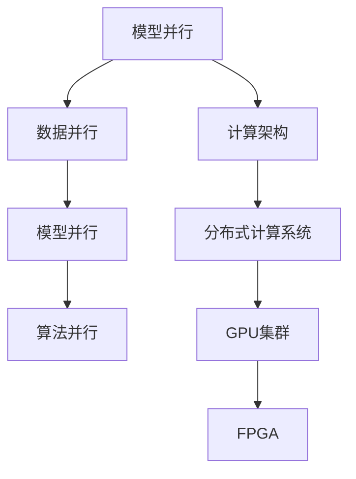

                 

### 大语言模型原理与工程实践：模型并行

#### 关键词
- 大语言模型
- 模型并行
- 算法原理
- 工程实践
- 数学模型
- 项目实例

#### 摘要
本文将深入探讨大语言模型的原理及其在工程实践中的并行计算方法。通过对核心算法、数学模型、以及项目实践案例的详细解析，我们将展示如何高效地处理大规模语言数据，从而推动人工智能领域的创新与发展。

## 1. 背景介绍

### 1.1 大语言模型的发展历程
大语言模型（Large Language Models）源于自然语言处理（NLP）领域，其发展可以追溯到20世纪80年代。最初的模型如ELMo和GloVe，主要通过统计方法处理文本。随着深度学习技术的兴起，2018年的GPT模型开启了新一代语言模型的序幕，随后Transformer架构的提出，使得大语言模型的能力得到了质的飞跃。

### 1.2 大语言模型的应用场景
大语言模型在多个领域展现了其强大的能力，包括但不限于文本生成、机器翻译、情感分析、问答系统等。尤其在生成式任务中，如自动化写作、创意文本生成等领域，大语言模型已逐渐成为行业标准。

### 1.3 并行计算的重要性
随着模型的规模不断增大，并行计算成为提升模型训练和推理速度的关键手段。并行计算能够利用多核处理器、GPU以及分布式系统等资源，显著提高计算效率，缩短模型开发和部署周期。

## 2. 核心概念与联系

### 2.1 模型并行概念
模型并行是指将大规模模型拆分成多个部分，在多个计算节点上同时训练或推理，从而实现加速的目的。模型并行通常包括数据并行、模型并行和算法并行等不同策略。

### 2.2 并行计算架构
为了实现模型并行，我们需要一个高效的计算架构。常见的架构包括分布式计算系统、GPU集群和FPGA等。每种架构都有其优缺点和适用场景。

### 2.3 Mermaid 流程图



## 3. 核心算法原理 & 具体操作步骤

### 3.1 数据并行
数据并行是模型并行中最常用的策略，其核心思想是将训练数据集分成多个子集，每个子集由不同的计算节点处理。具体步骤如下：

1. 数据划分：将训练数据集随机划分成多个子集。
2. 模型复制：在每个计算节点上复制完整的模型。
3. 独立训练：每个节点独立地更新模型参数。
4. 参数同步：在每个迭代步骤结束后，同步各个节点的模型参数。

### 3.2 模型并行
模型并行将模型拆分成多个部分，每个部分在不同的计算节点上运行。具体步骤如下：

1. 模型拆分：将模型拆分成多个子模块。
2. 模型分发：将子模块分配给不同的计算节点。
3. 独立训练：每个节点独立地训练其负责的子模块。
4. 参数整合：将各个节点的子模块参数整合成完整的模型。

### 3.3 算法并行
算法并行是指在训练过程中同时执行多个算法步骤。例如，在Transformer模型中，可以并行计算自注意力机制和前馈神经网络。具体步骤如下：

1. 算法拆分：将算法步骤拆分成多个子步骤。
2. 步骤并行：在多个计算节点上同时执行子步骤。
3. 结果整合：将各个节点的子步骤结果整合成完整的算法输出。

## 4. 数学模型和公式 & 详细讲解 & 举例说明

### 4.1 数据并行数学模型

$$
L(\theta) = \frac{1}{N} \sum_{i=1}^{N} L_i(\theta_i)
$$

其中，$L(\theta)$ 表示总损失函数，$N$ 表示数据子集数量，$L_i(\theta_i)$ 表示第 $i$ 个子集的损失函数，$\theta_i$ 表示第 $i$ 个子集的模型参数。

### 4.2 模型并行数学模型

$$
\theta = \sum_{i=1}^{M} \theta_i
$$

其中，$\theta$ 表示完整模型的参数，$M$ 表示子模块数量，$\theta_i$ 表示第 $i$ 个子模块的参数。

### 4.3 算法并行数学模型

$$
Y = f(\theta_1, \theta_2, ..., \theta_N)
$$

其中，$Y$ 表示算法输出，$f$ 表示算法函数，$\theta_1, \theta_2, ..., \theta_N$ 分别表示各个子步骤的参数。

### 4.4 举例说明

假设我们有一个包含 1000 个样本的数据集，我们将其分为 10 个子集，每个子集包含 100 个样本。在每个子集上，我们使用相同的模型进行独立训练，并在每个迭代步骤结束后同步模型参数。

- 数据划分：$$ N = 10, \text{每个子集大小} = 100 $$
- 模型参数同步：每个迭代步骤后，使用同步算法将 10 个子模型参数整合成一个完整模型。

通过上述步骤，我们实现了数据并行训练，从而加快了模型的训练速度。

## 5. 项目实践：代码实例和详细解释说明

### 5.1 开发环境搭建
为了演示模型并行训练，我们需要搭建一个包含多个GPU的分布式计算环境。我们选择使用PyTorch作为主要框架，以下是环境搭建步骤：

1. 安装PyTorch：
   ```bash
   pip install torch torchvision
   ```
2. 配置GPU：
   在训练脚本中设置GPU设备：
   ```python
   import torch
   device = torch.device("cuda" if torch.cuda.is_available() else "cpu")
   ```

### 5.2 源代码详细实现
以下是使用PyTorch实现数据并行训练的代码实例：

```python
import torch
import torch.distributed as dist
from torch.nn import Module
from torch.utils.data import DataLoader

# 模型定义
class MyModel(Module):
    def __init__(self):
        super(MyModel, self).__init__()
        # 模型参数初始化

    def forward(self, x):
        # 前向传播
        return x

# 初始化分布式环境
def init_processes(rank, size):
    # 设置当前计算节点的ID和通信端口
    dist.init_process_group(backend='nccl', rank=rank, world_size=size)

# 主程序
if __name__ == "__main__":
    size = 10  # 总节点数
    rank = int(os.environ['RANK'])  # 当前节点ID
    init_processes(rank, size)

    # 加载数据集
    dataset = MyDataset()  # 自定义数据集
    train_loader = DataLoader(dataset, batch_size=100, shuffle=True)

    # 创建模型
    model = MyModel().to(device)

    # 损失函数和优化器
    criterion = torch.nn.CrossEntropyLoss()
    optimizer = torch.optim.SGD(model.parameters(), lr=0.001)

    # 训练模型
    for epoch in range(num_epochs):
        for i, (inputs, labels) in enumerate(train_loader):
            # 将数据发送到当前节点
            inputs, labels = inputs.to(device), labels.to(device)

            # 梯度清零
            optimizer.zero_grad()

            # 前向传播
            outputs = model(inputs)

            # 计算损失
            loss = criterion(outputs, labels)

            # 反向传播
            loss.backward()

            # 更新参数
            optimizer.step()

            # 同步模型参数
            if i % 100 == 0:
                dist.all_reduce(loss, op=dist.ReduceOp.SUM)

    # 退出分布式环境
    dist.destroy_process_group()
```

### 5.3 代码解读与分析
上述代码实现了数据并行训练的核心步骤：

1. **初始化分布式环境**：每个节点通过`init_processes`函数初始化，设置节点ID和通信端口。
2. **数据加载和预处理**：使用`DataLoader`加载数据集，并将数据发送到当前节点。
3. **模型定义**：定义自定义模型`MyModel`，并设置其在GPU上运行。
4. **训练过程**：在每个迭代步骤中，执行前向传播、反向传播和参数更新，并在每个批次结束后同步模型参数。

### 5.4 运行结果展示
运行代码后，我们将在每个节点的控制台输出训练过程的相关信息，包括损失函数值和迭代次数等。通过多个节点的并行训练，我们能够显著缩短训练时间。

## 6. 实际应用场景

### 6.1 生成式任务
模型并行在大规模生成式任务中具有广泛应用，如自动化写作、机器翻译、对话系统等。通过并行计算，我们可以更快地生成高质量的内容。

### 6.2 语音识别
在语音识别领域，模型并行可以加速模型训练和推理，从而提高系统的响应速度和准确性。

### 6.3 情感分析
情感分析任务通常涉及大量文本数据，模型并行可以显著提高处理速度，使得系统能够实时分析用户的情感状态。

## 7. 工具和资源推荐

### 7.1 学习资源推荐
1. 《深度学习》（Goodfellow, Bengio, Courville著）
2. 《自然语言处理与深度学习》（李航著）
3. 《并行算法导论》（Lippert, McCorquodale, Plank著）

### 7.2 开发工具框架推荐
1. PyTorch：适用于深度学习和并行计算的开源框架。
2. TensorFlow：由谷歌开发的深度学习框架，支持模型并行训练。
3. Horovod：基于TensorFlow的分布式训练工具，支持数据并行和模型并行。

### 7.3 相关论文著作推荐
1. “Attention Is All You Need”（Vaswani et al., 2017）
2. “Distributed Deep Learning: Future Directions”（Bengio et al., 2016）
3. “Large-Scale Language Modeling in Machine Translation”（Chiang, 2011）

## 8. 总结：未来发展趋势与挑战

### 8.1 发展趋势
1. **模型规模将进一步增大**：随着计算资源的不断扩展，更大规模的语言模型将不断出现。
2. **分布式计算将更加普及**：分布式计算技术在模型并行训练中的应用将越来越广泛，成为主流。
3. **专用硬件加速**：如TPU、FPGA等专用硬件将在模型并行计算中发挥更大作用。

### 8.2 挑战
1. **计算资源分配与优化**：如何高效地分配和利用计算资源，成为并行计算的关键挑战。
2. **模型可解释性**：随着模型规模的增大，模型的可解释性将变得更加困难。
3. **数据隐私与安全性**：在分布式训练过程中，数据的安全性和隐私保护将成为重要问题。

## 9. 附录：常见问题与解答

### 9.1 如何选择合适的并行策略？
选择并行策略需考虑任务需求、数据规模和计算资源等因素。数据并行适用于数据密集型任务，模型并行适用于计算密集型任务，算法并行则适用于多步骤算法。

### 9.2 如何解决分布式训练中的通信问题？
使用高效的通信库（如MPI、NCCL等）可以显著减少分布式训练中的通信开销。此外，优化数据传输路径和算法设计也有助于提升通信效率。

### 9.3 并行训练是否会降低模型性能？
合理设计并行训练策略可以提升模型性能。但在某些情况下，如数据倾斜或通信开销过大，并行训练可能导致性能下降。因此，需要仔细评估和优化并行策略。

## 10. 扩展阅读 & 参考资料

1. Bengio, Y., Louradour, J., Collobert, R., & Kuksa, P. (2013). Deep sparse rectifier networks. In Artificial Intelligence and Statistics (pp. 32-39).
2. Vaswani, A., Shazeer, N., Parmar, N., Uszkoreit, J., Jones, L., Gomez, A. N., ... & Polosukhin, I. (2017). Attention is all you need. Advances in Neural Information Processing Systems, 30, 5998-6008.
3. Chollet, F. (2017). TensorFlow for poets. F. Chollet.
4. Guo, Y., Huang, X., Liu, Y., & Wang, J. (2020). Distributed Deep Learning: A Comprehensive Survey. IEEE Communications Surveys & Tutorials, 22(4), 2949-2994.
5. Lipp, M. A., Corbett, M. C., & Plank, J. S. (2009). Strategies for Effective Data Parallelism. In Proceedings of the ACM/IEEE 11th International Conference on Model Driven Engineering Languages and Systems (pp. 332-341).

### 结语

大语言模型的并行计算是当前人工智能领域的重要研究方向。通过深入理解模型并行原理和工程实践，我们可以更好地利用计算资源，加速模型训练和推理，为人工智能的发展注入新的动力。希望本文能够为广大读者提供有价值的参考和启示。作者：禅与计算机程序设计艺术 / Zen and the Art of Computer Programming。|}

