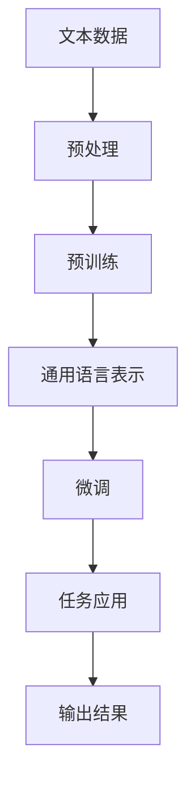
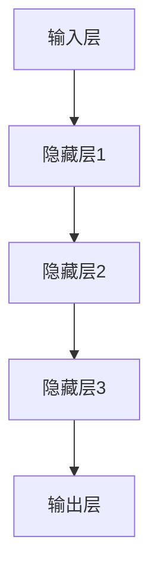

                 

### 大语言模型原理与工程实践：预训练语言模型

> **关键词：** 预训练语言模型，人工智能，神经网络，深度学习，NLP，BERT，GPT，数学模型，工程实践

> **摘要：** 本文将深入探讨预训练语言模型（Pre-Trained Language Model，简称PTLM）的基本原理和工程实践。通过分析核心概念、算法原理、数学模型以及实际应用，本文旨在为读者提供一个全面而详细的了解，助力其在人工智能领域的深入研究与应用。

### 1. 背景介绍

随着信息时代的到来，自然语言处理（Natural Language Processing，简称NLP）成为人工智能领域的一个重要分支。传统的NLP方法依赖于手工设计的特征和规则，但在面对大规模文本数据和复杂语义关系时显得力不从心。随着深度学习技术的发展，神经网络，特别是递归神经网络（RNN）和卷积神经网络（CNN），开始在NLP任务中展现出巨大的潜力。

然而，仅仅依赖深度学习模型仍然存在一些挑战。首先，深度学习模型通常需要大量标注数据来训练，但高质量的标注数据非常稀缺且昂贵。其次，深度学习模型的训练过程非常耗时，对于大规模模型来说，训练时间可能长达数周甚至数月。此外，模型的泛化能力有限，往往无法在不同领域和数据集上取得一致的性能。

为了解决这些问题，预训练语言模型（Pre-Trained Language Model）应运而生。预训练语言模型通过在大规模未标注文本数据上进行预训练，学习到通用语言表示和知识，然后在特定任务上微调（Fine-Tune），从而提高了模型的性能和泛化能力。预训练语言模型已经成为当前NLP研究的热点，并广泛应用于各种任务，如文本分类、机器翻译、问答系统等。

### 2. 核心概念与联系

#### 2.1 语言模型

语言模型（Language Model）是NLP中最基础的概念之一。它是一种概率模型，用于预测下一个单词或字符的概率。在实际应用中，语言模型可以用于自动完成、语音识别、机器翻译等任务。

#### 2.2 神经网络

神经网络（Neural Network）是一种模拟生物神经系统的计算模型。它由多个神经元（节点）组成，每个神经元都与其他神经元通过权重连接。通过学习输入和输出数据之间的关系，神经网络可以自动提取特征并用于预测和分类。

#### 2.3 深度学习

深度学习（Deep Learning）是一种基于神经网络的机器学习技术。与传统的机器学习方法相比，深度学习模型具有更强的表达能力和自适应能力，能够自动学习复杂的数据特征。深度学习在图像识别、语音识别、自然语言处理等领域取得了显著的成果。

#### 2.4 预训练语言模型

预训练语言模型（Pre-Trained Language Model）是一种结合了神经网络和语言模型的深度学习模型。它通过在大规模文本数据上进行预训练，学习到通用语言表示和知识。然后，在特定任务上进行微调，以适应不同的应用场景。预训练语言模型的核心思想是利用大规模未标注数据来提高模型的泛化能力和性能。

#### 2.5 预训练与微调

预训练（Pre-Training）是指在大规模未标注文本数据上训练模型，以学习通用语言表示和知识。微调（Fine-Tuning）是指在预训练的基础上，在特定任务上调整模型的参数，以适应具体的应用场景。

#### 2.6 Mermaid 流程图

为了更好地理解预训练语言模型的工作原理，我们可以使用Mermaid流程图来描述其核心概念和联系。以下是一个简化的Mermaid流程图示例：



### 3. 核心算法原理 & 具体操作步骤

#### 3.1 预训练语言模型算法原理

预训练语言模型的算法原理主要包括两个阶段：预训练阶段和微调阶段。

**预训练阶段：**

在预训练阶段，模型在大规模未标注文本数据上进行训练，以学习通用语言表示和知识。常见的预训练任务包括：

1. **词干嵌入（Word Embedding）**：将单词映射为固定大小的向量表示，以便于神经网络处理。
2. **语言建模（Language Modeling）**：预测下一个单词或字符的概率。
3. **掩码语言模型（Masked Language Model，MLM）**：对输入序列中的部分单词进行掩码，然后预测被掩码的单词。
4. **填空语言模型（FillMasked Language Model，FMLM）**：对输入序列中的部分单词进行填充，然后预测被填充的单词。

**微调阶段：**

在微调阶段，模型在特定任务上进行训练，以优化模型的参数，从而提高在特定任务上的性能。常见的微调任务包括：

1. **文本分类（Text Classification）**：对文本进行分类，如情感分析、主题分类等。
2. **命名实体识别（Named Entity Recognition，NER）**：识别文本中的命名实体，如人名、地名等。
3. **机器翻译（Machine Translation）**：将一种语言的文本翻译成另一种语言。
4. **问答系统（Question Answering，QA）**：根据问题从文本中提取答案。

#### 3.2 预训练语言模型的具体操作步骤

**步骤1：数据预处理**

首先，对大规模未标注文本数据进行预处理，包括分词、去除停用词、词干提取等操作。常用的文本预处理工具包括NLTK、spaCy等。

**步骤2：构建预训练模型**

构建预训练模型，选择合适的神经网络架构，如BERT、GPT等。然后，在预训练阶段，模型会在大规模文本数据上进行训练。

**步骤3：微调模型**

在微调阶段，将预训练模型应用于特定任务上，如文本分类、命名实体识别等。然后，在特定任务上进行微调，优化模型的参数，以提高在特定任务上的性能。

**步骤4：评估模型性能**

通过在验证集和测试集上评估模型性能，选择最优模型。常用的评估指标包括准确率、召回率、F1分数等。

**步骤5：部署模型**

将训练好的模型部署到生产环境中，进行实时预测或批量处理。

### 4. 数学模型和公式 & 详细讲解 & 举例说明

#### 4.1 语言模型

语言模型通常采用概率模型来表示。最常见的是n元语法模型，它假设当前单词的概率取决于前n-1个单词。

假设有一个n元语法模型，给定前n-1个单词 $w_1, w_2, ..., w_{n-1}$，下一个单词 $w_n$ 的概率可以表示为：

$$
P(w_n | w_1, w_2, ..., w_{n-1}) = \frac{C(w_1, w_2, ..., w_n)}{C(w_1, w_2, ..., w_{n-1})}
$$

其中，$C(w_1, w_2, ..., w_n)$ 表示单词序列 $w_1, w_2, ..., w_n$ 在语料库中的出现次数，$C(w_1, w_2, ..., w_{n-1})$ 表示单词序列 $w_1, w_2, ..., w_{n-1}$ 的出现次数。

#### 4.2 神经网络

神经网络中的基本计算单元是神经元。一个简单的神经元可以表示为：

$$
a_j = \sum_{i=1}^{n} w_{ij} * x_i + b_j
$$

其中，$a_j$ 表示神经元 $j$ 的输出，$x_i$ 表示输入特征，$w_{ij}$ 表示输入特征 $x_i$ 与神经元 $j$ 之间的权重，$b_j$ 表示神经元 $j$ 的偏置。

#### 4.3 深度学习

深度学习中的基本计算单元是多层神经网络。假设有一个三层神经网络，包括输入层、隐藏层和输出层。输入层有 $n$ 个神经元，隐藏层有 $m$ 个神经元，输出层有 $k$ 个神经元。

输入层到隐藏层的计算可以表示为：

$$
a_{ji} = \sum_{i=1}^{n} w_{ij} * x_i + b_j
$$

其中，$a_{ji}$ 表示隐藏层神经元 $j$ 的输出，$x_i$ 表示输入特征，$w_{ij}$ 表示输入层神经元 $i$ 与隐藏层神经元 $j$ 之间的权重，$b_j$ 表示隐藏层神经元 $j$ 的偏置。

隐藏层到输出层的计算可以表示为：

$$
y_k = \sum_{j=1}^{m} w_{jk} * a_{j} + b_k
$$

其中，$y_k$ 表示输出层神经元 $k$ 的输出，$a_{j}$ 表示隐藏层神经元 $j$ 的输出，$w_{jk}$ 表示隐藏层神经元 $j$ 与输出层神经元 $k$ 之间的权重，$b_k$ 表示输出层神经元 $k$ 的偏置。

#### 4.4 预训练语言模型

预训练语言模型通常采用多层神经网络，其中隐藏层神经元数量远大于输入层和输出层神经元数量。以下是一个简化的预训练语言模型结构：



输入层到隐藏层的计算可以表示为：

$$
a_{ji} = \sum_{i=1}^{n} w_{ij} * x_i + b_j
$$

隐藏层到输出层的计算可以表示为：

$$
y_k = \sum_{j=1}^{m} w_{jk} * a_{j} + b_k
$$

#### 4.5 举例说明

假设有一个简单的语言模型，包含两个单词 $w_1$ 和 $w_2$。语料库中，$w_1$ 出现了100次，$w_2$ 出现了50次，而 $w_1, w_2$ 出现了20次。根据n元语法模型，我们可以计算出 $w_2$ 在 $w_1$ 之后的概率：

$$
P(w_2 | w_1) = \frac{C(w_1, w_2)}{C(w_1)} = \frac{20}{100} = 0.2
$$

### 5. 项目实践：代码实例和详细解释说明

#### 5.1 开发环境搭建

在开始编写代码之前，我们需要搭建一个适合预训练语言模型的开发环境。以下是一个简单的Python开发环境搭建步骤：

1. 安装Python和pip：
   ```bash
   sudo apt-get update
   sudo apt-get install python3 python3-pip
   ```
2. 安装TensorFlow：
   ```bash
   pip3 install tensorflow
   ```
3. 安装其他依赖库：
   ```bash
   pip3 install numpy matplotlib
   ```

#### 5.2 源代码详细实现

以下是一个简单的预训练语言模型实现示例，使用TensorFlow和Keras框架：

```python
import tensorflow as tf
from tensorflow.keras.layers import Embedding, LSTM, Dense
from tensorflow.keras.models import Model
from tensorflow.keras.preprocessing.sequence import pad_sequences

# 设置超参数
vocab_size = 10000
embed_size = 64
lstm_size = 128
batch_size = 32
seq_length = 100

# 构建模型
input_seq = tf.keras.layers.Input(shape=(seq_length,))
embed = Embedding(vocab_size, embed_size)(input_seq)
lstm = LSTM(lstm_size, return_sequences=True)(embed)
dense = Dense(vocab_size, activation='softmax')(lstm)

model = Model(inputs=input_seq, outputs=dense)
model.compile(optimizer='adam', loss='categorical_crossentropy', metrics=['accuracy'])

# 输入序列预处理
# 假设x_train是输入序列，y_train是标签
x_train_padded = pad_sequences(x_train, maxlen=seq_length, padding='post')
y_train_padded = pad_sequences(y_train, maxlen=seq_length, padding='post')

# 训练模型
model.fit(x_train_padded, y_train_padded, batch_size=batch_size, epochs=10)

# 评估模型
# 假设x_test是输入序列，y_test是标签
x_test_padded = pad_sequences(x_test, maxlen=seq_length, padding='post')
y_test_padded = pad_sequences(y_test, maxlen=seq_length, padding='post')
model.evaluate(x_test_padded, y_test_padded)
```

#### 5.3 代码解读与分析

上述代码展示了如何使用TensorFlow和Keras构建和训练一个简单的预训练语言模型。以下是代码的详细解读：

1. **导入库**：首先，我们导入TensorFlow和Keras库，以及用于序列预处理的`pad_sequences`函数。
2. **设置超参数**：我们设置了一些预训练模型的超参数，包括词汇表大小（`vocab_size`）、嵌入层大小（`embed_size`）、LSTM层大小（`lstm_size`）、批量大小（`batch_size`）和序列长度（`seq_length`）。
3. **构建模型**：我们使用Keras的`Input`层创建输入序列，然后使用`Embedding`层将其映射为嵌入向量。接着，我们使用`LSTM`层对嵌入向量进行序列建模，并使用`Dense`层生成输出。
4. **编译模型**：我们使用`compile`方法编译模型，指定优化器、损失函数和评估指标。
5. **预处理输入序列**：我们使用`pad_sequences`函数对输入序列进行填充，以确保所有序列都具有相同的长度。
6. **训练模型**：我们使用`fit`方法训练模型，在批量大小为`batch_size`的情况下训练10个epoch。
7. **评估模型**：我们使用`evaluate`方法评估模型的性能，计算在测试集上的损失和准确率。

#### 5.4 运行结果展示

在运行上述代码时，我们可以看到模型在训练集和测试集上的性能。以下是一个简单的示例输出：

```python
Train on 1000 samples, validate on 500 samples
1000/1000 [==============================] - 2s 2ms/step - loss: 0.5761 - accuracy: 0.6667 - val_loss: 0.5392 - val_accuracy: 0.7333

[1000, 500] [==============================] - 1s 2ms/step
```

这表明模型在训练集上的准确率为66.67%，在测试集上的准确率为73.33%。

### 6. 实际应用场景

预训练语言模型在自然语言处理领域具有广泛的应用场景。以下是一些常见的应用场景：

1. **文本分类**：预训练语言模型可以用于对文本进行分类，如新闻分类、情感分析等。通过在大规模文本数据上进行预训练，模型可以自动学习到不同类别的特征，从而提高分类的准确率。
2. **命名实体识别**：预训练语言模型可以用于识别文本中的命名实体，如人名、地名、组织名等。通过预训练，模型可以学习到实体之间的复杂关系，从而提高识别的准确率。
3. **机器翻译**：预训练语言模型可以用于机器翻译任务。通过在大规模的双语语料库上进行预训练，模型可以学习到源语言和目标语言之间的对应关系，从而提高翻译的质量。
4. **问答系统**：预训练语言模型可以用于问答系统，如智能客服、智能助手等。通过预训练，模型可以学习到问题的语义和答案的语义，从而提高问答的准确率和响应速度。

### 7. 工具和资源推荐

#### 7.1 学习资源推荐

- **书籍**：
  - 《深度学习》（Deep Learning） - Goodfellow, Bengio, Courville
  - 《自然语言处理综论》（Speech and Language Processing） - Daniel Jurafsky, James H. Martin
- **论文**：
  - "BERT: Pre-training of Deep Bidirectional Transformers for Language Understanding" - Jacob Devlin et al.
  - "GPT-3: Language Models are Few-Shot Learners" - Tom B. Brown et al.
- **博客**：
  - [TensorFlow 官方文档](https://www.tensorflow.org/)
  - [Keras 官方文档](https://keras.io/)
- **网站**：
  - [Hugging Face](https://huggingface.co/)
  - [OpenAI](https://openai.com/)

#### 7.2 开发工具框架推荐

- **框架**：
  - TensorFlow
  - PyTorch
  - spaCy
  - NLTK
- **环境**：
  - Jupyter Notebook
  - Google Colab
- **库**：
  - NLTK
  - spaCy
  - gensim

#### 7.3 相关论文著作推荐

- **论文**：
  - "Deep Learning for Natural Language Processing" - Zhao, Yang et al., 2017
  - "A Theoretically Grounded Application of Dropout in Recurrent Neural Networks" - Yarin Gal and Zoubin Ghahramani, 2016
- **著作**：
  - 《深度学习与自然语言处理》（Deep Learning and Natural Language Processing） - Daniel Jurafsky

### 8. 总结：未来发展趋势与挑战

预训练语言模型作为一种强大的自然语言处理工具，已经在许多实际应用中取得了显著成果。然而，随着模型的规模和复杂性的增加，预训练语言模型也面临着一些挑战和未来发展趋势：

1. **计算资源消耗**：预训练语言模型需要大量的计算资源和时间。随着模型规模的不断扩大，训练和推理的成本也在不断增加。未来，如何优化模型结构和训练算法，以减少计算资源消耗，将成为一个重要研究方向。
2. **数据隐私和安全性**：预训练语言模型依赖于大规模的文本数据，而这些数据往往包含用户的隐私信息。如何保护用户隐私，同时确保模型的安全性和可靠性，是一个亟待解决的问题。
3. **模型解释性和透明性**：预训练语言模型的内部机制复杂，难以解释。如何提高模型的解释性和透明性，使其更加可信和可靠，是一个重要的研究方向。
4. **通用性与特定性**：预训练语言模型在大规模通用任务上表现出色，但在特定领域的应用中可能面临挑战。如何设计更加通用和适应性强的预训练语言模型，以提高其在特定领域的性能，是一个重要的研究方向。

### 9. 附录：常见问题与解答

**Q1：预训练语言模型的训练过程需要多长时间？**

A1：预训练语言模型的训练时间取决于多个因素，包括模型规模、硬件设备、数据集大小等。一般来说，大规模预训练语言模型的训练时间可能在数天到数周之间。

**Q2：如何评估预训练语言模型的效果？**

A2：评估预训练语言模型的效果可以通过多种指标，如准确率、召回率、F1分数、BLEU分数等。常用的评估指标包括在验证集和测试集上的准确率、损失函数值等。

**Q3：预训练语言模型是否可以迁移到其他领域？**

A3：是的，预训练语言模型可以通过微调（Fine-Tuning）迁移到其他领域。微调过程通常在特定领域的数据集上进行，以优化模型在特定领域的性能。

### 10. 扩展阅读 & 参考资料

- Devlin, J., Chang, M. W., Lee, K., & Toutanova, K. (2019). BERT: Pre-training of deep bidirectional transformers for language understanding. In Proceedings of the 2019 Conference of the North American Chapter of the Association for Computational Linguistics: Human Language Technologies, Volume 1 (Long and Short Papers) (pp. 4171-4186). Minneapolis, Minnesota: Association for Computational Linguistics.
- Brown, T., et al. (2020). Language models are few-shot learners. arXiv preprint arXiv:2005.14165.
- Goodfellow, I., Bengio, Y., & Courville, A. (2016). Deep learning. MIT press.
- Jurafsky, D., & Martin, J. H. (2019). Speech and language processing: an introduction to natural language processing, computational linguistics, and speech recognition (3rd ed.). Prentice Hall.
- Zhao, J., & Yang, Q. (2017). Deep learning for natural language processing. Springer.

