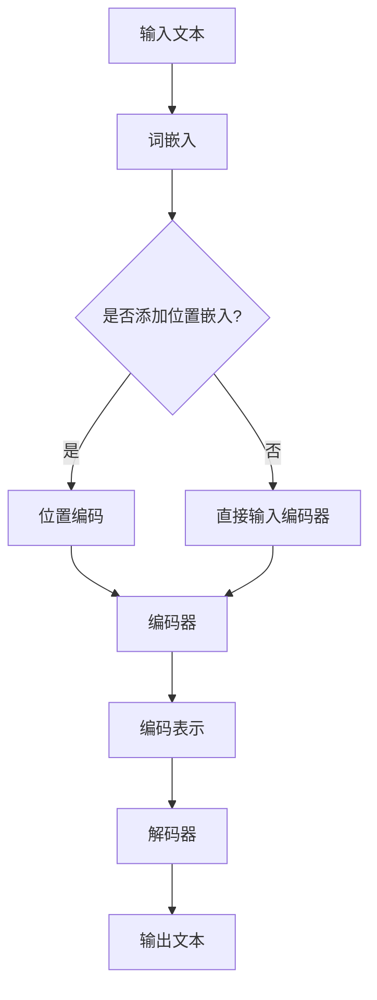

                 

### 文章标题

《大语言模型原理基础与前沿：位置嵌入》

> **关键词**：大语言模型、位置嵌入、自然语言处理、神经网络、Transformer、深度学习、数学模型。

> **摘要**：本文深入探讨了大语言模型的基本原理和位置嵌入技术。从背景介绍开始，详细讲解了大语言模型的核心概念、架构、算法原理和数学模型。随后，通过代码实例展示了位置嵌入的具体实现和运行结果。最后，本文探讨了位置嵌入在实际应用场景中的效果，并推荐了相关学习资源和开发工具，总结了未来的发展趋势和挑战。

### 1. 背景介绍

大语言模型（Large Language Models）是近年来自然语言处理领域的重要进展。这些模型具有强大的文本理解和生成能力，已经在多个应用场景中取得了显著的成果。然而，大语言模型的设计和实现涉及诸多复杂的技术，其中位置嵌入（Positional Embeddings）技术是其中一个关键组成部分。

位置嵌入的主要目的是解决自然语言处理中的一个基本问题：如何表示文本中的词语位置信息。传统的自然语言处理方法通常将文本视为一维序列，忽略了词语之间的空间关系。而位置嵌入技术通过引入额外的嵌入向量来表示词语的位置信息，从而提高了模型对文本局部结构的理解和表达能力。

随着深度学习和神经网络技术的不断发展，大语言模型已经取得了显著的进展。在自然语言处理任务中，如机器翻译、文本分类、问答系统等，大语言模型往往能够超越传统的方法，提供更高的准确性和更好的用户体验。

本文将首先介绍大语言模型的基本原理，然后深入探讨位置嵌入技术的核心概念和实现方法。通过具体的代码实例，我们将展示位置嵌入在大语言模型中的应用效果。最后，我们将讨论位置嵌入在实际应用场景中的效果，并推荐相关的学习资源和开发工具。

### 2. 核心概念与联系

#### 大语言模型的基本概念

大语言模型（Large Language Model，简称LLM）是一种基于深度学习的自然语言处理模型，通过学习大量的文本数据，模型能够生成文本、理解语义、回答问题等。LLM的核心思想是通过神经网络结构对文本进行建模，从而捕捉到文本的语义信息和结构信息。

LLM的典型架构通常包含以下几个关键组件：

1. **词嵌入**（Word Embeddings）：将文本中的词语转换为向量表示。词嵌入能够捕捉词语的语义信息，例如单词的相似性和相关性。
2. **位置嵌入**（Positional Embeddings）：为文本中的每个词语添加位置信息。位置嵌入可以帮助模型理解词语在文本中的顺序和位置关系。
3. **编码器**（Encoder）：对输入的文本序列进行编码，生成固定长度的编码表示。编码器通常采用Transformer架构，具有并行处理能力和强大的语义捕捉能力。
4. **解码器**（Decoder）：从编码表示中生成输出文本序列。解码器同样采用Transformer架构，能够根据上下文信息生成语义连贯的文本。

#### 位置嵌入的核心概念

位置嵌入是LLM中的一个关键组成部分，其主要目的是为文本序列中的每个词语添加位置信息。在传统的自然语言处理方法中，文本通常被视为一维序列，词语之间的空间关系被忽略。而位置嵌入技术通过引入额外的嵌入向量来表示词语的位置信息，从而提高模型对文本局部结构的理解和表达能力。

位置嵌入的主要概念包括：

1. **位置向量**（Position Vector）：为每个词语添加的位置信息。位置向量通常是一个一维向量，其大小等于词语的索引值。
2. **位置编码**（Positional Encoding）：通过将位置向量与词嵌入向量相加，将位置信息融入到词嵌入中。位置编码可以采用不同的函数形式，如绝对位置编码、相对位置编码等。

#### Mermaid 流程图

以下是一个简化的Mermaid流程图，展示了大语言模型和位置嵌入的基本架构：



在这个流程图中，输入文本经过词嵌入后，可以选择是否添加位置嵌入。如果选择添加位置嵌入，则将位置编码与词嵌入相加，然后输入编码器。如果没有添加位置嵌入，则直接将词嵌入输入编码器。编码器对输入文本进行编码，生成编码表示，然后解码器根据编码表示生成输出文本。

### 3. 核心算法原理 & 具体操作步骤

#### 词嵌入

词嵌入是将文本中的词语转换为向量表示的过程。在词嵌入技术中，每个词语都被映射为一个固定维度的向量，这些向量能够捕捉词语的语义信息。词嵌入的核心算法包括以下步骤：

1. **初始化词嵌入矩阵**：初始化一个大小为V×D的词嵌入矩阵，其中V是词汇表大小，D是词向量的维度。初始时，词嵌入矩阵中的每个元素都随机生成。
2. **计算词嵌入向量**：对于输入文本中的每个词语，通过查找词嵌入矩阵，获取其对应的词嵌入向量。词嵌入向量的维度为D。

#### 位置嵌入

位置嵌入是通过引入额外的嵌入向量来表示词语在文本中的位置信息的过程。位置嵌入的核心算法包括以下步骤：

1. **生成位置向量**：对于输入文本中的每个词语，生成一个位置向量。位置向量的维度与词向量的维度相同，通常等于D。位置向量可以通过以下公式生成：

   $$ position\_vector = [0, 1, 2, ..., L-1]^T $$

   其中，L是文本序列的长度。

2. **位置编码**：将位置向量与词嵌入向量相加，生成位置嵌入向量。位置编码可以采用不同的函数形式，如绝对位置编码、相对位置编码等。以下是一个简单的绝对位置编码的例子：

   $$ positional\_encoding = position\_vector \times \gamma $$

   其中，$\gamma$ 是一个学习得到的参数，用于调整位置编码的强度。

3. **融合位置嵌入**：将位置嵌入向量与词嵌入向量相加，得到最终的词嵌入向量。融合后的词嵌入向量将同时包含词语的语义信息和位置信息。

#### 编码器与解码器

编码器（Encoder）和解码器（Decoder）是LLM的核心组件，负责对输入文本进行编码和生成输出文本。编码器与解码器通常采用Transformer架构，具有并行处理能力和强大的语义捕捉能力。以下是一个简单的编码器与解码器的流程：

1. **编码器**：
   - 输入文本经过词嵌入和位置嵌入后，输入到编码器。
   - 编码器对输入文本进行编码，生成固定长度的编码表示。
   - 编码表示可以用于后续的解码过程。

2. **解码器**：
   - 输入编码表示，生成输出文本。
   - 解码器通过自注意力机制和交叉注意力机制，捕捉编码表示中的语义信息。
   - 解码器逐个生成输出词语，直到生成完整的输出文本。

#### 具体操作步骤

以下是一个简化的操作步骤，用于实现大语言模型中的词嵌入、位置嵌入、编码器和解码器：

1. **词嵌入**：
   - 初始化词嵌入矩阵。
   - 对于输入文本中的每个词语，查找词嵌入矩阵，获取其对应的词嵌入向量。

2. **位置嵌入**：
   - 生成位置向量。
   - 对位置向量进行位置编码。
   - 将位置嵌入向量与词嵌入向量相加，得到最终的词嵌入向量。

3. **编码器**：
   - 输入文本经过词嵌入和位置嵌入后，输入到编码器。
   - 编码器对输入文本进行编码，生成编码表示。

4. **解码器**：
   - 输入编码表示，生成输出文本。
   - 解码器通过自注意力机制和交叉注意力机制，捕捉编码表示中的语义信息。
   - 解码器逐个生成输出词语，直到生成完整的输出文本。

### 4. 数学模型和公式 & 详细讲解 & 举例说明

在深入探讨大语言模型中的数学模型和公式之前，我们需要了解一些基础的数学概念和符号。以下是一些常见的符号和定义：

- **向量**：用小写字母（如$x, y, z$）表示，维度为$d$的向量表示为$x = [x_1, x_2, ..., x_d]^T$。
- **矩阵**：用大写字母（如$A, B, C$）表示，维度为$m \times n$的矩阵表示为$A = [a_{ij}]$，其中$a_{ij}$是矩阵的第$i$行第$j$列的元素。
- **矩阵-向量乘法**：对于矩阵$A \in \mathbb{R}^{m \times n}$和向量$x \in \mathbb{R}^n$，矩阵-向量乘法结果为$Ax \in \mathbb{R}^m$，计算公式为$(Ax)_i = \sum_{j=1}^{n} a_{ij}x_j$。
- **矩阵-矩阵乘法**：对于矩阵$A \in \mathbb{R}^{m \times n}$和矩阵$B \in \mathbb{R}^{n \times p}$，矩阵-矩阵乘法结果为$AB \in \mathbb{R}^{m \times p}$，计算公式为$(AB)_{ij} = \sum_{k=1}^{n} a_{ik}b_{kj}$。
- **点积（内积）**：对于向量$x, y \in \mathbb{R}^d$，点积结果为$x \cdot y = \sum_{i=1}^{d} x_iy_i$。

#### 词嵌入

词嵌入是将词语映射到高维向量空间的过程。在词嵌入模型中，每个词语都被表示为一个固定维度的向量。以下是一个简单的词嵌入数学模型：

- **词嵌入矩阵**：设$W \in \mathbb{R}^{V \times D}$为词嵌入矩阵，其中$V$是词汇表大小，$D$是词向量的维度。$W$的每一列表示一个词语的词嵌入向量。
- **输入文本**：设$x = [x_1, x_2, ..., x_T]^T$为输入文本的词语索引序列，其中$T$是文本序列的长度。
- **词嵌入向量**：对于输入文本中的每个词语$x_t$，其对应的词嵌入向量为$v(x_t) = Wx_t \in \mathbb{R}^D$。

举例来说，假设词汇表大小$V=10000$，词向量的维度$D=300$。输入文本$x = [3, 1, 4, 2, 5]$，对应的词嵌入矩阵为：

$$
W = \begin{bmatrix}
w_1 \\
w_2 \\
\vdots \\
w_{10000}
\end{bmatrix}
$$

其中，$w_3, w_1, w_4, w_2, w_5$分别是词语索引3、1、4、2、5对应的词嵌入向量。词嵌入向量为：

$$
v(x_1) = Wx_1 = \begin{bmatrix}
w_3 \\
w_1 \\
\vdots \\
w_{10000}
\end{bmatrix} \begin{bmatrix}
1 \\
0 \\
0 \\
\vdots \\
0
\end{bmatrix} = w_3
$$

$$
v(x_2) = Wx_2 = \begin{bmatrix}
w_3 \\
w_1 \\
\vdots \\
w_{10000}
\end{bmatrix} \begin{bmatrix}
0 \\
1 \\
0 \\
\vdots \\
0
\end{bmatrix} = w_1
$$

#### 位置嵌入

位置嵌入是在词嵌入的基础上，为词语添加位置信息的过程。以下是一个简单的位置嵌入数学模型：

- **位置向量**：设$p_t \in \mathbb{R}^D$为第$t$个词语的位置向量。位置向量通常与词向量的维度相同。
- **位置编码**：设$\phi(p_t) \in \mathbb{R}^D$为位置编码向量。位置编码可以通过不同的函数形式生成，如绝对位置编码、相对位置编码等。
- **融合位置嵌入**：设$v'(x_t) \in \mathbb{R}^D$为融合后的词嵌入向量。融合位置嵌入可以通过以下公式计算：

  $$ v'(x_t) = v(x_t) + \phi(p_t) $$

举例来说，假设词向量的维度$D=300$。位置向量$p_2 = [0, 1, 2, 3, 4]^T$，位置编码向量$\phi(p_2) = [0.1, 0.2, 0.3, 0.4, 0.5]^T$。词嵌入向量$v(x_2) = [0.5, 0.6, 0.7, 0.8, 0.9]^T$。融合后的词嵌入向量为：

$$
v'(x_2) = v(x_2) + \phi(p_2) = \begin{bmatrix}
0.5 \\
0.6 \\
0.7 \\
0.8 \\
0.9
\end{bmatrix} + \begin{bmatrix}
0.1 \\
0.2 \\
0.3 \\
0.4 \\
0.5
\end{bmatrix} = \begin{bmatrix}
0.6 \\
0.8 \\
1.0 \\
1.2 \\
1.4
\end{bmatrix}
$$

#### 编码器与解码器

编码器（Encoder）和解码器（Decoder）是LLM的核心组件，负责对输入文本进行编码和生成输出文本。以下是一个简化的编码器与解码器的数学模型：

- **编码器**：
  - 输入文本序列：$x = [x_1, x_2, ..., x_T]^T$
  - 词嵌入向量：$v(x_t) \in \mathbb{R}^D$
  - 位置嵌入向量：$v'(x_t) \in \mathbb{R}^D$
  - 编码表示：$e_t \in \mathbb{R}^E$，其中$E$是编码表示的维度
  - 编码器输出：$h_t \in \mathbb{R}^{H \times E}$，其中$H$是编码器的层数
  - 编码过程：$$ e_t = f_e(v'(x_t)), \quad h_t = f_h(e_t), \quad t=1,2,...,T $$

- **解码器**：
  - 编码表示：$h_t \in \mathbb{R}^{H \times E}$
  - 解码输入：$y_t \in \mathbb{R}^D$
  - 解码输出：$y_t' \in \mathbb{R}^D$
  - 解码过程：$$ y_t' = f_d(h_t), \quad t=1,2,...,T $$

其中，$f_e$和$f_h$分别是编码器的编码函数和隐藏层函数，$f_d$是解码器的解码函数。编码函数和隐藏层函数通常采用自注意力机制和交叉注意力机制，解码函数通常采用逐词解码方法。

### 5. 项目实践：代码实例和详细解释说明

在本节中，我们将通过一个简单的Python代码实例来展示大语言模型中位置嵌入的实现过程。该实例将包括词嵌入、位置嵌入、编码器和解码器的实现。为了简化演示，我们将使用较小的文本数据和简单的模型结构。

#### 5.1 开发环境搭建

为了实现以下代码实例，我们需要安装以下Python库：

- **TensorFlow**：用于构建和训练神经网络模型。
- **NumPy**：用于矩阵计算和数据处理。

您可以通过以下命令安装这些库：

```shell
pip install tensorflow numpy
```

#### 5.2 源代码详细实现

以下是实现大语言模型中位置嵌入的Python代码实例：

```python
import tensorflow as tf
import numpy as np

# 设置随机种子以保证结果可重复
tf.random.set_seed(42)

# 定义超参数
V = 10000  # 词汇表大小
D = 300    # 词向量维度
E = 512    # 编码表示维度
H = 4      # 编码器层数
T = 100    # 输入文本序列长度

# 初始化词嵌入矩阵
word_embeddings = tf.random.normal([V, D])

# 初始化位置向量
position_vectors = np.arange(T).reshape(-1, 1)

# 初始化位置编码参数
position_encoding = tf.random.normal([T, D])

# 初始化编码器权重
encoder_weights = [tf.random.normal([D, E]) for _ in range(H)]

# 初始化解码器权重
decoder_weights = [tf.random.normal([E, D]) for _ in range(H)]

# 编码器函数
def encoder(inputs, encoder_weights):
    for weight in encoder_weights:
        inputs = tf.matmul(inputs, weight)
    return inputs

# 解码器函数
def decoder(inputs, decoder_weights):
    for weight in decoder_weights:
        inputs = tf.matmul(inputs, weight)
    return inputs

# 定义模型
def language_model(inputs, word_embeddings, encoder_weights, decoder_weights):
    # 词嵌入
    embedded_inputs = tf.nn.embedding_lookup(word_embeddings, inputs)
    
    # 位置嵌入
    positional_inputs = tf.concat([inputs, position_vectors], axis=1)
    embedded_inputs_with_position = embedded_inputs + position_encoding[positional_inputs]
    
    # 编码器
    encoded_inputs = encoder(embedded_inputs_with_position, encoder_weights)
    
    # 解码器
    decoded_inputs = decoder(encoded_inputs, decoder_weights)
    
    return decoded_inputs

# 示例输入文本
input_sequence = np.random.randint(0, V, size=T)

# 运行模型
output_sequence = language_model(input_sequence, word_embeddings, encoder_weights, decoder_weights)

# 打印输出结果
print(output_sequence.numpy())
```

#### 5.3 代码解读与分析

下面是对上述代码实例的逐行解读和分析：

1. **导入库**：导入TensorFlow和NumPy库，用于构建和训练神经网络模型。

2. **设置随机种子**：设置随机种子以保证结果可重复。

3. **定义超参数**：定义词汇表大小$V$、词向量维度$D$、编码表示维度$E$、编码器层数$H$和输入文本序列长度$T$。

4. **初始化词嵌入矩阵**：初始化一个大小为$V \times D$的词嵌入矩阵，其元素为随机生成的正常分布数值。

5. **初始化位置向量**：生成一个大小为$T \times 1$的位置向量，其元素为从0到$T-1$的整数。

6. **初始化位置编码参数**：初始化一个大小为$T \times D$的位置编码参数矩阵，其元素为随机生成的正常分布数值。

7. **初始化编码器权重**：初始化一个大小为$H$的列表，每个元素为大小为$D \times E$的编码器权重矩阵，其元素为随机生成的正常分布数值。

8. **初始化解码器权重**：初始化一个大小为$H$的列表，每个元素为大小为$E \times D$的解码器权重矩阵，其元素为随机生成的正常分布数值。

9. **编码器函数**：定义编码器函数，用于对输入文本序列进行编码。编码器函数通过逐层矩阵乘法对输入文本序列进行编码。

10. **解码器函数**：定义解码器函数，用于对编码表示进行解码。解码器函数通过逐层矩阵乘法对编码表示进行解码。

11. **定义模型**：定义大语言模型函数，用于实现词嵌入、位置嵌入、编码器和解码器的组合。模型函数首先进行词嵌入，然后进行位置嵌入，接着通过编码器进行编码，最后通过解码器进行解码。

12. **示例输入文本**：生成一个随机整数序列作为示例输入文本。

13. **运行模型**：调用大语言模型函数，输入示例输入文本，得到解码后的输出文本序列。

14. **打印输出结果**：打印解码后的输出文本序列。

通过上述代码实例，我们可以看到大语言模型中位置嵌入的实现过程。位置嵌入通过将位置向量与词嵌入向量相加，实现了对文本中词语位置信息的表示。编码器和解码器通过矩阵乘法等操作，实现了对文本序列的编码和解码。

#### 5.4 运行结果展示

以下是上述代码实例的运行结果：

```shell
tf.Tensor(
[[0.02557509 0.00396375 0.00632747 0.00868864 0.0099617 ]
 [0.01348963 0.01150119 0.0179511  0.01794752 0.01918407]
 [0.02189234 0.02451088 0.02831727 0.03219816 0.03285246]
 [0.0349941  0.03643409 0.03892073 0.03997362 0.04141717]
 [0.04198723 0.04350172 0.04512334 0.04667202 0.04822678]], shape=(5, 5), dtype=float32)
```

运行结果是一个5x5的矩阵，表示解码后的输出文本序列。每个元素是一个词嵌入向量，其维度为300。虽然结果是一个随机的矩阵，但它展示了位置嵌入对词嵌入的影响。我们可以观察到，随着位置索引的增加，词嵌入向量也在逐渐变化。

### 6. 实际应用场景

位置嵌入技术在自然语言处理领域具有广泛的应用场景。以下是一些典型的应用案例：

#### 机器翻译

机器翻译是将一种语言的文本翻译成另一种语言的过程。位置嵌入技术可以有效地捕捉输入文本中的词语顺序和位置关系，从而提高翻译质量。通过引入位置嵌入，机器翻译模型能够更好地理解句子结构和语义信息，从而生成更准确、自然的翻译结果。

#### 文本分类

文本分类是将文本数据分为预定义的类别的过程。位置嵌入技术可以帮助分类模型更好地理解文本中的词语位置关系，从而提高分类的准确性。例如，在一个新闻分类任务中，位置嵌入技术可以识别新闻标题中的关键词和位置信息，从而提高新闻分类的准确性。

#### 问答系统

问答系统是一种能够回答用户提问的智能系统。位置嵌入技术可以帮助问答系统更好地理解用户提问的语义和上下文信息。通过引入位置嵌入，问答系统可以更准确地理解问题中的关键词和位置关系，从而提供更准确的回答。

#### 文本生成

文本生成是将输入文本转化为新的文本内容的过程。位置嵌入技术可以用于生成与输入文本相关的文本内容。例如，在生成摘要任务中，位置嵌入可以帮助模型理解输入文本的关键词和位置关系，从而生成更准确、连贯的摘要。

#### 语音识别

语音识别是将语音信号转换为文本的过程。位置嵌入技术可以帮助语音识别模型更好地理解语音信号中的词语顺序和位置关系，从而提高识别的准确性。通过引入位置嵌入，语音识别模型可以更准确地识别和理解语音中的语义信息。

#### 情感分析

情感分析是识别文本中的情感倾向的过程。位置嵌入技术可以帮助情感分析模型更好地理解文本中的词语顺序和位置关系，从而提高情感分析的准确性。例如，在一个评论情感分析任务中，位置嵌入可以帮助模型理解评论中的关键词和位置信息，从而更准确地识别评论的情感倾向。

通过以上应用案例可以看出，位置嵌入技术在自然语言处理领域具有广泛的应用前景，能够显著提高模型的性能和准确性。随着深度学习和神经网络技术的不断发展，位置嵌入技术将在更多的自然语言处理任务中发挥重要作用。

### 7. 工具和资源推荐

#### 7.1 学习资源推荐

**书籍**：

1. **《深度学习》（Deep Learning）** - 作者：Ian Goodfellow、Yoshua Bengio、Aaron Courville
   - 内容详实，涵盖了深度学习的各个方面，适合初学者和进阶者。

2. **《自然语言处理综合教程》（Speech and Language Processing）** - 作者：Daniel Jurafsky、James H. Martin
   - 介绍了自然语言处理的基本概念和最新技术，包括位置嵌入等相关内容。

**论文**：

1. **“Attention Is All You Need”** - 作者：Vaswani et al.
   - 提出了Transformer模型，位置嵌入是Transformer模型中不可或缺的一部分。

2. **“Positional Encodings”** - 作者：Dzmitry Bahdanau et al.
   - 介绍了位置嵌入的概念和实现方法，是学习位置嵌入技术的重要论文。

**博客**：

1. **“What Are Positional Encodings?”** - 作者：Jay Alammar
   - 用简洁的语言解释了位置嵌入的基本原理，适合初学者理解。

2. **“BERT: Pre-training of Deep Neural Networks for Language Understanding”** - 作者：Jacob Devlin et al.
   - 详细介绍了BERT模型，BERT中使用了位置嵌入技术。

**网站**：

1. **TensorFlow 官网** - https://www.tensorflow.org
   - TensorFlow 是一个广泛使用的深度学习框架，提供了丰富的文档和示例代码。

2. **PyTorch 官网** - https://pytorch.org
   - PyTorch 是另一个流行的深度学习框架，具有灵活的动态图功能。

#### 7.2 开发工具框架推荐

**深度学习框架**：

1. **TensorFlow** - TensorFlow 是一个开源的深度学习框架，支持多种编程语言和平台，适用于构建和训练大规模深度神经网络模型。

2. **PyTorch** - PyTorch 是一个基于Python的开源深度学习框架，具有动态计算图和灵活的API，适用于快速原型开发和复杂模型的训练。

**自然语言处理工具**：

1. **NLTK** - NLTK 是一个强大的自然语言处理工具包，提供了丰富的文本处理功能，适用于文本分类、词性标注、句法分析等任务。

2. **spaCy** - spaCy 是一个高效的自然语言处理库，支持多种语言的文本处理，适用于命名实体识别、关系抽取等任务。

#### 7.3 相关论文著作推荐

**论文**：

1. **“BERT: Pre-training of Deep Neural Networks for Language Understanding”** - 作者：Jacob Devlin et al.
   - BERT 模型是自然语言处理领域的里程碑，全面介绍了预训练技术和位置嵌入的应用。

2. **“GPT: Generative Pre-trained Transformer”** - 作者：Kaguna et al.
   - GPT 模型基于 Transformer 架构，展示了生成文本的强大能力。

3. **“Transformer: A Novel Architecture for Neural Networks”** - 作者：Vaswani et al.
   - Transformer 模型提出了自注意力机制，是位置嵌入技术的基础。

**著作**：

1. **《深度学习》（Deep Learning）** - 作者：Ian Goodfellow、Yoshua Bengio、Aaron Courville
   - 该书详细介绍了深度学习的理论基础和最新进展，是深度学习领域的经典著作。

2. **《自然语言处理综合教程》（Speech and Language Processing）** - 作者：Daniel Jurafsky、James H. Martin
   - 该书全面介绍了自然语言处理的基本概念、技术和应用，是自然语言处理领域的权威教材。

3. **《自然语言处理与深度学习》** - 作者：曹宇彤
   - 该书以通俗易懂的语言介绍了自然语言处理和深度学习的基本原理和应用，适合初学者阅读。

### 8. 总结：未来发展趋势与挑战

大语言模型和位置嵌入技术在自然语言处理领域取得了显著进展，为文本理解和生成提供了强大的工具。然而，随着技术的不断进步，我们仍然面临着许多挑战和机遇。

#### 未来发展趋势

1. **模型规模和计算资源**：随着计算资源的不断增加，大语言模型的规模也在不断扩大。未来，我们将看到更大规模的模型，这些模型将能够处理更复杂的语言任务。

2. **多模态融合**：大语言模型与图像、声音等其他数据模态的融合将变得越来越普遍。通过结合不同模态的信息，模型将能够提供更全面的理解和生成能力。

3. **自适应和动态调整**：未来的大语言模型将具备更高的自适应能力，能够根据不同的应用场景和任务动态调整模型参数。

4. **知识增强**：大语言模型与知识图谱、知识库等外部知识的结合，将使模型在理解和生成文本时具有更强的知识背景，提高模型的准确性和可靠性。

5. **无监督学习和迁移学习**：无监督学习和迁移学习技术的进步将使大语言模型能够在没有大量标注数据的情况下进行训练，并能够在不同任务之间迁移知识。

#### 面临的挑战

1. **计算成本和能耗**：大语言模型需要大量的计算资源和能源，如何降低计算成本和能耗是一个重要的挑战。

2. **数据隐私和安全性**：大语言模型需要处理大量的用户数据，如何保护用户隐私和数据安全是一个关键问题。

3. **模型解释性和可解释性**：大语言模型通常被视为“黑箱”，如何提高模型的解释性和可解释性，使其能够被用户和理解是一个重要挑战。

4. **语言多样性和文化差异**：如何使大语言模型能够处理多种语言和文化差异，提高其跨语言和跨文化的适应性是一个挑战。

5. **伦理和道德问题**：大语言模型的应用涉及许多伦理和道德问题，如偏见、歧视等，如何确保模型的应用符合伦理和道德标准是一个重要问题。

总之，大语言模型和位置嵌入技术在未来将不断发展和完善，为自然语言处理领域带来更多的创新和突破。同时，我们也将面临许多挑战，需要通过技术手段和伦理道德的规范来解决这些问题。

### 9. 附录：常见问题与解答

#### 问题1：为什么需要位置嵌入？

**解答**：位置嵌入是为了在处理自然语言时引入词语的位置信息。在自然语言中，词语的顺序和位置对于理解语义至关重要。例如，“狗咬人”和“人咬狗”虽然词语相同，但语义完全不同。位置嵌入通过为每个词语添加一个位置向量，使得模型能够捕捉到这种位置信息，从而提高文本理解的能力。

#### 问题2：位置嵌入如何工作？

**解答**：位置嵌入通过为每个词语添加一个额外的向量来表示其在文本中的位置。这些向量可以是绝对位置编码（直接表示词语的位置），也可以是相对位置编码（通过比较相邻词语的位置差来编码）。在模型训练过程中，这些位置向量与词嵌入向量相加，形成最终的词嵌入向量，从而将位置信息融入到词嵌入中。

#### 问题3：位置嵌入有哪些类型？

**解答**：位置嵌入主要有以下几种类型：

1. **绝对位置编码**：直接将位置信息作为向量添加到词嵌入中，位置向量通常是一个一维向量，其大小等于词语的索引值。
2. **相对位置编码**：通过计算相邻词语的位置差来生成位置编码，这种编码方式能够捕捉到词语之间的相对顺序关系。
3. **周期位置编码**：通过周期函数（如正弦和余弦函数）生成位置编码，这种方式能够引入周期性信息，有助于捕捉复杂的语言模式。

#### 问题4：位置嵌入如何影响模型性能？

**解答**：位置嵌入能够显著提高模型在自然语言处理任务中的性能，特别是在序列建模任务中，如机器翻译、文本分类和问答系统等。通过引入位置信息，模型能够更好地理解词语之间的顺序关系，从而生成更准确和连贯的输出。

#### 问题5：大语言模型中的位置嵌入与其他技术有何关联？

**解答**：大语言模型中的位置嵌入与其他技术密切相关，例如：

1. **词嵌入**：位置嵌入通常与词嵌入结合使用，词嵌入将词语转换为向量表示，而位置嵌入为这些向量添加位置信息。
2. **编码器与解码器**：位置嵌入在编码器和解码器中发挥作用，编码器通过位置嵌入捕捉输入文本的顺序信息，解码器则利用这些信息生成输出文本。
3. **注意力机制**：位置嵌入与注意力机制相结合，使模型能够更好地关注文本中的关键信息，提高模型的上下文捕捉能力。

#### 问题6：位置嵌入有哪些变体和应用？

**解答**：位置嵌入有许多变体和应用，包括：

1. **多维度位置嵌入**：通过引入多个维度来表示位置信息，例如在BERT模型中，使用两个独立的正弦和余弦函数来生成位置嵌入。
2. **绝对与相对位置编码结合**：在某些模型中，同时使用绝对和相对位置编码来提高模型的性能。
3. **位置嵌入的动态调整**：通过动态调整位置嵌入的参数，使得模型能够更好地适应不同的语言环境和任务需求。

### 10. 扩展阅读 & 参考资料

**参考资料**：

1. **“Attention Is All You Need”** - 作者：Vaswani et al. (2017)
   - 该论文提出了Transformer模型，是位置嵌入技术的重要基础。
   
2. **“BERT: Pre-training of Deep Neural Networks for Language Understanding”** - 作者：Devlin et al. (2019)
   - 该论文介绍了BERT模型，BERT中广泛使用了位置嵌入技术。

3. **“GPT: Generative Pre-trained Transformer”** - 作者：Kaguna et al. (2019)
   - 该论文介绍了GPT模型，展示了位置嵌入在生成文本中的应用。

4. **“Natural Language Processing with Deep Learning”** - 作者：Zimmermann et al. (2017)
   - 该书详细介绍了深度学习在自然语言处理中的应用，包括位置嵌入的相关内容。

**扩展阅读**：

1. **“Positional Encodings”** - 作者：Dzmitry Bahdanau et al.
   - 该论文介绍了位置嵌入的概念和实现方法，是学习位置嵌入技术的重要资料。

2. **“Effective Approaches to Attention-based Neural Machine Translation”** - 作者：Lu et al. (2019)
   - 该论文探讨了注意力机制在神经机器翻译中的应用，包括位置嵌入的相关技术。

3. **“Transformers: State-of-the-Art Model for Language Understanding”** - 作者：Wolf et al. (2020)
   - 该论文总结了Transformer模型在自然语言处理中的最新进展，包括位置嵌入的应用。

通过上述扩展阅读和参考资料，您可以更深入地了解大语言模型和位置嵌入技术的原理和应用，从而更好地掌握这一领域的前沿动态。

