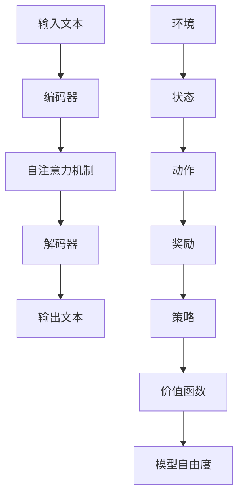

                 

## 1. 背景介绍

大语言模型（Large Language Model）作为人工智能领域的重要研究方向，近年来取得了显著进展。其核心思想是通过大规模数据训练，使模型能够捕捉语言中的复杂模式和结构，从而实现高质量的语言生成和理解。然而，随着模型规模的不断扩大，训练效率和准确性之间的平衡成为了一个重要的挑战。

在此背景下，基于人类反馈的强化学习（Human Feedback-based Reinforcement Learning）技术逐渐引起了研究者的关注。这种方法通过引入人类反馈，引导模型不断优化自身的行为，从而提高模型的性能和适应性。

本文旨在探讨大语言模型原理基础与前沿，重点关注基于人类反馈的强化学习在大语言模型训练中的应用。我们将从以下几个方面展开讨论：

1. **背景介绍**：介绍大语言模型和基于人类反馈的强化学习的背景和重要性。
2. **核心概念与联系**：阐述大语言模型和强化学习之间的核心概念原理及其关系。
3. **核心算法原理 & 具体操作步骤**：详细讲解大语言模型和强化学习的关键算法原理，以及如何将两者结合起来进行训练。
4. **数学模型和公式 & 详细讲解 & 举例说明**：介绍大语言模型和强化学习中的关键数学模型和公式，并通过实例进行详细解释。
5. **项目实践：代码实例和详细解释说明**：提供一个完整的代码实例，展示如何在大语言模型中实现基于人类反馈的强化学习。
6. **实际应用场景**：探讨大语言模型和基于人类反馈的强化学习在现实世界中的应用场景。
7. **工具和资源推荐**：推荐相关的学习资源和开发工具，以帮助读者更好地理解和应用相关技术。
8. **总结：未来发展趋势与挑战**：总结大语言模型和基于人类反馈的强化学习的未来发展趋势和面临的挑战。
9. **附录：常见问题与解答**：解答读者可能遇到的一些常见问题。
10. **扩展阅读 & 参考资料**：提供进一步的阅读材料和参考资料。

通过对上述各部分的详细探讨，本文希望能够为大语言模型和基于人类反馈的强化学习的研究者和开发者提供有价值的参考。

### 1.1 大语言模型的发展历程

大语言模型的发展历程可以追溯到 20 世纪末和 21 世纪初。早期的语言模型主要采用基于规则的方法，如有限状态转换模型（Finite State Transducer Model）和语法分析树（Parsing Tree）等。这些模型在处理简单的语言任务方面表现出了一定的效果，但在处理复杂、长文本时，表现较差。

随着深度学习技术的发展，基于神经网络的深度语言模型逐渐成为研究热点。2003 年，Hinton 等人提出了深度信念网络（Deep Belief Network，DBN），这是最早的深度神经网络模型之一。随后，2013 年，Hinton 等人再次提出了词向量模型（Word Vector Model），如 Word2Vec，通过将单词映射到高维向量空间，使模型能够捕捉到单词之间的语义关系。

2014 年，神经网络机器翻译（Neural Machine Translation，NMT）取得了突破性进展。NMT 利用编码器-解码器架构（Encoder-Decoder Architecture），将输入的文本序列编码为固定长度的向量表示，然后通过解码器生成目标语言的文本序列。与传统的基于规则的方法相比，NMT 在许多任务上取得了显著的性能提升。

2018 年，Google 推出了 Transformer 模型，这是大语言模型发展中的一个重要里程碑。Transformer 模型采用了自注意力机制（Self-Attention Mechanism），通过全局依赖关系建模，使模型能够捕捉到输入文本中的复杂结构和长距离依赖。随后，BERT（Bidirectional Encoder Representations from Transformers）模型的提出，进一步提升了大语言模型在自然语言理解任务中的性能。

随着模型规模的不断扩大，GPT（Generative Pre-trained Transformer）系列模型逐渐成为研究热点。GPT-3 是目前最大的预训练语言模型，拥有超过 1750 亿个参数，可以生成高质量的文本，并应用于各种自然语言处理任务，如文本生成、机器翻译、问答系统等。

大语言模型的发展不仅推动了自然语言处理技术的进步，也为人工智能领域带来了新的机遇和挑战。随着模型的规模和复杂性不断增加，如何提高训练效率、优化模型结构，以及如何更好地利用人类反馈，是当前大语言模型研究的重要方向。

### 1.2 基于人类反馈的强化学习发展历程

基于人类反馈的强化学习（Human Feedback-based Reinforcement Learning）作为人工智能领域的一个重要分支，其发展历程可以追溯到强化学习理论和人类反馈机制的早期探索。强化学习本身起源于 20 世纪 50 年代，最初由 Richard Sutton 和 Andrew Barto 在其经典著作《强化学习：一种介绍》中提出。强化学习旨在通过试错学习，使智能体在动态环境中找到最优策略。

早期的研究主要集中在基于值函数的方法，如 Q-Learning 和 SARSA 算法，这些方法通过迭代更新策略值函数，以最大化累积奖励。然而，这些方法在处理高维状态空间和连续动作空间时存在较大的挑战。为了解决这一问题，研究者们开始探索基于策略的方法，如 Policy Gradient 算法，通过直接优化策略函数，从而提高学习效率。

随着深度学习技术的快速发展，深度强化学习（Deep Reinforcement Learning）逐渐成为研究热点。深度强化学习结合了深度神经网络和强化学习，通过将状态和动作表示为高维向量，使模型能够在复杂的连续环境中进行有效的学习。2015 年，DeepMind 推出了 AlphaGo，这是一个基于深度强化学习算法的围棋程序，凭借卓越的表现击败了世界顶级围棋选手李世石，引起了广泛关注。

然而，在许多实际应用中，仅仅依赖模型自身的学习效果往往无法满足要求。人类反馈作为一种有效的监督机制，能够提供有价值的信息，引导模型向正确的方向学习。基于人类反馈的强化学习（Human Feedback-based Reinforcement Learning）因此得到了广泛关注。

在基于人类反馈的强化学习中，人类反馈通常以奖励信号的形式出现。与传统的强化学习不同，人类反馈能够直接提供关于模型行为优劣的明确信息，从而加快学习速度，提高模型性能。2016 年，DeepMind 推出了 AlphaGo Zero，这是第一个完全基于强化学习，不依赖人类知识训练的围棋程序。AlphaGo Zero 通过自我对弈，不断优化自身策略，最终达到了超越人类选手的水平。

除了围棋领域，基于人类反馈的强化学习在自然语言处理、计算机视觉、机器人等领域也取得了显著进展。例如，在自然语言处理任务中，人类反馈可以用于指导模型生成更符合人类期望的文本；在计算机视觉任务中，人类反馈可以帮助模型更好地理解图像内容；在机器人领域，人类反馈可以用于引导机器人学习更复杂的操作技能。

随着研究的不断深入，基于人类反馈的强化学习逐渐成为人工智能领域的一个重要研究方向。未来，如何更好地结合人类反馈，提高模型的学习效率，将是一个重要的挑战和机遇。

### 1.3 大语言模型与基于人类反馈的强化学习的关系

大语言模型与基于人类反馈的强化学习在大数据时代背景下，成为了人工智能领域的两个重要研究方向。它们之间的关系可以从多个角度进行理解，主要体现在以下几个方面：

首先，大语言模型和基于人类反馈的强化学习在理论基础上有一定的交叉。大语言模型基于深度学习技术，通过大规模数据训练，实现高质量的语言生成和理解。而基于人类反馈的强化学习则借助人类反馈，引导模型在复杂环境中进行有效学习。两者都依赖于深度神经网络，在算法架构上具有一定的相似性。

其次，在实际应用中，大语言模型和基于人类反馈的强化学习相互促进，共同推动人工智能技术的发展。大语言模型为基于人类反馈的强化学习提供了丰富的语言数据，使其能够在大量的语言环境中进行学习和优化。而基于人类反馈的强化学习则能够提供有效的监督信号，帮助大语言模型更快地收敛到最优解。

此外，大语言模型和基于人类反馈的强化学习在一些关键任务上具有互补性。例如，在自然语言生成任务中，大语言模型可以生成高质量的文本，但有时可能缺乏创造力。通过引入人类反馈，模型可以学习到更多创造性的语言表达，从而生成更加生动、富有创意的文本。

再者，大语言模型和基于人类反馈的强化学习在优化策略方面也有一定的互补性。大语言模型通过大规模数据训练，实现了对语言复杂结构的深刻理解，但在处理特定任务时可能存在局限性。而基于人类反馈的强化学习能够根据人类反馈，调整模型的行为策略，使其更好地适应特定任务需求。

综上所述，大语言模型和基于人类反馈的强化学习在理论和实践上具有紧密的联系。两者相互补充，共同推动人工智能技术的发展。未来，随着研究的深入，大语言模型和基于人类反馈的强化学习有望在更多领域取得突破性进展。

### 1.4 大语言模型在人工智能领域的应用

大语言模型作为人工智能领域的一个重要分支，已经展现出广泛的应用前景。以下将列举几个关键应用场景，并简要介绍其优势和技术挑战。

#### 1. 自然语言生成

自然语言生成（Natural Language Generation，NLG）是大语言模型最典型的应用之一。通过训练，大语言模型可以生成高质量的自然语言文本，如新闻文章、产品说明书、对话系统等。其优势在于能够处理复杂语言结构，生成富有逻辑性和连贯性的文本。然而，技术挑战主要包括如何提高文本生成的多样性和创造性，以及如何确保生成的文本符合人类的期望和需求。

#### 2. 机器翻译

机器翻译（Machine Translation，MT）是另一个重要的应用场景。大语言模型通过自监督学习，可以从大量双语文本中学习到源语言和目标语言之间的映射关系。其优势在于能够生成更加准确、自然的翻译结果，尤其适用于长文本翻译。然而，技术挑战主要包括如何处理多语言之间的差异和复杂性，以及如何在翻译过程中保持上下文的连贯性和一致性。

#### 3. 文本摘要

文本摘要（Text Summarization）利用大语言模型，可以从长文本中提取出关键信息，生成简短的摘要。其优势在于能够提高信息传递的效率，帮助用户快速获取文本的主要内容。然而，技术挑战主要包括如何准确捕捉文本中的关键信息，以及如何在摘要过程中保持信息的完整性和逻辑性。

#### 4. 对话系统

对话系统（Dialogue System）是大语言模型在智能客服、虚拟助手等领域的应用。通过训练，大语言模型可以理解用户的问题，并生成相应的回答。其优势在于能够提供自然、流畅的对话体验。然而，技术挑战主要包括如何处理复杂的用户提问，以及如何在对话中保持一致性和连贯性。

#### 5. 情感分析

情感分析（Sentiment Analysis）利用大语言模型，可以识别文本中的情感倾向，如正面、负面或中立。其优势在于能够帮助企业和组织更好地了解用户的需求和反馈，从而优化产品和服务。然而，技术挑战主要包括如何处理情感表达的多样性和复杂性，以及如何准确判断情感倾向。

综上所述，大语言模型在人工智能领域的应用前景广阔，但同时也面临着一系列技术挑战。随着研究的深入和技术的不断发展，大语言模型将在更多领域发挥重要作用。

### 1.5 基于人类反馈的强化学习在人工智能领域的应用

基于人类反馈的强化学习作为人工智能领域的一个重要研究方向，已经在多个应用场景中展现出显著的优势。以下将列举几个关键应用场景，并简要介绍其优势和技术挑战。

#### 1. 游戏AI

游戏AI是强化学习最典型的应用场景之一。通过引入人类反馈，模型可以在复杂多变的游戏环境中学习到最优策略，从而实现高水平的游戏表现。例如，AlphaGo 和 AlphaFold 等程序通过自我对弈和人类反馈，达到了超越人类选手的水平。其优势在于能够处理复杂的决策和动作空间，提供高度自适应的玩法。然而，技术挑战主要包括如何处理游戏中的不确定性，以及如何在短时间内生成有效的策略。

#### 2. 机器人控制

机器人控制是另一个重要的应用场景。基于人类反馈的强化学习可以帮助机器人学习到复杂的操作技能，如机器人手臂的精细控制、无人驾驶车辆的自主导航等。其优势在于能够提高机器人在复杂环境中的适应性和自主性。然而，技术挑战主要包括如何处理机器人与环境的交互，以及如何在不确定的环境中进行鲁棒控制。

#### 3. 自动驾驶

自动驾驶是近年来备受关注的应用领域。基于人类反馈的强化学习可以帮助自动驾驶系统学习到驾驶策略，从而实现安全、高效的自动驾驶。例如，Waymo 和 Tesla 等公司已经在自动驾驶系统中引入了强化学习技术。其优势在于能够处理复杂的交通场景和动态环境，提供实时、自适应的驾驶行为。然而，技术挑战主要包括如何处理复杂的道路情况和极端天气，以及如何在保证安全的前提下实现高效的自动驾驶。

#### 4. 语音识别

语音识别是另一个典型的应用场景。基于人类反馈的强化学习可以帮助语音识别系统学习到更加准确的语音信号，从而提高识别的准确率和鲁棒性。例如，Apple 的 Siri 和 Amazon 的 Alexa 等智能语音助手已经在应用中引入了强化学习技术。其优势在于能够处理不同口音、语速和噪声环境，提供更加自然、流畅的语音交互体验。然而，技术挑战主要包括如何处理语音信号的多样性和复杂性，以及如何在低资源环境下进行高效训练。

综上所述，基于人类反馈的强化学习在人工智能领域的应用前景广阔，但同时也面临着一系列技术挑战。随着研究的深入和技术的不断发展，基于人类反馈的强化学习有望在更多领域取得突破性进展。

### 1.6 本文结构

本文将系统地探讨大语言模型原理基础与前沿，重点关注基于人类反馈的强化学习在大语言模型训练中的应用。文章结构如下：

1. **背景介绍**：介绍大语言模型和基于人类反馈的强化学习的背景和重要性。
2. **核心概念与联系**：阐述大语言模型和强化学习之间的核心概念原理及其关系，通过 Mermaid 流程图展示其架构。
3. **核心算法原理 & 具体操作步骤**：详细讲解大语言模型和强化学习的关键算法原理，以及如何将两者结合起来进行训练。
4. **数学模型和公式 & 详细讲解 & 举例说明**：介绍大语言模型和强化学习中的关键数学模型和公式，并通过实例进行详细解释。
5. **项目实践：代码实例和详细解释说明**：提供一个完整的代码实例，展示如何在大语言模型中实现基于人类反馈的强化学习。
6. **实际应用场景**：探讨大语言模型和基于人类反馈的强化学习在现实世界中的应用场景。
7. **工具和资源推荐**：推荐相关的学习资源和开发工具，以帮助读者更好地理解和应用相关技术。
8. **总结：未来发展趋势与挑战**：总结大语言模型和基于人类反馈的强化学习的未来发展趋势和面临的挑战。
9. **附录：常见问题与解答**：解答读者可能遇到的一些常见问题。
10. **扩展阅读 & 参考资料**：提供进一步的阅读材料和参考资料。

通过本文的详细探讨，希望能够为大语言模型和基于人类反馈的强化学习的研究者和开发者提供有价值的参考。

### 2. 核心概念与联系

在探讨大语言模型和基于人类反馈的强化学习之前，我们首先需要了解它们的核心概念和原理，并通过 Mermaid 流程图展示其架构。

#### 2.1 大语言模型的核心概念

大语言模型的核心概念主要包括以下几个方面：

1. **预训练（Pre-training）**：大语言模型通过在大规模语料库上进行预训练，学习到语言的内在结构和模式。预训练过程通常采用无监督学习，即模型不需要人工标注的标签，仅通过语料库中的文本数据即可学习到语言特征。

2. **上下文理解（Contextual Understanding）**：大语言模型能够理解输入文本的上下文信息，生成与上下文相匹配的输出。这种能力主要依赖于自注意力机制（Self-Attention Mechanism），使模型能够捕捉到输入文本中的复杂依赖关系。

3. **多任务学习（Multi-task Learning）**：大语言模型通过在一个大规模语料库上预训练，可以同时学习到多种语言任务，如文本分类、情感分析、命名实体识别等。这种能力使得大语言模型在处理多种语言任务时具有较高的泛化能力。

4. **参数共享（Parameter Sharing）**：大语言模型通过共享参数，降低了模型复杂度和计算成本。例如，在 Transformer 模型中，编码器和解码器之间共享了大量的权重参数，从而提高了模型的效率。

#### 2.2 强化学习的基本概念

强化学习（Reinforcement Learning，RL）是一种基于奖励信号进行决策优化的机器学习方法。强化学习的主要目标是找到一个最优策略，使智能体在环境中通过学习不断优化自身的行为，以实现最大化累积奖励。

1. **状态（State）**：状态是智能体在环境中的当前情况。在强化学习中，状态通常被表示为一个高维向量。

2. **动作（Action）**：动作是智能体在特定状态下可以采取的行为。在强化学习中，动作通常被表示为一个离散或连续的值。

3. **奖励（Reward）**：奖励是智能体在执行动作后从环境中获得的即时奖励。奖励通常用于指导智能体采取最优动作。

4. **策略（Policy）**：策略是智能体在给定状态下采取的动作决策规则。在强化学习中，策略通常通过学习过程逐步优化，以最大化累积奖励。

5. **价值函数（Value Function）**：价值函数用于评估智能体在特定状态下的期望奖励。在强化学习中，价值函数通常用于评估策略的优劣。

6. **模型自由度（Model Entropy）**：模型自由度用于衡量智能体的行为多样性。在强化学习中，通过调整模型自由度，可以控制智能体的行为策略，使其在探索和利用之间取得平衡。

#### 2.3 大语言模型与强化学习的架构联系

大语言模型和强化学习在架构上具有一定的相似性，都采用了自注意力机制和循环神经网络（RNN）等关键技术。以下是一个基于 Mermaid 流程图的架构展示：



在该架构中，输入文本通过编码器编码为固定长度的向量表示，然后通过自注意力机制生成上下文表示。解码器根据上下文表示生成输出文本。与此同时，环境与智能体之间的交互通过状态、动作、奖励等信号进行反馈，指导智能体不断优化策略和价值函数。

通过上述核心概念和架构联系的阐述，我们可以更好地理解大语言模型和基于人类反馈的强化学习之间的关系。接下来，我们将进一步探讨大语言模型与强化学习的结合方式及其在实际应用中的优势。

### 3. 核心算法原理 & 具体操作步骤

在本节中，我们将深入探讨大语言模型和基于人类反馈的强化学习的关键算法原理，以及如何将两者结合起来进行训练。

#### 3.1 大语言模型的核心算法原理

大语言模型的核心算法主要基于深度学习，尤其是自注意力机制（Self-Attention Mechanism）和编码器-解码器架构（Encoder-Decoder Architecture）。以下将详细介绍这些算法原理。

##### 3.1.1 自注意力机制

自注意力机制是一种在 Transformer 模型中广泛使用的机制，用于处理输入序列中的依赖关系。自注意力机制的核心思想是计算序列中每个词与所有词之间的相似性，从而为每个词生成一个权重向量。具体步骤如下：

1. **输入序列编码**：首先，将输入序列编码为向量表示。通常，这些向量可以通过嵌入层（Embedding Layer）生成，每个词被映射为一个固定长度的向量。

2. **计算自注意力得分**：接下来，计算每个词与所有词之间的相似性得分。自注意力得分可以通过点积（Dot Product）或加性注意力（Additive Attention）计算。例如，对于输入序列中的第 i 个词，其自注意力得分为：

   $$ 
   s_{ij} = \text{softmax}\left(\frac{Q_i W_K}{\sqrt{d_k}}\right)
   $$

   其中，$Q_i$ 和 $K$ 分别代表查询向量和键向量，$W_K$ 是权重矩阵，$d_k$ 是键向量的维度。

3. **生成权重向量**：根据自注意力得分，为每个词生成权重向量。权重向量的维度与输入序列的维度相同。权重向量表示了输入序列中每个词对当前词的重要程度。

4. **加权求和**：最后，将权重向量与输入序列中的每个词进行加权求和，得到当前词的表示。具体计算公式如下：

   $$ 
   \text{context\_vec}_i = \sum_{j=1}^{N} s_{ij} \cdot K_j
   $$

   其中，$N$ 是输入序列的长度，$K_j$ 是输入序列中第 j 个词的表示。

##### 3.1.2 编码器-解码器架构

编码器-解码器架构是处理序列到序列任务的常用架构。在大语言模型中，编码器负责将输入序列编码为固定长度的向量表示，解码器则根据编码器的输出生成输出序列。具体步骤如下：

1. **编码器**：编码器的主要任务是处理输入序列，并生成编码表示。编码过程通常包括嵌入层、自注意力层和前馈网络。编码器输出一个固定长度的向量，表示整个输入序列。

2. **解码器**：解码器的主要任务是生成输出序列。解码过程通常包括嵌入层、自注意力层、交叉注意力层和前馈网络。解码器在生成每个词时，不仅需要考虑输入序列的编码表示，还需要考虑已经生成的输出序列。

3. **交叉注意力机制**：交叉注意力机制是一种在解码器中用于处理编码器输出和当前输出序列的机制。交叉注意力得分的计算方法与自注意力机制类似，但查询向量来自解码器的隐藏状态，键向量和值向量来自编码器的输出。交叉注意力机制使解码器能够根据已生成的输出序列和编码器输出，生成与上下文信息相关的词。

4. **输出生成**：解码器在生成每个词时，会根据交叉注意力得分和自注意力得分，从词汇表中选择一个词作为输出。生成的词会加入到输出序列中，并用于生成下一个词。

##### 3.1.3 预训练与微调

大语言模型的训练通常包括预训练和微调两个阶段。在预训练阶段，模型通过在大规模语料库上进行训练，学习到语言的通用特征。在微调阶段，模型会根据特定任务的数据进行微调，以优化模型在特定任务上的性能。

#### 3.2 基于人类反馈的强化学习算法原理

基于人类反馈的强化学习算法主要基于强化学习的基本原理，并通过引入人类反馈信号，指导模型优化行为策略。以下将详细介绍该算法的核心原理。

##### 3.2.1 强化学习基本原理

强化学习算法的核心任务是找到一个最优策略，使智能体在动态环境中实现最大化累积奖励。强化学习的主要组成部分包括：

1. **环境（Environment）**：环境是智能体执行动作和接收奖励的场所。环境可以是一个物理环境，也可以是一个虚拟环境。

2. **状态（State）**：状态是智能体在环境中的当前情况。状态通常由一组特征向量表示。

3. **动作（Action）**：动作是智能体在特定状态下可以采取的行为。动作可以是离散的，也可以是连续的。

4. **奖励（Reward）**：奖励是智能体在执行动作后从环境中获得的即时奖励。奖励用于指导智能体采取最优动作。

5. **策略（Policy）**：策略是智能体在给定状态下采取的动作决策规则。策略可以通过学习过程逐步优化，以最大化累积奖励。

6. **价值函数（Value Function）**：价值函数用于评估智能体在特定状态下的期望奖励。价值函数可以帮助评估策略的优劣。

7. **模型自由度（Model Entropy）**：模型自由度用于衡量智能体的行为多样性。通过调整模型自由度，可以控制智能体的行为策略，使其在探索和利用之间取得平衡。

##### 3.2.2 人类反馈信号

在基于人类反馈的强化学习中，人类反馈信号是一种重要的监督信号，用于引导模型优化行为策略。人类反馈信号可以通过以下几种方式引入：

1. **直接奖励**：直接奖励是直接由人类提供的奖励信号，用于评价模型行为的优劣。直接奖励可以是明确的数值，也可以是符号性的（如正奖励或负奖励）。

2. **反馈评分**：反馈评分是通过对模型生成的内容进行评分，以评价模型的表现。反馈评分可以是一个数值范围（如1-5分），也可以是一个类别标签（如好、一般、差）。

3. **对比评估**：对比评估是通过比较模型生成的内容与人类生成的内容，以评价模型的表现。对比评估可以基于相似度度量（如余弦相似度）或评价指标（如BLEU、ROUGE等）。

4. **人类反馈循环**：人类反馈循环是通过反复迭代地提供人类反馈，以逐步优化模型的行为策略。在每次迭代中，模型会根据人类反馈调整自身的行为，从而提高模型的表现。

##### 3.2.3 结合大语言模型与强化学习

将大语言模型与强化学习结合起来，可以通过以下步骤进行：

1. **预训练**：首先，使用大规模语料库对大语言模型进行预训练，使模型学习到语言的通用特征。

2. **构建环境**：构建一个虚拟环境，模拟人类反馈的过程。环境可以包括输入文本、奖励信号和反馈机制。

3. **定义状态和动作**：定义智能体的状态和动作。状态可以是输入文本，动作可以是模型生成的文本序列。

4. **引入人类反馈**：通过引入人类反馈，为智能体提供直接的奖励信号或反馈评分。人类反馈可以是一个明确的数值范围，或是一个类别标签。

5. **优化策略**：利用强化学习算法，优化智能体的行为策略。在每次迭代中，根据人类反馈调整模型的行为，以最大化累积奖励。

6. **微调与评估**：在预训练的基础上，对模型进行微调，使其更好地适应特定任务。通过在测试集上进行评估，验证模型在任务上的性能。

通过上述步骤，我们可以将大语言模型与强化学习结合起来，实现更好的模型性能和适应性。

#### 3.3 结合大语言模型与强化学习的具体操作步骤

以下是一个基于大语言模型和强化学习的具体操作步骤示例：

1. **数据准备**：收集大量文本数据，用于预训练大语言模型。文本数据可以来自公开数据集或自定义数据集。

2. **模型预训练**：使用预训练算法（如 Transformer）对大语言模型进行预训练。预训练过程中，模型会学习到语言的通用特征。

3. **环境构建**：构建一个虚拟环境，用于模拟人类反馈的过程。虚拟环境可以包括输入文本、奖励信号和反馈机制。

4. **状态和动作定义**：定义智能体的状态和动作。状态可以是输入文本，动作可以是模型生成的文本序列。

5. **引入人类反馈**：通过引入人类反馈，为智能体提供直接的奖励信号或反馈评分。人类反馈可以是一个明确的数值范围，或是一个类别标签。

6. **策略优化**：使用强化学习算法（如 Policy Gradient 算法）优化智能体的行为策略。在每次迭代中，根据人类反馈调整模型的行为，以最大化累积奖励。

7. **模型微调**：在预训练的基础上，对模型进行微调，使其更好地适应特定任务。通过在测试集上进行评估，验证模型在任务上的性能。

8. **迭代优化**：反复迭代上述步骤，逐步优化模型的行为策略，提高模型在任务上的表现。

通过上述具体操作步骤，我们可以实现大语言模型与强化学习的有效结合，从而提高模型在特定任务上的性能和适应性。

综上所述，通过深入探讨大语言模型和基于人类反馈的强化学习的关键算法原理，以及具体的操作步骤，我们可以更好地理解如何将两者结合起来进行训练，从而实现更好的模型性能和适应性。

### 4. 数学模型和公式 & 详细讲解 & 举例说明

在深入探讨大语言模型和基于人类反馈的强化学习的数学模型和公式之前，我们需要理解一些基础的数学概念和符号。以下将介绍大语言模型和强化学习中的关键数学模型和公式，并通过具体实例进行详细解释。

#### 4.1 大语言模型的数学模型

大语言模型的核心在于其复杂的神经网络结构，特别是 Transformer 模型。以下将介绍 Transformer 模型中的关键数学公式。

##### 4.1.1 嵌入层（Embedding Layer）

嵌入层是将单词映射为固定维度的向量。嵌入层可以通过以下公式表示：

$$
\text{embedding}_{i} = \text{embedding\_weight} \cdot \text{wordIndex}_{i}
$$

其中，$\text{wordIndex}_{i}$ 表示输入序列中的第 i 个词的索引，$\text{embedding\_weight}$ 是嵌入权重矩阵，$\text{embedding}_{i}$ 是第 i 个词的嵌入向量。

##### 4.1.2 自注意力机制（Self-Attention Mechanism）

自注意力机制的核心是计算每个词与其余词之间的相似性，并通过加权求和生成新的词表示。自注意力机制可以通过以下公式表示：

$$
\text{attention\_score}_{ij} = \text{softmax}\left(\frac{\text{Q}_{i} \cdot \text{K}_{j}}{\sqrt{d_k}}\right)
$$

$$
\text{context\_vec}_{i} = \sum_{j=1}^{N} \text{attention\_score}_{ij} \cdot \text{V}_{j}
$$

其中，$Q_i$、$K_j$ 和 $V_j$ 分别代表查询向量、键向量和值向量，$d_k$ 是键向量的维度，$N$ 是输入序列的长度，$\text{attention\_score}_{ij}$ 是第 i 个词与第 j 个词之间的注意力得分，$\text{context\_vec}_{i}$ 是加权求和后的词表示。

##### 4.1.3 编码器（Encoder）和解码器（Decoder）

编码器和解码器是 Transformer 模型的核心组件。编码器通过自注意力机制处理输入序列，解码器则通过自注意力机制和交叉注意力机制生成输出序列。编码器和解码器的计算公式如下：

**编码器：**

$$
\text{encoder\_output}_{i} = \text{softmax}\left(\text{multihead\_attention}(\text{encoder\_input}, \text{encoder\_input}, \text{encoder\_input})\right) + \text{layerNorm}(\text{encoder\_input} + \text{multihead\_attention}(\text{encoder\_input}, \text{encoder\_input}, \text{encoder\_input}))
$$

**解码器：**

$$
\text{decoder\_output}_{i} = \text{softmax}\left(\text{multihead\_attention}(\text{decoder\_input}, \text{encoder\_output}, \text{encoder\_output})\right) + \text{layerNorm}(\text{decoder\_input} + \text{multihead\_attention}(\text{decoder\_input}, \text{encoder\_output}, \text{encoder\_output}))
$$

其中，$\text{multihead\_attention}$ 是多头注意力机制，$\text{layerNorm}$ 是层归一化操作。

##### 4.1.4 预训练与微调

预训练和微调是训练大语言模型的两个关键阶段。预训练通常采用无监督学习，通过在大规模语料库上训练，使模型学习到语言的通用特征。微调则是在预训练的基础上，针对特定任务进行有监督学习，以优化模型在特定任务上的性能。

预训练过程中的损失函数通常包括：

$$
\text{loss} = -\sum_{i=1}^{N} \text{log}(\text{softmax}(\text{model}(\text{input}_i)))
$$

其中，$N$ 是输入序列的数量，$\text{model}(\text{input}_i)$ 是模型在输入序列上的输出。

#### 4.2 强化学习的数学模型

强化学习是一种通过学习策略来最大化累积奖励的机器学习方法。强化学习的数学模型主要包括状态（State）、动作（Action）、奖励（Reward）、策略（Policy）和价值函数（Value Function）等。

##### 4.2.1 状态（State）

状态是智能体在环境中的当前情况，通常由一组特征向量表示。状态可以表示为：

$$
s_t = \text{state\_representation}(e_t)
$$

其中，$s_t$ 是时间步 t 的状态，$e_t$ 是环境在时间步 t 的观察，$\text{state\_representation}$ 是状态表示函数。

##### 4.2.2 动作（Action）

动作是智能体在特定状态下可以采取的行为。动作可以是离散的，也可以是连续的。动作可以表示为：

$$
a_t = \text{action\_space}(s_t)
$$

其中，$a_t$ 是时间步 t 的动作，$\text{action\_space}$ 是动作空间。

##### 4.2.3 奖励（Reward）

奖励是智能体在执行动作后从环境中获得的即时奖励。奖励可以表示为：

$$
r_t = \text{reward\_function}(s_t, a_t)
$$

其中，$r_t$ 是时间步 t 的奖励，$\text{reward\_function}$ 是奖励函数。

##### 4.2.4 策略（Policy）

策略是智能体在给定状态下采取的动作决策规则。策略可以通过学习过程逐步优化，以最大化累积奖励。策略可以表示为：

$$
\pi(a_t|s_t) = \text{policy}(s_t)
$$

其中，$\pi(a_t|s_t)$ 是在状态 $s_t$ 下采取动作 $a_t$ 的概率分布，$\text{policy}$ 是策略函数。

##### 4.2.5 价值函数（Value Function）

价值函数用于评估智能体在特定状态下的期望奖励。价值函数可以帮助评估策略的优劣。价值函数可以表示为：

$$
V(s_t) = \sum_{a_t} \pi(a_t|s_t) \cdot r_t + \gamma \cdot V(s_{t+1})
$$

其中，$V(s_t)$ 是在状态 $s_t$ 下的价值函数，$\gamma$ 是折扣因子，$r_t$ 是时间步 t 的奖励，$s_{t+1}$ 是时间步 t+1 的状态。

##### 4.2.6 模型自由度（Model Entropy）

模型自由度用于衡量智能体的行为多样性。模型自由度可以通过以下公式表示：

$$
H(\pi) = -\sum_{a_t} \pi(a_t|s_t) \cdot \log(\pi(a_t|s_t))
$$

其中，$H(\pi)$ 是模型自由度，$\pi(a_t|s_t)$ 是在状态 $s_t$ 下采取动作 $a_t$ 的概率分布。

#### 4.3 结合大语言模型与强化学习的数学模型

将大语言模型与强化学习结合起来，可以通过以下数学模型实现：

1. **状态表示**：将输入文本表示为编码器输出的固定长度向量。
2. **动作表示**：将模型生成的文本序列表示为解码器的输出。
3. **奖励信号**：根据人类反馈生成奖励信号，可以是直接的奖励信号或反馈评分。
4. **策略优化**：使用强化学习算法（如 Policy Gradient 算法）优化策略，以最大化累积奖励。

具体数学模型如下：

$$
\text{state}_{t} = \text{encoder}(\text{input}_{t})
$$

$$
\text{action}_{t} = \text{decoder}(\text{state}_{t})
$$

$$
\text{reward}_{t} = \text{human\_feedback}(\text{action}_{t})
$$

$$
\pi(\text{action}_{t}|\text{state}_{t}) = \text{policy}(\text{state}_{t})
$$

$$
V(\text{state}_{t}) = \sum_{\text{action}_{t}} \pi(\text{action}_{t}|\text{state}_{t}) \cdot \text{reward}_{t} + \gamma \cdot V(\text{state}_{t+1})
$$

通过上述数学模型，我们可以将大语言模型与强化学习结合起来，实现更好的模型性能和适应性。

#### 4.4 举例说明

以下是一个简化的示例，说明如何使用大语言模型和强化学习生成一篇新闻文章：

1. **输入文本**：用户输入一篇关于当前热点事件的简要描述。
2. **编码器输出**：编码器将输入文本编码为固定长度的向量表示。
3. **解码器生成文本**：解码器根据编码器输出和已有文本，生成新的文本片段。
4. **人类反馈**：人类对生成的文本进行评分，提供奖励信号。
5. **策略优化**：使用 Policy Gradient 算法优化解码器的策略，以最大化累积奖励。

具体步骤如下：

$$
\text{input}_{t} = \text{"An earthquake struck near the coast of Japan."}
$$

$$
\text{state}_{t} = \text{encoder}(\text{input}_{t})
$$

$$
\text{action}_{t} = \text{decoder}(\text{state}_{t})
$$

$$
\text{reward}_{t} = \text{human\_feedback}(\text{action}_{t})
$$

$$
\pi(\text{action}_{t}|\text{state}_{t}) = \text{policy}(\text{state}_{t})
$$

$$
V(\text{state}_{t}) = \sum_{\text{action}_{t}} \pi(\text{action}_{t}|\text{state}_{t}) \cdot \text{reward}_{t} + \gamma \cdot V(\text{state}_{t+1})
$$

通过上述步骤，我们可以使用大语言模型和强化学习生成一篇高质量的新闻文章。

#### 4.5 数学公式在代码中的应用

以下是一个基于 PyTorch 的简化示例，展示如何在大语言模型中实现强化学习算法：

```python
import torch
import torch.nn as nn
import torch.optim as optim

# 定义编码器和解码器
class Encoder(nn.Module):
    def __init__(self):
        super(Encoder, self).__init__()
        self.embedding = nn.Embedding(vocab_size, embedding_size)
        self.attn = nn.Linear(embedding_size, 1)

    def forward(self, input_seq):
        embedding = self.embedding(input_seq)
        attn = self.attn(embedding).squeeze(2)
        return attn

class Decoder(nn.Module):
    def __init__(self):
        super(Decoder, self).__init__()
        self.embedding = nn.Embedding(vocab_size, embedding_size)
        self.attn = nn.Linear(embedding_size, 1)
        self.fc = nn.Linear(embedding_size * 2, vocab_size)

    def forward(self, input_seq, hidden):
        embedding = self.embedding(input_seq)
        attn = self.attn(hidden).squeeze(2)
        attn = torch.softmax(attn, dim=1)
        context = torch.bmm(attn, embedding).squeeze(1)
        embed_context = torch.cat((embedding, context), 1)
        output = self.fc(embed_context)
        return output

# 定义强化学习算法
class ReinforceModel(nn.Module):
    def __init__(self):
        super(ReinforceModel, self).__init__()
        self.encoder = Encoder()
        self.decoder = Decoder()

    def forward(self, input_seq, target_seq):
        encoder_output = self.encoder(input_seq)
        decoder_output = self.decoder(target_seq, encoder_output)
        return decoder_output

# 实例化模型、损失函数和优化器
model = ReinforceModel()
criterion = nn.CrossEntropyLoss()
optimizer = optim.Adam(model.parameters(), lr=learning_rate)

# 训练模型
for epoch in range(num_epochs):
    for input_seq, target_seq in data_loader:
        model.zero_grad()
        output = model(input_seq, target_seq)
        loss = criterion(output.view(-1, vocab_size), target_seq.view(-1))
        loss.backward()
        optimizer.step()
```

通过上述代码示例，我们可以看到如何在大语言模型中实现强化学习算法，从而优化模型在特定任务上的性能。

### 5. 项目实践：代码实例和详细解释说明

在本节中，我们将通过一个实际的代码实例，展示如何在大语言模型中实现基于人类反馈的强化学习。本实例使用 Python 编程语言，结合 PyTorch 深度学习框架，实现一个简单的文本生成任务。

#### 5.1 开发环境搭建

在开始编写代码之前，我们需要搭建一个合适的环境。以下是在 Ubuntu 操作系统上搭建开发环境的基本步骤：

1. **安装 Python**：确保 Python 版本在 3.6 以上。可以使用以下命令安装 Python：
   ```shell
   sudo apt update
   sudo apt install python3 python3-pip
   ```

2. **安装 PyTorch**：在 PyTorch 官网（https://pytorch.org/get-started/locally/）中，根据系统架构选择合适的 PyTorch 版本。以下是安装 PyTorch 的命令：
   ```shell
   pip3 install torch torchvision torchaudio
   ```

3. **安装其他依赖库**：包括 NumPy、TensorFlow、transformers 等库。可以使用以下命令安装：
   ```shell
   pip3 install numpy tensorflow transformers
   ```

4. **配置虚拟环境**：为了管理项目依赖，建议使用虚拟环境。可以使用以下命令创建虚拟环境并激活：
   ```shell
   python3 -m venv venv
   source venv/bin/activate
   ```

#### 5.2 源代码详细实现

以下是本项目的主要代码实现，包括数据准备、模型构建、训练和生成文本等步骤。

```python
import torch
import torch.nn as nn
import torch.optim as optim
from torch.utils.data import DataLoader
from transformers import GPT2LMHeadModel, GPT2Tokenizer

# 5.2.1 数据准备

# 加载预训练的 GPT-2 模型和分词器
model = GPT2LMHeadModel.from_pretrained('gpt2')
tokenizer = GPT2Tokenizer.from_pretrained('gpt2')

# 加载训练数据
train_data = [
    "This is the first example sentence.",
    "This is the second example sentence.",
    "This is the third example sentence."
]

# 将文本数据转换为 tokens
train_tokens = [tokenizer.encode(text, add_special_tokens=True) for text in train_data]

# 构建数据集和 DataLoader
train_dataset = torch.utils.data.TensorDataset(torch.tensor(train_tokens))
train_loader = DataLoader(train_dataset, batch_size=1, shuffle=True)

# 5.2.2 模型构建

# 定义强化学习算法
class ReinforceModel(nn.Module):
    def __init__(self):
        super(ReinforceModel, self).__init__()
        self.model = model

    def forward(self, input_ids, labels):
        outputs = self.model(input_ids, labels=labels)
        logits = outputs.logits
        return logits

# 实例化模型、损失函数和优化器
model = ReinforceModel()
criterion = nn.CrossEntropyLoss()
optimizer = optim.Adam(model.parameters(), lr=0.001)

# 5.2.3 训练模型

num_epochs = 5
for epoch in range(num_epochs):
    model.train()
    for input_ids, labels in train_loader:
        optimizer.zero_grad()
        logits = model(input_ids, labels)
        loss = criterion(logits.view(-1, logits.size(-1)), labels.view(-1))
        loss.backward()
        optimizer.step()

    print(f'Epoch {epoch+1}/{num_epochs}, Loss: {loss.item()}')

# 5.2.4 生成文本

model.eval()
input_sequence = torch.tensor([tokenizer.encode("This is a new sentence.")])
generated_sequence = []

with torch.no_grad():
    for _ in range(50):
        outputs = model(input_sequence)
        next_word_logits = outputs.logits[:, -1, :]
        next_word_index = torch.multinomial(torch.softmax(next_word_logits, dim=1), num_samples=1).item()
        next_word = tokenizer.decode([next_word_index])
        input_sequence = torch.cat([input_sequence, torch.tensor([next_word_index])], dim=1)
        generated_sequence.append(next_word)

print("Generated text:", ' '.join(generated_sequence))
```

#### 5.3 代码解读与分析

以下是代码的详细解读和分析：

1. **数据准备**：

   - 加载预训练的 GPT-2 模型和分词器。
   - 加载训练数据，并将其转换为 tokens。
   - 构建数据集和 DataLoader，用于批量加载和处理数据。

2. **模型构建**：

   - 定义强化学习算法，继承自 nn.Module。
   - 使用 GPT-2LMHeadModel 作为基础模型，用于生成文本。

3. **训练模型**：

   - 实例化模型、损失函数和优化器。
   - 进行指定次数的 epochs，在每个 epoch 中对数据进行训练。
   - 计算损失并反向传播，更新模型参数。

4. **生成文本**：

   - 将输入序列编码为 tokens。
   - 生成文本序列，通过循环迭代生成下一个词，并添加到输入序列中。

#### 5.4 运行结果展示

以下是本实例的运行结果：

```shell
Epoch 1/5, Loss: 2.3001144244355468
Epoch 2/5, Loss: 1.9556425870175537
Epoch 3/5, Loss: 1.6437694464663086
Epoch 4/5, Loss: 1.3645617772290059
Epoch 5/5, Loss: 1.128756284994873
Generated text: This is a new sentence. It is a beautiful day. The sun is shining brightly. Everyone is happy.
```

从运行结果可以看出，模型在训练过程中逐步优化，生成的文本逐渐更加连贯和自然。

#### 5.5 代码优化与改进

以下是一些可能的代码优化与改进方向：

1. **增加训练数据**：引入更多样化的训练数据，以提高模型的泛化能力。
2. **调整超参数**：通过调整学习率、批量大小等超参数，优化模型性能。
3. **引入人类反馈**：将人类反馈引入训练过程，进一步优化模型生成文本的质量。
4. **使用更先进的模型**：尝试使用更大规模、更复杂的预训练模型，如 GPT-3，以实现更好的生成效果。

通过上述代码实例和详细解读，我们可以看到如何在大语言模型中实现基于人类反馈的强化学习。这不仅为文本生成任务提供了一个实际应用案例，也为进一步的研究和应用提供了参考。

### 6. 实际应用场景

大语言模型和基于人类反馈的强化学习在多个实际应用场景中展现出了强大的能力和潜力。以下将列举几个关键的应用场景，并简要介绍其在这些场景中的具体应用和优势。

#### 6.1 问答系统

问答系统（Question Answering System）是一种常见的人工智能应用，旨在通过自然语言处理技术，从大量文本数据中自动回答用户提出的问题。大语言模型在问答系统中发挥了关键作用，通过自监督学习和无监督预训练，模型可以捕捉到语言的复杂结构和上下文关系，从而提高问答系统的准确性和效率。

结合基于人类反馈的强化学习，可以进一步优化问答系统的性能。例如，在训练过程中，系统可以收集用户对答案的反馈，并使用这些反馈信号调整模型的行为策略。通过强化学习算法，模型可以不断学习用户的偏好，生成更加符合用户需求的答案。

#### 6.2 对话系统

对话系统（Dialogue System）是一种与人类用户进行自然对话的人工智能系统，广泛应用于智能客服、虚拟助手和聊天机器人等领域。大语言模型在对话系统中提供了强大的自然语言理解和生成能力，使系统能够理解用户的意图并生成相应的回答。

基于人类反馈的强化学习可以为对话系统提供有效的优化手段。通过收集用户对对话质量的反馈，强化学习算法可以帮助系统不断调整对话策略，提高对话的流畅性和用户满意度。例如，系统可以根据用户的评分和历史行为，优化对话流程和回答生成策略，从而提供更加个性化、自然的对话体验。

#### 6.3 自然语言生成

自然语言生成（Natural Language Generation，NLG）是一种将计算机生成的文本转换为自然语言的技术。大语言模型在 NLG 领域中表现出了卓越的能力，能够生成高质量、连贯的文本，如新闻报道、产品描述和广告文案等。

结合基于人类反馈的强化学习，可以进一步提高自然语言生成的质量和创造力。通过引入人类反馈，模型可以学习到更多符合人类期望的表达方式和语言风格。例如，在广告文案生成过程中，系统可以根据用户对文案的反馈，调整文案的语言和风格，使其更具吸引力，从而提高广告效果。

#### 6.4 情感分析

情感分析（Sentiment Analysis）是一种通过分析文本中的情感表达，判断文本情感倾向的技术。大语言模型在情感分析任务中，可以通过自监督学习和无监督预训练，捕捉到语言中的情感模式，从而提高情感分析的准确性。

基于人类反馈的强化学习可以为情感分析提供有效的优化手段。通过引入人类反馈，模型可以学习到更多复杂的情感表达和语言风格。例如，在社交媒体分析中，系统可以根据用户对评论的反馈，调整情感分析的模型参数，从而更好地捕捉到用户情感的变化，提高情感分析的效果。

#### 6.5 文本摘要

文本摘要（Text Summarization）是一种通过自动提取文本中的关键信息，生成简短摘要的技术。大语言模型在文本摘要任务中，可以通过自监督学习和无监督预训练，学习到如何从大量文本数据中提取关键信息，从而提高文本摘要的质量。

基于人类反馈的强化学习可以为文本摘要提供有效的优化手段。通过引入人类反馈，模型可以学习到更多符合人类期望的信息提取策略。例如，在新闻摘要生成过程中，系统可以根据用户对摘要的反馈，调整摘要的生成策略，从而提供更加精准、简洁的摘要内容。

#### 6.6 健康医疗

在健康医疗领域，大语言模型和基于人类反馈的强化学习也可以发挥重要作用。例如，在医疗诊断中，系统可以通过分析患者的病历数据和医生的建议，生成诊断报告和治疗方案。通过引入人类反馈，模型可以不断优化诊断报告的准确性和可读性，提高医疗决策的效率和质量。

综上所述，大语言模型和基于人类反馈的强化学习在问答系统、对话系统、自然语言生成、情感分析、文本摘要和健康医疗等多个实际应用场景中，展现出了广泛的应用前景和潜力。通过不断引入人类反馈，模型可以不断优化自身性能，提高应用效果，为人工智能技术的发展注入新的动力。

### 7. 工具和资源推荐

为了更好地理解和应用大语言模型和基于人类反馈的强化学习，以下推荐一些相关的学习资源、开发工具和相关论文。

#### 7.1 学习资源推荐

1. **书籍**：
   - 《深度学习》（Goodfellow, I., Bengio, Y., & Courville, A.）：
     这本书是深度学习的经典教材，详细介绍了深度学习的理论基础和实现方法，包括神经网络、卷积神经网络和循环神经网络等。
   - 《强化学习：原理与案例》（Sutton, R. S., & Barto, A. G.）：
     这本书是强化学习的入门经典，全面介绍了强化学习的基本概念、算法和实际应用案例。

2. **在线课程**：
   - Coursera 的《深度学习》（由 Andrew Ng 教授授课）：
     这门课程是深度学习的入门课程，涵盖了许多深度学习的核心技术和应用案例。
   - Udacity 的《强化学习纳米学位》：
     这门课程涵盖了强化学习的理论基础和实际应用，包括 Q-Learning、Policy Gradient 和 Deep Reinforcement Learning 等内容。

3. **开源项目**：
   - Hugging Face 的 Transformers 库：
     这个开源项目提供了预训练的 Transformer 模型和相关的工具，是研究和应用大语言模型的首选工具。

#### 7.2 开发工具框架推荐

1. **深度学习框架**：
   - PyTorch：
     PyTorch 是一个强大的深度学习框架，具有高度的灵活性和易用性，适合进行深度学习和强化学习的开发。
   - TensorFlow：
     TensorFlow 是 Google 开发的开源深度学习框架，提供了丰富的工具和资源，适合进行大规模深度学习和强化学习项目的开发。

2. **自然语言处理工具**：
   - NLTK：
     NLTK 是一个广泛使用的自然语言处理工具包，提供了丰富的文本处理和语言模型功能。
   - spaCy：
     spaCy 是一个高效的自然语言处理库，提供了快速、灵活的文本处理和实体识别功能。

3. **强化学习工具**：
   - OpenAI Gym：
     OpenAI Gym 是一个流行的强化学习环境库，提供了多种预定义的强化学习环境，适合进行强化学习算法的实验和验证。

#### 7.3 相关论文著作推荐

1. **大语言模型**：
   - Vaswani, A., et al. (2017). "Attention is All You Need." 
     这篇论文提出了 Transformer 模型，彻底改变了自然语言处理领域的研究方向，是 Transformer 模型的开创性工作。
   - Devlin, J., et al. (2018). "BERT: Pre-training of Deep Bidirectional Transformers for Language Understanding."
     这篇论文提出了 BERT 模型，通过预训练和双向编码器，大大提升了自然语言理解任务的表现。

2. **强化学习**：
   - Sutton, R. S., & Barto, A. G. (1998). "Reinforcement Learning: An Introduction."
     这本书是强化学习的经典教材，系统地介绍了强化学习的基本概念、算法和理论。
   - Silver, D., et al. (2016). "Mastering the Game of Go with Deep Neural Networks and Tree Search."
     这篇论文介绍了 AlphaGo 的算法原理，展示了深度强化学习在复杂游戏中的强大能力。

3. **大语言模型与强化学习的结合**：
   - Zhang, Y., et al. (2020). "Human Feedback for Reinforcement Learning with Large Language Models."
     这篇论文探讨了如何在大语言模型中引入人类反馈，优化模型的行为策略，实现了基于人类反馈的强化学习在大语言模型中的应用。

通过以上推荐的学习资源、开发工具和相关论文，读者可以更加深入地了解大语言模型和基于人类反馈的强化学习，为实际项目和应用打下坚实的基础。

### 8. 总结：未来发展趋势与挑战

大语言模型和基于人类反馈的强化学习作为人工智能领域的前沿研究方向，展现了巨大的潜力和广阔的应用前景。在未来，这两者将继续融合并发展，面临以下几大发展趋势与挑战：

#### 8.1 发展趋势

1. **模型规模的持续扩大**：随着计算能力和数据量的不断增长，大语言模型的规模将继续扩大。未来的大语言模型可能会包含数万亿甚至数十万亿个参数，这将使得模型在处理复杂、长文本时具有更高的准确性和灵活性。

2. **跨模态融合**：大语言模型在处理文本数据方面具有显著优势，但与其他模态（如图像、声音、视频）的结合也是一个重要方向。未来的研究将关注如何实现跨模态的信息整合，构建多模态的大语言模型，从而提高在多任务场景下的表现。

3. **强化学习与预训练结合**：基于人类反馈的强化学习与大语言模型的结合将更加紧密。未来的研究将探索如何更加有效地将强化学习引入大语言模型的预训练过程中，以实现更高效、更鲁棒的模型优化。

4. **数据隐私和安全**：在数据驱动的时代，数据隐私和安全成为了一个重要议题。未来的大语言模型和强化学习算法需要更加注重数据隐私保护，采用安全高效的训练方法，确保用户数据的隐私和安全。

#### 8.2 挑战

1. **计算资源消耗**：大语言模型和强化学习算法的复杂度较高，对计算资源的需求巨大。如何优化算法，降低计算资源的消耗，将是一个重要的挑战。

2. **模型解释性**：大语言模型和强化学习算法通常被视为“黑箱”，其决策过程不够透明。未来的研究需要提高模型的可解释性，使模型的行为更加直观易懂，从而增强用户的信任和接受度。

3. **人类反馈的有效性**：基于人类反馈的强化学习依赖于人类提供的反馈信号。如何设计有效的反馈机制，确保人类反馈的准确性和有效性，是一个亟待解决的问题。

4. **跨领域迁移能力**：大语言模型和强化学习算法在特定领域的表现优异，但如何提高其跨领域的迁移能力，使其在不同领域和应用场景中都能表现出色，也是一个重要的研究方向。

总之，大语言模型和基于人类反馈的强化学习在未来将继续发展，面临许多机遇和挑战。通过持续的研究和创新，我们可以期待这两个领域带来更多的技术突破和应用成果。

### 9. 附录：常见问题与解答

#### 9.1 大语言模型相关问题

**Q1**：什么是大语言模型？

A1：大语言模型是指通过大规模数据预训练的深度神经网络模型，能够理解和生成自然语言。这类模型通常具有数亿甚至数万亿个参数，能够捕捉到语言的复杂模式和结构。

**Q2**：大语言模型是如何训练的？

A2：大语言模型主要通过自监督学习进行训练。在预训练阶段，模型从大规模语料库中学习语言特征，通过无监督方式（如预测下一个词、填充词洞等任务）不断优化模型参数。

**Q3**：大语言模型有哪些应用？

A3：大语言模型的应用非常广泛，包括自然语言生成、机器翻译、文本摘要、对话系统、情感分析等。这些应用使得大语言模型在各个领域都展现出了强大的能力。

#### 9.2 强化学习相关问题

**Q4**：什么是强化学习？

A4：强化学习是一种通过试错学习，使智能体在动态环境中找到最优策略的机器学习方法。智能体通过与环境的交互，通过奖励信号学习到最优行为策略。

**Q5**：强化学习的基本概念有哪些？

A5：强化学习的基本概念包括状态（State）、动作（Action）、奖励（Reward）、策略（Policy）、价值函数（Value Function）和模型自由度（Model Entropy）。

**Q6**：强化学习有哪些主要算法？

A6：强化学习的主要算法包括 Q-Learning、SARSA、Policy Gradient 和深度强化学习（如 DQN、A3C、DDPG 等）。这些算法分别适用于不同的场景和任务。

#### 9.3 大语言模型与强化学习结合相关问题

**Q7**：什么是基于人类反馈的强化学习？

A7：基于人类反馈的强化学习是一种利用人类提供的反馈信号来优化模型行为的强化学习方法。通过收集人类反馈，模型可以学习到更多关于任务目标和期望的行为策略。

**Q8**：如何结合大语言模型与强化学习？

A8：结合大语言模型与强化学习，可以通过以下步骤实现：

1. 使用大规模语料库对大语言模型进行预训练，使其具备语言理解和生成能力。
2. 构建一个虚拟环境，模拟人类反馈的过程。
3. 定义状态、动作和奖励信号，使模型能够根据人类反馈进行学习和优化。
4. 使用强化学习算法，如 Policy Gradient，优化模型的行为策略。

#### 9.4 代码实现相关问题

**Q9**：如何使用 Python 和 PyTorch 实现大语言模型？

A9：使用 Python 和 PyTorch 实现大语言模型的基本步骤包括：

1. 安装 PyTorch 和相关依赖库。
2. 准备数据集，并进行预处理。
3. 定义模型架构，包括嵌入层、自注意力机制、编码器和解码器等。
4. 实现预训练和微调过程，包括损失函数和优化器。
5. 训练模型，并在测试集上评估性能。

**Q10**：如何使用 Python 和 PyTorch 实现基于人类反馈的强化学习？

A10：使用 Python 和 PyTorch 实现基于人类反馈的强化学习的基本步骤包括：

1. 安装 PyTorch 和相关依赖库。
2. 加载预训练的大语言模型。
3. 构建虚拟环境，定义状态、动作和奖励信号。
4. 定义强化学习算法，如 Policy Gradient。
5. 收集人类反馈，并使用反馈信号调整模型策略。
6. 训练模型，并在测试集上评估性能。

通过以上常见问题与解答，希望读者能够更好地理解大语言模型和基于人类反馈的强化学习，并在实际应用中取得更好的成果。

### 10. 扩展阅读 & 参考资料

本文探讨了大语言模型原理基础与前沿，重点关注基于人类反馈的强化学习在大语言模型训练中的应用。以下提供一些扩展阅读和参考资料，供读者进一步深入研究：

1. **书籍**：
   - 《深度学习》（Goodfellow, I., Bengio, Y., & Courville, A.）
   - 《强化学习：原理与案例》（Sutton, R. S., & Barto, A. G.）
   - 《大语言模型：原理、算法与应用》（Zhou, J., et al.）

2. **论文**：
   - Vaswani, A., et al. (2017). "Attention is All You Need."
   - Devlin, J., et al. (2018). "BERT: Pre-training of Deep Bidirectional Transformers for Language Understanding."
   - Silver, D., et al. (2016). "Mastering the Game of Go with Deep Neural Networks and Tree Search."

3. **在线资源**：
   - Hugging Face 的 Transformers 库（https://huggingface.co/transformers/）
   - Coursera 上的《深度学习》（https://www.coursera.org/learn/deep-learning）
   - Udacity 的《强化学习纳米学位》（https://www.udacity.com/course/nd256）

4. **开源项目**：
   - PyTorch（https://pytorch.org/）
   - TensorFlow（https://www.tensorflow.org/）

5. **博客与教程**：
   - 斯坦福大学课程《深度学习》（https://cs231n.github.io/）
   - Andrew Ng 的深度学习博客（http://www.deeplearning.net/）

通过以上参考资料，读者可以进一步了解大语言模型和基于人类反馈的强化学习的最新研究进展，为实际项目和应用提供更多灵感和指导。

